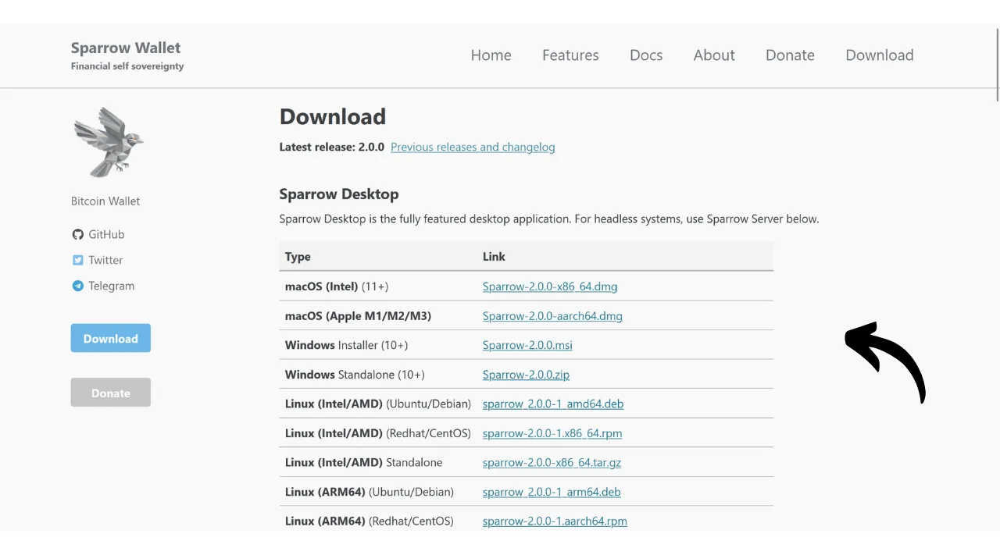
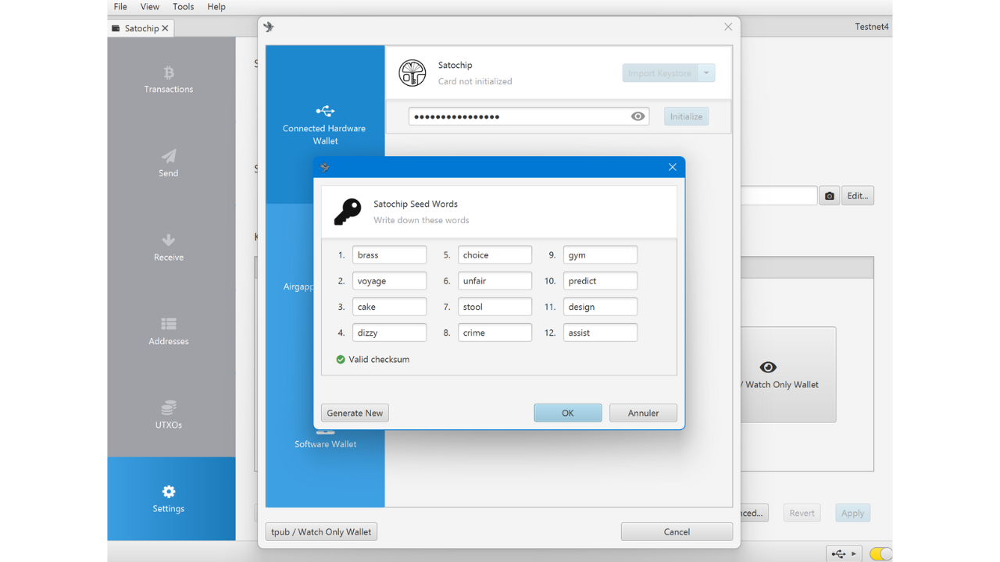
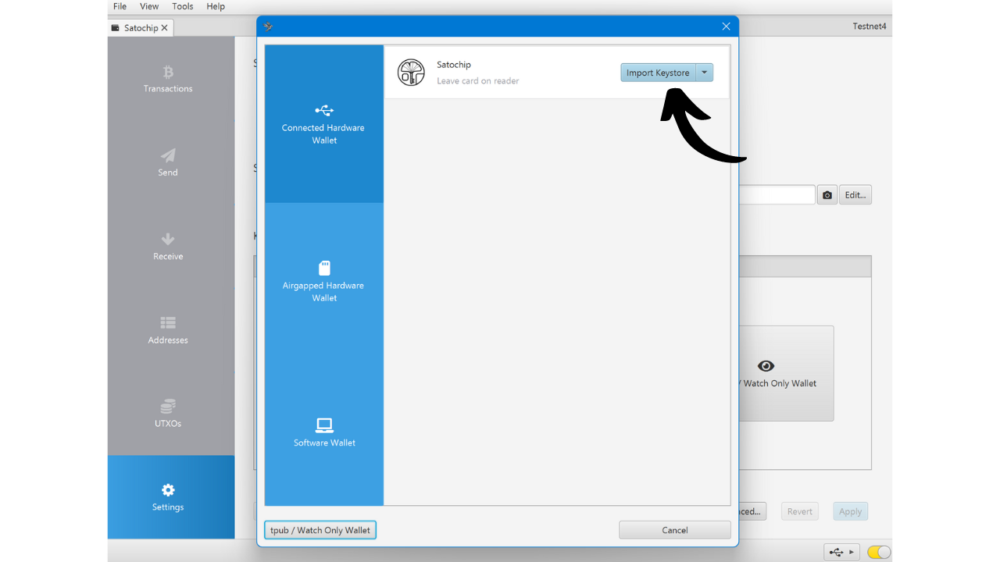
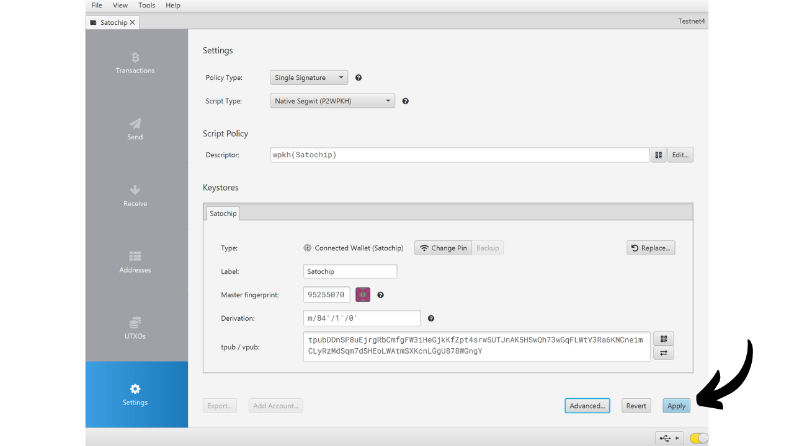

Laitelompakko on elektroninen laite, joka on omistettu Bitcoin-lompakon yksityisten avainten hallintaan ja turvaamiseen. Toisin kuin ohjelmistolompakot (tai kuumat lompakot), jotka on asennettu yleiskäyttöisiin laitteisiin, jotka ovat usein yhdistetty Internetiin, laitelompakot mahdollistavat yksityisten avainten fyysisen eristämisen, vähentäen hakkeroinnin ja varkauden riskejä.

Laitelompakon päätavoite on minimoida laitteen toiminnallisuudet vähentääkseen sen hyökkäyspintaa. Pienempi hyökkäyspinta tarkoittaa myös vähemmän mahdollisia hyökkäysvektoreita, eli vähemmän järjestelmän heikkouksia, joita hyökkääjät voisivat käyttää hyväkseen päästäkseen käsiksi bitcoineihin.

On suositeltavaa käyttää laitelompakkoa bitcoiniesi turvaamiseen, erityisesti jos omistat merkittäviä määriä, oli se sitten absoluuttisessa arvossa tai osuutena kokonaisvarallisuudestasi.

Laitelompakoita käytetään yhdessä lompakonhallintaohjelmiston kanssa tietokoneella tai älypuhelimella. Tämä ohjelmisto hallinnoi transaktioiden luomista, mutta transaktioiden vahvistamiseen tarvittava kryptografinen allekirjoitus tehdään yksinomaan laitelompakossa. Tämä tarkoittaa, että yksityiset avaimet eivät koskaan altistu mahdollisesti haavoittuvalle ympäristölle.

Laitelompakot tarjoavat kaksinkertaisen suojan käyttäjälle: toisaalta ne suojaavat bitcoinejasi etähyökkäyksiltä pitämällä yksityiset avaimet offline-tilassa, ja toisaalta ne tarjoavat yleensä paremman fyysisen vastustuskyvyn avainten uloskiristysyrityksiä vastaan. Ja juuri näiden 2 turvakriteerin perusteella voidaan arvioida ja vertailla markkinoilla olevia eri malleja.

Tässä oppaassa ehdotan yhden näistä ratkaisuista tutustumista: Satochip.

## Satochipin esittely

Satochip on laitelompakko kortin muodossa, jossa on *EAL6+* sertifioitu siru, mikä on erittäin korkea turvallisuusstandardi (*NXP JCOP*). Sen tuottaa belgialainen yritys.

Tämä älykortti myydään 25 eurolla, mikä on erittäin edullista verrattuna muihin markkinoilla oleviin laitelompakkoihin. Siru on turvallinen elementti, joka tarjoaa erittäin hyvän vastustuskyvyn fyysisiä hyökkäyksiä vastaan. Lisäksi sen koodi on avoimen lähdekoodin (*AGPLv3*).
Sen formaatin vuoksi Satochip ei kuitenkaan tarjoa yhtä monta vaihtoehtoa kuin muut laitteet. Siinä ei ole ilmeisesti akkua, kameraa eikä mikro SD -kortinlukijaa, koska se on kortti. Sen suurin haittapuoli, minun mielestäni, on laitelompakon näytön puuttuminen, mikä tekee siitä haavoittuvaisemman tietyntyyppisiä etähyökkäyksiä vastaan. Tämä pakottaa käyttäjän allekirjoittamaan sokeasti ja luottamaan siihen, mitä he näkevät tietokoneen näytöllä.

Huolimatta sen rajoituksista, Satochip pysyy mielenkiintoisena sen edullisen hinnan vuoksi. Tätä lompakkoa voidaan erityisesti käyttää parantamaan kulutuslompakon turvallisuutta lisäksi säästölompakkoon, joka on suojattu näytöllä varustetulla laitelompakolla. Se on myös hyvä ratkaisu niille, jotka omistavat pieniä määriä bitcoineja eivätkä halua investoida sataa euroa monimutkaisempaan laitteeseen. Lisäksi Satochipien käyttö multisig-kokoonpanoissa tai mahdollisesti tulevaisuudessa aikalukolla varustetuissa lompakkojärjestelmissä voi tarjota mielenkiintoisia etuja.

Satochip-yritys tarjoaa myös 2 muuta tuotetta. On Satodime, joka on haltijakortti suunniteltu varastoimaan bitcoineja offline-tilassa, mutta ei salli transaktioita. Se on eräänlainen paperilompakko, joka on paljon turvallisempi, ja sitä voidaan käyttää esimerkiksi lahjan antamiseen. Lopuksi on Seedkeeper, joka on muistilauseen hallinnoija. Sitä voidaan käyttää turvallisesti tallentamaan siemenemme ilman, että se on suoraan merkitty paperille.

## Kuinka ostaa Satochip?
Satochip on myynnissä [virallisella verkkosivustolla](https://satochip.io/product/satochip/). Jos haluat ostaa sen fyysisestä kaupasta, löydät [sertifioitujen jälleenmyyjien listan](https://satochip.io/resellers/) Satochipin verkkosivustolta.
Satochipin kanssa lompakonhallintaohjelmiston käyttöön on kaksi mahdollisuutta: NFC-viestinnän kautta tai älykortinlukijan avulla. NFC-vaihtoehdossa varmista, että koneesi on yhteensopiva tämän teknologian kanssa tai hanki ulkoinen NFC-lukija. Satochip toimii standarditaajuudella 13,56 MHz. Muussa tapauksessa voit myös ostaa älykortinlukijan. Voit löytää sellaisen Satochipin verkkosivustolta tai muualta.

## Kuinka asentaa Satochip Sparrow'n kanssa?

Kun olet vastaanottanut Satochipisi, ensimmäinen askel on tarkastaa pakkaus varmistaaksesi, ettei sitä ole avattu. Satochipin pakkauksen tulisi sisältää sinetöintitarra. Jos tämä tarra puuttuu tai on vahingoittunut, se voi viitata siihen, että älykortti on saattanut joutua kompromissin kohteeksi ja se ei ehkä ole aito.

Löydät Satochipin sisältä.

Lompakon hallintaan tässä oppaassa ehdotan Sparrow'n käyttöä. Jos sinulla ei vielä ole ohjelmistoa, [käy virallisella verkkosivustolla lataamassa se](https://sparrowwallet.com/download/). Voit myös tutustua tulevaan Sparrow Wallet -oppaaseemme.

Aseta Satochip älykortinlukijaan tai aseta se NFC-lukijalle ja yhdistä lukija tietokoneeseesi, jossa Sparrow on avoinna.

Avaa Sparrow Wallet ja varmista, että olet asianmukaisesti yhdistetty Bitcoin-noodiin. Tarkista tämä tarkistamalla merkki oikeassa alakulmassa: sen tulisi olla keltainen, jos olet yhdistetty julkiseen noodin, vihreä Bitcoin Core -yhteydelle tai sininen Electrumille.

Sparrow Walletissa, klikkaa "*File*" -välilehteä.

Sitten klikkaa "*New Wallet*" -valikkoa.

Valitse lompakollesi nimi ja klikkaa sitten "*Create Wallet*".

Klikkaa "*Connected Hardware Wallet*" -painiketta.

Klikkaa "*Scan...*" -painiketta.

Satochipisi pitäisi ilmestyä. Klikkaa "*Import Keystore*".

Seuraavaksi sinun täytyy asettaa PIN-koodi Satochipisi lukituksen avaamiseksi. Valitse vahva salasana, 4-16 merkkiä. Tee varmuuskopio tästä salasanasta.

Huomaa, että tämä salasana ei ole salalause. Tämä tarkoittaa, että vaikka sinulla ei olisi tätä salasanaa, mnemoninen lauseesi mahdollistaa lompakkosi uudelleen tuonnin ohjelmistoon tarvittaessa. Salasanaa käytetään vain pääsyn turvaamiseen itse Satochipiin. Se vastaa muiden laitteistolompakoiden PIN-koodia.

Kun salasana on syötetty, klikkaa uudelleen "*Import Keystore*" -painiketta.

Kirjaa salasana uudelleen, sitten klikkaa "*Initialize*" -painiketta.

Saatavillasi on nyt ikkuna, jossa voit luoda muistilauseesi. Klikkaa "*Luo Uusi*" -painiketta.

Tee yksi tai useampi fyysinen kopio palautuslauseestasi kirjoittamalla se paperille tai metallialustalle. Huomioi, että tämä lause antaa täyden pääsyn bitcoineihisi ilman lisäsuojausta. Siksi, jos joku löytäisi sen, he voisivat varastaa bitcoinsi välittömästi, vaikka heillä ei olisi pääsyä Satochipiisi tai sen PIN-koodiin. On siis tärkeää turvata nämä varmuuskopiot. Lisäksi tämä lause mahdollistaa pääsyn bitcoinsiisi takaisin menetyksen, Satochipin vahingoittumisen tai PIN-koodin unohtamisen tapauksessa.

Bitcoin-lompakkosi on nyt onnistuneesti luotu.

Klikkaa uudelleen "*Tuo Keystore*" -painiketta.

Lompakkosi on nyt luotu. Yksityiset avaimet on nyt tallennettu Satochipisi älykortille. Klikkaa "*Käytä*" -painiketta jatkaaksesi.

On suositeltavaa asettaa lisäsalasana suojaamaan Sparrow Walletin hallinnoimaa julkista tietoa, PIN-koodin lisäksi. Tämä salasana varmistaa pääsyn turvallisuuden Sparrow Walletiin, mikä auttaa suojaamaan julkisia avaimiasi, osoitteitasi ja transaktiohistoriaasi luvattomalta pääsyltä.

Syötä salasanasi molempiin kenttiin, sitten klikkaa "*Aseta Salasana*" -painiketta.

Ja siinä se on, Satochipisi on nyt määritetty Sparrow Walletiin.

Nyt kun lompakkosi on luotu, voit irrottaa Satochipisi. Säilytä se turvallisessa paikassa!

## Kuinka vastaanottaa bitcoineja Satochipin avulla?

Kun olet lompakossasi, klikkaa "*Vastaanota*" -välilehteä.

Sparrow Wallet luo osoitteen lompakollesi. Yleensä muiden laitteistolompakoiden kanssa neuvotaan klikkaamaan "*Näytä Osoite*" varmistaaksesi osoitteen suoraan laitteen näytöllä. Valitettavasti tämä vaihtoehto ei ole saatavilla Satochipin kanssa, mutta varmista käyttää sitä muiden lompakkojesi kanssa.

Voit lisätä "*Merkinnän*" kuvaamaan bitcoineja, jotka turvataan tällä osoitteella. Tämä on hyvä käytäntö, joka auttaa sinua hallitsemaan UTXOjasi paremmin.

Lisätietoja merkinnöistä suosittelen tarkistamaan myös tämän toisen oppaan:

https://planb.network/tutorials/privacy/utxo-labelling

Voit sitten käyttää tätä osoitetta vastaanottaaksesi bitcoineja.

## Kuinka lähettää bitcoineja Satochipin avulla?
Nyt kun olet vastaanottanut ensimmäiset satsisi turvallisessa lompakossasi Satochipin avulla, voit myös käyttää niitä! Yhdistä Satochip tietokoneeseesi, käynnistä Sparrow Wallet ja siirry sitten "*Lähetä*" -välilehteen luodaksesi uuden transaktion.

Jos haluat suorittaa kolikoiden hallinnan, eli valita erityisesti, mitkä UTXO:t kulutetaan siirrossa, siirry "*UTXO:t*" -välilehteen. Valitse UTXO:t, jotka haluat käyttää, ja klikkaa sitten "*Lähetä valitut*". Sinut ohjataan samalle näytölle kuin "*Lähetä*" -välilehdellä, mutta valitsemasi UTXO:t on jo valittu siirtoa varten.

Syötä kohdeosoite. Voit myös syöttää useita osoitteita klikkaamalla "*+ Lisää*" -painiketta.

Merkitse muistiinpano "*Label*" muistaaksesi tämän menon tarkoituksen.

Valitse tämän osoitteen saama summa.

Säädä siirtomaksusi määrää nykyisen markkinatilanteen mukaan.

Varmista, että kaikki siirron parametrit ovat oikein, ja klikkaa sitten "*Luo siirto*".

Jos kaikki on mielestäsi kunnossa, klikkaa "*Viimeistele siirto allekirjoitusta varten*".

Klikkaa "*Allekirjoita*".

Klikkaa uudelleen "*Allekirjoita*" vieressä olevaa Satochipiäsi.

Syötä Satochipisi PIN-koodi ja klikkaa sitten uudelleen "*Allekirjoita*" allekirjoittaaksesi siirtosi.

Siirtosi on nyt allekirjoitettu. Klikkaa "*Lähetä siirto*" lähettääksesi sen Bitcoin-verkkoon.

Löydät sen Sparrow Walletin "*Siirrot*" -välilehdeltä.

Onnittelut, nyt osaat käyttää Satochipiä! Jos pidit tätä opasta hyödyllisenä, arvostaisin peukkua ylöspäin alla. Voit vapaasti jakaa tämän artikkelin sosiaalisissa verkostoissasi. Kiitos paljon!