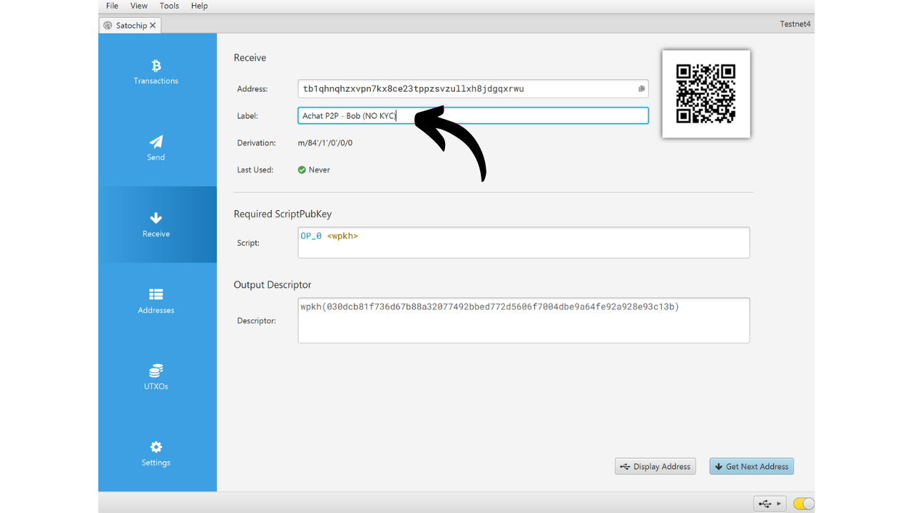
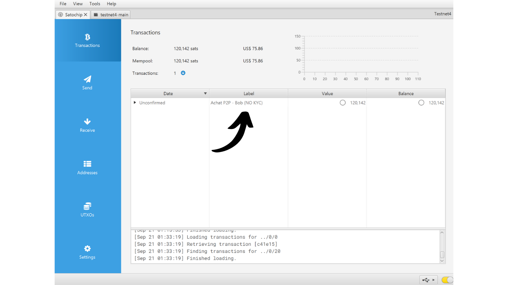

Un hardware wallet est un dispositif électronique dédié à la gestion et à la sécurisation des clés privées d'un portefeuille Bitcoin. Contrairement aux portefeuilles logiciels (ou portefeuilles chauds) installés sur des machines généralistes souvent connectées à Internet, les hardware wallets permettent d'isoler physiquement les clés privées, ce qui réduit les risques de piratage et de vol.

Le principal objectif d'un hardware wallet est de réduire au maximum les fonctionnalités de l'appareil afin de minimiser sa surface d'attaque. Moins de surface d'attaque, ça veut également dire moins de potentiels vecteurs d'attaque, c'est-à-dire moins de points faibles dans le système que les attaquants pourraient exploiter pour accéder aux bitcoins. 

Il est recommandé d'utiliser un hardware wallet pour sécuriser vos bitcoins, surtout si vous en détenez des quantités importantes, que ce soit en valeur absolue ou en proportion de votre patrimoine total.

Les hardware wallets s’utilisent en combinaison avec un logiciel de gestion de portefeuille sur un ordinateur ou un smartphone. Ce dernier permet de gérer la création des transactions, mais la signature cryptographique nécessaire pour rendre valide ces transactions se fait uniquement au sein du hardware wallet. Cela signifie que les clés privées ne sont jamais exposées à un environnement potentiellement vulnérable.

Les hardware wallets offrent une double protection pour l'utilisateur : d'une part, ils sécurisent vos bitcoins contre les attaques à distance en gardant les clés privées hors ligne, et d'autre part, ils offrent généralement une meilleure résistance physique face aux tentatives d'extraction des clés. Et c'est justement sur ces 2 critères de sécurité que l'on peut juger et classer les différents modèles existants sur le marché.

Dans ce tutoriel, je vous propose de découvrir une de ces solutions : le Satochip.

## Présentation du Satochip

Le Satochip est un hardware wallet sous forme de carte avec une puce certifiée *EAL6+*, qui est un standard de sécurité très élevé (*NXP JCOP*). Il est produit par une société Belge.

Cette carte à puce est vendue 25 €, ce qui est très abordable par rapport aux autres hardware wallets disponibles sur le marché. La puce est un élément sécurisé qui lui assure une très bonne résistance face aux attaques physiques. De plus, son code est open-source (*AGPLv3*).

Cependant, de par son format, Le Satochip ne propose pas autant d'options que les autres matériels. Il n'y a évidemment pas de batterie, pas de caméra, ni de lecteur de micro SD, car c'est une carte. Son plus gros inconvénient selon moi est l'absence d'écran sur le hardware wallet, ce qui le rend plus vulnérable à certains types d'attaques à distance. En effet, cela force l'utilisateur à signer à l'aveugle et à faire confiance à ce qu'il voit sur l'écran de son ordinateur.

Malgré ses limitations, le Satochip reste intéressant en raison de son prix réduit. Ce wallet peut notamment servir à renforcer la sécurité d'un portefeuille de dépenses en complément d'un portefeuille d'épargne protégé par un hardware wallet équipé d'un écran. Il constitue également une bonne solution pour ceux qui détiennent de faibles montants de bitcoins et ne souhaitent pas investir une centaine d'euros dans un dispositif plus sophistiqué. De plus, l'utilisation de Satochips dans des configurations multisig, ou potentiellement dans des systèmes de portefeuille avec timelock à l'avenir, peut offrir des avantages intéressants.

La société Satochip propose également 2 autres produits. Il y a le Satodime qui est une carte au porteur conçue pour stocker des bitcoins hors ligne, mais qui ne permet pas de réaliser des transactions. C'est une sorte de paper wallet bien plus sécurisé, qui peut être utilisé par exemple pour faire un cadeau. Enfin, il y a le Seedkeeper, qui est un gestionnaire de phrases mnémonique. On peut l'utiliser pour sauvegarder notre seed de manière sécurisée, sans qu'elle soit notée directement sur un bout de papier.

## Comment acheter un Satochip ?

Le Satochip est disponible à la vente [sur le site officiel](https://satochip.io/product/satochip/). Pour l'acheter dans une boutique physique, vous pouvez également retrouver [la liste des revendeurs certifiés](https://satochip.io/resellers/) sur le site de Satochip.

Pour interagir avec votre logiciel de gestion de portefeuille, le Satochip offre deux possibilités : par communication NFC ou via un lecteur de carte à puce. Pour l'option NFC, assurez-vous que votre machine est compatible avec cette technologie ou procurez-vous un lecteur NFC externe. Le Satochip opère à la fréquence standard de 13,56 MHz. Sinon, vous pouvez aussi acheter un lecteur de carte à puce. Vous pouvez en trouver un sur le site de Satochip ou ailleurs.

## Comment configurer un Satochip avec Sparrow ?

Une fois votre Satochip reçu, la première étape consiste à examiner l'emballage pour s'assurer qu'il n'a pas été ouvert. L'emballage du Satochip doit comporter un autocollant de scellement. Si cet autocollant est manquant ou endommagé, cela pourrait indiquer que la carte à puce a été compromise et qu'elle pourrait ne pas être authentique.

Vous trouverez le Satochip à l'intérieur.

Pour gérer le portefeuille, dans ce tutoriel, je vous propose d'utiliser Sparrow. Si vous ne disposez pas encore du logiciel, [rendez-vous sur le site officiel pour le télécharger](https://sparrowwallet.com/download/). Vous pouvez également consulter notre tutoriel sur Sparrow Wallet (bientôt disponible).

Je vous recommande fortement de vérifier à la fois l'authenticité (avec GnuPG) et l'intégrité (via le hash) de Sparrow avant de l'installer sur votre machine. Si vous ne savez pas comment le faire, vous pouvez suivre cet autre tutoriel :

https://planb.network/tutorials/others/integrity-authenticity

Insérez votre Satochip dans le lecteur de carte à puce ou déposez-le sur le lecteur NFC, et brancher le lecteur à votre ordinateur sur lequel Sparrow est ouvert.

Ouvrez Sparrow Wallet et assurez-vous d'être correctement connecté à un nœud Bitcoin. Pour cela, vérifiez la coche en bas à droite : elle doit être jaune si vous êtes connecté à un nœud public, verte pour une connexion à Bitcoin Core, ou bleue pour Electrum.

Sur Sparrow Wallet, cliquez sur l'onglet "*File*".

Puis sur le menu "*New Wallet*".

Choisissez un nom pour votre portefeuille puis cliquez sur "*Create Wallet*".

Cliquez sur le bouton "*Connected Hardware Wallet*".

Cliquez sur le bouton "*Scan...*".

Votre Satochip devrait apparaître. Cliquez sur "*Import Keystore*".

Ensuite, vous devez établir un code PIN pour déverrouiller votre Satochip. Choisissez un mot de passe fort, entre 4 et 16 caractères. Faites une sauvegarde de ce mot de passe.

Attention, ce mot de passe n'est pas une passphrase. Cela signifie que même sans ce mot de passe, votre phrase mnémonique vous permettra de réimporter votre portefeuille sur un logiciel si nécessaire. Le mot de passe sert uniquement à sécuriser l'accès au Satochip lui-même. C'est l'équivalent du code PIN que vous pouvez retrouver sur les autres hardware wallets.

Une fois le mot de passe renseigné, cliquez de nouveau sur le bouton "*Import Keystore*".

Notez de nouveau le mot de passe, puis cliquez sur le bouton "*Initialize*".

Vous arrivez ensuite sur la fenêtre permettant la génération de votre phrase mnémonique. Cliquez sur le bouton "*Generate New*".

Effectuez une ou plusieurs copies physiques de votre phrase de récupération, en l'inscrivant sur un support en papier ou en métal. Attention, cette phrase donne un accès total à vos bitcoins, sans aucune protection supplémentaire. Ainsi, si quelqu'un parvenait à la découvrir, il pourrait vous dérober vos bitcoins instantanément, même sans avoir accès à votre Satochip ou à son code PIN. Il est donc important de sécuriser ces sauvegardes. Par ailleurs, cette phrase vous permet de récupérer l'accès à vos bitcoins en cas de perte, de casse du Satochip, ou d'oubli de votre code PIN.

Votre portefeuille Bitcoin a bien été créé.

Cliquez de nouveau sur le bouton "*Import Keystore*".

Votre portefeuille est bien créé. Vos clés privées sont dorénavant stockées sur la smartcard de votre Satochip. Cliquez sur le bouton "*Apply*" pour continuer.

Il est recommandé de configurer un mot de passe supplémentaire pour sécuriser les informations publiques gérées par Sparrow Wallet, en plus du code PIN de votre Satochip. Ce mot de passe assurera la sécurité de l'accès à Sparrow Wallet, ce qui permet de protéger vos clés publiques, vos adresses et l'historique de vos transactions contre tout accès non autorisé.

Renseignez votre mot de passe dans les 2 cases, puis cliquez sur le bouton "*Set Password*".

Et voilà, votre Satochip est bien configuré sur Sparrow Wallet.

Maintenant que votre portefeuille est créé, vous pouvez déconnecter votre Satochip. Conservez-le en lieu sûr !

## Comment recevoir des bitcoins avec le Satochip ?

Une fois sur votre portefeuille, cliquez sur l'onglet "*Receive*"

Sparrow Wallet vous génère une adresse de votre portefeuille. Habituellement, pour les autres hardware wallets, il est conseillé de cliquer sur "*Display Address*" afin de vérifier l'adresse directement sur l'écran du dispositif. Malheureusement, cette option n'est pas disponible avec le Satochip, mais assurez-vous de l'utiliser pour vos autres portefeuilles.

Vous pouvez ajouter un "*Label*" pour décrire la source des bitcoins qui seront sécurisés avec cette adresse. C'est une bonne pratique qui vous permet de mieux gérer vos UTXOs.

Pour plus d'informations sur l'étiquetage, je vous conseille également de découvrir cet autre tutoriel :

https://planb.network/tutorials/privacy/utxo-labelling

Vous pouvez ensuite utiliser cette adresse pour recevoir des bitcoins.

## Comment envoyer des bitcoins avec le Satochip ?

Maintenant que vous avez reçu vos premiers sats sur votre portefeuille sécurisé avec le Satochip, vous pouvez également les dépenser ! Connectez votre Satochip à votre ordinateur, lancez Sparrow Wallet, puis allez dans l'onglet "*Send*" pour construire une nouvelle transaction.

Si vous souhaitez faire du coin control, c'est-à-dire choisir spécifiquement quels UTXOs consommer dans la transaction, rendez-vous dans l'onglet "*UTXOs*". Sélectionnez les UTXOs que vous souhaitez dépenser, puis cliquez sur "*Send Selected*". Vous serez redirigé vers le même écran de l'onglet "*Send*", mais avec vos UTXOs déjà sélectionnés pour la transaction.

Entrez l'adresse de destination. Vous pouvez également entrer plusieurs adresses en cliquant sur le bouton "*+ Add*".

Notez un "*Label*" pour vous souvenir de l'objet de cette dépense.

Choisissez le montant envoyé à cette adresse.

Ajustez le taux de frais de votre transaction en fonction du marché du moment.

Assurez-vous que tous les paramètres de votre transaction sont corrects, puis cliquez sur "*Create Transaction*".

Si tout vous convient, cliquez sur "*Finalize Transaction for Signing*".

Cliquez sur "*Sign*".

Cliquez sur "*Sign*" de nouveau à côté de votre Satochip.

Entrez le code PIN de votre Satochip, puis cliquez de nouveau sur "*Sign*" pour signer votre transaction.

Votre transaction est désormais signée. Cliquez sur "*Broadcast Transaction*" pour la diffuser au réseau Bitcoin.

Vous pouvez la retrouver dans l'onglet "*Transactions*" de Sparrow Wallet.

Félicitations, vous êtes maintenant au point sur l'utilisation du Satochip ! Si vous avez trouvé ce tutoriel utile, je vous serais reconnaissant de laisser un pouce vert ci-dessous. N'hésitez pas à partager cet article sur vos réseaux sociaux. Merci beaucoup !
