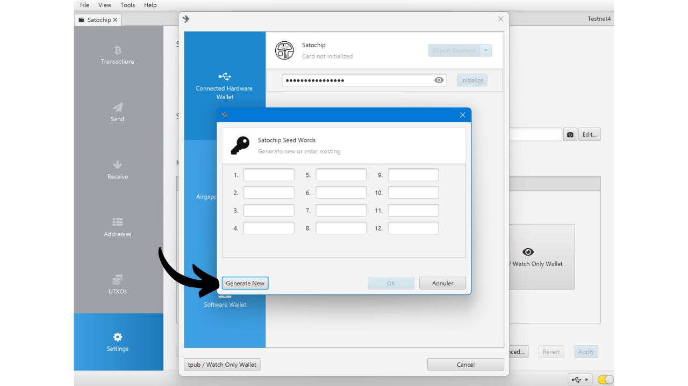
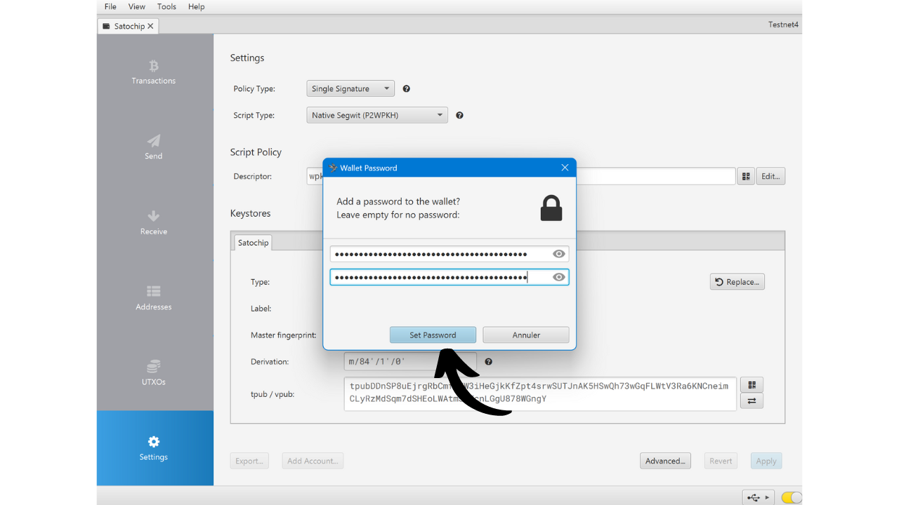
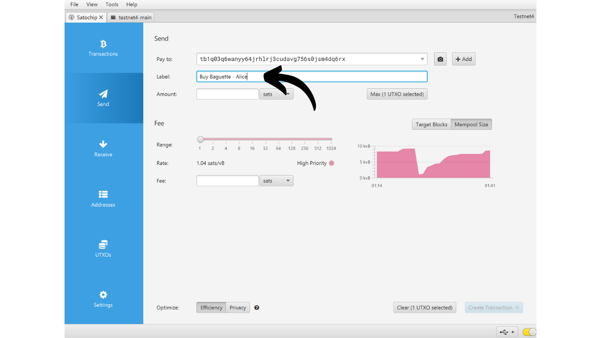
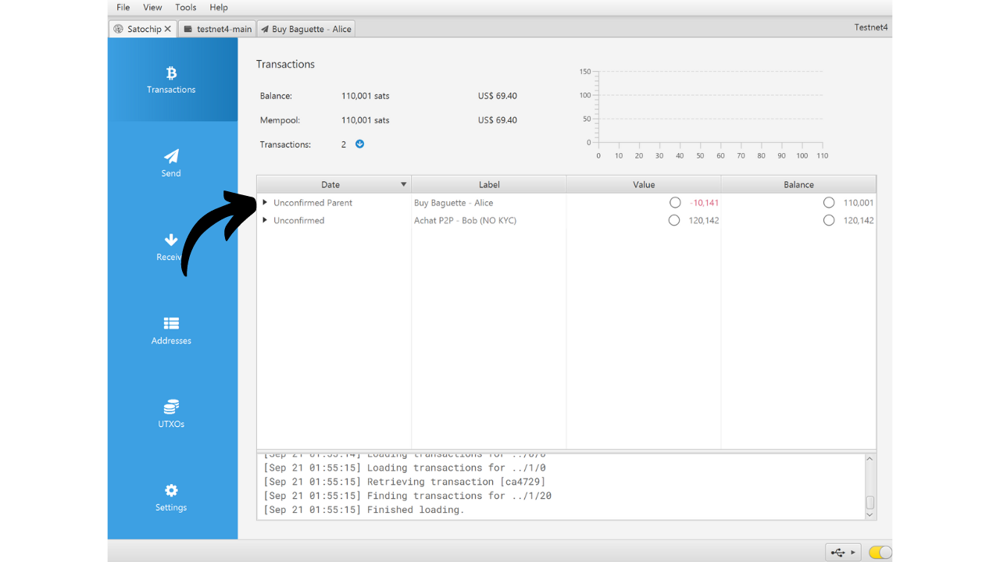

Dompet perangkat keras adalah perangkat elektronik yang didedikasikan untuk mengelola dan mengamankan kunci privat dari dompet Bitcoin. Berbeda dengan dompet perangkat lunak (atau dompet panas) yang dipasang pada mesin umum yang sering terhubung ke Internet, dompet perangkat keras memungkinkan isolasi fisik dari kunci privat, mengurangi risiko peretasan dan pencurian.

Tujuan utama dari dompet perangkat keras adalah untuk meminimalkan fungsionalitas perangkat untuk mengurangi permukaan serangannya. Permukaan serangan yang lebih kecil juga berarti lebih sedikit vektor serangan potensial, yaitu, lebih sedikit kelemahan dalam sistem yang dapat dimanfaatkan oleh penyerang untuk mengakses bitcoin.

Disarankan untuk menggunakan dompet perangkat keras untuk mengamankan bitcoin Anda, terutama jika Anda memiliki jumlah yang signifikan, baik dalam nilai absolut maupun sebagai proporsi dari total aset Anda.

Dompet perangkat keras digunakan bersama dengan perangkat lunak manajemen dompet pada komputer atau smartphone. Perangkat lunak ini mengelola pembuatan transaksi, tetapi tanda tangan kriptografis yang diperlukan untuk memvalidasi transaksi ini dilakukan sepenuhnya di dalam dompet perangkat keras. Ini berarti bahwa kunci privat tidak pernah terpapar ke lingkungan yang berpotensi rentan.

Dompet perangkat keras menawarkan perlindungan ganda bagi pengguna: di satu sisi, mereka mengamankan bitcoin Anda dari serangan jarak jauh dengan menjaga kunci privat offline, dan di sisi lain, mereka umumnya menawarkan resistensi fisik yang lebih baik terhadap upaya untuk mengekstrak kunci. Dan tepat pada 2 kriteria keamanan ini, seseorang dapat menilai dan meranking model yang berbeda yang tersedia di pasar.

Dalam tutorial ini, saya mengusulkan untuk menemukan salah satu solusi ini: Satochip.

## Pengenalan ke Satochip

Satochip adalah dompet perangkat keras dalam bentuk kartu dengan chip bersertifikat *EAL6+*, yang merupakan standar keamanan yang sangat tinggi (*NXP JCOP*). Ini diproduksi oleh sebuah perusahaan Belgia.

Kartu pintar ini dijual seharga €25, yang sangat terjangkau dibandingkan dengan dompet perangkat keras lain di pasar. Chip adalah elemen aman yang memastikan resistensi yang sangat baik terhadap serangan fisik. Selain itu, kodenya bersifat open-source (*AGPLv3*).
Namun, karena formatnya, Satochip tidak menawarkan sebanyak opsi seperti perangkat keras lainnya. Jelas tidak ada baterai, tidak ada kamera, juga tidak ada pembaca kartu micro SD, karena ini adalah kartu. Kelemahan terbesar menurut saya adalah tidak adanya layar pada dompet perangkat keras, yang membuatnya lebih rentan terhadap beberapa jenis serangan jarak jauh. Memang, ini memaksa pengguna untuk menandatangani secara buta dan mempercayai apa yang mereka lihat di layar komputer mereka.

Meskipun memiliki keterbatasan, Satochip tetap menarik karena harganya yang murah. Dompet ini dapat digunakan untuk meningkatkan keamanan dompet pengeluaran selain dompet tabungan yang dilindungi oleh dompet perangkat keras yang dilengkapi dengan layar. Ini juga merupakan solusi yang baik bagi mereka yang memiliki jumlah bitcoin yang kecil dan tidak ingin menginvestasikan seratus euro dalam perangkat yang lebih canggih. Selain itu, penggunaan Satochip dalam konfigurasi multisig, atau potensial dalam sistem dompet dengan timelock di masa depan, dapat menawarkan keuntungan yang menarik.

Perusahaan Satochip juga menawarkan 2 produk lain. Ada Satodime, yang merupakan kartu pemegang yang dirancang untuk menyimpan bitcoin secara offline, tetapi tidak memungkinkan untuk transaksi. Ini semacam dompet kertas yang jauh lebih aman, yang dapat digunakan, misalnya, untuk membuat hadiah. Akhirnya, ada Seedkeeper, yang merupakan manajer frasa mnemonik. Ini dapat digunakan untuk menyimpan seed kita secara aman tanpa harus langsung dicatat di selembar kertas.

## Bagaimana cara membeli Satochip?
Satochip sudah tersedia untuk dijual [di situs resmi](https://satochip.io/product/satochip/). Untuk membelinya di toko fisik, Anda juga bisa menemukan [daftar reseller resmi](https://satochip.io/resellers/) di situs web Satochip.
Untuk berinteraksi dengan perangkat lunak manajemen dompet Anda, Satochip menawarkan dua kemungkinan: melalui komunikasi NFC atau melalui pembaca kartu pintar. Untuk opsi NFC, pastikan mesin Anda kompatibel dengan teknologi ini atau dapatkan pembaca NFC eksternal. Satochip beroperasi pada frekuensi standar 13.56 MHz. Jika tidak, Anda juga bisa membeli pembaca kartu pintar. Anda bisa menemukannya di situs web Satochip atau tempat lain.

## Bagaimana cara mengatur Satochip dengan Sparrow?

Setelah Anda menerima Satochip Anda, langkah pertama adalah memeriksa kemasannya untuk memastikan tidak ada yang terbuka. Kemasan Satochip harus mencakup stiker segel. Jika stiker ini hilang atau rusak, itu bisa menunjukkan bahwa kartu pintar telah dikompromikan dan mungkin tidak asli.

Anda akan menemukan Satochip di dalamnya.

Untuk mengelola dompet, dalam tutorial ini, saya menyarankan menggunakan Sparrow. Jika Anda belum memiliki perangkat lunaknya, [kunjungi situs resmi untuk mengunduhnya](https://sparrowwallet.com/download/). Anda juga bisa melihat tutorial kami tentang Sparrow Wallet (segera hadir).

Masukkan Satochip Anda ke dalam pembaca kartu pintar atau letakkan di atas pembaca NFC, dan sambungkan pembaca ke komputer Anda yang telah membuka Sparrow.

Buka Sparrow Wallet dan pastikan Anda terhubung dengan benar ke node Bitcoin. Untuk melakukan ini, periksa tanda centang di kanan bawah: seharusnya kuning jika Anda terhubung ke node publik, hijau untuk koneksi ke Bitcoin Core, atau biru untuk Electrum.

Di Sparrow Wallet, klik pada tab "*File*".

Kemudian pada menu "*New Wallet*".

Pilih nama untuk dompet Anda kemudian klik pada "*Create Wallet*".

Klik pada tombol "*Connected Hardware Wallet*".

Klik pada tombol "*Scan...*".

Satochip Anda seharusnya muncul. Klik pada "*Import Keystore*".

Selanjutnya, Anda perlu mengatur kode PIN untuk membuka kunci Satochip Anda. Pilih kata sandi yang kuat, antara 4 dan 16 karakter. Buat cadangan kata sandi ini.

Perlu diketahui, kata sandi ini bukan passphrase. Ini berarti bahwa bahkan tanpa kata sandi ini, frasa mnemonik Anda akan memungkinkan Anda untuk mengimpor ulang dompet Anda ke dalam perangkat lunak jika diperlukan. Kata sandi hanya digunakan untuk mengamankan akses ke Satochip itu sendiri. Ini setara dengan kode PIN yang ditemukan pada dompet perangkat keras lainnya.

Setelah kata sandi dimasukkan, klik lagi pada tombol "*Import Keystore*".

Catat lagi kata sandi tersebut, kemudian klik pada tombol "*Initialize*".

Anda kemudian sampai pada jendela untuk menghasilkan frasa mnemonik Anda. Klik tombol "*Generate New*".

Buat satu atau lebih salinan fisik dari frasa pemulihan Anda dengan menuliskannya di atas kertas atau media logam. Sadarilah, frasa ini memberikan akses penuh ke bitcoin Anda tanpa perlindungan tambahan. Oleh karena itu, jika seseorang menemukannya, mereka bisa langsung mencuri bitcoin Anda, bahkan tanpa akses ke Satochip Anda atau kode PIN-nya. Oleh karena itu, penting untuk mengamankan cadangan ini. Selain itu, frasa ini memungkinkan Anda untuk mendapatkan kembali akses ke bitcoin Anda dalam kasus kehilangan, kerusakan pada Satochip, atau jika Anda lupa kode PIN Anda.

Dompet Bitcoin Anda telah berhasil dibuat.

Klik lagi pada tombol "*Import Keystore*".

Dompet Anda sekarang telah dibuat. Kunci privat Anda sekarang disimpan pada smartcard Satochip Anda. Klik pada tombol "*Apply*" untuk melanjutkan.

Disarankan untuk menetapkan kata sandi tambahan untuk mengamankan informasi publik yang dikelola oleh Sparrow Wallet, selain dari kode PIN Satochip Anda. Kata sandi ini akan memastikan keamanan akses ke Sparrow Wallet, yang membantu melindungi kunci publik Anda, alamat, dan riwayat transaksi dari akses tidak sah.

Masukkan kata sandi Anda di dua kolom, lalu klik pada tombol "*Set Password*".

Dan begitulah, Satochip Anda sekarang telah dikonfigurasi di Sparrow Wallet.

Sekarang dompet Anda telah dibuat, Anda dapat mencabut Satochip Anda. Simpan di tempat yang aman!

## Bagaimana cara menerima bitcoin dengan Satochip?

Setelah berada di dompet Anda, klik pada tab "*Receive*".

Sparrow Wallet menghasilkan alamat untuk dompet Anda. Biasanya, untuk dompet hardware lainnya, disarankan untuk mengklik pada "*Display Address*" untuk memverifikasi alamat langsung di layar perangkat. Sayangnya, opsi ini tidak tersedia dengan Satochip, tetapi pastikan untuk menggunakannya untuk dompet lain Anda.

Anda dapat menambahkan "*Label*" untuk mendeskripsikan sumber bitcoin yang akan diamankan dengan alamat ini. Ini adalah praktik yang baik yang membantu Anda mengelola UTXO Anda dengan lebih baik.

Untuk informasi lebih lanjut tentang pelabelan, saya juga merekomendasikan untuk memeriksa tutorial lain ini:

https://planb.network/tutorials/privacy/utxo-labelling

Anda kemudian dapat menggunakan alamat ini untuk menerima bitcoin.

## Bagaimana cara Mengirim Bitcoin dengan Satochip?
Sekarang setelah Anda menerima sats pertama Anda di dompet aman Anda dengan Satochip, Anda juga dapat menghabiskannya! Sambungkan Satochip Anda ke komputer, luncurkan Sparrow Wallet, dan kemudian pergi ke tab "*Send*" untuk membuat transaksi baru.

Jika Anda ingin melakukan kontrol koin, yaitu, memilih secara spesifik UTXO mana yang akan digunakan dalam transaksi, buka tab "*UTXOs*". Pilih UTXO yang ingin Anda gunakan, kemudian klik pada "*Kirim Terpilih*". Anda akan diarahkan ke layar yang sama dengan tab "*Kirim*", tetapi dengan UTXO Anda yang sudah dipilih untuk transaksi.

Masukkan alamat tujuan. Anda juga dapat memasukkan beberapa alamat dengan mengklik tombol "*+ Tambah*".

Catat sebuah "*Label*" untuk mengingat tujuan dari pengeluaran ini.

Pilih jumlah yang akan dikirim ke alamat ini.

Sesuaikan tarif biaya transaksi Anda sesuai dengan pasar saat ini.

Pastikan semua parameter transaksi Anda sudah benar, kemudian klik pada "*Buat Transaksi*".

Jika semuanya sesuai dengan keinginan Anda, klik pada "*Finalisasi Transaksi untuk Ditandatangani*".

Klik pada "*Tanda Tangan*".

Klik pada "*Tanda Tangan*" lagi di sebelah Satochip Anda.

Masukkan kode PIN Satochip Anda, kemudian klik pada "*Tanda Tangan*" lagi untuk menandatangani transaksi Anda.

Transaksi Anda sekarang sudah ditandatangani. Klik pada "*Siarkan Transaksi*" untuk menyiarkannya ke jaringan Bitcoin.

Anda dapat menemukannya di tab "*Transaksi*" dari Sparrow Wallet.

Selamat, Anda sekarang sudah mengerti cara menggunakan Satochip! Jika Anda merasa tutorial ini bermanfaat, saya akan sangat menghargai jempol ke atas di bawah ini. Jangan ragu untuk membagikan artikel ini di jaringan sosial Anda. Terima kasih banyak!