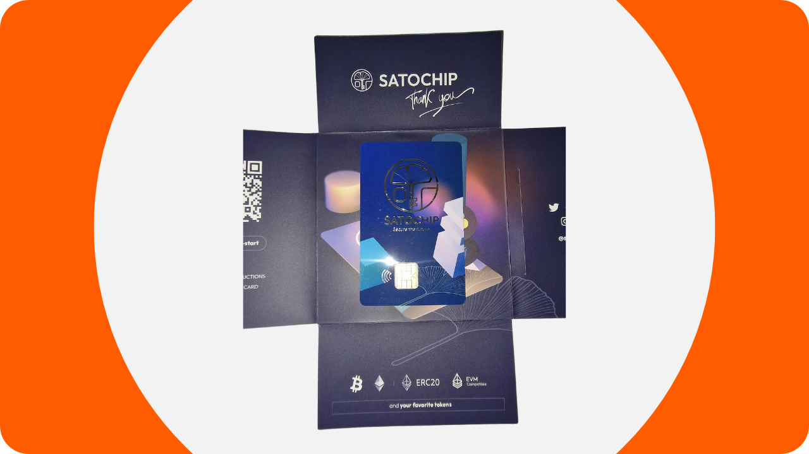
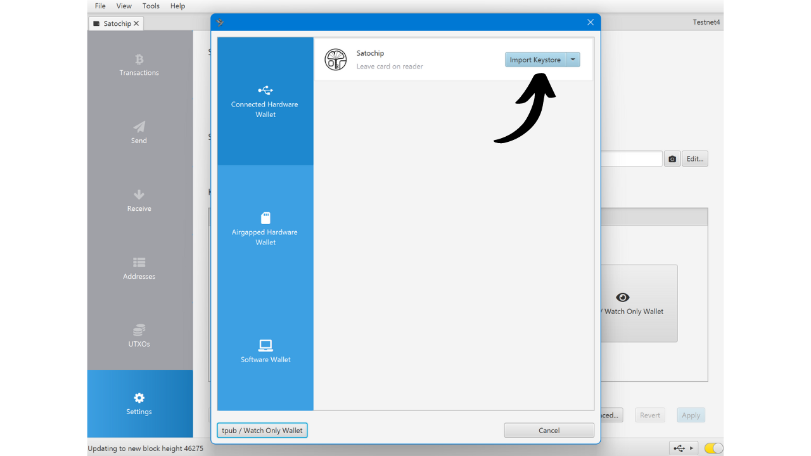
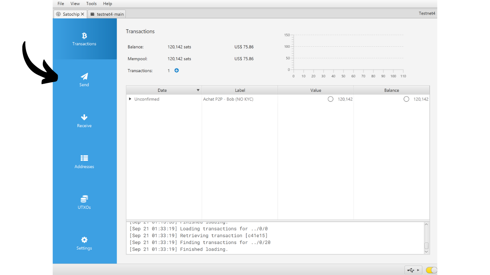
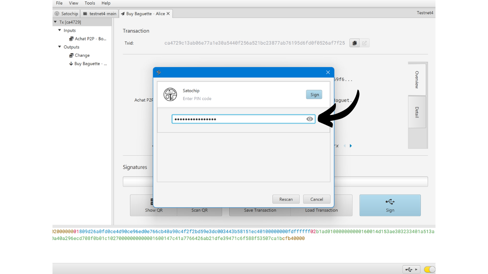

ハードウェアウォレットは、ビットコインウォレットの秘密鍵を管理し保護するために専用された電子デバイスです。インターネットに接続されることが多い汎用機器にインストールされるソフトウェアウォレット（またはホットウォレット）とは異なり、ハードウェアウォレットは秘密鍵の物理的な隔離を可能にし、ハッキングや盗難のリスクを減少させます。

ハードウェアウォレットの主な目的は、デバイスの機能を最小限に抑えることで攻撃対象面を減少させることです。攻撃対象面が小さいということは、攻撃者がビットコインにアクセスするために悪用可能なシステムの弱点、つまり潜在的な攻撃ベクトルが少ないことを意味します。

特に大量のビットコインを保有している場合、絶対値であれ資産全体の割合であれ、ビットコインを保護するためにハードウェアウォレットの使用が推奨されます。

ハードウェアウォレットは、コンピューターやスマートフォン上のウォレット管理ソフトウェアと組み合わせて使用されます。このソフトウェアはトランザクションの作成を管理しますが、これらのトランザクションを検証するために必要な暗号署名は、ハードウェアウォレット内でのみ行われます。これは、秘密鍵が潜在的に脆弱な環境にさらされることがないことを意味します。

ハードウェアウォレットは、ユーザーに対して二重の保護を提供します：一方で、秘密鍵をオフラインに保持することでリモート攻撃からビットコインを保護し、他方で、鍵を抽出しようとする試みに対して物理的により良い耐性を一般的に提供します。そして、これら2つのセキュリティ基準に基づいて市場に出回っている異なるモデルを評価しランク付けすることができます。

このチュートリアルでは、これらのソリューションの一つであるSatochipを紹介します。

## Satochipの紹介

Satochipは、*EAL6+* 認証チップを搭載したカード形式のハードウェアウォレットで、非常に高いセキュリティ基準（*NXP JCOP*）です。これはベルギーの会社によって製造されています。

このスマートカードは€25で販売されており、市場に出回っている他のハードウェアウォレットと比較して非常に手頃な価格です。チップはセキュアエレメントであり、物理的な攻撃に対して非常に良い耐性を確保します。さらに、そのコードはオープンソース（*AGPLv3*）です。
しかし、その形式のため、Satochipは他のハードウェアと比べて多くのオプションを提供しません。明らかに、バッテリー、カメラ、またはマイクロSDカードリーダーはありません。それはカードだからです。私の意見では、最大の欠点は、ハードウェアウォレットに画面がないことで、これにより特定のタイプのリモート攻撃に対してより脆弱になります。実際、これはユーザーに盲目的に署名を行わせ、コンピューター画面に表示されているものを信頼するよう強いることになります。

その制限にもかかわらず、Satochipはその低価格のために興味深いままです。このウォレットは、画面付きのハードウェアウォレットで保護された貯蓄ウォレットに加えて、支出ウォレットのセキュリティを強化するために特に使用することができます。また、数百ユーロをより洗練されたデバイスに投資したくないが少量のビットコインを保有している人々にとって良い解決策を構成します。さらに、マルチシグ構成でのSatochipsの使用、または将来的にはタイムロックを備えたウォレットシステムでの潜在的な使用は、興味深い利点を提供する可能性があります。

Satochip会社は他に2つの製品を提供しています。Satodimeは、ビットコインをオフラインで保存するために設計された所有者カードで、トランザクションを許可しません。これは、例えばギフトとして使用できる、はるかに安全な種類のペーパーウォレットです。最後に、Seedkeeperはニーモニックフレーズマネージャーです。これは、種を紙に直接記載することなく安全に保存するために使用できます。

## Satochipを購入する方法は？
Satochipは、[公式ウェブサイト](https://satochip.io/product/satochip/)で販売されています。実店舗で購入したい場合は、Satochipウェブサイト上で[認定リセラーのリスト](https://satochip.io/resellers/)を見つけることができます。
ウォレット管理ソフトウェアとのやり取りには、SatochipがNFC通信またはスマートカードリーダーを介して2つの方法を提供しています。NFCオプションを使用する場合は、お使いの機器がこの技術に対応しているか、または外部NFCリーダーを入手していることを確認してください。Satochipは標準周波数の13.56 MHzで動作します。それ以外の場合は、スマートカードリーダーを購入することもできます。Satochipウェブサイトまたは他の場所で購入することができます。

## Sparrowを使ってSatochipを設定する方法は？

Satochipを受け取ったら、最初のステップはパッケージングを検査して、開封されていないことを確認することです。Satochipのパッケージには、封印ステッカーが含まれているべきです。このステッカーが欠けているか損傷している場合、スマートカードが侵害され、本物ではない可能性があります。

中にSatochipが入っています。

このチュートリアルでは、ウォレットを管理するためにSparrowの使用を提案します。まだソフトウェアをお持ちでない場合は、[公式ウェブサイトを訪れてダウンロードしてください](https://sparrowwallet.com/download/)。また、Sparrow Walletに関するチュートリアルも近日中に公開予定です。

Satochipをスマートカードリーダーに挿入するか、NFCリーダーの上に置き、Sparrowが開かれているコンピュータにリーダーを接続します。

Sparrow Walletを開き、Bitcoinノードに適切に接続されていることを確認します。これを行うには、右下のチェックマークを確認します。公共ノードに接続されている場合は黄色、Bitcoin Coreに接続している場合は緑、Electrumに接続している場合は青であるべきです。

Sparrow Walletで、"*File*"タブをクリックします。

次に、"*New Wallet*"メニューをクリックします。

ウォレットに名前を付け、"*Create Wallet*"をクリックします。

"*Connected Hardware Wallet*"ボタンをクリックします。

"*Scan...*"ボタンをクリックします。

Satochipが表示されるはずです。"*Import Keystore*"をクリックします。

次に、Satochipのロックを解除するためのPINコードを設定する必要があります。4文字から16文字の間の強力なパスワードを選択してください。このパスワードのバックアップを取ってください。

このパスワードはパスフレーズではないことに注意してください。つまり、このパスワードがなくても、必要に応じてソフトウェアにウォレットを再インポートするためのニーモニックフレーズがあれば十分です。パスワードはSatochip自体へのアクセスを保護するためにのみ使用されます。これは、他のハードウェアウォレットに見られるPINコードに相当します。

パスワードを入力したら、再度"*Import Keystore*"ボタンをクリックします。

パスワードを再度メモした後、"*Initialize*"ボタンをクリックします。

ニーモニックフレーズを生成するウィンドウに到着します。「*新規生成*」ボタンをクリックしてください。

紙や金属の媒体に書き留めることで、回復フレーズの物理的なコピーを一つ以上作成してください。このフレーズは、追加の保護なしにあなたのビットコインへの完全なアクセスを許可します。したがって、誰かがこれを発見した場合、SatochipやそのPINコードへのアクセスがなくても、即座にあなたのビットコインを盗むことができます。そのため、これらのバックアップを安全に保管することが重要です。さらに、このフレーズにより、Satochipの紛失、損傷、またはPINコードを忘れた場合にビットコインへのアクセスを回復できます。

あなたのビットコインウォレットが正常に作成されました。

「*キーストアのインポート*」ボタンを再度クリックしてください。

あなたのウォレットが今作成されました。あなたのプライベートキーは現在、Satochipのスマートカードに保存されています。「*適用*」ボタンをクリックして続行してください。

SatochipのPINコードに加えて、Sparrow Walletによって管理される公開情報のセキュリティを強化するために、追加のパスワードの設定を推奨します。このパスワードは、公開キー、アドレス、および取引履歴への不正アクセスから保護するために、Sparrow Walletへのアクセスのセキュリティを確保します。

2つのフィールドにパスワードを入力し、「*パスワード設定*」ボタンをクリックしてください。

これで、SatochipはSparrow Walletに設定されました。

ウォレットが作成されたので、Satochipを切断して安全な場所に保管できます！

## Satochipでビットコインを受け取る方法は？

ウォレット内で、「*受け取り*」タブをクリックします。

Sparrow Walletはあなたのウォレットのためのアドレスを生成します。通常、他のハードウェアウォレットでは、デバイスの画面で直接アドレスを確認するために「*アドレス表示*」をクリックすることが推奨されます。残念ながら、このオプションはSatochipでは利用できませんが、他のウォレットでこの機能を使用してください。

このアドレスで保護されるビットコインの出所を記述するために「*ラベル*」を追加できます。これはUTXOをより良く管理するのに役立つ良い習慣です。

ラベリングに関する詳細情報については、この他のチュートリアルもチェックすることをお勧めします：

https://planb.network/tutorials/privacy/utxo-labelling

その後、このアドレスを使用してビットコインを受け取ることができます。

## Satochipでビットコインを送る方法は？
Satochipで安全なウォレットに最初のsatsを受け取ったので、それらを使うこともできます！Satochipをコンピューターに接続し、Sparrow Walletを起動してから、「*送信*」タブに移動し、新しいトランザクションを構築します。

コインコントロールを実行したい場合、つまりトランザクションで消費するUTXOを特定して選択したい場合は、「*UTXOs*」タブに移動してください。使用したいUTXOを選択し、「*Send Selected*」をクリックします。すると、「*Send*」タブの同じ画面にリダイレクトされますが、トランザクション用にUTXOが既に選択された状態になります。

送信先アドレスを入力します。「*+ Add*」ボタンをクリックすることで、複数のアドレスを入力することもできます。

この支出の目的を思い出せるように「*Label*」をメモしてください。

このアドレスに送る金額を選択します。

現在の市場に応じて、トランザクションの手数料率を調整します。

トランザクションのすべてのパラメータが正しいことを確認し、「*Create Transaction*」をクリックします。

すべてがご満足いただける場合は、「*Finalize Transaction for Signing*」をクリックします。

「*Sign*」をクリックします。

Satochipの隣にある「*Sign*」をもう一度クリックします。

SatochipのPINコードを入力し、「*Sign*」をもう一度クリックしてトランザクションに署名します。

トランザクションは署名されました。「*Broadcast Transaction*」をクリックして、ビットコインネットワークにブロードキャストします。

Sparrow Walletの「*Transactions*」タブで確認できます。

おめでとうございます、これでSatochipの使用方法を理解しました！このチュートリアルが役立ったと思われる場合、下のサムズアップをいただけると幸いです。この記事をソーシャルネットワークで共有していただけるとありがたいです。どうもありがとうございました！