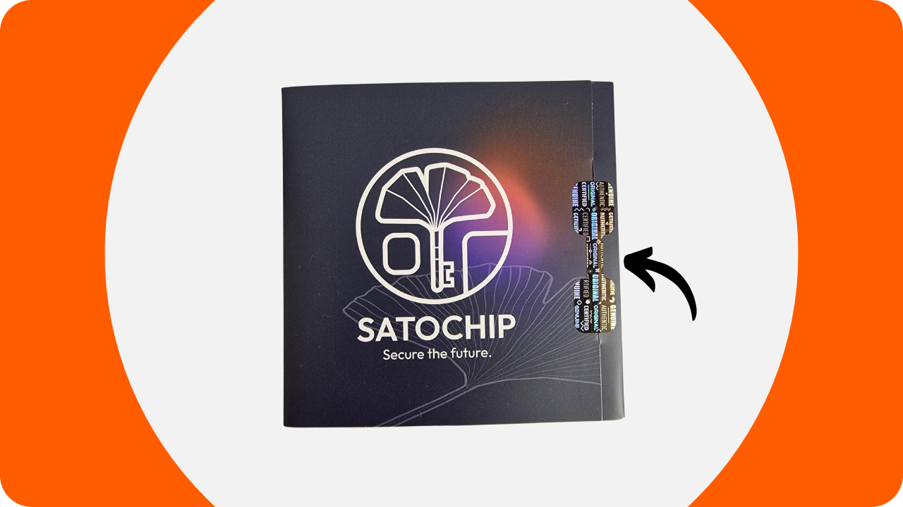
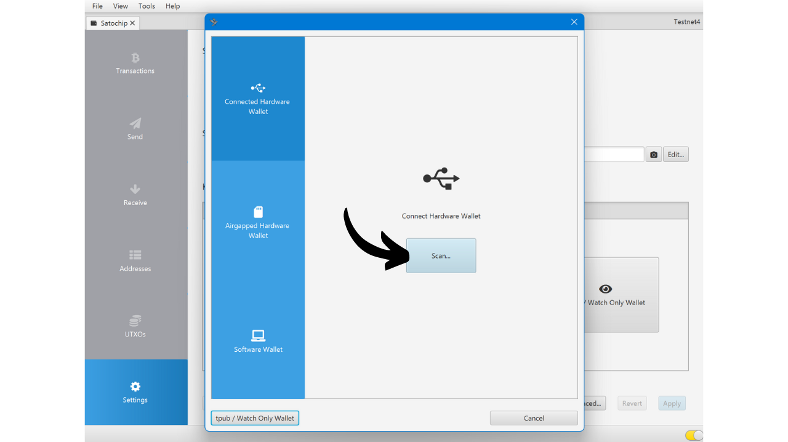
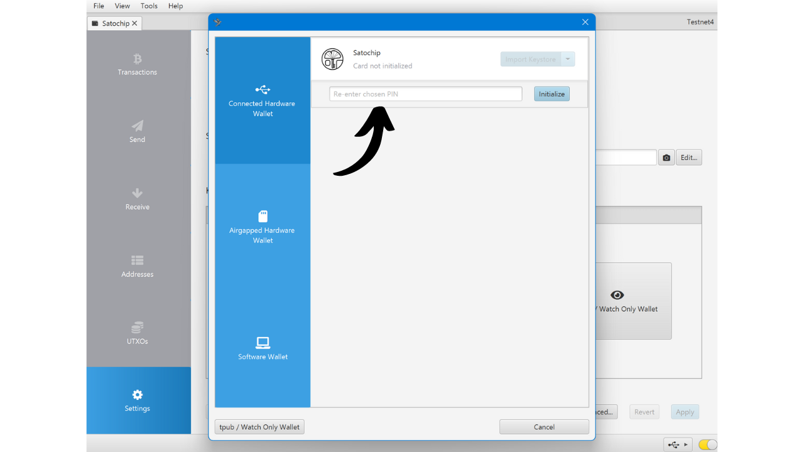
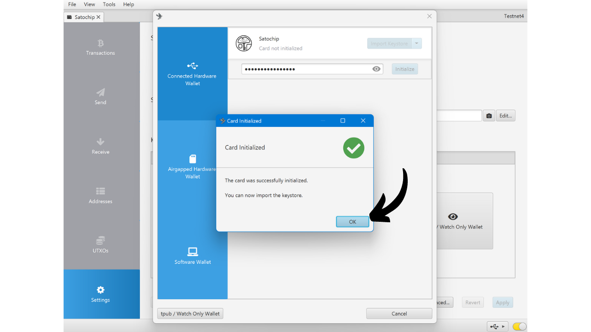
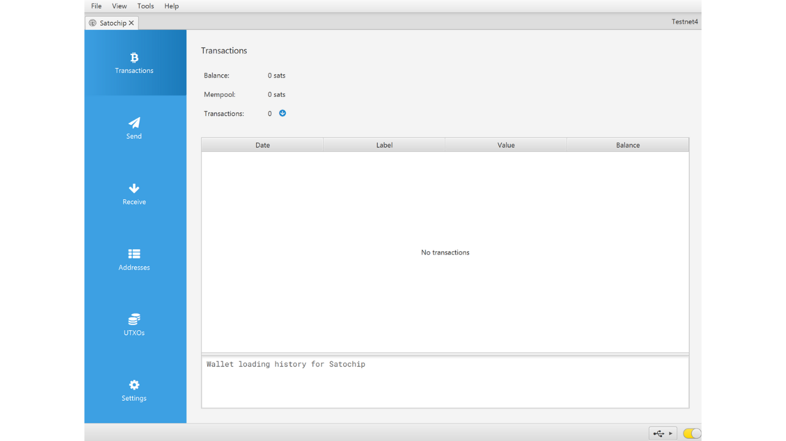
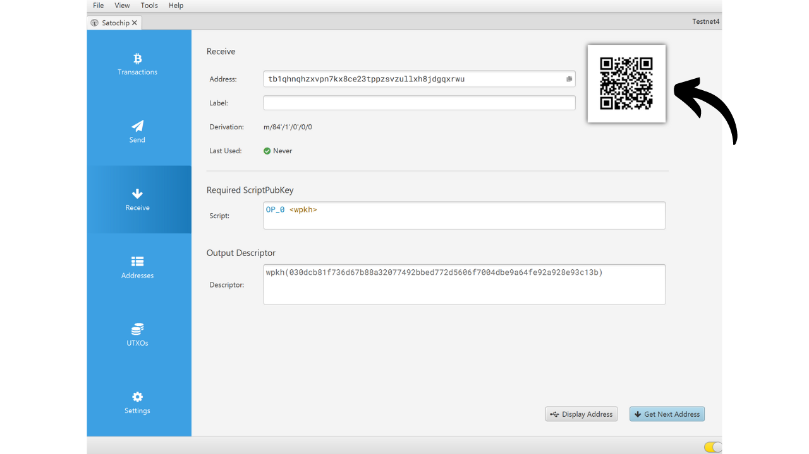
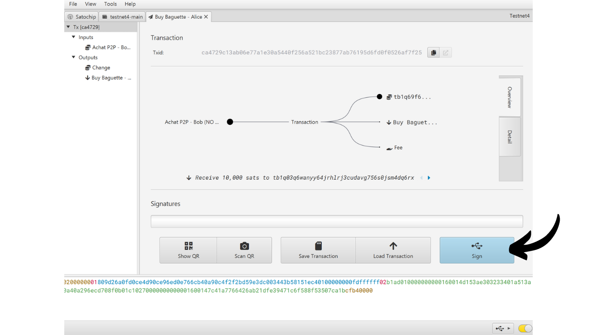
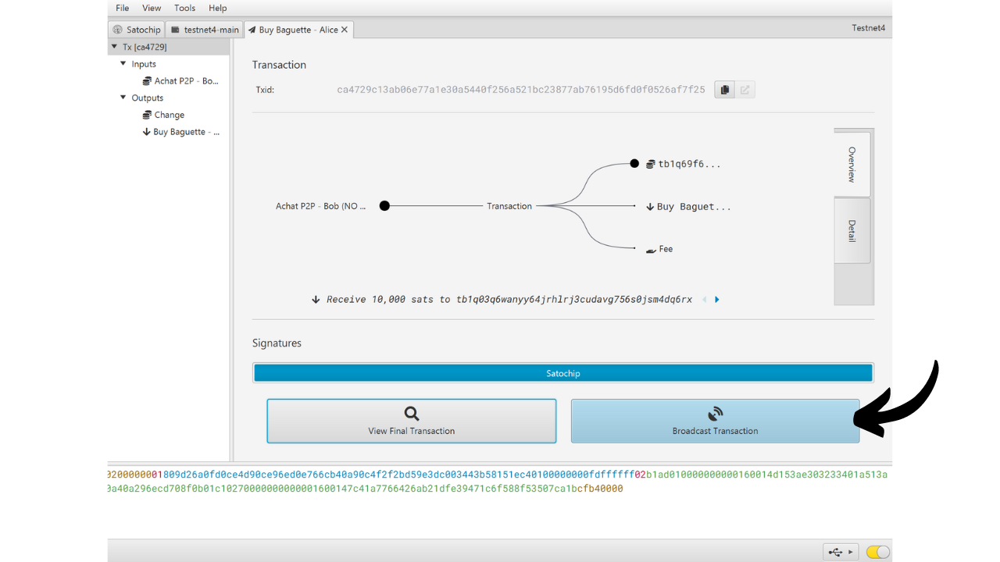

Аппаратный кошелек — это электронное устройство, предназначенное для управления и защиты приватных ключей Bitcoin-кошелька. В отличие от программных кошельков (или горячих кошельков), установленных на универсальных машинах, часто подключенных к Интернету, аппаратные кошельки позволяют физически изолировать приватные ключи, снижая риски взлома и кражи.

Основная цель аппаратного кошелька — минимизировать функциональность устройства, чтобы уменьшить его уязвимость для атак. Меньшая уязвимость также означает меньше потенциальных векторов атак, т.е. меньше слабостей в системе, которые злоумышленники могли бы использовать для доступа к биткоинам.

Рекомендуется использовать аппаратный кошелек для защиты ваших биткоинов, особенно если вы владеете значительными суммами, будь то в абсолютном значении или как доля от ваших общих активов.

Аппаратные кошельки используются в сочетании с программным обеспечением для управления кошельком на компьютере или смартфоне. Это программное обеспечение управляет созданием транзакций, но криптографическая подпись, необходимая для подтверждения этих транзакций, выполняется исключительно в аппаратном кошельке. Это означает, что приватные ключи никогда не подвергаются риску в потенциально уязвимой среде.

Аппаратные кошельки предлагают двойную защиту для пользователя: с одной стороны, они защищают ваши биткоины от удаленных атак, сохраняя приватные ключи вне сети, а с другой стороны, они обычно предлагают лучшую физическую защиту от попыток извлечения ключей. И именно по этим 2 критериям безопасности можно судить и ранжировать различные доступные на рынке модели.

В этом руководстве я предлагаю ознакомиться с одним из таких решений: Satochip.

## Введение в Satochip

Satochip — это аппаратный кошелек в форме карты с чипом, сертифицированным по стандарту безопасности *EAL6+*, что является очень высоким стандартом (*NXP JCOP*). Его производит бельгийская компания.

Эта смарт-карта продается по цене €25, что очень доступно по сравнению с другими аппаратными кошельками на рынке. Чип является защищенным элементом, который обеспечивает очень хорошую устойчивость к физическим атакам. Более того, его код открыт (*AGPLv3*).
Однако, из-за своего формата, Satochip не предлагает столько же опций, сколько другие аппаратные устройства. Очевидно, что нет батареи, нет камеры, ни считывателя карт памяти micro SD, поскольку это карта. Его самым большим недостатком, на мой взгляд, является отсутствие экрана на аппаратном кошельке, что делает его более уязвимым к определенным типам удаленных атак. Действительно, это заставляет пользователя подписывать транзакции вслепую и доверять тому, что он видит на экране своего компьютера.

Несмотря на свои ограничения, Satochip остается интересным из-за своей сниженной цены. Этот кошелек может быть использован для повышения безопасности кошелька для расходов в дополнение к кошельку для сбережений, защищенному аппаратным кошельком с экраном. Он также представляет собой хорошее решение для тех, кто владеет небольшими суммами биткоинов и не желает инвестировать сотни евро в более сложное устройство. Более того, использование Satochip в мультиподписных конфигурациях или потенциально в системах кошельков с временной блокировкой в будущем может предложить интересные преимущества.

Компания Satochip также предлагает еще 2 продукта. Есть Satodime, который представляет собой носительскую карту, предназначенную для оффлайн хранения биткоинов, но не позволяющую совершать транзакции. Это своего рода бумажный кошелек, который намного более безопасен, который можно использовать, например, для подарка. Наконец, есть Seedkeeper, который является менеджером мнемонических фраз. Его можно использовать для безопасного сохранения нашего сида без его прямой записи на листе бумаги.

## Как купить Satochip?
Satochip доступен для покупки [на официальном сайте](https://satochip.io/product/satochip/). Чтобы купить его в физическом магазине, вы также можете найти [список сертифицированных реселлеров](https://satochip.io/resellers/) на сайте Satochip.
Для взаимодействия с программным обеспечением управления вашим кошельком Satochip предлагает две возможности: через коммуникацию NFC или через считыватель смарт-карт. Для опции NFC убедитесь, что ваше устройство совместимо с этой технологией, или приобретите внешний считыватель NFC. Satochip работает на стандартной частоте 13.56 МГц. В противном случае вы также можете купить считыватель смарт-карт. Вы можете найти его на сайте Satochip или в другом месте.

## Как настроить Satochip с Sparrow?

После того как вы получили свой Satochip, первым шагом будет проверка упаковки на предмет её вскрытия. Упаковка Satochip должна включать пломбу. Если эта пломба отсутствует или повреждена, это может указывать на то, что смарт-карта была скомпрометирована и может быть не аутентичной.

Внутри вы найдете Satochip.

Для управления кошельком в этом руководстве я предлагаю использовать Sparrow. Если у вас еще нет программного обеспечения, [посетите официальный сайт для его скачивания](https://sparrowwallet.com/download/). Вы также можете ознакомиться с нашим руководством по Sparrow Wallet (скоро будет).

Вставьте ваш Satochip в считыватель смарт-карт или поместите его на считыватель NFC и подключите считыватель к вашему компьютеру, на котором открыт Sparrow.

Откройте Sparrow Wallet и убедитесь, что вы правильно подключены к узлу Bitcoin. Для этого проверьте галочку в нижнем правом углу: она должна быть желтой, если вы подключены к публичному узлу, зеленой для подключения к Bitcoin Core или синей для Electrum.

В Sparrow Wallet нажмите на вкладку "*File*".

Затем на меню "*New Wallet*".

Выберите имя для вашего кошелька, затем нажмите на "*Create Wallet*".

Нажмите на кнопку "*Connected Hardware Wallet*".

Нажмите на кнопку "*Scan...*".

Ваш Satochip должен появиться. Нажмите на "*Import Keystore*".

Далее вам нужно установить PIN-код для разблокировки вашего Satochip. Выберите надежный пароль, от 4 до 16 символов. Сделайте резервную копию этого пароля.

Имейте в виду, этот пароль не является парольной фразой. Это означает, что даже без этого пароля ваша мнемоническая фраза позволит вам повторно импортировать ваш кошелек в программное обеспечение при необходимости. Пароль используется только для обеспечения доступа к самому Satochip. Он эквивалентен PIN-коду, найденному в других аппаратных кошельках.

После ввода пароля снова нажмите на кнопку "*Import Keystore*".

Запишите пароль еще раз, затем нажмите на кнопку "*Initialize*".

Затем вы попадаете в окно для генерации вашей мнемонической фразы. Нажмите на кнопку "*Создать новую*".

Сделайте одну или несколько физических копий вашей фразы восстановления, записав её на бумаге или металлическом носителе. Имейте в виду, что эта фраза предоставляет полный доступ к вашим биткоинам без какой-либо дополнительной защиты. Поэтому, если кто-то её обнаружит, он сможет мгновенно украсть ваши биткоины, даже не имея доступа к вашему Satochip или его PIN-коду. Поэтому важно обеспечить безопасность этих резервных копий. Более того, эта фраза позволяет вам восстановить доступ к вашим биткоинам в случае потери, повреждения Satochip или если вы забудете ваш PIN-код.

Ваш биткоин-кошелек успешно создан.

Нажмите снова на кнопку "*Импортировать хранилище ключей*".

Теперь ваш кошелек создан. Ваши приватные ключи теперь хранятся на смарт-карте вашего Satochip. Нажмите на кнопку "*Применить*", чтобы продолжить.

Рекомендуется установить дополнительный пароль для защиты публичной информации, управляемой Sparrow Wallet, в дополнение к PIN-коду вашего Satochip. Этот пароль обеспечит безопасность доступа к Sparrow Wallet, что поможет защитить ваши публичные ключи, адреса и историю транзакций от любого несанкционированного доступа.

Введите ваш пароль в оба поля, затем нажмите на кнопку "*Установить пароль*".

И вот оно, ваш Satochip теперь настроен в Sparrow Wallet.

Теперь, когда ваш кошелек создан, вы можете отключить ваш Satochip. Храните его в безопасном месте!

## Как получить биткоины с помощью Satochip?

Перейдите в вашем кошельке на вкладку "*Получить*".

Sparrow Wallet генерирует адрес для вашего кошелька. Обычно, для других аппаратных кошельков, рекомендуется нажать на "*Показать адрес*", чтобы проверить адрес непосредственно на экране устройства. К сожалению, эта опция недоступна с Satochip, но убедитесь, что вы используете её для ваших других кошельков.

Вы можете добавить "*Метку*", чтобы описать источник биткоинов, которые будут защищены этим адресом. Это хорошая практика, которая помогает вам лучше управлять вашими UTXO.

Для получения дополнительной информации о маркировке я также рекомендую ознакомиться с этим другим учебником:

https://planb.network/tutorials/privacy/utxo-labelling

Затем вы можете использовать этот адрес для получения биткоинов.

## Как отправить биткоины с Satochip?
Теперь, когда вы получили ваши первые сатоши в вашем защищенном кошельке с Satochip, вы также можете их потратить! Подключите ваш Satochip к компьютеру, запустите Sparrow Wallet и перейдите на вкладку "*Отправить*", чтобы создать новую транзакцию.

Если вы хотите выполнить контроль монет, то есть специально выбрать, какие UTXO использовать в транзакции, перейдите на вкладку "*UTXOs*". Выберите UTXO, которые вы хотите потратить, затем нажмите на "*Send Selected*". Вы будете перенаправлены на тот же экран вкладки "*Send*", но ваши UTXO уже будут выбраны для транзакции.

Введите адрес назначения. Вы также можете ввести несколько адресов, нажав на кнопку "*+ Add*".

Отметьте "*Label*", чтобы помнить цель этого расхода.

Выберите сумму, отправляемую на этот адрес.

Настройте ставку комиссии для вашей транзакции в соответствии с текущим рынком.

Убедитесь, что все параметры вашей транзакции верны, затем нажмите на "*Create Transaction*".

Если все устраивает, нажмите на "*Finalize Transaction for Signing*".

Нажмите на "*Sign*".

Нажмите на "*Sign*" снова рядом с вашим Satochip.

Введите PIN-код вашего Satochip, затем нажмите на "*Sign*" снова, чтобы подписать вашу транзакцию.

Ваша транзакция теперь подписана. Нажмите на "*Broadcast Transaction*", чтобы транслировать ее в сеть Bitcoin.

Вы можете найти ее на вкладке "*Transactions*" в Sparrow Wallet.

Поздравляем, теперь вы знаете, как использовать Satochip! Если вы нашли этот учебник полезным, я был бы признателен за лайк ниже. Не стесняйтесь делиться этой статьей в своих социальных сетях. Большое спасибо!