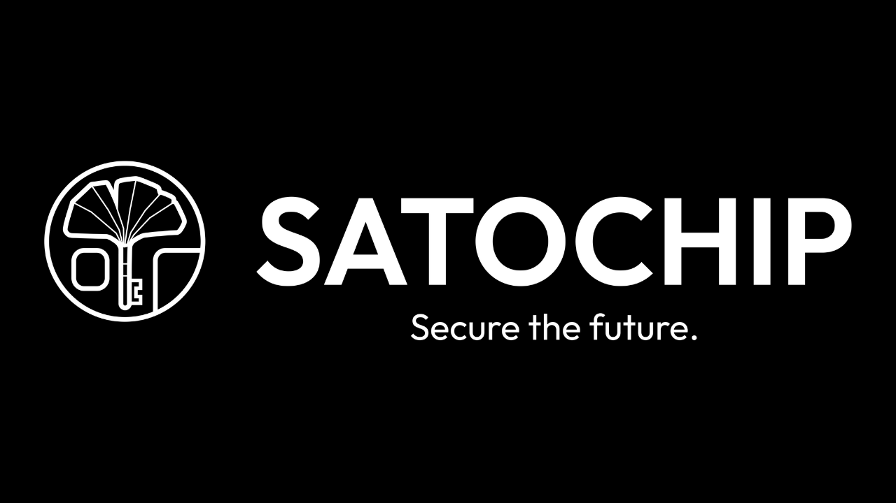
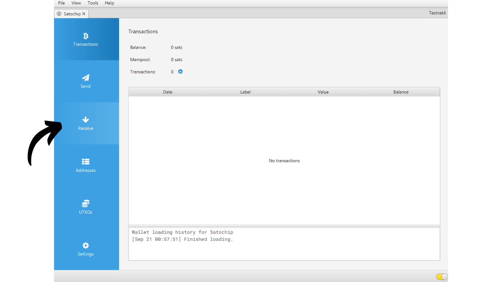
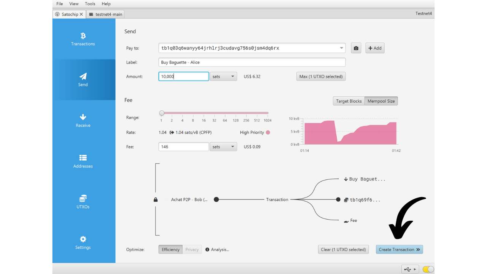

硬件钱包是一种专用于管理和保护比特币钱包私钥的电子设备。与常常连接互联网的通用机器上安装的软件钱包（或热钱包）不同，硬件钱包允许物理隔离私钥，减少了被黑客攻击和盗窃的风险。

硬件钱包的主要目标是最小化设备的功能以减少其攻击面。较小的攻击面也意味着较少的潜在攻击向量，即，系统中较少的弱点，攻击者可能利用这些弱点来访问比特币。

特别是如果您持有大量比特币，无论是绝对值还是占您总资产的比例，都推荐使用硬件钱包来保护您的比特币。

硬件钱包与计算机或智能手机上的钱包管理软件结合使用。这个软件管理交易的创建，但验证这些交易所需的加密签名仅在硬件钱包内完成。这意味着私钥永远不会暴露于可能脆弱的环境中。

硬件钱包为用户提供双重保护：一方面，通过保持私钥离线，它们保护您的比特币免受远程攻击；另一方面，它们通常提供更好的物理抵抗力，防止尝试提取密钥。正是基于这2个安全标准，可以评判和排名市场上可用的不同模型。

在本教程中，我提议发现这些解决方案之一：Satochip。

## 介绍Satochip

Satochip是一种以卡片形式出现的硬件钱包，内置有*EAL6+* 认证的芯片，这是一个非常高的安全标准（*NXP JCOP*）。它由一家比利时公司生产。

这种智能卡的售价为25欧元，与市场上其他硬件钱包相比非常实惠。该芯片是一个安全元素，确保了非常好的抵抗物理攻击的能力。此外，其代码是开源的（*AGPLv3*）。
然而，由于其格式，Satochip不提供像其他硬件那样多的选项。显然没有电池，没有摄像头，也没有微SD卡阅读器，因为它是一张卡片。我认为，它最大的缺点是硬件钱包上缺少屏幕，这使得它更容易受到某些类型远程攻击的威胁。实际上，这迫使用户盲目签名，并信任他们在电脑屏幕上看到的内容。

尽管有其局限性，Satochip因其低廉的价格而仍然具有吸引力。这个钱包可以特别用来增强支出钱包的安全性，除了使用带屏幕的硬件钱包保护的储蓄钱包。对于那些持有少量比特币且不希望在更复杂的设备上投资数百欧元的人来说，它也构成了一个好的解决方案。此外，Satochips在多签配置中的使用，或者未来可能在带有时间锁的钱包系统中的使用，可以提供有趣的优势。

Satochip公司还提供另外2种产品。有Satodime，这是一种旨在离线存储比特币的持有者卡，但不允许进行交易。这是一种比纸质钱包更安全的方式，例如，可以用来作为礼物。最后，有Seedkeeper，这是一个助记词管理器。它可以用来安全地保存我们的种子，而不是直接记在一张纸上。

## 如何购买Satochip？
Satochip已经可以在[官方网站](https://satochip.io/product/satochip/)上购买。如果想在实体店购买，你也可以在Satochip网站上找到[认证经销商列表](https://satochip.io/resellers/)。

为了与你的钱包管理软件互动，Satochip提供了两种可能性：通过NFC通信或通过智能卡阅读器。如果选择NFC选项，请确保你的机器兼容这项技术或者购买一个外部NFC读卡器。Satochip操作的标准频率为13.56 MHz。否则，你也可以购买一个智能卡阅读器。你可以在Satochip网站或其他地方找到一个。

## 如何用Sparrow设置Satochip？

收到你的Satochip后，第一步是检查包装确保它未被打开。Satochip的包装应该包括一个封条贴纸。如果这个贴纸缺失或损坏，可能表明智能卡已经被篡改，可能不是正品。

你会在里面找到Satochip。

为了管理钱包，在这个教程中，我建议使用Sparrow。如果你还没有这个软件，[访问官方网站下载它](https://sparrowwallet.com/download/)。你也可以查看我们即将推出的Sparrow Wallet教程。

将你的Satochip插入智能卡阅读器或放在NFC读卡器上，并将读卡器连接到已经打开Sparrow的计算机上。

打开Sparrow Wallet并确保你正确连接到了比特币节点。为此，检查右下角的勾选标记：如果你连接到公共节点，它应该是黄色的；连接到Bitcoin Core时，为绿色；连接到Electrum时，为蓝色。

在Sparrow Wallet上，点击"*File*"标签。

然后点击"*New Wallet*"菜单。

为你的钱包选择一个名称，然后点击"*Create Wallet*"。

点击"*Connected Hardware Wallet*"按钮。

点击"*Scan...*"按钮。

你的Satochip应该会出现。点击"*Import Keystore*"。

接下来，你需要设置一个PIN码来解锁你的Satochip。选择一个强密码，长度在4到16个字符之间。备份这个密码。

请注意，这个密码不是助记词。这意味着即使没有这个密码，你的助记词也会允许你在必要时重新导入你的钱包到软件中。密码仅用于保护访问Satochip本身的安全。它等同于其他硬件钱包上的PIN码。

输入密码后，再次点击"*Import Keystore*"按钮。

再次记录密码，然后点击"*Initialize*"按钮。
您接下来将进入生成助记词的窗口。点击“*生成新的*”按钮。

通过在纸张或金属介质上记录下来，制作一个或多个助记词的物理副本。请注意，这个短语能够完全访问您的比特币，而无需任何额外保护。因此，如果有人发现它，他们甚至无需访问您的Satochip或其PIN码就能立即窃取您的比特币。因此，保护这些备份非常重要。此外，这个短语允许您在丢失Satochip、Satochip损坏或忘记PIN码的情况下重新访问您的比特币。

您的比特币钱包已成功创建。

再次点击“*导入密钥库*”按钮。

您的钱包现在已创建。您的私钥现在存储在Satochip的智能卡上。点击“*应用*”按钮继续。

建议设置一个额外的密码来保护Sparrow Wallet管理的公开信息，除了您的Satochip的PIN码。这个密码将确保访问Sparrow Wallet的安全性，有助于保护您的公钥、地址和交易历史记录不受未经授权的访问。

在两个字段中输入您的密码，然后点击“*设置密码*”按钮。

就这样，您的Satochip现在已在Sparrow Wallet上配置完成。

现在您的钱包已创建，您可以断开您的Satochip。将其保管在安全的地方！

## 如何使用Satochip接收比特币？

在您的钱包中，点击“*接收*”标签页。

Sparrow Wallet为您的钱包生成一个地址。通常，对于其他硬件钱包，建议点击“*显示地址*”以直接在设备屏幕上验证地址。不幸的是，Satochip不提供这个选项，但请确保在您的其他钱包中使用它。

您可以添加一个“*标签*”来描述将通过此地址保护的比特币的来源。这是一个好习惯，有助于您更好地管理您的UTXOs。

有关标签的更多信息，我还推荐查看这个其他教程：

https://planb.network/tutorials/privacy/utxo-labelling

然后您可以使用这个地址来接收比特币。

## 如何使用Satochip发送比特币？
现在您已经在您的Satochip安全钱包中收到了您的第一笔sats，您也可以花费它们！连接您的Satochip到您的电脑，启动Sparrow Wallet，然后转到“*发送*”标签页构建一个新的交易。

如果您想进行硬币控制，即特别选择哪些UTXO在交易中消耗，前往“*UTXOs*”标签页。选择您希望花费的UTXO，然后点击“*发送所选*”。您将被重定向到“*发送*”标签页的相同屏幕，但您的UTXO已为交易选择。

输入目的地址。您也可以通过点击“*+ 添加*”按钮输入多个地址。

注意一个“*标签*”，以记住这笔支出的目的。

选择发送到此地址的金额。

根据当前市场调整您的交易费率。

确保您的交易所有参数都正确，然后点击“*创建交易*”。

如果一切都符合您的满意，点击“*最终确定交易以签名*”。

点击“*签名*”。

在您的Satochip旁边再次点击“*签名*”。

输入您的Satochip的PIN码，然后再次点击“*签名*”以签署您的交易。

您的交易现在已签名。点击“*广播交易*”将其广播到比特币网络。

您可以在Sparrow Wallet的“*交易*”标签页中找到它。

恭喜，您现在已经了解如何使用Satochip了！如果您觉得这个教程有帮助，我会很感激您在下面点个赞。欢迎在您的社交网络上分享这篇文章。非常感谢！