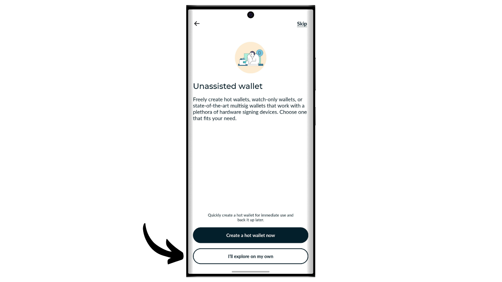
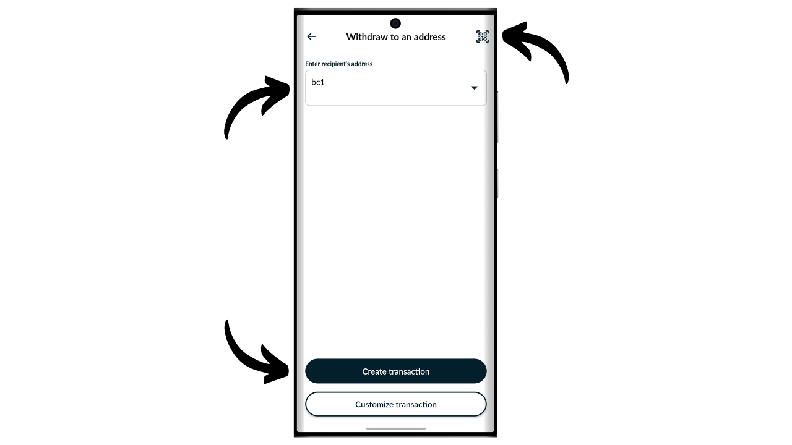
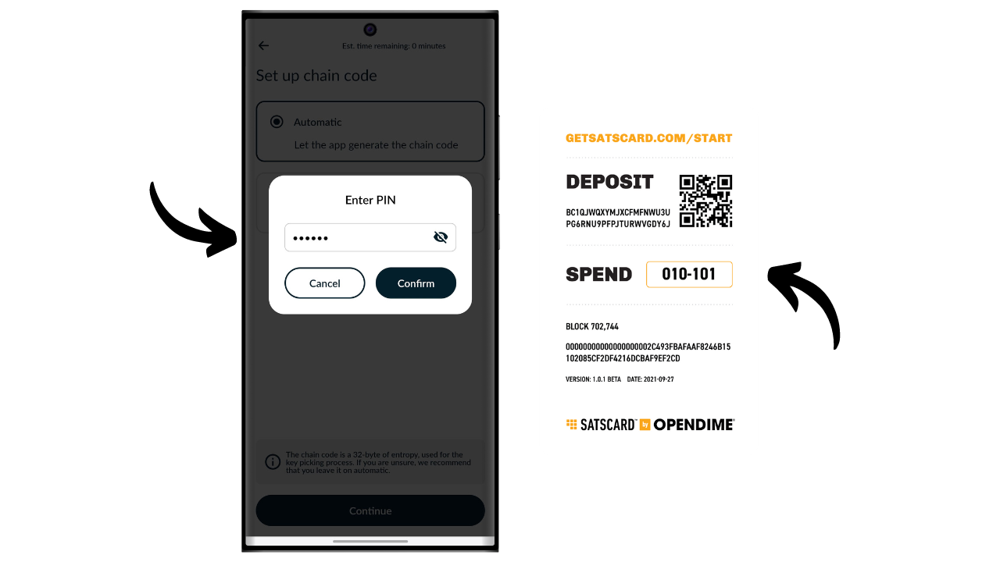

Bitcoin je elektronický platební systém, který nám umožňuje provádět transakce mezi jednotlivci. Avšak pro jistotu, že transakce je nezměnitelná, je nutné počkat na několik potvrzení (obvykle 6), aby se předešlo jakémukoli pokusu o dvojí utrácení ze strany odesílatele. Toto zpoždění ověření může být někdy nepraktické, zejména když je žádoucí okamžitá konečnost podobná fyzickým penězům. Na rozdíl od hotovosti, kde je držení bankovky přeneseno okamžitě, transakce s Bitcoinem zahrnují čekací dobu, než jsou definitivně považovány za nevratné.

Zde přichází na scénu Satscard. Nabízí metodu, jak umožnit fyzický a okamžitý přenos bitcoinů, bez nutnosti provádět transakci na blockchainu. Satscard funguje jako nosná karta, která umožňuje bezpečný převod vlastnictví bitcoinů, a tím nabízí zážitek blížící se tradiční hotovosti. V tomto tutoriálu vás seznámím s tímto řešením.

## Co je Satscard?

Satscard od společnosti Coinkite je nástupcem Opendime. Jedná se o NFC kartu, která umožňuje fyzický přenos bitcoinů, podobně jako bankovka nebo mince. Na rozdíl od tradiční hardwarové peněženky je Satscard nosná karta, což znamená, že fyzické držení karty se rovná vlastnictví bitcoinů, které jsou zabezpečeny klíči uloženými na ní. Její cena se pohybuje mezi $6.99 a $17.99 v závislosti na zvoleném designu.

Čip Satscard je vybaven 10 sloty, což mu umožňuje uchovávat bitcoiny až 10krát na 10 různých adresách. Každý slot funguje nezávisle a teoreticky by měl být použit pouze jednou pro uzamčení bitcoinů v něm. Pro utrácení bitcoinů stačí odemknout slot kompatibilní aplikací, jako je Nunchuk, zadáním 6místného ověřovacího kódu uvedeného na zadní straně Satscard.

Karta zajišťuje, že soukromý klíč zabezpečující bitcoiny na blockchainu nemůže být ponechán bývalým majitelem, jakmile se s kartou fyzicky rozloučí. Příjemce může také ověřit platnost slotu a množství v něm uložené v okamžiku výměny.

Tento systém je obzvláště užitečný pro nákup fyzického zboží za bitcoiny nebo pro darování bitcoinů jako dárku.

## Jak koupit Satscard?

Satscard je k dispozici k nákupu [na oficiálních stránkách Coinkite](https://store.coinkite.com/store/category/satscard). Pokud ho chcete koupit v kamenném obchodě, můžete také najít [seznam certifikovaných prodejců](https://coinkite.com/resellers) na webu.
Budete také potřebovat telefon kompatibilní s NFC komunikací nebo USB zařízení pro čtení NFC karet na standardní frekvenci 13,56 MHz.
## Jak načíst slot na Satscard?

Jakmile obdržíte svůj Satscard, prvním krokem je zkontrolovat balení, zda nebylo otevřeno. Pokud je balení poškozené, může to znamenat, že karta byla kompromitována a nemusí být autentická.

Pro správu Satscard použijeme mobilní aplikaci **Nunchuk Wallet**. Ujistěte se, že váš smartphone je kompatibilní s NFC, poté si stáhněte Nunchuk z [Google Play Store](https://play.google.com/store/apps/details?id=io.nunchuk.android), [App Store](https://apps.apple.com/us/app/nunchuk-bitcoin-wallet/id1563190073), nebo přímo přes jeho [`.apk` soubor](https://github.com/nunchuk-io/nunchuk-android/releases).

Teoreticky byste mohli přímo poslat bitcoiny na adresu uvedenou na zadní straně vaší Satscard bez použití Nunchuk. Nicméně to nedoporučuji, protože nejprve ověříme, že adresa prvního slotu je skutečně odvozena od soukromého klíče uloženého v Satscard a že se nejedná o podvodnou adresu.

Pokud používáte Nunchuk poprvé, aplikace vám nabídne vytvoření účtu. Pro účely tohoto návodu není nutné vytvářet účet. Takže vyberte "*Pokračovat jako host*", abyste pokračovali bez účtu.

Poté klikněte na "*Nepodporovaná peněženka*".

Dále klikněte na tlačítko "*Prozkoumám na vlastní pěst*".

Až se ocitnete na domovské obrazovce Nunchuk, klikněte na logo "*NFC*" v horní části obrazovky.

Přiložte vaši Satscard k zadní straně vašeho telefonu pro skenování.

Nunchuk zobrazí přijímací adresu odpovídající prvnímu slotu vaší Satscard. Obvykle by tato adresa měla být identická s tou, která je ručně napsaná na zadní straně vaší karty. Zkopírujte tuto adresu a použijte ji k převodu bitcoinů, které si přejete uzamknout v tomto slotu.

## Jak zkontrolovat bitcoiny na slotu?

Jakmile je transakce potvrzena, můžete zkontrolovat zůstatek spojený se slotem vaší Satscard skenováním pomocí Nunchuk. Takto může příjemce bitcoinů okamžitě ověřit prostřednictvím své aplikace Nunchuk, že karta skutečně obsahuje jim dlužené bitcoiny.

Pokud protistrana nemá aplikaci Nunchuk, může stále ověřit platnost Satscard. Stačí aktivovat NFC na jejich smartphonu a přiložit Satscard k zadní straně zařízení. To automaticky otevře webové stránky Satscard v prohlížeči, kde lze zkontrolovat platnost karty i množství bitcoinů s ní spojených.

## Jak vybrat bitcoiny ze slotu?

Nyní, když byl první slot vaší Satscard načten určitým množstvím bitcoinů, můžete kartu předat příjemci platby.

Pokud jste příjemcem, musíte si nainstalovat Nunchuk. Jakmile jste v aplikaci, klikněte na logo "*NFC*" v horní části obrazovky.

Přiložte vaši Satscard k zadní straně vašeho telefonu.

Nunchuk odhalí množství zabezpečené na adrese.

Pro odemčení soukromého klíče a přesun bitcoinů na adresu, kterou vlastníte, klikněte na tlačítko "*Odemknout a převést zůstatek*".

Možnost "*Převést do peněženky*" umožňuje přímo poslat bitcoiny do peněženky již přítomné ve vaší aplikaci Nunchuk. Pro převod finančních prostředků na jinou přijímací adresu vyberte "*Vybrat na adresu*".

Zadejte přijímací adresu, kam chcete poslat bitcoiny zabezpečené Satscardem. Ujistěte se, že zadaná adresa je správná (toto je jediná chvíle, kdy ji můžete ověřit), poté klikněte na tlačítko "*Vytvořit transakci*".

Zadejte PIN kód vašeho Satscardu. Tento šestimístný kód je uveden na zadní straně fyzické karty.

Při podepisování transakce soukromým klíčem uloženým na NFC kartě držte váš Satscard na zadní straně vašeho smartphonu.

Vaše transakce je nyní podepsána a odeslána do sítě Bitcoin, což znamená, že použitý slot na vašem Satscardu je nyní prázdný.

## Jak znovu použít Satscard?

Na rozdíl od jednorázových řešení, jako je Opendime, je Satscard vybaven čipem obsahujícím 10 nezávislých slotů, což umožňuje až 10 operací s jednou kartou. První slot, přednastavený ve výrobě společností Coinkite, odpovídá přijímací adrese napsané na zadní straně vašeho Satscardu.

Pro aktivaci ostatních 9 slotů budete muset vygenerovat pár klíčů a adresu prostřednictvím aplikace Nunchuk. Na domovské stránce aplikace klikněte na logo "*NFC*" v horní části obrazovky.

Umístěte váš Satscard na zadní stranu vašeho telefonu.

Nunchuk indikuje, že na kartě není aktivní žádný slot, což je normální, protože první už byl použit a druhý ještě nebyl vygenerován. Pro zobrazení dříve použitých slotů klikněte na "*Zobrazit nezapečetěné sloty*". Důrazně se nedoporučuje tyto sloty znovu používat, jelikož by to vedlo k opětovnému použití adresy, což je škodlivé pro vaše soukromí v síti. Proto nastavíme nový slot kliknutím na tlačítko "*Ano*".

Nyní budete muset zvolit, jak vygenerujete váš hlavní řetězový kód.

Sloty na Satscardu následují standard BIP32, což znamená, že derivace kryptografických klíčů zabezpečujících bitcoiny nezávisí na mnemonické frázi jako u peněženek BIP39, ale přímo na hlavním soukromém klíči a hlavním řetězovém kódu. Tyto dva prvky jsou použity jako vstup ve funkci HMAC-SHA512 pro generování páru dětských klíčů. Každý slot má svůj vlastní hlavní klíč a svůj vlastní hlavní řetězový kód. Pro každý slot existuje pouze jedna úroveň derivace.

Pár klíčů pro první slot je předgenerován společností Coinkite. To je důvod, proč k němu máte přímý přístup prostřednictvím Nunchuku, a proč je přijímací adresa napsána na zadní straně NFC karty. Pro ostatní sloty však jste zodpovědní za generování klíčů.

Hlavní soukromý klíč pro každý slot je generován přímo Satscardem, a hlavní řetězové kódy musí být poskytnuty zvenčí. Pro řetězový kód vašeho nového slotu máte dvě možnosti: nechat Nunchuk generovat automaticky výběrem "*Automatické*", nebo jej vytvořit sami výběrem "*Pokročilé*" a zadáním do příslušného prostoru. Pro účinnost řetězového kódu je nutné, aby byl co nejvíce náhodný.

Zadejte 6místný PIN uvedený na zadní straně Satscard.

Přiložte svůj Satscard na zadní stranu telefonu.

Nový slot byl úspěšně nakonfigurován. Nyní můžete vidět přijímací adresu pro vklad bitcoinů. Pro pokračování ve vkládání postupujte podle instrukcí v sekci "*Jak načíst slot na Satscard?*" tohoto návodu.
Tento proces můžete opakovat až 10krát na každý Satscard.

Gratulujeme, nyní jste plně seznámeni s používáním Satscard! Pokud se vám tento návod zdál užitečný, ocenil bych, kdybyste níže zanechali palce nahoru. Neváhejte tento článek sdílet na svých sociálních sítích. Velmi vám děkuji!