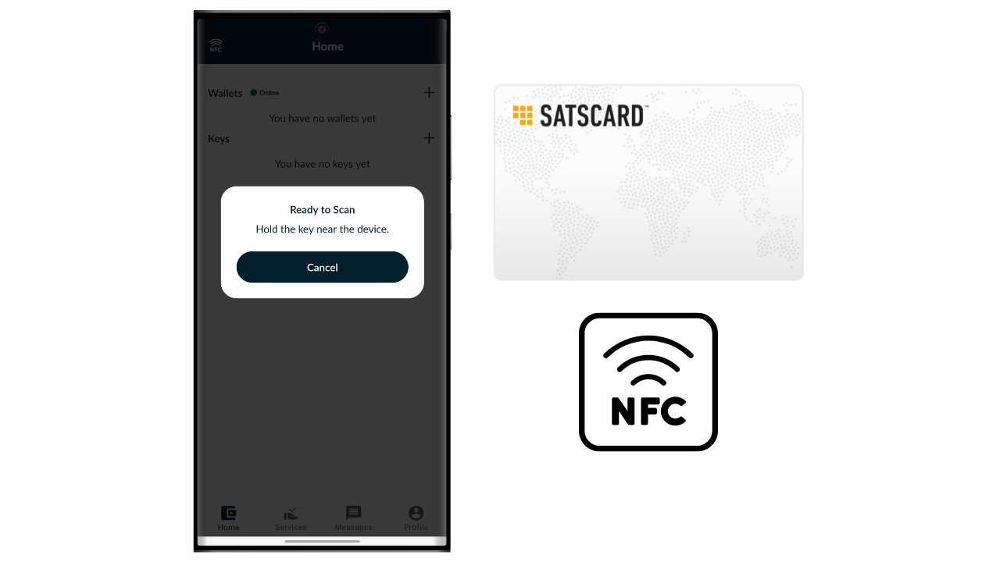

Bitcoin ist ein elektronisches Bargeldsystem, das es uns ermöglicht, Peer-to-Peer-Transaktionen durchzuführen. Um jedoch überzeugt zu sein, dass eine Transaktion unveränderlich ist, ist es notwendig, auf mehrere Bestätigungen (üblicherweise 6) zu warten, um jeden Versuch eines doppelten Ausgebens durch den Sender zu vermeiden. Diese Validierungsverzögerung kann manchmal unpraktisch sein, insbesondere wenn eine sofortige Endgültigkeit ähnlich wie bei physischem Bargeld gewünscht ist. Im Gegensatz zu Bargeld, bei dem der Besitz eines Geldscheins sofort übertragen wird, beinhalten Bitcoin-Transaktionen eine Wartezeit, bevor sie endgültig als unwiderruflich betrachtet werden.

Hier kommt die Satscard ins Spiel. Sie bietet eine Methode, um die physische und sofortige Übertragung von Bitcoins zu ermöglichen, ohne eine On-Chain-Transaktion durchführen zu müssen. Die Satscard funktioniert als Inhaberkarte, die den sicheren Transfer des Bitcoin-Besitzes ermöglicht und somit ein Erlebnis bietet, das dem traditionellen Bargeld näher kommt. In diesem Tutorial werde ich Sie mit dieser Lösung bekannt machen.

## Was ist eine Satscard?

Die Satscard von Coinkite ist der Nachfolger des Opendime. Es handelt sich um eine NFC-Karte, die die physische Übertragung von Bitcoins ermöglicht, ähnlich wie ein Geldschein oder eine Münze. Im Gegensatz zu einer traditionellen Hardware-Wallet ist die Satscard eine Inhaberkarte, was bedeutet, dass der physische Besitz der Karte dem Besitz der mit den darauf gespeicherten Schlüsseln gesicherten Bitcoins gleichkommt. Ihr Preis liegt zwischen 6,99 $ und 17,99 $, abhängig vom gewählten Design.

Der Chip der Satscard ist mit 10 Slots ausgestattet, die es ermöglichen, Bitcoins bis zu 10 Mal auf 10 verschiedenen Adressen zu speichern. Jeder Slot funktioniert unabhängig und sollte theoretisch nur einmal verwendet werden, um Bitcoins darin zu sperren. Um die Bitcoins auszugeben, genügt es, den Slot mit einer kompatiblen Anwendung, wie Nunchuk, zu entsiegeln, indem man den 6-stelligen Verifizierungscode eingibt, der auf der Rückseite der Satscard notiert ist.

Die Karte stellt sicher, dass der private Schlüssel, der die Bitcoins in der Blockchain sichert, vom ehemaligen Besitzer nicht zurückbehalten werden kann, sobald er sich physisch von der Karte trennt. Der Empfänger kann auch die Gültigkeit eines Slots und den darin gespeicherten Betrag zum Zeitpunkt des Austauschs überprüfen.

Dieses System ist besonders nützlich für den Kauf von physischen Gütern mit Bitcoins oder für das Verschenken von Bitcoins.

## Wie kauft man eine Satscard?

Die Satscard ist zum Kauf auf der offiziellen Coinkite-Website verfügbar [auf der offiziellen Coinkite-Website](https://store.coinkite.com/store/category/satscard). Um sie in einem physischen Geschäft zu kaufen, finden Sie auch [die Liste der zertifizierten Wiederverkäufer](https://coinkite.com/resellers) auf der Website.
Sie benötigen außerdem ein Telefon, das mit NFC-Kommunikation kompatibel ist, oder ein USB-Gerät zum Lesen von NFC-Karten mit der Standardfrequenz von 13,56 MHz.
## Wie lädt man einen Slot auf einer Satscard?

Sobald Sie Ihre Satscard erhalten haben, ist der erste Schritt, die Verpackung zu überprüfen, um sicherzustellen, dass sie nicht geöffnet wurde. Wenn die Verpackung beschädigt ist, könnte dies darauf hinweisen, dass die Karte kompromittiert wurde und möglicherweise nicht authentisch ist.

Um die Satscard zu verwalten, werden wir die mobile Anwendung **Nunchuk Wallet** verwenden. Stellen Sie sicher, dass Ihr Smartphone NFC-kompatibel ist, und laden Sie Nunchuk aus dem [Google Play Store](https://play.google.com/store/apps/details?id=io.nunchuk.android), dem [App Store](https://apps.apple.com/us/app/nunchuk-bitcoin-wallet/id1563190073) oder direkt über seine [`.apk`-Datei](https://github.com/nunchuk-io/nunchuk-android/releases) herunter.
In der Theorie könnten Sie direkt Bitcoins an die auf der Rückseite Ihrer Satscard angegebene Adresse senden, ohne Nunchuk zu verwenden. Ich rate jedoch davon ab, da wir zunächst überprüfen, ob die Adresse des ersten Slots tatsächlich von einem privaten Schlüssel abgeleitet ist, der in der Satscard gespeichert ist, und dass es sich nicht um eine betrügerische Adresse handelt.

Wenn Sie Nunchuk zum ersten Mal verwenden, bietet Ihnen die App an, ein Konto zu erstellen. Für die Zwecke dieses Tutorials ist es nicht notwendig, eines zu erstellen. Wählen Sie also "*Weiter als Gast*", um ohne Konto fortzufahren.

Dann klicken Sie auf "*Unbetreute Wallet*".

Als Nächstes klicken Sie auf den Button "*Ich erkunde selbst*".

Sobald Sie sich auf dem Nunchuk-Startbildschirm befinden, klicken Sie auf das "*NFC*-Logo oben auf dem Bildschirm.

Halten Sie Ihre Satscard an die Rückseite Ihres Telefons, um sie zu scannen.

Nunchuk zeigt die Empfangsadresse an, die dem ersten Slot Ihrer Satscard entspricht. Normalerweise sollte diese Adresse identisch mit der sein, die manuell auf der Rückseite Ihrer Karte geschrieben steht. Kopieren Sie diese Adresse und verwenden Sie sie, um die Bitcoins zu übertragen, die Sie mit diesem Slot sichern möchten.

## Wie überprüft man die Bitcoins auf einem Slot?

Sobald die Transaktion bestätigt ist, können Sie das Guthaben, das einem Slot Ihrer Satscard zugeordnet ist, überprüfen, indem Sie sie mit Nunchuk scannen. So kann der Empfänger der Bitcoins während einer Transaktion sofort überprüfen, ob die Karte tatsächlich die ihm geschuldeten Bitcoins enthält, und zwar über ihre Nunchuk-App.

Wenn die Gegenpartei die Nunchuk-App nicht hat, kann sie trotzdem die Gültigkeit der Satscard überprüfen. Aktivieren Sie einfach NFC auf ihrem Smartphone und platzieren Sie die Satscard an der Rückseite des Geräts. Dies wird automatisch die Satscard-Website in einem Browser öffnen, wo man die Gültigkeit der Karte sowie den mit ihr verbundenen Bitcoin-Betrag überprüfen kann.

## Wie zieht man Bitcoins von einem Slot ab?

Jetzt, da der erste Slot der Satscard mit einer bestimmten Menge an Bitcoins geladen wurde, können Sie die Karte dem Zahlungsempfänger übergeben.

Wenn Sie der Empfänger sind, müssen Sie Nunchuk installieren. Einmal in der App, klicken Sie auf das "*NFC*-Logo oben auf dem Bildschirm.

Platzieren Sie Ihre Satscard an der Rückseite Ihres Telefons.

Nunchuk wird den auf der Adresse gesicherten Betrag offenlegen.

Um den privaten Schlüssel freizugeben und die Bitcoins an eine Adresse zu verschieben, die Ihnen gehört, klicken Sie auf den Button "*Privaten Schlüssel entsiegeln und Guthaben übertragen*".

Die Option "*Zu einer Wallet übertragen*" ermöglicht es Ihnen, die Bitcoins direkt an eine Wallet zu senden, die bereits in Ihrer Nunchuk-App vorhanden ist. Um die Mittel an eine andere Empfangsadresse zu übertragen, wählen Sie "*An eine Adresse abheben*".

Geben Sie die Empfangsadresse ein, an die Sie die durch die Satscard gesicherten Bitcoins senden möchten. Stellen Sie sicher, dass die eingegebene Adresse korrekt ist (dies ist die einzige Gelegenheit, sie zu überprüfen), und klicken Sie dann auf den Button "*Transaktion erstellen*".

Geben Sie den PIN-Code Ihrer Satscard ein. Dieser 6-stellige Code steht auf der Rückseite der physischen Karte.

Halten Sie Ihre Satscard an die Rückseite Ihres Smartphones, während Sie die Transaktion mit dem auf der NFC-Karte gespeicherten privaten Schlüssel signieren.

Ihre Transaktion ist nun signiert und im Bitcoin-Netzwerk verbreitet, was bedeutet, dass der genutzte Slot auf Ihrer Satscard nun leer ist.

## Wie kann die Satscard wiederverwendet werden?

Im Gegensatz zu Einweglösungen wie Opendime ist die Satscard mit einem Chip ausgestattet, der 10 unabhängige Slots enthält und somit bis zu 10 Operationen mit einer einzigen Karte ermöglicht. Der erste Slot, der in der Fabrik von Coinkite vorkonfiguriert wurde, entspricht der Empfangsadresse, die auf der Rückseite Ihrer Satscard geschrieben steht.

Um die anderen 9 Slots zu aktivieren, müssen Sie das Schlüsselpaar und die Adresse über die Nunchuk-App generieren. Klicken Sie auf der Startseite der App auf das "*NFC*" Logo oben auf dem Bildschirm.

Platzieren Sie Ihre Satscard an der Rückseite Ihres Telefons.

Nunchuk zeigt an, dass kein Slot auf der Karte aktiv ist, was normal ist, da der erste bereits verwendet wurde und der zweite noch nicht generiert wurde. Um die zuvor verwendeten Slots zu sehen, klicken Sie auf "*Versiegelte Slots anzeigen*". Es wird dringend davon abgeraten, diese Slots wiederzuverwenden, da dies zu einer Wiederverwendung von Adressen führen würde, was Ihrer On-Chain-Privatsphäre schadet. Daher werden wir einen neuen Slot einrichten, indem wir auf den Button "*Ja*" klicken.

Sie müssen nun wählen, wie Sie Ihren Master-Chain-Code generieren.

Die Slots auf der Satscard folgen dem BIP32-Standard, was bedeutet, dass die Ableitung der kryptografischen Schlüssel, die die Bitcoins sichern, nicht auf einer mnemonischen Phrase wie bei BIP39-Wallets basiert, sondern direkt auf einem Master-Privatschlüssel und einem Master-Chain-Code. Diese beiden Elemente werden als Eingabe in der HMAC-SHA512-Funktion verwendet, um ein Kind-Schlüsselpaar zu generieren. Jeder Slot hat seinen eigenen Master-Schlüssel und seinen eigenen Master-Chain-Code. Es gibt nur eine Ebene der Ableitung für jeden Slot.

Das Schlüsselpaar für den ersten Slot wird von Coinkite vorab generiert. Deshalb haben Sie direkten Zugriff darauf über Nunchuk, und deshalb ist die Empfangsadresse auf der Rückseite der NFC-Karte geschrieben. Für die anderen Slots sind Sie jedoch verantwortlich für die Generierung der Schlüssel.

Der Master-Privatschlüssel für jeden Slot wird direkt von der Satscard generiert, und die Master-Chain-Codes müssen von außen bereitgestellt werden. Für den Chain-Code Ihres neuen Slots haben Sie zwei Optionen: Lassen Sie Nunchuk ihn automatisch generieren, indem Sie "*Automatisch*" auswählen, oder erstellen Sie ihn selbst, indem Sie "*Fortgeschritten*" wählen und ihn in das dafür vorgesehene Feld eingeben. Damit der Chain-Code wirksam ist, muss er so zufällig wie möglich sein.

Geben Sie die 6-stellige PIN ein, die auf der Rückseite der Satscard notiert ist.

Platzieren Sie Ihre Satscard auf der Rückseite Ihres Telefons.

Ein neuer Slot wurde erfolgreich konfiguriert. Sie können jetzt die Empfangsadresse sehen, um Bitcoins einzuzahlen. Um mit dem Laden fortzufahren, folgen Sie den Anweisungen im Abschnitt "*Wie lädt man einen Slot auf einer Satscard?*" dieses Tutorials.
Sie können diesen Prozess bis zu 10 Mal bei jeder Satscard wiederholen.

Herzlichen Glückwunsch, Sie sind jetzt auf dem neuesten Stand, was die Verwendung der Satscard betrifft! Wenn Sie dieses Tutorial hilfreich fanden, würde ich mich freuen, wenn Sie unten einen Daumen hoch hinterlassen könnten. Fühlen Sie sich frei, diesen Artikel in Ihren sozialen Netzwerken zu teilen. Vielen Dank!