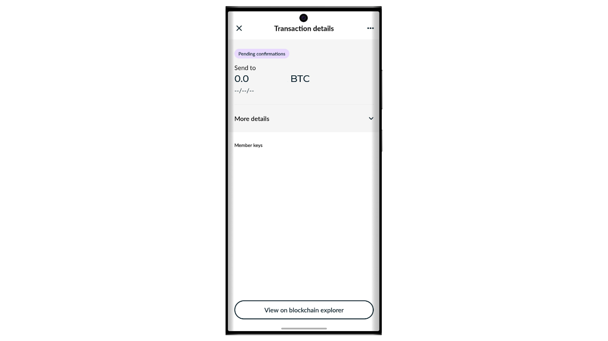

Bitcoin is an electronic cash system that allows us to perform peer-to-peer transactions. However, to be convinced that a transaction is immutable, it is necessary to wait for several confirmations (usually 6), to avoid any attempt of double spending by the sender. This validation delay can sometimes be inconvenient, especially when immediate finality similar to physical cash is desired. Unlike cash, where the possession of a bill is transferred instantly, Bitcoin transactions involve a waiting time before being definitively considered irreversible.

This is where the Satscard comes in. It offers a method to enable the physical and instant transmission of bitcoins, without needing to perform an on-chain transaction. The Satscard functions as a bearer card that allows for the secure transfer of bitcoin ownership, thus offering an experience closer to traditional cash. In this tutorial, I will introduce you to this solution.

## What is a Satscard?

The Satscard by Coinkite is the successor to the Opendime. It is an NFC card that allows for the physical transmission of bitcoins, similar to a bill or coin. Unlike a traditional hardware wallet, the Satscard is a bearer card, which means that physical possession of the card equates to ownership of the bitcoins that are secured with the keys stored on it. Its price ranges between $6.99 and $17.99 depending on the design chosen.

The Satscard chip is equipped with 10 slots, allowing it to store bitcoins up to 10 times on 10 different addresses. Each slot operates independently and should theoretically be used only once to lock bitcoins in it. To spend the bitcoins, simply unseal the slot with a compatible application, like Nunchuk, by entering the 6-digit verification code noted on the back of the Satscard.

The card ensures that the private key securing the bitcoins on the blockchain cannot be retained by the former owner once they physically part with the card. The recipient can also verify the validity of a slot and the amount stored in it at the time of the exchange.

This system is particularly useful for purchasing physical goods with bitcoins, or for giving bitcoins as a gift.

## How to buy a Satscard?

The Satscard is available for purchase [on the official Coinkite website](https://store.coinkite.com/store/category/satscard). To buy it in a physical store, you can also find [the list of certified resellers](https://coinkite.com/resellers) on the site.
You will also need a phone compatible with NFC communications, or a USB device to read NFC cards at the standard frequency of 13.56 MHz.
## How to load a slot on a Satscard?

Once you have received your Satscard, the first step is to check the packaging to ensure it hasn't been opened. If the package is damaged, it could indicate that the card has been compromised and might not be authentic.

To manage the Satscard, we will use the mobile application **Nunchuk Wallet**. Ensure your smartphone is NFC compatible, then download Nunchuk from the [Google Play Store](https://play.google.com/store/apps/details?id=io.nunchuk.android), the [App Store](https://apps.apple.com/us/app/nunchuk-bitcoin-wallet/id1563190073), or directly via its [`.apk` file](https://github.com/nunchuk-io/nunchuk-android/releases).

In theory, you could directly send bitcoins to the address specified on the back of your Satscard without using Nunchuk. However, I advise against doing this, as we will first verify that the address of the first slot is indeed derived from a private key stored in the Satscard and that it is not a fraudulent address.

If you are using Nunchuk for the first time, the app will offer you to create an account. For the purposes of this tutorial, it is not necessary to create one. So, select "*Continue as guest*" to continue without an account.

Then click on "*Unassisted wallet*".

Next, click on the "*I'll explore on my own*" button.

Once on the Nunchuk home screen, click on the "*NFC*" logo at the top of the screen.

Hold your Satscard to the back of your phone to scan it.

Nunchuk displays the receiving address corresponding to the first slot of your Satscard. Normally, this address should be identical to the one manually written on the back of your card. Copy this address and use it to transfer the bitcoins you wish to lock with this slot.

## How to check the bitcoins on a slot?

Once the transaction is confirmed, you can check the balance associated with a slot of your Satscard by scanning it with Nunchuk. Thus, during a transaction, the recipient of the bitcoins can instantly verify, via their Nunchuk app, that the card indeed contains the bitcoins owed to them.

If the counterparty does not have the Nunchuk app, they can still verify the validity of the Satscard. Simply activate NFC on their smartphone and place the Satscard at the back of the device. This will automatically open the Satscard website in a browser, where one can check the validity of the card as well as the amount in bitcoins associated with it.

## How to withdraw bitcoins from a slot?

Now that the first slot of the Satscard has been loaded with a certain amount of bitcoins, you can hand the card over to the payment recipient.

If you are the recipient, you need to install Nunchuk. Once in the app, click on the "*NFC*" logo at the top of the screen.

Place your Satscard at the back of your phone.

Nunchuk will reveal the amount secured on the address.

To unseal the private key and move the bitcoins to an address you own, click on the "*Unseal and sweep balance*" button.

The "*Sweep to a wallet*" option allows you to directly send the bitcoins to a wallet already present in your Nunchuk app. To transfer the funds to a different receiving address, select "*Withdraw to an address*".

Enter the receiving address where you wish to send the bitcoins secured by the Satscard. Make sure the entered address is correct (this is the only time you can verify it), then click on the "*Create transaction*" button.

Enter the PIN code of your Satscard. This 6-digit code is noted on the back of the physical card.

Keep your Satscard at the back of your smartphone while signing the transaction with the private key stored on the NFC card.

Your transaction is now signed and broadcasted on the Bitcoin network, meaning the slot used on your Satscard is now empty.

## How to reuse the Satscard?

Unlike single-use solutions such as Opendime, the Satscard is equipped with a chip containing 10 independent slots, allowing for up to 10 operations with a single card. The first slot, pre-configured in the factory by Coinkite, corresponds to the receiving address written on the back of your Satscard.

To activate the other 9 slots, you will need to generate the key pair and address via the Nunchuk app. On the homepage of the app, click on the "*NFC*" logo at the top of the screen.

Place your Satscard at the back of your phone.

Nunchuk indicates that no slot is active on the card, which is normal since the first one has already been used and the second one has not yet been generated. To see the previously used slots, click on "*View unsealed slots*". It is strongly advised against reusing these slots, as this would lead to address reuse harmful to your on-chain privacy. Therefore, we will set up a new slot by clicking on the "*Yes*" button.

You will now need to choose how you generate your master chain code.

The slots on the Satscard follow the BIP32 standard, meaning that the derivation of the cryptographic keys securing the bitcoins does not rely on a mnemonic phrase as in BIP39 wallets, but directly on a master private key and a master chain code. These two elements are used as input in the HMAC-SHA512 function to generate a child key pair. Each slot has its own master key and its own master chain code. There is only one level of derivation for each slot.

The key pair for the first slot is pre-generated by Coinkite. This is why you have direct access to it via Nunchuk, and why the receiving address is written on the back of the NFC card. For the other slots, however, you are responsible for generating the keys.

The master private key for each slot is generated directly by the Satscard, and the master chain codes must be provided from the outside. For the chain code of your new slot, you have two options: let Nunchuk generate it automatically by selecting "*Automatic*", or create it yourself by opting for "*Advanced*" and entering it in the dedicated space. For the chain code to be effective, it needs to be as random as possible.

Enter the 6-digit PIN noted on the back of the Satscard.

Place your Satscard at the back of your phone.

A new slot has been successfully configured. You can now see the receiving address to deposit bitcoins into. To proceed with loading, follow the instructions in the section "*How to load a slot on a Satscard?*" of this tutorial.
You can repeat this process up to 10 times on each Satscard.

Congratulations, you are now up to speed on using the Satscard! If you found this tutorial helpful, I would appreciate it if you could leave a thumbs up below. Feel free to share this article on your social networks. Thank you very much!