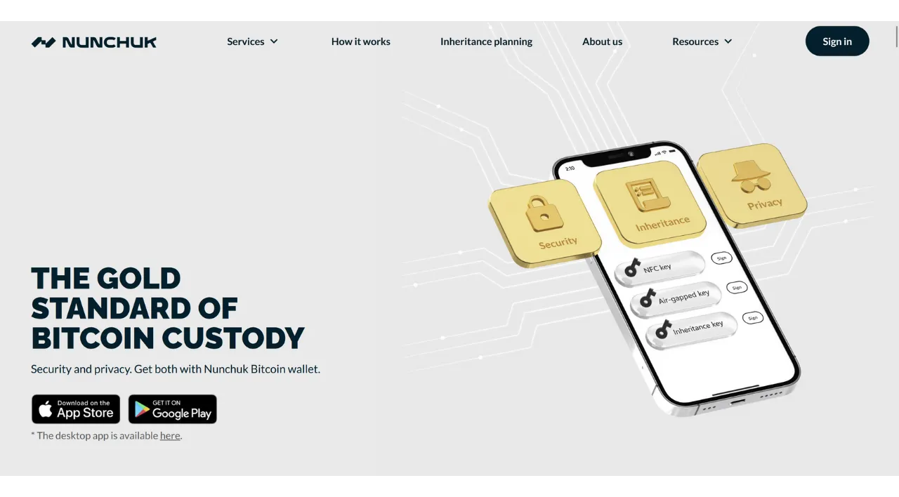
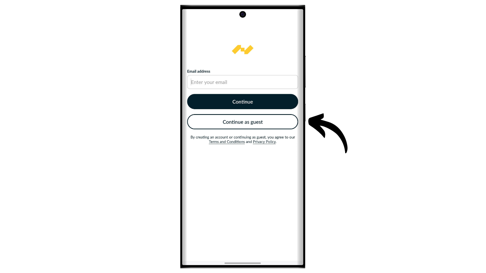
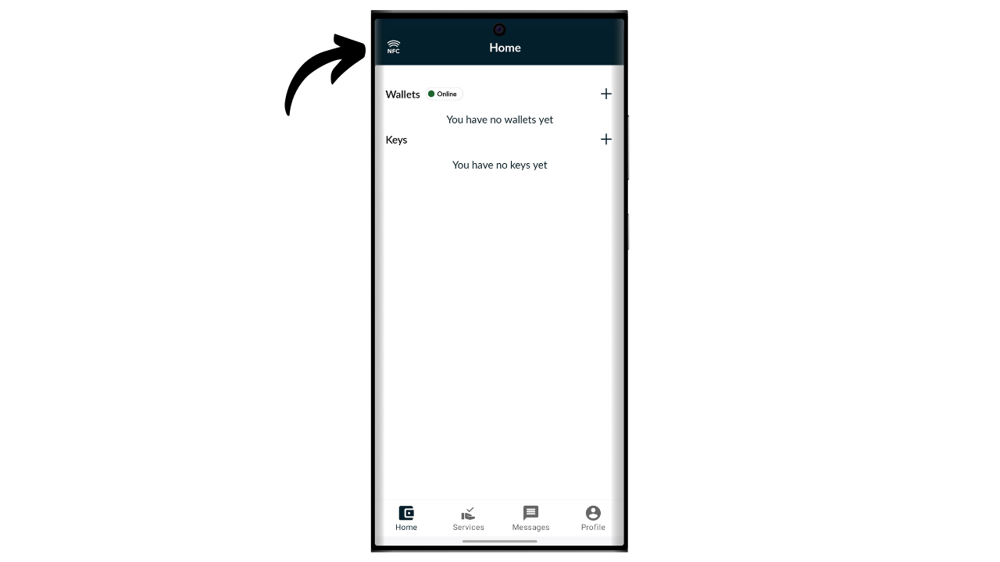
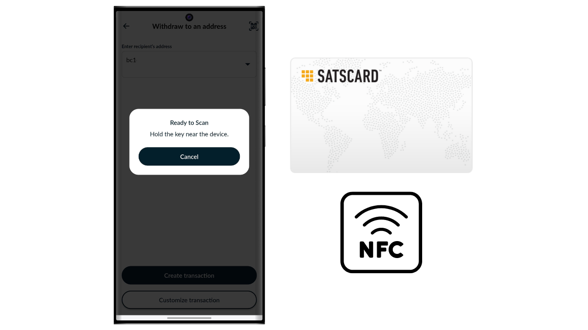

Bitcoin es un sistema de efectivo electrónico que nos permite realizar transacciones de igual a igual. Sin embargo, para estar convencidos de que una transacción es inmutable, es necesario esperar varias confirmaciones (generalmente 6), para evitar cualquier intento de doble gasto por parte del remitente. Este retraso en la validación a veces puede ser inconveniente, especialmente cuando se desea una finalidad inmediata similar al efectivo físico. A diferencia del efectivo, donde la posesión de un billete se transfiere instantáneamente, las transacciones de Bitcoin implican un tiempo de espera antes de ser consideradas definitivamente irreversibles.

Aquí es donde entra en juego la Satscard. Ofrece un método para habilitar la transmisión física e instantánea de bitcoins, sin necesidad de realizar una transacción en la cadena. La Satscard funciona como una tarjeta al portador que permite la transferencia segura de la propiedad de bitcoin, ofreciendo así una experiencia más cercana al efectivo tradicional. En este tutorial, te presentaré esta solución.

## ¿Qué es una Satscard?

La Satscard de Coinkite es la sucesora de la Opendime. Es una tarjeta NFC que permite la transmisión física de bitcoins, similar a un billete o moneda. A diferencia de una billetera de hardware tradicional, la Satscard es una tarjeta al portador, lo que significa que la posesión física de la tarjeta equivale a la propiedad de los bitcoins que están asegurados con las llaves almacenadas en ella. Su precio varía entre $6.99 y $17.99 dependiendo del diseño elegido.

El chip de la Satscard está equipado con 10 ranuras, lo que le permite almacenar bitcoins hasta 10 veces en 10 direcciones diferentes. Cada ranura opera de manera independiente y teóricamente debería usarse solo una vez para bloquear bitcoins en ella. Para gastar los bitcoins, simplemente desbloquea la ranura con una aplicación compatible, como Nunchuk, ingresando el código de verificación de 6 dígitos anotado en la parte posterior de la Satscard.

La tarjeta asegura que la clave privada que asegura los bitcoins en la blockchain no pueda ser retenida por el antiguo propietario una vez que se separan físicamente de la tarjeta. El receptor también puede verificar la validez de una ranura y la cantidad almacenada en ella en el momento del intercambio.

Este sistema es particularmente útil para comprar bienes físicos con bitcoins, o para dar bitcoins como regalo.

## ¿Cómo comprar una Satscard?

La Satscard está disponible para su compra [en el sitio web oficial de Coinkite](https://store.coinkite.com/store/category/satscard). Para comprarla en una tienda física, también puedes encontrar [la lista de revendedores certificados](https://coinkite.com/resellers) en el sitio.
También necesitarás un teléfono compatible con comunicaciones NFC, o un dispositivo USB para leer tarjetas NFC a la frecuencia estándar de 13.56 MHz.
## ¿Cómo cargar una ranura en una Satscard?

Una vez que hayas recibido tu Satscard, el primer paso es verificar el empaque para asegurarte de que no haya sido abierto. Si el paquete está dañado, podría indicar que la tarjeta ha sido comprometida y podría no ser auténtica.

Para gestionar la Satscard, utilizaremos la aplicación móvil **Nunchuk Wallet**. Asegúrate de que tu smartphone sea compatible con NFC, luego descarga Nunchuk desde la [Google Play Store](https://play.google.com/store/apps/details?id=io.nunchuk.android), la [App Store](https://apps.apple.com/us/app/nunchuk-bitcoin-wallet/id1563190073), o directamente a través de su archivo [`.apk`](https://github.com/nunchuk-io/nunchuk-android/releases).

En teoría, podrías enviar bitcoins directamente a la dirección especificada en el reverso de tu Satscard sin usar Nunchuk. Sin embargo, aconsejo no hacerlo, ya que primero verificaremos que la dirección del primer espacio esté realmente derivada de una clave privada almacenada en la Satscard y que no sea una dirección fraudulenta.

Si estás usando Nunchuk por primera vez, la aplicación te ofrecerá crear una cuenta. Para los propósitos de este tutorial, no es necesario crear una. Así que, selecciona "*Continuar como invitado*" para continuar sin una cuenta.

Luego haz clic en "*Cartera sin asistencia*".

A continuación, haz clic en el botón "*Exploraré por mi cuenta*".

Una vez en la pantalla de inicio de Nunchuk, haz clic en el logo de "*NFC*" en la parte superior de la pantalla.

Mantén tu Satscard en la parte trasera de tu teléfono para escanearlo.

Nunchuk muestra la dirección de recepción correspondiente al primer espacio de tu Satscard. Normalmente, esta dirección debería ser idéntica a la escrita manualmente en el reverso de tu tarjeta. Copia esta dirección y úsala para transferir los bitcoins que deseas asegurar con este espacio.

## ¿Cómo verificar los bitcoins en un espacio?

Una vez confirmada la transacción, puedes verificar el saldo asociado con un espacio de tu Satscard escaneándolo con Nunchuk. Así, durante una transacción, el receptor de los bitcoins puede verificar instantáneamente, a través de su aplicación Nunchuk, que la tarjeta contiene efectivamente los bitcoins que se le deben.

Si la contraparte no tiene la aplicación Nunchuk, aún pueden verificar la validez de la Satscard. Simplemente activa el NFC en su smartphone y coloca la Satscard en la parte trasera del dispositivo. Esto abrirá automáticamente el sitio web de Satscard en un navegador, donde se puede verificar la validez de la tarjeta así como la cantidad en bitcoins asociada con ella.

## ¿Cómo retirar bitcoins de un espacio?

Ahora que el primer espacio de la Satscard ha sido cargado con una cierta cantidad de bitcoins, puedes entregar la tarjeta al receptor del pago.

Si tú eres el receptor, necesitas instalar Nunchuk. Una vez en la aplicación, haz clic en el logo de "*NFC*" en la parte superior de la pantalla.

Coloca tu Satscard en la parte trasera de tu teléfono.

Nunchuk revelará la cantidad asegurada en la dirección.

Para desbloquear la clave privada y mover los bitcoins a una dirección que poseas, haz clic en el botón "*Desbloquear y barrer saldo*".

La opción "*Barrer hacia una cartera*" te permite enviar directamente los bitcoins a una cartera ya presente en tu aplicación Nunchuk. Para transferir los fondos a una dirección de recepción diferente, selecciona "*Retirar a una dirección*".

Introduce la dirección de recepción a la que deseas enviar los bitcoins asegurados por la Satscard. Asegúrate de que la dirección introducida sea correcta (esta es la única vez que podrás verificarla), luego haz clic en el botón "*Crear transacción*".

Introduce el código PIN de tu Satscard. Este código de 6 dígitos se encuentra en la parte trasera de la tarjeta física.

Mantén tu Satscard en la parte trasera de tu smartphone mientras firmas la transacción con la clave privada almacenada en la tarjeta NFC.

Tu transacción ahora está firmada y transmitida en la red de Bitcoin, lo que significa que el espacio utilizado en tu Satscard ahora está vacío.

## ¿Cómo reutilizar la Satscard?

A diferencia de soluciones de un solo uso como Opendime, la Satscard está equipada con un chip que contiene 10 espacios independientes, permitiendo hasta 10 operaciones con una sola tarjeta. El primer espacio, preconfigurado en la fábrica por Coinkite, corresponde a la dirección de recepción escrita en la parte trasera de tu Satscard.

Para activar los otros 9 espacios, necesitarás generar el par de claves y la dirección a través de la aplicación Nunchuk. En la página de inicio de la app, haz clic en el logo de "*NFC*" en la parte superior de la pantalla.

Coloca tu Satscard en la parte trasera de tu teléfono.

Nunchuk indica que no hay ningún espacio activo en la tarjeta, lo cual es normal ya que el primero ya ha sido utilizado y el segundo aún no ha sido generado. Para ver los espacios previamente utilizados, haz clic en "*Ver espacios desprecintados*". Se desaconseja fuertemente reutilizar estos espacios, ya que esto llevaría a la reutilización de direcciones perjudicial para tu privacidad en la cadena. Por lo tanto, configuraremos un nuevo espacio haciendo clic en el botón "*Sí*".

Ahora necesitarás elegir cómo generas tu código de cadena maestro.

Los espacios en la Satscard siguen el estándar BIP32, lo que significa que la derivación de las claves criptográficas que aseguran los bitcoins no depende de una frase mnemotécnica como en las carteras BIP39, sino directamente de una clave privada maestra y un código de cadena maestro. Estos dos elementos se utilizan como entrada en la función HMAC-SHA512 para generar un par de claves hijo. Cada espacio tiene su propia clave maestra y su propio código de cadena maestro. Solo hay un nivel de derivación para cada espacio.

El par de claves para el primer espacio es pregenerado por Coinkite. Es por esto que tienes acceso directo a él a través de Nunchuk, y por qué la dirección de recepción está escrita en la parte trasera de la tarjeta NFC. Para los otros espacios, sin embargo, tú eres responsable de generar las claves.

La clave privada maestra para cada espacio es generada directamente por la Satscard, y los códigos de cadena maestros deben ser proporcionados desde el exterior. Para el código de cadena de tu nuevo espacio, tienes dos opciones: dejar que Nunchuk lo genere automáticamente seleccionando "*Automático*", o crearlo tú mismo optando por "*Avanzado*" e introduciéndolo en el espacio dedicado. Para que el código de cadena sea efectivo, necesita ser lo más aleatorio posible.

Introduce el PIN de 6 dígitos que se encuentra en la parte trasera de la Satscard.

Coloca tu Satscard en la parte trasera de tu teléfono.

Se ha configurado exitosamente una nueva ranura. Ahora puedes ver la dirección de recepción para depositar bitcoins. Para proceder con la carga, sigue las instrucciones en la sección "*¿Cómo cargar una ranura en una Satscard?*" de este tutorial.
Puedes repetir este proceso hasta 10 veces en cada Satscard.

¡Felicidades, ahora estás al día en el uso de la Satscard! Si encontraste útil este tutorial, te agradecería mucho si pudieras dejar un pulgar arriba abajo. No dudes en compartir este artículo en tus redes sociales. ¡Muchas gracias!