Bitcoin on elektrooniline sularahasüsteem, mis võimaldab meil teostada peer-to-peer tehinguid. Siiski, et veenduda tehingu muutumatuses, on vajalik oodata mitu kinnitust (tavaliselt 6), et vältida saatja poolset topeltkulutamise katset. See valideerimise viivitus võib mõnikord olla ebamugav, eriti kui soovitakse kohest lõplikkust sarnaselt füüsilisele sularahale. Erinevalt sularahast, kus raha üleandmine toimub koheselt, kaasnevad Bitcoin tehingutega ooteaeg enne, kui neid peetakse lõplikult pöördumatuks.

Siin tuleb mängu Satscard. See pakub meetodit füüsiliseks ja koheseks bitcoinide edastamiseks, ilma et oleks vaja teostada on-chain tehingut. Satscard toimib kui kandekaart, mis võimaldab turvaliselt üle kanda bitcoini omandiõigust, pakkudes seeläbi kogemust, mis on lähedasem traditsioonilisele sularahale. Selles õpetuses tutvustan teile seda lahendust.

## Mis on Satscard?

Satscard firmalt Coinkite on Opendime'i järeltulija. See on NFC kaart, mis võimaldab füüsiliselt edastada bitcoine, sarnaselt pangatähele või mündile. Erinevalt traditsioonilisest riistvaralisest rahakotist on Satscard kandekaart, mis tähendab, et kaardi füüsiline valdamine võrdub selles turvatud bitcoinide omandiõigusega. Selle hind jääb vahemikku $6.99 kuni $17.99, olenevalt valitud disainist.

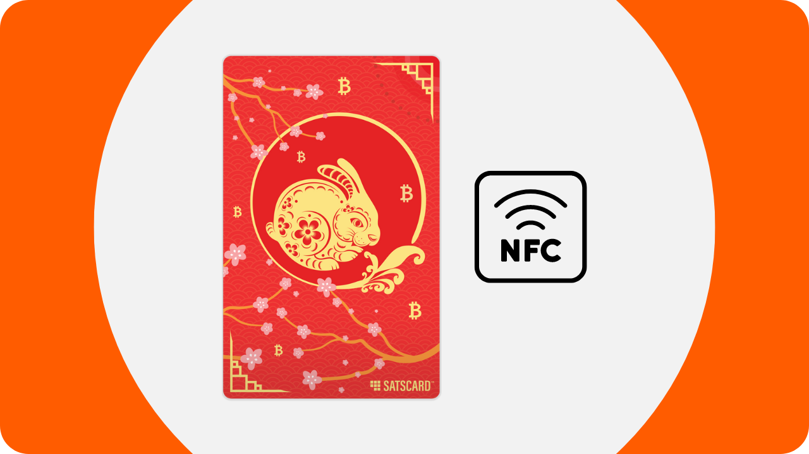

Satscardi kiip on varustatud 10 pesaga, võimaldades selles salvestada bitcoine kuni 10 korda 10 erineval aadressil. Iga pesa toimib iseseisvalt ja teoreetiliselt peaks seda kasutama ainult üks kord, et lukustada sellesse bitcoine. Bitcoinide kulutamiseks tuleb lihtsalt avada pesa ühilduva rakendusega, nagu Nunchuk, sisestades Satscardi tagaküljel märgitud 6-kohalise kinnituskoodi.

Kaart tagab, et bitcoine blockchainil turvav privaatvõti ei jää endise omaniku kätte, kui ta kaardist füüsiliselt loobub. Saaja saab samuti kontrollida pesa kehtivust ja selles hoitava summa suurust vahetuse hetkel.

See süsteem on eriti kasulik füüsiliste kaupade ostuks bitcoinidega või bitcoinide kinkimiseks.

## Kuidas osta Satscardi?

Satscardi saab osta [ametlikul Coinkite veebilehel](https://store.coinkite.com/store/category/satscard). Füüsilises poes ostmiseks leiate [sertifitseeritud edasimüüjate nimekirja](https://coinkite.com/resellers) samuti saidilt.
Teil on vaja ka NFC-kommunikatsiooniga ühilduvat telefoni või USB-seadet NFC-kaartide lugemiseks standardse 13,56 MHz sagedusel.
## Kuidas laadida Satscardi pesa?

Kui olete oma Satscardi kätte saanud, on esimene samm kontrollida pakendi avamata olekut. Kui pakend on kahjustatud, võib see viidata, et kaart on kompromiteeritud ja ei pruugi olla autentne.

Satscardi haldamiseks kasutame mobiilirakendust **Nunchuk Wallet**. Veenduge, et teie nutitelefon ühildub NFC-ga, seejärel laadige alla Nunchuk [Google Play poest](https://play.google.com/store/apps/details?id=io.nunchuk.android), [App Store'ist](https://apps.apple.com/us/app/nunchuk-bitcoin-wallet/id1563190073) või otse selle [`.apk` failist](https://github.com/nunchuk-io/nunchuk-android/releases).
Teoreetiliselt võiksite bitcoine otse saata aadressile, mis on märgitud teie Satscardi tagaküljele, kasutamata Nunchukit. Siiski soovitan seda mitte teha, kuna me kontrollime esmalt, et esimese pesa aadress on tõepoolest tuletatud Satscardis hoitavast privaatvõtmest ja et see ei ole petlik aadress.

Kui kasutate Nunchukit esimest korda, pakub rakendus teile konto loomist. Selle õpetuse eesmärgil ei ole konto loomine vajalik. Seega valige "*Jätka külalisena*", et jätkata ilma kontota.

Seejärel klõpsake "*Abistamata rahakott*".

Järgmiseks klõpsake nupul "*Uurin ise*".

Kui olete Nunchuki avalehel, klõpsake ekraani ülaosas asuval "*NFC*" logol.

Hoidke oma Satscardi telefoni tagakülje lähedal, et seda skannida.

Nunchuk kuvab vastuvõtu aadressi, mis vastab teie Satscardi esimesele pesale. Tavaliselt peaks see aadress olema identne teie kaardi tagaküljele käsitsi kirjutatuga. Kopeerige see aadress ja kasutage seda bitcoini ülekandmiseks, mida soovite selle pesaga lukustada.

## Kuidas kontrollida bitcoine pesas?

Kui tehing on kinnitatud, saate kontrollida oma Satscardi pesaga seotud saldo, skannides seda Nunchukiga. Seega, tehingu ajal, saab bitcoine vastuvõttev isik kohe kontrollida, kasutades oma Nunchuki rakendust, et kaart tõepoolest sisaldab neile võlgu olevaid bitcoine.

Kui vastaspoolel ei ole Nunchuki rakendust, saavad nad siiski kontrollida Satscardi kehtivust. Lihtsalt aktiveerige NFC oma nutitelefonis ja asetage Satscard seadme tagaküljele. See avab automaatselt Satscardi veebisaidi brauseris, kus saab kontrollida kaardi kehtivust ning sellega seotud bitcoini kogust.

## Kuidas bitcoine pesast välja võtta?

Nüüd, kui Satscardi esimene pesa on laetud teatud hulga bitcoinidega, saate kaardi üle anda makse saajale.

Kui olete saaja, peate installima Nunchuki. Rakenduses olles klõpsake ekraani ülaosas asuval "*NFC*" logol.

Asetage oma Satscard telefoni tagaküljele.

Nunchuk paljastab aadressil turvatud summa.

Privaatvõtme avamiseks ja bitcoinide liigutamiseks endale kuuluvasse aadressile klõpsake nupul "*Avasta ja tühjenda saldo*".

Valik "*Tühjenda rahakotti*" võimaldab teil bitcoine otse saata juba teie Nunchuki rakenduses olevasse rahakotti. Fondide ülekandmiseks erinevale vastuvõtu aadressile valige "*Võta välja aadressile*".
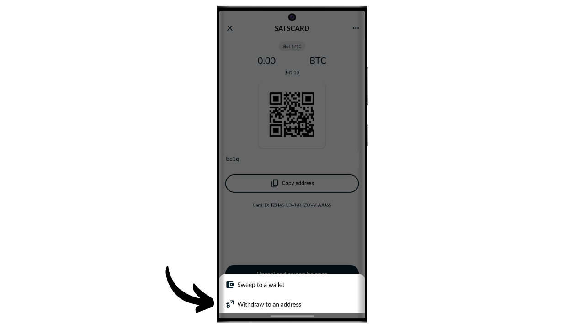
Sisestage vastuvõtva aadressi koht, kuhu soovite saata Satscardiga turvatud bitcoine. Veenduge, et sisestatud aadress on õige (see on ainus kord, kui saate seda kontrollida), seejärel klõpsake nupul "*Loo tehing*".

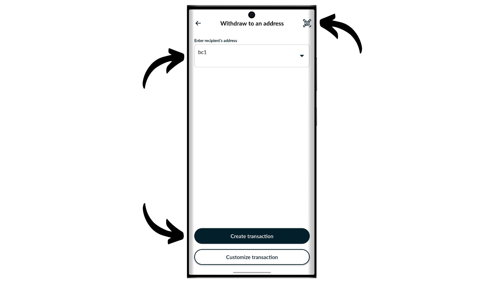

Sisestage oma Satscardi PIN-kood. See 6-kohaline kood on märgitud füüsilise kaardi tagaküljele.

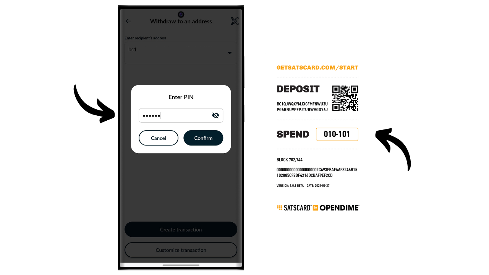

Hoidke oma Satscardi oma nutitelefoni tagaküljel, allkirjastades tehingu NFC-kaardil salvestatud privaatvõtmega.

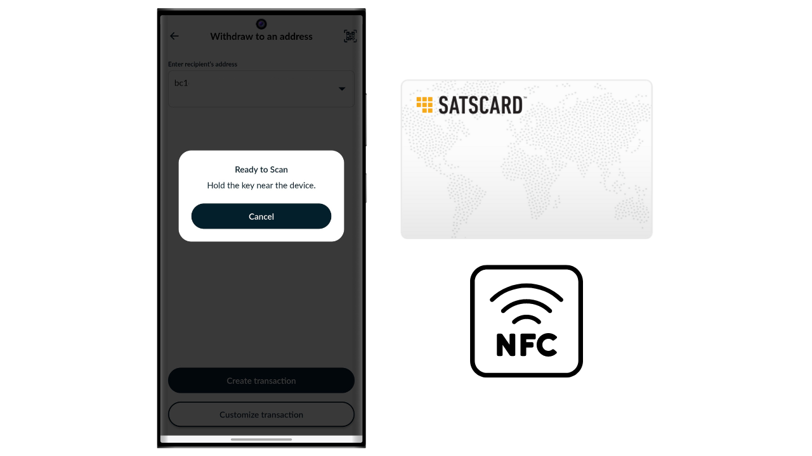

Teie tehing on nüüd allkirjastatud ja Bitcoin võrgus levitatud, mis tähendab, et teie Satscardil kasutatud pesa on nüüd tühi.

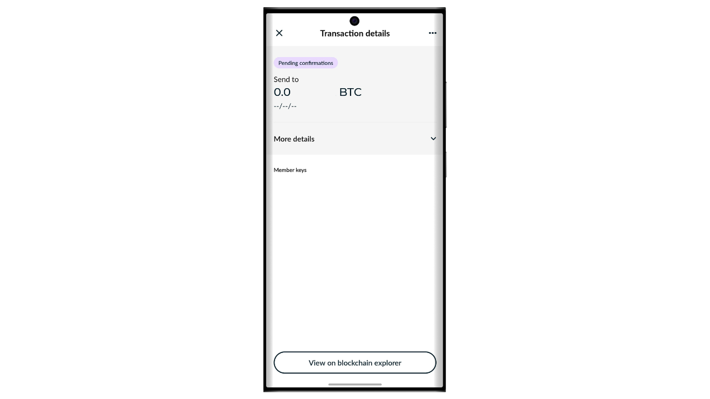

## Kuidas Satscardi uuesti kasutada?

Erinevalt ühekordsetest lahendustest nagu Opendime, on Satscard varustatud kiibiga, mis sisaldab 10 sõltumatut pesa, võimaldades kuni 10 toimingut ühe kaardiga. Esimene pesa, mis on tehases Coinkite poolt eelseadistatud, vastab vastuvõtva aadressile, mis on kirjutatud teie Satscardi tagaküljele.

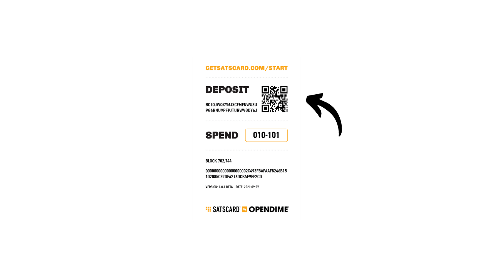
Ülejäänud 9 pesa aktiveerimiseks peate genereerima võtmepaari ja aadressi Nunchuk rakenduse kaudu. Rakenduse avalehel klõpsake ekraani ülaosas asuval "*NFC*" logol.
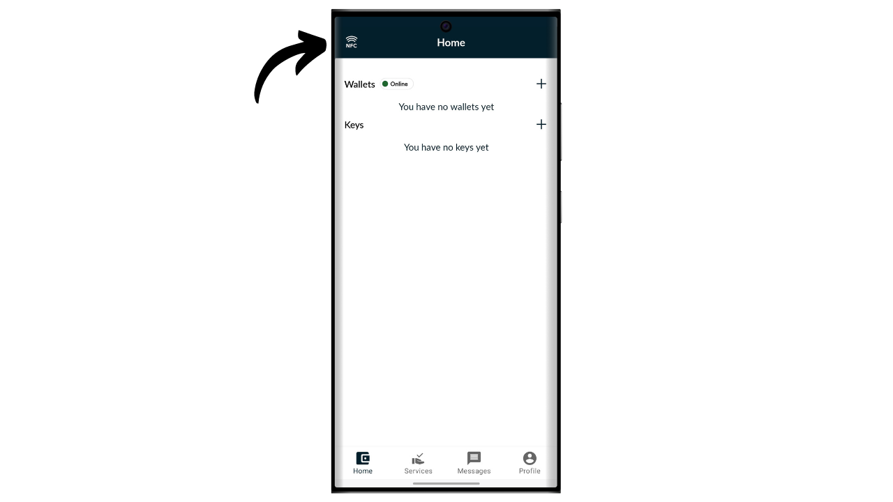

Asetage oma Satscard telefoni tagaküljele.

Nunchuk näitab, et kaardil ei ole aktiivseid pesasid, mis on normaalne, kuna esimene on juba kasutatud ja teine veel genereerimata. Eelnevalt kasutatud pesade vaatamiseks klõpsake "*Vaata avatud pesasid*". Nende pesade uuesti kasutamist ei soovitata, kuna see viiks aadressi korduvkasutuseni, mis kahjustab teie ahelas privaatsust. Seetõttu seadistame uue pesa, klõpsates nupul "*Jah*".

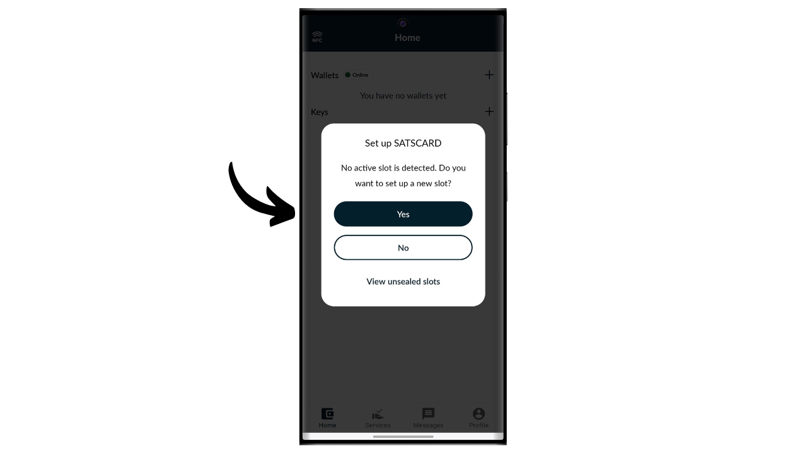

Nüüd peate valima, kuidas genereerite oma peamise ahelakoodi.

Satscardi pesad järgivad BIP32 standardit, mis tähendab, et krüptograafiliste võtmete tuletamine, mis turvavad bitcoine, ei sõltu mnemoonilisest fraasist nagu BIP39 rahakottides, vaid otse peamisest privaatvõtmest ja peamisest ahelakoodist. Neid kahte elementi kasutatakse sisendina HMAC-SHA512 funktsioonis, et genereerida lapse võtmepaar. Igal pesal on oma peavõti ja oma peamine ahelakood. Iga pesa jaoks on ainult üks tuletamise tase.

Esimene pesa võtmepaar on Coinkite poolt eelgenereeritud. Seetõttu on teil sellele otse juurdepääs Nunchuki kaudu ja seetõttu on vastuvõtva aadress kirjutatud NFC-kaardi tagaküljele. Teiste pesade jaoks olete aga võtmete genereerimise eest vastutav.

Iga pesa peamine privaatvõti genereeritakse otse Satscardi poolt ja peamised ahelakoodid tuleb väljastpoolt pakkuda. Uue pesa ahelakoodi jaoks on teil kaks võimalust: lasta Nunchukil see automaatselt genereerida, valides "*Automaatne*", või luua see ise, valides "*Täpsem*" ja sisestades selle ettenähtud kohta. Ahelakoodi efektiivsuse tagamiseks peab see olema võimalikult juhuslik.

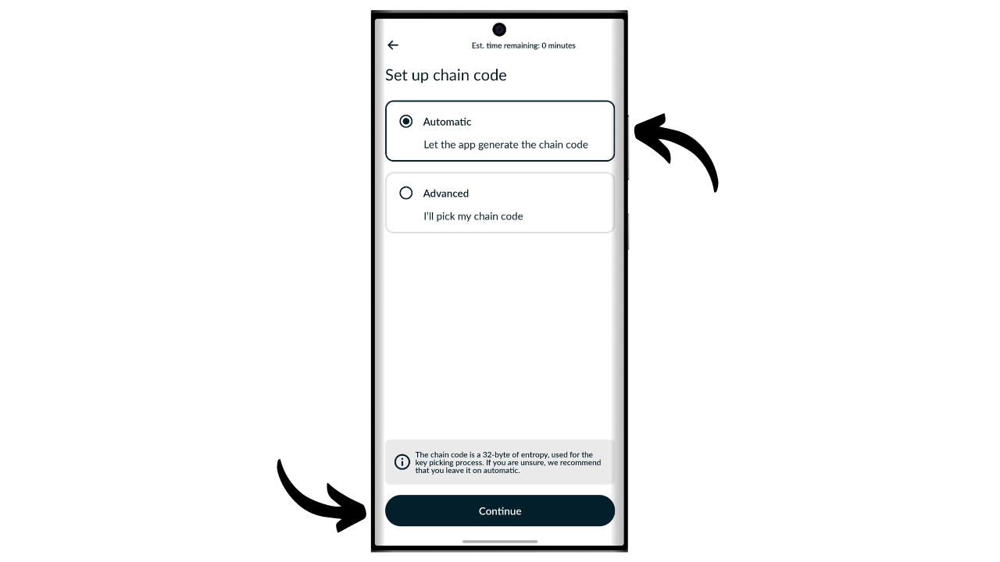
Sisestage 6-kohaline PIN, mis on märgitud teie Satscardi tagaküljele.
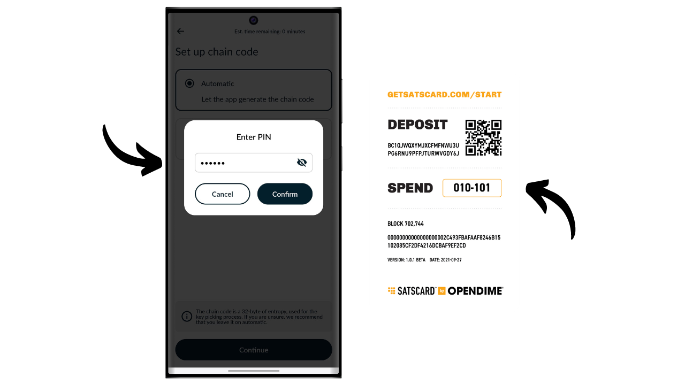

Asetage oma Satscard telefoni tagaküljele.

Uus pesa on edukalt seadistatud. Nüüd näete vastuvõtu aadressi, kuhu saate bitcoine sisestada. Laadimise jätkamiseks järgige juhiseid jaotises "*Kuidas laadida pesa Satscardil?*" selles õpetuses.
Seda protsessi saate korrata kuni 10 korda iga Satscardi kohta.

Palju õnne, nüüd olete Satscardi kasutamisel järje peal! Kui leidsite selle õpetuse kasuliku, oleksin tänulik, kui jätaksite allpool pöidla üles. Julgelt jagage seda artiklit oma sotsiaalvõrgustikes. Suur tänu!