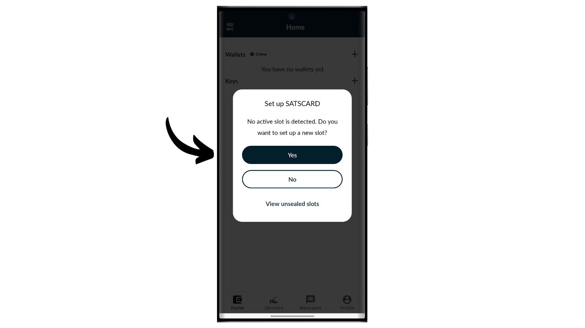

Bitcoin est un système de cash électronique qui nous permet d'effectuer des transactions en pair-à-pair. Cependant, pour être persuadé qu'une transaction est immuable, il est nécessaire d'attendre plusieurs confirmations (généralement 6), afin d'éviter toute tentative de double dépense de la part de l'envoyeur. Ce délai de validation peut parfois être contraignant, surtout lorsque l'on souhaite une finalité immédiate similaire à l'argent physique. Contrairement au cash, où la possession d'un billet se transmet instantanément, les transactions Bitcoin impliquent un temps d'attente avant d'être définitivement considérées comme irréversibles.

C'est ici qu'intervient la Satscard. Elle vous propose une méthode pour permettre la transmission de bitcoins de manière physique et instantanée, sans avoir besoin de réaliser une transaction on-chain. La Satscard fonctionne comme une carte au porteur qui permet de transférer la propriété des bitcoins de façon sécurisée, en offrant ainsi une expérience plus proche du cash traditionnel. Dans ce tutoriel, je vous propose de découvrir cette solution.

## C'est quoi une Satscard ?

La Satscard de Coinkite est la successeure de l'Opendime. C'est une carte NFC qui permet de transmettre physiquement des bitcoins, à la manière d'un billet ou d'une pièce de monnaie. Contrairement à un hardware wallet classique, la Satscard est une carte au porteur, ce qui signifie que la possession physique de la carte équivaut à la possession des bitcoins qui sont sécurisés avec les clés qui y sont stockées. Son prix varie entre 6,99 $ et 17,99 $ en fonction du design choisi.

La puce de la Satscard est dotée de 10 slots, ce qui permet d'y stocker des bitcoins jusqu'à 10 fois sur 10 adresses différentes. Chaque slot fonctionne indépendamment et doit en théorie être utilisé une seule fois pour y bloquer des bitcoins. Pour dépenser les bitcoins, il suffit de desceller le slot avec une application compatible, comme Nunchuk, en entrant le code de vérification à 6 chiffres noté au dos de la Satscard. 

La carte garantit que la clé privée qui sécurise les bitcoins sur la blockchain ne peut pas être conservée par l'ancien propriétaire du moment qu'il se sépare physiquement de la carte. Le destinataire peut aussi vérifier la validité d'un slot et le montant qui y est stocké au moment de l'échange.

Ce système est particulièrement utile pour des achats de biens physiques en bitcoins, ou pour offrir des bitcoins en cadeau.

## Comment acheter une Satscard ?

La Satscard est disponible à la vente [sur le site officiel de Coinkite](https://store.coinkite.com/store/category/satscard). Pour l'acheter dans une boutique physique, vous pouvez également retrouver [la liste des revendeurs certifiés](https://coinkite.com/resellers) sur le site.

Vous aurez également besoin d'un téléphone compatible avec les communications NFC, ou d'un périphérique USB pour lire les cartes NFC à la fréquence standard de 13,56 MHz.

## Comment charger un slot sur une Satscard ?

Une fois votre Satscard reçue, la première étape consiste à examiner l'emballage pour s'assurer qu'il n'a pas été ouvert. Si le colis est endommagé, cela pourrait indiquer que la carte a été compromise et qu'elle pourrait ne pas être authentique. 

Pour gérer la Satscard, nous allons utiliser l'application mobile **Nunchuk Wallet**. Vérifiez que votre smartphone est compatible NFC, puis téléchargez Nunchuk à partir du [Google Play Store](https://play.google.com/store/apps/details?id=io.nunchuk.android), de l'[App Store](https://apps.apple.com/us/app/nunchuk-bitcoin-wallet/id1563190073) ou directement via son [fichier `.apk`](https://github.com/nunchuk-io/nunchuk-android/releases).

En théorie, vous pourriez envoyer directement les bitcoins sur l'adresse spécifiée au dos de votre Satscard sans utiliser Nunchuk. Mais je vous déconseille de faire cela, car nous allons d'abord vérifier que l'adresse du premier slot est bien dérivée depuis une clé privée stockée dans la Satscard et que ce n'est pas une adresse frauduleuse.

Si vous utilisez Nunchuk pour la première fois, l'application vous proposera de créer un compte. Pour les besoins de ce tutoriel, il n'est pas nécessaire d'en créer un. Sélectionnez donc "*Continue as guest*" pour continuer sans compte.

Cliquez ensuite sur "*Unassisted wallet*".

Puis cliquez sur le bouton "*I'll explore on my own*".

Une fois sur l'accueil de Nunchuk, cliquez sur le logo "*NFC*" en haut de l'écran.

Maintenez votre Satscard au dos de votre téléphone pour la scanner.

Nunchuk affiche l'adresse de réception correspondant au premier slot de votre Satscard. Normalement, cette adresse devrait être identique à celle écrite manuellement au dos de votre carte. Copiez cette adresse et utilisez-la pour y transférer les bitcoins que vous souhaitez bloquer avec ce slot.

## Comment vérifier les bitcoins présents sur un slot ?

Une fois la transaction confirmée, vous pouvez consulter le solde associé à un slot de votre Satscard en la scannant avec Nunchuk. Ainsi, lors d'une transaction, le destinataire des bitcoins peut instantanément vérifier, via son application Nunchuk, que la carte contient effectivement les bitcoins qui lui sont dus.

Si la contrepartie n'a pas l'application Nunchuk, elle peut tout de même vérifier la validité de la Satscard. Il suffit d'activer le NFC sur son smartphone et de placer la Satscard à l'arrière de l'appareil. Cela ouvrira automatiquement le site web de Satscard dans un navigateur, où l'on pourra vérifier la validité de la carte ainsi que le montant en bitcoins qui y est associé.

## Comment retirer les bitcoins d'un slot ?

Maintenant que le premier slot de la Satscard a été chargé avec une certaine quantité de bitcoins, vous pouvez remettre la carte au destinataire du paiement.

Si vous en êtes le destinataire, vous devez installer Nunchuk. Une fois sur l'application, cliquez sur le logo "*NFC*" en haut de l'écran.

Placez votre Satscard au dos de votre téléphone.

Nunchuk vous révèle le montant sécurisé sur l'adresse.

Pour desceller la clé privée et déplacer les bitcoins sur une adresse qui vous appartient, cliquez sur le bouton "*Unseal and sweep balance*".

L'option "*Sweep to a wallet*" permet d'envoyer directement les bitcoins vers un portefeuille déjà présent dans votre application Nunchuk. Pour transférer les fonds vers une adresse de réception différente, sélectionnez "*Withdraw to an address*".

Indiquez l'adresse de réception où vous désirez envoyer les bitcoins sécurisés par la Satscard. Assurez-vous que l'adresse saisie est correcte (c'est le seul moment où vous pouvez la vérifier), puis cliquez sur le bouton "*Create transaction*".

Renseignez le code PIN de votre Satscard. Ce code à 6 chiffres est noté au dos de la carte physique.

Maintenez votre Satscard au dos de votre smartphone le temps de signer la transaction avec la clé privée stockée sur la carte NFC.

Votre transaction est maintenant signée et diffusée sur le réseau Bitcoin, ce qui signifie que le slot utilisé sur votre Satscard est dorénavant vide.

## Comment réutiliser la Satscard ?

Contrairement aux solutions à usage unique telles que l'Opendime, la Satscard est équipée d'une puce contenant 10 slots indépendants, permettant ainsi de réaliser jusqu'à 10 opérations avec une seule carte. Le premier slot, préconfiguré en usine par Coinkite, correspond à l'adresse de réception inscrite au dos de votre Satscard.

Pour activer les 9 autres slots, il vous faudra générer la paire de clés et l'adresse via l'application Nunchuk. Sur la page d'accueil de l'application, cliquez sur le logo "*NFC*" situé en haut de l'écran.

Placez votre Satscard au dos de votre téléphone.

Nunchuk indique qu'aucun slot n'est actif sur la carte, ce qui est normal puisque le premier a déjà été utilisé et que le deuxième n'a pas encore été généré. Pour voir les slots précédemment utilisés, cliquez sur "*View unsealed slots*". Il est fortement déconseillé de réutiliser ces slots, car cela entraînerait une réutilisation d'adresse nuisible à votre confidentialité on-chain. Nous allons donc configurer un nouveau slot en cliquant sur le bouton "*Yes*".

Vous devrez maintenant choisir la manière dont vous générez votre code de chaîne maître. 

Les slots de la Satscard suivent le standard BIP32, ce qui signifie que la dérivation des clés cryptographiques qui sécurisent les bitcoins ne repose pas sur une phrase mnémonique comme dans les portefeuilles BIP39, mais directement sur une clé privée maîtresse et un code de chaîne maître. Ces deux éléments sont utilisés en input dans la fonction HMAC-SHA512 pour générer une paire de clés enfant. Chaque slot possède sa propre clé maîtresse et son propre code de chaîne maître. Il n'y a qu'une seule profondeur de dérivation pour chaque slot.

La paire de clés du premier slot est pré-générée par Coinkite. C'est pour cette raison que vous y avez accès directement via Nunchuk, et que l'adresse de réception est inscrite au dos de la carte NFC. Pour les autres slots, cependant, la génération des clés vous incombe.

La clé privée maîtresse de chaque slot est générée directement par la Satscard, et les codes de chaîne maîtres doivent être fournis de l'extérieur. Pour le code de chaîne de votre nouveau slot, vous avez deux options : laissez Nunchuk le générer automatiquement en sélectionnant "*Automatic*", ou créez-le vous-même en optant pour "*Advanced*" et en le saisissant dans l'espace dédié. Pour que le code de chaîne soit efficace, il faut qu'il soit le plus aléatoire possible.

Renseignez le code PIN à 6 chiffres noté au dos de la Satscard.

Placez votre Satscard au dos de votre téléphone.

Un nouveau slot a bien été configuré. Vous pouvez maintenant voir l'adresse de réception pour y déposer des bitcoins. Pour procéder au chargement, suivez les instructions de la section "*Comment charger un slot sur une Satscard ?*" de ce tutoriel.

Vous pouvez répéter ce processus jusqu'à 10 fois sur chaque Satscard.

Félicitations, vous êtes maintenant au point sur l'utilisation de la Satscard ! Si vous avez trouvé ce tutoriel utile, je vous serais reconnaissant de laisser un pouce vert ci-dessous. N'hésitez pas à partager cet article sur vos réseaux sociaux. Merci beaucoup !
