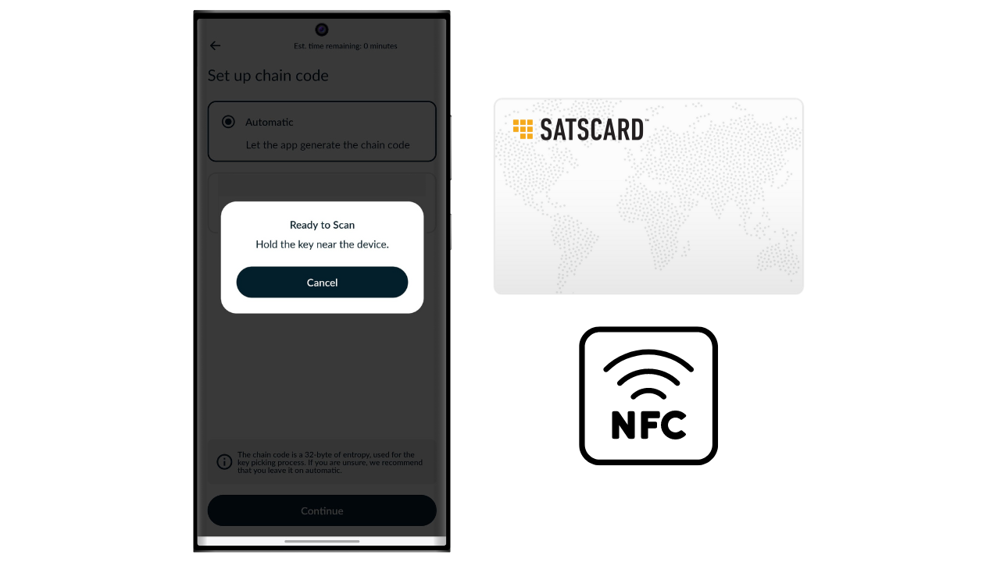

Bitcoin adalah sistem uang elektronik yang memungkinkan kita untuk melakukan transaksi peer-to-peer. Namun, untuk meyakinkan bahwa sebuah transaksi tidak dapat diubah, diperlukan beberapa konfirmasi (biasanya 6), untuk menghindari kemungkinan pengeluaran ganda oleh pengirim. Keterlambatan validasi ini terkadang bisa menjadi tidak nyaman, terutama ketika kefinalan segera seperti uang tunai fisik diinginkan. Berbeda dengan uang tunai, di mana kepemilikan sebuah uang kertas ditransfer secara instan, transaksi Bitcoin melibatkan waktu tunggu sebelum dianggap tidak dapat dibalik secara definitif.

Di sinilah Satscard berperan. Ini menawarkan metode untuk memungkinkan transmisi fisik dan instan bitcoin, tanpa perlu melakukan transaksi on-chain. Satscard berfungsi sebagai kartu pemegang yang memungkinkan transfer kepemilikan bitcoin secara aman, sehingga menawarkan pengalaman yang lebih dekat dengan uang tunai tradisional. Dalam tutorial ini, saya akan memperkenalkan Anda pada solusi ini.

## Apa itu Satscard?

Satscard dari Coinkite adalah penerus dari Opendime. Ini adalah kartu NFC yang memungkinkan transmisi fisik bitcoin, serupa dengan uang kertas atau koin. Tidak seperti dompet hardware tradisional, Satscard adalah kartu pemegang, yang berarti bahwa kepemilikan fisik kartu sama dengan kepemilikan bitcoin yang diamankan dengan kunci yang disimpan di dalamnya. Harganya berkisar antara $6.99 dan $17.99 tergantung pada desain yang dipilih.

Chip Satscard dilengkapi dengan 10 slot, memungkinkannya untuk menyimpan bitcoin hingga 10 kali di 10 alamat berbeda. Setiap slot beroperasi secara independen dan secara teoritis harus digunakan hanya sekali untuk mengunci bitcoin di dalamnya. Untuk menghabiskan bitcoin, cukup buka segel slot dengan aplikasi yang kompatibel, seperti Nunchuk, dengan memasukkan kode verifikasi 6 digit yang tercatat di bagian belakang Satscard.

Kartu ini memastikan bahwa kunci privat yang mengamankan bitcoin di blockchain tidak dapat ditahan oleh pemilik sebelumnya setelah mereka secara fisik berpisah dengan kartu. Penerima juga dapat memverifikasi validitas slot dan jumlah yang disimpan di dalamnya pada saat pertukaran.

Sistem ini sangat berguna untuk membeli barang fisik dengan bitcoin, atau untuk memberikan bitcoin sebagai hadiah.

## Bagaimana cara membeli Satscard?

Satscard tersedia untuk dibeli [di situs resmi Coinkite](https://store.coinkite.com/store/category/satscard). Untuk membelinya di toko fisik, Anda juga dapat menemukan [daftar reseller bersertifikat](https://coinkite.com/resellers) di situs tersebut.
Anda juga akan memerlukan telepon yang kompatibel dengan komunikasi NFC, atau perangkat USB untuk membaca kartu NFC pada frekuensi standar 13.56 MHz.
## Bagaimana cara memuat slot di Satscard?

Setelah Anda menerima Satscard Anda, langkah pertama adalah memeriksa kemasannya untuk memastikan tidak ada yang terbuka. Jika kemasan rusak, itu bisa menunjukkan bahwa kartu telah dikompromikan dan mungkin tidak asli.

Untuk mengelola Satscard, kita akan menggunakan aplikasi seluler **Nunchuk Wallet**. Pastikan smartphone Anda kompatibel dengan NFC, kemudian unduh Nunchuk dari [Google Play Store](https://play.google.com/store/apps/details?id=io.nunchuk.android), [App Store](https://apps.apple.com/us/app/nunchuk-bitcoin-wallet/id1563190073), atau langsung melalui file [`.apk`](https://github.com/nunchuk-io/nunchuk-android/releases) nya.
Secara teori, Anda bisa langsung mengirim bitcoin ke alamat yang ditentukan di bagian belakang Satscard Anda tanpa menggunakan Nunchuk. Namun, saya menyarankan agar tidak melakukan ini, karena kami akan terlebih dahulu memverifikasi bahwa alamat slot pertama memang berasal dari kunci privat yang disimpan di Satscard dan bukan alamat palsu.

Jika Anda menggunakan Nunchuk untuk pertama kalinya, aplikasi akan menawarkan Anda untuk membuat akun. Untuk tujuan tutorial ini, tidak perlu membuat satu. Jadi, pilih "*Lanjutkan sebagai tamu*" untuk melanjutkan tanpa akun.

Kemudian klik pada "*Dompet tanpa bantuan*".

Selanjutnya, klik tombol "*Saya akan menjelajah sendiri*".

Setelah berada di layar utama Nunchuk, klik pada logo "*NFC*" di bagian atas layar.

Dekatkan Satscard Anda ke bagian belakang ponsel Anda untuk memindainya.

Nunchuk menampilkan alamat penerima yang sesuai dengan slot pertama Satscard Anda. Biasanya, alamat ini harus identik dengan yang ditulis secara manual di bagian belakang kartu Anda. Salin alamat ini dan gunakannya untuk mentransfer bitcoin yang ingin Anda kunci dengan slot ini.

## Bagaimana cara memeriksa bitcoin pada slot?

Setelah transaksi dikonfirmasi, Anda dapat memeriksa saldo yang terkait dengan slot Satscard Anda dengan memindainya menggunakan Nunchuk. Dengan demikian, selama transaksi, penerima bitcoin dapat langsung memverifikasi, melalui aplikasi Nunchuk mereka, bahwa kartu memang mengandung bitcoin yang berhutang kepada mereka.

Jika pihak lain tidak memiliki aplikasi Nunchuk, mereka masih dapat memverifikasi keabsahan Satscard. Cukup aktifkan NFC pada smartphone mereka dan letakkan Satscard di bagian belakang perangkat. Ini akan secara otomatis membuka situs web Satscard di browser, di mana seseorang dapat memeriksa keabsahan kartu serta jumlah bitcoin yang terkait dengannya.

## Bagaimana cara menarik bitcoin dari slot?

Sekarang setelah slot pertama Satscard telah diisi dengan sejumlah bitcoin, Anda dapat menyerahkan kartu tersebut kepada penerima pembayaran.

Jika Anda adalah penerima, Anda perlu menginstal Nunchuk. Setelah di dalam aplikasi, klik pada logo "*NFC*" di bagian atas layar.

Letakkan Satscard Anda di bagian belakang ponsel Anda.

Nunchuk akan mengungkapkan jumlah yang diamankan pada alamat tersebut.

Untuk membuka kunci privat dan memindahkan bitcoin ke alamat yang Anda miliki, klik pada tombol "*Buka kunci dan sapu saldo*".

Opsi "*Sapu ke dompet*" memungkinkan Anda untuk langsung mengirim bitcoin ke dompet yang sudah ada di aplikasi Nunchuk Anda. Untuk mentransfer dana ke alamat penerima yang berbeda, pilih "*Tarik ke alamat*".
Masukkan alamat penerima tempat Anda ingin mengirimkan bitcoin yang diamankan oleh Satscard. Pastikan alamat yang dimasukkan sudah benar (ini adalah satu-satunya waktu Anda dapat memverifikasinya), kemudian klik tombol "*Create transaction*".

Masukkan kode PIN dari Satscard Anda. Kode 6 digit ini tercatat di bagian belakang kartu fisik.

Simpan Satscard Anda di belakang smartphone Anda saat menandatangani transaksi dengan kunci privat yang tersimpan di kartu NFC.

Transaksi Anda sekarang telah ditandatangani dan disiarkan di jaringan Bitcoin, artinya slot yang digunakan di Satscard Anda sekarang kosong.

## Bagaimana cara menggunakan kembali Satscard?

Berbeda dengan solusi sekali pakai seperti Opendime, Satscard dilengkapi dengan chip yang berisi 10 slot independen, memungkinkan hingga 10 operasi dengan satu kartu. Slot pertama, yang telah dikonfigurasi di pabrik oleh Coinkite, sesuai dengan alamat penerima yang tertulis di bagian belakang Satscard Anda.

Untuk mengaktifkan 9 slot lainnya, Anda perlu menghasilkan pasangan kunci dan alamat melalui aplikasi Nunchuk. Di halaman utama aplikasi, klik pada logo "*NFC*" di bagian atas layar.

Letakkan Satscard Anda di belakang ponsel Anda.

Nunchuk menunjukkan bahwa tidak ada slot yang aktif di kartu, yang normal karena yang pertama sudah digunakan dan yang kedua belum dihasilkan. Untuk melihat slot yang sebelumnya digunakan, klik pada "*View unsealed slots*". Sangat disarankan untuk tidak menggunakan kembali slot ini, karena hal ini akan menyebabkan penggunaan alamat ulang yang merugikan privasi on-chain Anda. Oleh karena itu, kita akan menyiapkan slot baru dengan mengklik tombol "*Yes*".

Anda sekarang perlu memilih bagaimana Anda menghasilkan kode rantai induk Anda.

Slot di Satscard mengikuti standar BIP32, yang berarti bahwa derivasi kunci kriptografis yang mengamankan bitcoin tidak bergantung pada frasa mnemonik seperti di dompet BIP39, tetapi langsung pada kunci privat induk dan kode rantai induk. Kedua elemen ini digunakan sebagai input dalam fungsi HMAC-SHA512 untuk menghasilkan pasangan kunci anak. Setiap slot memiliki kunci induknya sendiri dan kode rantai induknya sendiri. Hanya ada satu tingkat derivasi untuk setiap slot.

Pasangan kunci untuk slot pertama telah dihasilkan sebelumnya oleh Coinkite. Inilah mengapa Anda memiliki akses langsung kepadanya melalui Nunchuk, dan mengapa alamat penerima tertulis di bagian belakang kartu NFC. Untuk slot lainnya, bagaimanapun, Anda bertanggung jawab untuk menghasilkan kuncinya.

Kunci privat induk untuk setiap slot dihasilkan langsung oleh Satscard, dan kode rantai induk harus disediakan dari luar. Untuk kode rantai slot baru Anda, Anda memiliki dua pilihan: biarkan Nunchuk menghasilkannya secara otomatis dengan memilih "*Automatic*", atau buatlah sendiri dengan memilih "*Advanced*" dan memasukkannya di ruang yang disediakan. Agar kode rantai efektif, perlu seacak mungkin.
Masukkan PIN 6-digit yang tertera di bagian belakang Satscard Anda.

Letakkan Satscard Anda di bagian belakang ponsel Anda.

Sebuah slot baru telah berhasil dikonfigurasi. Anda sekarang dapat melihat alamat penerima untuk menyetorkan bitcoin. Untuk melanjutkan dengan pengisian, ikuti instruksi pada bagian "*Cara mengisi slot pada Satscard?*" dari tutorial ini.
Anda dapat mengulangi proses ini hingga 10 kali pada setiap Satscard.

Selamat, Anda sekarang sudah menguasai penggunaan Satscard! Jika Anda merasa tutorial ini bermanfaat, saya akan sangat menghargai jika Anda bisa meninggalkan jempol ke atas di bawah ini. Jangan ragu untuk membagikan artikel ini di jaringan sosial Anda. Terima kasih banyak!