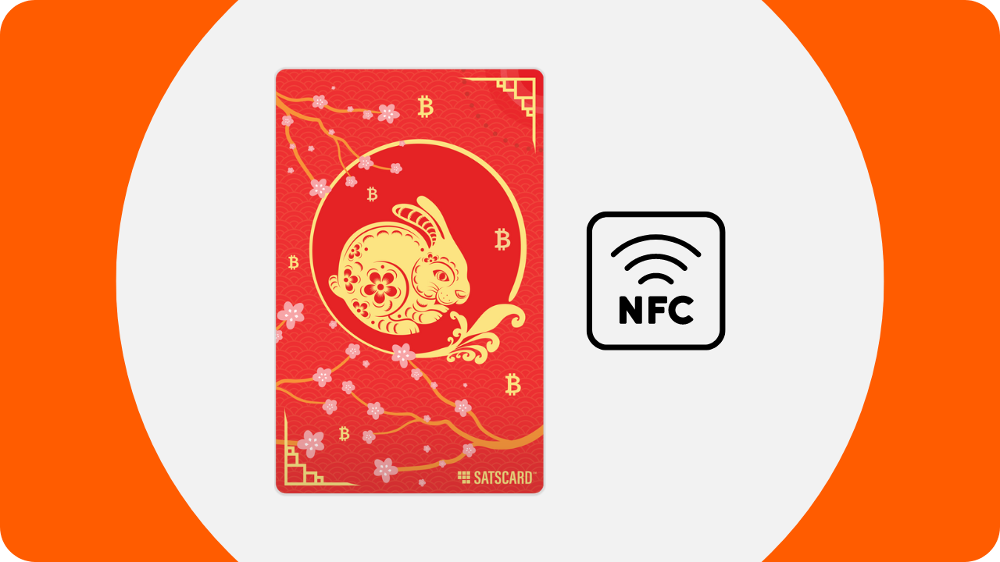
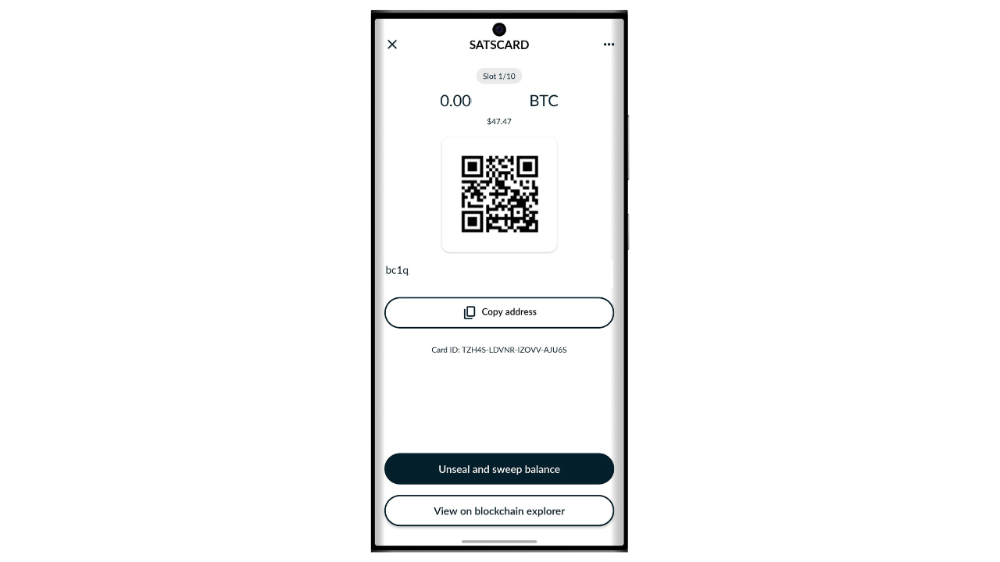
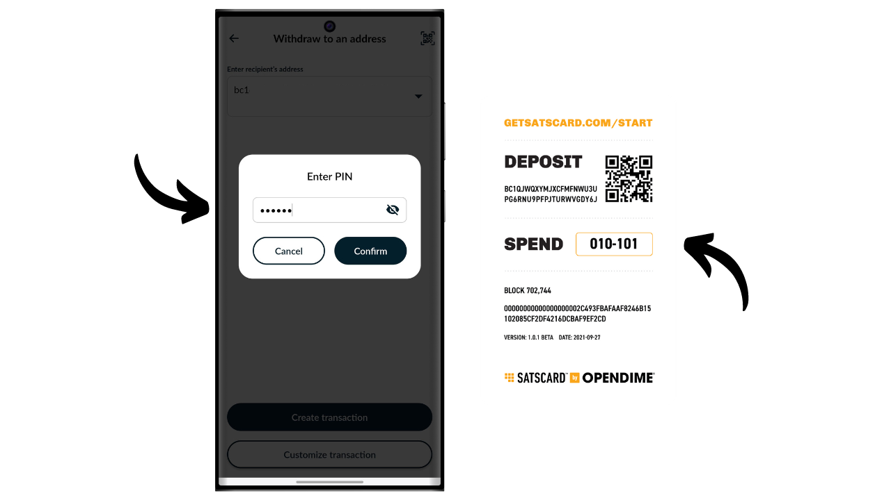

Bitcoin é um sistema de dinheiro eletrônico que nos permite realizar transações peer-to-peer. No entanto, para estar convencido de que uma transação é imutável, é necessário esperar por várias confirmações (geralmente 6), para evitar qualquer tentativa de duplo gasto pelo remetente. Esse atraso na validação pode ser inconveniente às vezes, especialmente quando se deseja uma finalidade imediata semelhante ao dinheiro físico. Ao contrário do dinheiro, onde a posse de uma cédula é transferida instantaneamente, as transações em Bitcoin envolvem um tempo de espera antes de serem definitivamente consideradas irreversíveis.

É aqui que entra o Satscard. Ele oferece um método para possibilitar a transmissão física e instantânea de bitcoins, sem a necessidade de realizar uma transação on-chain. O Satscard funciona como um cartão portador que permite a transferência segura da propriedade de bitcoins, oferecendo assim uma experiência mais próxima ao dinheiro tradicional. Neste tutorial, vou apresentá-lo a essa solução.

## O que é um Satscard?

O Satscard da Coinkite é o sucessor do Opendime. É um cartão NFC que permite a transmissão física de bitcoins, semelhante a uma cédula ou moeda. Ao contrário de uma carteira de hardware tradicional, o Satscard é um cartão portador, o que significa que a posse física do cartão equivale à propriedade dos bitcoins que estão seguros com as chaves armazenadas nele. Seu preço varia entre $6.99 e $17.99, dependendo do design escolhido.

O chip do Satscard é equipado com 10 slots, permitindo armazenar bitcoins até 10 vezes em 10 endereços diferentes. Cada slot opera independentemente e, teoricamente, deve ser usado apenas uma vez para bloquear bitcoins nele. Para gastar os bitcoins, basta desbloquear o slot com um aplicativo compatível, como o Nunchuk, inserindo o código de verificação de 6 dígitos anotado no verso do Satscard.

O cartão garante que a chave privada que protege os bitcoins na blockchain não possa ser retida pelo antigo proprietário uma vez que eles se separem fisicamente do cartão. O destinatário também pode verificar a validade de um slot e a quantidade armazenada nele no momento da troca.

Este sistema é particularmente útil para comprar bens físicos com bitcoins, ou para dar bitcoins como presente.

## Como comprar um Satscard?

O Satscard está disponível para compra [no site oficial da Coinkite](https://store.coinkite.com/store/category/satscard). Para comprá-lo em uma loja física, você também pode encontrar [a lista de revendedores certificados](https://coinkite.com/resellers) no site.
Você também precisará de um telefone compatível com comunicações NFC, ou de um dispositivo USB para ler cartões NFC na frequência padrão de 13.56 MHz.
## Como carregar um slot em um Satscard?

Uma vez que você tenha recebido seu Satscard, o primeiro passo é verificar a embalagem para garantir que ela não tenha sido aberta. Se a embalagem estiver danificada, isso pode indicar que o cartão foi comprometido e pode não ser autêntico.

Para gerenciar o Satscard, usaremos o aplicativo móvel **Nunchuk Wallet**. Certifique-se de que seu smartphone seja compatível com NFC, depois baixe o Nunchuk da [Google Play Store](https://play.google.com/store/apps/details?id=io.nunchuk.android), da [App Store](https://apps.apple.com/us/app/nunchuk-bitcoin-wallet/id1563190073), ou diretamente via seu arquivo [`.apk`](https://github.com/nunchuk-io/nunchuk-android/releases).

Teoricamente, você poderia enviar bitcoins diretamente para o endereço especificado no verso do seu Satscard sem usar o Nunchuk. No entanto, eu aconselho contra isso, pois primeiro verificaremos se o endereço do primeiro slot é realmente derivado de uma chave privada armazenada no Satscard e que não é um endereço fraudulento.

Se você está usando o Nunchuk pela primeira vez, o aplicativo oferecerá a você a opção de criar uma conta. Para os propósitos deste tutorial, não é necessário criar uma. Então, selecione "*Continuar como convidado*" para continuar sem uma conta.

Em seguida, clique em "*Carteira sem assistência*".

Depois, clique no botão "*Explorarei por conta própria*".

Uma vez na tela inicial do Nunchuk, clique no logo "*NFC*" no topo da tela.

Segure seu Satscard na parte de trás do seu telefone para escaneá-lo.

O Nunchuk exibe o endereço de recebimento correspondente ao primeiro slot do seu Satscard. Normalmente, este endereço deve ser idêntico ao que foi manualmente escrito no verso do seu cartão. Copie este endereço e use-o para transferir os bitcoins que você deseja bloquear com este slot.

## Como verificar os bitcoins em um slot?

Uma vez que a transação seja confirmada, você pode verificar o saldo associado a um slot do seu Satscard escaneando-o com o Nunchuk. Assim, durante uma transação, o destinatário dos bitcoins pode verificar instantaneamente, via seu aplicativo Nunchuk, que o cartão de fato contém os bitcoins devidos a eles.

Se a contraparte não tiver o aplicativo Nunchuk, ainda assim poderá verificar a validade do Satscard. Basta ativar o NFC em seu smartphone e colocar o Satscard na parte de trás do dispositivo. Isso abrirá automaticamente o site do Satscard em um navegador, onde se pode verificar a validade do cartão, bem como a quantidade em bitcoins associada a ele.

## Como retirar bitcoins de um slot?

Agora que o primeiro slot do Satscard foi carregado com uma certa quantidade de bitcoins, você pode entregar o cartão ao destinatário do pagamento.

Se você é o destinatário, precisa instalar o Nunchuk. Uma vez no aplicativo, clique no logo "*NFC*" no topo da tela.

Coloque seu Satscard na parte de trás do seu telefone.

O Nunchuk revelará o montante assegurado no endereço.

Para desbloquear a chave privada e mover os bitcoins para um endereço de sua propriedade, clique no botão "*Desbloquear e transferir saldo*".

A opção "*Transferir para uma carteira*" permite que você envie os bitcoins diretamente para uma carteira já presente no seu aplicativo Nunchuk. Para transferir os fundos para um endereço de recebimento diferente, selecione "*Retirar para um endereço*".

Insira o endereço de recebimento para onde deseja enviar os bitcoins protegidos pelo Satscard. Certifique-se de que o endereço inserido está correto (esta é a única vez que você pode verificar isso), então clique no botão "*Criar transação*".

Digite o código PIN do seu Satscard. Este código de 6 dígitos está anotado no verso do cartão físico.

Mantenha seu Satscard na parte de trás do seu smartphone enquanto assina a transação com a chave privada armazenada no cartão NFC.

Sua transação agora está assinada e transmitida na rede Bitcoin, significando que o slot usado no seu Satscard agora está vazio.

## Como reutilizar o Satscard?

Ao contrário de soluções de uso único como a Opendime, o Satscard é equipado com um chip contendo 10 slots independentes, permitindo até 10 operações com um único cartão. O primeiro slot, pré-configurado na fábrica pela Coinkite, corresponde ao endereço de recebimento escrito no verso do seu Satscard.

Para ativar os outros 9 slots, você precisará gerar o par de chaves e o endereço através do aplicativo Nunchuk. Na página inicial do aplicativo, clique no logo "*NFC*" no topo da tela.

Coloque seu Satscard na parte de trás do seu telefone.

Nunchuk indica que nenhum slot está ativo no cartão, o que é normal, já que o primeiro já foi utilizado e o segundo ainda não foi gerado. Para ver os slots anteriormente usados, clique em "*Ver slots deslacrados*". É fortemente aconselhado contra a reutilização desses slots, pois isso levaria à reutilização de endereços prejudicial à sua privacidade na cadeia. Portanto, configuraremos um novo slot clicando no botão "*Sim*".

Agora você precisará escolher como gera seu código de cadeia mestre.

Os slots no Satscard seguem o padrão BIP32, significando que a derivação das chaves criptográficas que protegem os bitcoins não depende de uma frase mnemônica como nas carteiras BIP39, mas diretamente de uma chave privada mestre e um código de cadeia mestre. Esses dois elementos são usados como entrada na função HMAC-SHA512 para gerar um par de chaves filho. Cada slot tem sua própria chave mestre e seu próprio código de cadeia mestre. Há apenas um nível de derivação para cada slot.

O par de chaves para o primeiro slot é pré-gerado pela Coinkite. É por isso que você tem acesso direto a ele via Nunchuk, e por que o endereço de recebimento está escrito no verso do cartão NFC. Para os outros slots, no entanto, você é responsável por gerar as chaves.

A chave privada mestre para cada slot é gerada diretamente pelo Satscard, e os códigos de cadeia mestre devem ser fornecidos de fora. Para o código de cadeia do seu novo slot, você tem duas opções: deixar o Nunchuk gerá-lo automaticamente selecionando "*Automático*", ou criá-lo você mesmo optando por "*Avançado*" e inserindo-o no espaço dedicado. Para que o código de cadeia seja eficaz, ele precisa ser o mais aleatório possível.

Insira o PIN de 6 dígitos anotado no verso do Satscard.

Coloque seu Satscard na parte de trás do seu telefone.

Um novo slot foi configurado com sucesso. Agora você pode ver o endereço de recebimento para depositar bitcoins. Para prosseguir com o carregamento, siga as instruções na seção "*Como carregar um slot em um Satscard?*" deste tutorial.
Você pode repetir este processo até 10 vezes em cada Satscard.

Parabéns, você agora está por dentro de como usar o Satscard! Se você achou este tutorial útil, eu ficaria grato se você pudesse deixar um joinha abaixo. Sinta-se à vontade para compartilhar este artigo em suas redes sociais. Muito obrigado!