比特币是一种电子现金系统，允许我们进行点对点交易。然而，要确信交易是不可变的，需要等待多次确认（通常是 6 个），以避免发送者尝试双重支出。这种验证延迟有时可能会带来不便，特别是当需要类似于实物现金的立即确定性时。与现金不同的是，现金的票据所有权会立即转移，而比特币交易在被明确认为不可逆转之前需要一段等待时间。

这就是 Satscard 的用武之地。它提供了一种无需执行链上交易即可实现比特币物理即时传输的方法。 Satscard 充当不记名卡，允许安全转移比特币所有权，从而提供更接近传统现金的体验。在本教程中，我将向您介绍这个解决方案。

## 何为 Satscard？

Coinkite 的 Satscard 是 Opendime 的继承者。它是一种 NFC 卡，可以进行比特币的物理传输，类似于纸币或硬币。与传统的硬件钱包不同，Satscard 是不记名卡，这意味着该卡的实际拥有权等同于通过存储在其上的密钥保护的比特币的所有权。其价格范围在 6.99 美元到 17.99 美元之间，具体取决于所选的设计。

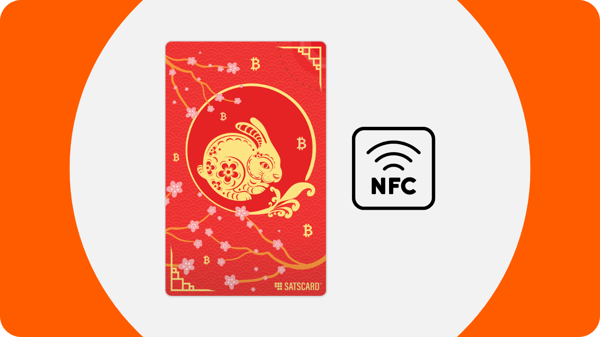

Satscard 芯片配备了 10 个插槽，允许其在10个不同的地址上存储最多10次比特币。每个插槽独立运行，理论上只能使用一次来将比特币锁定在其中。要使用比特币，只需使用兼容的应用程序（如 Nunchuk）打开插槽，输入 Satscard 背面注明的 6 位验证码即可。

该卡确保前所有者一旦与该卡物理分离，就无法保留区块链上保护比特币的私钥。接收者还可以验证插槽的有效性以及交换时存储在其中的金额。

该系统对于用比特币购买实物商品或将比特币作为礼物特别有用。

## 如何购买 Satscard？

Satscard 可在 [Coinkite 官方网站](https://store.coinkite.com/store/category/satscard) 购买。要在实体店购买，您还可以在网站上找到[认证经销商列表](https://coinkite.com/resellers)。
您还需要一部兼容 NFC 通信的手机，或一个 USB 设备，以便以 13.56 MHz 的标准频率读取 NFC 卡。

## 如何在 Satscard 上加载插槽？

收到 Satscard 后，第一步是检查包装以确保其未被打开。如果包装损坏，则可能表明该卡已被盗用并且可能不是正品。

为了管理 Satscard，我们将使用移动应用程序 **Nunchuk Wallet**。确保您的智能手机兼容 NFC，然后从 [Google Play 商店](https://play.google.com/store/apps/details?id=io.nunchuk.android)、[App Store](https://apps.apple.com/us/app/nunchuk-bitcoin-wallet/id1563190073) 下载 Nunchuk，或直接通过其 [`.apk`文件](https://github.com/nunchuk-io/nunchuk-android/releases)。

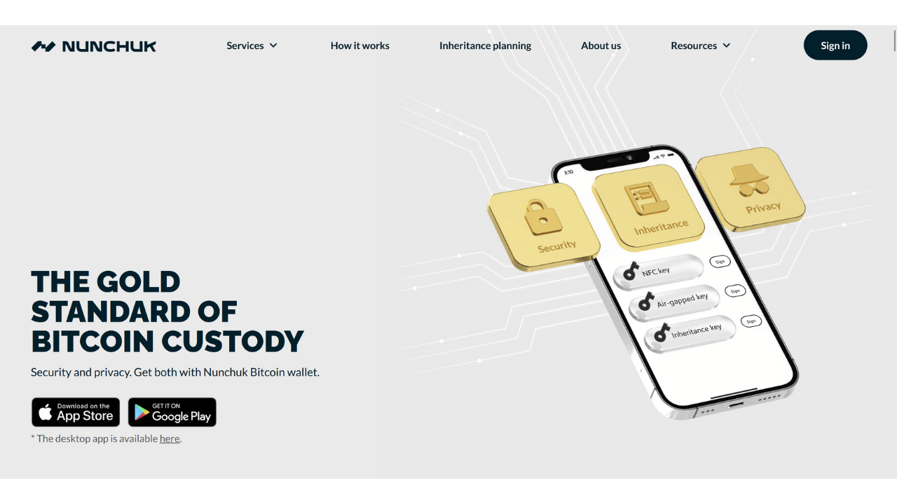

理论上，您可以直接将比特币发送到 Satscard 背面指定的地址，而无需使用 Nunchuk。但是，我建议不要这样做，因为我们将首先验证第一个槽的地址确实是从 Satscard 中存储的私钥导出的，并且它不是欺诈地址。

如果您是第一次使用 Nunchuk，该应用程序将要求您创建一个帐户。就本教程而言，没有必要创建一个。因此，选择 “*Continue as guest*” 即可在没有账户的情况下继续。

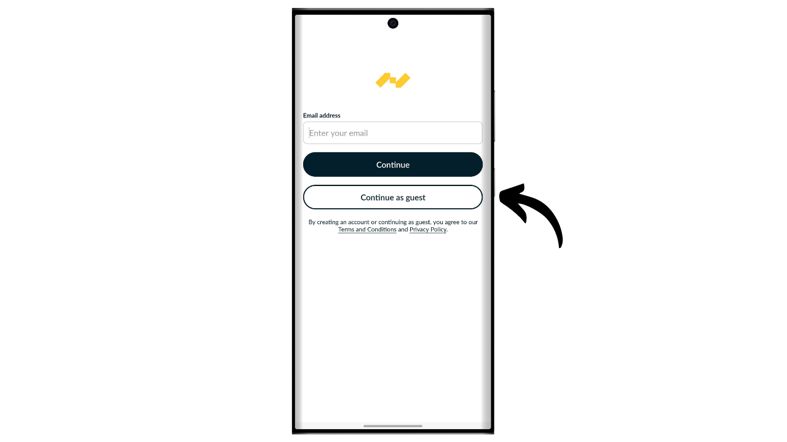

然后点击 “*Unassisted wallet*”。

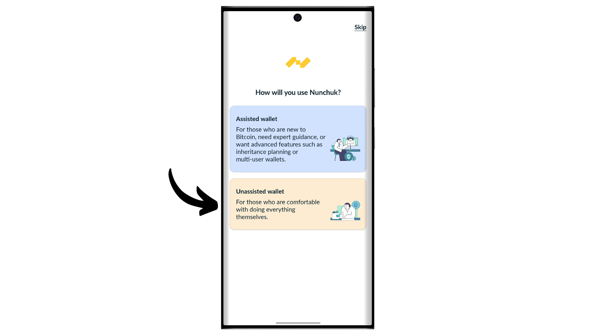

接下来，点击 “*I'll explore on my own*” 按钮。

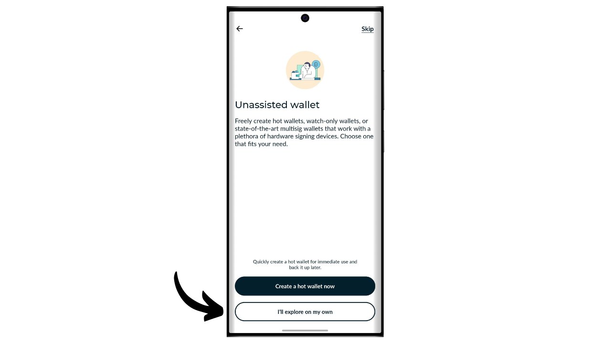

一旦进入 Nunchuk 首页，点击屏幕顶部的 “*NFC*” 标志。

将您的 Satscard 靠近手机背面扫描。

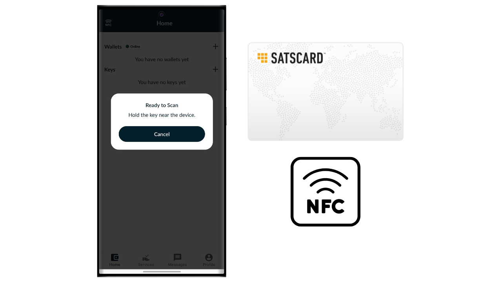

Nunchuk 会显示与您的 Satscard 第一个槽对应的接收地址。通常，这个地址应该与您卡片背面手写的地址相同。复制这个地址，并使用它来转移您希望锁定在此槽的比特币。

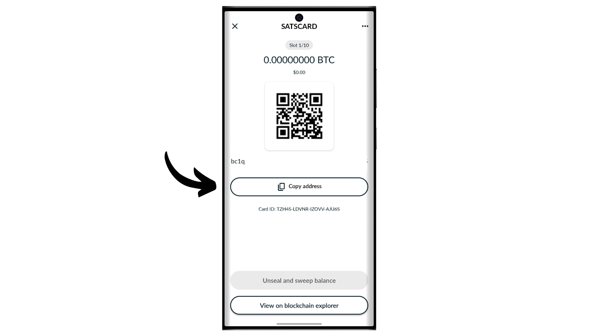

## 如何检查槽中的比特币？

交易确认后，您可以通过使用双节棍扫描 Satscard 插槽来查看与该插槽关联的余额。因此，在交易过程中，比特币的接收者可以通过他们的 Nunchuk 应用程序立即验证该卡确实包含欠他们的比特币。

如果交易对方没有Nunchuk应用程序，他们仍然可以验证 Satscard 的有效性。只需激活智能手机上的 NFC 并将 Satscard 放在设备背面即可。这将自动在浏览器中打开 Satscard 网站，您可以在其中检查该卡的有效性以及与其相关的比特币金额。

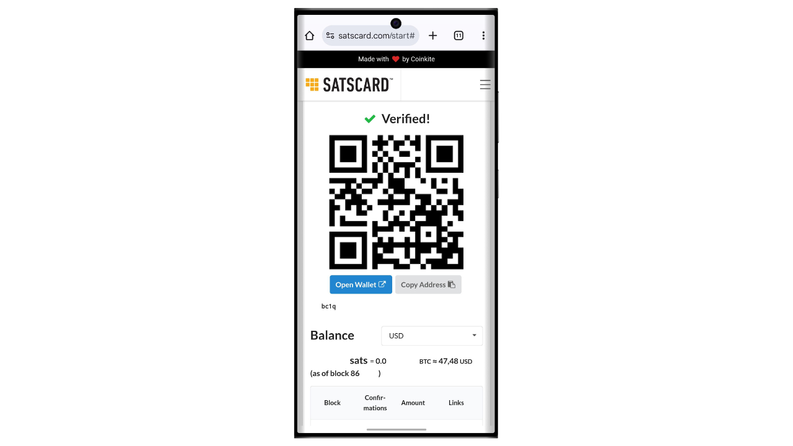

## 如何从槽中提取比特币？

现在 Satscard 的第一个插槽已加载一定数量的比特币，您可以将卡交给付款接收方。

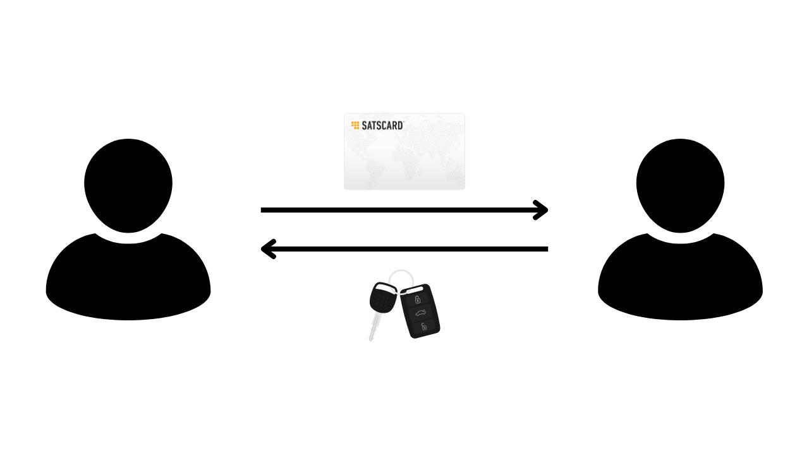

如果您是接收者，您需要安装 Nunchuk。一旦在应用中，点击屏幕顶部的 “*NFC*” 标志。

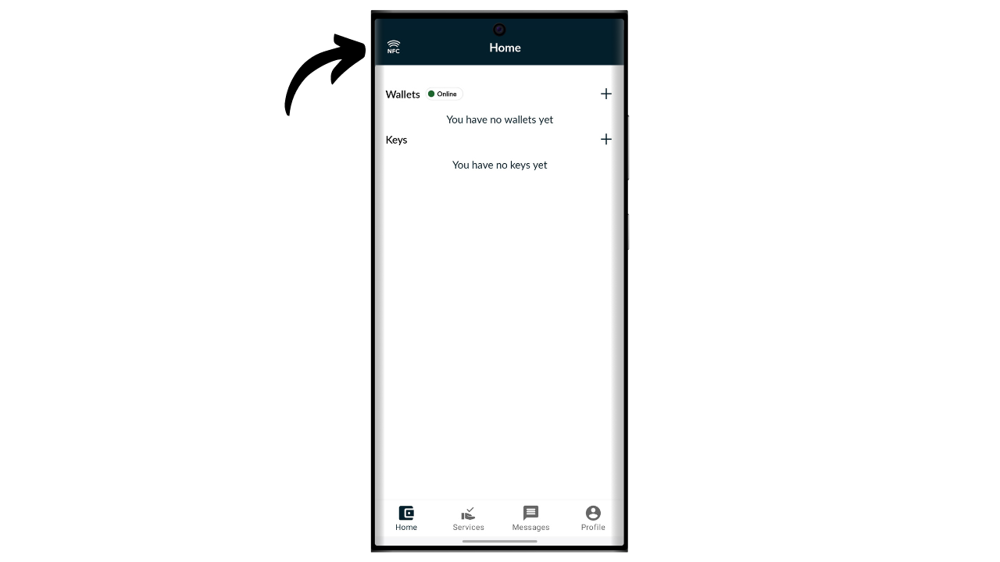

将您的 Satscard 放在手机背面。

Nunchuk 将显示地址上保护的金额。

为了解封私钥并将比特币转移到您拥有的地址，请点击 “*Unseal and sweep balance*” 按钮。

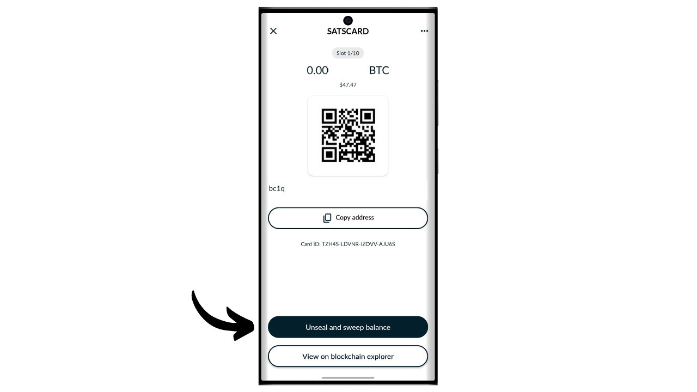

“*Sweep to a wallet*” 选项允许您直接将比特币发送到您 Nunchuk 应用中已有的钱包。为了将资金转移到不同的接收地址，请选择 “*Withdraw to an address*”。

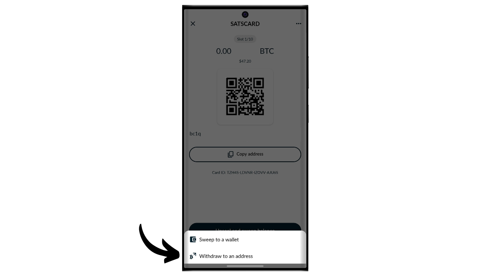

在您希望发送由 Satscard 保护的比特币的接收地址处输入。确保输入的地址是正确的（这是您唯一可以验证它的时候），然后点击 “*Create transaction*” 按钮。

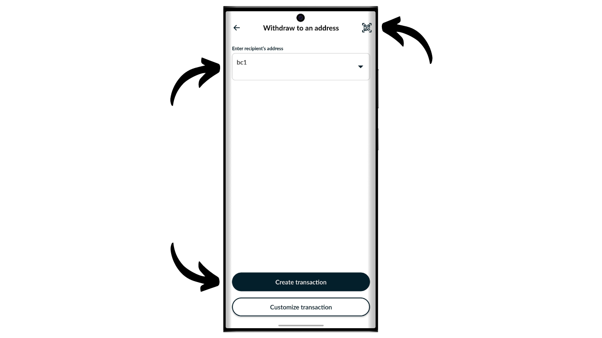

输入您的 Satscard 的 PIN 码。这个 6 位数的代码记录在实体卡的背面。

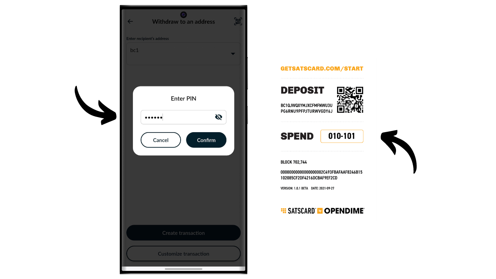

在使用 NFC 卡上存储的私钥签名交易时，将您的 Satscard 保持在智能手机的背面。

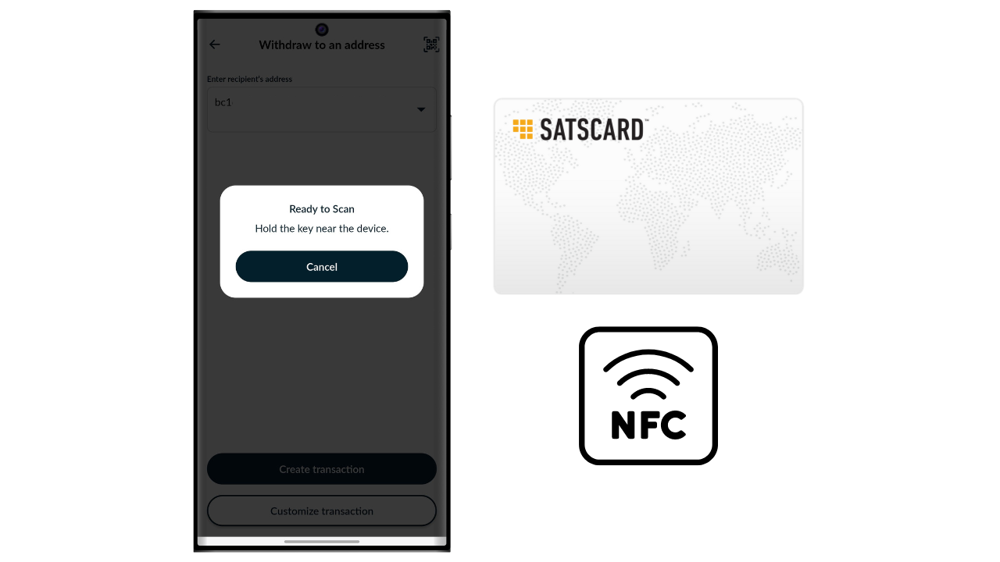

您的交易现在已经签名并在比特币网络上广播，这意味着您Satscard上的插槽现在是空的。

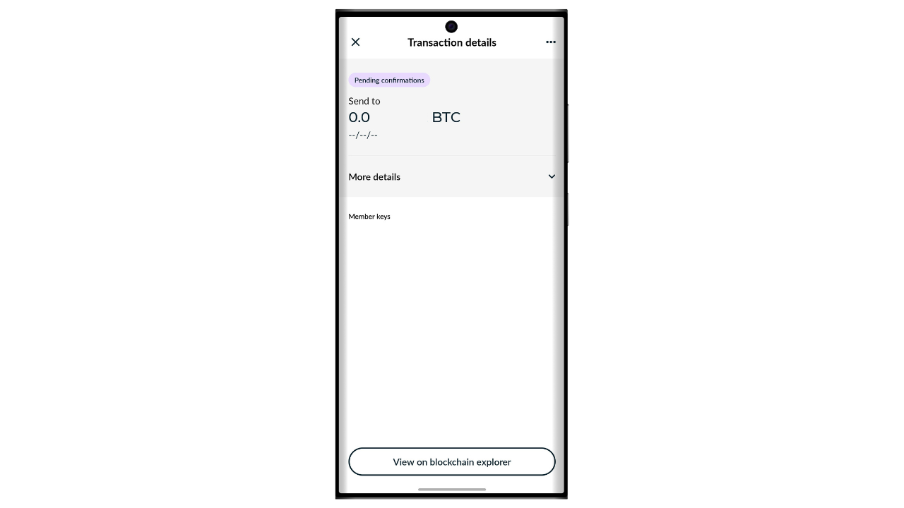

## 如何重复使用 Satscard？

与 Opendime 等一次性解决方案不同，Satscard 配备了包含 10 个独立插槽的芯片，允许使用单张卡进行最多 10 次操作。第一个插槽由 Coinkite 在工厂预先配置，对应于 Satscard 背面写的接收地址。

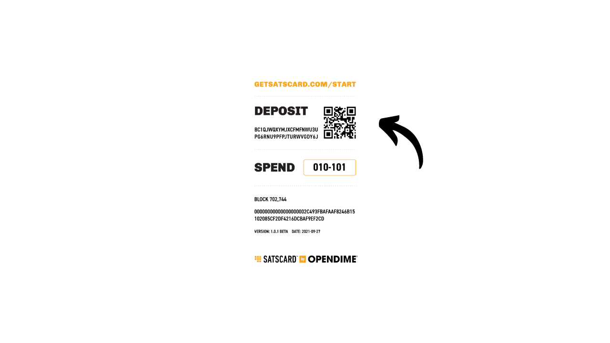

要激活其他 9 个插槽，您需要通过 Nunchuk 应用程序生成密钥对和地址。在应用程序的主页上，点击屏幕顶部的 “*NFC*” 徽标。

将您的 Satscard 放在手机的背面。

Nunchuk 表示卡上没有活动插槽，这是正常的，因为第一个插槽已被使用，而第二个插槽尚未生成。要查看以前使用过的插槽，请单击 “*View unsealed slots*”。强烈建议不要重复使用这些插槽，因为这会导致地址重复使用，从而损害您的链上隐私。因此，我们将通过单击 “*Yes*” 按钮来设置一个新插槽。

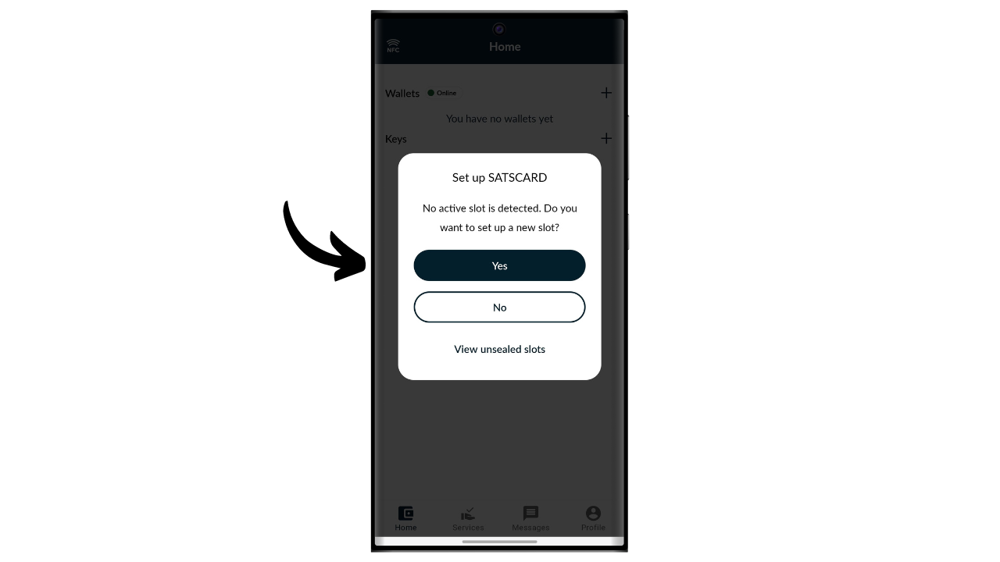

您现在需要选择生成主链代码的方式。

Satscard 上的插槽遵循 BIP32 标准，这意味着保护比特币的加密密钥的派生并不依赖于 BIP39 钱包中的助记词，而是直接依赖于主私钥和主链码。这两个元素用作 HMAC-SHA512 函数的输入以生成子密钥对。每个插槽都有自己的主密钥和自己的主链码。每个槽只有一层派生。

第一个槽的密钥对由 Coinkite 预先生成。这就是为什么您可以通过 Nunchuk 直接访问它，以及接收地址写在 NFC 卡背面的原因。然而，对于其他插槽，您负责生成密钥。

每个槽的主私钥由 Satscard 直接生成，主链码必须从外部提供。对于新插槽的链码，您有两种选择：通过选择 “*Automatic*” 让 Nunchuk 自动生成它，或者通过选择 “*Advanced*” 并将其输入到专用空间中自行创建。为了使链码有效，它需要尽可能随机。

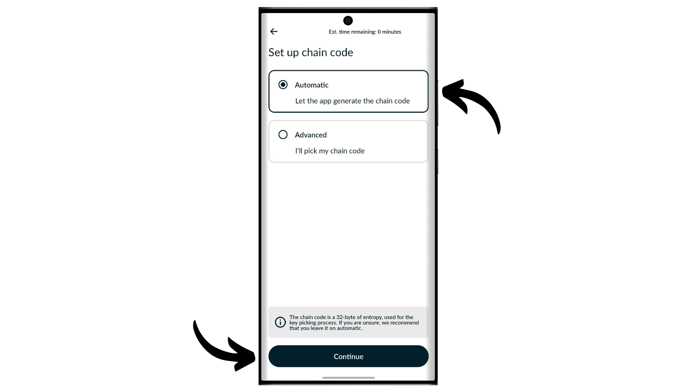

输入 Satscard 背面注明的 6 位 PIN 码。

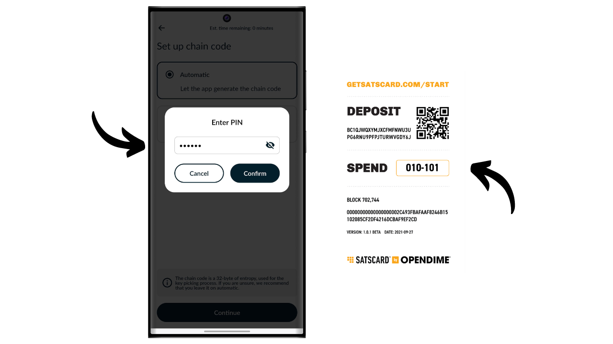

将 Satscard 放在手机背面。

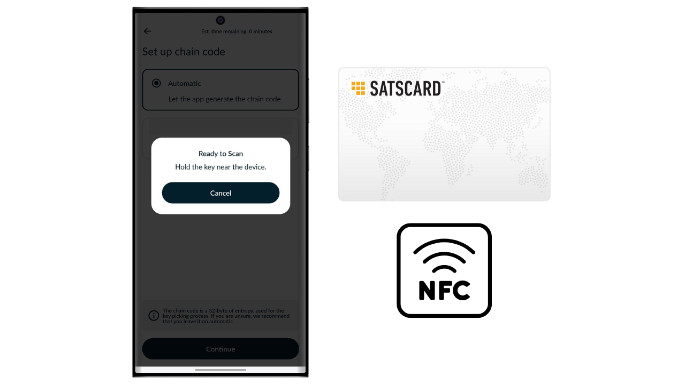

新插槽已成功配置。您现在可以看到用于存入比特币的接收地址。为了继续加载，请按照本教程 “*How to load a slot on a Satscard?*” 部分中的说明进行操作。
您可以在每张 Satscard 上重复此过程最多 10 次。

恭喜，您现在已经可以快速使用 Satscard 了！如果您觉得本教程有帮助，请在下面留下大拇指，我将不胜感激。请随意在您的社交网络上分享这篇文章。非常感谢！
