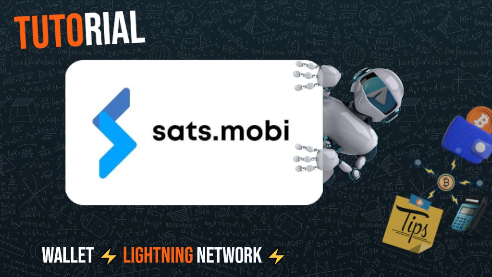

tutorial ini ditulis oleh_ [Bitcoin Campus](https://linktr.ee/bitcoincampus_)

## Sats.Mobi

SatsMobi adalah wallet yang jalan di Telegram, yang punya semua fungsi Lightning Network (custodial wallet) plus berbagai fitur seru yang bikin makin asik dipakai. SatsMobi sendiri lahir dari fork LightningTipBot yang sekarang udah nggak dikembangkan lagi. Jadi, dia mewarisi semua fiturnya sambil nambahin hal-hal baru biar lebih modern. Sama kayak LNTipBot, SatsMobi juga berpegang pada filosofi open-source. Wallet ini bisa kamu atur dan kelola sendiri dengan cara mengkloningnya dari [repositori] ini (https://github.com/massmux/SatsMobiBot).

Kalau kamu lebih suka pakai dengan cara simpel, cukup mulai obrolan di Telegram dan langsung kelihatan kalau itu adalah bot.

## Pengaturan

Di kolom pencarian Telegram, cari "satsmobi" dan tautan ke [bot] (@SatsMobiBot) akan muncul.

**Perhatian**: Kalau kamu masih ragu buat nyari langsung di Telegram, kamu bisa akses bot dengan aman lewat [tautan] berikut ini (https://t.me/SatsMobiBot)

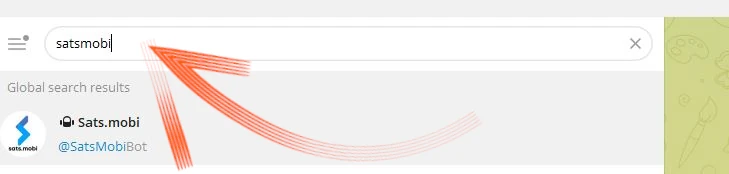

Yang perlu kamu lakukan untuk memulai adalah menekan _MULAI_

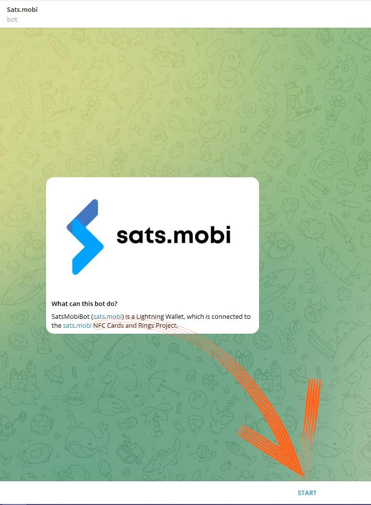

Untuk menjelajahi Wallet, kamu bisa memilih _Menu_ di bagian kiri bawah.

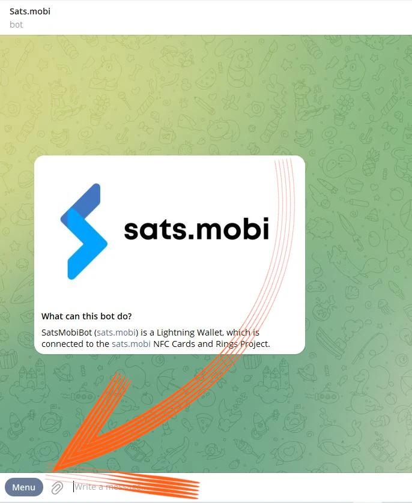

Sekarang pilih _/help_ dari daftar perintah utama.

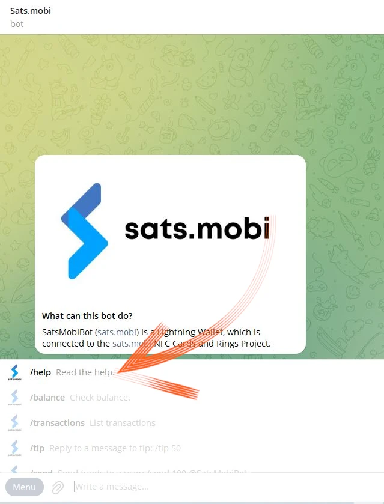

SatsMobi bakal nyambut kamu dengan sebuah pesan berisi daftar semua fungsi utama. Pas startup, bot juga bikin LN Address yang otomatis terhubung ke handle Telegram kamu (unik secara default). Di situ juga langsung kelihatan perintah buat kirim dan terima sats pakai wallet ini, plus beberapa fungsi lain yang nanti bakal kita bahas. Menariknya lagi, ada juga menu _/advanced_ yang bisa kamu cek.

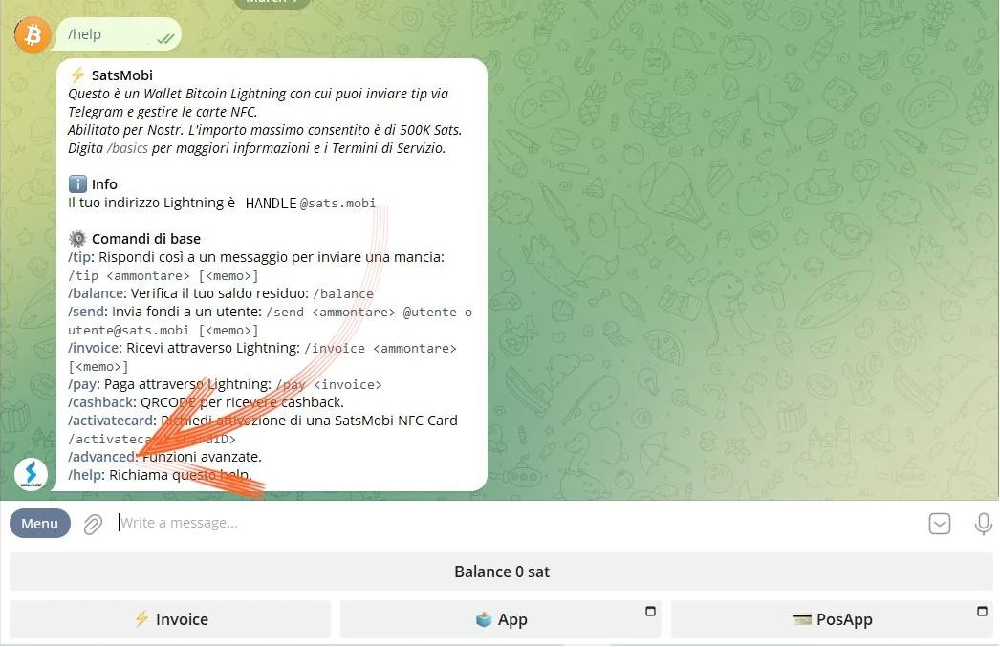

Terlihat kalau SatsMobi juga bikin LN Address anonim yang bisa dipakai buat nambah privasi. Bot ini jalan pakai perintah: kamu bisa langsung klik kata yang sesuai, atau ketik tanda garis miring “/” di kolom pesan lalu ikuti dengan perintah yang mau dijalankan. Walaupun wallet baru aja dibuat, kamu bisa coba pilih misalnya _/transactions_

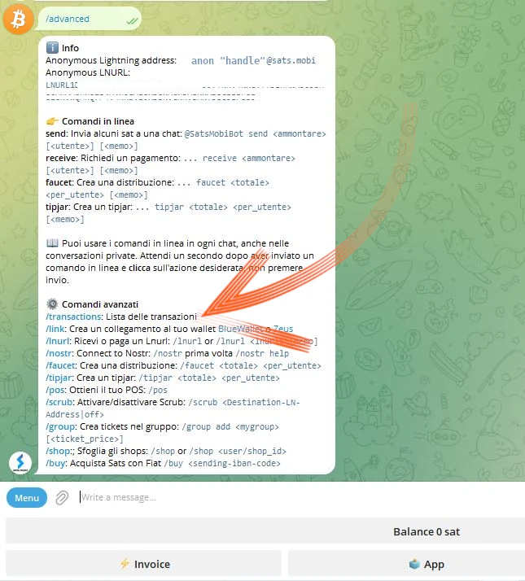

Perintah ini bakal nampilin daftar transaksi terakhir, yang untuk saat ini masih nol.

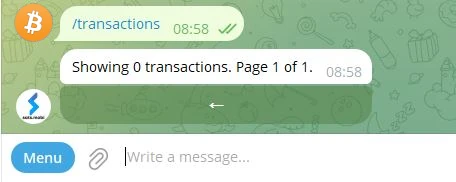

## Menerima Sats

Perintah buat bikin invoice dan nerima sats adalah _/invoice_. SatsMobi cuma beroperasi pakai satuan satoshi, unit terkecil dari Bitcoin. Jadi, kalau mau bikin invoice, kamu tinggal tulis jumlah dalam sats di kolom pesan lalu kirim ke obrolan dengan bot.

Dalam contoh berikut, pilihan dibuat untuk menerima jumlah 210 Sats.

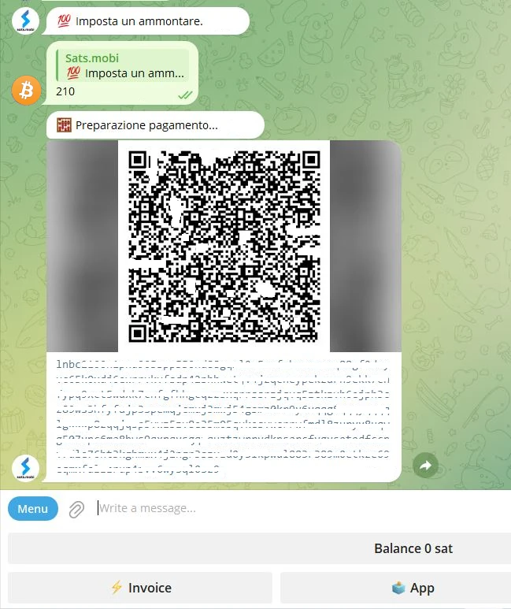

Setelah nunggu sebentar, invoice bakal muncul dalam bentuk teks dan kode QR. Begitu invoice dibayar, wallet langsung nampilin saldo kamu. Kalau jumlah total tidak diperbarui, tulis _/balance_ dan tekan tombol `enter`.

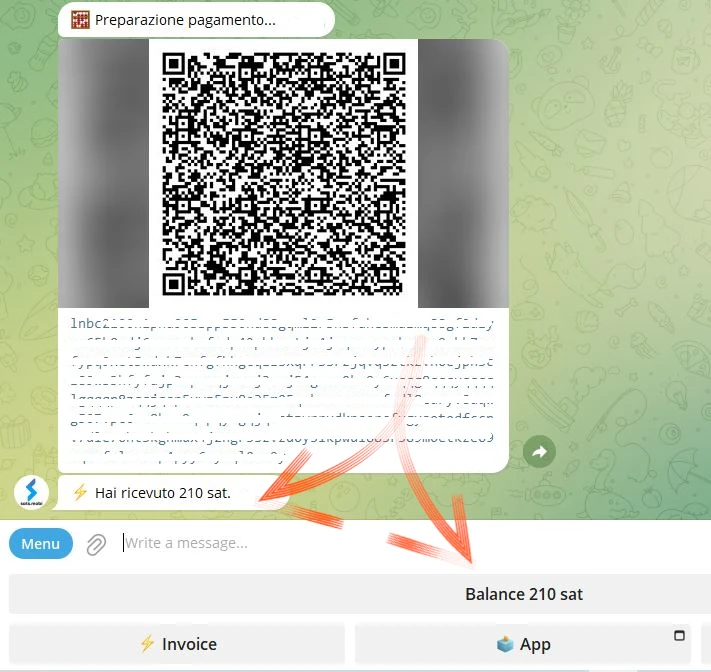

## Mengirim Sats

Walaupun sats itu aset yang sangat berharga dan nggak boleh sembarangan dilepas, SatsMobi bikin bagian ini jadi menarik. Jadi, ngelakuin beberapa tes singkat (kayak transaksi uji coba) nggak bakal jadi masalah.

### Membayar Invoice

Cara paling gampang buat bayar invoice adalah dengan nyalin string pesan 'lnbc1xxxxx' lalu tempelin ke kolom pesan setelah kamu ngetik perintah _/pay_. **Sintaks yang bener** harus ada spasi setelah perintah itu.

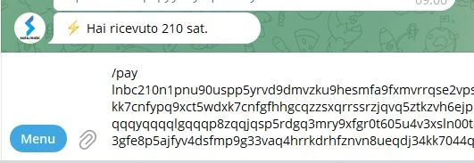

Wallet akan mengirimkan pesan yang meminta konfirmasi. Dengan mengklik _Bayar_, Invoice dibayar.

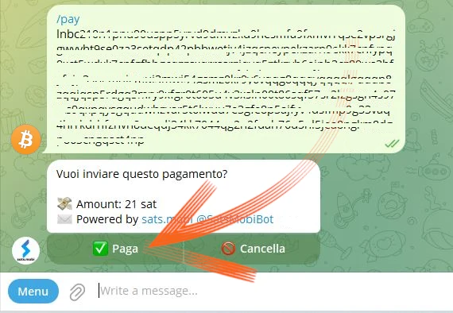

Sats.Mobi jalan di atas node Lightning yang efisien dan punya koneksi bagus, jadi pembayaran jarang banget gagal karena hampir selalu bisa nemuin rute yang tepat.

### Membayar dengan nyaman dari ponsel

Kalau kamu pakai Telegram di ponsel, SatsMobi juga bisa diakses dengan mudah. Biasanya cara paling praktis buat bayar pakai HP adalah scan kode QR, tapi wallet ini nggak punya fitur itu karena memang bukan aplikasi mandiri, melainkan ada di dalam platform sosial. Sebagai gantinya, SatsMobi diprogram supaya pengalaman di ponsel tetap maksimal: bot ini bisa ngenalin kode dari gambar, misalnya foto kode QR invoice yang mau kamu bayar.

Misalnya, kamu ingin membayar Invoice sebesar 50 Sats.

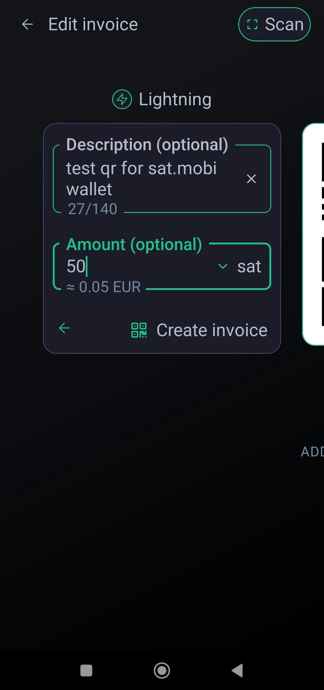

Waktu fitur ini dicoba, kita bisa langsung ambil foto kode QR yang mau dipakai.

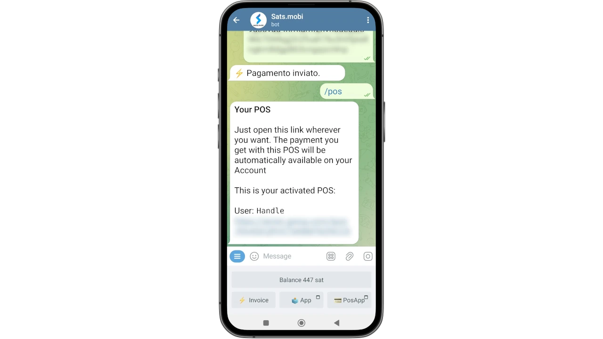

Setelah itu, kita buka Telegram di ponsel dan, di obrolan dengan SatsMobi, tinggal lampirin foto kode QR yang baru aja kita ambil.

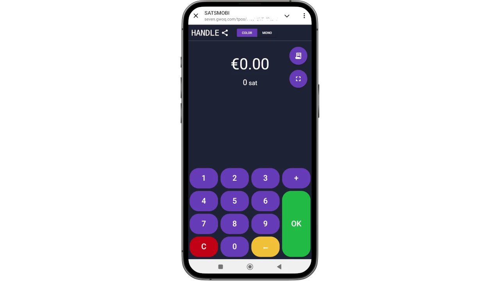

Setelah dipilih, kami mengirimkannya ke bot:

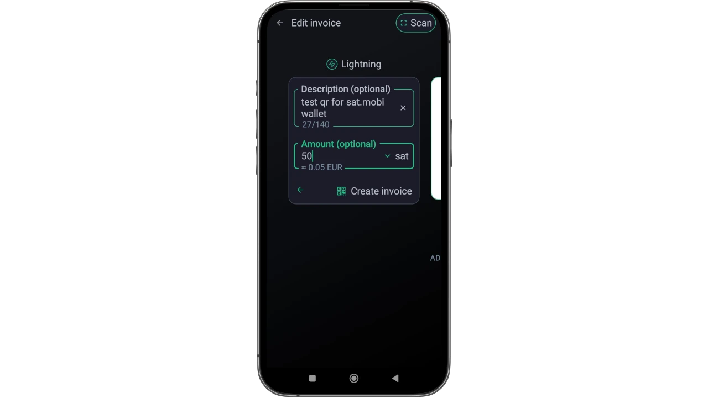

SatsMobi langsung nerjemahin foto itu dan segera nampilin permintaan pembayaran lengkap dengan deskripsinya. Obrolan lalu minta konfirmasi, dan buat lanjut kamu cukup tekan _/pay_.

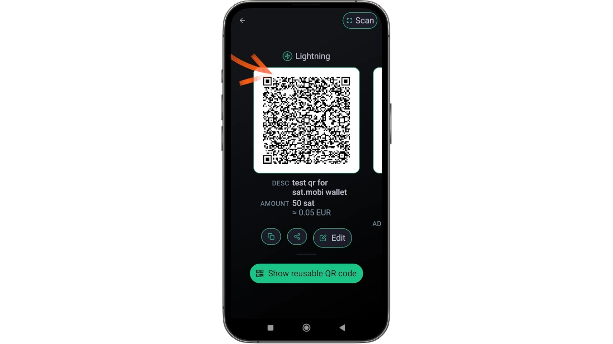

Kita perlu tunggu beberapa saat agar pembayaran dapat diproses.

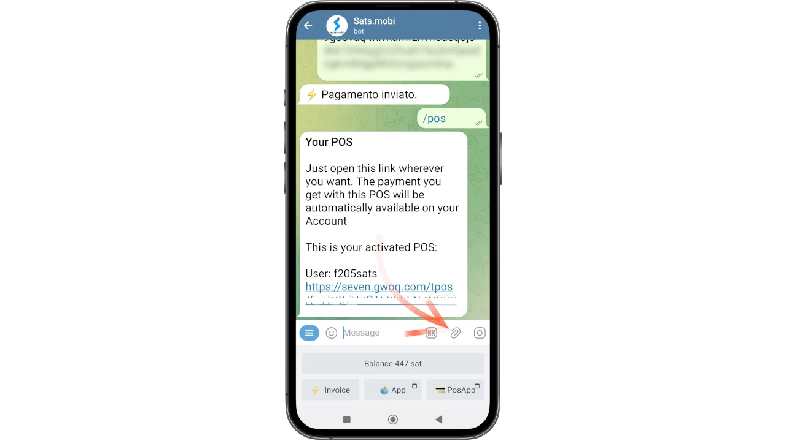

Invoice sebesar 50 sats berhasil dibayar, dan semua itu bisa dilakukan tanpa perlu kamera atau fitur pemindaian bawaan.

### Sats.Mobi di Grup Telegram

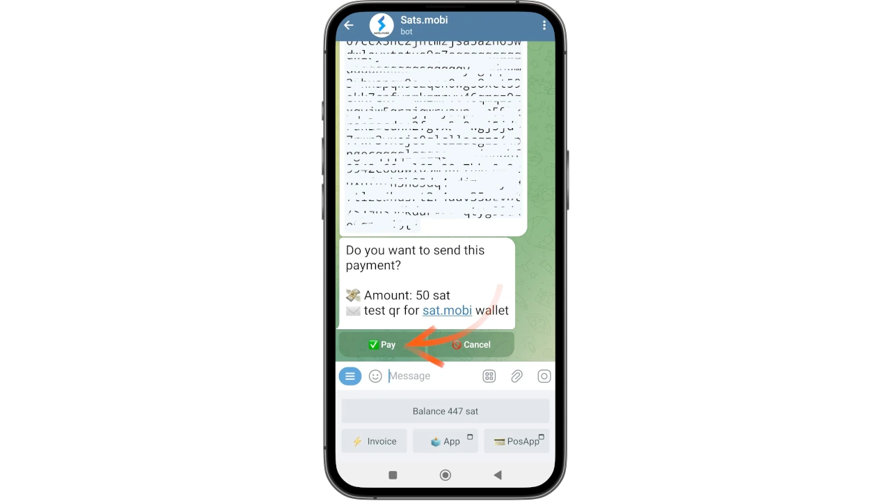

Salah satu fitur yang bikin LNTipBot terkenal dan sekarang dibawa juga oleh SatsMobi ke Telegram adalah cara bikin pengalaman jadi lebih seru dan interaktif buat para anggota grup.

Pemilik grup bisa ngundang bot ini ke obrolan dan nunjuk SatsMobi sebagai admin. Dari situ, keseruan langsung dimulai, karena anggota bisa saling ngasih reward ke pengguna lain atas kontribusi mereka di grup.

- _/tip_ menambahkan tip dengan membalas pesan;
- _/send_ mengirim dana dengan menentukan LN Address atau pegangan Telegram sebagai penerima;
- _/faucet_ (di menu _/advanced_) memungkinkan bikin serangkaian tip yang bisa langsung diklaim sama anggota grup yang paling cepat dengan mengeklik _/collect_;
- _/tipjar_ (di menu _/advanced_) membuat jenis distribusi lain yang dapat dikirim ke pengguna dalam grup.

Masing-masing perintah ini memiliki sintaks, yang dijelaskan dalam menu perintah utama.

Dan jika kita bukan pemilik grup? Tidak masalah: cukup minta pendiri grup untuk mengundang Sats.Mobi, tambahkan sebagai admin grup, dan Anda sudah siap!

## Tempat Penjualan (POS)

Ketika Sats.Mobi diluncurkan untuk pertama kalinya, bot juga menciptakan fitur lain untuk pengguna: **POS**. "Perangkat" ini diaktifkan oleh pengguna dengan perintah _/pos_ atau dengan mengklik tombol terkait dari konsol di kanan bawah. Faktanya, POS adalah aplikasi web, yang terbuka sebagai pop-up di obrolan Telegram

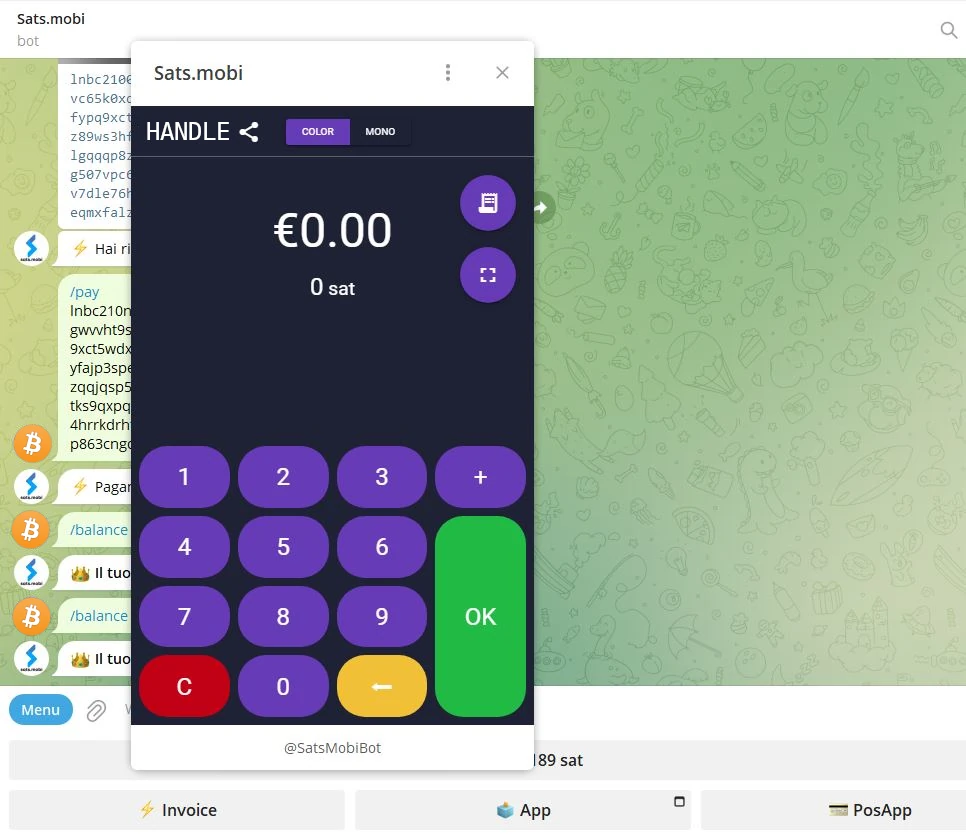

Interface menampilkan pegangan Telegram pribadi pengguna di kiri atas dan digunakan dengan cara yang sama seperti semua POS: dengan mengetikkan jumlah pada keypad. Anggaplah sekarang kita ingin mengumpulkan 21 sen euro untuk sebuah layanan. Mengetahui bahwa Sats.Mobi hanya mengelola Sats secara native, tidak mudah untuk melakukan konversi di kepala Anda. Sebaliknya, POS menampilkan euro sebagai unit akun, yang sekaligus menunjukkan padanannya dalam Satoshi.

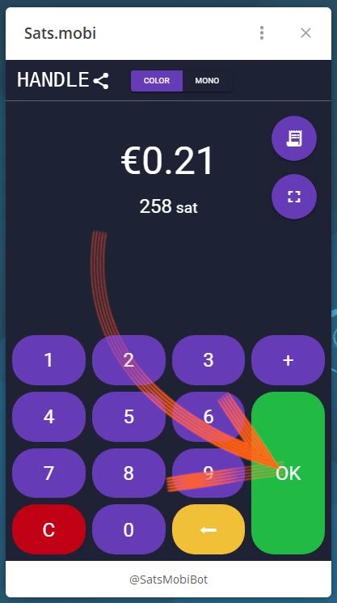

Mengklik _/OK_ akan menampilkan Invoice yang dapat ditunjukkan kepada pelanggan melalui kode QR, atau yang dapat dikirim sebagai string melalui pesan instan, sehingga dapat dibayar.

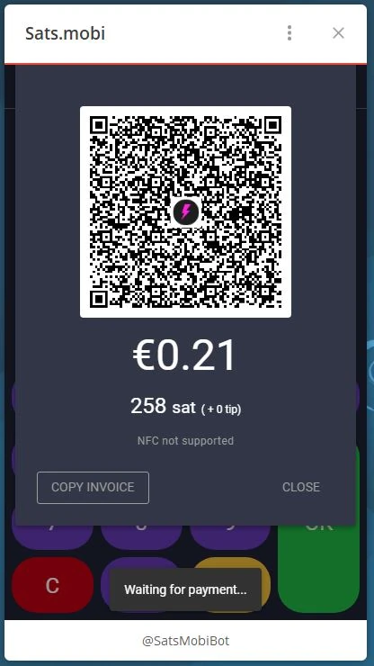

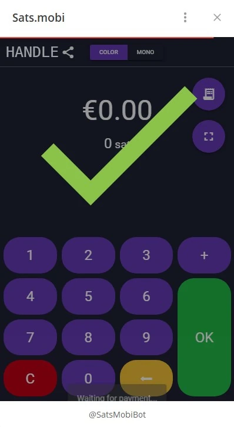

Tentu saja, POS juga tersedia di ponsel, diakses dengan cara yang sama seperti yang ditunjukkan sebelumnya.

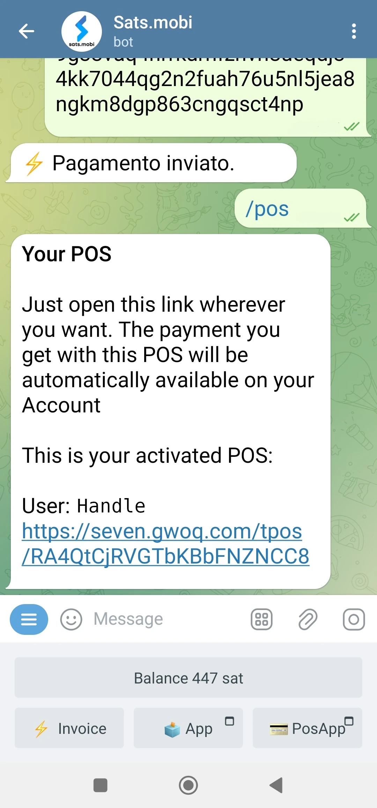

Ini juga ditampilkan dengan baik pada layar ponsel:

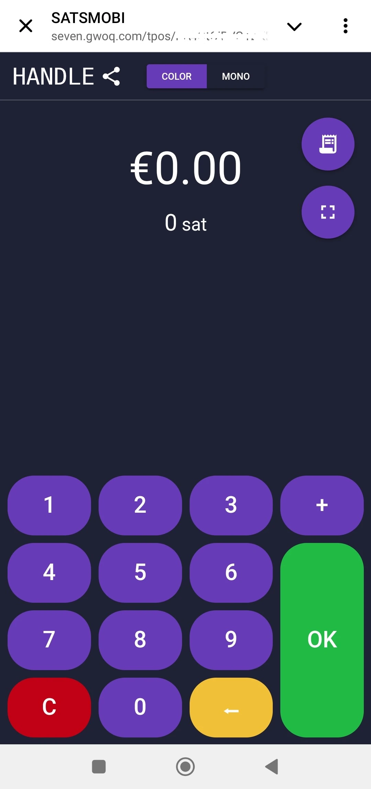

## Fitur Tambahan

Ada fitur lain yang melengkapi penawaran Sats.Mobi Wallet, yang, seperti yang telah kita lihat, memperluas konsep Wallet di luar operasi penerimaan dan pengiriman pembayaran:

- _/nostr_: untuk menghubungkan Wallet ke pengguna Nostr Anda sendiri untuk menerima zaps;
- _/cashback_: menunjukkan kode yang dapat ditunjukkan kepada pedagang untuk mendapatkan cashback atas pembelian;
- _/buy_: memulai prosedur yang dipandu di dalam bot, yang memungkinkan pembelian Sats dengan harga euro;
- _/activatecard_: untuk meminta aktivasi kartu debit NFC, yang dapat diisi ulang melalui Sats.Mobi Wallet dan yang dapat diaktifkan notifikasinya;
- _/link_: membuat tautan untuk Zeus atau Blue Wallet Anda sendiri, yang dapat digunakan sebagai remote control untuk Wallet ini.

## Kesimpulan

Sats.Mobi merupakan Wallet yang menyenangkan dan menyenangkan untuk digunakan, yang membawa kembali pengalaman menggunakan LNTipBot dengan menggunakan fungsi yang lebih canggih dari LNBits. Namun, penting untuk diingat bahwa **ini adalah layanan kustodian**. Oleh karena itu, layanan ini sebaiknya digunakan untuk menyimpan sedikit Sats, bukan sebagai Wallet utama untuk dana Lightning Network Anda. Ada juga batas kapasitas intrinsik, yaitu 500.000 Sats, batas yang disarankan untuk tidak dilampaui.

Jika Anda mencari dompet Lightning Network non-kustodian, sangat disarankan untuk melihat produk lain.

---
### Dokumentasi

- [Github](https://github.com/massmux/SatsMobiBot)
- Daftar putar demo [video] (https://www.youtube.com/results?search_query=Sats.mobi)
