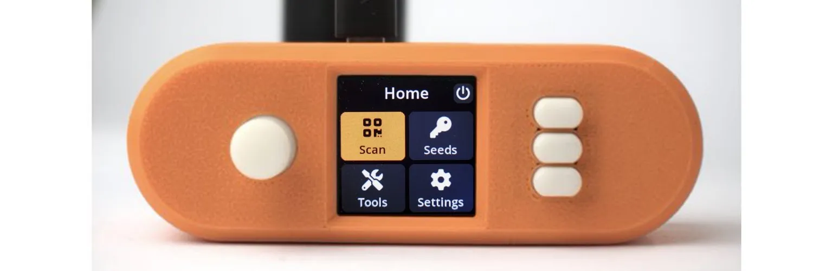

## Materi:

1. Raspberry Pi Zero (versi 1.3)

Raspberry Pi Zero

Untuk solusi yang sepenuhnya terisolasi dari jaringan (air-gapped), pastikan untuk menggunakan versi 1.3 yang tidak memiliki kemampuan WiFi atau Bluetooth, tetapi model Raspberry Pi 2/3/4 atau Zero lainnya juga akan bekerja.

Catatan: Raspberry Pi biasanya tidak datang dengan pin yang terpasang; pin-pin tersebut perlu disolder, atau bisa menggunakan sesuatu yang disebut "GPIO Hammer".
GPIO Hammer

Jika kemampuan solder Anda kurang baik, atau Anda belum memiliki solder, maka Anda bisa menggunakan "GPIO Hammer" sebagai alternatif untuk menyolder.

2. Chapeau LCD WaveShare 1,3 inci dengan layar 240 × 240 piksel

WaveShare LCD Hat

Waveshare 1.3″ 240×240 pxl LCD

Catatan: Pilih layar Waveshare dengan hati-hati; pastikan untuk membeli model yang memiliki resolusi 240×240 piksel.
info lebih lanjut

3. Modul kamera yang kompatibel dengan Pi Zero

Raspberry Pi Camera

Aokin / AuviPal 5MP 1080p dengan Modul Kamera Video Sensor OV5647; merek lain dengan modul sensor OV5647 seharusnya juga bekerja, tetapi mungkin tidak kompatibel dengan casing Orange Pill.

Catatan: Anda akan memerlukan kabel pita kamera yang khusus kompatibel dengan Raspberry Pi Zero.

4. Kartu MicroSD dengan kapasitas minimal 4 GB

sumber daya lengkap: https://seedsigner.com/explainers/

## Perangkat Lunak:

Instalasi Perangkat Lunak

1. Unduh file terbaru “seedsigner_x_x_x.img.zip”
   rilis terbaru

2. Ekstrak file “seedsigner_x_x_x.img.zip”

3. Gunakan Balena Etcher atau alat serupa untuk menulis file gambar .img yang telah diekstrak ke kartu microsd
   BALENA ETCHER

4. Pasang kartu microsd di SeedSigner.
   Kunci Publik GPG SeedSigner
   seedsigner_pubkey.gpg

## Tutorial Video

_panduan diambil dari Southerbitcoiner, dibuat oleh Cole_

### Kumpulan panduan video yang mencakup SeedSigner: perangkat dompet keras/penandatanganan sumber terbuka, DIY

SeedSigner adalah Perangkat Penandatanganan Bitcoin yang dapat Anda bangun dari awal. Terdengar sulit, tetapi seri 4 bagian ini seharusnya dapat membantu Anda :) Saya sarankan Anda menonton bagian 1 dan 2, kemudian putuskan apakah Anda ingin menggunakan desktop (tonton bagian 3) atau perangkat mobile (tonton bagian 4).

Semua yang perlu Anda ketahui akan ada di bawah ini. Tautan berguna lainnya termasuk situs web SeedSigner, Github mereka, Keybase mereka, rilis terbaru, dan persyaratan perangkat keras.

### Bagian 1: Cara membangun SeedSigner:

Dalam video ini saya menunjukkan kepada Anda cara mengunduh dan memverifikasi perangkat lunak SeedSigner, bagian apa saja yang diperlukan, dan cara merakit SeedSigner Anda.

### Bagian 2: Menguji SeedSigner Anda
Sebelum saya menggunakan SeedSigner saya, saya melakukan beberapa tes untuk memastikan bahwa perangkat tersebut tidak melakukan hal yang berbahaya. Saya pikir akan bagus untuk berbagi langkah ini juga. Berikut cara memverifikasi bahwa SeedSigner Anda mengekspor dompet yang benar (xpub), cara memverifikasi matematika lemparan dadu SeedSigner, dan cara memverifikasi bibit anak bip-85 SeedSigner.

### Bagian 3: Cara menggunakan SeedSigner dengan Sparrow Wallet (desktop)

SeedSigner mampu menghasilkan bibit dan menandatangani transaksi bitcoin. Namun, dengan sendirinya, perangkat ini tidak mampu membangun transaksi. Anda perlu menggunakan "koordinator" dompet dengan SeedSigner Anda. Inilah cara menggunakan Sparrow Wallet dengan SeedSigner Anda:

Bagian 4: Cara menggunakan SeedSigner dengan Blue Wallet (mobile)

SeedSigner mampu menghasilkan bibit dan menandatangani transaksi bitcoin. Namun, dengan sendirinya, perangkat ini tidak mampu membuat transaksi. Anda perlu menggunakan "koordinator" dompet dengan SeedSigner Anda. Inilah cara menggunakan Blue Wallet dengan SeedSigner Anda:

Itu semua panduan SeedSigner, untuk saat ini! Beri tahu saya jika Anda pikir saya melewatkan sesuatu. Ini ada di daftar saya untuk video potensial:

> Ulasan keseluruhan SeedSigner. Apakah itu pilihan yang baik untuk perangkat penandatanganan? Pro/kontra?

> Cara menggunakan Bip-85 dengan SeedSigner
> Cara menjadi paman Jim dengan SeedSigner

Menemukan ini berguna? Pertimbangkan untuk mengirim tip untuk membantu pendanaan video masa depan:
https://www.southernbitcoiner.com/donate/