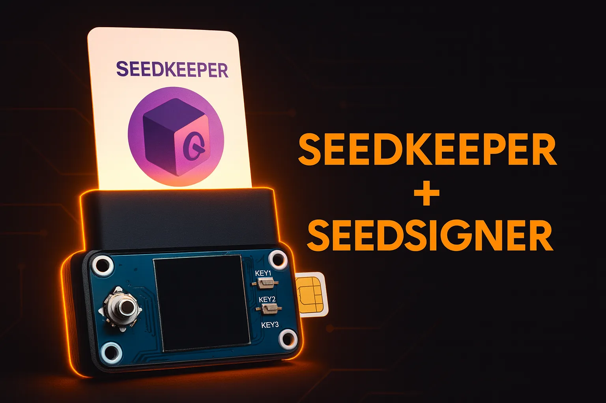

*感谢 [Satochip](https://satochip.io/) 团队同意在本教程中重复使用 [他们的视频](https://www.youtube.com/@satochip/videos)。还要感谢 [Crypto Guide](https://www.youtube.com/@CryptoGuide/)对 SeedSigner 固件的分叉支持，使其能够支持智能卡。

---

SeedSigner 是一款硬件钱包，需要使用标准硬件自行组装，通常基于 Raspberry Pi Zero。这款钱包被称为“无状态钱包”：与市面上大多数其他型号（Coldcard、Trezor、Ledger 等）不同，它不会在永久内存中存储任何数据，而是直接从 RAM 运行。因此，您的比特币组合的种子永远不会存储在 SeedSigner 上。每次重启设备时，您都需要重新输入种子，才能使设备对您的交易进行签名。最常见的方法是将种子保存为二维码，每次使用时扫描即可（*SeedQR*）。

然而，这种方法存在一个重大风险：种子必须以明文形式存储以便扫描。一旦设备被盗或遭到入侵，攻击者很容易获取种子并窃取您的比特币。

为了克服这一缺陷，SeedSigner 可以与 Satochip 开发的智能卡 [**Seedkeeper**](https://satochip.io/product/seedkeeper/) 结合使用。这样可以将助记词（或其他秘密信息）存储在受 PIN 码保护的安全元件中。Seedkeeper 小程序是开源的，其安全元件已获得 EAL6+ 认证。与 SeedSigner 配合使用，它提供了一项非常有趣的安全功能：您的密钥完全离线管理，您在可信屏幕上签署交易，而种子则被物理保护在可抵御物理攻击的智能卡中。

完成安装所需的物品如下：

- 经典 SeedSigner 的常用设备：树莓派 Zero、Waveshare 1.3 英寸屏幕、兼容摄像头和 microSD 卡（更多详情请参见下方的 SeedSigner 教程）；
- SeedSigner 扩展套件，可在 [Satochip 官方商店](https://satochip.io/product/seedsigner-extension-kit/)购买，该套件允许您直接通过 SeedSigner 读取和写入智能卡。另一种选择是使用外部智能卡读卡器，可通过数据线将其连接到树莓派的 Micro-USB 端口。不过，我本人尚未测试过此方案；
- Seedkeeper，或者一张空白智能卡（用于安装 Seedkeeper 小程序）（Satochip 出售的扩展套件已包含一张空白智能卡）。

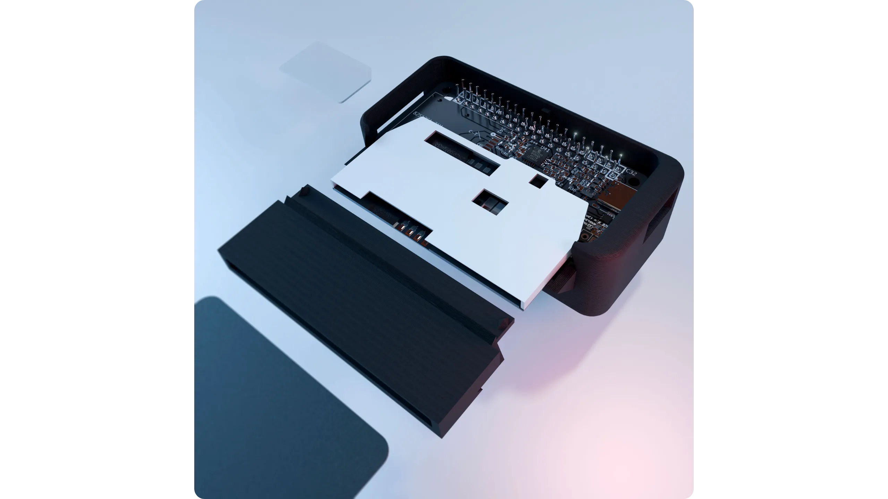

本教程涵盖两种情况：

- 如果您已经通过 SeedSigner 管理了一个比特币钱包，只需安装新固件即可。之后，您可以继续使用现有的钱包，这次可以使用 Seedkeeper 来增强安全性。
- 如果您还没有将比特币钱包与 SeedSigner 关联，则需要按照下文教程中的步骤 **5** 和 **6** 进行操作。这些部分解释了如何使用 SeedSigner 生成助记词，通过 *SeedQR* 保存助记词，然后将此钱包连接到 Sparrow Wallet 进行管理。这里我不会详细介绍这些步骤，并且**我假设您已经拥有一个可以正常使用的比特币钱包，并已配置好 Sparrow 和您的 SeedSigner**。

https://planb.academy/tutorials/wallet/hardware/seedsigner-2b274bff-6fc8-407a-92d7-f6ec4d1fadfb

## 1. 安装固件

为了将 SeedSigner 与 Seedkeeper 配合使用，您需要安装一个与原版 SeedSigner 不同的固件，以支持智能卡读取。为此，[我推荐使用来自 “*3rdIteration*” 的分叉版本](https://github.com/3rdIteration/seedsigner)。下载与您使用的 Raspberry Pi 型号对应的[最新版本镜像](https://github.com/3rdIteration/seedsigner/releases) (`.zip`)。

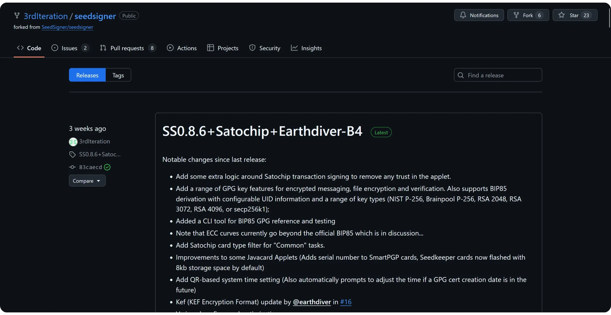

如果还没有，请下载 [Balena Etcher] 软件 (https://etcher.balena.io/)，然后按以下步骤操作：

- 将 microSD 卡插入电脑；
- 启动 Etcher；
- 选择您刚刚下载的 `.zip` 文件；
- 选择 microSD 卡作为目标；
- 点击 “Flash!”。

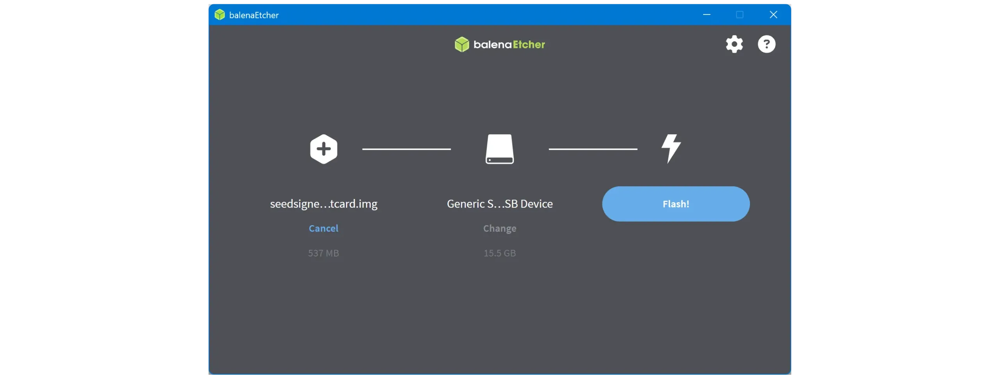

刷写过程完成：您的 microSD 卡现在可以使用了。您可以继续组装您的设备。

关于固件安装和软件验证（强烈建议您执行此步骤）的更多详细信息，请参阅以下教程：

https://planb.academy/tutorials/wallet/hardware/seedsigner-2b274bff-6fc8-407a-92d7-f6ec4d1fadfb

## 2.组装智能卡读卡器

首先，将摄像头安装到 Raspberry Pi Zero 上，小心地将其插入摄像头引脚，并用黑色卡扣固定。然后将 Pi 放在机箱底部，确保端口与相应的开口对齐。

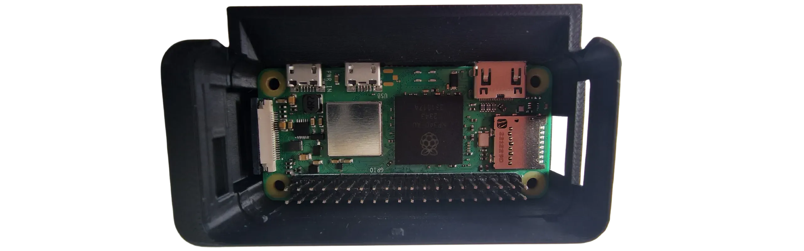

然后将智能卡读写器连接到 Raspberry Pi Zero 的 GPIO 引脚上。

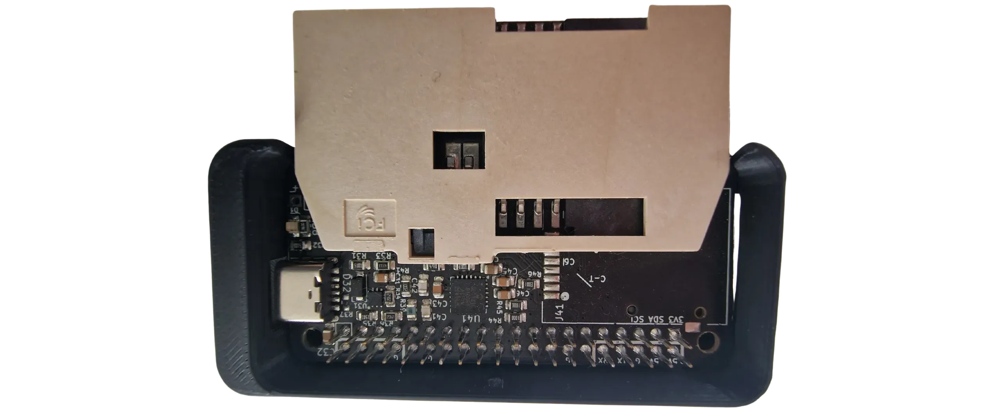

将塑料盖滑到智能卡读卡器上，直到正确定位。

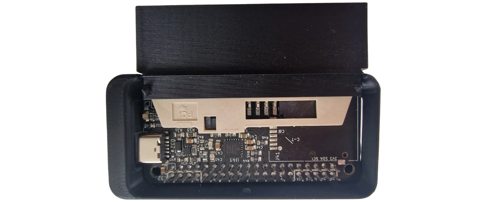

然后将屏幕添加到扩展的 GPIO 引脚上。

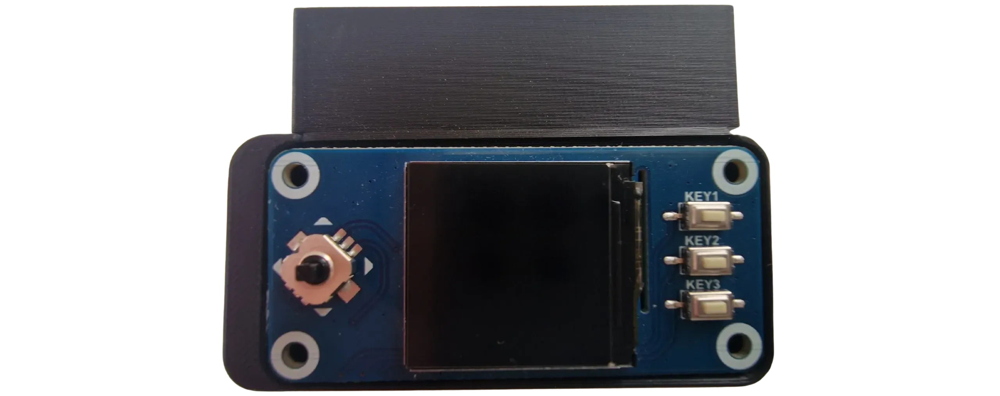

最后，将包含固件的 microSD 卡插入 Raspberry Pi Zero 的侧面端口。

现在，您可以通过 Raspberry Pi Zero 的 Micro-USB 端口或扩展板的 USB-C 端口连接 SeedSigner。两种方式均可。等待几秒钟启动，然后您应该会看到欢迎屏幕。

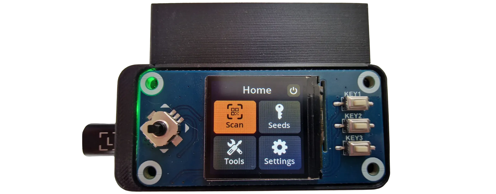

如需了解更多关于 SeedSigner 初始设置的详细信息，我推荐以下教程：

https://planb.academy/tutorials/wallet/hardware/seedsigner-2b274bff-6fc8-407a-92d7-f6ec4d1fadfb

## 3.将 Seedkeeper 小程序烧录到智能卡（可选）

如果您已经拥有 Seedkeeper，则可以跳过此步骤，直接进入步骤 4。在本节中，我们将介绍如何在空白智能卡上安装 Seedkeeper 小程序（自我动手方法）。

为了开始使用，请打开 SeedSigner 上的 `Tools > Smartcard Tools` 选单。

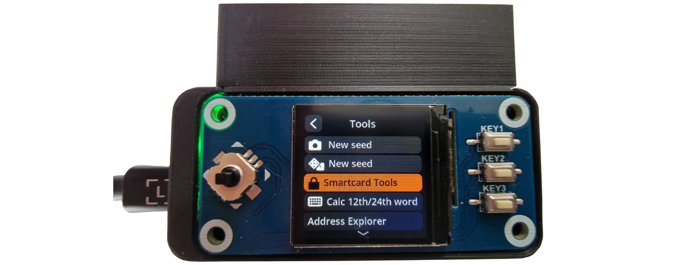

然后选择 `DIY Tools > Install Applet`。

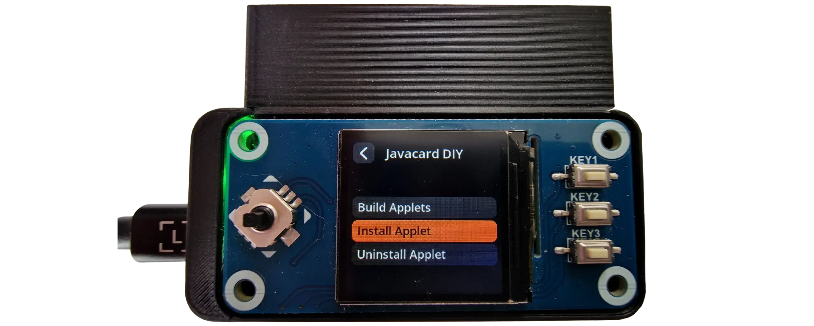

将智能卡插入 SeedSigner 阅读器，芯片朝下，然后选择 "SeedKeeper" 小程序。

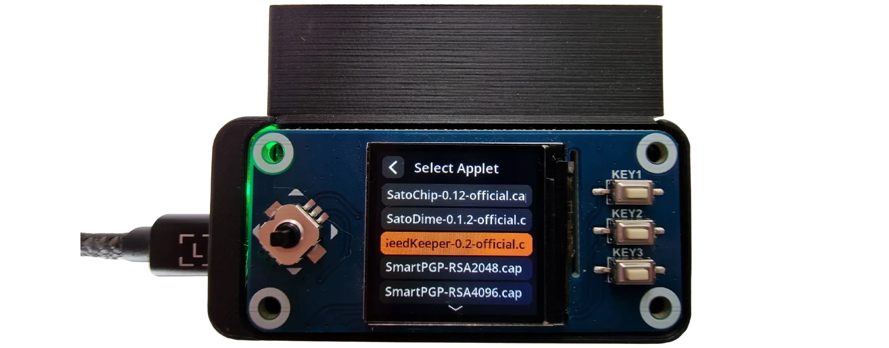

安装过程可能需要几十秒，请耐心等待。

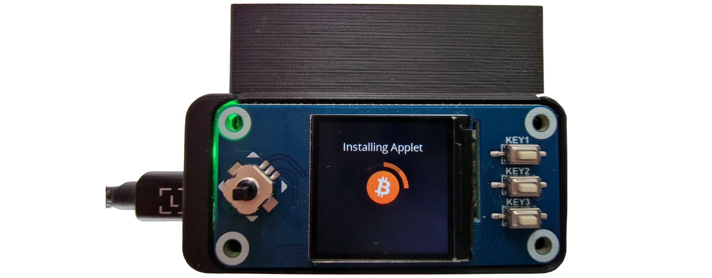

小程序安装成功后，就可以进入步骤 4。

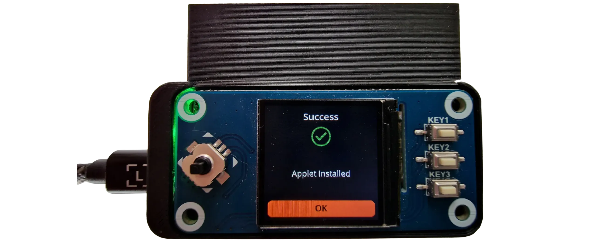

## 4. 将现有 SeedQR 保存到 Seedkeeper

现在您的 Seedkeeper 已运行，您可以将比特币钱包助记词保存到智能卡上。首先，像往常一样打开 SeedSigner，然后扫描钱包的 *SeedQR* 将其加载到设备中。种子导入后，只需选择 `Done` 即可。

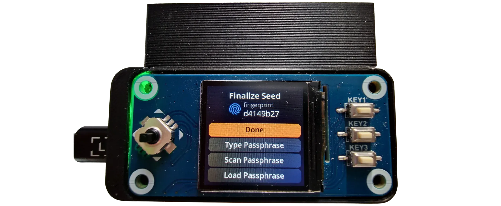

加载助记词后，进入 `Backup Seed` 选单。

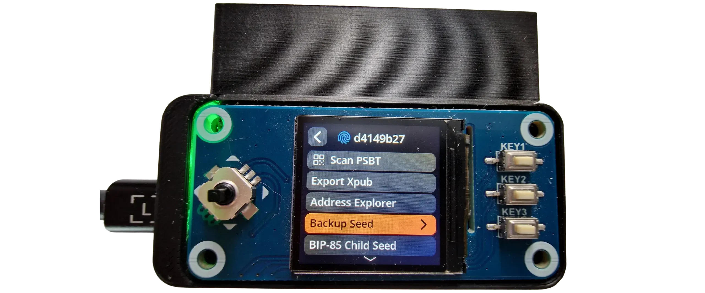

然后将 Seedkeeper 插入 SeedSigner 驱动器，并选择 `To SeedKeeper` 选项。

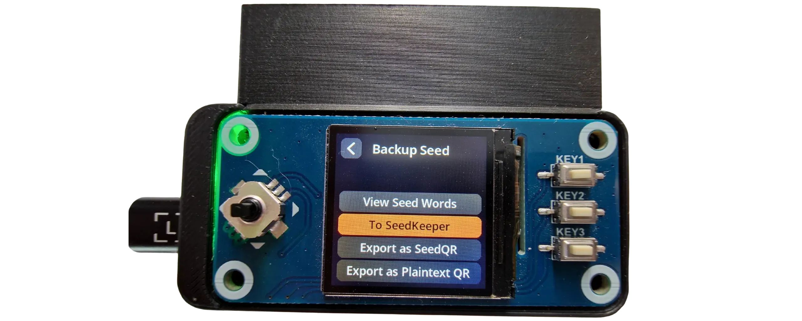

SeedSigner 会要求您输入 Seedkeeper 的 PIN 码。由于这是一张空白卡，尚未设置任何代码。您可以输入任意代码跳过此步骤，然后进行验证。

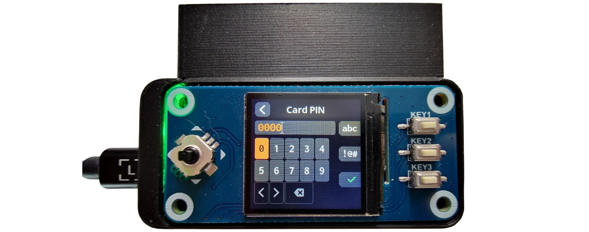

SeedSigner 检测到 Seedkeeper 尚未初始化（即未设置密码）。点击 `I Understand` 以继续。

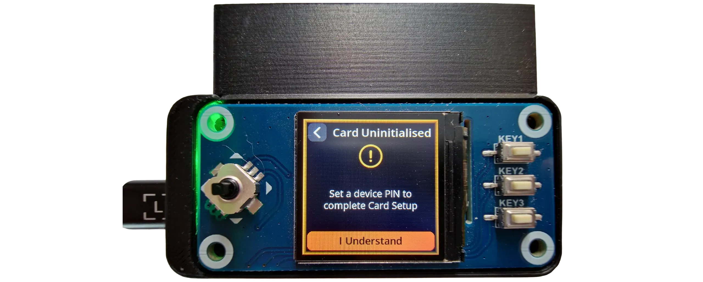

现在，请为您的 Seedkeeper 选择 4 到 16 个字符的新 PIN 码。为了提高安全性，请选择一个较长的随机代码：这是保护助记词免受物理访问的唯一屏障。

请记住，创建 PIN 码后立即将其保存，您可以将其保存在可靠的密码管理器中，或者根据您的策略保存在单独的物理介质上。在后一种情况下，请务必不要将包含 PIN 码的介质与您的 Seedkeeper 放在同一位置，否则保护将失效。备份至关重要：**如果没有此 PIN 码，您将无法访问您的种子，并且您的比特币将会丢失**。

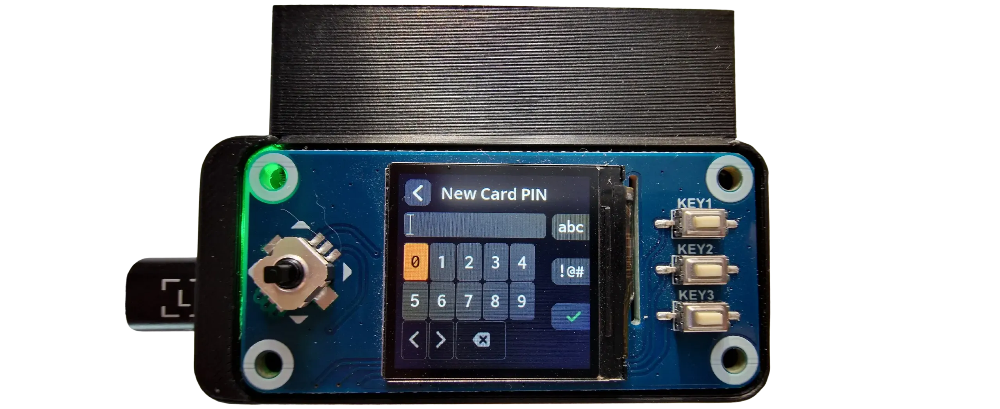

然后，您可以定义一个与记忆短语相关的 `Label`（标签）。如果您在 Seedkeeper 上存储了多个秘密，这个标签就很有用，这样您就可以很容易地识别它们。

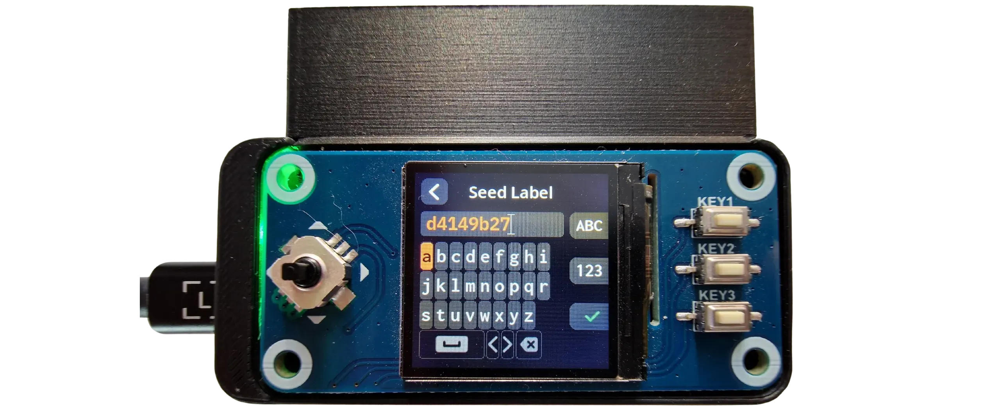

您的助记词现在已保存在智能卡上。

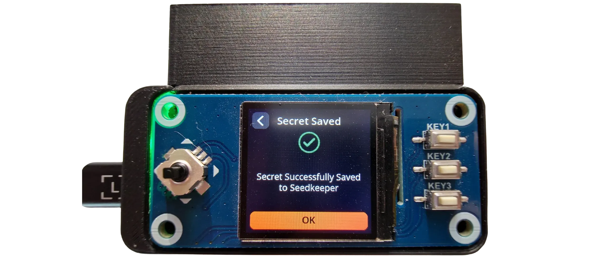

在安全策略方面，根据您的需求和风险等级，有多种方法可供选择。我个人建议您至少保留两份助记词：

- 这是智能卡的一项创新，您可以将其保存在易于访问的日常操作中，例如验证地址或签署交易。这种方法非常实用（我们将在第五部分详细介绍），并且由于 PIN 码的保护，安全性也得到了保障，因此您可以放心地随时访问它，而无需承担重大风险；

- 另一份未加密的助记词副本，作为您钱包的最终备份，仅在 Seedkeeper 丢失或被盗时使用。由于此版本未加密，因此必须将其保存在单独的、更安全的位置，以防止两份备份同时泄露。

根据您的保护策略和风险承受能力，您还可以将助记词复制到多个不同的 Seedkeeper 上，或者创建多个助记词的实体副本。为了了解更多相关操作，请查看以下教程：

https://planb.academy/tutorials/wallet/backup/backup-mnemonic-22c0ddfa-fb9f-4e3a-96f9-46e2a7954270

## 5. 从 Seedkeeper 加载助记词

现在，您可以使用 Seedkeeper 在 SeedSigner 启动时加载助记词，从而签署您的比特币交易。首先，插入 SeedSigner 电源，然后打开 `Seeds` 选单。

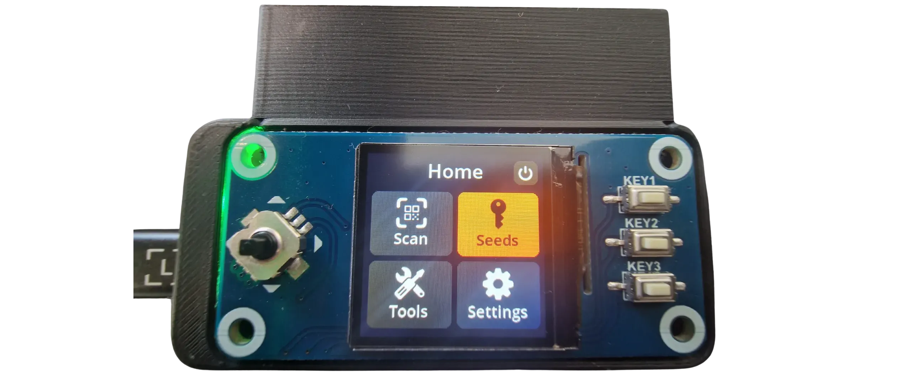

然后选择 `From SeedKeeper` 选项。

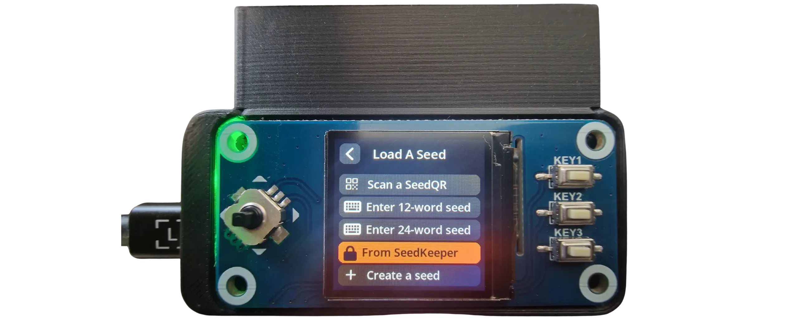

将 Seedkeeper 插入智能卡读卡器，然后输入您的 PIN 码解锁。按下右下角的确认 `KEY3` 按钮以确认输入。

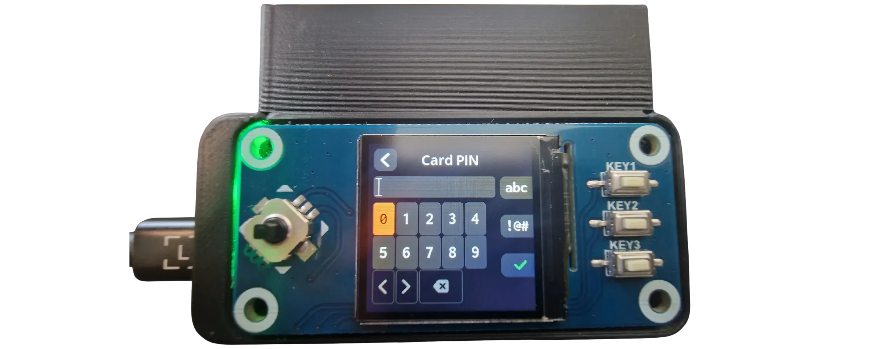

Seedkeeper 可以包含多个密钥，因此 SeedSigner 会提示您选择要加载的密钥。显示的标签与您在步骤 4 中定义的名称相对应。如果您像我一样只注册了一个种子，则只会显示一个选项。

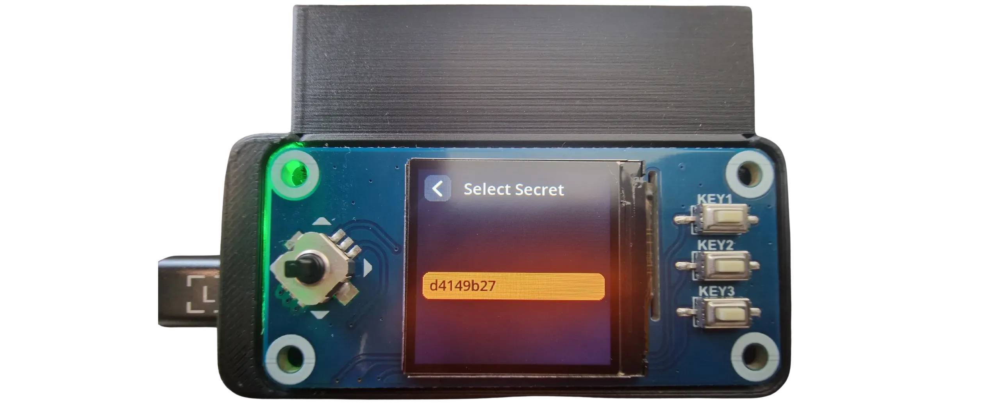

您的种子已加载。请将屏幕上显示的指纹与您 Sparrow 钱包设置中指定的指纹进行比较，以确认这是正确的钱包。此指纹也是在首次创建钱包时提供的。

如果您使用 Passphrase（密语），可以在此阶段应用（请参阅本教程的第 6 部分）。否则，只需点击 `Done` 即可。

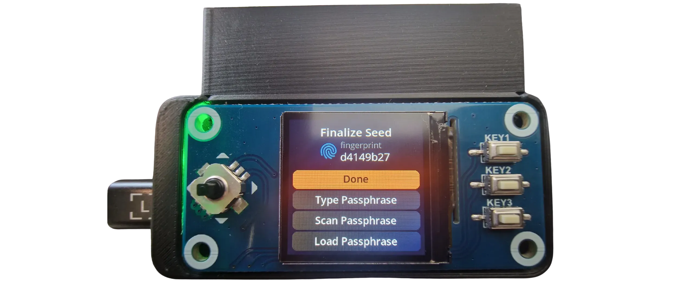

然后，您可以像往常一样使用您的钱包：检查您的收款地址并签署交易，就像使用传统的 SeedSigner 一样。要了解更多使用方法，请参阅以下教程：

https://planb.academy/tutorials/wallet/hardware/seedsigner-2b274bff-6fc8-407a-92d7-f6ec4d1fadfb

## 6. 在 Seedkeeper 上使用 BIP39 密语

您是否使用密码短语来保护您的比特币资产？您可以将密语与您的助记词一起注册到 Seedkeeper 中。这样，您就可以快速将钱包加载到 SeedSigner 上，而无需每次使用时都在小键盘上手动输入密语。

我发现这种方法特别有趣，因为它既能让您享受到密语的安全优势，又能消除日常使用密码短语带来的限制。以下是我推荐的一种配置示例：

- 将您的助记词和密语保存在 Seedkeeper 中，并使用强密码保护（这一点非常重要）。此备份可让您轻松日常使用钱包。如果您愿意，可以将这些信息复制到第二个 Seedkeeper 中；

- 同时，将您的助记词和密语清晰地打印在纸上或金属上。如果您丢失了 Seedkeeper 或其密码，这将是您的最后备份。请务必将这些副本存放在不同的地方，以免同时被泄露。

在这种配置下，即使有人单独获得了您的明文助记词，如果不知道您的密语，他们也无法窃取任何内容（当然，前提是密语足够强大，能够抵御暴力破解攻击）。反之，即使有人获得了您的明文密语，如果没有相应的助记词，它仍然无法使用。

最后，即使有人接触到存放种子和密语的 Seedkeeper，他们也无法在不知道 PIN 码的情况下提取任何内容。与密码短语不同，PIN 码无法被暴力破解，因为智能卡会在 5 次无效尝试后自动锁定。

因此，此配置的安全性基于以下两点：

- **强的密语**：必须足够长、随机且包含多种字符。其复杂性对您来说不是问题，因为您只需在初始化时在键盘上输入一次；之后，它将由 Seedkeeper 发送；

- **强 PIN 码**：同样是随机的，并且由 16 个字符组成。

为了设置此配置，请首先按常规方式将您的密语加载到 SeedSigner 中。您可以按照本教程中的详细步骤操作：

https://planb.academy/tutorials/wallet/backup/seedsigner-passphrase-7a61f64d-aa03-4bcf-8308-00c89a74cffe

将带有密语的钱包正确加载到 SeedSigner 后，打开 `Seeds` 选单并选择与该钱包对应的“足迹”。请注意，此足迹与不带密语的钱包足迹不同。

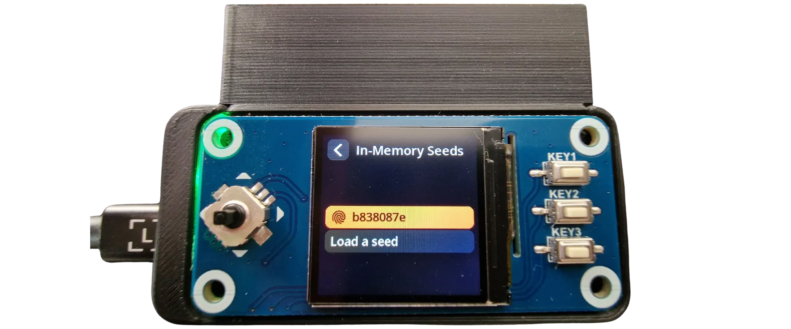

然后点击 `Backup Seed`，将 Seedkeeper 插入驱动器，并选择 `To SeedKeeper`。

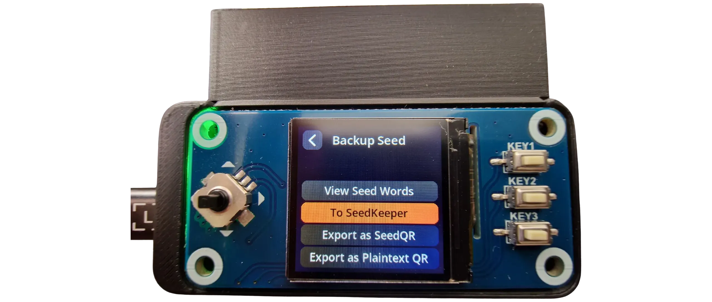

输入 PIN 解锁 Seedkeeper，然后为这个秘密设置标签。例如：可以直接使用指纹作为标签，以保留一定程度的合理否认空间；也可以明确标注为 Passphrase Wallet。

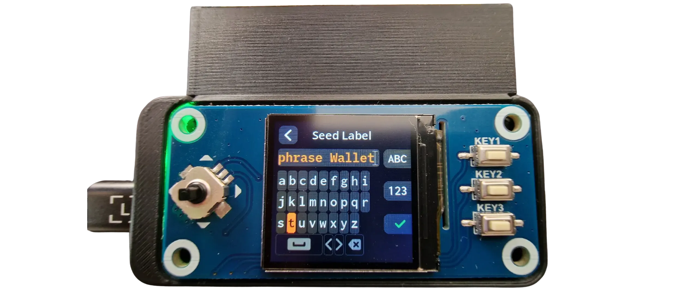

您的带有密语钱包现已注册到 Seedkeeper。

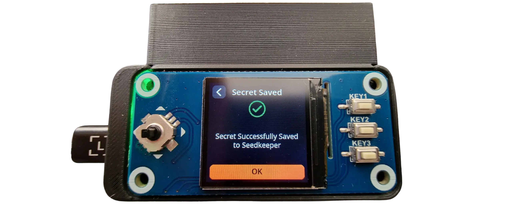

下次启动时，只需将 Seedkeeper 插入驱动器，然后前往 `Seeds > From SeedKeeper`。

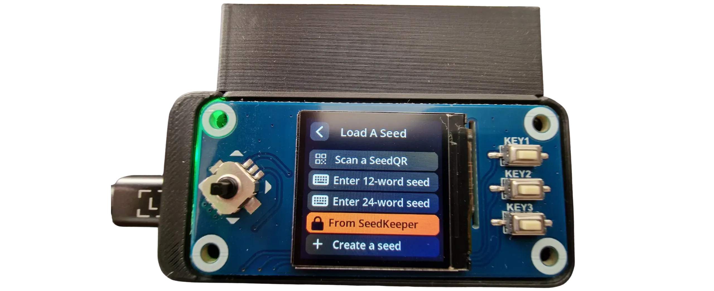

输入密码以解锁智能卡，然后选择与密语相对应的钱包。

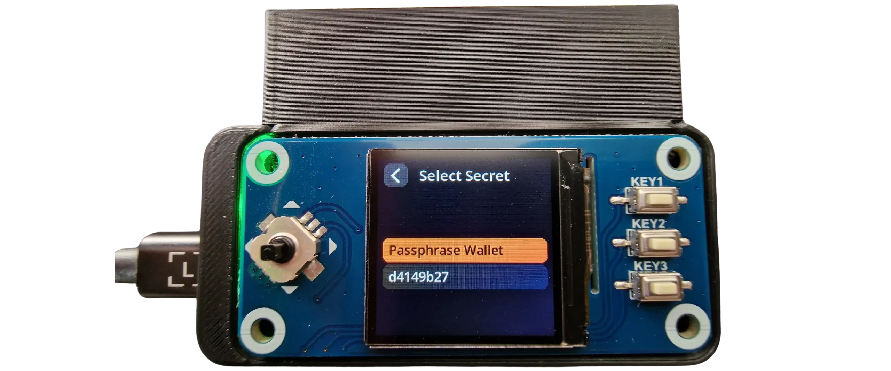

检查密语和您的钱包的指纹，然后确认。

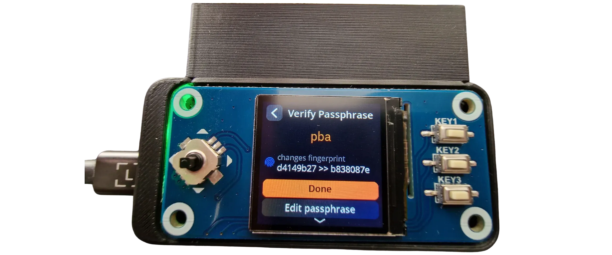

现在，您可以使用密语访问您的钱包，并像通常在 SeedSigner 上一样签名您的交易。

## 7.其他选项

在 `Tools > Smartcard Tools` 选单中，您可以找到几个管理 Seedkeeper 的选项：

- 在 `Common Tools` 选单中，您可以进行以下操作：
 - 检查卡片真伪；
 - 更改 PIN 码；
 - 更改与您的密钥关联的标签；
 - 禁用 NFC 功能（如果仅使用芯片读卡器，建议禁用）。

- 在 `SeedKeeper Functions` 选单中，您可以进行以下操作：
 - 查看已注册密码列表 ；
 - 保存新的秘密 ；
 - 删除现有秘密 ；
 - 保存或加载您的描述符（此功能对多签名钱包非常有用）。

- 在 `DIY Tools` 选单中，您可以进行以下操作：
 - 编译 Seedkeeper 小程序 ；
 - 在空白卡上安装小程序 ；
 - 删除 Seedkeeper 小程序可将其重置并恢复空白。

现在您已经了解如何将 Seedkeeper 与 SeedSigner 结合使用，安全地备份您的钱包。

如果您对这套方案感到满意，请毫不犹豫地支持使之成为可能的项目：

- 直接[在 Satochip 网站上](https://satochip.io/shop/)购买设备；
- - 向 [SeedSigner 项目](https://seedsigner.com/donate/)捐款；；
- 通过订阅[Crypto Guide 的 YouTube 频道](https://www.youtube.com/@CryptoGuide/)，该频道由维护托管修改版固件的 GitHub 代码库的人员管理。
