Seedkeeper是Satochip公司开发的一款智能卡，Satochip是一家比利时公司，专门从事管理和保护数字机密的硬件解决方案。Satochip 因其 Bitcoin 生态系统智能卡系列而闻名，它设计的 Seedkeeper 可替代传统的 Mnemonic 短语存储方法。

具体来说，Seedkeeper 是一种通过 EAL6 认证的多功能智能卡，带有安全处理器和防篡改存储器（即 "secure element*"）。顾名思义，它的作用是以加密和受保护的方式存储 Bitcoin Mnemonic 短语和密码。有了 Seedkeeper，您就可以直接在卡的安全组件中 generate、导入、组织和保存您的秘密。

在我看来，Seedkeeper 有两个主要用途，我们将在两个不同的教程中探讨：

- Bitcoin** Mnemonic 短语存储：无需在纸上写下 12 或 24 个单词，您可以将它们导入智能卡，并用 PIN 码加以保护。
- 密码管理**：您可以通过 Seedkeeper 应用程序 generate 强密码，并将其直接存储在智能卡中，为您提供方便易用的离线密码管理器。

从技术上讲，Seedkeeper 的容量为 8192 字节，可以存储至少 50 个独立的秘密（具体数量取决于秘密的大小和与每个秘密相关的元数据）。Seedkeeper可以[通过与电脑连接的智能卡读卡器](https://satochip.io/accessories/)访问，也可以通过与NFC连接的移动应用程序访问。整个系统以离线模式运行，无需互联网连接，从而保证了有限的攻击面。

一个特别有趣的功能是可以将一个 Seedkeeper 中的内容复制到另一个 Seedkeeper 中以创建备份。在本教程中，我们将向你展示如何做到这一点。

Seedkeeper 与 SeedSigner 或 Specter DIY 等无状态 Hardware Wallet 结合使用时也非常有趣。在这种情况下，无需使用 Satochip 的电脑或手机客户端。Seedkeeper 将 seed 保存在其 secure element 中，可以直接与签名设备一起使用，无需纸质二维码。我不会在本教程中介绍这种特殊的使用情况，因为它是另一个专门教程的主题：

https://planb.network/tutorials/wallet/hardware/seedkeeper-seedsigner-45cca4c4-1f22-46bb-87ae-9cddb68aa579

## 1.Seedkeeper 有哪些用例？

在本教程中，我将只讨论与 Bitcoin 相关的用例，因为这正是本教程的主题。我们不会讨论密码管理功能，这将是另一个教程的主题。

与 Mnemonic 短语的简单纸质备份相比，使用 Seedkeeper 有几个优势：

- 防盗：** Wallet 中的 seed 无法以明文方式访问。要提取它，您需要知道 Seedkeeper PIN 码。如果没有这个密码，小偷拿到设备后将无法对其进行任何操作。

- 将风险分散到两个因素上：** 可以将安全性分为数字因素和物理因素。例如，如果将 Seedkeeper PIN 码存储在密码管理器中，则需要同时访问该管理器和实际拥有智能卡才能获取 seed（攻击概率大大降低）。

- 集中管理：** Seedkeeper 方便管理来自不同组合的多个种子。

- 轻松备份：** 只需将加密备份复制到其他 SeedKeepers。

不过，与 seed 的简单纸质备份相比，它也有许多缺点：

- 价格：** 虽然不高（约 25 欧元），但仍高于一张纸的价格。

- 依赖通用计算设备：** 进入和管理 seed 需要一台计算机或智能手机，这意味着您的 Mnemonic 要通过一台攻击面比 Hardware Wallet 更广的机器。如果工作站受到攻击，就会带来风险。这就是为什么我不建议使用 Seedkeeper 来存储 Hardware Wallet 的 seed（除非像 SeedSigner 那样不需要电脑就能无状态使用）。Hardware Wallet 的作用正是在一个简约、高度安全的环境中存储 seed。如果在常用电脑上手动输入 seed，它就不再局限于 Hardware Wallet：它最终也会出现在通用机器上，暴露在多种攻击向量之下。因此，最好在 Hot Wallet 上使用 Seedkeeper，而不是 Cold （SeedSigner/无状态 Hardware Wallet 除外）。

- 与 PIN 码相关的丢失风险：** seed 与纸质备份不同，无法直接访问，这确实提供了防盗保护。但安全问题始终是盗窃风险和丢失风险之间的平衡问题。如果您的备份需要 PIN 码，丢失该密码将无法恢复 Mnemonic 短语，从而无法访问您的比特币。

考虑到这些优缺点，我认为 Seedkeeper 的最佳用途（除了密码管理器功能外）一方面是存储**软件组合**中的种子，因为它们已经存在于手机或电脑中，或者来自 Satochip 等无屏硬件钱包；另一方面是与 SeedSigner 等无状态 Hardware Wallet 结合使用，这才是它真正的用武之地。

Seedkeeper的另一个特别有趣的用例是可以安全可靠地备份投资组合的*描述符*。

## 2.如何获得种子管家？

获取 Seedkeeper 有两种主要方式。你可以 [直接从 Satochip 官方商店购买](https://satochip.io/product/seedkeeper/) 或从授权经销商处购买。不过，由于[种子管家小程序是开源的](https://github.com/Toporin/Seedkeeper-Applet)，你也可以选择自己安装到[空白智能卡](https://satochip.io/product/blank-javacard-for-diy-project/)上。

如果要使用 Seedkeeper 的备份功能，显然需要购买两张智能卡。

## 3.安装 Seedkeeper 客户端

在本教程中，我们将在 Seedkeeper 上备份 seed 投资组合。第一步是在电脑或智能手机上安装软件。在电脑上，您需要[下载最新版本的 Satochip-Utils](https://github.com/Toporin/Satochip-Utils/releases)。在手机上，Seedkeeper 应用程序可在 [Google Play Store](https://play.google.com/store/apps/details?id=org.satochip.seedkeeper) 和 [Apple App Store](https://apps.apple.com/be/app/seedkeeper/id6502836060) 上下载。

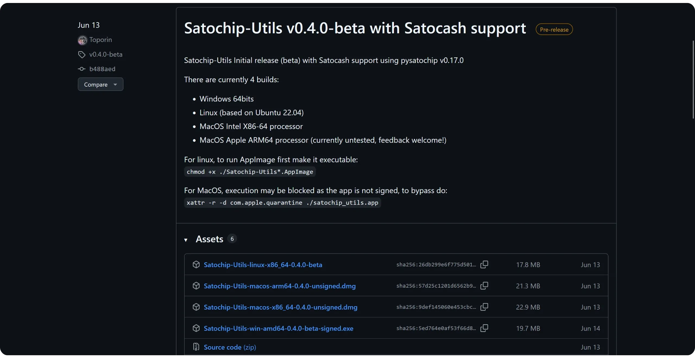

## 4.种子管理器初始化

启动应用程序，点击 "*点击和扫描*"按钮。

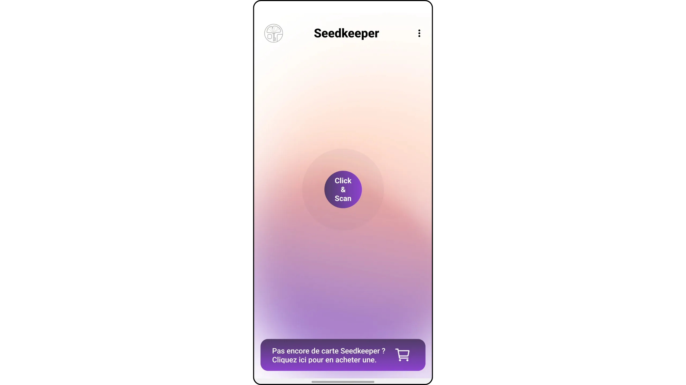

您将被要求输入种子管家的 PIN 码。由于这是一张新卡，因此尚未定义 PIN 码。请输入任意代码跳过这一步，然后点击 "*下一步*"。

然后将卡放在智能手机背面。应用程序会检测到 Seedkeeper 尚未初始化，并提示您设置智能卡的 PIN 码，长度在 4 到 16 个字符之间。为获得最佳安全性，请选择一个尽可能长、随机且由多种字符组成的强大密码。该 PIN 码是防止物理访问恢复短语的唯一屏障。

**还请记住，现在**保存此 PIN 码，例如保存在密码管理器中，或保存在单独的物理介质中。在后一种情况下，切勿将包含 PIN 码的介质与 Seedkeeper 放在同一个地方，否则这种安全措施就会失去作用。重要的是要有一个可靠的备份：没有 PIN 码，就无法恢复 Seedkeeper 中存储的秘密。

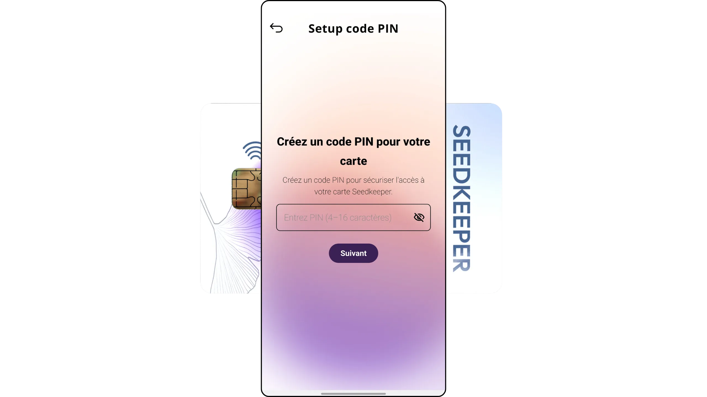

再次确认 PIN 码。

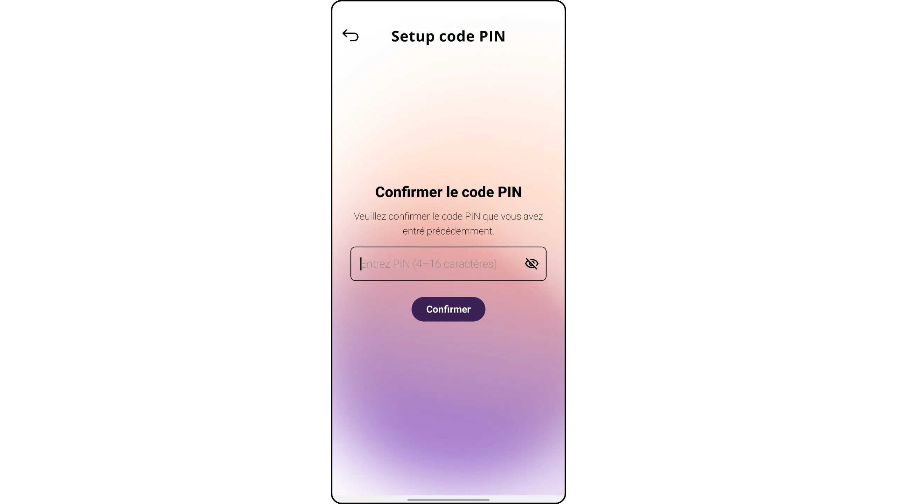

Seedkeeper 已初始化。输入刚才设置的 PIN 码即可解锁。

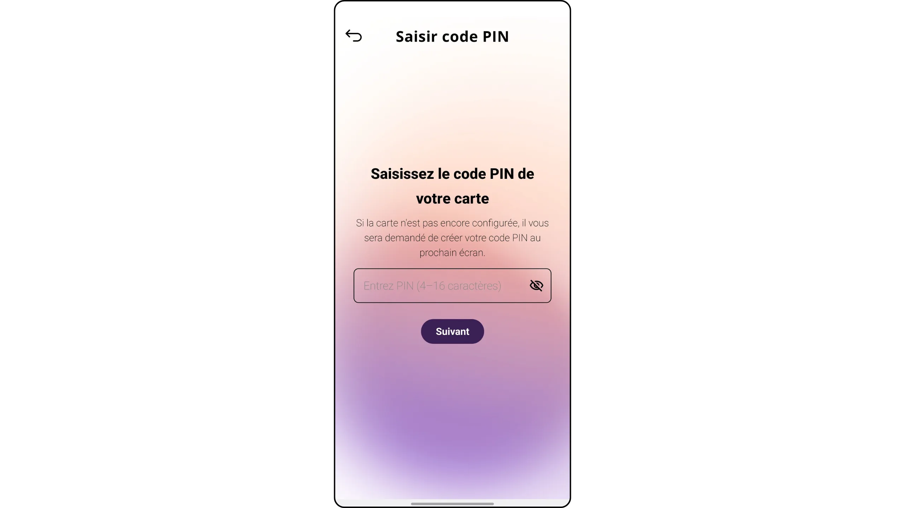

现在您将进入智能卡管理页面。

## 5.在 Seedkeeper 上注册 seed

种子守护者解锁后，点击 "*+*"按钮。

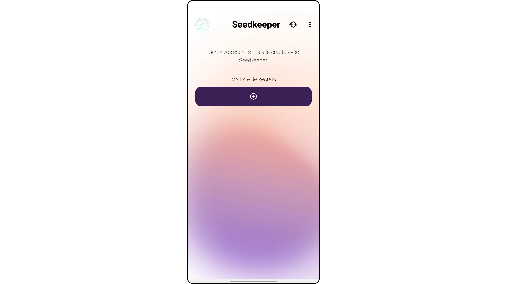

选择 "导入密文*"。通过 "*generate secret*"选项，您可以直接在应用程序中创建新的 Mnemonic 短语。

在我们的例子中，我们要将 seed 保存在我们的投资组合中。点击 "*Mnemonic*"。

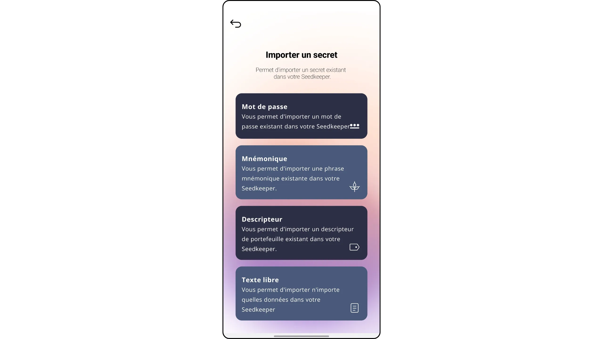

为该机密指定一个 "*标签*"，以便在 Seedkeeper 中存储多条信息时可以轻松识别。

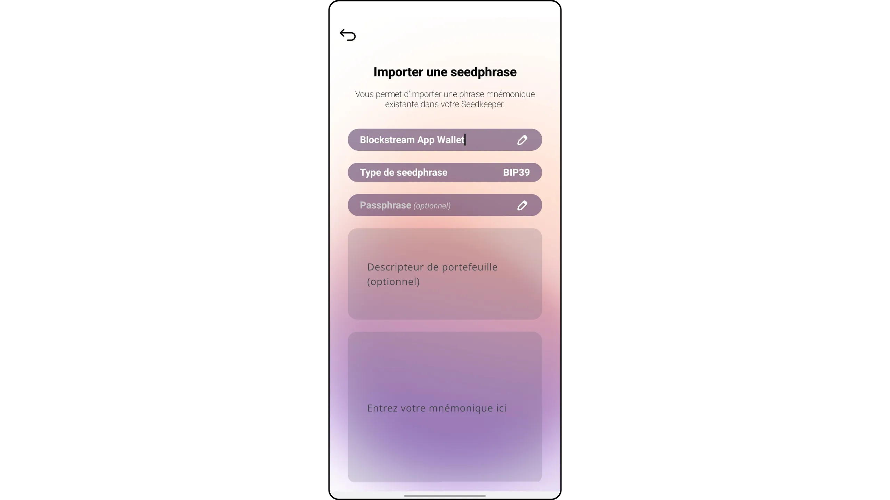

然后在提供的字段中输入您的恢复短语。如果您愿意，还可以添加 passphrase BIP39 或您的*描述符*。然后点击 "导入*"。

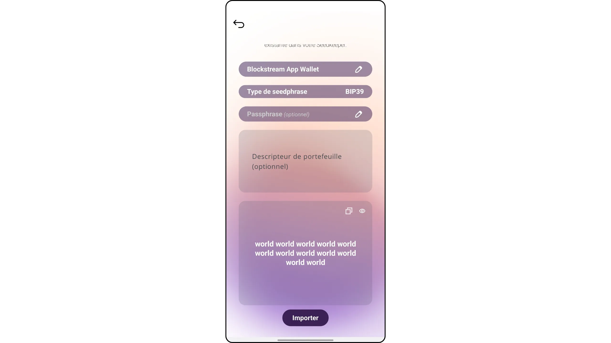

*本图片中显示的 Mnemonic 是虚构的，不属于任何人。它只是一个例子。切勿向任何人透露您自己的 Mnemonic，否则您的比特币将会被盗。

将 Seedkeeper 放在智能手机背面。

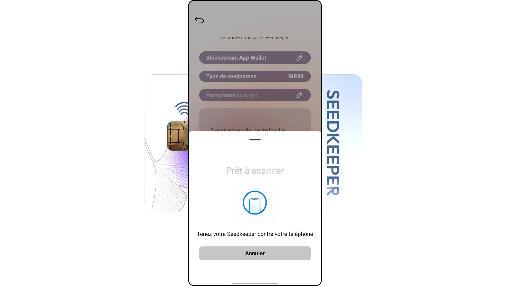

您的 seed 已注册。

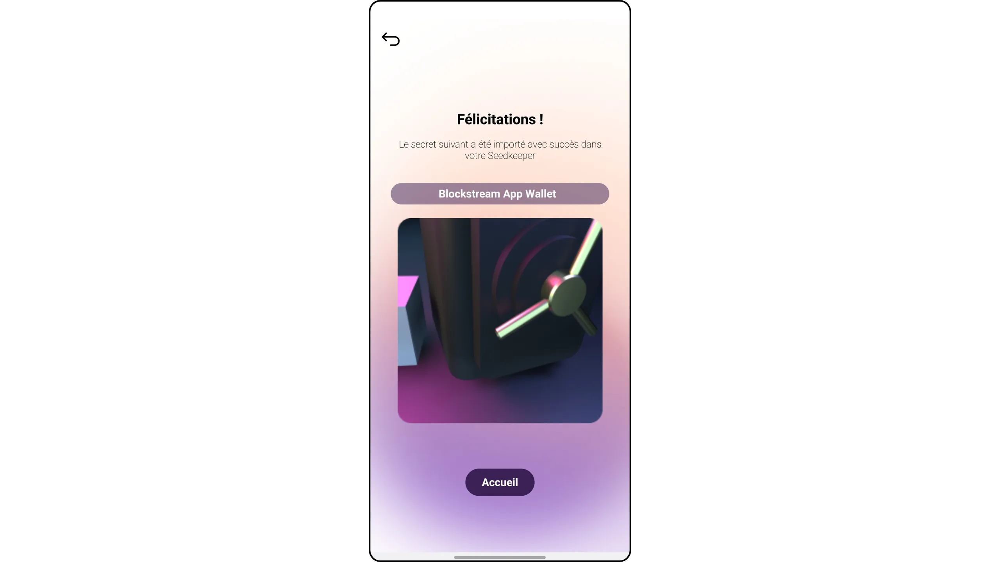

## 6.在 Seedkeeper 上访问您的 seed

如果您想检查您的 Mnemonic 短语，请拿起您的 Seedkeeper，点击 "*点击扫描*"按钮。

输入密码，然后按 "*下一步*"。

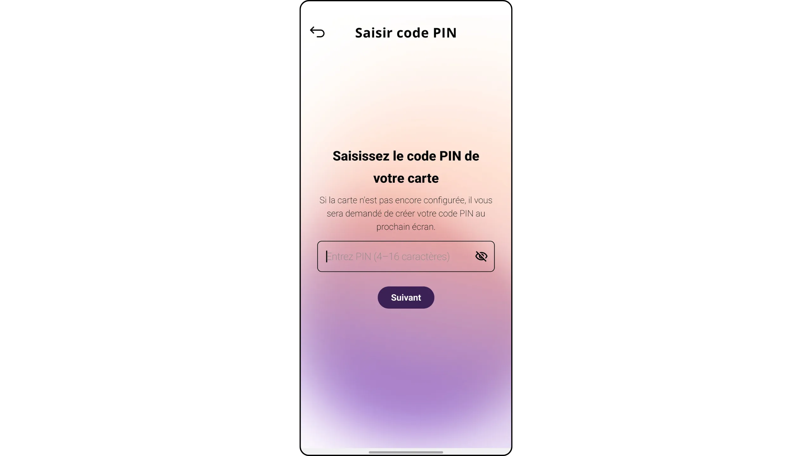

将 Seedkeeper 放在智能手机背面。

这将带您进入所有已注册秘密的列表。在本例中，我想显示我的投资组合 "*BLOCKSTREAM App*"中的 seed，因此点击了它。

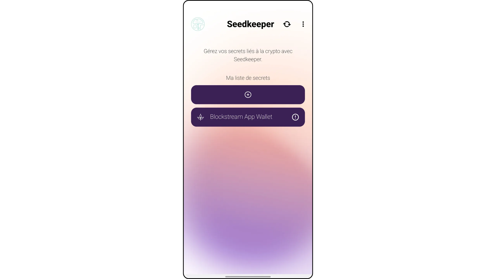

按下 "*揭示*"按钮。

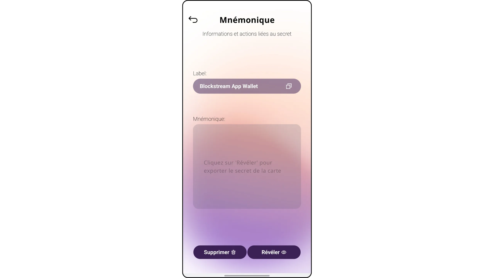

再次扫描 Seedkeeper。

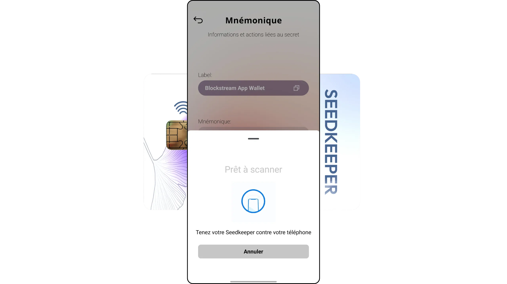

屏幕上将显示之前录制的 Mnemonic 短语。

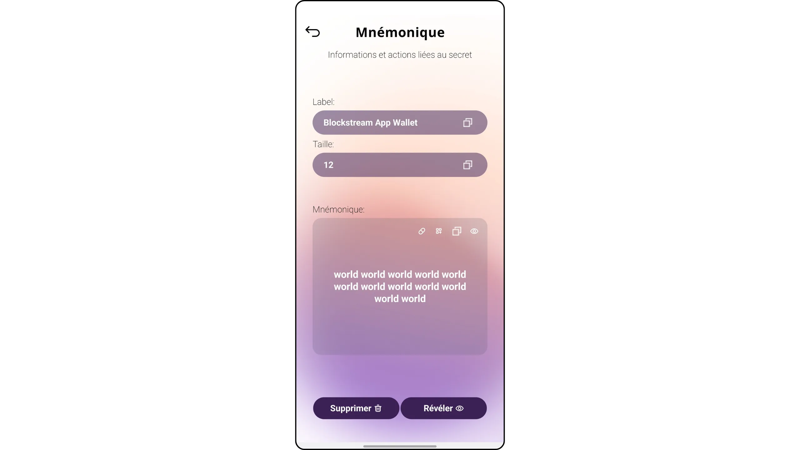

## 7.备份 Seedkeeper

我们现在要把我的 Seedkeeper 备份到第二个 Seedkeeper 上，这样就有了两个副本。这种冗余可以作为比特币安全策略的一部分：例如，将你的比特币分段存放在两个不同的地方，以限制物理风险，或者作为继承计划的一部分，将一个副本委托给一个值得信赖的亲戚。

为此，请带上你的第二个 Seedkeeper（记得在两个 Seedkeeper 中的一个上做上标记，以免混淆）。按照本教程第 4 步所述，首先对其进行初始化。再次选择一个强密码。根据你的策略，你可以选择不同的密码，也可以保留相同的密码。

打开应用程序，点击 "*点击和扫描*"，输入 Seedkeeper n°1（源）的密码，然后扫描。

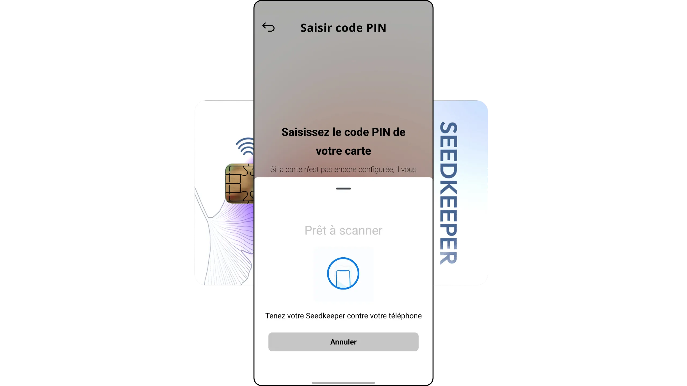

这将带您进入主页，并显示您的秘密列表。点击 Interface 右上方的三个小圆点。

选择 "*制作备份*"，然后按 "*开始*"。

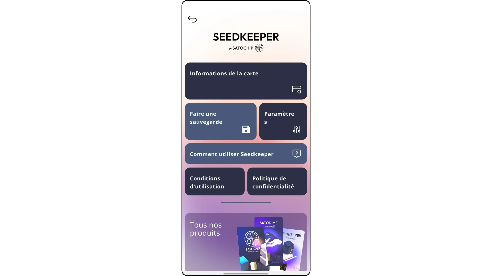

输入备份卡的 PIN 码（Seedkeeper n°2）。

然后扫描卡片。

对主卡（Seedkeeper n°1）做同样的操作，然后点击 "*制作备份*"。

现在，您的 Seedkeeper n°2 包含了 Seedkeeper n°1 中存储的所有秘密。

您可以扫描 Seedkeeper n°2，检查机密是否已被复制。

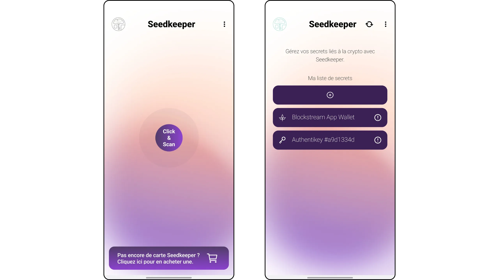

这就是全部内容！现在你知道如何使用 Seedkeeper 来存储 Bitcoin Wallet 的 Mnemonic 短语了吧。在今后的教程中，我们将介绍如何使用 Seedkeeper 存储密码。我还邀请你来探索它与 SeedSigner 的结合使用：

https://planb.network/tutorials/wallet/hardware/seedkeeper-seedsigner-45cca4c4-1f22-46bb-87ae-9cddb68aa579

https://planb.network/tutorials/computer-security/authentication/seedkeeper-password-64ffaf68-53aa-43c3-bc7a-c1dc2a17fee3

在本教程中，我们多次提到了 Bitcoin 组合中的***描述符***。不知道它们是什么？如果是这样，我建议您参加我们免费的 CYP 201 培训课程，该课程将深入详细地介绍高清投资组合的所有运作机制！

https://planb.network/courses/46b0ced2-9028-4a61-8fbc-3b005ee8d70f