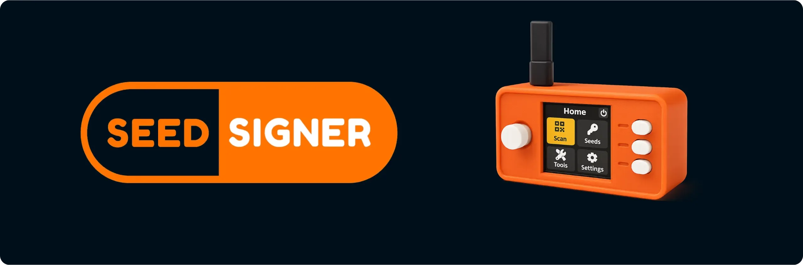
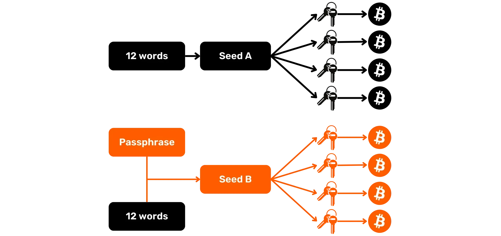
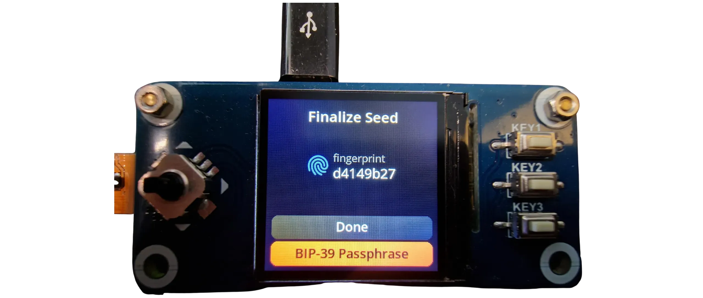
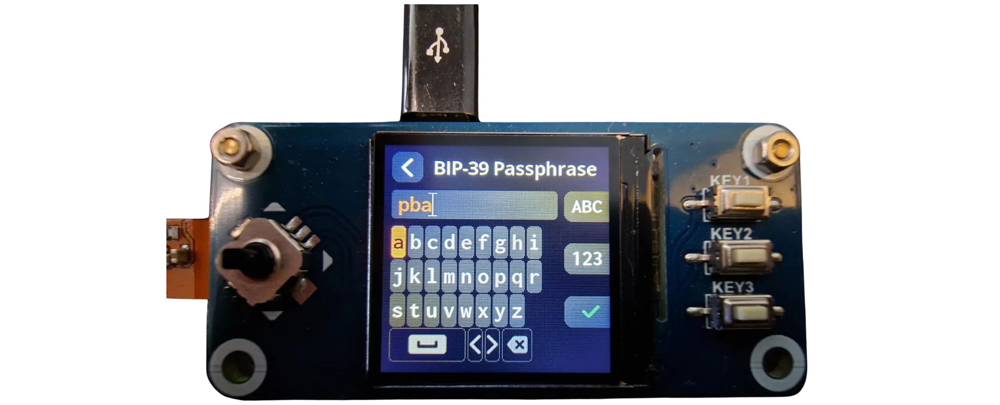
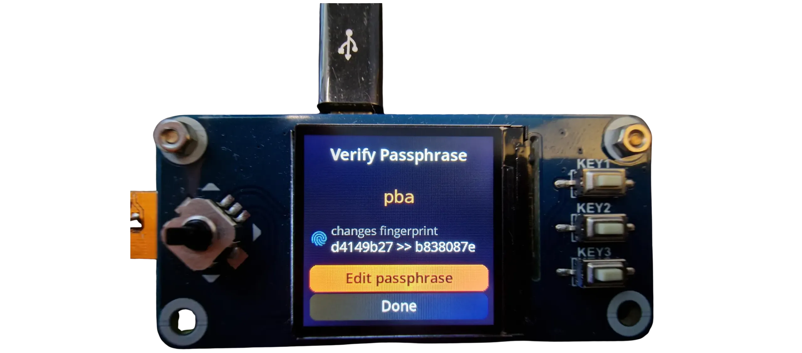
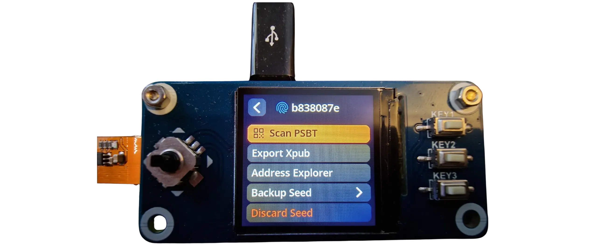

BIP39 Passphrase（密语）是一个可选密码，它与助记词结合使用，可为确定性分层比特币钱包提供额外的安全保障。在本教程中，我们将一起学习如何在与 SeedSigner 配合使用的比特币钱包上设置密码短语。

## 添加助记词前的准备工作

在开始本教程之前，如果您不熟悉助记词的概念、工作原理及其对比特币钱包的影响，我强烈建议您先阅读这篇文章，其中详细解释了所有内容（这一点非常重要，因为在不完全了解其工作原理的情况下使用助记词可能会使您的比特币面临风险）：

https://planb.academy/tutorials/wallet/backup/passphrase-a26a0220-806c-44b4-af14-bafdeb1adce7

始本教程之前，请确保您已初始化 SeedSigner 并生成了助记词。如果您尚未完成此操作，并且您的 SeedSigner 是全新的，请按照 Plan ₿ Academy 上的教程进行操作。完成此步骤后，您可以返回此教程：

https://planb.academy/tutorials/wallet/hardware/seedsigner-2b274bff-6fc8-407a-92d7-f6ec4d1fadfb

## 如何为 SeedSigner 添加密语？

为通过 SeedSigner 管理的钱包添加密码会创建一个全新的钱包，并生成一套完全独立的密钥。因此，如果您已有包含比特币的钱包，则无法再使用该密码访问它，因为它会生成一个完全不同的钱包。

为了为 SeedSigner 设置密码，请打开设备并像往常一样扫描您的 SeedQR 二维码。SeedSigner 将显示您当前钱包的指纹，该指纹对应于**未设置密码的钱包**。设置了密码的钱包将具有不同的指纹。

点击 `BIP-39 Passphrase` 按钮。

然后使用屏幕键盘在提供的字段中输入您选择的密语。务必制作一份或多份物理备份（纸质或金属材质）：丢失此密语将导致您永久失去对比特币的访问权限。**要恢复钱包，助记词和密码短语都至关重要**。如果丢失其中任何一个，您的比特币将被永久锁定。

完成输入后，按下 SeedSigner 右下方的 "KEY3" 按钮进行验证。

*在这个例子中，我使用 `pba` 作为密语。但是，在您的情况下，请确保您选择的是稳健的密语。如需了解如何定义最佳密语，请参阅另一篇文章：*

https://planb.academy/tutorials/wallet/backup/passphrase-a26a0220-806c-44b4-af14-bafdeb1adce7

SeedSigner 随后会显示您密语钱包的新指纹。请复制此指纹：在使用密码短语钱包时，这一点非常重要，因为它可以让您在每次输入密语时检查是否输入错误，以及是否正在访问正确的钱包。

例如，如果我在启动 SeedSigner 时误将密语 `pba` 输入为 `Pba`，那么这种简单的大小写差异会导致创建的钱包与我想要访问的钱包完全不同。

此指纹不会对您钱包的安全性或机密性构成任何风险。它不会泄露任何关于您密钥的公开或私密信息。因此，与助记词和密语不同，您可以将指纹保存到数字介质上。我建议您在多个地方保存一份副本：例如纸上、密码管理器中等等。

保存指纹后，点击 `Done`。

然后，您就可以访问您的投资组合的所有功能，就像在经典的 SeedSigner 上一样。

现在您可以将密钥库导入 Sparrow Wallet 并像往常一样使用您的钱包。每次重启后，您都需要扫描 SeedQR 并使用键盘重新输入密语，就像我们在这里演示的那样。

在实际使用带有密语的钱包之前，我强烈建议您执行一次完整的空钱包恢复测试。这将帮助您确认助记词和密码的备份是否有效。为了解如何执行此检查，请参阅以下教程：

https://planb.academy/tutorials/wallet/backup/recovery-test-5a75db51-a6a1-4338-a02a-164a8d91b895
