*感谢 [Crypto Guide](https://www.youtube.com/@CryptoGuide/) 提供的 SeedSigner 固件分支，用于支持智能卡，本教程将使用该分支。

---

Satochip 是一款钱包智能卡格式的硬件，配备 EAL6+ 认证的安全元件，这是最高安全标准之一。它由比利时同名公司 Satochip 设计和生产。

Satochip 的售价约为 25 欧元，以其卓越的性价比在同类产品中脱颖而出。得益于其安全芯片，它能够抵御物理攻击。此外，其 applet 源代码完全开源，并采用 *AGPLv3* 许可。

另一方面，其格式也带来了一些功能上的限制。 Satochip 的主要缺点是缺少集成屏幕：因此用户必须盲签交易，完全依赖计算机的显示屏。

为了克服这一缺陷，一种特别有趣的配置是将其与 SeedSigner 结合使用。在这种配置下，计算机和 Satochip 之间不再直接通信，而是通过计算机和 SeedSigner 之间的二维码交换进行通信。SeedSigner 充当信任屏幕：它显示待签名的信息，而签名本身则由 Satochip 执行。与传统的 SeedSigner 使用方式（甚至与 Seedkeeper 结合使用）不同，种子永远不会加载到 SeedSigner 中。因此，SeedSigner 成为 Satochip 的屏幕，从而消除了盲签带来的风险。

反过来想，将 SeedSigner 与 Satochip 结合使用弥补了 SeedSigner 的一个主要缺陷：无法在安全元件中存储和使用种子。

在我看来，这种配置相比传统的硬件钱包有以下几个优势：

- Satochip 的价格约为 25 欧元，由于其小程序是开源的，您可以自行将其安装到空白智能卡上。之后，您需要加上 SeedSigner 组件和智能卡读取扩展程序的费用：根据您购买硬件的地点，总价应该在 70 到 100 欧元之间。

- 设置过程中涉及的所有软件都是开源的：SeedSigner 固件和 Satochip 小程序。

- 您可以享受经过认证的安全保障。

- 该配置可以完全 DIY 完成，无需使用专门用于比特币的硬件，这可以提供一定的可否认性，并抵御某些外部威胁（包括，根据所在国家/地区的不同，可能包括国家压力）。如果您所在地区无法或难以获得商业硬件钱包，这也是一个不错的选择。

## 1. 所需材料

要完成此设置，您需要以下物品：

- 经典 SeedSigner 所需的常用设备：
- 带 GPIO 引脚的 Raspberry Pi Zero，
- 1.3 英寸 Waveshare 屏幕，
- 兼容的摄像头，
- microSD 卡。

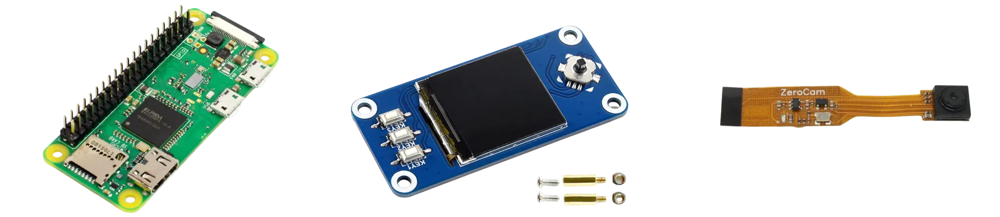

- SeedSigner 扩展套件，可从 [Satochip 官方商店](https://satochip.io/product/seedsigner-extension-kit/)购买，它可以让您直接从SeedSigner 读写智能卡。另一种方法是使用[外部智能卡阅读器](https://satochip.io/product/chip-card-reader/)，它可以通过电缆连接到 Raspberry Pi 上的 Micro-USB 端口。不过，我还没有亲自测试过这种解决方案；
- [Satochip](https://satochip.io/product/satochip/)，或者一张安装 Satochip 小程序的[空白智能卡](https://satochip.io/product/card-for-diy-project/)（Satochip 出售的扩展套件已经包含一张空白智能卡）。Satochip 的扩展工具包还支持 [SIM JavaCard](https://satochip.io/product/blank-sim-javacard-for-diy-project/) 格式。如果您需要，可以选择此格式。

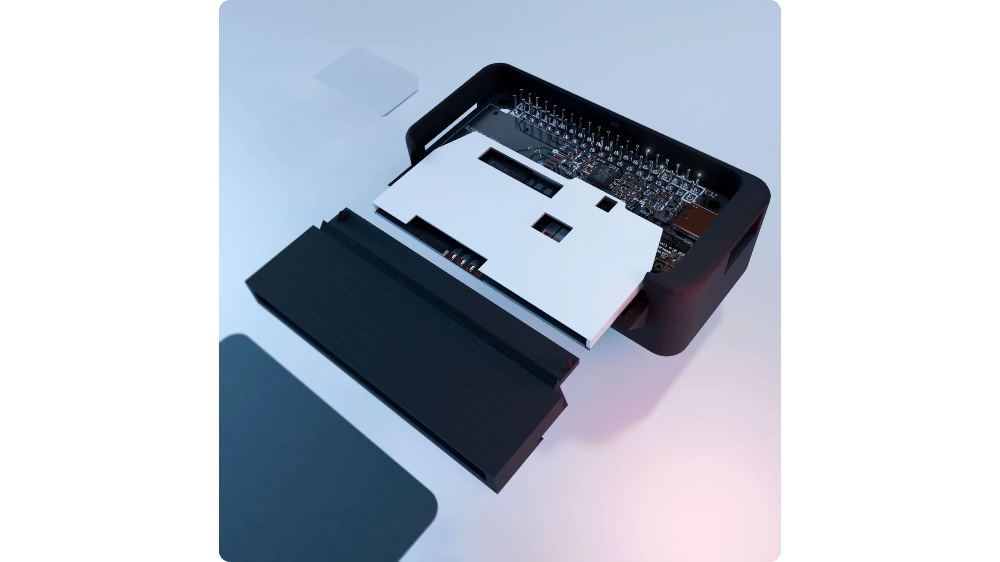

关于组装 SeedSigner 所需设备的更多详细信息，请参阅此教程的第一部分：

https://planb.academy/tutorials/wallet/hardware/seedsigner-2b274bff-6fc8-407a-92d7-f6ec4d1fadfb

## 2.安装固件

要在 Satochip 上使用 SeedSigner，您需要安装一个不同于原始 SeedSigner 的固件，以支持智能卡读取。为此，[我建议使用 "**3rdIteration**"的 分叉](https://github.com/3rdIteration/seedsigner)。下载[最新版本的映像](https://github.com/3rdIteration/seedsigner/releases) (`.zip`)，与您使用的 Raspberry Pi 型号相对应。

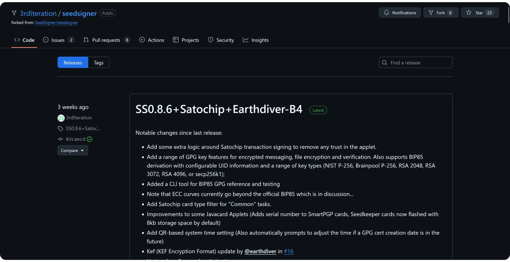

如果您还没有安装 Balena Etcher 软件 (https://etcher.balena.io/)，请先下载，然后按以下步骤操作：

- 将 microSD 卡插入您的计算机；
- 启动 Etcher；
- 选择您刚刚下载的 `.zip` 文件；
- 选择 microSD 卡作为目标；
- 点击 “Flash!”。

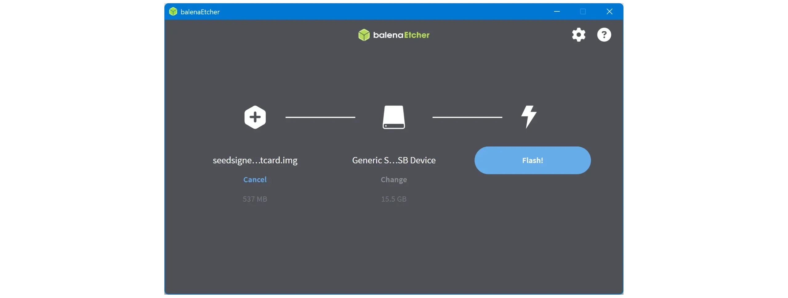

等待过程完成：您的 microSD 卡现在可以使用了。现在您可以开始组装您的设备。

有关固件安装和软件验证（强烈建议您执行此步骤）的更多详细信息，请参阅以下教程：

https://planb.academy/tutorials/wallet/hardware/seedsigner-2b274bff-6fc8-407a-92d7-f6ec4d1fadfb

## 3. 组装智能卡读卡器

首先将摄像头安装到 Raspberry Pi Zero 上，小心地将其插入摄像头引脚并用黑色卡扣固定。然后将 Pi 放在外壳底部，确保端口与相应的开口对齐。

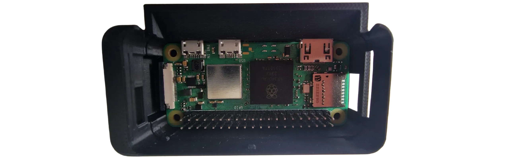

然后将智能卡读写器连接到 Raspberry Pi Zero 的 GPIO 引脚上。

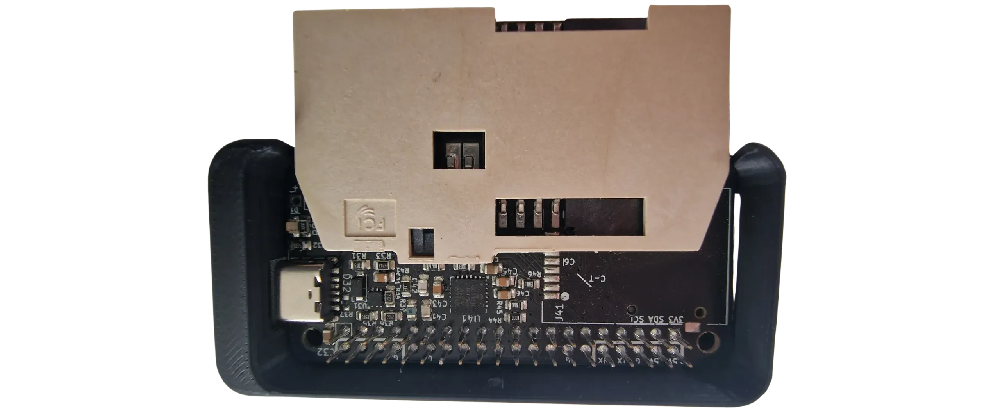

将塑料盖滑到智能卡读卡器上，直到正确定位。

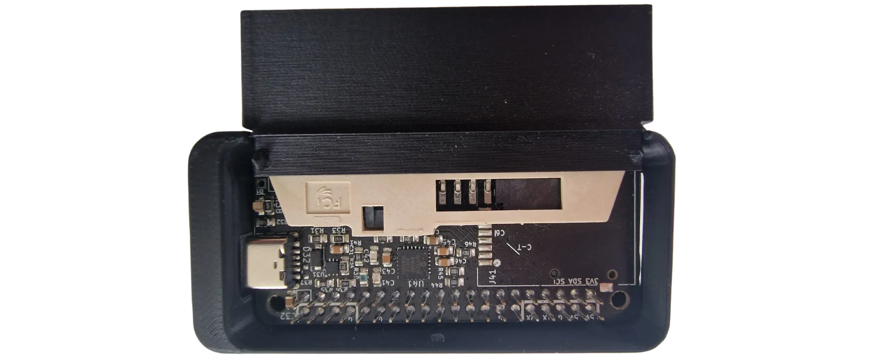

然后将屏幕添加到扩展的 GPIO 引脚上。

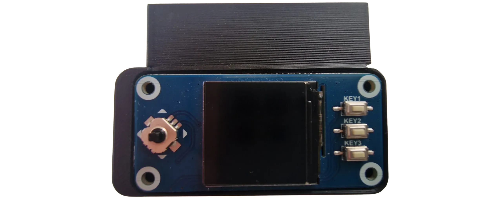

最后，将装有固件的 microSD 卡插入 Raspberry Pi Zero 的侧接口。


现在，您可以通过 Raspberry Pi Zero 的 Micro-USB 端口或扩展的 USB-C 端口连接 SeedSigner。两种方式都可以。等待几秒钟启动后，您会看到欢迎屏幕出现。

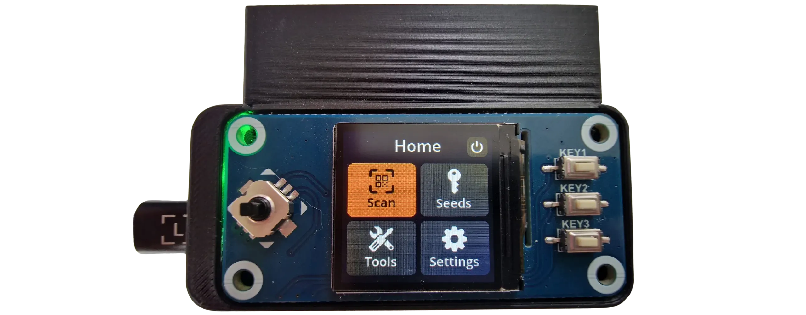

关于 SeedSigner 初始设置的更多详情，我建议您参考以下教程的第 4 部分：

https://planb.academy/tutorials/wallet/hardware/seedsigner-2b274bff-6fc8-407a-92d7-f6ec4d1fadfb

## 4. 使用 Satochip 小程序闪存智能卡（可选）

如果您已经拥有了 Satochip，可以跳过这一步，直接进入第 4 步。在本节中，我们将介绍如何在空白智能卡上安装Satochip小程序（DIY方法）。小程序只是运行在智能卡上的一个小程序，它能让我们管理特定的功能。

如果想要开始使用，请打开 SeedSigner 上的 `Tools > Smartcard Tools` 选单。

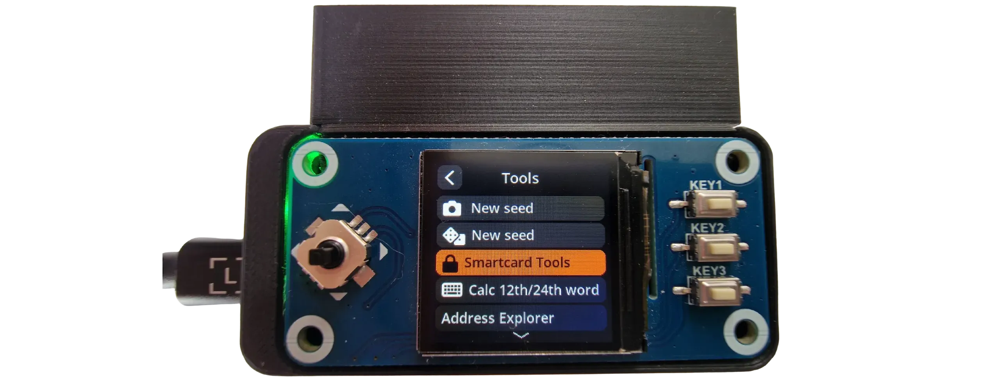

然后选择 `DIY Tools > Install Applet`。

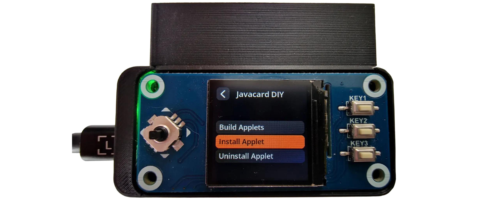

将智能卡插入 SeedSigner 阅读器，芯片朝下，然后选择 "Satochip" 小程序。

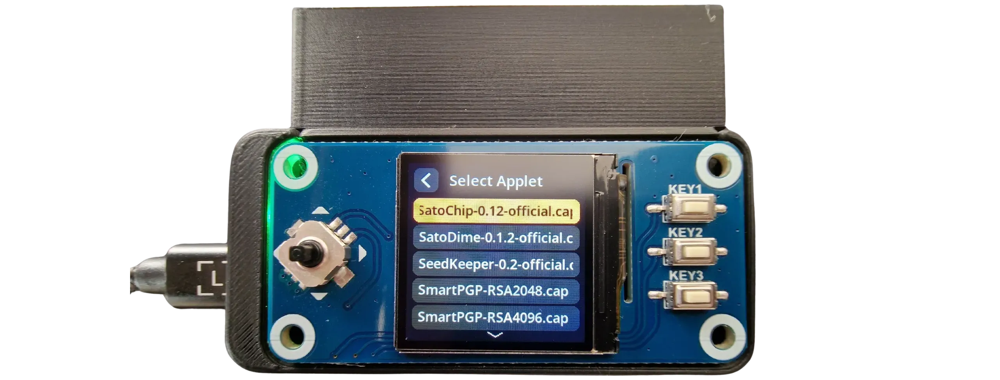

安装过程可能需要几十秒，请耐心等待。

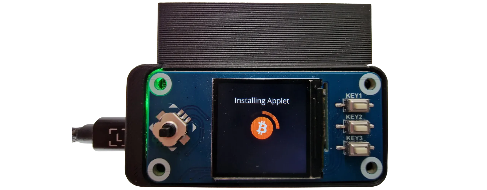

小程序安装成功后，就可以继续进行步骤 4。

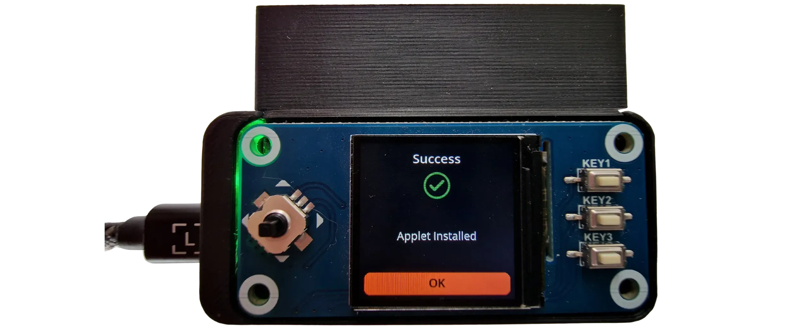

## 5. 创建和保存种子

### 5.1. 生成种子

现在您的所有硬件和软件都已正常工作，您可以开始创建比特币钱包了。要做到这一点，请先连接您的 SeedSigner，然后像使用传统 SeedSigner 一样生成助记词，可以通过掷骰子或拍照的方式：

- 前往 `Tools > Camera / Dice Rolls` 选单；
- 然后根据所选方法进行熵生成；
- 最后，在实体介质上备份种子，并仔细检查备份。

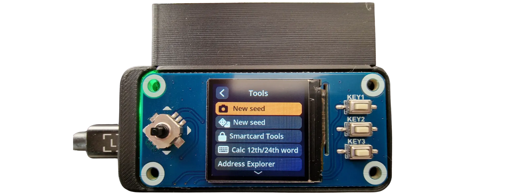

如果您想了解该步骤的详情，请参阅本教程的第 5 部分：

https://planb.academy/tutorials/wallet/hardware/seedsigner-2b274bff-6fc8-407a-92d7-f6ec4d1fadfb

### 5.2. 将助记词保存到 Seedkeeper

助记词生成后，它只会在此时驻留在 SeedSigner 的 RAM 中。就我而言，我想把它保存在 [Seedkeeper](https://satochip.io/product/seedkeeper/) 上，这是 Satochip 的另一款用于存储密钥的产品。我会将此设备作为最后的备用方案，以防我的 Satochip 丢失。

此处选择的备份策略取决于您的偏好，但务必至少保留一份助记词副本，可以保存在实体介质（纸质或金属）上，或者像这里一样保存在 Seedkeeper 中。您也可以根据需要增加备份数量。关于钱包备份策略的更多信息，我建议您阅读这篇教程：

https://planb.academy/tutorials/wallet/backup/backup-mnemonic-22c0ddfa-fb9f-4e3a-96f9-46e2a7954270

为了将助记词备份到 Seedkeeper，请直接进入 `Backup Seed` 选单。

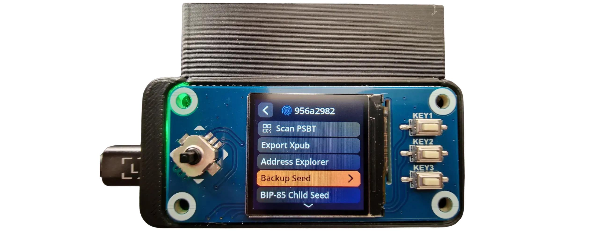

然后将 Seedkeeper 插入智能卡阅读器，并选择 `To SeedKeeper`。

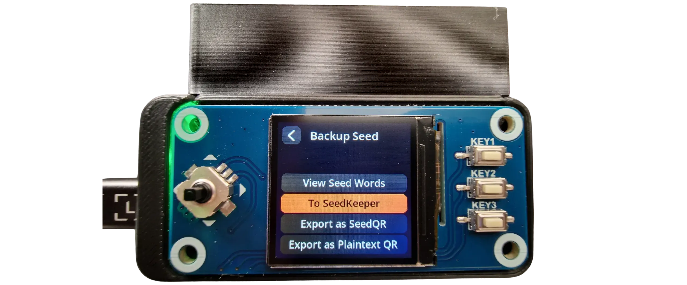

输入密码以解锁。

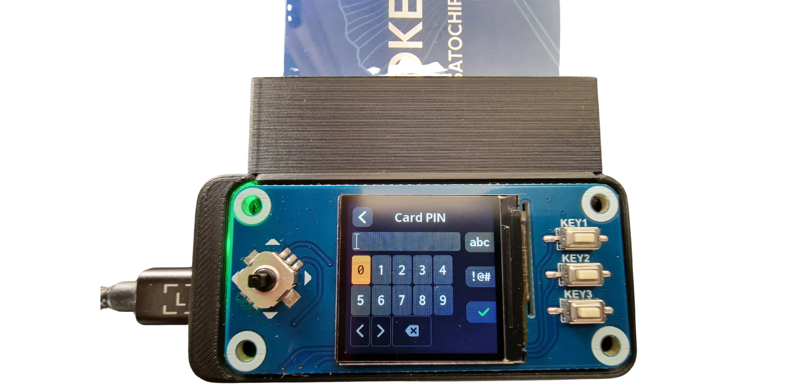

选择一个 “标签”（label）以便轻松识别存储在 Seedkeeper 中的不同密钥。例如，您可以简单地保留钱包印记，或者明确指定 “种子”。选择取决于您的偏好和风险承受能力。

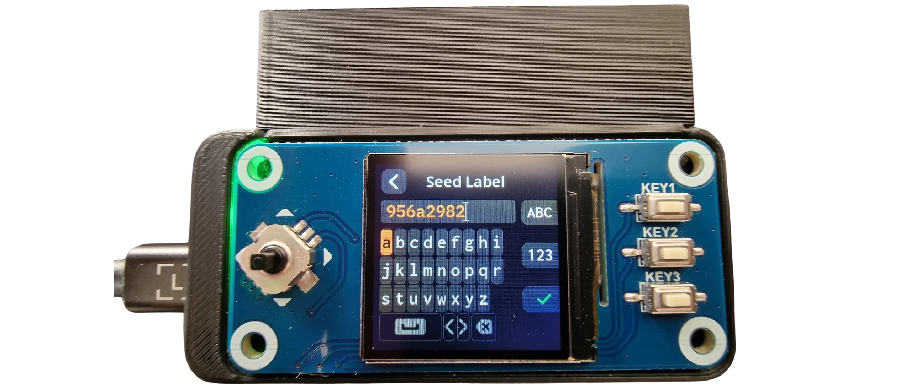

如果您的备份策略完全依赖于此 Seedkeeper，我强烈建议您立即运行一次空恢复测试，然后查看指纹以检查备份是否正常工作。

https://planb.academy/tutorials/wallet/backup/recovery-test-5a75db51-a6a1-4338-a02a-164a8d91b895

Seedkeeper 的 PIN 码应尽可能长且随机，以防在卡片受到物理破坏时被暴力破解。您还应将此 PIN 码备份一份，与 Seedkeeper 分开存放。没有这个 PIN 码，您就无法访问存储在 Seedkeeper 中的助记符，您的比特币也将永久丢失。

### 5.3. 将种子保存到 Satochip

现在您的钱包已生成、保存并验证完毕，我们将把它转移到 Satochip 中。为此，请确保种子已加载到 SeedSigner 的 RAM 中。然后前往 `Tools > Smartcard Tools > Satochip Functions`。

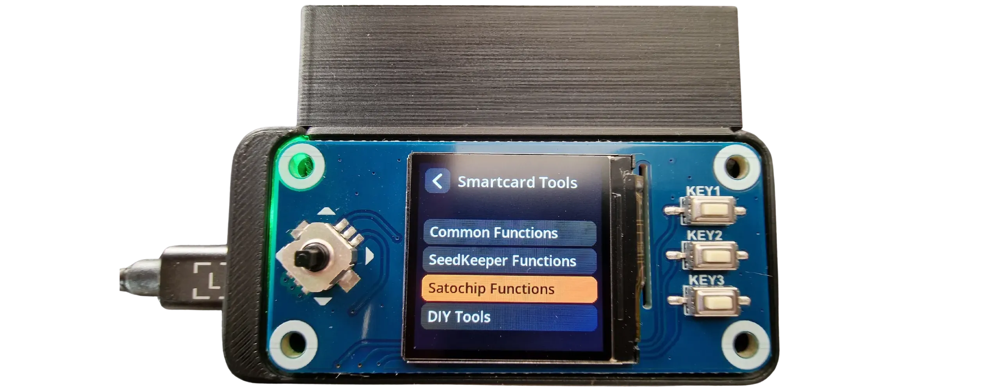

将 Satochip 插入智能卡读卡器，然后选择 `Initialise with Seed`。

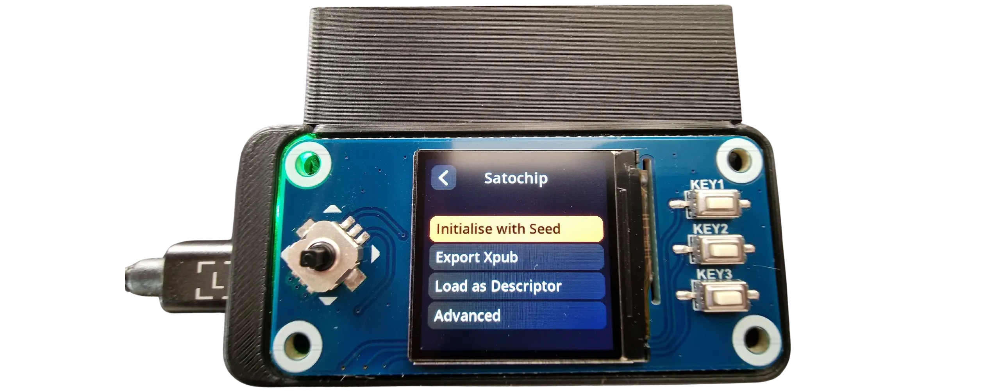

设备会提示您输入 Satochip PIN 码；由于卡片是新的且尚未初始化，因此目前没有 PIN 码。您可以输入任意代码来跳过此步骤（此代码不会锁定卡片）。

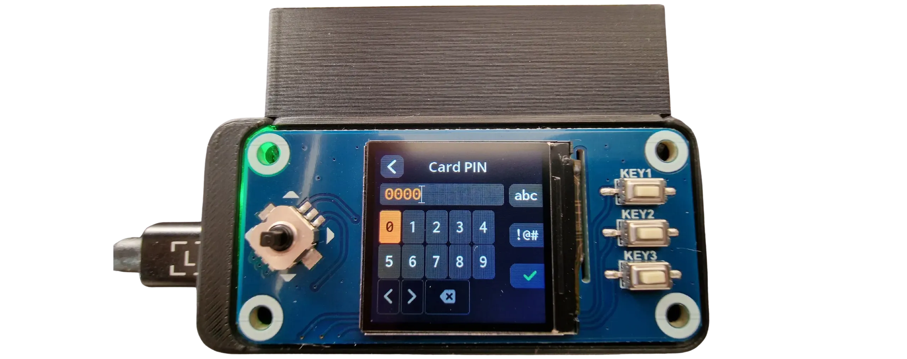

SeedSigner 检测到您的 Satochip 尚未初始化。点击 `I Understand` 以确认。

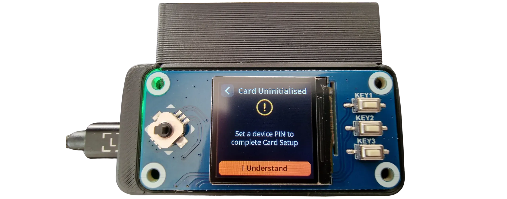

接下来，您可以设置 Satochip 的 PIN 码，长度为 4 到 16 个字符。为了增强钱包的安全性，请选择一个较长的随机代码：这是防止助记词被物理访问的唯一保护措施。

请记住，创建 PIN 码后立即将其保存，您可以将其保存在安全的密码管理器中，也可以保存在物理介质上，具体取决于您的个人策略。如果选择后者，请务必不要将保存 PIN 码的介质与您的 Satochip 放在同一位置，否则保护措施将失效。备份 PIN 码至关重要：**如果没有此 PIN 码，您将无法访问您的助记词，您的比特币将永久丢失**。

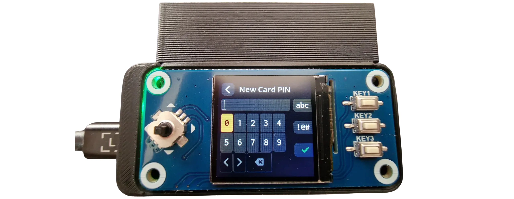

SeedSigner 会询问您要将哪个助记词导入到 Satochip 中。请选择与您刚刚创建的钱包指纹匹配的助记词。

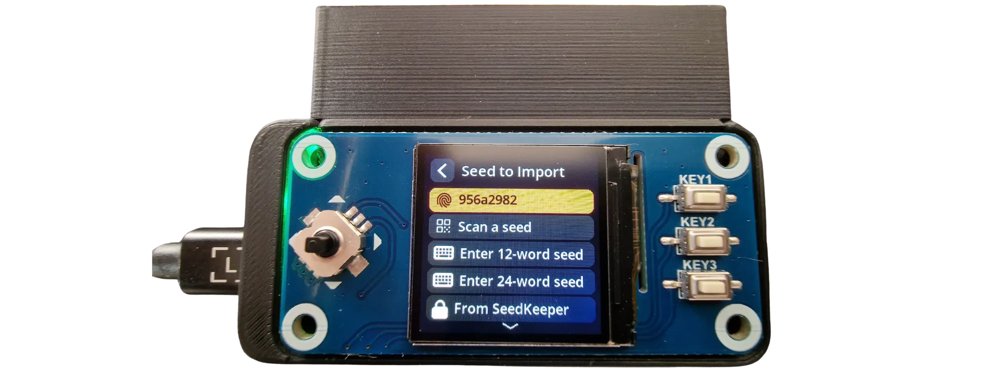

您的种子已导入到 Satochip 中。

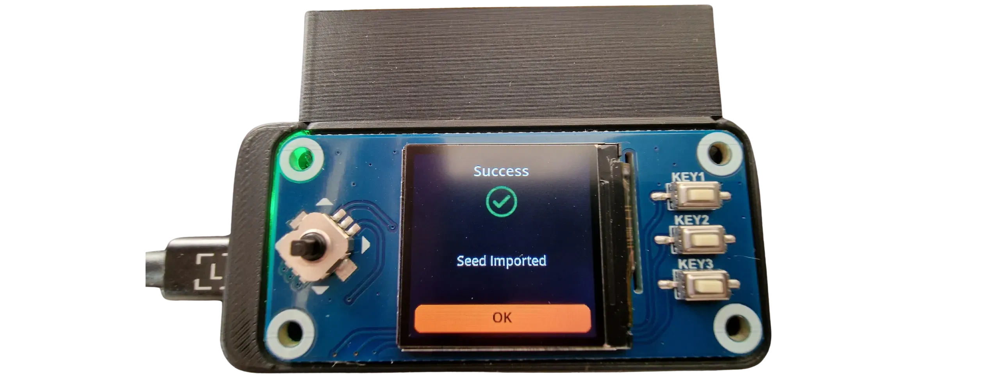

您现在可以关闭 SeedSigner。

如果您想使用 BIP39 passphrase（密语）来增强钱包的安全性，请参阅本教程的第 6 部分：

https://planb.academy/tutorials/wallet/hardware/seedkeeper-seedsigner-45cca4c4-1f22-46bb-87ae-9cddb68aa579

## 6.将 wallet 导入 Sparrow


现在，您的投资组合已经启动并运行，我们将把其公共信息（"*keystore*"）导入 Sparrow Wallet 或其他投资组合管理软件。该软件将用于创建、分发和跟踪您的交易。不过，该软件无法对交易进行签名，因为只有 Satochip（以及任何备份）才持有签名所需的私人密钥。

### 6.1 准备 SeedSigner 和 Satochip

插入包含操作系统的 microSD 卡，然后打开 SeedSigner。目前，它无法执行任何操作，因为它还不知道您的种子。您需要先将 Satochip 插入智能卡读卡器，因为它存储着您的种子。

在主屏幕上，访问 `Tools > Smartcard Tools > Satochip Functions` 选单。

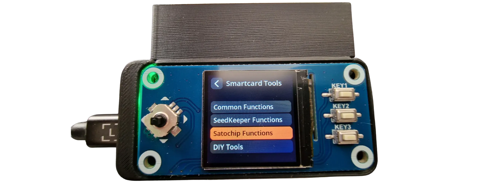

然后点击 `Export Xpub`。

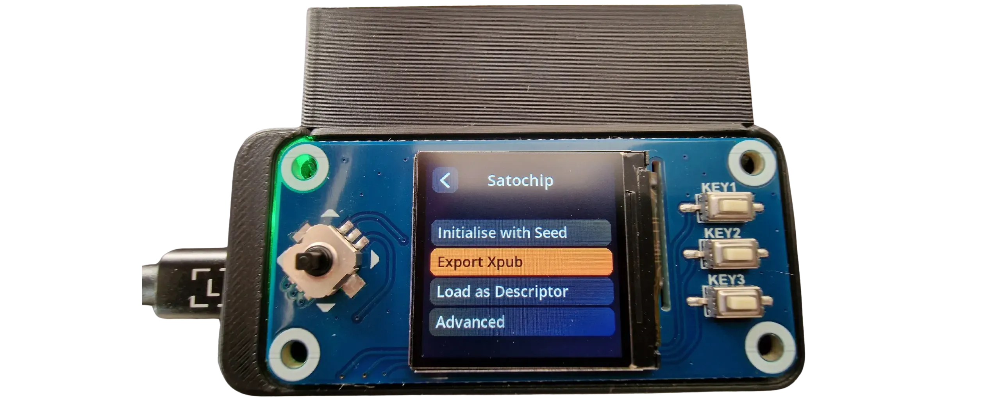

选择钱包类型。在我们的例子中，这是一个单一的钱包：选择 `Single Sig`。

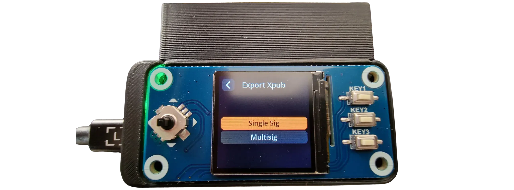

接下来是选择脚本标准。选择最新的：`Native SegWit`。

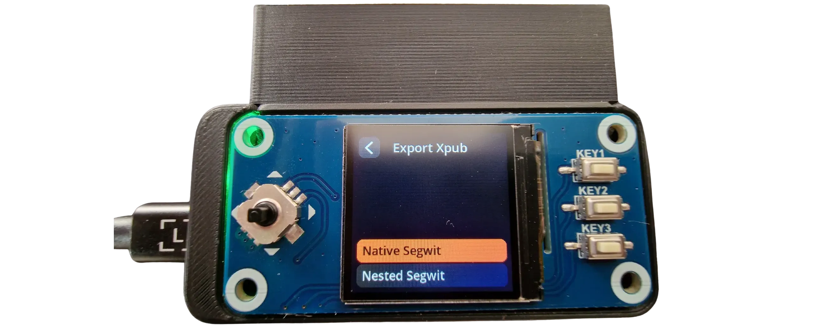

最后，选择 `Coordinator`,，即您要使用的钱包管理软件。在这里，我们将使用 Sparrow Wallet。

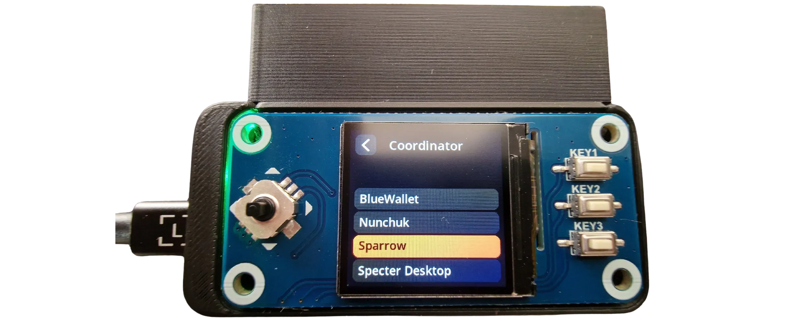

屏幕上会出现一条警告信息：这是完全正常的。扩展公钥 (`xpub`) 允许您查看所有由您的助记词（在第一个账户中）派生的地址。但是，它并不能让您访问您的资金：泄露此公钥会损害您的隐私，但不会危及您的比特币安全。换句话说，它允许您查看余额，但不能消费它们。

点击 `I Understand`。

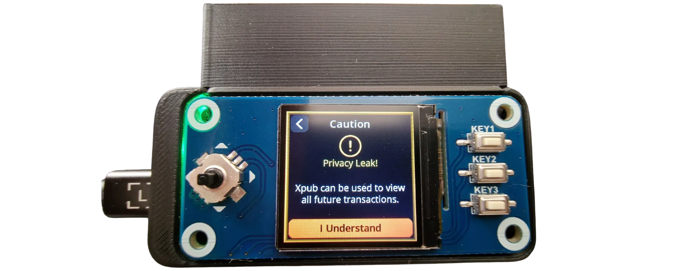

然后输入您的 Satochip 的 PIN 码进行解锁。此代码是您在步骤 5 中定义并保存的。

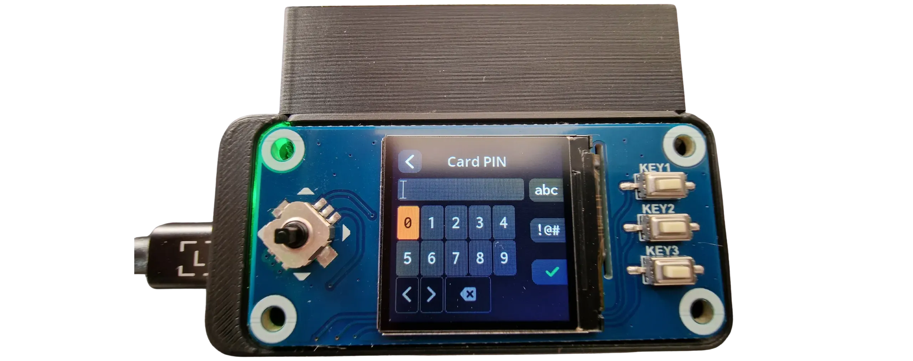

如果您显示的信息已正确，请点击 `Export Xpub`。

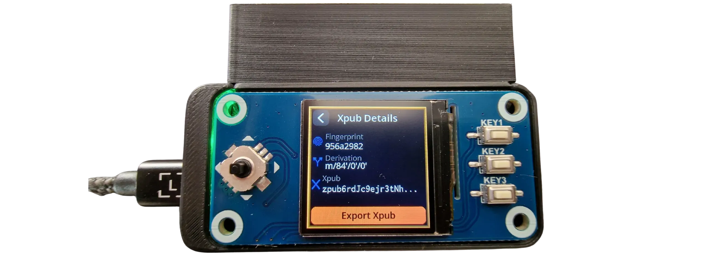

SeedSigner 随后会生成一个动态二维码形式的 xpub，其中包含您在 Sparrow Wallet 中管理钱包所需的所有数据。您可以使用摇杆调节屏幕亮度，以便更轻松地扫描二维码。

### 6.2 将新钱包导入 Sparrow Wallet

请确保您的计算机上已安装 Sparrow Wallet 软件。如果您不知道如何下载、验证其真实性并正确安装，请参阅我们的完整教程：

https://planb.academy/tutorials/wallet/desktop/sparrow-c674e2ac-d46f-4c82-92a7-7d1b0e262f5d

在计算机上打开 Sparrow Wallet，然后在选单栏中单击 `File → Import Wallet`。

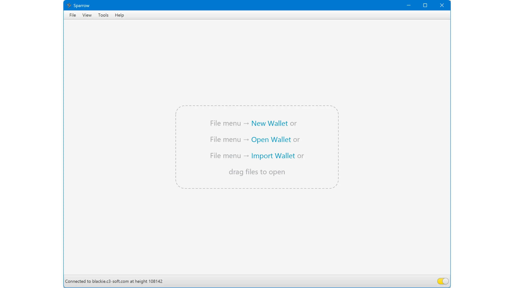

向下滚动到 `SeedSigner`，然后选择 `Scan...`。您的摄像头将被激活：扫描 SeedSigner 屏幕上显示的动态二维码。

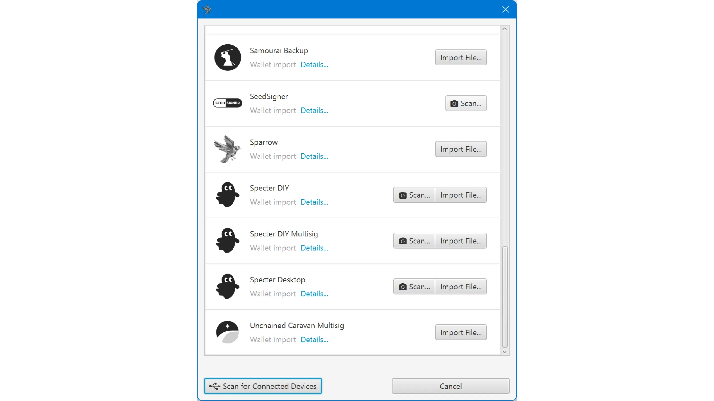

为您的钱包命名，然后点击“创建钱包”。Sparrow 会要求您设置密码以锁定对该钱包的本地访问。请选择一个强密码：它可以保护您在 Sparrow 中的数据（公钥、地址、标签和交易历史记录）。但是，将来恢复钱包时不需要此密码：只需要您的助记词（以及密语）。

我建议您将此密码保存在密码管理器中，以免丢失。

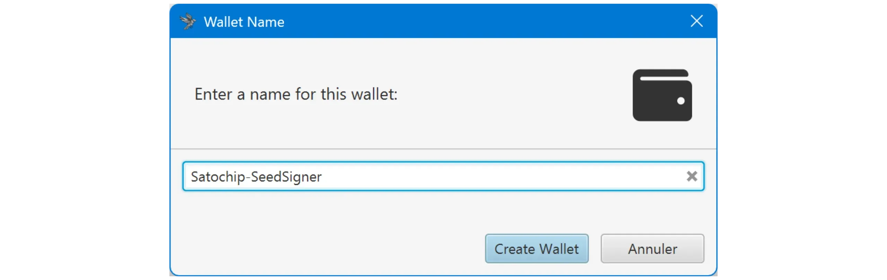

您的密钥库已成功导入。

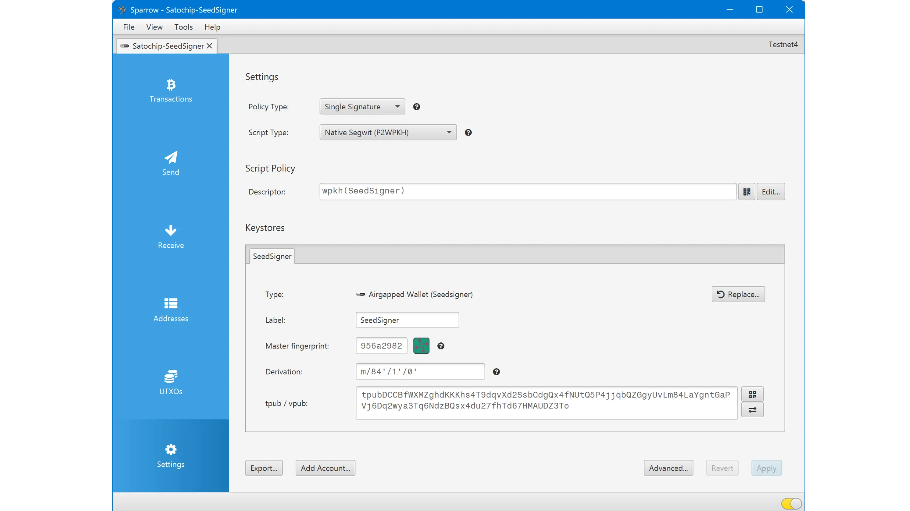

现在请检查 Sparrow Wallet 中显示的 `Master fingerprint` 是否与之前在 SeedSigner 中找到的指纹匹配。

SeedSigner 会要求您扫描 Sparrow Wallet 中的一个随机接收地址，以确认导入的有效性。

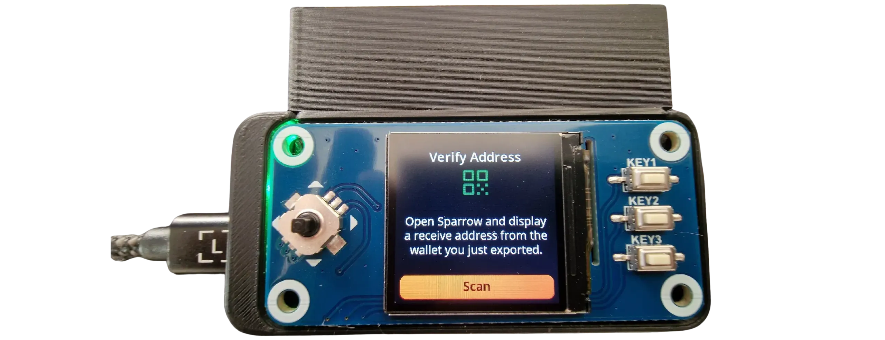

您的 Satochip（通过 SeedSigner）和 Sparrow Wallet 现已安全连接。Sparrow Wallet 作为完整的管理界面，而 Satochip 仍然是唯一能够签署您的交易的设备。您现在可以完全在空气隔离的配置下接收和发送比特币。

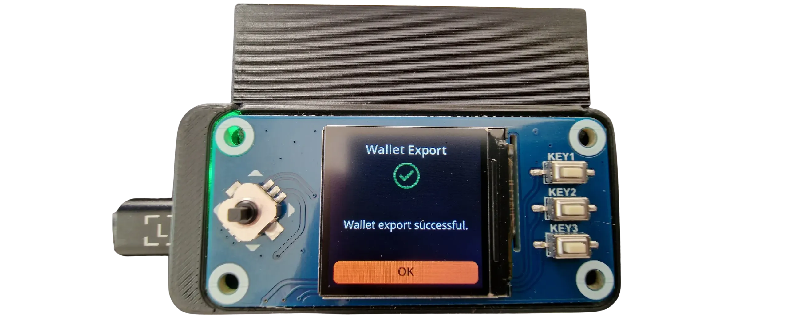

## 7.接收和发送比特币

您的 Satochip 和 Sparrow 钱包现已配置完毕，可以协同工作。在本节中，我们将逐步讲解如何在这种模式下接收和发送比特币。

### 7.1 接收比特币

#### 7.1.1 生成接收地址

在您的电脑上，打开 Sparrow Wallet，并使用您的密码解锁您的 `Satochip-SeedSigner` 钱包。检查软件是否已连接到服务器（右下角有连接指示器）。然后，在侧边栏中，点击 `Receive`。


一个新的比特币地址将会出现。您将看到：

- 文本格式的地址（如果您使用的是 P2WPKH，则地址以 `bc1q...` 为开头，如本例所示）；
- 关联的二维码；
- 一个 `Label`（标签）字段，用于追踪您的交易。

我强烈建议您为钱包中的每张比特币收据添加标签。这将帮助您轻松识别每个 UTXO（未花费交易输出）的来源，并更好地管理您的隐私。为了了解更多关于此重要主题的信息，请查看 Plan ₿ Academy 上的相关培训：

https://planb.academy/courses/65c138b0-4161-4958-bbe3-c12916bc959c

为了添加标签，只需在 `Label` 字段中输入名称，然后确认即可。

例如：

```txt
Label : Sale of the Raspberry Pi Zero
```

现在，您的地址在所有 Sparrow 分区中都与此标签相关联。

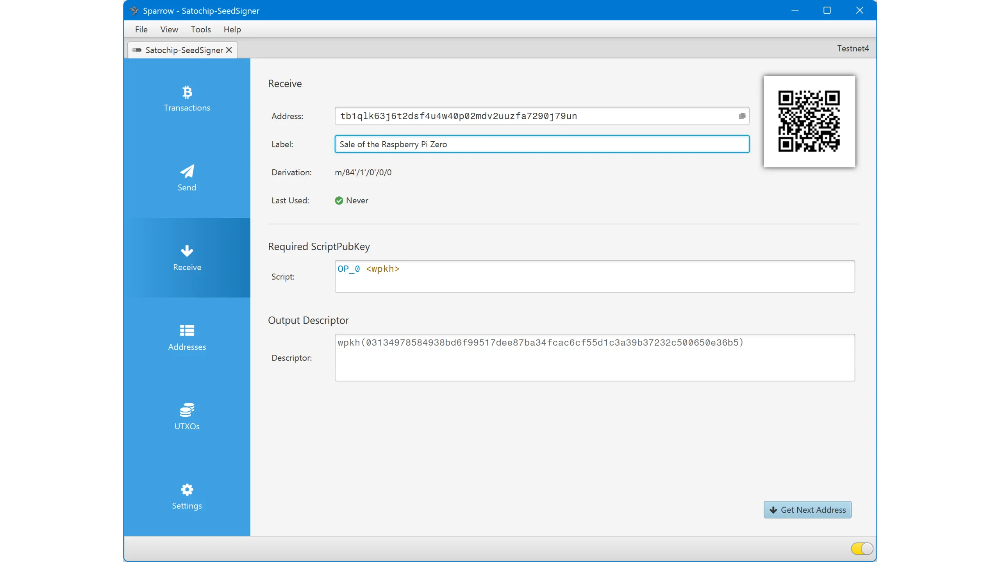

#### 7.1.2 SeedSigner 上的地址验证

在将您的收款地址告知付款人之前，请务必确认该地址与您的助记词一致。此步骤确保您的 Satochip 卡能够签名与此地址关联的交易。它还能防止 Sparrow 显示虚假地址的潜在攻击。请注意，Sparrow 运行在不安全的环境中（您的计算机），其攻击面远大于完全隔离的 Satochip 卡。因此，在未使用硬件钱包验证之前，切勿盲目信任 Sparrow 中显示的地址。

在 Sparrow 中，点击地址的二维码将其放大：二维码将全屏显示。

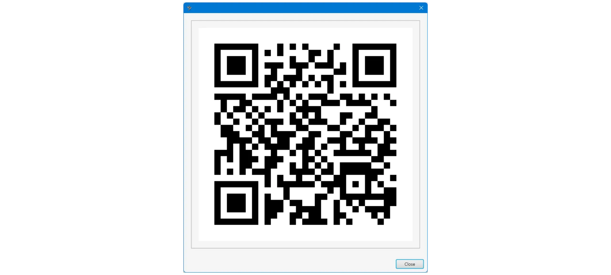

在 SeedSigner 上，将 Satochip 插入阅读器，然后从主选单中选择 `Scan`。扫描电脑上显示的二维码，然后选择 `Use Satochip card`。

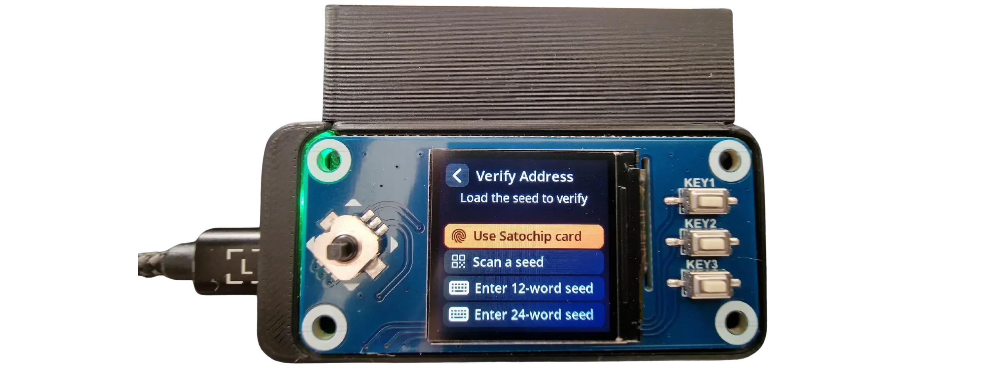

然后确认使用的脚本类型（本例中为 `Native SegWit`），输入 Satochip PIN 码以解锁，并验证 `xpub` 信息。

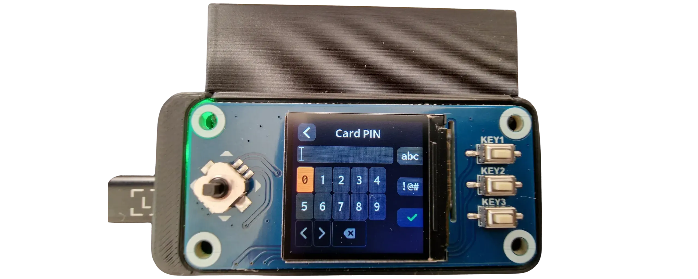

如果扫描的地址与您的种子地址匹配，SeedSigner 将显示消息：`Address Verified`。

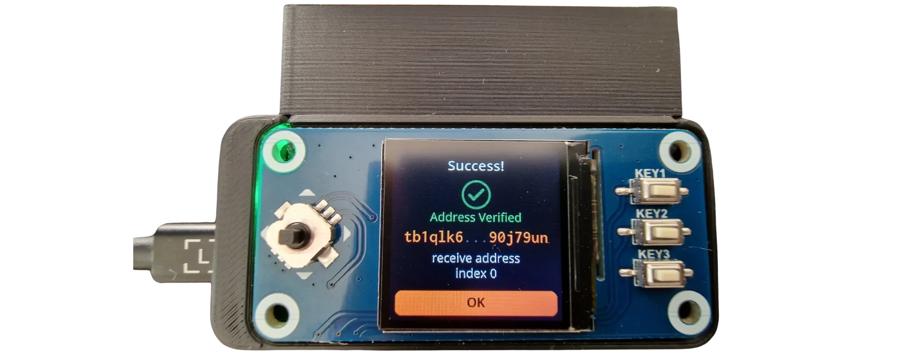

此时您可以确认该地址属于您的钱包。

#### 7.1.3 接收资金

现在您可以将此地址以文本形式或通过二维码发送给需要向您发送聪（比特币）的个人或部门。交易广播到网络后，它将出现在 Sparrow Wallet 的 `Transactions` 选项卡中。


### 7.2 发送比特币

使用 Satochip-SeedSigner 配置发送比特币包含以下三个步骤：

- 在 Sparrow 中创建交易；
- 通过 SeedSigner 在 Satochip 上签名此交易；
- 最后，Sparrow 会将交易广播到网络。

两台设备之间的所有交易均通过二维码进行。

#### 7.2.1 在 Sparrow 中创建交易

在 Sparrow 钱包中，您可以通过点击左侧边栏的 `Send` 选项卡来创建交易。不过，我更喜欢使用 `UTXOs` 选项卡，因为它允许您进行“币控制”。这种方法可以精确控制消费的 UTXO，从而限制交易过程中泄露的信息。

在 `UTXOs` 选项卡中，选择您要消费的 UTXO，然后点击 `Send Selected`。

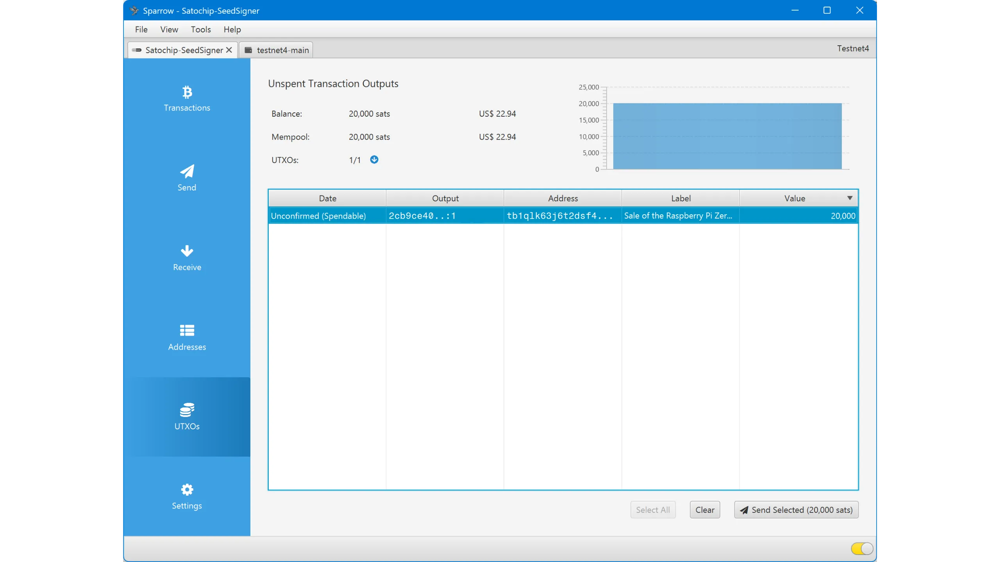

然后填写交易字段：

- 在 `Pay to` 中，粘贴接收者地址或使用相机图标扫描其二维码；
- 在 `Label` 中，添加一个标签来追踪这笔费用；
- 在 `Amount` 中，输入要发送的金额；
- 最后，根据当前网络状况选择费率（可在 [mempool.space](https://mempool.space/) 查看预估费率）。

填写完所有字段后，请仔细核对信息，然后点击 `Create Transaction >>`。

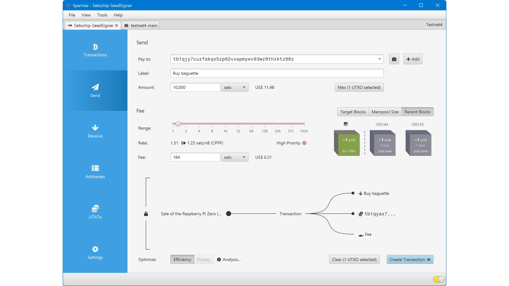

再次检查交易详情是否准确，然后点击 `Finalize Transaction for Signing`。

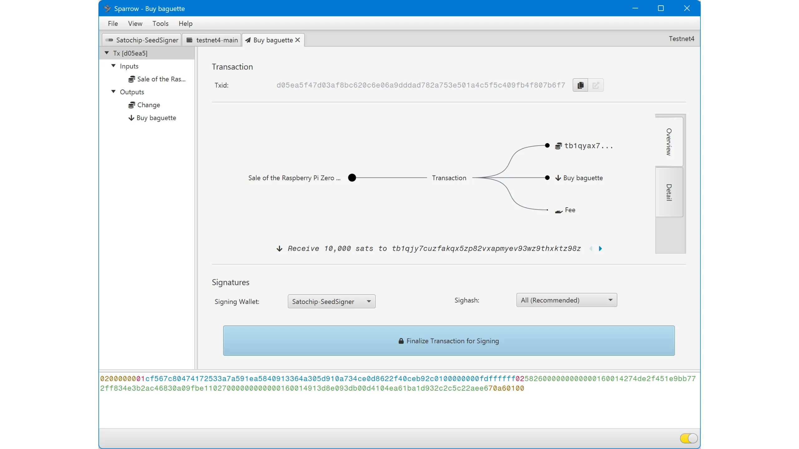

交易现已准备就绪，但尚未签名。为了将 [PSBT (*Partially Signed Bitcoin Transaction*)](https://planb.academy/en/resources/glossary/psbt) 显示为二维码，请单击 `Show QR`。

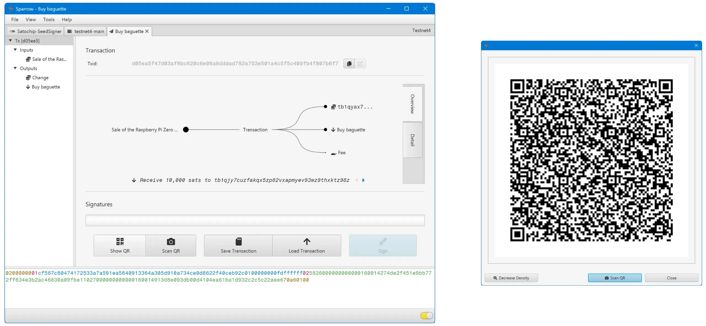

#### 7.2.2 使用 Satochip 签名交易

打开 SeedSigner 并像往常一样插入 Satochip。在主屏幕上，选择 `Scan`，然后扫描 Sparrow 上显示的二维码。

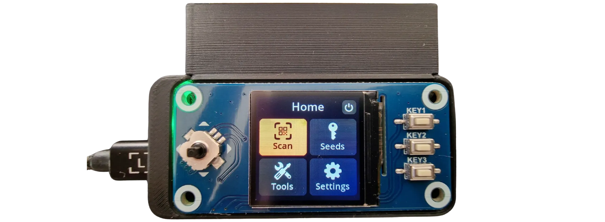

选择 `Use Satochip card` "选项。

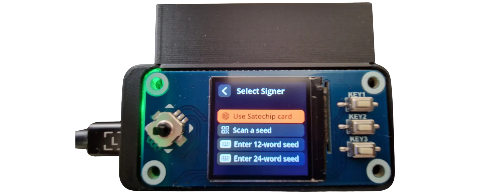

输入 PIN 码以解锁智能卡。

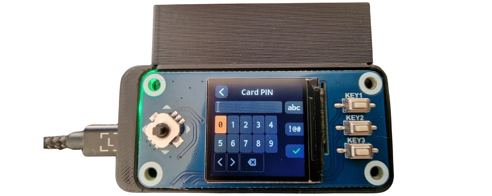

SeedSigner 会检测到这是一个 PSBT，并显示交易摘要：

   - 发送的金额、
   - 接收者的地址、
   - 相关交易手续费。

点击 `Review Details`，直接在 SeedSigner 屏幕上仔细查看所有信息。最重要的检查点是发送金额、接收者地址和交易手续费。

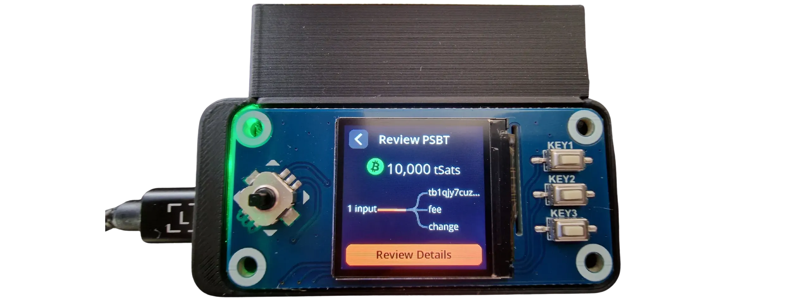

如果一切正常，请选择 `Approve PSBT`，使用 Satochip 签名交易。

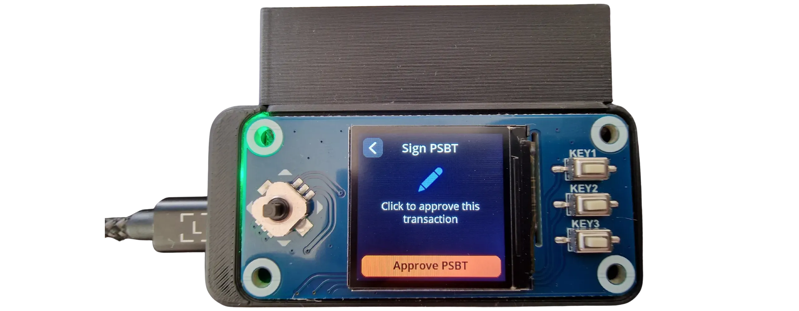

签名完成后，SeedSigner 会生成一个包含签名交易的新二维码，可供 Sparrow 扫描。

#### 7.2.3 通过 Sparrow 广播交易

现在，交易已签名并通过验证，剩下的工作就是在比特币网络上广播，以便矿工将其纳入区块。在 Sparrow 中，点击 `Scan QR`。

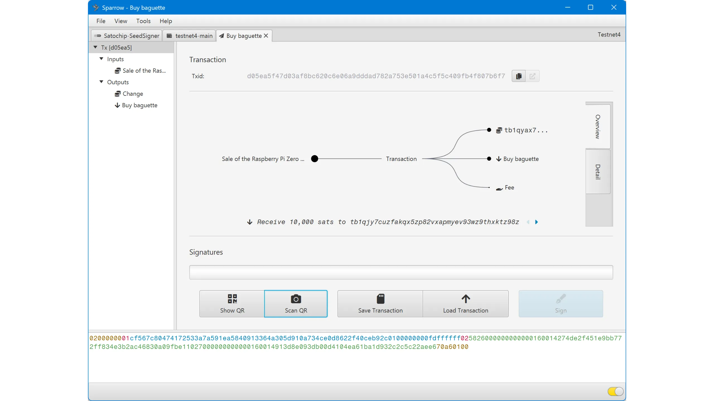

将 SeedSigner（包含已签名交易的二维码）上显示的二维码呈现给网络摄像头。然后 Sparrow 将显示所有交易详细信息。检查所有信息是否正确，然后点击 "Broadcast Transaction" 将其广播到比特币网络上。

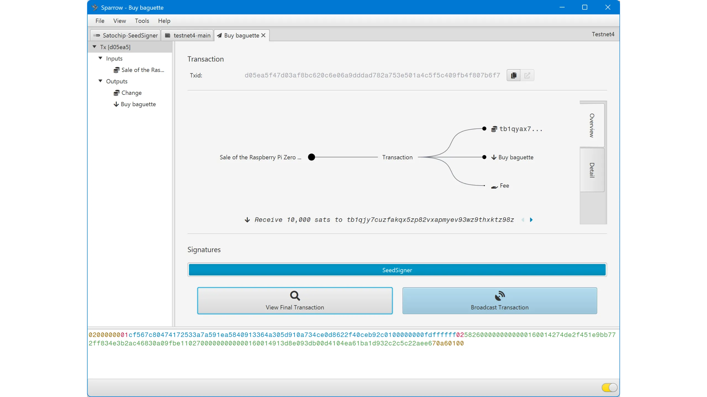

您的交易现已广播到比特币网络上。您可以在 Sparrow Wallet 的 `Transactions` 选项卡中进行确认。

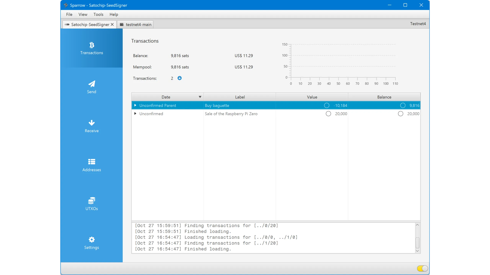

## 8. 恢复钱包

正如我们在前面几节中所看到的，根据您的安全策略，除了 Satochip 之外，还有多种方法可以备份您的恢复助记词：

- 使用经典的 *SeedQR* 和 SeedSigner ；
- 通过将助记词记录在实体介质上；
- 或者将其存储在 Seedkeeper 上，如第 5.2 节所述。

无论如何，有两种主要情况需要您进行干预：Satochip 丢失或 SeedSigner 丢失。让我们看看在每种情况下如何反应。

### 8.1。使用 Satochip 恢复您的钱包

如果您仍然拥有 Satochip，但您的 SeedSigner 已损坏或丢失，那么这种情况很容易管理，因为您的钱包仍在 Satochip 中。

最好的选择是推荐必要的组件并从头开始重建新的 SeedSigner。由于这是一个 “无状态” 设备，因此无论您使用同一个还是另一个 SeedSigner 都没有关系：只要您可以插入 Satochip，一切都会正常工作。

如果您不想重建，您也可以以经典方式使用您的 Satochip，即直接从您的计算机上使用，无需通过 SeedSigner。这种方法效果很好，但它大大降低了比特币钱包的安全性：您失去了 “空气隔离” 的好处，现在必须进行盲签名，因为 SeedSigner 作为受信任屏幕。但是，这可能是紧急情况下或您无法重建 SeedSigner 时的临时解决方案。

为此，您需要 USB 智能卡或 NFC 读卡器。在 Sparrow 中打开您想要恢复的钱包，然后转到 `Settings` 选项卡并点击 `Replace`。

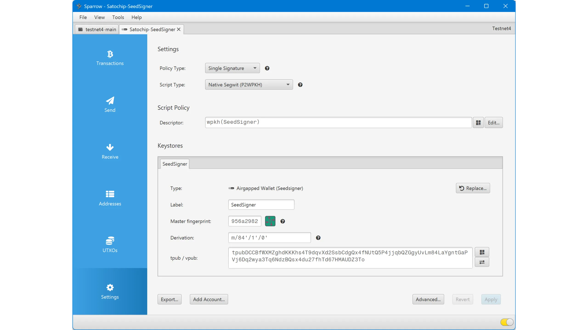

将 Satochip 插入连接到计算机的智能卡读写器，然后点击 `Satochip` 旁边的 `Import` 按钮。

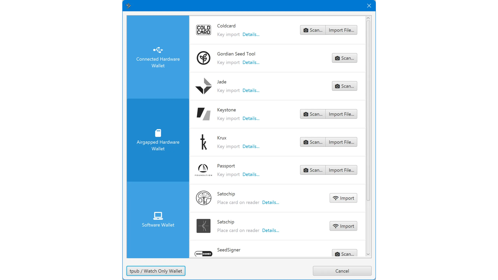

最后，输入智能卡密码以解锁。然后，您就可以访问您的钱包，创建交易并直接使用连接的 Satochip 进行签名。

### 8.2。使用 SeedSigner 恢复您的钱包

另一个更为棘手的情况是：装有种子的 Satochip 无法再访问，例如设备损坏、丢失、被盗，或者忘记了 PIN 码。

如果 Satochip 已被盗或遗失，我们强烈建议在重新获得资金访问权限之后，立即将比特币转移到一个全新的钱包，并使用不同的种子生成。这样可以确保潜在的攻击者永远无法访问这些聪（比特币）。

- 在 `Seeds > Enter 12-word seed` 选单中手动输入助记词。

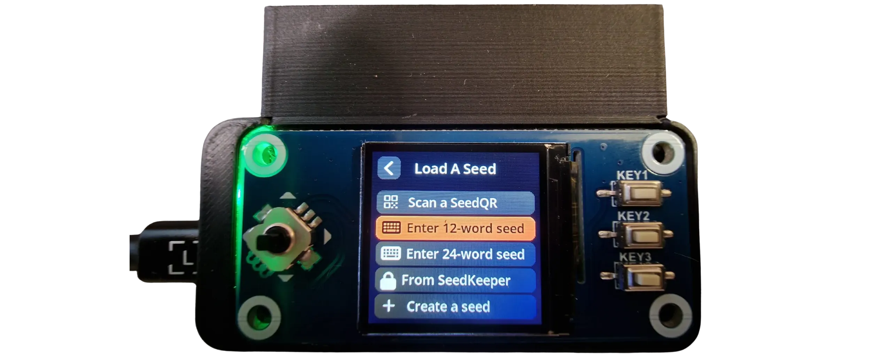

- 点击主页上的 `Scan` 按钮，扫描您的 *SeedQR*。

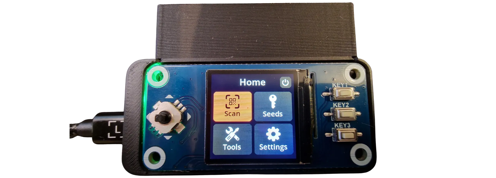

- 或者通过 `Seeds > From SeedKeeper` 选单从种子管理器加载种子（这是我在本教程中使用的方法）。您只需输入 Seedkeeper PIN 并选择要在 SeedSigner 上用作种子的密钥。

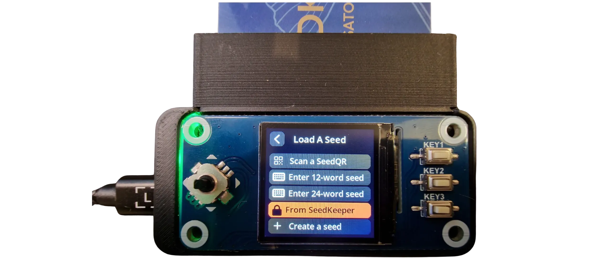

一旦种子被加载到 SeedSigner 中，无论您使用哪种方法，您都可以签署一个或多个扫描交易，将您的比特币转移到一个新的、未受损的钱包中。为了了解如何执行此操作，请参阅以下教程的第 7.2 部分：

https://planb.academy/tutorials/wallet/hardware/seedsigner-2b274bff-6fc8-407a-92d7-f6ec4d1fadfb

现在您知道如何使用 Satochip 与 SeedSigner 结合安全地管理您的比特币钱包。

如果这种方案让人觉得可靠，也欢迎支持我们的以下项目：

- 直接[在 Satochip 网站上](https://satochip.io/shop/)购买设备；
- - 向 [SeedSigner 项目](https://seedsigner.com/donate/)捐款；；
- 通过订阅[Crypto Guide 的 YouTube 频道](https://www.youtube.com/@CryptoGuide/)，该频道由维护托管修改版固件的 GitHub 代码库的人员管理。
