SeedSigner 是一款开源的比特币钱包硬件，任何人都可以使用廉价的通用电子元件自行搭建。与 Ledger、Coldcard 或 Trezor 等商业产品不同，它并非由公司生产的现成设备，而是一个社区项目，允许任何人创建自己的设备，并掌控每一个步骤。


SeedSigner 的设计理念是 100% 的“物理隔离”：它从不连接互联网，没有 Wi-Fi 或蓝牙（以 Raspberry Pi Zero v1.3 为例），也从不连接电脑进行数据交换。通信完全通过二维码交换系统进行。具体来说，您的钱包管理软件（例如 Sparrow Wallet）会以二维码的形式显示待签名的交易；您使用 SeedSigner 的摄像头扫描这些二维码，然后设备会使用临时存储在其 RAM 中的私钥对交易进行签名。最后，它会生成包含已签名交易的二维码，您使用软件扫描这些二维码即可将其发送到比特币网络。


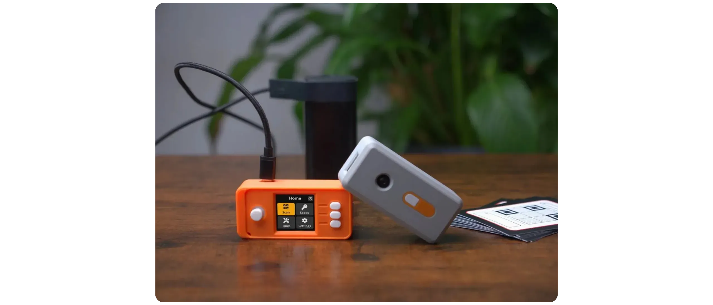


SeedSigner 也是***无状态***的。换句话说，与其他硬件钱包不同，它不会永久保存您的助记词或私钥。每次重启后，除非您将设备配置为将设置保存到 microSD 卡上，否则其内存都会完全清空。因此，您每次使用时都必须重新输入助记词。最便捷的方法是将其存储为二维码，并在启动时使用 SeedSigner 的摄像头扫描。这种操作模式大大降低了攻击面：即使窃贼偷走了您的设备，也无法获取任何信息，因为默认情况下设备始终为空。


另一种存储助记词并将其与 SeedSigner 配合使用的方法是使用 *SeedKeeper* 智能卡和兼容的读卡器。这样，您就可以使用一个非常可靠的*安全元件*来存储助记词，同时使用 SeedSigner 屏幕来签名交易。但这种特定的配置将在另一篇专门的教程中讲解。这里，我们将重点介绍 SeedSigner 的基本用法：


https://planb.academy/tutorials/wallet/hardware/seedkeeper-seedsigner-45cca4c4-1f22-46bb-87ae-9cddb68aa579

SeedSigner 项目在比特币生态系统中占据着重要的地位，因为它为世界各地的人们提供了利用高级安全措施保护比特币的机会。它的主要优势在于其易用性：所需的硬件售价不到 50 美元。此外，它还使居住在受限国家/地区的人们能够使用易于获取且受监管限制较少的标准计算机组件来构建自己的硬件钱包。

即使不考虑这些特定情况，SeedSigner 也可能是一个不错的选择：它是开源的，无状态且物理隔离，并能减少与钱包硬件供应链相关的攻击风险。

## 1.所需设备

要构建您的 SeedSigner，您需要以下组件：
- Raspberry Pi Zero
    - 建议使用 1.3 版本，因为它没有 Wi-Fi 和蓝牙功能，可确保完全隔离。
- W 和 v2 版本也兼容，但它们内置了 Wi-Fi/蓝牙芯片。因此，建议您通过移除模块来物理禁用它。操作相对简单，但需要一定的技巧（Zero W 可以使用精细钳子，而 v2 则需要使用热熔笔来移除覆盖模块的金属板）。本教程不会详细介绍具体步骤，但您可以在以下文档中找到所有说明：*[通过硬件禁用 Wi-Fi/蓝牙](https://github.com/DesobedienteTecnologico/rpi_disable_wifi_and_bt_by_hardware)*。
 - 请注意：部分 Raspberry Pi Zero 未预焊 GPIO 引脚。您可以直接购买带集成引脚的版本（最简单的方案），或者单独购买引脚并自行焊接（比较复杂的方案）。
- 别忘了配备一个 micro-USB 电源适配器。


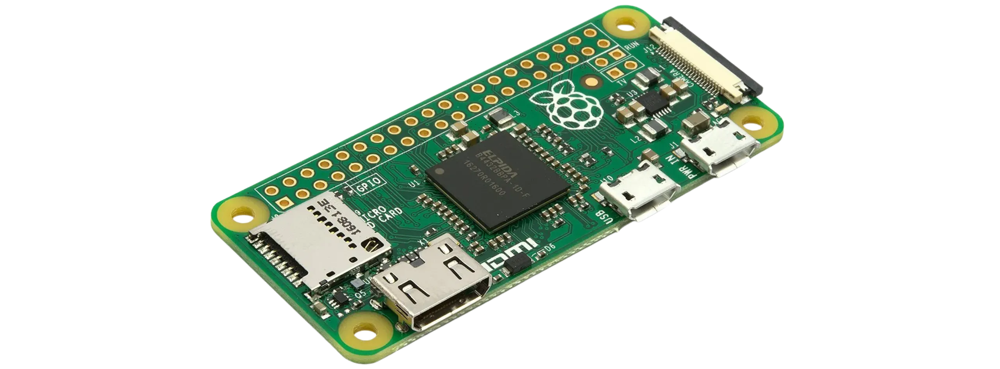


- Waveshare 1.3 英寸屏幕 (240×240 像素)**（法语）
    - 务必选择此型号：虽然也有其他类似屏幕，但分辨率不同。如果分辨率不是 240×240 像素，则显示效果将无法使用。
    - 屏幕配有三个按钮和一个迷您摇杆，用于用户界面。


- 与 **Raspberry Pi Zero** 兼容的摄像头
    - 选项 1：标准摄像头，带宽金色滤镜（请检查与您的外壳是否兼容）。
    - 选项 2：更小巧的 “*Zero*” 摄像头，专为 Pi Zero 设计。


- **MicroSD** 卡
    - 推荐容量：4 至 32 GB。


- 外壳（可选，但推荐使用）
    - 保护设备并使其易于使用。
    - 最受欢迎的模型是 "*Orange Pill Case*"，其[开源 STL 文件可用于 3D 打印](https://github.com/SeedSigner/seedsigner/tree/dev/enclosureshttps://github.com/SeedSigner/seedsigner/tree/dev/enclosures)。
    - 您也可以从[与该项目相关的独立经销商](https://seedsigner.com/hardware/)购买外壳。


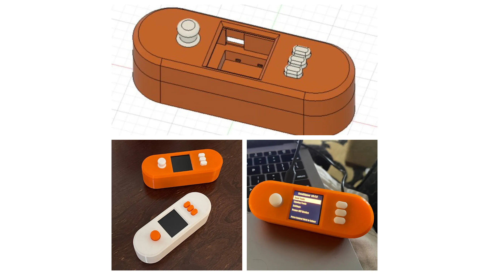


您可以单独购买这些组件，或者为了更方便起见，选择包含所有必要硬件的现成套装。我个人是在[这个法国网站](https://bitcoinbazar.fr/)上订购的，不过您也可以在[SeedSigner 项目硬件页面](https://seedsigner.com/hardware/)上找到世界各地供应商的列表。如果您想单独购买组件，可以在各大电商平台或专卖店找到。


## 2. 软件准备

硬件准备就绪后，您需要将 SeedSigner 系统安装到 microSD 卡上。为此，请打开您的电脑，插入用于 SeedSigner 的 microSD 卡。


### 2.1. 下载

访问[项目的官方 GitHub 仓库](https://github.com/SeedSigner/seedsigner/releases)。下载最新版本的软件：

- 与您的 Pi 型号相对应的 `.img` 映像。
- `sha256.txt` 文件。
- `sha256.txt.sig` 文件。

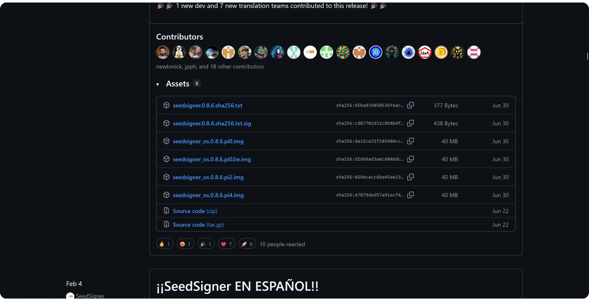

在开始安装之前，让我们先检查一下软件。


### 2.2 在 Linux 和 macOS 下进行验证


首先，从 Keybase 直接导入 SeedSigner 项目的官方公钥：


```
gpg --fetch-keys https://keybase.io/seedsigner/pgp_keys.asc
```


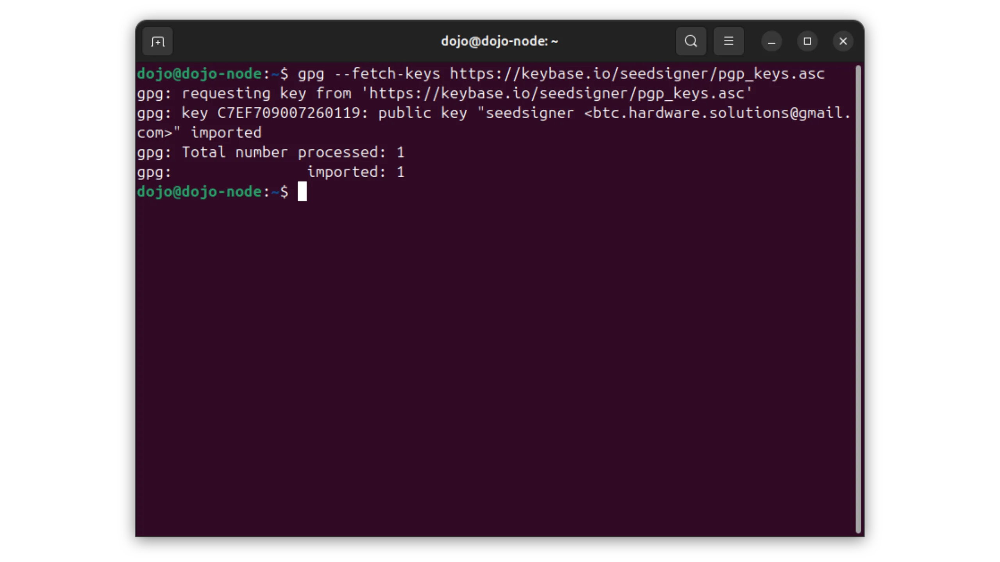


终端应该会提示您密钥已导入或更新。接下来，对签名文件运行验证命令（请记住根据您的版本修改命令，此处为 `0.8.6.`）：


```
gpg --verify seedsigner.0.8.6.sha256.txt.sig
```


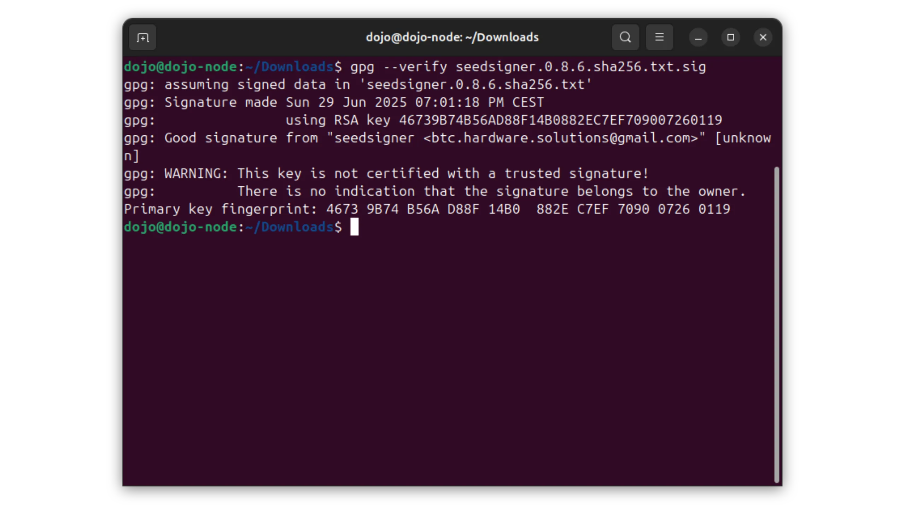


如果一切正常，输出应显示 “good signature”。这意味着文件 `.sha256.txt` 已使用您刚刚导入的密钥进行签名，并且签名有效。忽略警告信息 `WARNING: This key is not certified with a trusted signature`（“警告：此密钥未通过可信签名认证”）。这是正常现象，因为现在需要您自行检查所使用的密钥是否属于 SeedSigner 项目。


为此，请将显示的指纹最后 16 个字符与[Keybase.io/SeedSigner](https://keybase.io/seedsigner)、其[官方推特账号](https://twitter.com/SeedSigner/status/1530555252373704707)或[SeedSigner.com](https://seedsigner.com/keybase.txt)上发布的文件中的字符进行比较。如果这些标识符完全匹配，就可以确定密钥确实是项目的。如有疑问，请立即停止，并向 SeedSigner 社区（Telegram、X、GitHub等）寻求帮助。


验证密钥后，就可以检查下载的映像是否被修改过（切记根据版本修改命令，此处为 `0.8.6.`）：


```
shasum -a 256 --ignore-missing --check seedsigner.0.8.6.sha256.txt
```


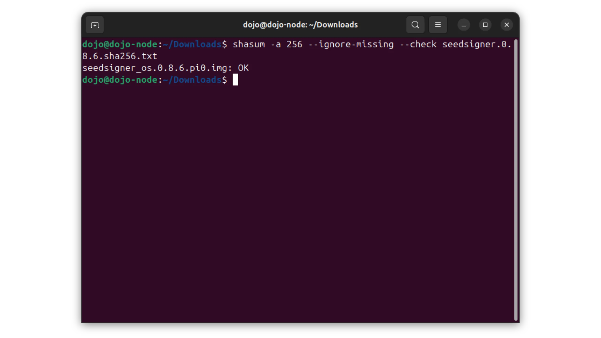


- 在 Linux 下，该命令是内置的。
- 警告：`Big Sur (11)` 之前的 macOS 版本不能识别 `--ignore-missing` 选项。在这种情况下，请删除该选项并忽略有关丢失文件的警告。


预期结果是在 `.img` 文件旁边显示 `OK`。这就确认了上传的图像与项目发布的图像完全相同，没有被修改过。


### 2.3 Windows 上的验证


在 Windows 系统中，操作步骤类似，但命令不同。首先安装 [Gpg4win](https://www.gpg4win.org/)，然后打开 *Kleopatra* 应用程序。从 URL Keybase 导入 SeedSigner 项目的公钥：


```
https://keybase.io/seedsigner/pgp_keys.asc
```


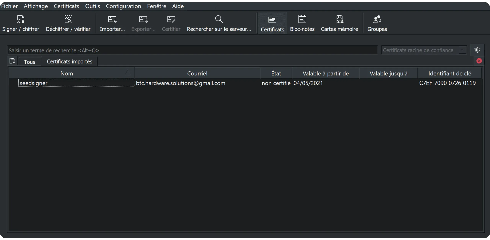


接下来，在下载文件所在文件夹中打开 PowerShell（`Shift` + 右键单击 > `Open PowerShell here`）。运行以下命令检查清单签名（记住根据版本修改命令，此处为 `0.8.6.`）：


```
gpg --verify seedsigner.0.8.6.sha256.txt.sig
```


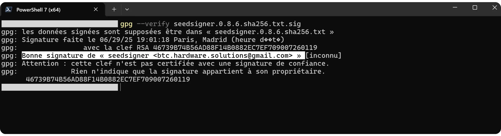


如果一切正常，输出结果应为 `Good signature`。这意味着文件 `.sha256.txt` 已被您刚刚导入的密钥签名，且签名有效。忽略警告信息 `WARNING: This key is not certified with a trusted signature`：这是正常的，因为现在要由您来检查所使用的密钥是否属于 SeedSigner 项目。


为此，请将显示的指纹最后 16 个字符与[Keybase.io/SeedSigner](https://keybase.io/seedsigner)、其[官方推特账号](https://twitter.com/SeedSigner/status/1530555252373704707)或[SeedSigner.com](https://seedsigner.com/keybase.txt)上发布的文件中的字符进行比较。如果这些标识符完全匹配，就可以确定密钥确实是项目的。如有疑问，请立即停止，并向 SeedSigner 社区（Telegram、X、GitHub等）寻求帮助。


验证密钥后，需要检查映像文件是否已损坏。为此，请在 PowerShell 中使用以下命令 ：


```
CertUtil -hashfile seedsigner_os.0.8.6.[your-Pi-model].img SHA256
```


以 Raspberry Pi Zero 2 为例（请根据您的版本修改命令，此处为 `0.8.6.`）：


```
CertUtil -hashfile seedsigner_os.0.8.6.pi02w.img SHA256
```


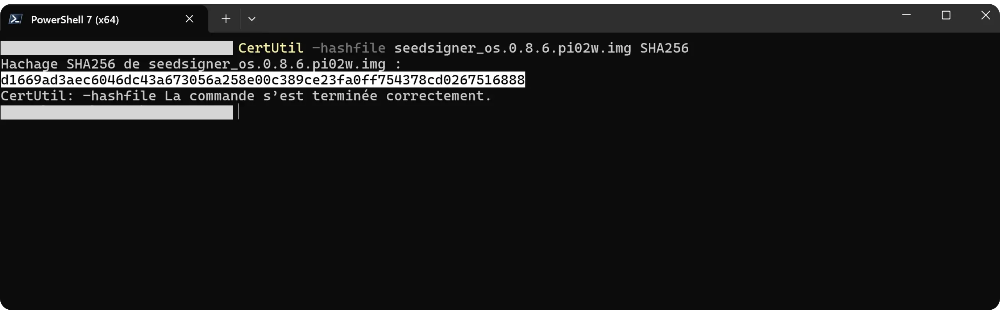


然后，PowerShell 会计算图像文件的 SHA256 哈希值。将此散列值与 `seedsigner.0.8.6.sha256.txt` 中的相应值进行比较。


- 如果两个数字完全相同，则检查成功，您可以继续。
- 如果两者不同，则说明文件已损坏或损坏。请不要使用它，重新开始下载。


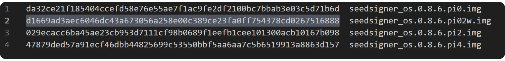


验证成功可确保您的 `.img` 文件是真实的（由 SeedSigner 签名）且未被篡改（未修改）。这样您就可以安全地进入下一步骤。


### 2.4.烧录镜像

如果您还没有安装，Balena Etcher 软件，请先下载。然后：

- 将 microSD 卡插入电脑。
- 打开 Etcher。
- 选择已下载并验证好的 `.img` 文件。
- 选择 microSD 卡作为目标。
- 点击 `Flash!` 开始烧录。


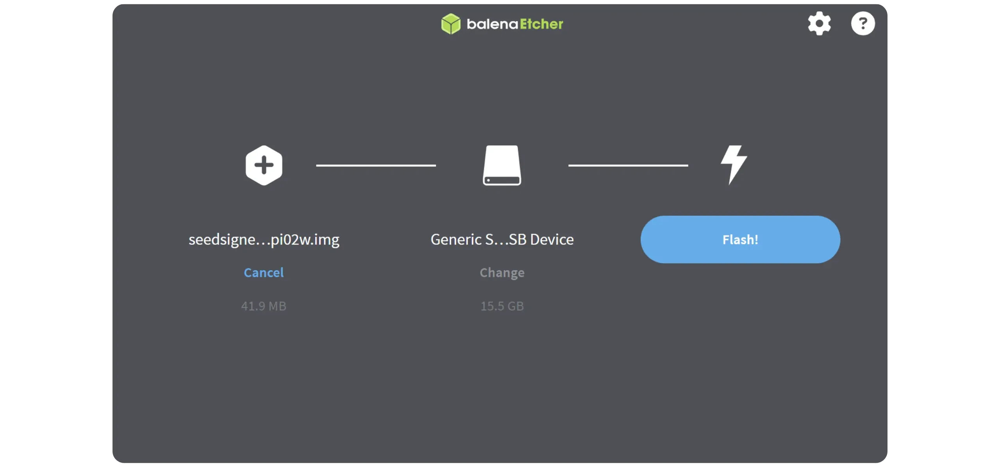


请等待处理完成：您的 microSD 卡已准备就绪。现在可以开始组装了！


## 3.SeedSigner 组装

microSD 卡准备好并烧录到 SeedSigner 软件后，即可进行最终组装。请务必小心谨慎，因为某些部件比较脆弱（尤其是底布、摄像头和 GPIO 引脚）。


### 3.1 准备外壳

首先，打开外壳。检查内部是否干净，以及是否有残留的 3D 打印塑料阻碍内部紧固件。注意以下部分的位置：

- 摄像头位置（前端的小圆孔）。
- 屏幕的开口。
- Raspberry Pi Zero 的微型 USB 端口和 microSD 插槽的开口。


### 3.2 摄像头安装


寻找 Raspberry Pi Zero 上的摄像头带状连接器：它是电路板侧面的一条黑色细带，稍微抬起即可打开。小心抬起，不要用力：只需倾斜几毫米即可。


插入摄像头盖。棕色/铜色部分应朝下。确保其牢固地插入连接器，不要扭动。


合上黑色横杆以锁定盖板（您会听到轻微的咔嗒声）。轻轻检查盖板是否固定到位且不会移动。


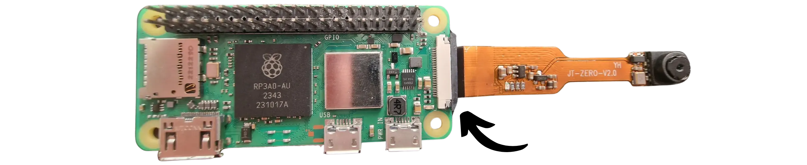

然后将摄像头模块放入外壳上的相应孔中。根据型号的不同，它可能直接卡入到位，或者需要一小段胶条将其固定。镜头必须完全对齐，朝外。


### 3.3 安装 Raspberry Pi Zero

如果您使用外壳，请将 Raspberry Pi Zero 主板插入其中。小心地将端口与提供的开口对齐。


然后将 Waveshare 显示屏放在 Raspberry Pi Zero 的顶部。Pi 的 GPIO 引脚应与显示屏的母头连接器完美对齐。缓慢地将显示屏按压到引脚上，两侧均匀施力，避免弯曲引脚。


如果您有外壳，请添加前面板和摇杆以完成组装。

最后，将已刷写软件的 microSD 卡插入 Raspberry Pi Zero 的边缘插槽。确保其卡入到位。

### 3.4 首次启动

将 micro-USB 电源线连接到专用端口。等待约一分钟。屏幕上应出现 SeedSigner 徽标，然后显示主页面。


首先，前往 `Settings > I/O test` 选单，检查各个组件是否正常工作。


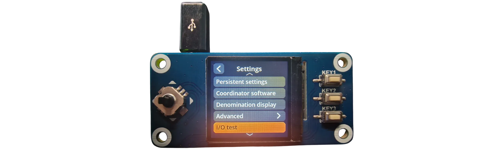


测试按住所有按钮，确保它们响应正常。然后点击“KEY1”按钮，检查摄像头是否正常工作。这将拍摄一张照片。


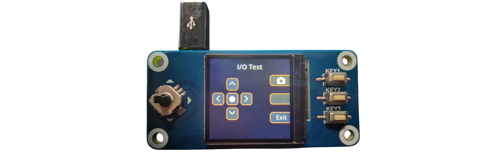


### 3.5 摄像头调整


根据您安装 SeedSigner 的方式，摄像头可能会显示倒置图像。要纠正此问题，请前往`Settings > Advanced > Camera rotation`，如有必要，选择 180° 旋转。


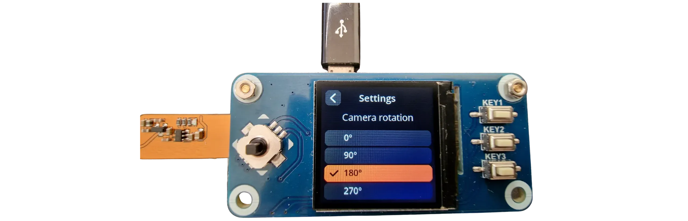


如果您改变了摄像头的方向或希望以后再更改其他设置（如界面语言），您需要在 microSD 上启用持久设置。否则，由于 Raspberry Pi Zero 没有持久内存，每次重启都会恢复默认设置。


为此，请打开 `Settings > Persistent settings` 选单，然后选择 `Enabled`。


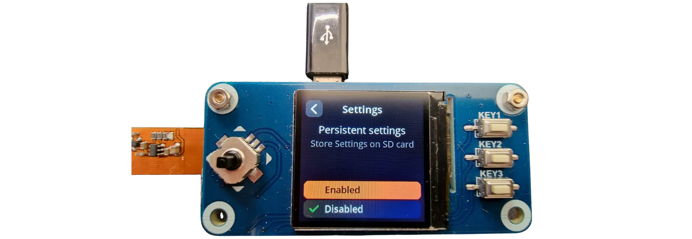


如果一切正常，您的 SeedSigner 就可以使用了！


## 4.SeedSigner 设置


创建比特币钱包之前，我们先来配置 SeedSigner。由于它运行在没有持久内存的 Raspberry Pi Zero 上，除非您将设置保存到 microSD 卡上，否则设置不会自动保存。因此，请确保您已启用此选项，否则这些设置将在重启后丢失（参见步骤 3.5）。


### 4.1 参数选单访问


启动 SeedSigner，等待主屏幕出现。使用操纵杆前往 `Settings` 选项，然后按中央按钮进行验证。现在进入主设置选单。


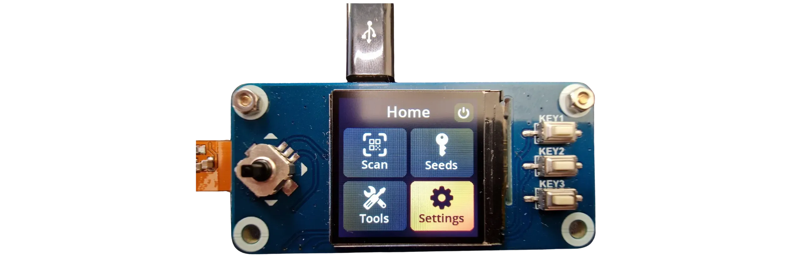


### 4.2 选择钱包管理软件


然后进入 `Coordinator software` 选单。


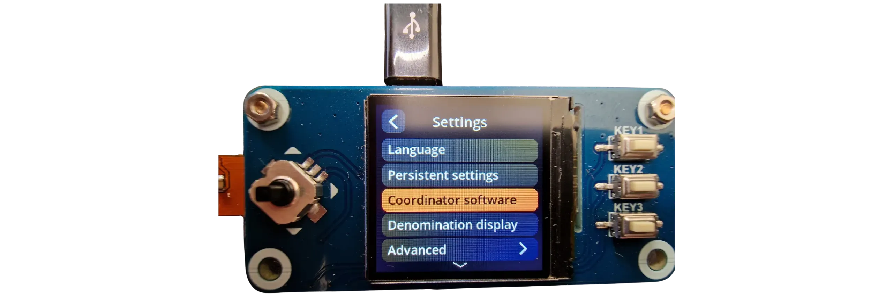


`Coordinator` 指钱包管理软件，SeedSigner 将通过二维码与之通信。该软件安装在您的电脑或智能手机上。它将使您能够管理您的比特币，但无法访问您的私人密钥。SeedSigner 仍然是唯一能够对您的交易进行签名的设备。


当前固件版本支持多个程序：Sparrow、Specter、BlueWallet、Nunchuk 和 Keeper。我将使用**Sparrow Wallet**，我特别推荐它，因为它操作简单，功能丰富。


如果不知道如何安装，可以参考本教程：


https://planb.academy/tutorials/wallet/desktop/sparrow-c674e2ac-d46f-4c82-92a7-7d1b0e262f5d

只需从选单中选择您需要的软件即可。

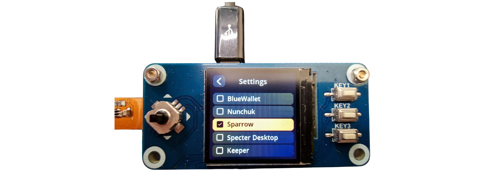


### 4.3 单位和金额显示


在 `Denomination Display` 选单中，您可以选择显示金额的单位：


- `BTC`
- `mBTC`（毫比特币，或 0.001 BTC）
- `gW-15`（比特币，或 1/100,000,000 BTC）


对于小额交易，**聪**单位通常最实用。


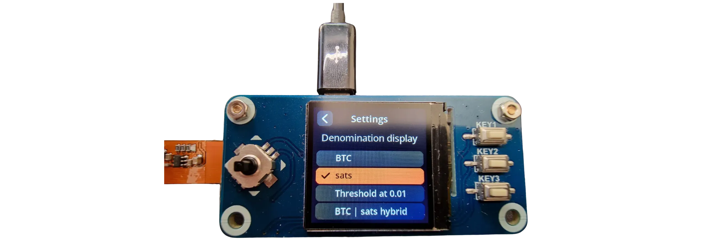


### 4.4 高级设置

现在前往 `Advanced` 选单。您会在这里找到几个实用选项：

- `gW-17 network`：仅当您希望在测试网上使用 SeedSigner 时才需要修改此项。

- `qR code density`：调整每个二维码包含的信息量。您可以保留默认值，除非您觉得扫描时难以辨认。

- `Xpub export`：启用或禁用通过二维码将您的扩展公钥（`xpub`、`ypub`、`zpub`）导出到钱包管理软件（我们稍后会用到此功能，所以现在请保持启用状态）。

- `Script types`：定义允许锁定您的比特币的脚本类型。您无需修改​​此参数，因为脚本类型将直接设置为 Sparrow。此处仅涉及 SeedSigner 有权操作的脚本。

### 4.5 语言选择

最后，在 `Language` 选单中，您可以根据自己的喜好更改界面语言。

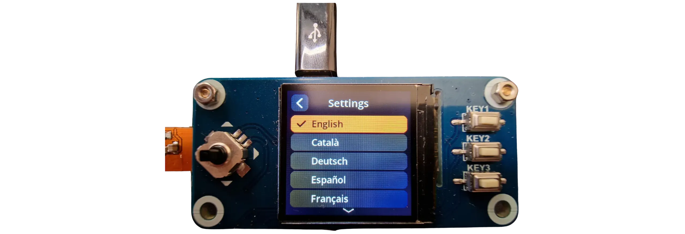

## 5.创建和保存种子/助记词

种子（或助记词组）是比特币钱包的基础。它用于生成您的私钥和地址，并为您提供资金访问权限。SeedSigner 提供了几种生成助记词的方法，我们将在本节中一一介绍。

在我们开始之前，有几项重要提醒：

- 此助记词可让您完全无限制地访问您的所有比特币。**任何拥有此助记词的人都可以窃取您的资金，即使他们无法实际接触到您的 SeedSigner；

- 通常，12 个单词的助记词用于在钱包硬件丢失或被盗时恢复钱包。但由于 SeedSigner 是一个*无状态*设备，它永远不会记录您的种子。因此，您的物理备份不仅仅是备份副本，而是**使用钱包的唯一途径**。如果您丢失了这些备份，您的比特币将永久丢失。因此，请务必在多种介质上安全备份；

- 如果您是新手，我强烈建议您阅读这篇教程，以详细了解管理助记词所涉及的风险：


https://planb.academy/tutorials/wallet/backup/backup-mnemonic-22c0ddfa-fb9f-4e3a-96f9-46e2a7954270

### 5.1 访问种子创建工具


从 SeedSigner 主屏幕进入 `Tools` 选单。


现在，您将生成您的种子。种子只是一个大的随机数。生成的随机数越多，安全性就越高。SeedSigner 提供了两种方法：


- "camera"：种子由照片的视觉噪声生成。拍摄一张随机环境（物体、风景、人脸等）的照片，利用其像素变化生成熵。这种方法速度很快，但无法复现。
- "dice rolls"：通过掷骰子生成所需的熵。这种方法比较耗时，但可复现，因此也更易于验证。如果您选择这种方法，请遵循本教程中的建议（无需计算校验和，SeedSigner 会自动处理）：


https://planb.academy/tutorials/wallet/backup/generate-mnemonic-phrase-47507d90-e6af-4cac-b01b-01a14d7a8228

### 5.2 使用照片创建种子

如果您选择照片方法，请点击 `new seed`（带有相机图标），拍照并确认。然后选择助记词长度（12 或 24 个单词），该长度将显示在屏幕上供您保存。后续步骤与 5.3 部分相同。

### 5.3 使用骰子创建种子

在本教程中，我们使用**掷骰子**方法。点击 `New seed`（带有骰子图标）。

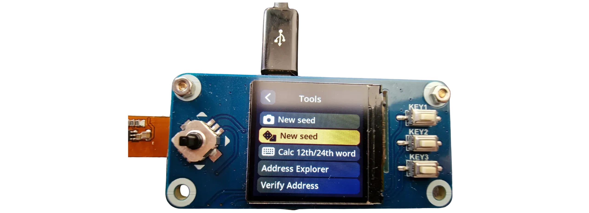

然后选择助记词的长度。12 个单词已经提供了足够的安全性，所以我建议选择这个长度。

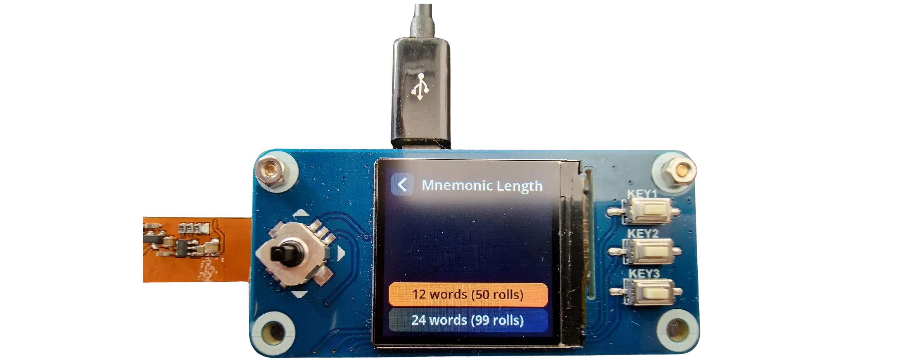


掷骰子并使用光标输入结果数字。按中间的按钮来验证每次输入。如果出现错误，您可以返回。使用多个不同的骰子，以减少任何不平衡骰子的影响。确保在操作过程中没有人在监视您。


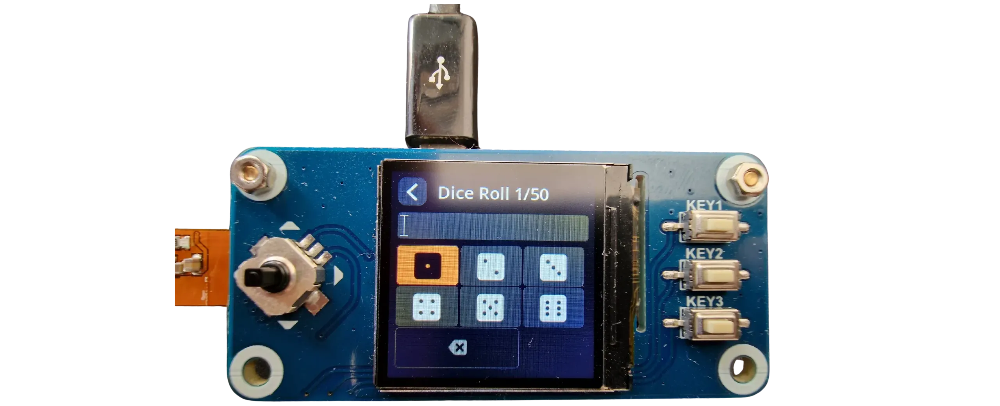


输入 50 个数字后，SeedSigner 就会生成您的助记词。 **如果您刚开始学习，请仔细阅读本教程中的说明：**。


https://planb.academy/tutorials/wallet/backup/backup-mnemonic-22c0ddfa-fb9f-4e3a-96f9-46e2a7954270

### 5.4 显示和保存种子


在合适的实物支撑物（纸张或金属）上认真写下助记词的单词。


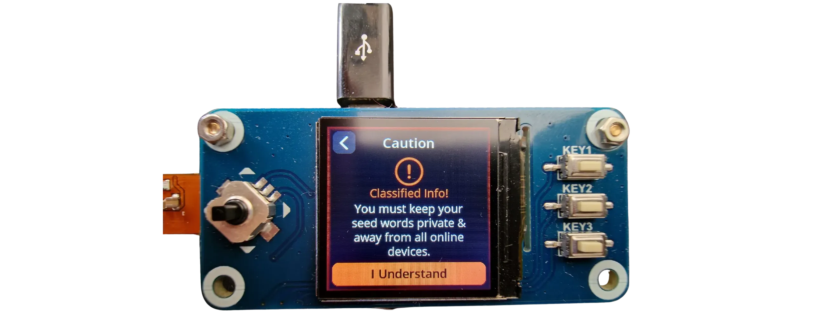


### 5.5 检查备份


为避免任何备份错误，SeedSigner 会要求您验证备份。单击 `Verify`。


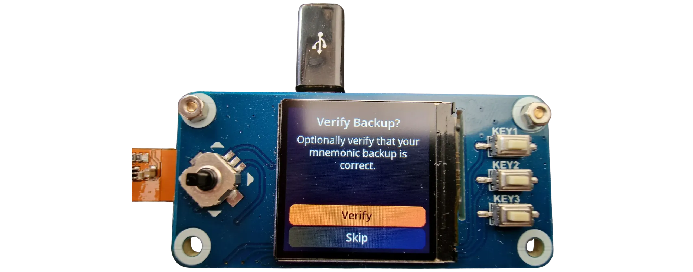


然后根据单词在助记词中的顺序输入所需的单词。例如，在这里我必须选择句子中的第三个单词。


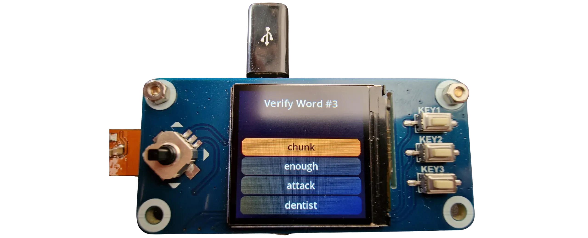


如出错，SeedSigner 会通知您，您必须重新开始，并确保记下给您的助记词。这一验证步骤可确保您的备份正确完整。验证完成后，屏幕将显示 `Backup Verified`。


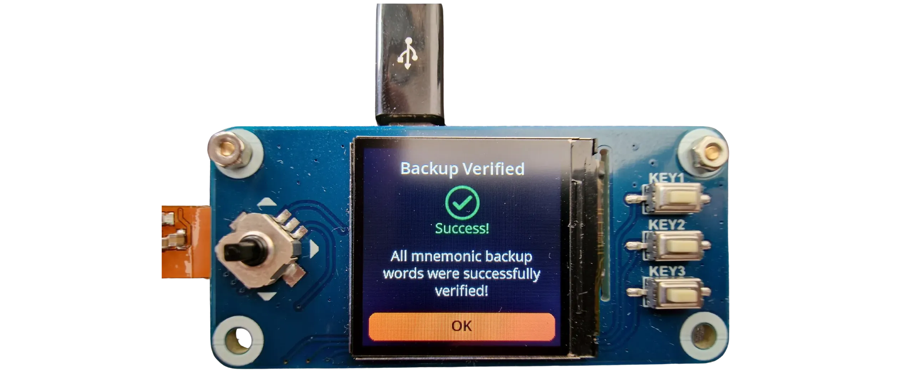


要进行更完整的修复测试，请参考本教程 ：


https://planb.academy/tutorials/wallet/backup/recovery-test-5a75db51-a6a1-4338-a02a-164a8d91b895

### 5.6 理解 "无状态设备" 概念

SeedSigner 是一款没有永久内存的设备。这意味着您的助记词永远不会存储在设备内部（例如，与 Ledger、Trezor 或 Coldcard 等设备不同）。一旦断电，助记词就会从其 RAM 中彻底消失。重启后，SeedSigner 将恢复到空白状态：您需要再次输入助记词，以便它能够签署您的交易。

这提供了至关重要的保护。与其他硬件钱包不同，SeedSigner 基于 Raspberry Pi Zero，它没有任何物理保护，包括安全元件 (SE)。但由于没有存储任何敏感数据，即使设备物理损坏，攻击者也无法提取您的私钥或花费您的比特币。

另一方面，这种架构也意味着额外的责任：如果没有备份，您的资金将永久丢失。因此，我建议您进行**双重备份**。您已经拥有助记词：这是您的主要长期备份，请将其保存在……安全的地方。现在我们要将这个助记词以**二维码**的形式复制一份。

每次使用 SeedSigner 时，您都需要用设备的摄像头扫描这个二维码，这样设备会在您签名交易时将您的助记词临时加载到内存中。这个用于日常使用的备份也必须妥善保管：任何持有此二维码的人都可以完全访问您的比特币。

我还建议您将二维码和助记词分别存储在两个不同的地方，以避免在发生索赔时丢失所有数据。

最后，更高级、更安全的替代方案是将 SeedSigner 与 **SeedKeeper** 配合使用，SeedKeeper 会将助记词存储在一个安全的存储元件中。为了了解更多信息，请查看此处的教程：https://planb.academy/tutorials/wallet/hardware/seedkeeper-seedsigner-45cca4c4-1f22-46bb-87ae-9cddb68aa579

### 5.7 写入主密钥指纹

验证完成后，SeedSigner 会显示您钱包主密钥的指纹。此指纹用于识别您的钱包，并确保您将来使用正确的恢复助记词。它不会泄露任何关于您私钥的信息，因此您可以将其安全地存储在数字介质上。只需确保您保留一份可访问的副本，并且永远不要丢失它。


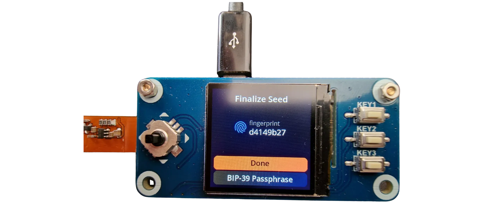


您也可以在此阶段添加**BIP39 Passphrase（密语）**来增强钱包的安全性。根据您的备份策略，此选项可能值得考虑，但也存在风险：如果您丢失了密语，您将永久失去对您的比特币的访问权限。


https://planb.academy/tutorials/wallet/backup/seedsigner-passphrase-7a61f64d-aa03-4bcf-8308-00c89a74cffe

如果您还不熟悉密语概念，我邀请您阅读这篇有关该主题的综合教程：

https://planb.academy/tutorials/wallet/backup/passphrase-a26a0220-806c-44b4-af14-bafdeb1adce7

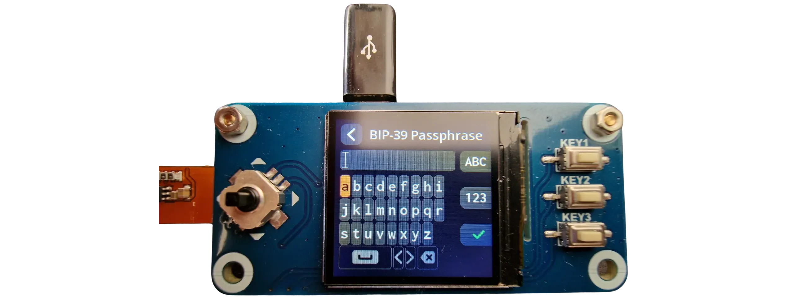


### 5.8 以二维码格式保存助记词 (*SeedQR*)


SeedSigner 可让您将种子转换成纸质二维码，即 *SeedQR*。这种方法可简化钱包的重新加载过程，因为它避免了手动重新输入每个单词的麻烦。


为此，您需要与记忆短语长度相对应的空白纸张或金属二维码。如果您购买了 SeedSigner 的全套软件包，通常会随附模板。如果没有，您可以在此处下载并打印（或手工复制）：


- [12 单词格式](https://github.com/SeedSigner/seedsigner/blob/dev/docs/seed_qr/printable_templates/grid_25x25.pdf)
- [24 单词格式](https://github.com/SeedSigner/seedsigner/blob/dev/docs/seed_qr/printable_templates/grid_29x29.pdf)
- [12 单词紧凑格式](https://github.com/SeedSigner/seedsigner/blob/dev/docs/seed_qr/printable_templates/grid_21x21.pdf)
- [24 单词紧凑格式](https://github.com/SeedSigner/seedsigner/blob/dev/docs/seed_qr/printable_templates/grid_25x25.pdf)


在种子屏幕中，选择 `Backup Seed`。


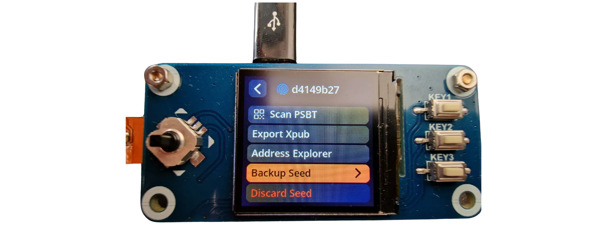


然后选择 `Export as SeedQR`。


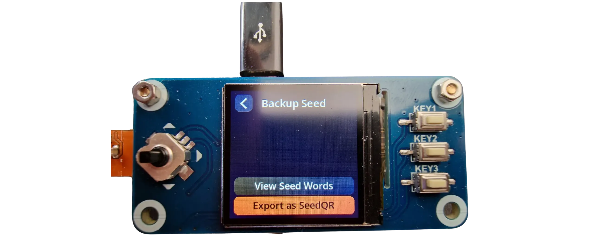


然后根据提供的纸张模板选择所需的格式（普通或紧凑）。


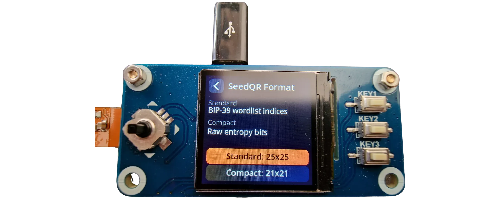


单击 `Begin` 以开始创建 *SeedQR*。然后，SeedSigner 将显示一系列网格（A1、A2、B1 等），每个网格对应代码的一部分。


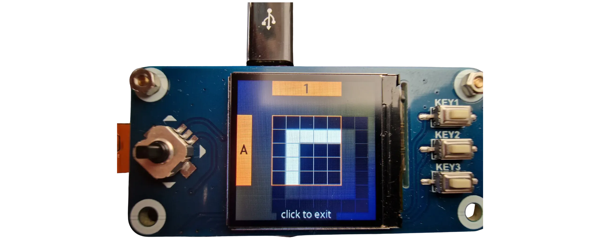


仔细地在保存纸上复制每个黑点，然后使用摇杆移动到下一个区域。请耐心操作：即使是轻微的错位也可能导致二维码无法使用。

一些小提示：

- 先用铅笔绘制，以便修改错误，完成后再使用细黑笔；
- 只需在方格中心画一个点即可，无需完全填充。

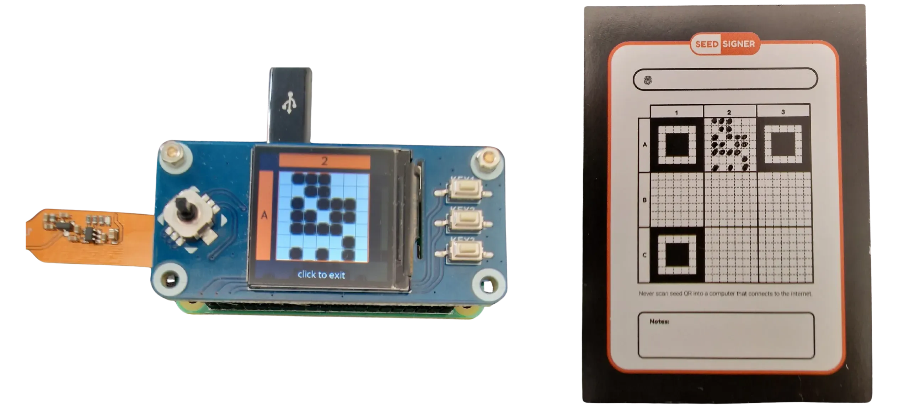

然后点击 `Confirm SeedQR`，扫描您的二维码以检查其是否正常工作。

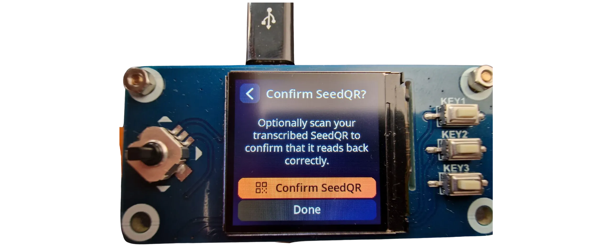

如果显示 `Success` 信息，则您的种子二维码有效：您可以继续下一步。

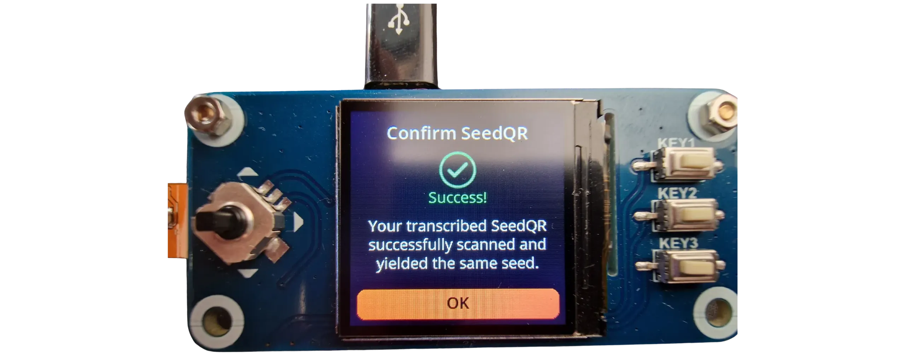

**请像保管助记词一样妥善保管此表格。任何持有此二维码的人都可以重构您的私钥并窃取您的比特币。**

恭喜，您的比特币钱包现已启动并运行！接下来，我们将把其公钥组件导入到**Sparrow Wallet**中，以便轻松管理。

## 6.## 6. 将钱包导入 Sparrow

设置好 SeedSigner 并正确生成和保存助记词后，下一步是将此钱包连接到 Sparrow Wallet 等管理软件。您的助记词将始终保持离线状态，因为只有钱包的公钥部分会传输到 Sparrow。这将使软件能够显示您的地址、交易记录并创建新的交易，但无法实际花费您的比特币。为了消费您的比特币，您的 SeedSigner 必须始终对 Sparrow 生成的交易进行签名。

### 6.1 准备 SeedSigner

插入包含操作系统的 microSD 卡，打开 SeedSigner，然后加载您刚刚从备份二维码创建的种子。在主屏幕上，选择 `扫描`，然后使用 SeedSigner 扫描您的 SeedQR 码。


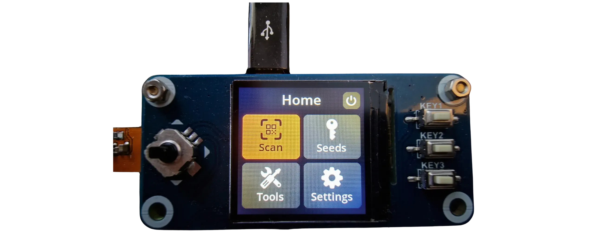


检查主密钥上的指纹是否与钱包上的指纹匹配。如果您使用密语，请在此步骤输入。


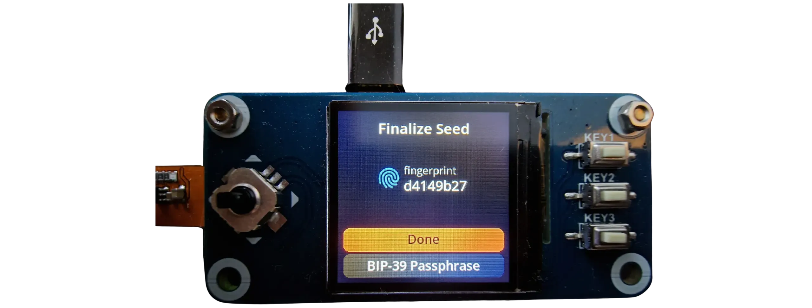

这将带您进入钱包选单，在我的示例中，钱包名为 `d4149b27`。如果您返回主屏幕，请选择 `Seeds`，然后选择与您的钱包对应的指纹。然后点击 `Export Xpub`。

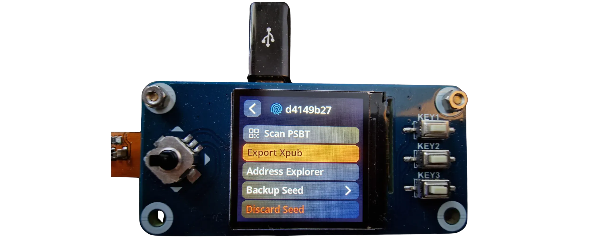


选择钱包类型。在我们的例子中，这是一个单一的钱包：选择 `Single Sig`。


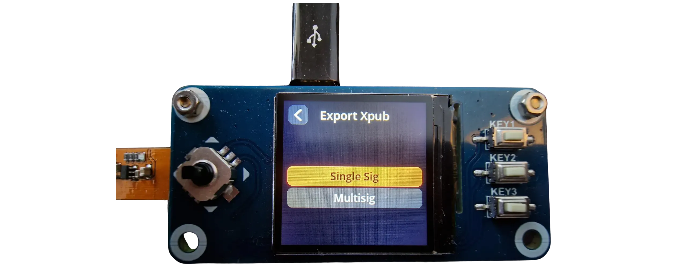


其次是脚本标准的选择。就交易成本而言，最新、最经济的是 `Taproot`。因此，我建议您选择这一标准。


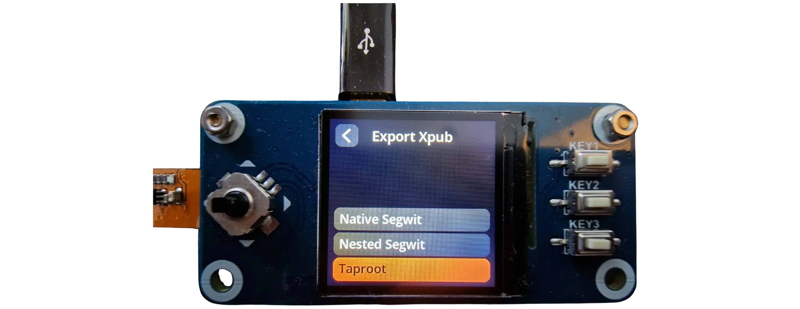


此时会显示一条警告信息。这是正常的：扩展公钥 (`xpub`) 允许您查看所有由您的助记词（在第一个账户中）派生的地址。它不允许您消费资金，但会显示您钱包的结构。如果泄露，这会影响您的隐私，但不会影响您的比特币安全：它允许您查看比特币，但不能消费它们。


点击 `I Understand`，如果对显示的信息满意，再单击 `Export Xpub`。


然后，SeedSigner 会以动态二维码的形式生成您的 xpub，其中包含您在 Sparrow Wallet 中管理钱包所需的所有数据。

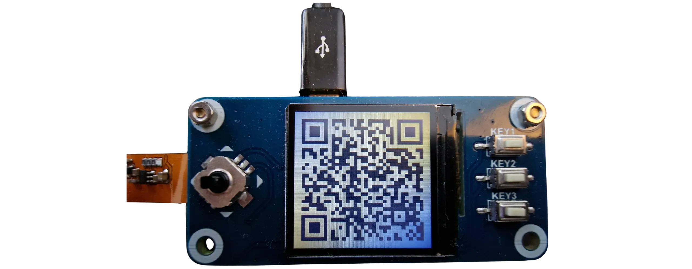


您可以使用操纵杆调节屏幕亮度，以方便扫描二维码。


### 6.2 将新钱包导入 Sparrow Wallet


确保您的计算机上安装了 Sparrow Wallet 软件。如果您不知道如何正确下载、检查和安装，请参阅我们的完整教程：


https://planb.academy/tutorials/wallet/desktop/sparrow-c674e2ac-d46f-4c82-92a7-7d1b0e262f5d

在计算机上打开 Sparrow Wallet，然后在选单栏中单击 `File → Import Wallet`。


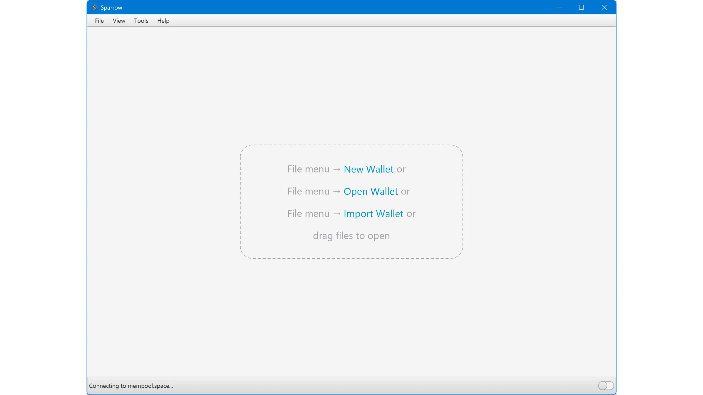


向下滚动到 `SeedSigner`，然后选择 `Scan...`。您的网络摄像头将打开：扫描 SeedSigner 屏幕上显示的动态二维码。


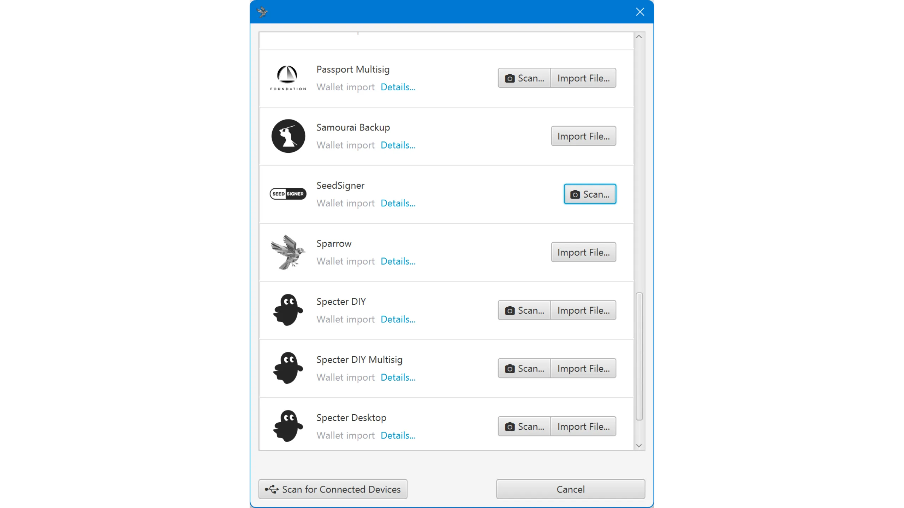

为您的钱包命名，然后点击 `Create Wallet`。Sparrow 会提示您设置密码以锁定对该钱包的本地访问。请选择一个强的密码：它可以保护您在 Sparrow 中的钱包数据（公钥、地址、标签和交易历史记录）的访问。此密码并非用于日后恢复钱包：只需您的助记词（以及可能的密语）即可。

我建议您将此密码保存在密码管理器中，以免丢失。


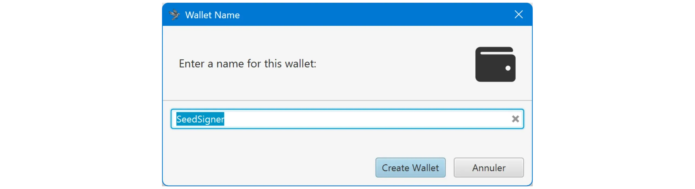


您的密钥库现已成功导入。


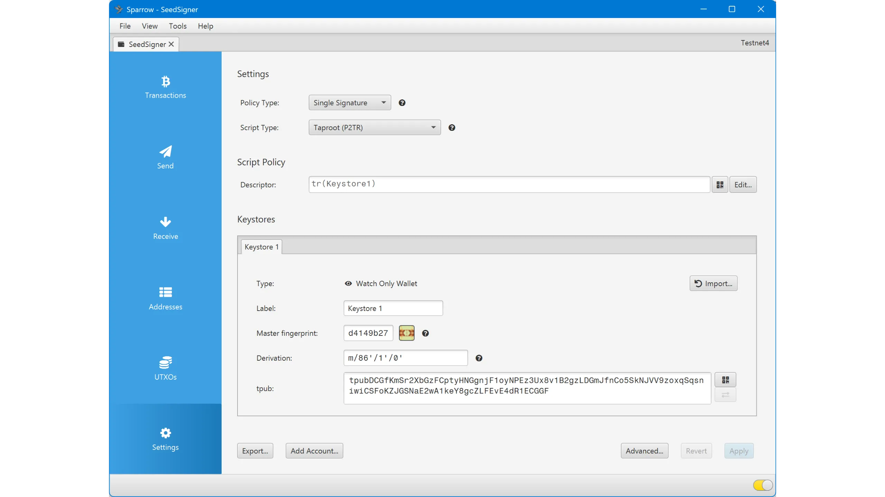


然后检查 Sparrow 中显示的 `Master fingerprint` 是否与之前在 SeedSigner 中记录的指纹一致。

您的 SeedSigner 和 Sparrow Wallet 现已安全关联。 Sparrow 提供完整的管理界面，而 SeedSigner 仍然是唯一能够签署交易的设备。现在，您可以在完全隔离的配置下接收和发送比特币。

## 7.接收和发送比特币

您的 SeedSigner 和 Sparrow Wallet 现已配置完毕，可以协同工作。在本节中，我们将介绍如何使用此配置接收和发送比特币。

### 7.1 接收比特币

#### 7.1.1 生成接收地址


在电脑上打开 Sparrow Wallet，并使用您的密码解锁 SeedSigner 钱包。确保软件已连接到服务器（右下角有缺口）。在侧边栏点击 `Receive`。


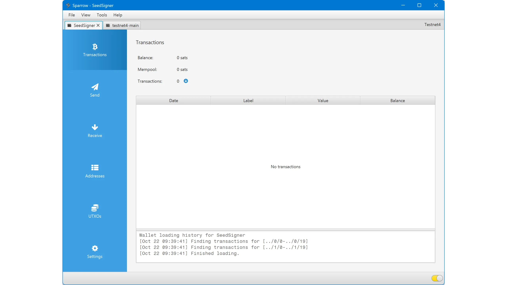


显示新的比特币地址。您将看到 ：


- 文本地址（如果您像我一样使用 P2TR，则地址以 `bc1p...` 为开头），
- 对应的二维码，
- 用于跟踪交易的 `Label`（标签）字段。


我强烈建议您在钱包的每个比特币收据上添加一个标签。这样您就可以很容易地识别每个 UTXO 的来源，并改善您的隐私管理。为了深入了解这一重要主题，您可以查看 Plan ₿ Academy 上的专门培训：


https://planb.academy/courses/65c138b0-4161-4958-bbe3-c12916bc959c

为了添加标签，只需在 `Label` 字段中输入名称，然后确认即可。

例如：


```txt
Label : Sale of the Raspberry Pi Zero
```

您的地址现在已与 Sparrow 所有部分的此标签关联。

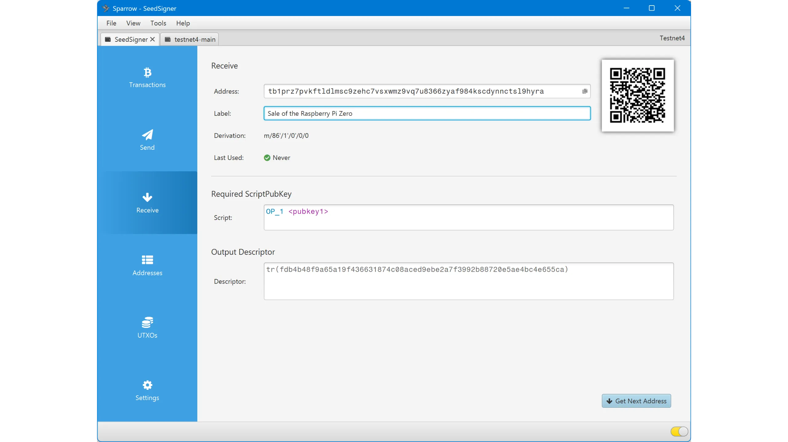


#### 7.1.2 SeedSigner 上的地址验证

在分享您的接收地址之前，务必确认该地址与您的种子地址匹配。此步骤可确保您的 SeedSigner 能够签名与此地址关联的交易。它还可以防止 Sparrow 显示欺诈地址的潜在攻击。请记住，Sparrow 运行在不安全的环境中（您的计算机），其攻击面远大于完全隔离的 SeedSigner。因此，在您使用钱包硬件验证之前，切勿盲目相信 Sparrow 上显示的接收地址。

在 Sparrow 中，点击地址的二维码即可放大：地址将全屏显示。


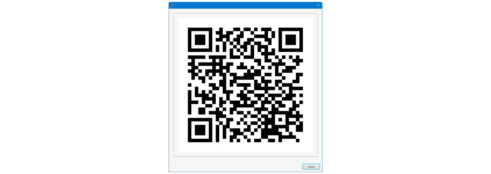


在 SeedSigner 的主选单中选择 `Scan`。扫描电脑屏幕上显示的二维码，然后选择与钱包相对应的种子（在我的例子中，该指纹为 `d4149b27`）。


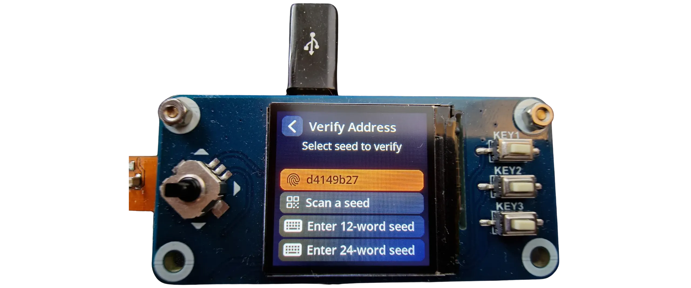


如果扫描到的地址与您的种子生成的地址匹配，SeedSigner 屏幕将显示消息：`Address Verified`（“地址已验证”）。


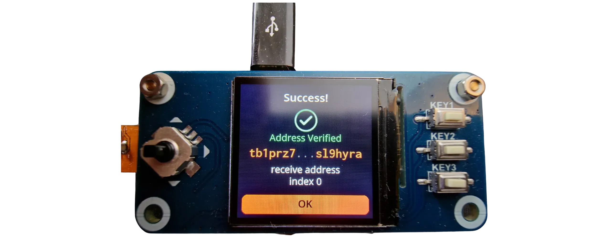

这确认该地址属于您的钱包，您可以放心地从中接收比特币。


#### 7.1.3 接收比特币

现在您可以将此地址（以文本或二维码形式）告知需要向您发送比特币的人员或部门。交易广播到网络后，它将出现在 Sparrow 钱包的 `Transactions` 选项卡中。


### 7.2 发送比特币


使用 SeedSigner 发送比特币分为三个步骤：

- 在 Sparrow 中创建交易 ；
- 在 SeedSigner 上对交易进行签名；
- 通过 Sparrow 完成交易广播。


两台设备之间的所有交换都完全使用二维码完成。

#### 7.2.1 在 Sparrow 中创建交易


在 Sparrow Wallet 中，您可以点击左侧边栏的 `Send` 选项卡。不过，我更喜欢使用 `UTXOs` 选项卡，它允许您练习 "*Coin Control*（币控制）"。这种方法可以让您精确控制所使用的 UTXO，因此您可以控制交易过程中透露的信息。


在 `UTXOs` 选项卡中，选择要使用的比特币，然后点击 `Send Selected`。


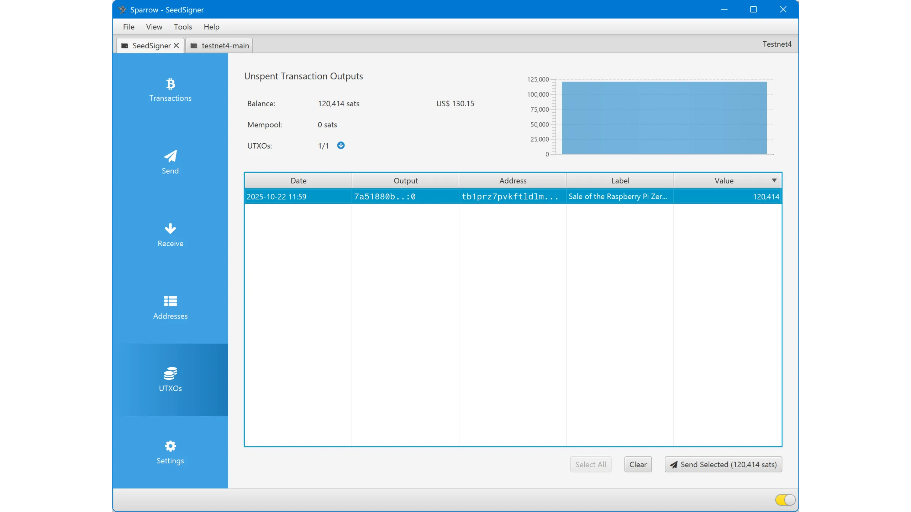


然后填写交易栏：


- 在 `Pay to` 中，粘贴接收者地址或点击相机图标扫描二维码；
- 在 `Label` 中，添加一个标签来跟踪这项支出；
- 在 `Amount` 中，输入要发送的金额；
- 最后，根据当前的市场条件选择费率（可在 [mempool.space](https://mempool.space/) 上获取估算值）。


填写完毕后，请仔细核对信息，然后点击 `Create Transaction >>`。


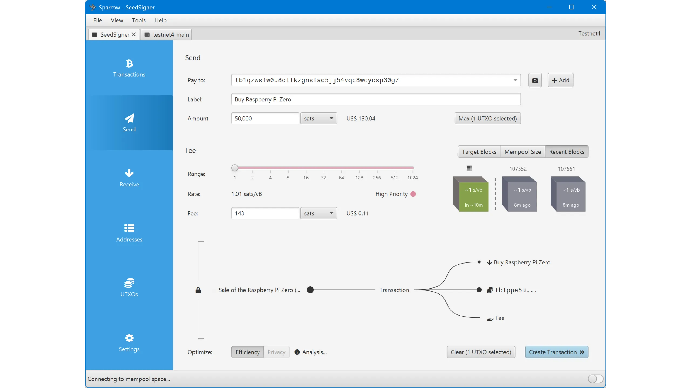


检查交易详情，确保一切正确无误，然后点击 `Finalize Transaction for Signing`。


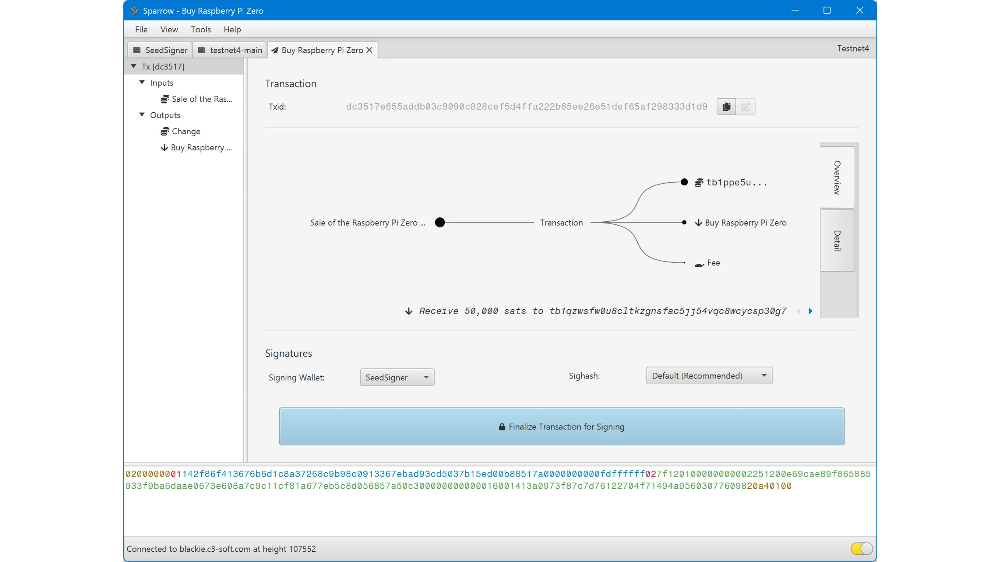


交易现已准备就绪，但尚未签署。要将 [PSBT (*Partially Signed Bitcoin Transaction*)](https://planb.academy/en/resources/glossary/psbt) 显示为二维码，请单击 `Show QR`。


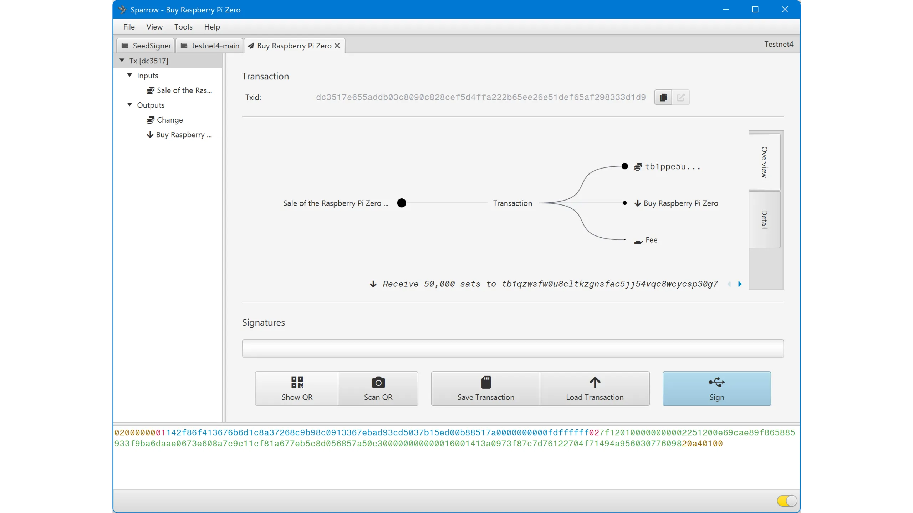


#### 7.2.2 使用 SeedSigner 签名交易

像往常一样，打开 SeedSigner 并扫描 SeedQR 以访问您的钱包。在主屏幕上，选择 `Scan`，然后扫描 Sparrow 上显示的二维码。

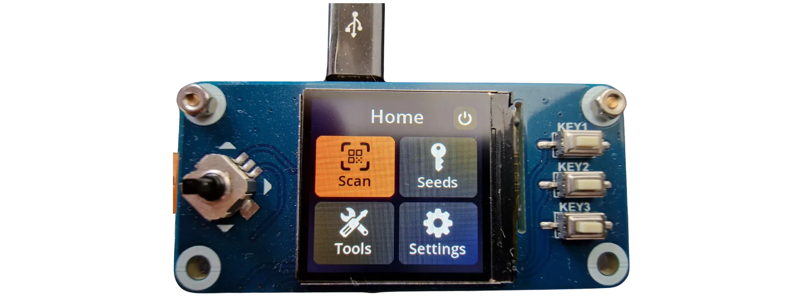

然后选择与您的钱包匹配的种子。

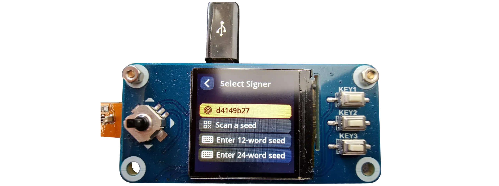

SeedSigner 会自动检测到这是一笔 PSBT 交易，并显示交易摘要：

- 要发送金额，
- 输出的地址，
- 相关的交易费用。


点击 `Review Details`，直接在 SeedSigner 屏幕上仔细检查所有信息。最重要的检查项目是发送金额、接收者地址和收费金额。


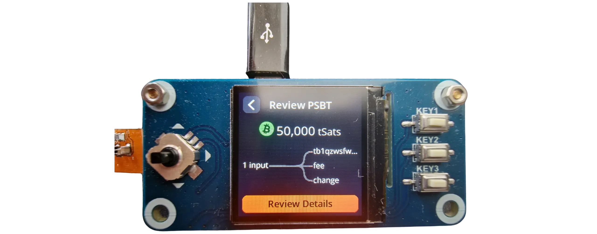


如果一切正常，请选择 `Approve PSBT`，使用相应的私钥签署交易。


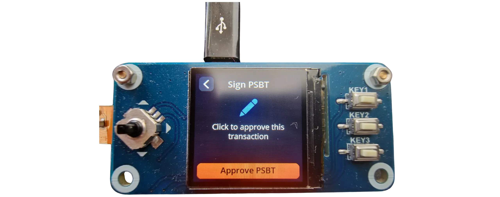


签名后，SeedSigner 会生成一个包含已签名交易的新二维码，供 Sparrow 扫描。


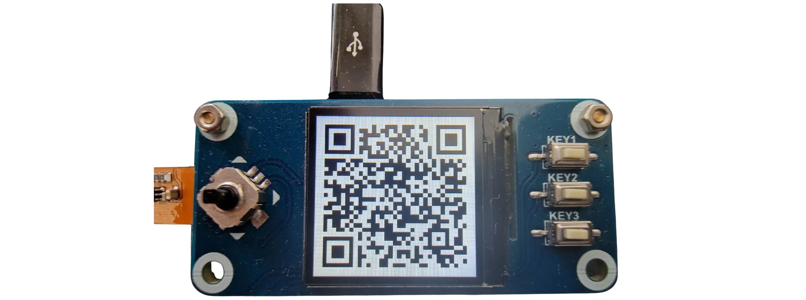


#### 7.2.3 从 Sparrow 广播交易


交易有效后，需要将其广播到比特币网络，以便矿工能够将其添加到区块中。


在 Sparrow 上，单击 `QR Scan`.


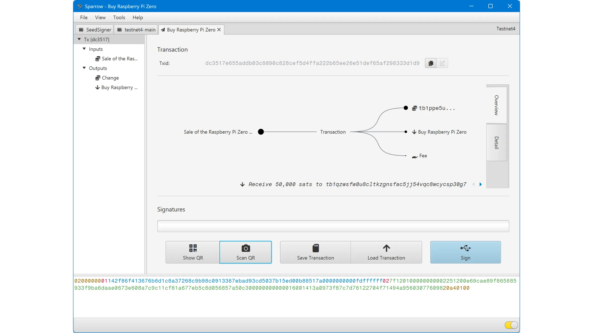


将 SeedSigner 显示的二维码（已签名交易的二维码）对准摄像头。Sparrow 将解码签名并显示完整的交易详情。再次确认所有信息无误后，点击 “Broadcast Transaction” 以将其广播到比特币网络。


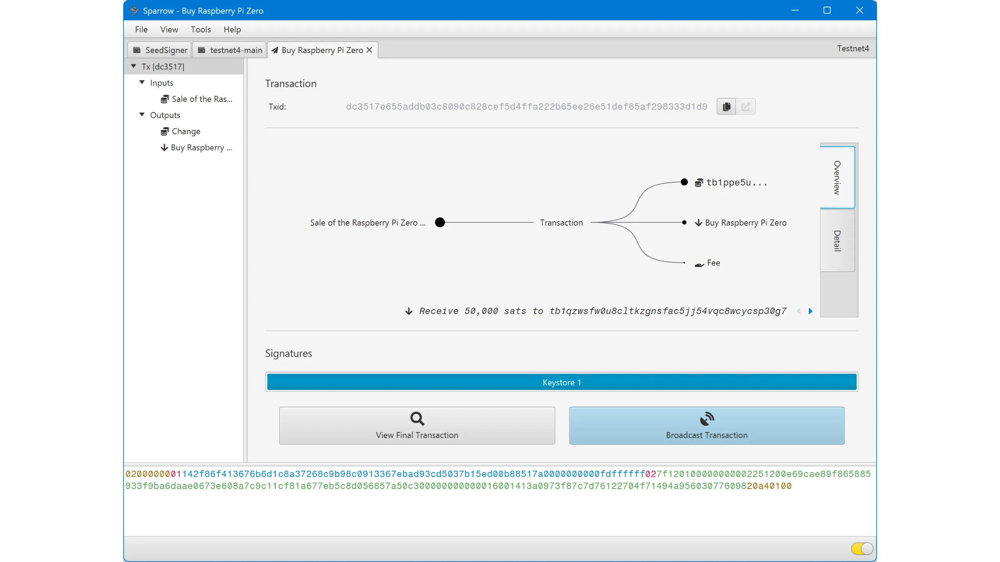

您的交易现已发送到比特币网络。您可以在 Sparrow 钱包的 `Transactions` 选项卡中查看交易进度。

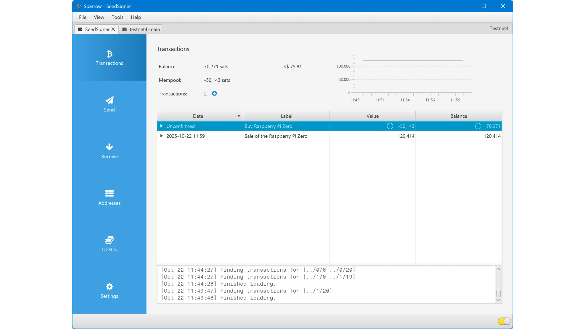


您现在已掌握 SeedSigner 的基本使用方法。为了加深您的知识并探索更多高级用法，我邀请您参考以下教程：

https://planb.academy/tutorials/wallet/hardware/seedkeeper-seedsigner-45cca4c4-1f22-46bb-87ae-9cddb68aa579

**[您还可以通过捐赠比特币来支持 SeedSigner 开源项目的开发！](https://seedsigner.com/donate/)**


*图片来源：本教程中的部分图片来自[SeedSigner 项目官方网站](https://seedsigner.com/) 和 [GitHub 代码库](https://github.com/SeedSigner/seedsigner)*。
