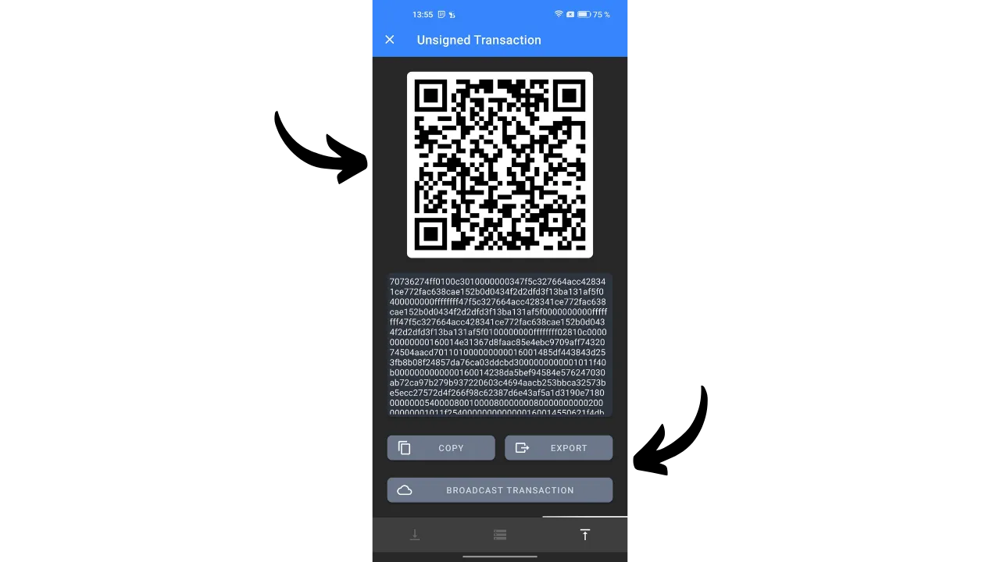
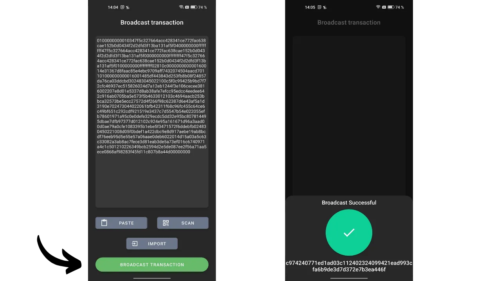

*"Bewahre deine privaten Schlüssel privat."*

In diesem Artikel erforschen wir alles, was Sie über Watch-Only-Wallets wissen müssen. Wir diskutieren, wie sie funktionieren und untersuchen die verschiedenen auf dem Markt verfügbaren Anwendungen. Abschließend bieten wir ein detailliertes Tutorial über eine der beliebtesten Watch-Only-Wallet-Anwendungen: Sentinel.

## Was ist eine Watch-Only-Wallet?
Eine Watch-Only-Wallet, oder eine Nur-Lese-Wallet, ist eine Art von Software, die es dem Benutzer ermöglicht, Transaktionen zu beobachten, die mit einem oder mehreren spezifischen Bitcoin-Öffentlichen Schlüsseln verbunden sind, ohne Zugang zu den entsprechenden privaten Schlüsseln zu haben.

Diese Art von Anwendung behält nur die Daten, die für die Überwachung einer Bitcoin-Wallet notwendig sind, einschließlich der Ansicht ihres Guthabens und der Transaktionshistorie, aber sie hat keinen Zugang zu den privaten Schlüsseln. Daher ist es unmöglich, die in der Wallet auf der Watch-Only-Anwendung gehaltenen Bitcoins auszugeben.

Watch-Only wird im Allgemeinen in Verbindung mit einer Hardware-Wallet verwendet. Dies ermöglicht die Speicherung der privaten Schlüssel der Wallet "kalt", auf einem Gerät, das nicht mit dem Internet verbunden ist, welches eine minimale Angriffsfläche bietet, indem die privaten Schlüssel von potenziell gefährdeten Umgebungen isoliert werden. Die Watch-Only-Anwendung speichert andererseits ausschließlich den erweiterten öffentlichen Schlüssel (`xpub`, `zpub` usw.) der Bitcoin-Wallet. Dieser Elternschlüssel erlaubt nicht die Entdeckung der zugehörigen privaten Schlüssel und folglich nicht das Ausgeben von Bitcoins. Er ermöglicht jedoch die Ableitung von Kind-Öffentlichen Schlüsseln und Empfangsadressen. Mit Kenntnis der Adressen der Wallet, die durch die Hardware-Wallet gesichert ist, kann die Watch-Only-Anwendung diese Transaktionen im Bitcoin-Netzwerk verfolgen und dem Benutzer die Möglichkeit bieten, sein Guthaben zu überwachen und neue Empfangsadressen zu generieren, ohne jedes Mal seine Hardware-Wallet verbinden zu müssen.

## Welche Watch-Only-Wallet verwenden?
Derzeit ist die umfassendste Watch-Only-Anwendung [Sentinel](https://sentinel.watch/), entwickelt von den Teams bei Samourai Wallet. Sie umfasst alle wesentlichen Funktionen für eine gute Watch-Only-Wallet:
- Unterstützung für erweiterte Schlüssel, öffentliche Schlüssel und Adressen;
- Die Möglichkeit, mehrere Konten oder Wallets in Sammlungen zu organisieren;
- Generierung von Adressen, um Bitcoins auf der eigenen Hardware-Wallet zu empfangen, ohne deren direkte Verwendung;
- Die Fähigkeit, Transaktionen offline zu konstruieren und zu senden;
- Option, sich mit dem eigenen Bitcoin-Knoten zu verbinden;
- Integration von Tor für verbesserte Privatsphäre.
Die einzigartigen Nachteile von Sentinel liegen in der Tatsache, dass die Anwendung ausschließlich für Android verfügbar ist und keine Multi-Signatur-Wallets unterstützt. Daher, wenn Sie ein Android-Gerät besitzen und Ihre Wallet eine klassische Einzelsignatur ist, empfehle ich Sentinel.
Für diejenigen, die eine Multi-Signatur-Wallet verfolgen möchten, ist Blue Wallet die einzige Anwendung, die ich kenne, die einen Watch-Only-Modus für diese Arten von Wallets bietet, und sie ist sowohl auf Android als auch auf iOS zugänglich.

Für iOS-Benutzer, die nach einer Alternative zu Sentinel suchen, könnten [Green Wallet](https://blockstream.com/green/) oder [Blue Wallet](https://bluewallet.io/watch-only/) Optionen sein, obwohl ihre Watch-Only-Funktionalität nicht so umfassend wie die von Sentinel ist.

## Wie verwendet man die Sentinel Watch-Only-Wallet?
### Installation und Einrichtung
Beginnen Sie mit der Installation der Sentinel-Anwendung. Dies können Sie entweder über den Google Play Store oder durch Verwendung des [auf der offiziellen Website zum Download verfügbaren APK](https://sentinel.watch/download/) tun.

Beim ersten Öffnen der Anwendung haben Sie die Wahl zwischen:
- `Connect to Dojo`;
- `Verbindung zum Server von Samourai herstellen`.
[Dojo](https://samouraiwallet.com/dojo), entwickelt vom Samourai-Team, ist eine vollständige Bitcoin-Node-Version, die eigenständig installiert oder mit einem Klick zu Node-in-Box-Lösungen wie [Umbrel](https://umbrel.com/) und [RoninDojo](https://ronindojo.io/) hinzugefügt werden kann.

[**-> Entdecken Sie, wie Sie RoninDojo v2 auf einem Raspberry Pi installieren.**](https://planb.network/de/tutorials/node/ronin-dojo-v2)

Wenn Sie Ihr eigenes Dojo haben, können Sie es in diesem Stadium verbinden. Dadurch profitieren Sie vom höchsten Grad an Privatsphäre beim Überprüfen Ihrer Bitcoin-Netzwerktransaktionsinformationen.

Andernfalls ist es möglich, sich für den Standardserver von Samourai zu entscheiden. Sie können auch wählen, ob Sie sich über Tor verbinden möchten oder nicht.

Dann gelangen Sie zur Hauptseite von Sentinel.

Um zu beginnen, können Sie die Anwendung einrichten. Klicken Sie auf die drei kleinen Punkte in der oberen rechten Ecke und dann auf `Einstellungen`.

Indem Sie `Benutzer-PIN-Code` auswählen, haben Sie die Möglichkeit, ein Passwort festzulegen, um den Zugang zu Ihrer Watch-Only-Wallet zu sichern. Sie haben auch die Möglichkeit, die Referenzwährung für die Umrechnung Ihrer Guthaben in Fiatwährung zu ändern oder sogar Fiatwerte auszublenden, indem Sie die Option `Fiatwerte ausblenden` aktivieren. Für erhöhte Sicherheit können Sie `Screenshots deaktivieren` aktivieren, was jegliche Screenshots Ihrer Sentinel-Anwendung verhindert und somit jegliche Offenlegung von Informationen auf einem externen Bildschirm vermeidet.

In diesem Einstellungsmenü haben Sie auch die Möglichkeit, Ihr Sentinel zu sichern.

### Verwendung der Watch-Only-Wallet
Von der Startseite aus drücken Sie den blauen `NEU`-Button, um einen neuen erweiterten öffentlichen Schlüssel hinzuzufügen, den Sie verfolgen möchten. Dann haben Sie die Möglichkeit, den QR-Code Ihres Schlüssels zu scannen oder den Schlüssel (`xpub`, `zpub`...) direkt einzufügen, indem Sie `Pubkey einfügen` auswählen.

Allgemein ist der `xpub` Ihrer Wallet direkt über die Wallet-Verwaltungssoftware, die Sie verwenden, zugänglich. Wenn Sie beispielsweise Ihre Hardware-Wallet mit Sparrow verwalten, finden Sie diese Information im Tab `Einstellungen` unter dem Abschnitt `Keystore`.

Nachdem Sie den erweiterten öffentlichen Schlüssel in Sentinel eingegeben haben, bietet Ihnen die Anwendung an, eine neue Sammlung zu erstellen. Eine Sammlung repräsentiert eine Gruppe von zusammen organisierten erweiterten öffentlichen Schlüsseln. Diese Option gibt Ihnen nicht nur die Möglichkeit, alle Ihre `xpubs` aufzulisten, sondern sie auch auf geordnete Weise zu klassifizieren. Wenn Sie beispielsweise eine Samourai-Wallet mit mehreren Konten (Einlage, Premix, Postmix...) haben, können Sie all diese Konten unter der Sammlung `Samourai` zusammenfassen. Für Wallets, die Sie für Ihre Familie verwalten, könnten Sie eine Sammlung mit dem Namen `Familie` erstellen.

Wählen Sie `Neue Sammlung erstellen`. Geben Sie dann einen Namen für den gerade integrierten erweiterten Schlüssel ein. Wenn ich beispielsweise das Einzahlungskonto meiner Samourai-Wallet scanne, würde ich diesen Schlüssel `Einzahlung` nennen. Klicken Sie auf `SPEICHERN`, um abzuschließen.

Als Nächstes weisen Sie dieser Sammlung einen Namen zu und drücken das Validierungssymbol oben rechts auf dem Bildschirm, um die Sammlung zu speichern. Ihre Sammlung ist jetzt auf dem Startbildschirm von Sentinel sichtbar.

Wenn Sie einen weiteren erweiterten öffentlichen Schlüssel hinzufügen möchten, klicken Sie erneut auf `NEW` und geben Sie Ihren Schlüssel ein.

Anschließend werden Sie aufgefordert, die Sammlung auszuwählen, in die Sie diesen Schlüssel integrieren möchten, oder eine neue zu erstellen. In meinem Fall habe ich beispielsweise eine Sammlung speziell für mein Ledger-Wallet eingerichtet.

Um die erweiterten Schlüssel einer Sammlung im Detail zu sehen, klicken Sie einfach darauf. Sie können dann durch die verschiedenen Tabs navigieren, um die Transaktionshistorie anzusehen.

Von einer Sammlung aus können Sie durch Tippen auf die drei kleinen Punkte oben rechts und dann auf `View Unspent Outputs` auf eine Liste von UTXOs zugreifen, die vom verfolgten Wallet gehalten werden.

### Bitcoins von Sentinel senden und empfangen
Wie bei jedem guten Watch-Only-Wallet ermöglicht es Ihnen Sentinel, Empfangsadressen zu generieren, um Bitcoins auf dem verfolgten Wallet zu empfangen. Aber Sentinel bietet auch eine weitere fortgeschrittene Funktion: die Erstellung und Übertragung einer teilweise signierten Bitcoin-Transaktion (PSBT). So kann das Wallet, das die privaten Schlüssel hält, diese Transaktion signieren, die, einmal signiert, über das Bitcoin-Netzwerk von Sentinel übertragen werden kann. Lassen Sie uns sehen, wie all dies funktioniert.

**Vorsicht, es wird nicht empfohlen, Bitcoins auf eine Empfangsadresse zu erhalten, die nicht vom Wallet selbst verifiziert wurde.** Wenn das Wallet, das die privaten Schlüssel hält, wie ein Hardware-Wallet, nicht ausdrücklich bestätigt hat, dass eine bestimmte Adresse mit ihm verbunden ist, ist das Senden von Bitcoins an diese Adresse eine riskante Praxis. Tatsächlich gibt es ohne diese Bestätigung keine Garantie, dass die Adresse wirklich zu Ihrem Wallet gehört. Daher sollte die Empfangsfunktionalität eines Watch-Only-Wallets mit Vorsicht verwendet werden, wobei im Hinterkopf behalten werden sollte, dass die gesendeten Mittel möglicherweise verloren gehen könnten.

Um Bitcoins über Sentinel zu empfangen, wählen Sie die Sammlung von Interesse aus und klicken Sie dann auf den Tab, der dem erweiterten öffentlichen Schlüssel entspricht, zu dem Sie Mittel übertragen möchten.

Klicken Sie schließlich auf das Pfeilsymbol unten links auf dem Bildschirm. Sentinel generiert dann eine leere Empfangsadresse für Sie. Sie können sie kopieren oder sie mithilfe des QR-Codes scannen.

Um eine PSBT von Sentinel zu generieren und somit eine Ausgabentransaktion zu initiieren, gehen Sie zum erweiterten Schlüssel des Wallets, von dem aus Sie die Zahlung vornehmen möchten. Nehmen wir zum Beispiel mein Einzahlungskonto auf meinem Samourai-Wallet. Dann klicken Sie auf das Pfeilsymbol unten rechts auf dem Bildschirm.

Geben Sie alle Parameter ein, die mit Ihrer Transaktion zusammenhängen:
- Geben Sie die Adresse des Empfängers ein (durch Klicken auf das QR-Code-Symbol haben Sie die Möglichkeit, diese Adresse zu scannen);
- Spezifizieren Sie den Betrag, der an diese Adresse gesendet werden soll;
- Bestimmen Sie die Transaktionsgebühren.

Sobald Sie alle notwendigen Felder für Ihre Transaktion ausgefüllt haben, drücken Sie den `COMPOSE UNSIGNED TRANSACTION`-Button.

Sie gelangen dann zur PSBT, die eine konstruierte, aber nicht signierte Bitcoin-Transaktion darstellt, da Sentinel keinen Zugriff auf Ihre privaten Schlüssel hat. Sie haben die Möglichkeit, diese Transaktion zu kopieren, als `.psbt`-Datei zu exportieren oder sie über den animierten QR-Code zu scannen.

Gehen Sie dann zu Ihrem Wallet, das die privaten Schlüssel hat, um die Transaktion zu signieren (Samourai, Hardware-Wallet...).

Sobald die Transaktion signiert ist, können Sie zu Sentinel zurückkehren, um sie zu übertragen. Um dies zu tun, klicken Sie im Hauptmenü oben rechts auf die drei kleinen Punkte und dann auf `Broadcast transaction`.

Sie haben die Möglichkeit, Ihre signierte PSBT auf drei verschiedene Arten einzugeben:
- Indem Sie sie direkt aus Ihrer Zwischenablage einfügen;
- Indem Sie sie aus einer `.psbt` Datei importieren;
- Indem Sie sie über einen QR-Code scannen.

Sobald die signierte Transaktion im grauen Rahmen eingegeben ist, können Sie auf den grünen `BROADCAST TRANSACTION` Knopf klicken, um sie im Bitcoin-Netzwerk zu übertragen. Sentinel wird Ihnen seine TXID mitteilen.

