---

***PERINGATAN:** Menyusul penangkapan pendiri Samourai Wallet dan penyitaan server mereka pada 24 April, aplikasi Sentinel tetap berfungsi, **tapi kamu wajib pakai Dojo sendiri** untuk bisa akses informasi blockchain dan menyiarkan transaksi.*

_Kita terus mengikuti perkembangan kasus ini dan juga hal-hal terkait alat yang berhubungan. Tenang aja, kita bakal memperbarui tutorial ini begitu ada informasi baru yang tersedia._

_Tutorial ini dibuat cuma untuk tujuan edukasi dan informasi. Kita nggak mendukung atau mendorong penggunaan alat ini buat hal-hal kriminal. Setiap pengguna tetap bertanggung jawab untuk patuh sama hukum di yurisdiksi masing-masing._

---

*"Jaga kunci privatmu, tetap privat."*

Di artikel ini, kita bakal bahas semua hal yang perlu kamu tahu soal dompet watch-only. Kita jelasin gimana cara kerjanya dan ngulik berbagai aplikasi yang ada di pasaran. Terakhir, kita kasih tutorial lengkap tentang salah satu aplikasi dompet watch-only paling populer: Sentinel.

## Apa itu Dompet Watch-Only?
Dompet watch-only, atau dompet hanya-baca, adalah jenis software yang dibuat supaya kamu bisa memantau transaksi yang terhubung ke satu atau lebih kunci publik Bitcoin tertentu, tanpa punya akses ke kunci privatnya.

Aplikasi jenis ini cuma nyimpen data yang dibutuhkan buat ngawasin dompet Bitcoin—termasuk lihat saldo dan riwayat transaksi—tapi nggak pernah pegang kunci privat. Jadi, mustahil buat ngabisin bitcoin yang ada di dompet lewat aplikasi watch-only.

Watch-only biasanya dipakai bareng dompet hardware. Cara ini bikin kunci privat bisa disimpan secara “dingin,” di perangkat yang nggak terhubung ke internet, jadi permukaan serangannya minim dan kunci privat tetap terisolasi dari lingkungan yang rawan.

Sementara itu, aplikasi watch-only cuma nyimpen kunci publik yang diperluas (`xpub`, `zpub`, dll.) dari dompet Bitcoin. Kunci induk ini nggak bisa dipakai buat nemuin kunci privat terkait dan otomatis juga nggak bisa dipakai buat ngeluarin bitcoin. Tapi, kunci itu bisa dipakai buat nurunin kunci publik turunan dan alamat penerima.

Dengan tahu alamat dari dompet yang dijaga sama hardware wallet, aplikasi watch-only bisa mantau transaksi di jaringan Bitcoin, kasih kamu kemampuan buat lihat saldo dan bikin alamat penerima baru, tanpa perlu nyambungin dompet hardware tiap kali.

## Dompet Watch-Only Mana yang Harus Digunakan?
Saat ini, aplikasi watch-only yang paling komprehensif adalah [Sentinel](https://sentinel.watch/), yang dikembangkan oleh tim di Samourai Wallet. Ini mencakup semua fitur penting untuk dompet watch-only yang baik:
- Dukungan untuk kunci yang diperluas, kunci publik, dan alamat;
- Kemampuan untuk mengorganisir beberapa akun atau dompet ke dalam koleksi;
- Generasi alamat untuk menerima bitcoin pada dompet perangkat keras seseorang tanpa memerlukan penggunaannya secara langsung;
- Kemampuan untuk membangun dan menyiarkan transaksi secara offline;
- Opsi untuk terhubung ke node Bitcoin milik sendiri;
- Integrasi Tor untuk privasi yang ditingkatkan.
  
Kelemahan khusus dari Sentinel ada pada fakta bahwa aplikasi ini cuma tersedia di Android dan belum mendukung dompet multi-tanda tangan. Jadi, kalau kamu pakai Android dan dompetmu tipe tanda tangan tunggal klasik, aku rekomendasiin Sentinel.

Tapi kalau kamu mau mantau dompet multi-tanda tangan, Blue Wallet sejauh ini jadi satu-satunya aplikasi yang aku tahu menyediakan mode watch-only buat jenis dompet itu, dan bisa dipakai baik di Android maupun iOS.
Untuk pengguna iOS yang mencari alternatif untuk Sentinel, [Green Wallet](https://blockstream.com/green/) atau [Blue Wallet](https://bluewallet.io/watch-only/) mungkin menjadi pilihan, meskipun fungsionalitas watch-only mereka tidak sekomprehensif Sentinel. 
## Bagaimana Cara Menggunakan Dompet Watch-Only Sentinel?
### Instalasi dan Pengaturan
Mulailah dengan menginstal aplikasi Sentinel. Bisa dari Google Play Store atau dengan menggunakan [APK yang tersedia untuk diunduh di situs web resmi](https://sentinel.watch/download/).

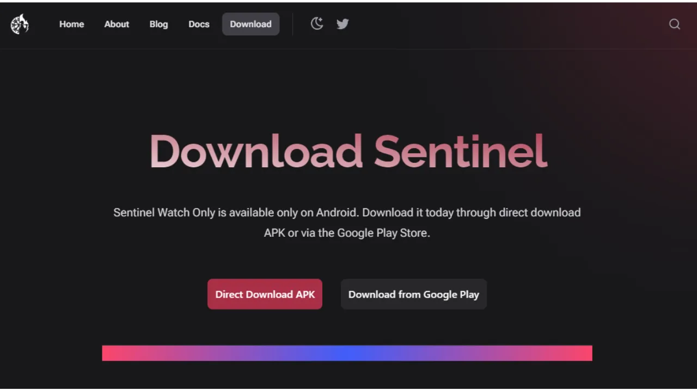

Saat pertama kali membuka aplikasi, kamu bakal diberi pilihan antara:
- `Connect to Dojo`;
- `Connect to Samourai's server`.

Dojo, dikembangkan oleh tim Samourai, adalah versi node Bitcoin penuh yang dapat diinstal secara mandiri atau ditambahkan dalam satu klik ke solusi node-in-box seperti [Umbrel](https://umbrel.com/) dan [RoninDojo](https://ronindojo.io/).

[**-> Temukan cara menginstal RoninDojo v2 di Raspberry Pi.**](https://planb.network/tutorials/node/bitcoin/ronin-dojo-v2-0ddb3854-6f38-4466-b4e2-f66c028e0dd8)

Kalau kamu memiliki Dojo sendiri, kamu menghubungkannya pada tahap ini. Dengan melakukan ini, kamy akan mendapatkan tingkat privasi tertinggi saat memeriksa informasi transaksi jaringan Bitcoin Anda.

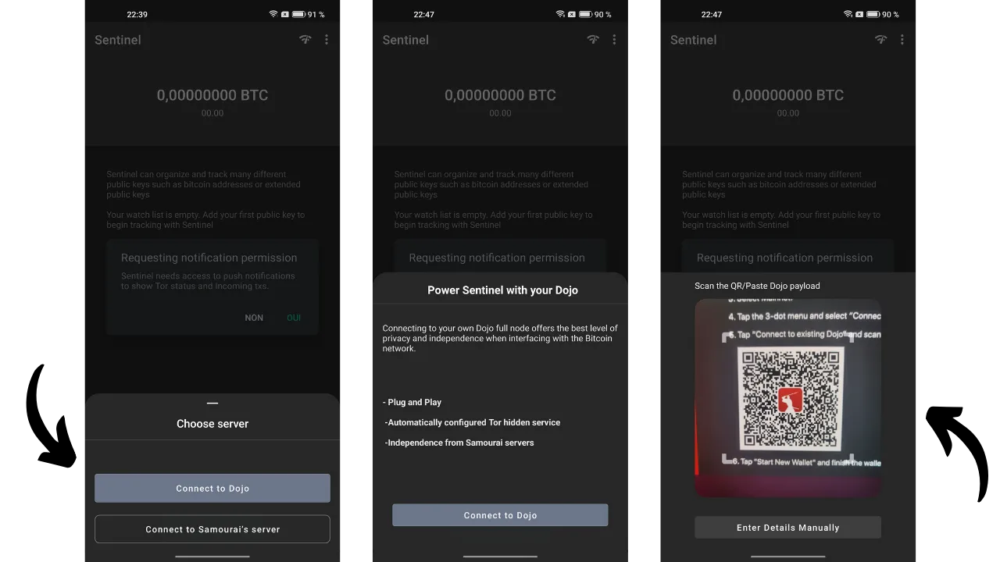

Kalau nggak, kamu dapat memilih server default Samourai. Kamu juga dapat memilih apakah akan terhubung melalui Tor atau tidak.

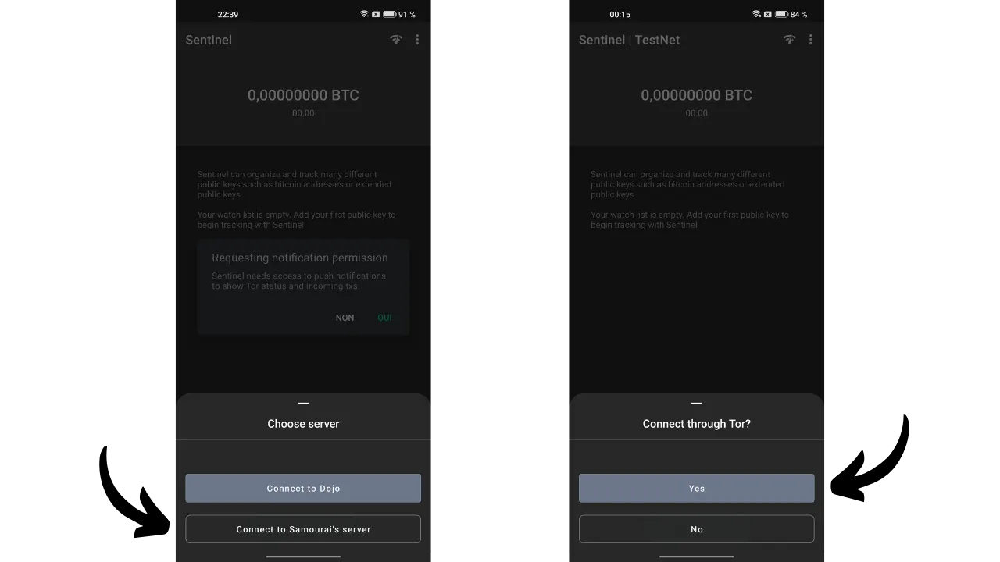

Kemudian kamu akan tiba di halaman utama Sentinel.

Untuk memulai, kamu dapat mengatur aplikasi. Klik pada tiga titik kecil di sudut kanan atas, kemudian pada `Settings`.

Dengan memilih `User PIN code`, kamu bisa bikin password untuk ngamanin akses ke dompet watch-only kamu. Kamu juga bisa ganti mata uang referensi supaya saldo ditampilkan dalam mata uang fiat, atau kalau mau, sembunyiin nilai fiat dengan ngaktifin opsi `Hide fiat values`. Buat keamanan ekstra, kamu bisa nyalain `Disable Screenshots`, yang bakal mencegah tangkapan layar di aplikasi Sentinel dan jadiin informasi di layar tetap terlindungi dari bocor ke luar.
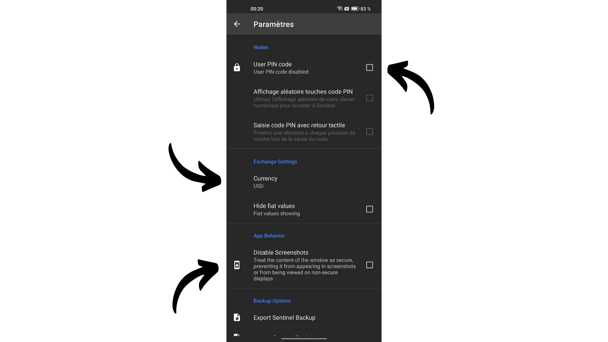

Di menu pengaturan ini, kamu juga bisa memilih untuk membackup Sentinel milikmu.

### Menggunakan Dompet Watch-Only
Dari halaman utama, tekan tombol biru `NEW` untuk menambahkan kunci publik ekstensi baru untuk dilacak. Kemudian kamu memiliki opsi untuk memindai kode QR dari kunci, atau langsung menempelkan kunci (`xpub`, `zpub`...) dengan memilih `Paste Pubkey`.

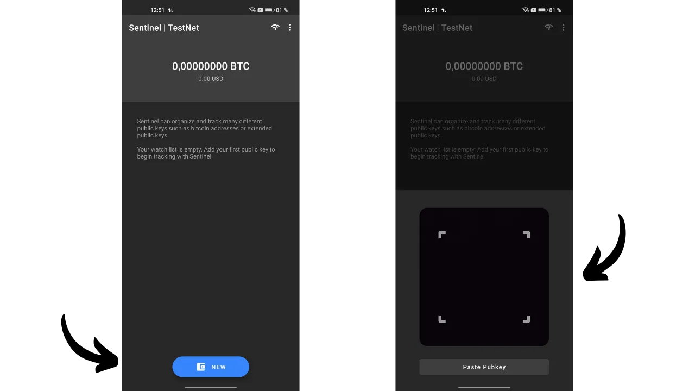

Umumnya, `xpub` dari dompetmu dapat diakses langsung melalui perangkat lunak manajemen dompet yang kamu gunakan. Misalnya, jika kamu mengelola dompet perangkat keras dengan Sparrow, informasi ini ditemukan di tab `Settings`, di bawah bagian `Keystore`.

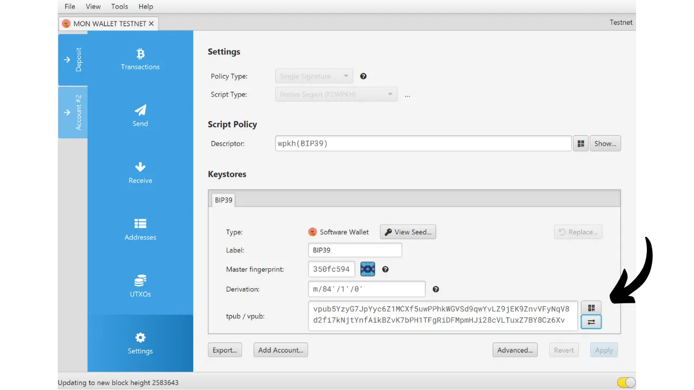
Setelah kamu masukin kunci publik terperluas (extended public key) ke Sentinel, aplikasi bakal nawarin kamu buat bikin koleksi baru. Koleksi ini mewakili sekumpulan kunci publik terperluas yang digabung jadi satu. Dengan opsi ini, kamu nggak cuma bisa nyimpen semua `xpub` kamu, tapi juga bisa ngatur dan ngelompokin dengan rapi.

Misalnya, kalau kamu punya Samourai Wallet dengan beberapa akun (deposit, premix, postmix...), semua akun itu bisa kamu kumpulin di bawah koleksi `Samourai`. Atau, kalau kamu ngatur dompet untuk keluarga, kamu bisa bikin koleksi dengan nama `Family`.

Pilih `Create new collection`, lalu masukin nama buat kunci terperluas yang baru aja kamu tambahin. Contohnya, kalau aku abis scan akun deposit dari dompet Samourai, aku bakal kasih nama kunci itu `Deposit`. Setelah itu, klik `SAVE` buat nyelesain prosesnya.

Selanjutnya, kasih nama koleksi ini lalu tekan ikon centang di pojok kanan atas layar buat nyimpen. Koleksi kamu sekarang bakal muncul di layar utama Sentinel.

Kalau kamu mau menambahkan kunci publik terperluas lainnya, klik pada `NEW` lagi dan masukkan kunci milikmu.

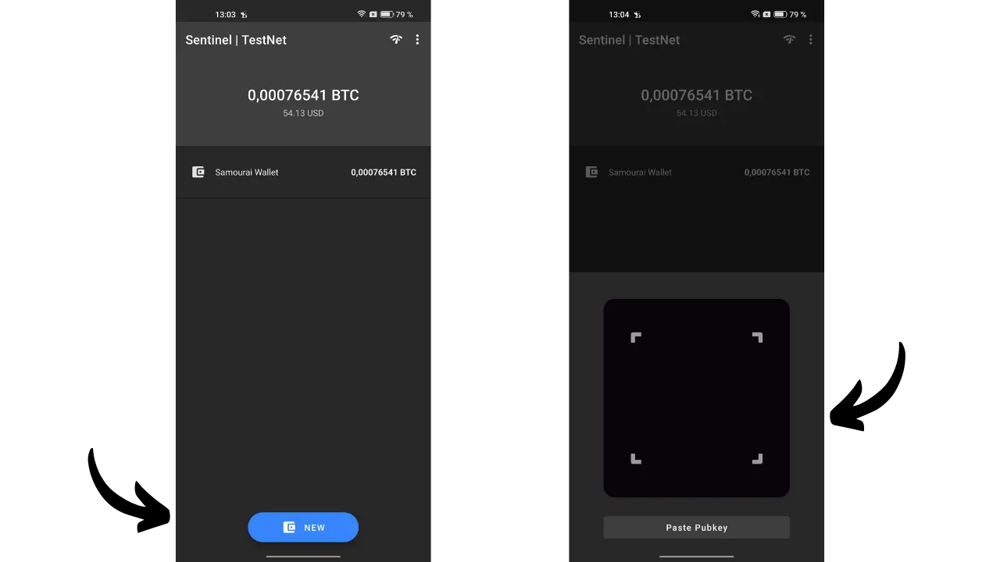
Setelah itu, kamu bakal diminta buat pilih koleksi tempat kunci ini mau dimasukin, atau bikin koleksi baru. Misalnya, aku sendiri udah nyiapin koleksi khusus buat dompet Ledger aku.
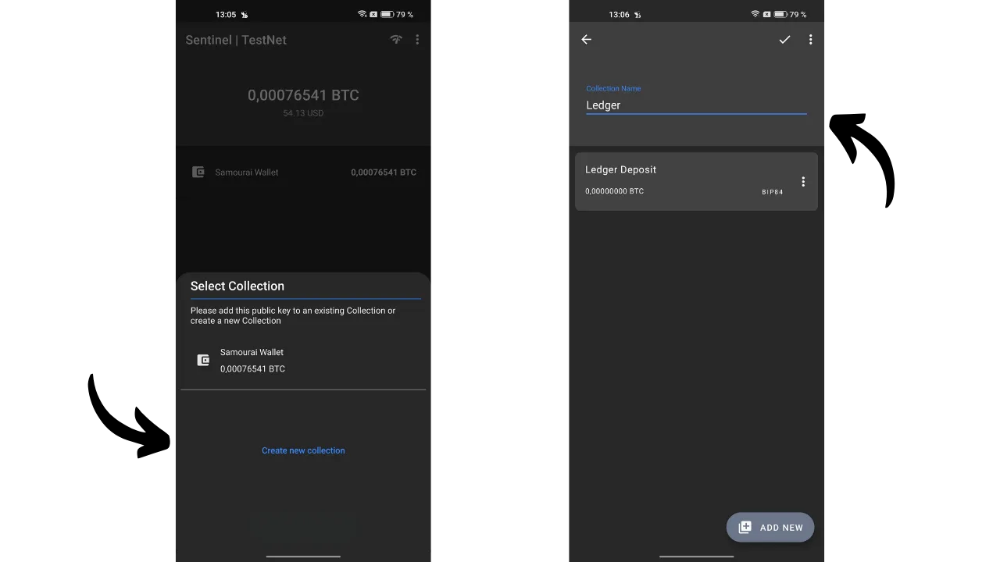

Untuk melihat kunci terperluas dari sebuah koleksi secara detail, cukup klik pada koleksi tersebut. Kemudian kamu dapat menavigasi melalui tab yang berbeda untuk melihat riwayat transaksi.

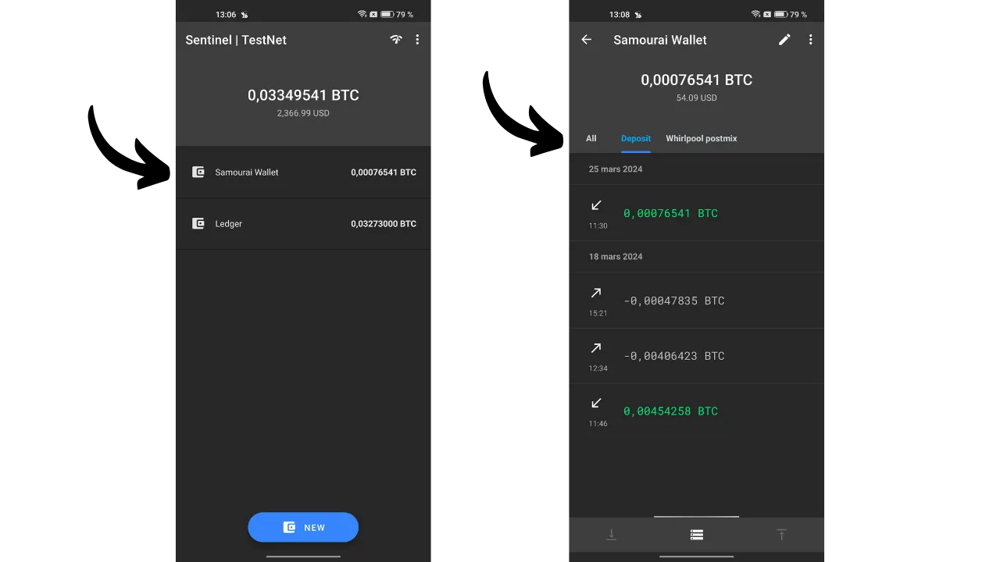

Dari sebuah koleksi, dengan mengetuk tiga titik kecil di pojok kanan atas, kemudian pada `View Unspent Outputs`, Kamu dapat mengakses daftar UTXOs yang dipegang oleh dompet yang dilacak.

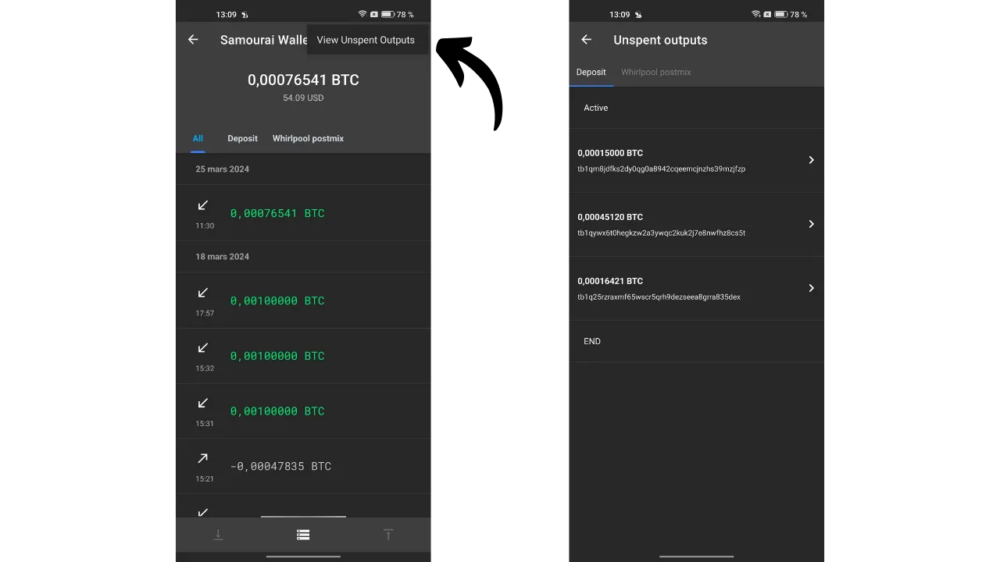

### Mengirim dan Menerima Bitcoin dari Sentinel
Sama seperti dompet watch-only pada umumnya, Sentinel juga bisa bikin alamat penerimaan supaya kamu bisa nerima bitcoin ke dompet yang lagi dipantau. Bedanya, Sentinel punya fitur tambahan yang lebih canggih: bikin dan nyiarin transaksi Bitcoin yang ditandatangani sebagian (PSBT). Dengan begitu, dompet yang nyimpen kunci privat bisa nandatanganin transaksi ini, lalu setelah ditandatangani, transaksi tersebut bisa disiarkan ke jaringan Bitcoin lewat Sentinel. Yuk, kita bahas gimana cara ngelakuin semua itu.

**Perhatian, tidak disarankan untuk menerima bitcoin pada alamat penerimaan yang tidak diverifikasi oleh dompet itu sendiri.** Kalau dompet yang nyimpen kunci privat—misalnya dompet hardware—nggak secara jelas mengonfirmasi bahwa suatu alamat memang terkait dengannya, ngirim bitcoin ke alamat itu bisa jadi risiko. Soalnya tanpa konfirmasi itu, nggak ada jaminan alamat tersebut bener-bener milik dompet kamu. Karena itu, fitur penerimaan di dompet watch-only harus dipakai hati-hati, dengan sadar kalau dana yang dikirim bisa aja hilang.

Untuk nerima bitcoin lewat Sentinel, pilih koleksi yang kamu mau, lalu klik tab yang sesuai dengan kunci publik terperluas tempat kamu mau transfer dana.

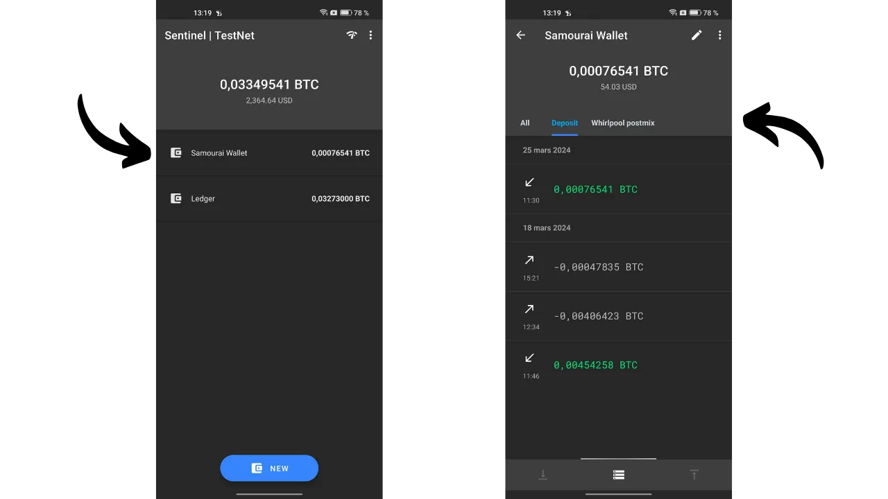

Terakhir, klik ikon panah di pojok kiri bawah layar. Sentinel bakal langsung bikin alamat penerimaan kosong buat kamu. Alamat ini bisa kamu salin atau scan lewat kode QR.

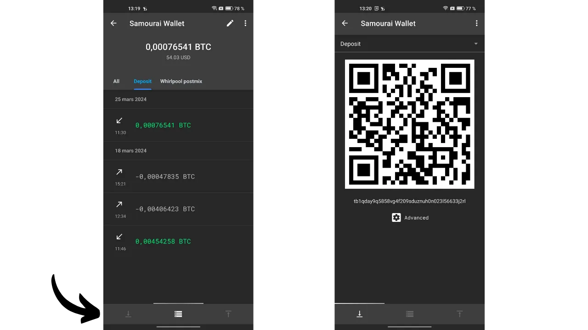
Untuk bikin PSBT di Sentinel dan mulai transaksi pengeluaran, buka kunci ekstensi dompet yang mau kamu pakai buat bayar. Contohnya, aku pilih akun deposit di dompet Samourai aku. Setelah itu, klik ikon panah di pojok kanan bawah layar.
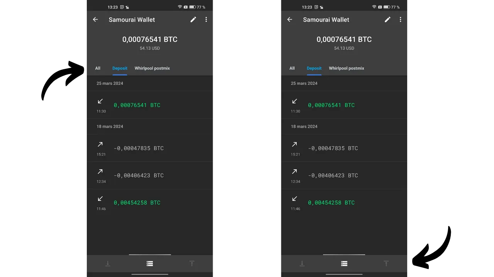

Masukkan semua parameter yang terkait dengan transaksi Anda:
- Masukkan alamat penerima (dengan mengklik ikon kode QR, kamu bisa pilih untuk memindai alamat ini);
- Tentukan jumlah yang akan dikirim ke alamat ini;
- Tentukan biaya transaksi.

Setelah kamu mengisi semua bidang yang diperlukan untuk transaksi milikmu, tekan tombol `COMPOSE UNSIGNED TRANSACTION`.

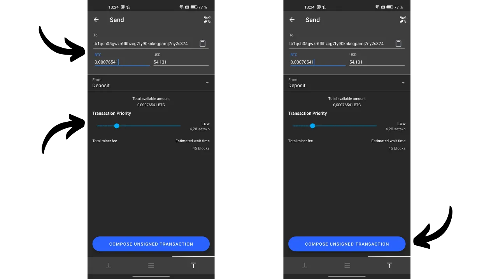

Setelah itu kamu bakal masuk ke PSBT, yaitu transaksi Bitcoin yang udah dibuat tapi belum ditandatangani, karena Sentinel nggak punya akses ke kunci privat kamu. Dari sini, kamu bisa pilih buat nyalin transaksi itu, ekspor sebagai file `.psbt`, atau scan lewat kode QR animasi.

Kemudian, pergilah ke dompet kamu yang memiliki kunci pribadi untuk menandatangani transaksi (Samourai, dompet perangkat keras...).

Setelah transaksi ditandatangani, kamu dapat kembali ke Sentinel untuk menyiarkannya. Untuk melakukan ini, dari menu utama, klik pada tiga titik kecil di bagian atas kanan, kemudian pada `Broadcast transaction`.

Kamu bisa memilih untuk memasukkan PSBT yang telah ditandatangani olehmu dengan tiga cara berbeda:
- Dengan menempelkannya langsung dari clipboard;
- Dengan mengimpor dari file `.psbt`;
- Dengan memindainya melalui kode QR.

Setelah transaksi yang ditandatangani dimasukkan dalam bingkai abu-abu, kamu dapat mengklik tombol hijau `BROADCAST TRANSACTION` untuk menyiarkannya di jaringan Bitcoin. Sentinel akan memberi Anda TXID-nya.

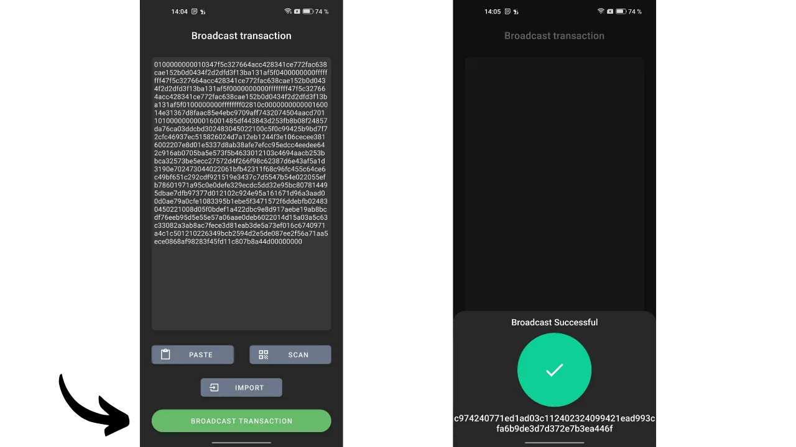

