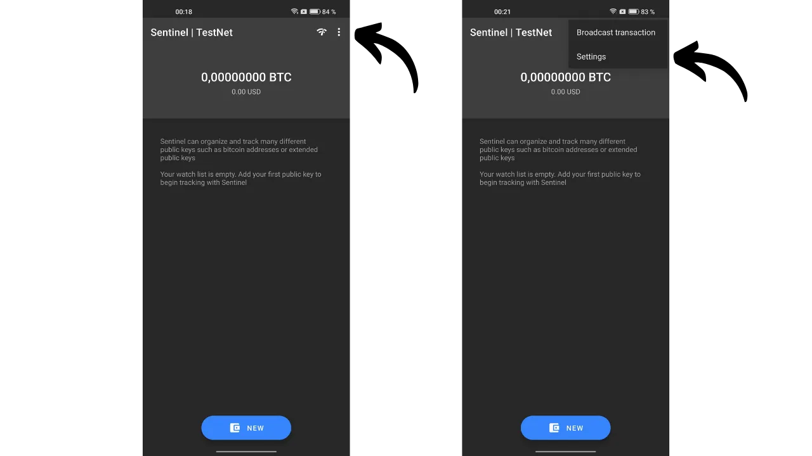
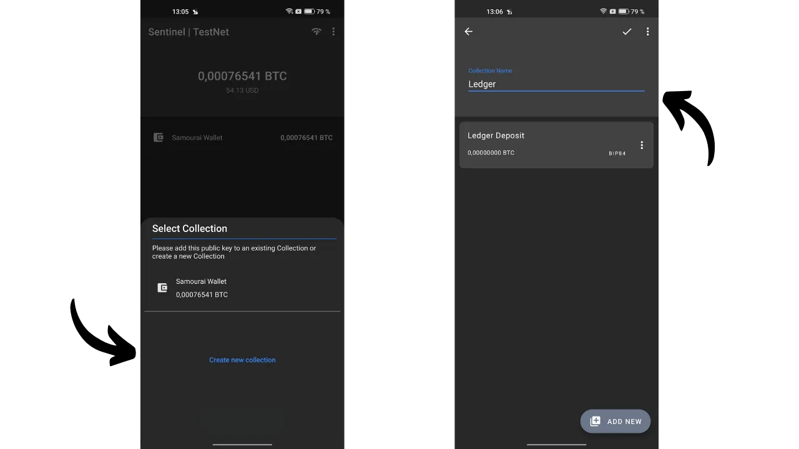

*"Mantieni le tue chiavi private, private."*

In questo articolo, esploriamo tutto ciò che c'è da sapere sui portafogli Watch-Only. Discutiamo il loro funzionamento ed esaminiamo le diverse applicazioni disponibili sul mercato. Infine, offriamo un tutorial dettagliato su una delle applicazioni di portafoglio Watch-Only più popolari: Sentinel.

## Cos'è un Portafoglio Watch-Only?
Un portafoglio Watch-Only, o un portafoglio solo-lettura, è un tipo di software progettato per consentire all'utente di osservare le transazioni associate a una o più specifiche chiavi pubbliche Bitcoin, senza avere accesso alle corrispondenti chiavi private.

Questo tipo di applicazione conserva solo i dati necessari per monitorare un portafoglio Bitcoin, inclusa la visualizzazione del suo saldo e della cronologia delle transazioni, ma non ha accesso alle chiavi private. Pertanto, è impossibile spendere i bitcoin detenuti nel portafoglio sull'applicazione Watch-Only.

Il Watch-Only è generalmente utilizzato in combinazione con un portafoglio hardware. Questo consente di conservare le chiavi private del portafoglio "al freddo", su un dispositivo non connesso a Internet, che ha una superficie di attacco minima, isolando le chiavi private da ambienti potenzialmente vulnerabili. L'applicazione Watch-Only, d'altra parte, conserva esclusivamente la chiave pubblica estesa (`xpub`, `zpub`, ecc.) del portafoglio Bitcoin. Questa chiave genitrice non consente la scoperta delle chiavi private associate e, di conseguenza, non permette la spesa dei bitcoin. Tuttavia, consente la derivazione di chiavi pubbliche figlie e indirizzi di ricezione. Con la conoscenza degli indirizzi del portafoglio protetto dal portafoglio hardware, l'applicazione Watch-Only può tracciare queste transazioni sulla rete Bitcoin, offrendo all'utente la possibilità di monitorare il proprio saldo e generare nuovi indirizzi di ricezione, senza dover collegare ogni volta il proprio portafoglio hardware.

## Quale Portafoglio Watch-Only utilizzare?
Attualmente, l'applicazione Watch-Only più completa è [Sentinel](https://sentinel.watch/), sviluppata dai team di Samourai Wallet. Comprende tutte le caratteristiche essenziali per un buon portafoglio Watch-Only:
- Supporto per chiavi estese, chiavi pubbliche e indirizzi;
- La capacità di organizzare più account o portafogli in collezioni;
- Generazione di indirizzi per ricevere bitcoin sul proprio portafoglio hardware senza richiederne l'uso diretto;
- La capacità di costruire e trasmettere transazioni offline;
- Opzione per connettersi al proprio nodo Bitcoin;
- Integrazione di Tor per una maggiore privacy.
Gli unici svantaggi di Sentinel risiedono nel fatto che l'applicazione è disponibile esclusivamente per Android e non supporta i portafogli multi-firma. Pertanto, se possiedi un dispositivo Android e il tuo portafoglio è un classico a singola firma, raccomando Sentinel.
Per coloro che cercano di tracciare un portafoglio multi-firma, Blue Wallet è l'unica applicazione che conosco che offre una modalità Watch-Only per questi tipi di portafogli, ed è accessibile sia su Android che su iOS.

Per gli utenti iOS alla ricerca di un'alternativa a Sentinel, [Green Wallet](https://blockstream.com/green/) o [Blue Wallet](https://bluewallet.io/watch-only/) possono essere opzioni, anche se la loro funzionalità Watch-Only non è completa come quella di Sentinel.

## Come Utilizzare il Portafoglio Watch-Only di Sentinel?
### Installazione e Configurazione
Inizia installando l'applicazione Sentinel. Puoi farlo sia dal Google Play Store che utilizzando l'[APK disponibile per il download sul sito ufficiale](https://sentinel.watch/download/).

All'apertura iniziale dell'applicazione, ti viene data la scelta tra:
- `Connect to Dojo`;
- `Connettiti al server di Samourai`.
[Dojo](https://samouraiwallet.com/dojo), sviluppato dal team di Samourai, è una versione completa di nodo Bitcoin che può essere installata in modo autonomo o aggiunta con un clic a soluzioni node-in-box come [Umbrel](https://umbrel.com/) e [RoninDojo](https://ronindojo.io/).

[**-> Scopri come installare RoninDojo v2 su Raspberry Pi.**](https://planb.network/it/tutorials/node/ronin-dojo-v2)

Se possiedi il tuo Dojo, puoi connetterlo in questa fase. Facendo ciò, beneficerai del massimo livello di privacy quando controlli le informazioni delle tue transazioni nella rete Bitcoin.

Altrimenti, è possibile optare per il server predefinito di Samourai. Puoi anche scegliere se connetterti tramite Tor o meno.

Arriverai quindi alla pagina principale di Sentinel.

Per iniziare, puoi configurare l'applicazione. Clicca sui tre piccoli punti nell'angolo in alto a destra, poi su `Impostazioni`.

Selezionando `Codice PIN utente`, hai l'opzione di impostare una password per proteggere l'accesso al tuo portafoglio solo-visualizzazione. Hai anche la possibilità di cambiare la valuta di riferimento per convertire i tuoi saldi in valuta fiat, o anche di nascondere i valori in fiat attivando l'opzione `Nascondi valori fiat`. Per una maggiore sicurezza, puoi attivare `Disabilita screenshot`, che impedisce qualsiasi screenshot della tua applicazione Sentinel e quindi evita qualsiasi divulgazione di informazioni su uno schermo esterno.

In questo menu delle impostazioni, hai anche l'opzione di fare il backup del tuo Sentinel.

### Utilizzo del Portafoglio Solo-Visualizzazione
Dalla homepage, premi il pulsante blu `NUOVO` per aggiungere una nuova chiave pubblica estesa da monitorare. Hai quindi l'opzione di scansionare il codice QR della tua chiave, o di incollare direttamente la chiave (`xpub`, `zpub`...) selezionando `Incolla Pubkey`.

Generalmente, l'`xpub` del tuo portafoglio è direttamente accessibile tramite il software di gestione del portafoglio che utilizzi. Ad esempio, se gestisci il tuo hardware wallet con Sparrow, queste informazioni si trovano nella scheda `Impostazioni`, sotto la sezione `Keystore`.

Dopo aver inserito la chiave pubblica estesa in Sentinel, l'applicazione ti offre di creare una nuova collezione. Una collezione rappresenta un insieme di chiavi pubbliche estese organizzate insieme. Questa opzione ti dà la possibilità non solo di elencare tutti i tuoi `xpubs`, ma di classificarli in modo ordinato. Ad esempio, se hai un Samourai Wallet con più account (deposito, premix, postmix...), puoi raggruppare tutti questi account sotto la collezione `Samourai`. Per i portafogli gestiti per la tua famiglia, potresti creare una collezione chiamata `Famiglia`.

Seleziona `Crea nuova collezione`. Poi inserisci un nome per la chiave estesa che hai appena integrato. Ad esempio, se scansiono l'account di deposito del mio portafoglio Samourai, nominerei questa chiave `Deposito`. Clicca su `SALVA` per finalizzare.

Successivamente, assegna un nome a questa collezione e premi l'icona di convalida situata in alto a destra dello schermo per salvare la collezione. La tua collezione è ora visibile sulla schermata home di Sentinel.

Se desideri aggiungere un'altra chiave pubblica estesa, clicca su `NEW` nuovamente e inserisci la tua chiave.

Ti verrà quindi chiesto di scegliere la collezione in cui desideri integrare questa chiave, o di crearne una nuova. Ad esempio, nel mio caso, ho configurato una collezione specificamente per il mio portafoglio Ledger.

Per vedere le chiavi estese di una collezione in dettaglio, basta cliccarci sopra. Puoi poi navigare tra le diverse schede per visualizzare la cronologia delle transazioni.

Da una collezione, toccando i tre piccoli punti in alto a destra, poi su `View Unspent Outputs`, puoi accedere a un elenco di UTXO detenuti dal portafoglio monitorato.

### Inviare e Ricevere Bitcoin da Sentinel
Come per qualsiasi buon portafoglio solo-visualizzazione, Sentinel ti permette di generare indirizzi di ricezione per ricevere bitcoin sul portafoglio monitorato. Ma Sentinel offre anche un'altra funzionalità avanzata: la creazione e la trasmissione di una transazione Bitcoin parzialmente firmata (PSBT). Così, il portafoglio che detiene le chiavi private può firmare questa transazione, che, una volta firmata, può essere trasmessa sulla rete Bitcoin da Sentinel. Vediamo come fare tutto questo.

**Attenzione, non è consigliato ricevere bitcoin su un indirizzo di ricezione non verificato dal portafoglio stesso.** Se il portafoglio che detiene le chiavi private, come un portafoglio hardware, non ha confermato esplicitamente che un certo indirizzo gli è affiliato, inviare bitcoin a questo indirizzo è una pratica rischiosa. Infatti, senza questa conferma, non c'è garanzia che l'indirizzo appartenga veramente al tuo portafoglio. Pertanto, la funzionalità di ricezione di un portafoglio solo-visualizzazione dovrebbe essere usata con cautela, tenendo presente che i fondi inviati potrebbero potenzialmente essere persi.

Per ricevere bitcoin tramite Sentinel, seleziona la collezione di interesse, poi clicca sulla scheda corrispondente alla chiave pubblica estesa verso cui desideri trasferire fondi.

Infine, clicca sull'icona della freccia in basso a sinistra dello schermo. Sentinel genera quindi per te un indirizzo di ricezione vuoto. Puoi copiarlo, o scansionarlo utilizzando il codice QR.

Per generare un PSBT da Sentinel, e quindi avviare una transazione di spesa, vai alla chiave estesa del portafoglio da cui desideri effettuare il pagamento. Prendiamo, per esempio, il mio conto di deposito sul mio portafoglio Samourai. Poi clicca sull'icona della freccia situata in basso a destra dello schermo.

Inserisci tutti i parametri relativi alla tua transazione:
- Inserisci l'indirizzo del destinatario (cliccando sull'icona del codice QR, hai l'opzione di scansionare questo indirizzo);
- Specifica l'importo da inviare a questo indirizzo;
- Determina le commissioni di transazione.

Una volta compilati tutti i campi necessari per la tua transazione, premi il pulsante `COMPOSE UNSIGNED TRANSACTION`.

Avrai quindi accesso al PSBT, che rappresenta una transazione Bitcoin costruita ma non firmata, poiché Sentinel non ha accesso alle tue chiavi private. Hai l'opzione di copiare questa transazione, esportarla come file `.psbt`, o scansionarla tramite il codice QR animato.

Poi, vai al tuo portafoglio che ha le chiavi private per firmare la transazione (Samourai, portafoglio hardware...).

Una volta firmata la transazione, puoi tornare a Sentinel per trasmetterla. Per farlo, dal menu principale, clicca sui tre piccoli punti in alto a destra, poi su `Broadcast transaction`.

Hai l'opzione di inserire la tua PSBT firmata in tre modi diversi:
- Incollandola direttamente dalla tua clipboard;
- Importandola da un file `.psbt`;
- Scansionandola tramite un codice QR.

Una volta inserita la transazione firmata nel riquadro grigio, puoi cliccare sul pulsante verde `BROADCAST TRANSACTION` per trasmetterla sulla rete Bitcoin. Sentinel ti fornirà il suo TXID.

