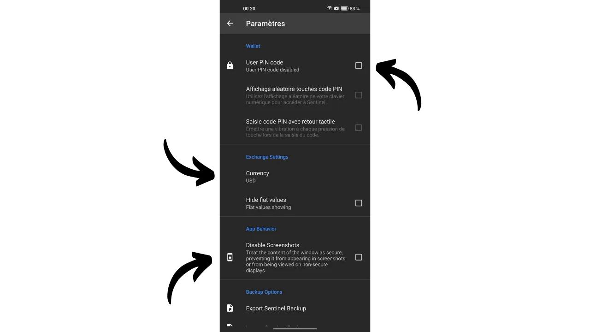
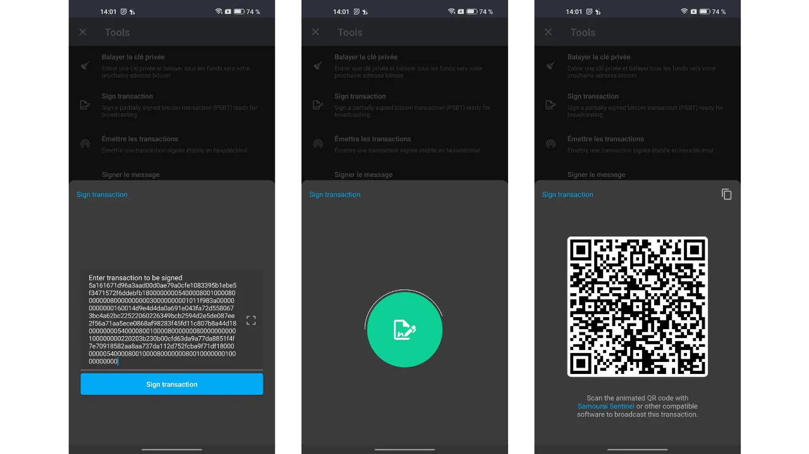
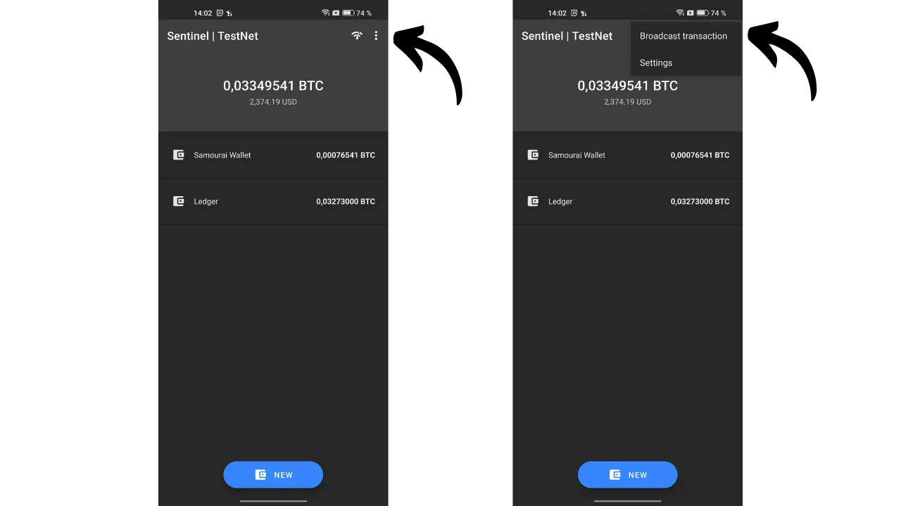

*"プライベートキーは、プライベートに保ちましょう。"*

この記事では、ウォッチオンリーウォレットについて知るべきすべてを探求します。それらがどのように機能するか、市場に出回っている異なるアプリケーションを検討します。最後に、最も人気のあるウォッチオンリーウォレットアプリケーションの1つであるSentinelについて、詳細なチュートリアルを提供します。

## ウォッチオンリーウォレットとは何ですか？
ウォッチオンリーウォレット、またはリードオンリーウォレットは、対応するプライベートキーにアクセスすることなく、1つ以上の特定のBitcoin公開キーに関連するトランザクションをユーザーが観察できるように設計されたソフトウェアのタイプです。

このタイプのアプリケーションは、Bitcoinウォレットの監視に必要なデータのみを保持し、その残高とトランザクション履歴を表示できますが、プライベートキーにはアクセスできません。したがって、ウォッチオンリーアプリケーションのウォレットに保持されているビットコインを使うことは不可能です。

ウォッチオンリーは一般的にハードウェアウォレットと併用されます。これにより、ウォレットのプライベートキーをインターネットに接続されていないデバイス上で「コールド」に保管し、最小限の攻撃面を持つことで、プライベートキーを潜在的に脆弱な環境から隔離します。一方、ウォッチオンリーアプリケーションは、Bitcoinウォレットの拡張公開キー（`xpub`、`zpub`など）のみを専用に保管します。この親キーは、関連するプライベートキーの発見を許可せず、したがってビットコインの支出を許可しません。しかし、子公開キーと受信アドレスの導出を可能にします。ハードウェアウォレットによって保護されたウォレットのアドレスを知っていることで、ウォッチオンリーアプリケーションはこれらのトランザクションをBitcoinネットワーク上で追跡し、ユーザーが自分の残高を監視し、ハードウェアウォレットを毎回接続することなく新しい受信アドレスを生成できるようにします。

## どのウォッチオンリーウォレットを使用すべきか？
現在、最も包括的なウォッチオンリーアプリケーションは、Samourai Walletのチームによって開発された[Sentinel](https://sentinel.watch/)です。良いウォッチオンリーウォレットに必要なすべての主要機能を網羅しています：
- 拡張キー、公開キー、およびアドレスのサポート；
- 複数のアカウントまたはウォレットをコレクションに整理する機能；
- ハードウェアウォレットの直接使用を要求せずにビットコインを受け取るためのアドレスの生成；
- オフラインでのトランザクションの構築とブロードキャストの能力；
- 自分のBitcoinノードに接続するオプション；
- プライバシーの強化のためのTorの統合。
Sentinelの唯一の欠点は、アプリケーションがAndroid専用であり、マルチシグネチャウォレットをサポートしていないことです。したがって、Androidデバイスを所有し、ウォレットがクラシックなシングルシグネチャである場合は、Sentinelをお勧めします。
マルチシグネチャウォレットを追跡したい方には、Blue Walletがこれらのタイプのウォレットのウォッチオンリーモードを提供する唯一のアプリケーションであり、AndroidとiOSの両方でアクセス可能です。

Sentinelの代替としてiOSユーザーが探している場合、[Green Wallet](https://blockstream.com/green/)または[Blue Wallet](https://bluewallet.io/watch-only/)がオプションになるかもしれませんが、そのウォッチオンリー機能はSentinelのものほど包括的ではありません。

## Sentinelウォッチオンリーウォレットの使用方法は？
### インストールとセットアップ
Google Playストアから、または[公式ウェブサイトでダウンロード可能なAPKを使用して](https://sentinel.watch/download/)、Sentinelアプリケーションをインストールして開始します。

アプリケーションを初めて開くと、以下の選択肢が表示されます：
- `Dojoに接続する`；
Samouraiのサーバーに接続する。
[Dojo](https://samouraiwallet.com/dojo)は、Samouraiチームによって開発された完全なBitcoinノードバージョンで、スタンドアロンでインストールすることも、[Umbrel](https://umbrel.com/)や[RoninDojo](https://ronindojo.io/)のようなノードインボックスソリューションにワンクリックで追加することもできます。

[**-> Raspberry PiにRoninDojo v2をインストールする方法を発見する。**](https://planb.network/en/tutorials/node/ronin-dojo-v2)

自分のDojoを持っている場合は、この段階で接続することができます。そうすることで、Bitcoinネットワークのトランザクション情報をチェックする際に、最高レベルのプライバシーを享受できます。

それ以外の場合は、Samouraiのデフォルトサーバーを選択することも可能です。Tor経由で接続するかどうかも選択できます。

そうすると、Sentinelのメインページに到着します。

始めるには、アプリケーションを設定できます。右上隅の3つの小さな点をクリックし、次に`Settings`をクリックします。

`User PIN code`を選択することで、ウォッチオンリーウォレットへのアクセスを保護するためのパスワードを設定するオプションがあります。また、残高を法定通貨に変換するための基準通貨を変更することも、`Hide fiat values`オプションを有効にすることで法定通貨の値を隠すこともできます。セキュリティを強化するために、`Disable Screenshots`を有効にすることができ、これによりSentinelアプリケーションのスクリーンショットがすべて防止され、外部画面への情報の開示が避けられます。

この設定メニューでは、Sentinelのバックアップオプションもあります。

### ウォッチオンリーウォレットの使用
ホームページから、青い`NEW`ボタンを押して、追跡する新しい拡張公開キーを追加します。次に、キーのQRコードをスキャンするか、`Paste Pubkey`を選択してキー(`xpub`, `zpub`...)を直接貼り付けるオプションがあります。

一般的に、ウォレットの`xpub`は、Sparrowなどのウォレット管理ソフトウェアを使用して管理する場合、`Settings`タブの`Keystore`セクションで直接アクセスできます。

Sentinelに拡張公開キーを入力した後、アプリケーションは新しいコレクションを作成するオプションを提供します。コレクションは、一緒に整理された拡張公開キーのセットを表します。このオプションは、すべての`xpubs`をリストアップするだけでなく、それらを整然と分類する可能性を提供します。例えば、複数のアカウント（預金、プレミックス、ポストミックス...）を持つSamourai Walletを持っている場合、これらのアカウントを`Samourai`コレクションの下にまとめることができます。家族で管理するウォレットの場合は、`Family`という名前のコレクションを作成するかもしれません。

`Create new collection`を選択します。次に、ちょうど統合した拡張キーに名前を入力します。例えば、Samouraiウォレットの預金アカウントをスキャンする場合、このキーに`Deposit`と名付けます。`SAVE`をクリックして最終化します。

次に、このコレクションに名前を割り当て、画面右上にある検証アイコンを押してコレクションを保存します。あなたのコレクションは、今やSentinelのホーム画面に表示されます。

もし別の拡張公開キーを追加したい場合は、`NEW`を再度クリックしてキーを入力してください。

次に、このキーを統合したいコレクションを選択するか、新しいコレクションを作成するよう求められます。例えば、私の場合、Ledgerウォレット専用のコレクションを設定しました。

コレクションの拡張キーを詳細に見るには、単にそれをクリックします。そうすると、異なるタブをナビゲートして、トランザクション履歴を閲覧できます。

コレクションから、右上の三つの小さな点をタップし、`View Unspent Outputs`を選択することで、追跡しているウォレットが保持するUTXOのリストにアクセスできます。

### Sentinelからビットコインを送受信する
どのような良質なウォッチオンリーウォレットと同様に、Sentinelは追跡しているウォレットにビットコインを受け取るための受信アドレスを生成することができます。しかし、Sentinelはもう一つの高度な機能も提供します：部分的に署名されたビットコイントランザクション（PSBT）の作成とブロードキャストです。このトランザクションは、プライベートキーを保持するウォレットが署名でき、一度署名されると、Sentinelによってビットコインネットワーク上でブロードキャストされます。これをどのように行うか見てみましょう。

**注意、ウォレット自体によって検証されていない受信アドレスにビットコインを受け取ることは推奨されません。** ハードウェアウォレットなどのプライベートキーを保持するウォレットが、特定のアドレスがそれに関連付けられていることを明示的に確認していない場合、このアドレスにビットコインを送ることはリスクのある行為です。実際、この確認がなければ、そのアドレスが本当にあなたのウォレットに属しているという保証はありません。したがって、ウォッチオンリーウォレットの受信機能は慎重に使用すべきであり、送られた資金が潜在的に失われる可能性があることを念頭に置くべきです。

Sentinel経由でビットコインを受け取るには、関心のあるコレクションを選択し、資金を転送したい拡張公開キーに対応するタブをクリックします。

最後に、画面の左下にある矢印アイコンをクリックします。Sentinelは空の受信アドレスを生成します。これをコピーするか、QRコードを使用してスキャンできます。

支払いを行いたいウォレットの拡張キーから、SentinelからPSBTを生成し、支出トランザクションを開始するには、画面の右下にある矢印アイコンをクリックします。例として、私のSamouraiウォレットの預金口座を取り上げましょう。

トランザクションに関連するすべてのパラメータを入力します：
- 受取人のアドレスを入力します（QRコードアイコンをクリックすると、このアドレスをスキャンするオプションがあります）；
- このアドレスに送る金額を指定します；
- トランザクション手数料を決定します。

トランザクションに必要なすべてのフィールドを入力したら、`COMPOSE UNSIGNED TRANSACTION`ボタンを押します。

そうすると、Sentinelがあなたのプライベートキーにアクセスできないため、署名されていないビットコイントランザクションを表すPSBTにアクセスします。このトランザクションをコピーするか、`.psbt`ファイルとしてエクスポートするか、アニメーションQRコードを介してスキャンするオプションがあります。

その後、トランザクションを署名するためにプライベートキーを持つウォレット（Samourai、ハードウェアウォレット...）に移動します。

トランザクションが署名されたら、Sentinelに戻ってそれをブロードキャストすることができます。これを行うには、ホームメニューから右上にある三つの小さな点をクリックし、その後で`Broadcast transaction`を選択します。

署名されたPSBTを3つの異なる方法で入力するオプションがあります：
- クリップボードから直接貼り付ける；
- `.psbt`ファイルからインポートする；
- QRコードをスキャンする。

署名されたトランザクションが灰色の枠内に入力されたら、緑の`BROADCAST TRANSACTION`ボタンをクリックして、それをBitcoinネットワーク上でブロードキャストすることができます。SentinelはあなたにそのTXIDを提供します。

