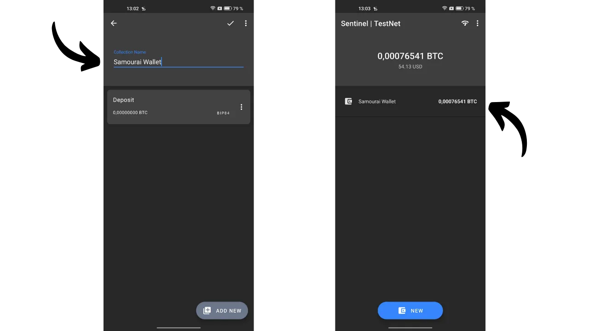

*"Mantenha suas chaves privadas, privadas."*

Neste artigo, exploramos tudo o que você precisa saber sobre carteiras watch-only. Discutimos como elas funcionam e examinamos as diferentes aplicações disponíveis no mercado. Por fim, oferecemos um tutorial detalhado sobre uma das aplicações de carteira watch-only mais populares: Sentinel.

## O que é uma Carteira Watch-Only?
Uma carteira watch-only, ou uma carteira somente de leitura, é um tipo de software projetado para permitir que o usuário observe transações associadas a uma ou mais chaves públicas específicas do Bitcoin, sem ter acesso às chaves privadas correspondentes.

Este tipo de aplicação retém apenas os dados necessários para monitorar uma carteira Bitcoin, incluindo visualizar seu saldo e histórico de transações, mas não tem acesso às chaves privadas. Portanto, é impossível gastar os bitcoins mantidos na carteira na aplicação watch-only.

Geralmente, a watch-only é usada em conjunto com uma carteira de hardware. Isso permite o armazenamento das chaves privadas da carteira de forma "fria", em um dispositivo não conectado à internet, que possui uma superfície de ataque mínima, isolando as chaves privadas de ambientes potencialmente vulneráveis. A aplicação watch-only, por outro lado, armazena exclusivamente a chave pública estendida (`xpub`, `zpub`, etc.) da carteira Bitcoin. Esta chave-mãe não permite a descoberta das chaves privadas associadas e, consequentemente, não permite o gasto de bitcoins. No entanto, permite a derivação de chaves públicas filhas e endereços de recebimento. Com o conhecimento dos endereços da carteira protegida pela carteira de hardware, a aplicação watch-only pode rastrear essas transações na rede Bitcoin, oferecendo ao usuário a capacidade de monitorar seu saldo e gerar novos endereços de recebimento, sem ter que conectar sua carteira de hardware a cada vez.

## Qual Carteira Watch-Only usar?
Atualmente, a aplicação watch-only mais abrangente é o [Sentinel](https://sentinel.watch/), desenvolvido pelas equipes da Samourai Wallet. Ele engloba todas as características essenciais para uma boa carteira watch-only:
- Suporte para chaves estendidas, chaves públicas e endereços;
- A capacidade de organizar várias contas ou carteiras em coleções;
- Geração de endereços para receber bitcoins na carteira de hardware sem exigir seu uso direto;
- A capacidade de construir e transmitir transações offline;
- Opção de conectar ao próprio nó Bitcoin;
- Integração do Tor para maior privacidade.
Os únicos pontos negativos do Sentinel residem no fato de que a aplicação está disponível exclusivamente para Android e não suporta carteiras multi-assinatura. Portanto, se você possui um dispositivo Android e sua carteira é uma clássica de assinatura única, eu recomendo o Sentinel.
Para aqueles que procuram rastrear uma carteira multi-assinatura, a Blue Wallet é a única aplicação que conheço que oferece um modo watch-only para esses tipos de carteiras, e está acessível tanto no Android quanto no iOS.

Para usuários de iOS em busca de uma alternativa ao Sentinel, [Green Wallet](https://blockstream.com/green/) ou [Blue Wallet](https://bluewallet.io/watch-only/) podem ser opções, embora sua funcionalidade watch-only não seja tão abrangente quanto a do Sentinel.

## Como Usar a Carteira Watch-Only Sentinel?
### Instalação e Configuração
Comece instalando o aplicativo Sentinel. Você pode fazer isso tanto pela Google Play Store quanto usando o [APK disponível para download no site oficial](https://sentinel.watch/download/).

Ao abrir o aplicativo pela primeira vez, você tem a escolha entre:
- `Conectar ao Dojo`;
- `Conectar ao servidor do Samourai`.
[Dojo](https://samouraiwallet.com/dojo), desenvolvido pela equipe Samourai, é uma versão completa de nó Bitcoin que pode ser instalada de forma independente ou adicionada com um clique a soluções de nó-em-caixa como [Umbrel](https://umbrel.com/) e [RoninDojo](https://ronindojo.io/).

[**-> Descubra como instalar o RoninDojo v2 em um Raspberry Pi.**](https://planb.network/pt/tutorials/node/ronin-dojo-v2)

Se você tem seu próprio Dojo, pode conectá-lo nesta etapa. Ao fazer isso, você se beneficiará do mais alto nível de privacidade ao verificar as informações de transação da rede Bitcoin.

Caso contrário, é possível optar pelo servidor padrão do Samourai. Você também pode escolher se deseja conectar via Tor ou não.

Você então chegará à página principal do Sentinel.

Para começar, você pode configurar o aplicativo. Clique nos três pequenos pontos no canto superior direito e, em seguida, em `Configurações`.

Ao selecionar `Código PIN do Usuário`, você tem a opção de definir uma senha para proteger o acesso à sua carteira somente de visualização. Você também tem a capacidade de alterar a moeda de referência para converter seus saldos em moeda fiduciária, ou até mesmo ocultar os valores em fiat ativando a opção `Ocultar valores em fiat`. Para maior segurança, você pode ativar `Desativar Capturas de Tela`, o que impede qualquer captura de tela do seu aplicativo Sentinel e, assim, evita qualquer divulgação de informações em uma tela externa.

Neste menu de configurações, você também tem a opção de fazer backup do seu Sentinel.

### Usando a Carteira Somente de Visualização
Na página inicial, pressione o botão azul `NOVO` para adicionar uma nova chave pública estendida para rastrear. Você então tem a opção de escanear o código QR da sua chave, ou colar diretamente a chave (`xpub`, `zpub`...) selecionando `Colar Pubkey`.

Geralmente, o `xpub` da sua carteira é diretamente acessível através do software de gerenciamento de carteira que você usa. Por exemplo, se você gerencia sua carteira de hardware com Sparrow, essa informação é encontrada na aba `Configurações`, sob a seção `Keystore`.

Após inserir a chave pública estendida no Sentinel, o aplicativo oferece a você a opção de criar uma nova coleção. Uma coleção representa um conjunto de chaves públicas estendidas organizadas juntas. Esta opção lhe dá a possibilidade não apenas de listar todos os seus `xpubs`, mas de classificá-los de maneira ordenada. Por exemplo, se você tem uma Samourai Wallet com várias contas (depósito, premix, pós-mix...), você pode reunir todas essas contas sob a coleção `Samourai`. Para carteiras gerenciadas para sua família, você pode criar uma coleção chamada `Família`.

Selecione `Criar nova coleção`. Em seguida, insira um nome para a chave estendida que você acabou de integrar. Por exemplo, se eu escanear a conta de depósito da minha carteira Samourai, eu nomearia esta chave como `Depósito`. Clique em `SALVAR` para finalizar.

Em seguida, atribua um nome a esta coleção e pressione o ícone de validação localizado no canto superior direito da tela para salvar a coleção. Sua coleção agora está visível na tela inicial do Sentinel.

Se desejar adicionar outra chave pública estendida, clique em `NOVO` novamente e insira sua chave.

Você será então solicitado a escolher a coleção na qual deseja integrar esta chave, ou criar uma nova. Por exemplo, no meu caso, configurei uma coleção especificamente para minha carteira Ledger.

Para ver as chaves estendidas de uma coleção em detalhes, basta clicar nela. Você pode então navegar pelas diferentes abas para visualizar o histórico de transações.

A partir de uma coleção, tocando nos três pequenos pontos no canto superior direito, e então em `Ver Saídas Não Gastas`, você pode acessar uma lista de UTXOs mantidos pela carteira rastreada.

### Enviando e Recebendo Bitcoins pelo Sentinel
Como qualquer boa carteira somente de visualização, o Sentinel permite que você gere endereços de recebimento para receber bitcoins na carteira rastreada. Mas o Sentinel também oferece outra funcionalidade avançada: a criação e transmissão de uma transação Bitcoin parcialmente assinada (PSBT). Assim, a carteira que detém as chaves privadas pode assinar esta transação, que, uma vez assinada, pode ser transmitida na rede Bitcoin pelo Sentinel. Vamos ver como fazer tudo isso.

**Cuidado, não é recomendado receber bitcoins em um endereço de recebimento não verificado pela própria carteira.** Se a carteira que detém as chaves privadas, como uma carteira de hardware, não confirmou explicitamente que um determinado endereço está afiliado a ela, enviar bitcoins para este endereço é uma prática arriscada. De fato, sem essa confirmação, não há garantia de que o endereço realmente pertença à sua carteira. Portanto, a funcionalidade de recebimento de uma carteira somente de visualização deve ser usada com cautela, tendo em mente que os fundos enviados poderiam potencialmente ser perdidos.

Para receber bitcoins via Sentinel, selecione a coleção de interesse, e então clique na aba correspondente à chave pública estendida para a qual você deseja transferir fundos.

Finalmente, clique no ícone de seta no canto inferior esquerdo da tela. O Sentinel então gera um endereço de recebimento em branco para você. Você pode copiá-lo ou escaneá-lo usando o código QR.

Para gerar um PSBT pelo Sentinel, e assim iniciar uma transação de gasto, vá até a chave estendida da carteira da qual você deseja fazer o pagamento. Vamos tomar, por exemplo, minha conta de depósito na minha carteira Samourai. Então clique no ícone de seta localizado no canto inferior direito da tela.

Insira todos os parâmetros relacionados à sua transação:
- Insira o endereço do destinatário (clicando no ícone do código QR, você tem a opção de escanear este endereço);
- Especifique o valor a ser enviado para este endereço;
- Determine as taxas de transação.

Uma vez que você preencheu todos os campos necessários para sua transação, pressione o botão `COMPOSE UNSIGNED TRANSACTION`.

Você então acessará o PSBT, que representa uma transação Bitcoin construída mas não assinada, já que o Sentinel não tem acesso às suas chaves privadas. Você tem a opção de copiar esta transação, exportá-la como um arquivo `.psbt`, ou escaneá-la via o código QR animado.

Então, vá até sua carteira que possui as chaves privadas para assinar a transação (Samourai, carteira de hardware...).

Uma vez que a transação é assinada, você pode retornar ao Sentinel para transmiti-la. Para fazer isso, a partir do menu inicial, clique nos três pequenos pontos no canto superior direito, e então em `Broadcast transaction`.

Você tem a opção de inserir sua PSBT assinada de três maneiras diferentes:
- Colando diretamente da sua área de transferência;
- Importando-a de um arquivo `.psbt`;
- Escaneando-a via um código QR.

Uma vez que a transação assinada é inserida no quadro cinza, você pode clicar no botão verde `BROADCAST TRANSACTION` para transmiti-la na rede Bitcoin. O Sentinel fornecerá seu TXID.

