---

***CẢNH BÁO:** Sau vụ bắt giữ các nhà sáng lập của Samourai Wallet và việc tịch thu máy chủ của họ vào ngày 24 tháng 4, ứng dụng Samourai vẫn tiếp tục hoạt động, nhưng bạn **bắt buộc phải sử dụng Dojo của riêng mình** để truy cập thông tin blockchain và phát sóng giao dịch.*

_Chúng tôi đang theo dõi sát sao các diễn biến của vụ việc này cũng như những tiến triển liên quan đến các công cụ kèm theo. Hãy yên tâm rằng chúng tôi sẽ cập nhật hướng dẫn này khi có thông tin mới._

_Hướng dẫn này được cung cấp chỉ cho mục đích giáo dục và thông tin. Chúng tôi không ủng hộ hoặc khuyến khích việc sử dụng các công cụ này cho mục đích phạm tội. Mỗi người dùng có trách nhiệm tuân thủ luật pháp trong khu vực lãnh thổ của họ._

---

*"Giữ chìa khóa riêng tư và quyền riêng tư của bạn."*

Trong bài viết này, chúng ta sẽ tìm hiểu mọi thứ bạn cần biết về ví chỉ xem (watch-only wallet). Chúng ta sẽ thảo luận về cách chúng hoạt động và xem xét chi tiết các ứng dụng khác nhau có sẵn trên thị trường. Cuối cùng, chúng tôi sẽ cung cấp một hướng dẫn chi tiết về một trong những ứng dụng ví chỉ xem phổ biến nhất: Sentinel.

## Ví chỉ xem - Watch-only Wallet là gì?
Ví chỉ xem, hay ví chỉ đọc, là một loại phần mềm được thiết kế để cho phép người dùng quan sát các giao dịch liên quan đến một hoặc nhiều khóa công khai Bitcoin, mà không cần truy cập vào các khóa riêng tư tương ứng.

Loại ứng dụng này chỉ giữ lại dữ liệu cần thiết để theo dõi một ví Bitcoin, bao gồm việc xem số dư và lịch sử giao dịch của nó, nhưng không có quyền truy cập vào các khóa riêng tư. Do đó, việc chi tiêu bitcoin trong ví chỉ xem là điều không thể.

Ví chỉ xem thường được sử dụng kết hợp với một ví cứng. Điều này cho phép lưu trữ các khóa riêng tư của ví theo cách "lạnh", trên một thiết bị không kết nối với internet, có bề mặt tấn công tối thiểu, cô lập các khóa riêng tư khỏi môi trường có thể bị tấn công. Ngược lại, ứng dụng ví chỉ xem chỉ lưu trữ khóa công khai mở rộng (`xpub`, `zpub`, v.v.) của ví Bitcoin. Khóa cha này không cho phép phát hiện các khóa riêng tư liên quan và do đó, không cho phép chi tiêu bitcoin. Tuy nhiên, nó cho phép tạo ra các khóa công khai con và địa chỉ nhận. Vì nó biết các địa chỉ của ví được bảo vệ bởi ví cứng, ứng dụng ví chỉ xem có thể theo dõi các giao dịch này trên mạng Bitcoin, cung cấp cho người dùng khả năng giám sát số dư của họ và tạo địa chỉ nhận mới mà không cần phải kết nối ví cứng.

## Nên sử dụng Ví chỉ xem nào?
Hiện tại, ứng dụng ví chỉ xem toàn diện nhất là [Sentinel](https://sentinel.watch/), được phát triển bởi các đội ngũ tại Samourai Wallet. Nó có tất cả các tính năng cần thiết cho một ví chỉ xem tốt:
- Hỗ trợ các khóa mở rộng, khóa công khai, và địa chỉ;
- Khả năng tổ chức nhiều tài khoản hoặc ví vào các bộ sưu tập;
- Tạo địa chỉ để nhận bitcoin vào ví cứng của mình mà không cần kết nối trực tiếp với ví cứng;
- Khả năng xây dựng và phát sóng giao dịch ngoại tuyến;
- Tùy chọn kết nối với node Bitcoin của riêng mình;
- Tích hợp Tor để tăng cường quyền riêng tư.
Nhược điểm duy nhất của Sentinel là ứng dụng chỉ có sẵn cho Android và không hỗ trợ ví đa chữ ký. Do đó, nếu bạn sở hữu một thiết bị Android và ví của bạn là một ví chữ ký đơn cổ điển, tôi khuyên bạn nên sử dụng Sentinel.
Đối với những người muốn theo dõi một ví đa chữ ký, Blue Wallet là ứng dụng duy nhất mà tôi biết đến cung cấp chế độ chỉ xem cho các loại ví này, và nó có thể truy cập trên cả Android và iOS.
Dành cho người dùng iOS đang tìm kiếm một lựa chọn thay thế cho Sentinel, [Green Wallet](https://blockstream.com/green/) hoặc [Blue Wallet](https://bluewallet.io/watch-only/) có thể là những lựa chọn phù hợp, mặc dù chức năng chỉ xem của chúng không toàn diện như của Sentinel.
## Cách sử dụng ví chỉ xem Sentinel?
### Cài đặt và thiết lập
Bắt đầu bằng cách cài đặt ứng dụng Sentinel. Bạn có thể làm điều này từ Google Play Store hoặc sử dụng [APK có sẵn để tải về trên trang web chính thức](https://sentinel.watch/download/).

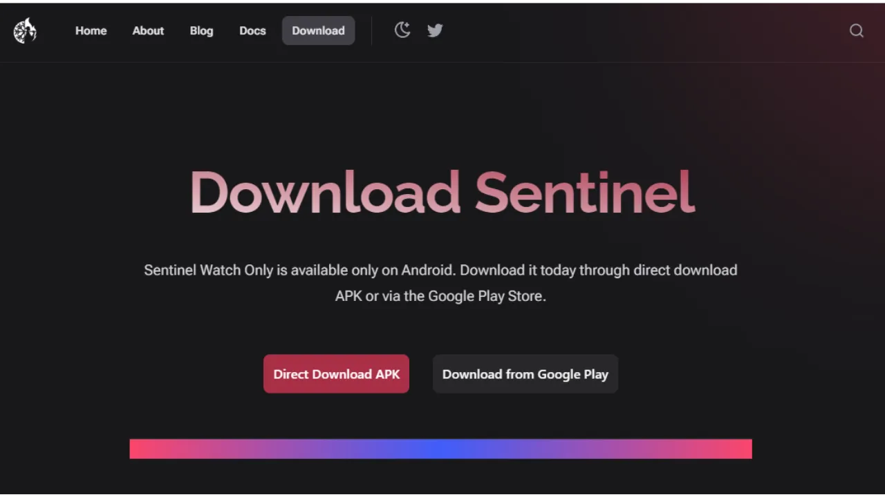

Khi mở ứng dụng lần đầu, bạn được lựa chọn giữa:
- `Kết nối với Dojo - Conncet to Dojo`;
- `Kết nối với máy chủ của Samourai - Connect to Samourai's Server`.

Dojo, được phát triển bởi nhóm Samourai, là phiên bản node Bitcoin đầy đủ có thể được cài đặt độc lập hoặc thêm vào giải pháp node-in-box chỉ với một cú nhấp chuột như [Umbrel](https://umbrel.com/) và [RoninDojo](https://ronindojo.io/).

[**-> Tìm hiểu cách cài đặt RoninDojo v2 trên Raspberry Pi.**](https://planb.network/en/tutorials/node/ronin-dojo-v2)

Nếu bạn có Dojo của riêng mình, bạn có thể kết nối với nó ở giai đoạn này. Bằng cách này, bạn sẽ được hưởng mức độ riêng tư cao nhất khi kiểm tra thông tin giao dịch của mình trên mạng Bitcoin.

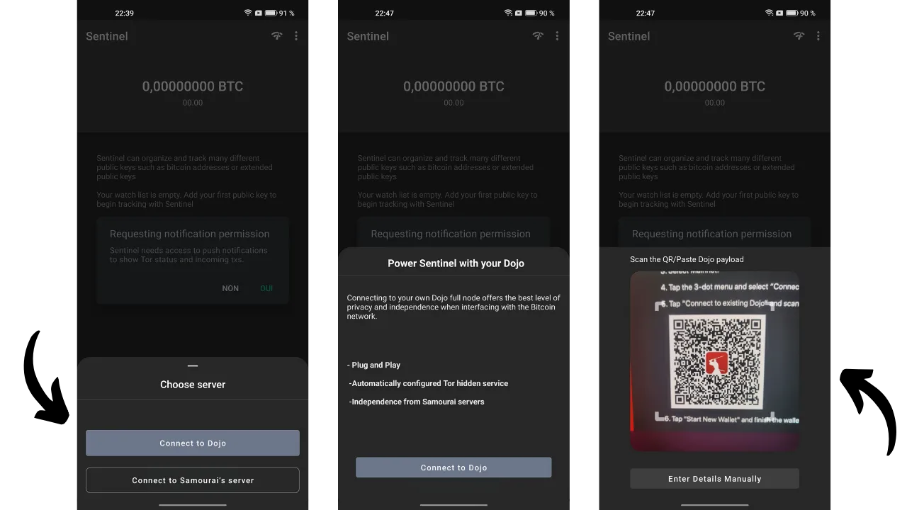

Nếu không, bạn có thể chọn máy chủ mặc định của Samourai. Bạn cũng có thể chọn liệu có kết nối qua Tor hay không.

Sau đó, bạn sẽ đến trang chính của Sentinel.

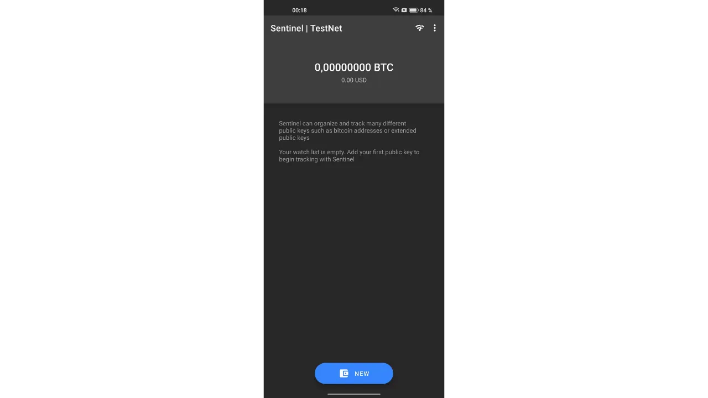

Để bắt đầu, bạn có thể thiết lập ứng dụng. Nhấn vào biểu tượng ba chấm nhỏ ở góc trên bên phải, sau đó chọn `Cài đặt - Settings`.

Bằng cách chọn `Mã PIN của người dùng - User PIN code`, bạn có tùy chọn thiết lập mật khẩu để bảo vệ quyền truy cập vào ví chỉ xem của mình. Bạn cũng có thể thay đổi tiền tệ tham chiếu để chuyển đổi số dư của mình thành một đồng tiền pháp định, hoặc thậm chí ẩn giá trị bằng cách kích hoạt tùy chọn `Ẩn giá trị theo tiền pháp định - Hide fiat values`. Để tăng cường bảo mật, bạn có thể kích hoạt `Vô hiệu hóa chụp màn hình - Disable Screenshorts`, điều này ngăn chặn việc chụp màn hình bất kỳ trang nào của ứng dụng Sentinel và do đó tránh được việc tiết lộ thông tin trên màn hình ra bên ngoài.

Trong menu cài đặt này, bạn cũng có tùy chọn sao lưu Sentinel của mình.

### Sử dụng ví chỉ xem
Từ trang chủ, nhấn nút màu xanh `MỚI - NEW` để thêm một khóa công khai mở rộng mới và theo dõi. Sau đó, bạn có tùy chọn quét mã QR khóa công khai mở rộng của mình, hoặc trực tiếp dán khóa (`xpub`, `zpub`...) bằng cách chọn `Dán Pubkey - Paste Pubkey`.

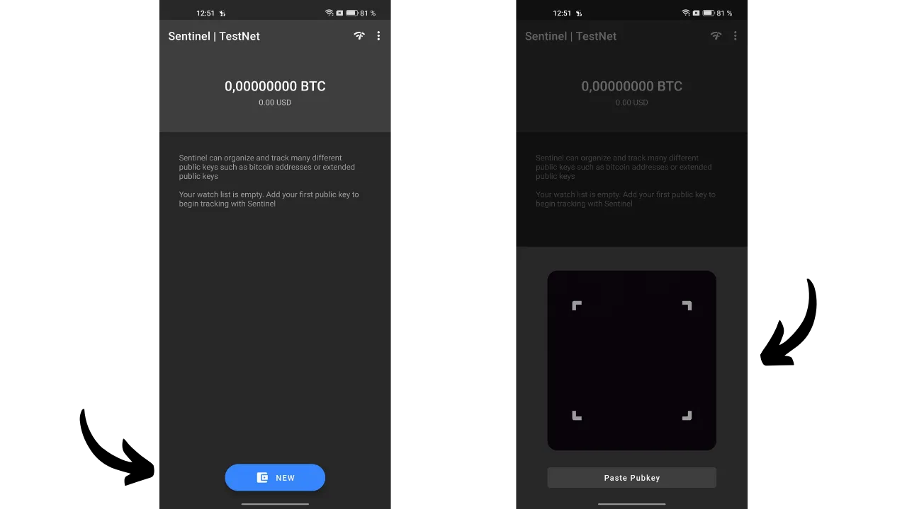

Thông thường, `xpub` ví của bạn có thể truy cập trực tiếp qua phần mềm quản lý ví mà bạn sử dụng. Ví dụ, nếu bạn quản lý ví phần cứng của mình với Sparrow, thông tin này được tìm thấy trong tab `Cài đặt - Settings`, dưới phần `Khoá - Keystore`. 

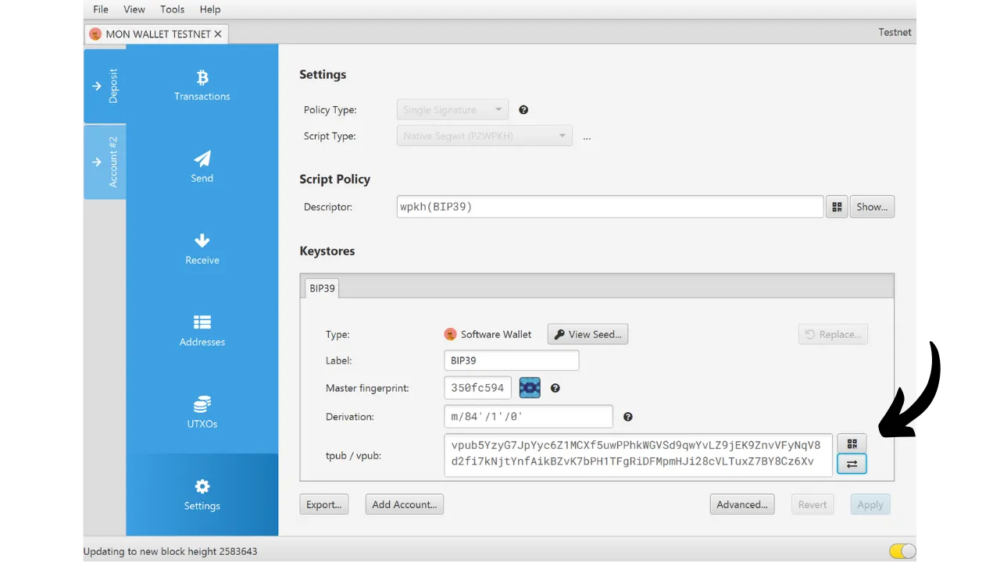
Sau khi nhập khóa công khai mở rộng vào Sentinel, ứng dụng đề xuất bạn tạo một bộ sưu tập mới. Một bộ sưu tập đại diện cho một tập hợp các khóa công khai mở rộng được nhóm lại cùng nhau. Tùy chọn này cho phép bạn không chỉ liệt kê tất cả các `xpubs` của mình, mà còn phân loại chúng một cách có tổ chức. Ví dụ, nếu bạn có một ví Samourai với nhiều tài khoản (tiền gửi, premix, postmix...), bạn có thể tập hợp tất cả các tài khoản này dưới bộ sưu tập `Samourai`. Đối với các ví quản lý cho gia đình của bạn, bạn có thể tạo một bộ sưu tập có tên `Gia đình`.
Chọn `Tạo bộ sưu tập mới - Create new collection`. Sau đó nhập tên cho khóa mở rộng bạn vừa tích hợp. Ví dụ, nếu tôi quét tài khoản tiền gửi trong ví Samourai của mình, tôi sẽ đặt tên cho khóa này là `Tiền gửi`. Nhấn vào `LƯU - SAVE` để hoàn tất.

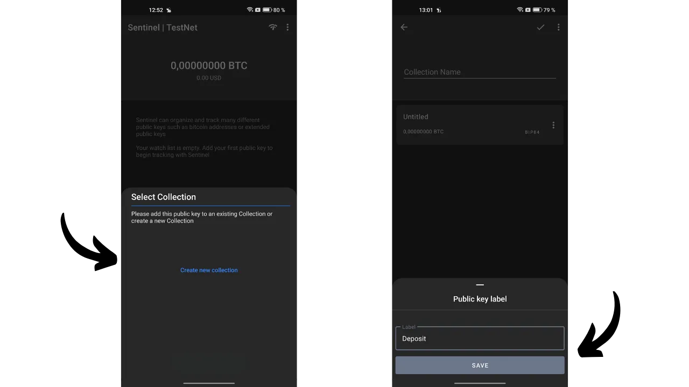

Tiếp theo, gán tên cho bộ sưu tập này và nhấn vào biểu tượng xác nhận ở góc trên bên phải của màn hình để lưu bộ sưu tập. Giờ đây, bộ sưu tập của bạn đã được hiển thị trên màn hình chính của Sentinel.

Nếu bạn muốn thêm một khóa công khai mở rộng khác, nhấn vào `MỚI - NEW` một lần nữa và nhập khóa của bạn.

Sau đó, bạn sẽ được yêu cầu chọn bộ sưu tập mà bạn muốn tích hợp khóa này vào, hoặc tạo một cái mới. Ví dụ, trong trường hợp của tôi, tôi đã thiết lập một bộ sưu tập cụ thể cho ví Ledger của mình.

Để xem chi tiết các khóa mở rộng của một bộ sưu tập, chỉ cần nhấn vào nó. Sau đó, bạn có thể chuyển qua qua các tab khác nhau để xem lịch sử giao dịch.

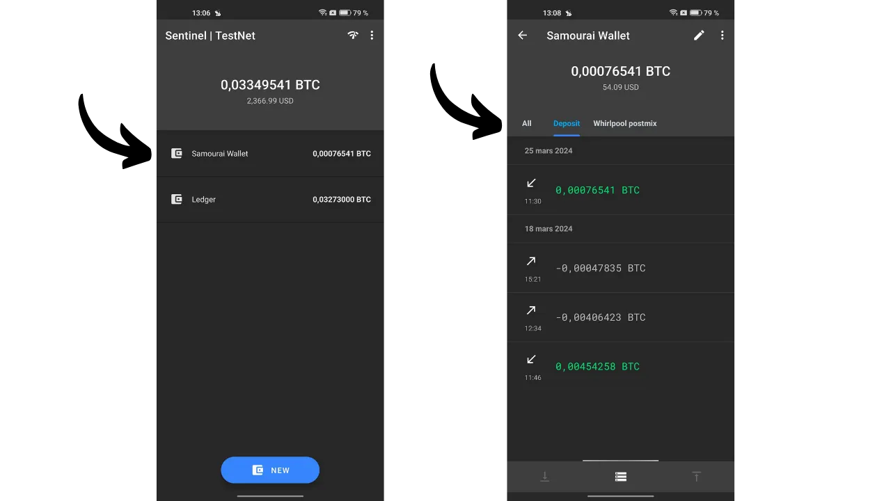

Từ một bộ sưu tập, bằng cách nhấn vào biểu tượng ba chấm nhỏ ở góc trên bên phải, sau đó chọn `Xem đầu ra chưa chi tiêu - View Unspent Output`, bạn có thể truy cập vào danh sách các UTXO được giữ bởi ví được theo dõi.

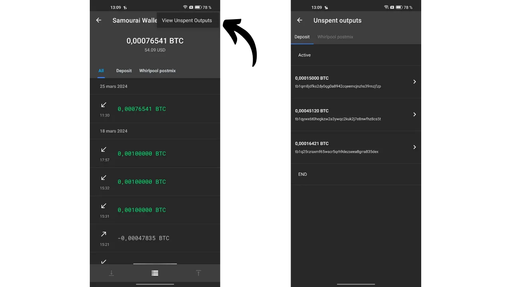

### Gửi và nhận bitcoin từ Sentinel
Như bất kỳ ví chỉ xem có chất lượng tốt nào khác, Sentinel cho phép bạn tạo địa chỉ nhận để nhận bitcoin vào ví được theo dõi. Nhưng Sentinel cũng cung cấp một tính năng nâng cao khác: việc tạo và phát sóng một giao dịch Bitcoin được ký một phần (PSBT). Do đó, ví giữ khóa riêng tư có thể ký giao dịch này, và một khi đã ký, giao dịch đó có thể được phát sóng trên mạng Bitcoin bởi Sentinel. Hãy xem cách thực hiện điều này.

**Cảnh báo, bạn không được khuyến khích nhận bitcoin vào một địa chỉ nhận không được xác minh bởi chính ví nhận.** Nếu ví giữ khóa riêng tư, như một ví cứng, không xác nhận rõ ràng rằng một địa chỉ nhất định thuộc về nó, việc gửi bitcoin đến địa chỉ này là một hành động có rủi ro. Thực vậy, nếu không có xác nhận này, không có gì bảo đảm rằng địa chỉ thực sự thuộc về ví của bạn. Do đó, chức năng nhận của một ví chỉ xem nên được sử dụng một cách cẩn thận, luôn nhớ trong đầu rằng số tiền được gửi vào đây có nguy cơ tiềm ẩn bị mất. 

Để nhận bitcoin qua Sentinel, chọn bộ sưu tập liên quan, sau đó nhấn vào tab tương ứng với khóa công khai mở rộng mà bạn muốn chuyển tiền vào.

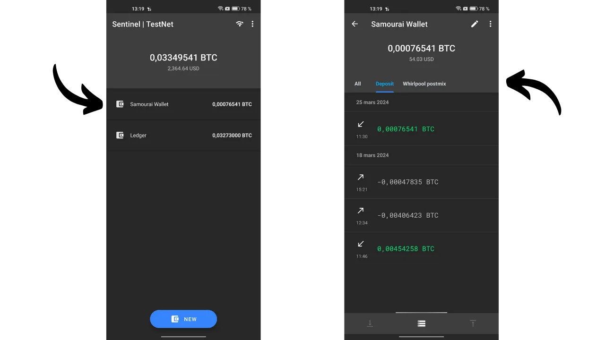

Cuối cùng, nhấn vào biểu tượng mũi tên ở góc dưới bên trái của màn hình. Sentinel sau đó tạo cho bạn một địa chỉ nhận trống. Bạn có thể sao chép nó, hoặc quét nó sử dụng mã QR.

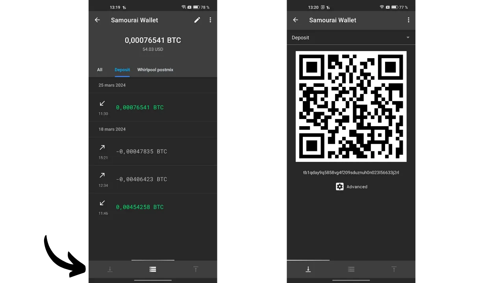
Để tạo một giao dịch bitcoin ký một phần - PSBT từ Sentinel, và từ đó khởi tạo một giao dịch chi tiêu bitcoin, hãy truy cập vào khóa mở rộng của ví từ đó bạn muốn thực hiện thanh toán. Lấy ví dụ, tài khoản tiền gửi trên ví Samourai của tôi. Sau đó, nhấp vào biểu tượng mũi tên nằm ở góc dưới bên phải của màn hình.
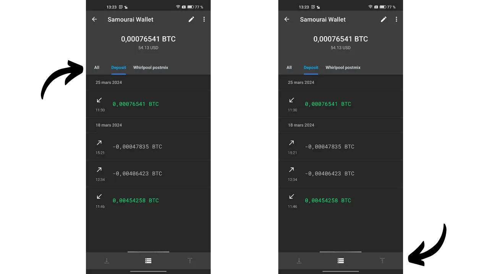

Nhập tất cả các thông số liên quan đến giao dịch của bạn:
- Nhập địa chỉ của người nhận (bằng cách nhấp vào biểu tượng mã QR, bạn có tùy chọn quét địa chỉ này);
- Xác định số tiền gửi đến địa chỉ này;
- Xác định phí giao dịch.

Sau khi bạn đã điền vào tất cả các trường cần thiết cho giao dịch của mình, nhấn vào nút `COMPOSE UNSIGNED TRANSACTION`.

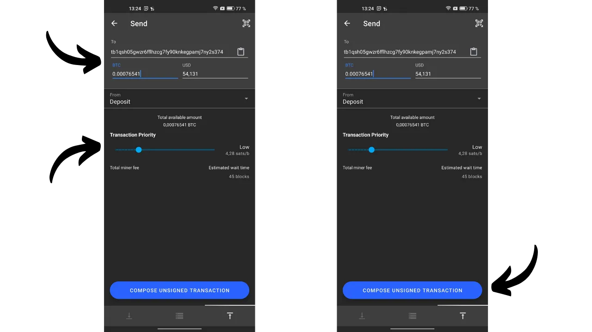

Bạn sẽ truy cập vào PSBT, đại diện cho một giao dịch Bitcoin đã được thiết lập nhưng chưa được ký, vì Sentinel không có quyền truy cập vào khóa riêng tư của bạn. Bạn có tùy chọn để sao chép giao dịch này, xuất nó dưới dạng tệp `.psbt`, hoặc quét nó qua mã QR động.

Sau đó, đi đến ví có khóa riêng tư của bạn để ký giao dịch (Samourai, ví phần cứng...).

Một khi giao dịch được ký, bạn có thể quay trở lại Sentinel để phát sóng nó. Để làm điều này, từ menu chính, nhấp vào biểu tượng ba chấm nhỏ ở góc trên bên phải, sau đó chọn `Phát sóng giao dịch - Broadcast transaction`.

Bạn có tùy chọn nhập PSBT đã ký của mình theo ba cách khác nhau:
- Bằng cách dán trực tiếp từ bộ nhớ tạm của bạn;
- Bằng cách nhập vào từ một tệp `.psbt`;
- Bằng cách quét qua mã QR.

Một khi giao dịch đã ký được nhập vào khung màu xám, bạn có thể nhấp vào nút màu xanh `PHÁT SÓNG GIAO DỊCH - BROADCAST TRANSACTION` để phát sóng nó trên mạng lưới Bitcoin. Sentinel sẽ cung cấp cho bạn TXID của nó.

