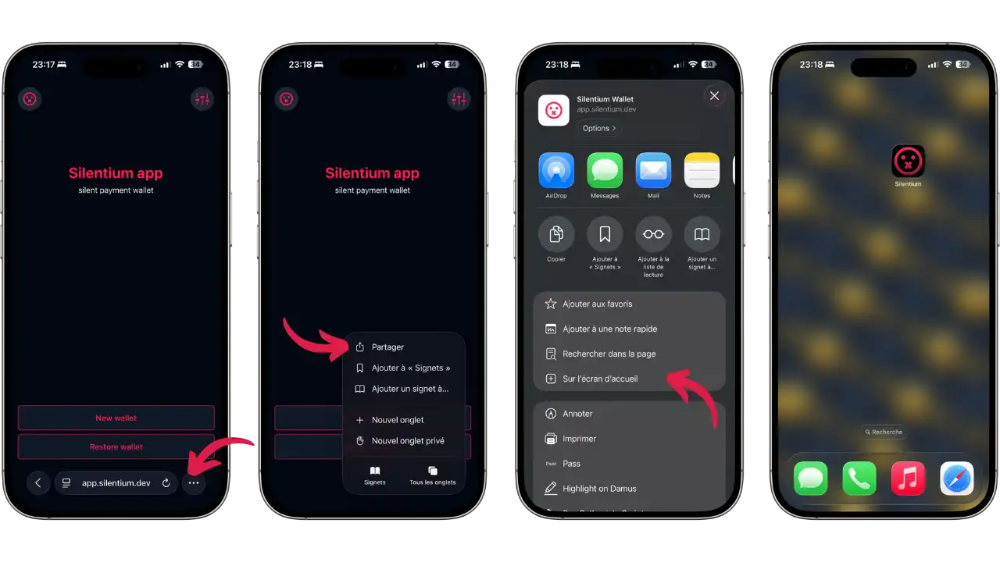
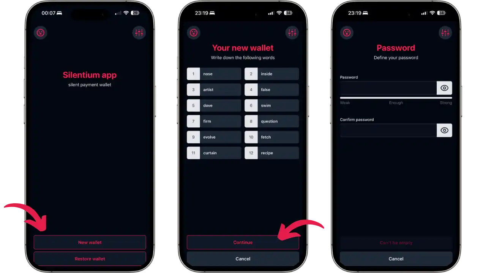
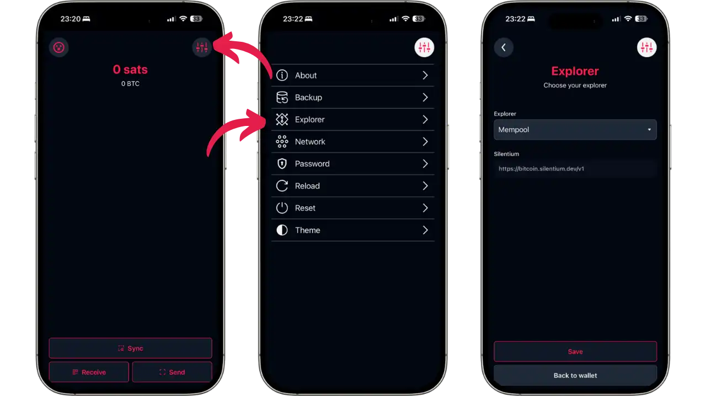
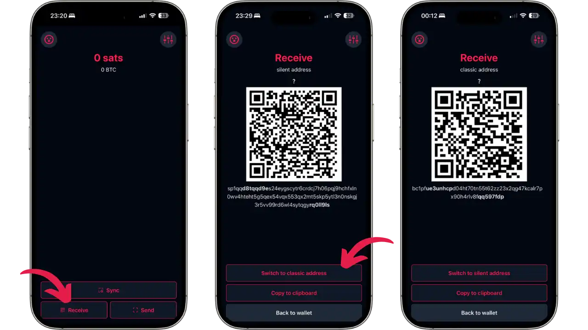
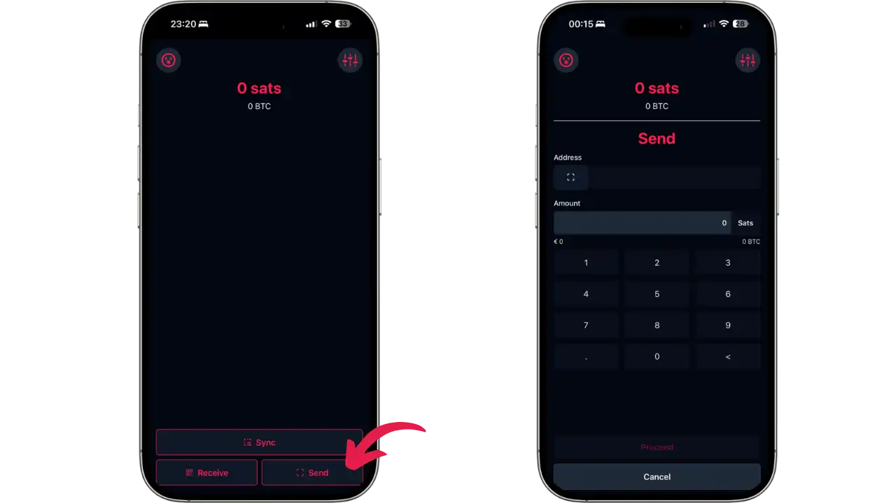

比特币地址的重复使用是用户隐私面临的最直接威胁之一。当收款人使用同一个地址接收多笔付款时，任何观察者都可以追踪所有相关交易并重建其财务历史。这个问题尤其影响到希望公开展示捐赠地址但又不想泄露隐私的内容创作者、慈善机构或活动人士。

Silentium 提供了一种优雅的解决方案来应对这个问题，用户可以直接通过浏览器访问。这款由 Louis Singer 于 2024 年 5 月发布的开源渐进式网页应用 (PWA) 实现了静默支付 (BIP-352)：一个可重复使用的静态地址，每笔付款最终都会出现在一个单独的区块链地址上，交易之间没有任何事先交互或可观察的关联。

**重要警告**：Silentium 是一个实验性项目，旨在验证静默支付（Silent Payment）轻量级钱包的概念。请勿将其用作日常钱包或存储大量资金。开发者明确声明：

> 使用风险自负。

请注意，此钱包可用作测试网或注册测试。

## 何为 Silentium？

### 理念和目标

Silentium 旨在演示如何在轻量级钱包浏览器中实现静默支付。虽然它也支持传统的比特币地址，但重点在于静默支付，以便用户能够以简单直接的方式体验这项隐私技术。

### 静默支付的工作原理

静默支付 (BIP-352) 使用椭圆曲线 Diffie-Hellman 密钥交换 (ECDH)。接收方生成一个静态地址（主网上的 `sp1...`，测试网上的 `tsp1...`），该地址由两个公钥组成：一个用于检测支付的扫描密钥和一个用于使用支付的支出密钥。

发送者将其私钥与接收方的扫描密钥结合，计算出一个共享密钥，生成一个加密 “调整”（tweak）。将此微调添加到支出密钥中，即可为每笔交易创建一个唯一的 Taproot 地址。接收方使用其私钥扫描密钥重复此计算，即可检测并支出资金，无需任何事先交互。

优点：增强了发送方和接收方的保密性，无需第三方服务器，交易与传统的 Taproot 支付无异。主要缺点：需要对区块链进行大量扫描才能检测支付。

为了了解更多关于静默支付的理论运作原理，请参阅 Plan ₿ Academy 上 BTC 204 课程的最后一部分：

https://planb.academy/courses/65c138b0-4161-4958-bbe3-c12916bc959c

## 支持的平台

Silentium 是一款渐进式网页应用 (PWA)，可通过任何现代浏览器（移动端或桌面端）访问。您可以直接在 `app.silentium.dev` 上使用它，也可以通过浏览器将其安装为原生应用，或将其部署到本地。安装过程直接在浏览器中完成，无需通过官方应用商店。

## 使用网页应用程序

### 访问和安装

[在浏览器中访问 `https://app.silentium.dev/`](https://app.silentium.dev/)。应用将立即加载并显示主屏幕。

要在 iOS 上将其安装为原生应用，请按分享按钮（带向上箭头的方块），然后选择 “On home screen”。在 Android 上，浏览器通常会直接提供 “Add to home screen” 的通知。安装完成后，Silentium 会显示其专属图标，并像原生应用一样运行，但需要连接互联网才能同步交易。



### 创建钱包

首次启动时，选择“创建钱包”生成新钱包，或选择“恢复钱包”从现有助记词恢复钱包。

选择 “Create Wallet”。应用会生成一个 12 个单词的助记词，您必须仔细记下。这是恢复资金的唯一方法。即使在测试网上，也请养成良好的备份习惯。保存助记词后，点击 “Restore Wallet”。

然后，应用会要求您设置密码以保护钱包访问。请选择一个强密码并确认。



确认助记词并设置密码后，您将进入主界面。

### 主界面及参数

主界面以聪（初始值为 0 聪）显示您的余额，底部有三个按钮：

- **Sync**：将钱包与区块链同步
- **Receive**：接收资金
- **Send**：发送比特币

点击右上角图标（三条横线）访问设置。“Settings” 选单提供以下几个选项：

- **About**：应用程序信息
- **Backup**：恢复短语备份
- **Explorer**：选择区块链浏览器（默认 Mempool）和 Silentiumd 服务器
- **Network**：选择网络（主网/测试网）
- **Password**：修改密码
- **Reload**：重新加载钱包
- **Reset**：完全重置
- **Theme**：更改主题



**Explorer** 部分尤为重要：它可以让您选择使用的区块链资源管理器（默认为 Mempool），还可以显示 Silentiumd 服务器的 URL（mainnet 为 `https://bitcoin.silentium.dev/v1`）。如果您托管自己的 Silentiumd 服务器或希望使用 testnet，就可以在这里配置这些参数。

### 接收资金

在主界面中，按下 “Receive” 按钮。默认情况下，Silentium 会显示静默支付地址及其二维码。主网上的地址以 `sp1...` 为开头，测试网上的地址以 `tsp1...` 为开头。

您可以使用屏幕底部的 “Switch to classic address" / "Switch to silent address" 按钮在静默支付地址和传统比特币地址之间切换。



交易广播完成后，请稍等片刻。对于静默支付，Silentium 会自动扫描区块链，查找发给您的交易。交易状态会显示为 “Unconfirmed”，然后逐步确认。

### 发送付款

在主界面上，点击 “Send” 按钮。发送界面会提示您：

1. **Address**：粘贴静默支付地址（`sp1...` 或 `tsp1...`）或传统的比特币地址。您可以使用二维码描图标扫描地址。

2. **Amount**：输入要发送的金额（单位：聪）。数字键盘显示，便于输入。顶部显示您的可用余额，以供参考。



输入地址和金额后，点击 "Proceed" 以继续。确认交易前，应用程序会要求您选择所需的费用级别。

## 自托管钱包

### 为什么要自助托管？

Silentium 的本地托管提供了完全的主权、代码验证、开发环境以及面对官方网站故障时的恢复能力。

### 前提条件

Node.js（版本 14+）、npm 或 yarn、Git 以及大约 500 MB 的磁盘空间。

### 本地安装

克隆此代码仓库并安装：

```bash
git clone https://github.com/louisinger/silentium.git
cd silentium
yarn install
```

### 启动和使用

以开发模式启动应用程序：

```bash
yarn start
```

在浏览器中访问 `http://localhost:3000`。如需优化生产版本 ：

```bash
yarn build
```

在 `build/` 中生成的文件可以使用 nginx、Apache 或任何网络服务器。默认情况下，Silentium 连接到公共的 `bitcoin.silentium.dev` 服务器。修改参数中的设置，使用 testnet 或您自己的服务器。

## Silentiumd 服务器

### 作用和操作

Silentium 使用 **Silentiumd** 索引服务器来优化支付检测。扫描所有 Taproot 交易对于浏览器或手机来说过于繁琐。

Silentiumd 会预先计算每笔 Taproot 交易的中间数据（调整值）。您的钱包会下载这些微调值（每笔交易几个字节），并在本地执行最终计算，以验证支付的所有权。与传统的 Electrum 服务器不同，该服务器永远不会知道您的密钥，也无法识别您的交易。

紧凑型 BIP158 过滤器允许您的钱包在不泄露您的地址的情况下确定要扫描哪些区块，从而保护您的隐私。

### 公共服务器

由 Vulpem Ventures 赞助的公共服务器 `bitcoin.silentium.dev`（主网）提供简单快捷的使用体验。虽然这种方式可以保护隐私，但也意味着对第三方基础设施有一定的信任。

### 自行搭建 Silentiumd 服务器

为了完全掌控您的数据，您可以自行搭建 Silentiumd 服务器。前提条件：Bitcoin Core 非 elagged 节点，并设置 `txindex=1` 和 `blockfilterindex=1`；Go 1.21+；10-20 GB 磁盘空间；系统管理技能。

**安装步骤：**

```bash
git clone https://github.com/louisinger/silentiumd.git
cd silentiumd
make build
./build/silentium-[OS]-[ARCH]
```

通过环境变量进行配置（详见版本库的 `config.md`）。服务器会为区块链建立索引，并公开一个 API，供 wallet 查询。

目前还没有针对 Umbrel 或 Start9 的打包解决方案，这限制了非技术用户的使用。

## 优势和限制

### 优点

- **最大程度的易用性**：可在任何浏览器中使用，无需繁琐的安装
- **多平台支持**：借助 PWA 技术，可在移动设备（Android/iOS）和桌面设备上运行
- **简易的自托管**：只需几条命令即可在本地安装
- **开源**：代码完全可审计，托管于 GitHub
- **注重隐私**：无追踪，无分析，本地加密计算
- **独立架构**：钱包（客户端）和索引服务器完全分离
- **无需账户**：无需注册或提供任何个人数据

### 需要考虑的限制

- **实验性项目**：仅用于概念验证，不适用于日常使用或生产环境
- **不提供任何保证**：存在漏洞、缺陷和资金损失的风险
- **支持有限**：用户文档较少，社区规模较小，无官方支持
- **服务器依赖**：需要一个可用的 Silentiumd 服务器（公共服务器或自托管服务器）
- **密集扫描**：静默支付检测会消耗带宽
- **功能受限**：不支持币种控制，不支持闪电网络禁止多重签名

## 最佳实践

### 助记词安全

即使在测试网上，也务必认真对待您的助记词。请将其写下来并妥善保管。测试网和主网使用不同的钱包：切勿在用于存放真实资金的钱包中使用测试助记词。

### 源代码验证

自托管的优势之一是能够在运行前检查源代码。如果您计划使用 Silentium 处理真实资金，请务必花时间审核代码，或请一位值得信赖的开发者进行审核。此外，请将部署在 `app.silentium.dev` 上的代码哈希值与 GitHub 代码库的哈希值进行比较，以确保其真实性。

### 备份和恢复

静默支付资金恢复需要使用兼容 BIP-352 协议的钱包。标准钱包无法扫描区块链来检索您的 UTXO 静默支付。请保持 Silentium 的安装状态，或确保您可以使用其他兼容的钱包（例如 Cake Wallet 或其他未来的实现）在必要时恢复您的资金。

## 结论

Silentium 提供了一个易于理解的测试平台，让您能够轻松掌握静默支付 (Silent Payments) 技术。作为概念验证，它展示了如何在保持用户自主保管的同时，将这项隐私技术集成到钱包浏览器中。在测试网上进行实验，探索这项极具前景的链上隐私突破。

## 资源

### 官方文档

- Silentium GitHub 代码库（钱包）：https://github.com/louisinger/silentium
- Silentiumd GitHub 代码库（服务器）：https://github.com/louisinger/silentiumd
- 网页应用程序：https://app.silentium.dev/
- 静默支付社区网站：https://silentpayments.xyz
- BIP-352 规范：https://bips.dev/352

### 文章和资源

- 官方公告（Twitter）：https://x.com/TheSingerLouis/status/1790824126472667227
- NoBS Bitcoin：https://www.nobsbitcoin.com/silentium-silent-payments/
- Bitcoin Optech - Silent Payments：https://bitcoinops.org/en/topics/silent-payments/

### 测试网工具


- 测试网工具水龙头：https://testnet-faucet.com/
- Mempool 测试网浏览器: https://mempool.space/testnet
