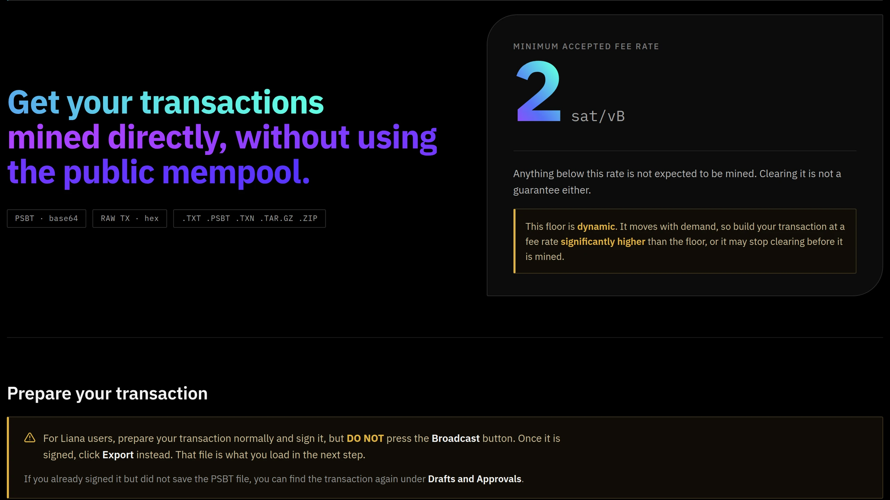

โดยปกติ เมื่อคุณลงนามธุรกรรม ธุรกรรมนั้นจะถูก broadcast โดยอัตโนมัติไปยังทุก node ของ Bitcoin บนเครือข่าย จากนั้นจึงรอให้ถูกขุด

อย่างไรก็ตาม ตราบใดที่ธุรกรรมยังไม่ได้อยู่ในบล็อก ผู้โจมตีที่ได้ private key ของคุณไปสามารถแทนที่ธุรกรรมนั้นและขโมยเงินได้ นี่มักเป็นกรณีหากคุณใช้ ColdCard hardware wallet

เครื่องมือ Slipstream จากบริษัทขุด MARA ช่วยให้คุณข้ามการ broadcast ธุรกรรมไปยังเครือข่ายได้: ธุรกรรมจะถูกส่งโดยตรง (และส่งไปเท่านั้น) ไปยังนักขุด ซึ่งจะเก็บธุรกรรมไว้เป็นส่วนตัวและหลีกเลี่ยงการเปิดเผยบนเครือข่าย ธุรกรรมน่าจะใช้เวลานานกว่าจะถูกขุด แต่จะได้รับการป้องกันจากการโจมตีแบบแทนที่ธุรกรรม

ด้านล่างนี้ เรามีบทแนะนำที่ช่วยให้ผู้ใช้ [Liana](https://planb.academy/tutorials/wallet/desktop/liana-306ef457-700c-4fdd-b07a-8fb7a8a29f04) รวมถึงผู้ใช้ wallet [Sparrow](https://planb.academy/tutorials/wallet/desktop/sparrow-c674e2ac-d46f-4c82-92a7-7d1b0e262f5d) สามารถใช้เครื่องมือ Slipstream ของ miner MARA ผ่านหน้า [outofband.wizardsardine.com](https://outofband.wizardsardine.com/) ได้

⚠️ **คำเตือน**: เครื่องมือนี้มีไว้สำหรับโปรไฟล์บางประเภทเท่านั้น โดยหลักคือ Liana wallets, miniscript wallets และ multisig บางประเภท Wizardsardine **แนะนำอย่างชัดเจนว่าไม่ควร** ใช้กับ wallet ที่เงินมีความเสี่ยงถูกขโมยในระดับวิกฤตอยู่แล้ว เช่น wallet ที่ recovery phrase ถูกสร้างบนอุปกรณ์ ColdCard ที่ได้รับผลกระทบจากช่องโหว่ของตัวสร้างเลขสุ่ม ในสถานการณ์นั้น การแข่งกับผู้โจมตีเป็นเรื่องของไม่กี่วินาที และธุรกรรมที่ส่งไปยังนักขุดเพียงรายเดียวใช้เวลายืนยันนานกว่าธุรกรรมที่ broadcast ตามปกติมาก หากเรื่องนี้เกี่ยวข้องกับคุณ โปรดอ่านบทแนะนำเฉพาะของเราก่อน:

https://planb.academy/tutorials/wallet/hardware/coldcard-seed-vulnerability-1348b153-89db-429c-80af-b5d3d8506b9a

## สำหรับผู้ใช้ Liana

Liana ดูแลโดย Wizardsardine ผู้เผยแพร่หน้า [outofband.wizardsardine.com](https://outofband.wizardsardine.com/) ดังนั้นเส้นทางจึงตรงไปตรงมา: คุณเพียงส่งออกไฟล์ PSBT ที่ลงนามแล้วแทนการ broadcast

*ข้อกำหนดเบื้องต้น: มีเงินอยู่ใน Liana wallet ของคุณ*

### ขั้นตอนที่ 1: สร้างธุรกรรมของคุณด้วย Liana

ตามปกติ ให้สร้างธุรกรรมของคุณโดยเพิ่มที่อยู่ปลายทาง คำอธิบาย และจำนวนเงิน (ในที่นี้คือจำนวนสูงสุดที่มีอยู่ใน wallet)

ในการตั้งค่าอัตราค่าธรรมเนียม:

- เลือก coins ที่คุณต้องการใช้จ่ายโดยคลิกกล่องเล็กที่ด้านล่างซ้าย ใต้ "Coins selection";
- จากนั้นป้อนอัตราค่าธรรมเนียม อย่าลืมตั้งค่าธรรมเนียมให้สูงกว่าอัตราที่แนะนำมาก ตามที่อธิบายไว้ในหน้านี้: [outofband.wizardsardine.com](https://outofband.wizardsardine.com/).

สุดท้าย คลิก "Next"

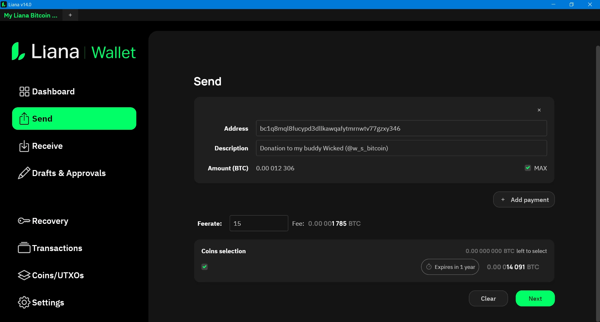

### ขั้นตอนที่ 2: ตรวจสอบรายละเอียดธุรกรรมของคุณ

ก่อนคลิก "Sign" ให้ตรวจสอบรายละเอียดธุรกรรมของคุณ โดยเฉพาะ:

- จำนวนเงินที่ส่ง;
- จำนวน satoshi ที่จัดสรรให้ค่าธรรมเนียมธุรกรรม;
- แต่ที่สำคัญที่สุดคือ ที่อยู่ที่คุณกำลังส่งเงินไป (อย่าลืมตรวจสอบอักขระ 5/6 ตัวแรก, 5/6 ตัวสุดท้าย และอักขระ 5/6 ตัวตรงกลางของที่อยู่ เพื่อหลีกเลี่ยงการโจมตีแบบ "address poisoning").

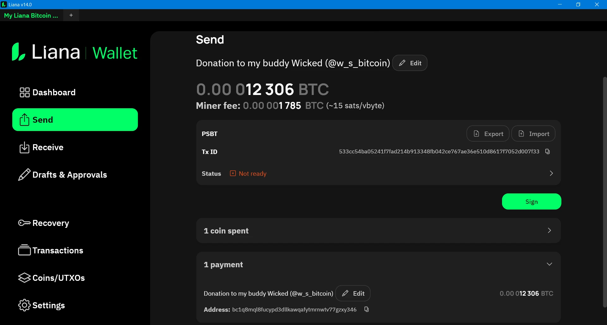

### ขั้นตอนที่ 3: เลือก wallet สำหรับการลงนาม

ถัดไป เลือก software wallet และ/หรือ hardware wallet ที่คุณต้องใช้เพื่อลงนามธุรกรรมของคุณ ขอเตือนสั้น ๆ: ในกรณีของ 2-of-2 multisig wallet คุณต้องมีลายเซ็น 2 จาก 2 รายการ

### ขั้นตอนที่ 4: ส่งออกไฟล์ PSBT ของธุรกรรมของคุณ

ตอนนี้ธุรกรรม Bitcoin ได้รับการลงนามด้วยคีย์ที่เหมาะสมแล้ว อย่าคลิก "Broadcast" มิฉะนั้นธุรกรรมจะถูกแชร์กับทั้งเครือข่าย และหากคุณใช้ ColdCard hardware wallet ธุรกรรมของคุณจะถูกเปิดเผยต่อสาธารณะและเงินของคุณจะตกอยู่ในความเสี่ยง

ตอนนี้คุณสามารถคลิก "Export" จากนั้นบันทึกไฟล์ PSBT ไว้ในเครื่องบนคอมพิวเตอร์ของคุณ

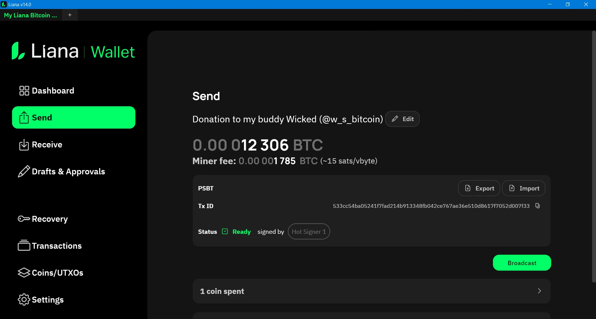

### ขั้นตอนที่ 5: ส่งธุรกรรมไปยังนักขุดผ่าน outofband.wizardsardine.com

ตอนนี้มาถึงขั้นตอนสุดท้ายแล้ว ในการส่งธุรกรรมไปยังนักขุด สิ่งที่คุณต้องทำคือเอาไฟล์ PSBT แล้วลากและวางลงในพื้นที่ที่กำหนด

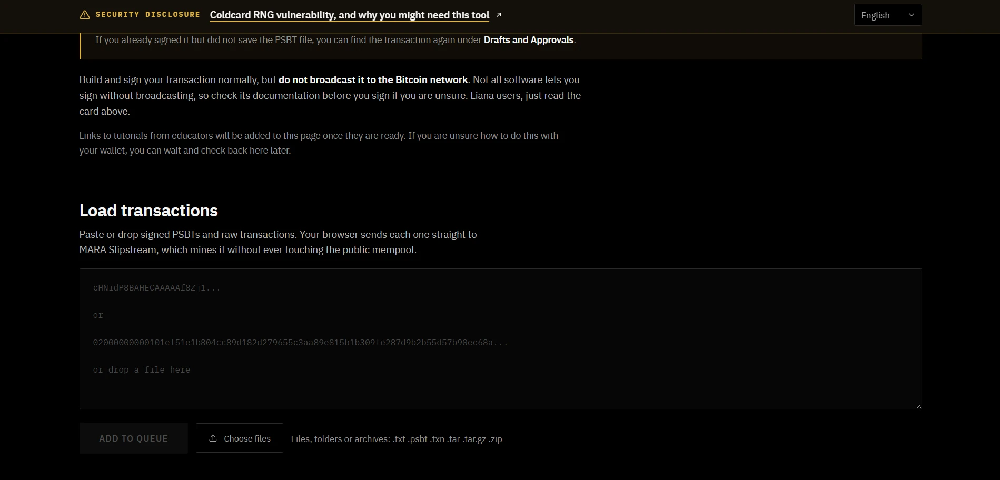

จากนั้นธุรกรรมจะแสดงขึ้นดังด้านล่าง

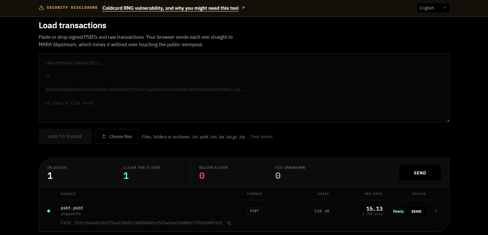

### ขั้นตอนที่ 6: ส่งธุรกรรมผ่าน Slipstream

สุดท้าย สิ่งที่คุณต้องทำคือคลิก "Send" เพื่อให้ธุรกรรมถูกส่งไปยัง MARA ผ่าน Slipstream

ภายในไม่กี่วินาที ธุรกรรมจะเปลี่ยนจาก "Sending" เป็น "Accepted":

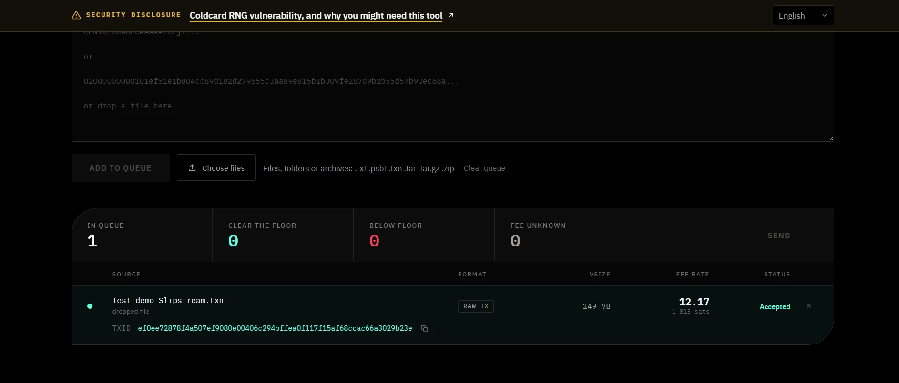

สิ่งที่เหลือคือคัดลอกตัวระบุธุรกรรม (TXID) แล้ววางลงใน [mempool.space](https://mempool.space/) เพื่อเฝ้าดูธุรกรรมนั้นถูกขุด:

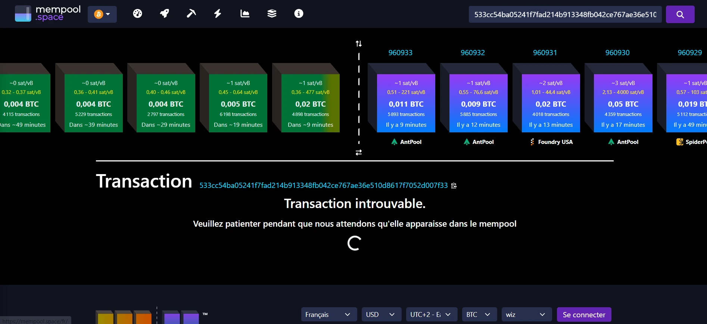

โปรดทราบ: ธุรกรรมจะแสดงเป็น "Transaction not found" จนกว่า miner อย่าง MARA จะขุดบล็อกและรวมธุรกรรมของคุณไว้ในบล็อกนั้น ซึ่งอาจใช้เวลาหลายสิบนาที หรือแม้กระทั่งหลายชั่วโมง เพราะ MARA ถือครอง hash rate ของเครือข่าย Bitcoin เพียงประมาณ 4.5% ณ วันที่ 4 สิงหาคม 2026 สิ่งนี้เทียบเท่ากับการขุดได้ประมาณหนึ่งบล็อกทุก 3 ชั่วโมง 45 นาที

## สำหรับผู้ใช้ wallet อื่น

หากคุณไม่ได้ใช้ [Liana](https://planb.academy/tutorials/wallet/desktop/liana-306ef457-700c-4fdd-b07a-8fb7a8a29f04) แต่ยังต้องการใช้เครื่องมือนี้ นี่คือบทแนะนำที่ใช้ 2-of-2 multisig wallet เพื่อทำสิ่งนี้ เราจะใช้ software wallet [Sparrow](https://planb.academy/tutorials/wallet/desktop/sparrow-c674e2ac-d46f-4c82-92a7-7d1b0e262f5d)

*ข้อกำหนดเบื้องต้น: มีเงินอยู่ใน Sparrow wallet ของคุณ*

### ขั้นตอนที่ 1: สร้างธุรกรรมของคุณ

ด้วย [Sparrow](https://planb.academy/tutorials/wallet/desktop/sparrow-c674e2ac-d46f-4c82-92a7-7d1b0e262f5d) ให้สร้างธุรกรรมบน multisig wallet ของคุณ อย่าลืมตั้งค่าธรรมเนียมให้สูงกว่าอัตราที่แนะนำมาก ตามที่อธิบายไว้ในหน้านี้: [outofband.wizardsardine.com](https://outofband.wizardsardine.com/).

เมื่อสร้างแล้ว ให้คลิก "Create Transaction"

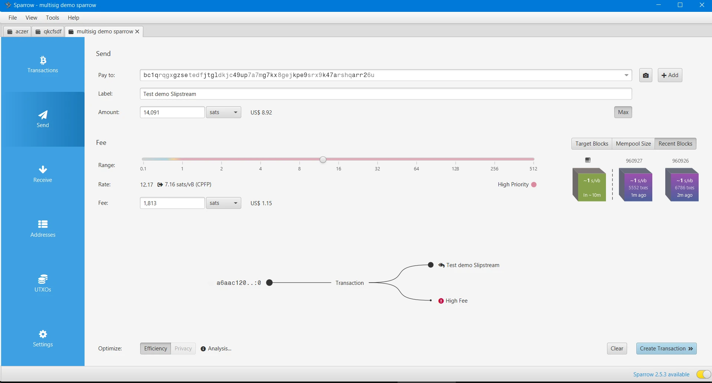

### ขั้นตอนที่ 2: ทำให้ธุรกรรมของคุณเสร็จสมบูรณ์

เพื่อทำให้ธุรกรรมของคุณเสร็จสมบูรณ์ ตอนนี้คุณต้องลงนามธุรกรรมนั้น เมื่อต้องการทำเช่นนี้ ให้คลิก "Finalize Transaction for Signing"

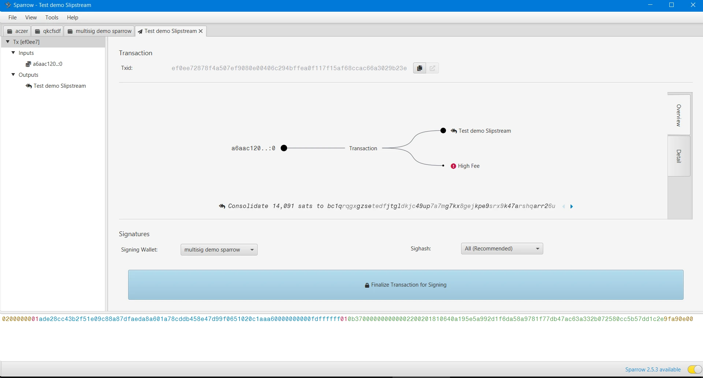

### ขั้นตอนที่ 3: ลงนามธุรกรรมของคุณด้วยคีย์ต่าง ๆ ของคุณ

ตอนนี้ถึงเวลาลงนามธุรกรรมแล้ว เมื่อต้องการทำเช่นนี้ เพียงลงนามด้วย software wallet หรือ hardware wallet ที่คุณใช้

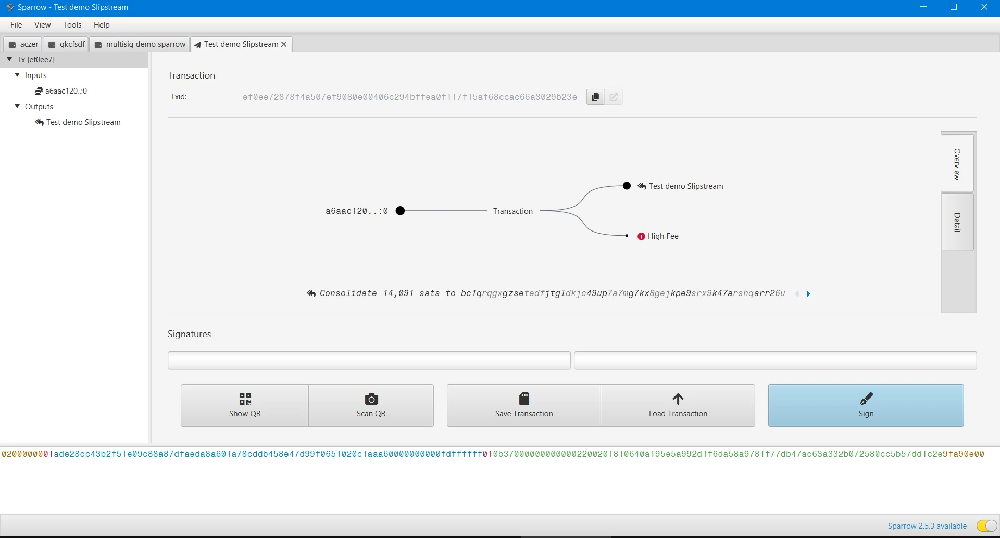

### ขั้นตอนที่ 4: ดาวน์โหลดธุรกรรมที่ลงนามแล้ว และอย่า broadcast ไปยังเครือข่าย

ตอนนี้ธุรกรรม Bitcoin ได้รับการลงนามด้วยคีย์ทั้งสองของ 2-of-2 multisig ของเราแล้ว อย่าคลิก "Broadcast Transaction" มิฉะนั้นธุรกรรมจะถูกแชร์กับทั้งเครือข่าย และหากคุณใช้ ColdCard hardware wallet ธุรกรรมของคุณจะถูกเปิดเผยต่อสาธารณะและเงินของคุณจะตกอยู่ในความเสี่ยง

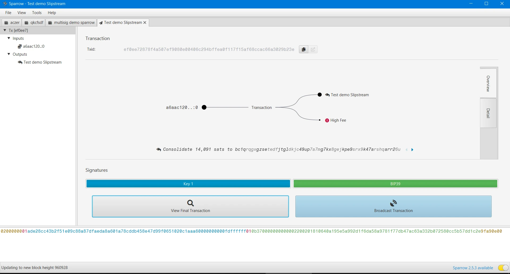

### ขั้นตอนที่ 5: แสดงสคริปต์ธุรกรรมที่ลงนามแล้ว หรือดาวน์โหลดไฟล์ PSBT

หากต้องการแสดงธุรกรรม Bitcoin ที่ลงนามแล้ว ตอนนี้ให้คลิก "View Final Transaction" จากนั้นคุณสามารถคัดลอกสคริปต์ธุรกรรม Bitcoin ที่ลงนามแล้วได้:

*02000000000101ade28cc43b2f51e09c88a87dfaeda8a601a78cddb458e47d99f0651020c1aaa60000000000fdffffff010b370000000000002200201810640a195e5a992d1f6da58a9781f77db47ac63a332b072580cc5b57dd1c2e04004730440220320777c52799cc8015be7c3f724a3d77906ce3d551205c893347910279ed796a02204ee45912623c1c45bf3d93d6558d878737f88f20dcbd152dc28fac80e788f2aa01473044022008bf6ea8432e3fee0eaa7edb923f60e44bb5eb37e52a93d8fdb4e30814340b0f0220473f8fcfbadda9c86fdfc4d3dd55c7883f62312794361e4d4d93f52964bce6520147522102bd28ad9b52829baf62621821abb49339262c7ef32f8adf15bf01b4d91fb5a9a72103ace1a518996275cbf9ebdbeaa4703318a50d5ab7f0fe22b9e566d2f2f644ed3752ae9fa90e00*

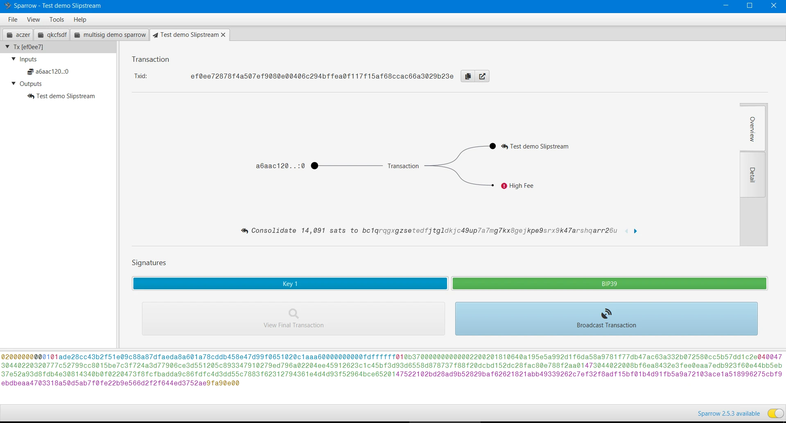

หากคุณต้องการดาวน์โหลดไฟล์ธุรกรรม คุณสามารถทำได้อย่างใดอย่างหนึ่ง:

- คลิก "File" จากนั้น "Save transaction…";
- หรือคลิกปุ่มการเชื่อมต่อเครือข่ายที่ด้านล่างขวา (ปุ่มสีเหลือง) จากนั้นคลิก "Save Final Transaction".

จากนั้นธุรกรรมจะถูกบันทึกไว้ในเครื่องบนคอมพิวเตอร์ของคุณ

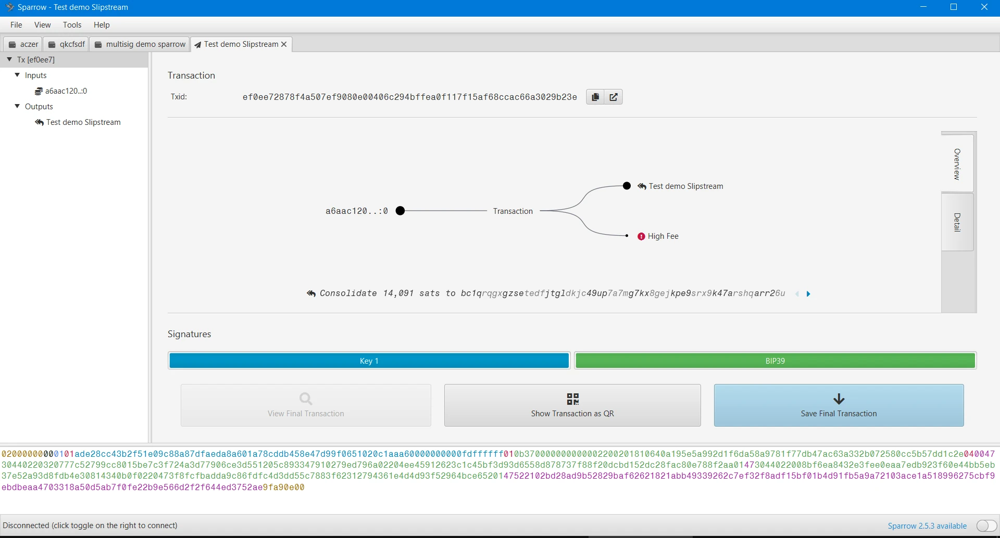

### ขั้นตอนที่ 6: ส่งธุรกรรมไปยังนักขุดผ่าน outofband.wizardsardine.com

ตอนนี้มาถึงขั้นตอนสุดท้ายแล้ว ในการส่งธุรกรรมไปยังนักขุด สิ่งที่คุณต้องทำคือ:

- ไปที่ [outofband.wizardsardine.com](https://outofband.wizardsardine.com/);
- วางสคริปต์ธุรกรรมที่ลงนามแล้วซึ่งคัดลอกในขั้นตอนก่อนหน้า จากนั้นคลิก "ADD TO QUEUE" ด้านล่าง;

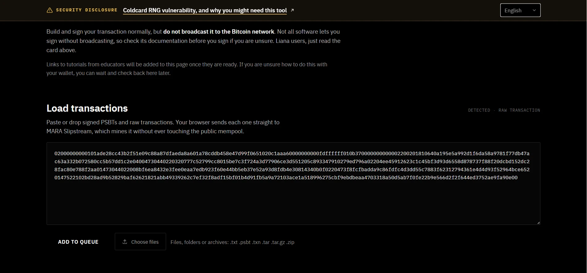

- หรือเอาไฟล์แล้วลากและวางลงในพื้นที่ที่กำหนด

จากนั้นธุรกรรมจะแสดงขึ้นดังด้านล่าง

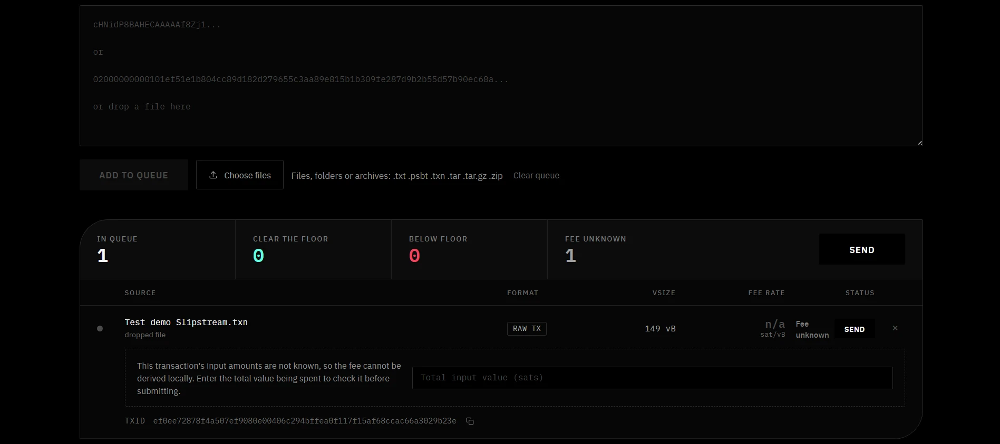

หากมีข้อความแจ้งว่าจำนวน satoshi อินพุตรวมในธุรกรรมของคุณไม่ทราบค่า (และด้วยเหตุนี้ จึงไม่สามารถคำนวณจำนวน satoshi สำหรับค่าธรรมเนียมได้) คุณเพียงต้องป้อนจำนวน satoshi อินพุตรวมด้วยตนเอง หากต้องการค้นหาค่านี้ เพียงคลิกที่การแสดงธุรกรรมของคุณใน Sparrow ตรงกลางของแผนภาพ:

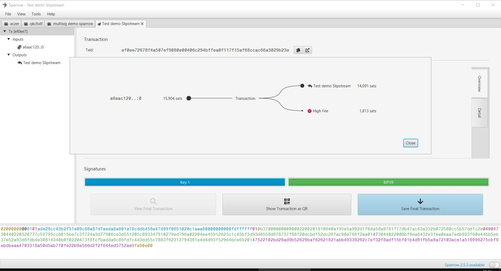

จากนั้นป้อนจำนวนนั้น (15,904 sats ในตัวอย่างของเรา) ลงในเครื่องมือ [outofband.wizardsardine.com](https://outofband.wizardsardine.com/):

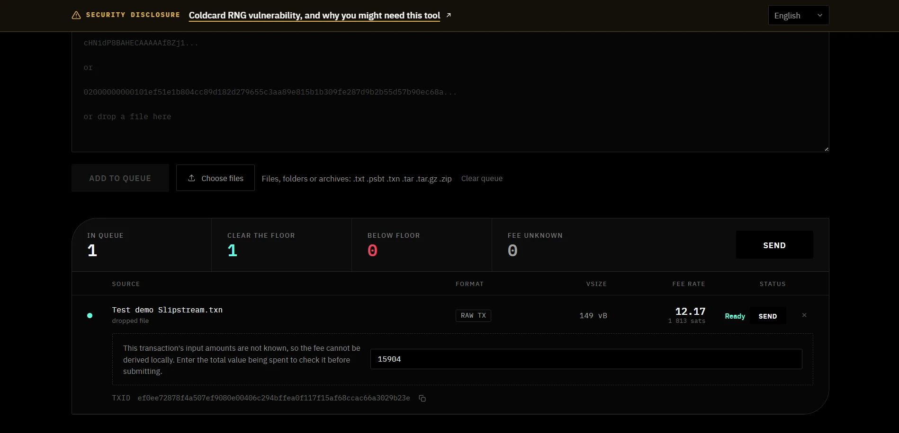

สุดท้าย ตรวจสอบว่าอัตราค่าธรรมเนียมถูกต้อง

### ขั้นตอนที่ 7: ส่งธุรกรรมผ่าน Slipstream

สุดท้าย สิ่งที่คุณต้องทำคือคลิก "Send" เพื่อให้ธุรกรรมถูกส่งไปยัง MARA ผ่าน Slipstream

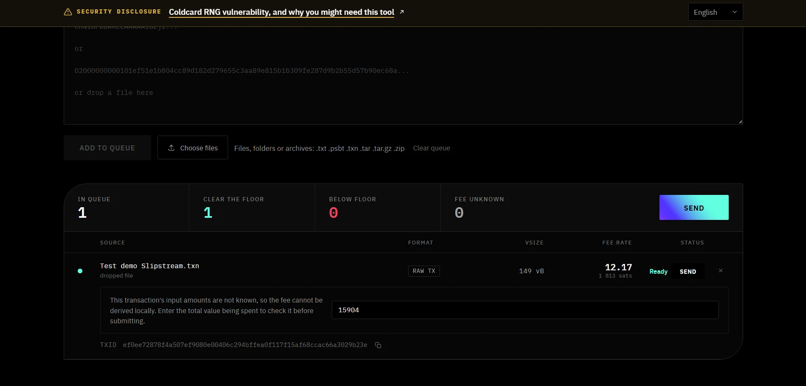

ภายในไม่กี่วินาที ธุรกรรมจะเปลี่ยนจาก "Sending" เป็น "Accepted":

สิ่งที่เหลือคือคัดลอกตัวระบุธุรกรรม (TXID) แล้ววางลงใน [mempool.space](https://mempool.space/) เพื่อเฝ้าดูธุรกรรมนั้นถูกขุด:

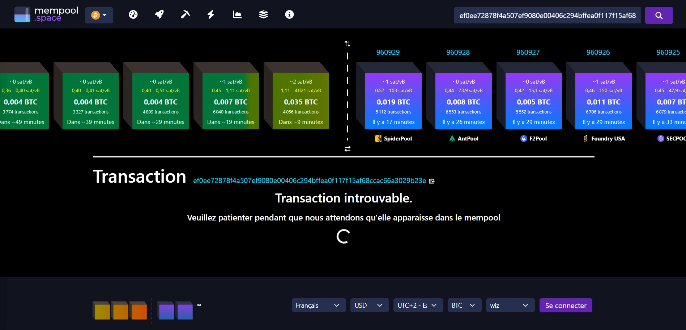

โปรดทราบ: ธุรกรรมจะแสดงเป็น "Transaction not found" จนกว่า miner อย่าง MARA จะขุดบล็อกและรวมธุรกรรมของคุณไว้ในบล็อกนั้น ซึ่งอาจใช้เวลาหลายสิบนาที หรือแม้กระทั่งหลายชั่วโมง เพราะ MARA ถือครอง hash rate ของเครือข่าย Bitcoin เพียงประมาณ 4.5% ณ วันที่ 4 สิงหาคม 2026 สิ่งนี้เทียบเท่ากับการขุดได้ประมาณหนึ่งบล็อกทุก 3 ชั่วโมง 45 นาที
