wallet แบบหลายลายเซ็น (มักเรียกว่า "*Multisig*") คือโครงสร้าง Bitcoin wallet ที่ต้องใช้ลายเซ็นคริปโตหลายลายเซ็นจากกุญแจต่างกันเพื่ออนุมัติการใช้จ่าย ไม่เหมือน wallet แบบทั่วไป ("*singlesig*") ที่กุญแจส่วนตัวเพียงกุญแจเดียวก็เพียงพอในการปลดล็อก UTXO แต่ Multisig ใช้โมเดล **m-of-n**: จากกุญแจ _n_ กุญแจที่เชื่อมกับ wallet ต้องมี _m_ กุญแจร่วมลงนามธุรกรรมแต่ละรายการอย่างจำเป็น

กลไกนี้ทำให้สามารถแบ่งการควบคุม wallet ระหว่างหลายหน่วยงานหรือหลายอุปกรณ์ได้ ตัวอย่างเช่น ในการตั้งค่าแบบ 2-of-3 จะมีการสร้างชุดกุญแจอิสระ 3 ชุด แต่ต้องใช้เพียง 2 ชุดเพื่อปล่อยเงิน สถาปัตยกรรมนี้ลดความเสี่ยงที่เกี่ยวข้องกับการถูกขโมยหรือการสูญหายของกุญแจได้อย่างมาก: ขโมยที่เข้าถึงกุญแจเพียงกุญแจเดียวไม่สามารถทำให้ wallet ว่างได้ และผู้ใช้ที่ทำกุญแจหายหนึ่งชุดก็ยังเข้าถึงเงินของตนได้ด้วยอีกสองชุดที่เหลือ

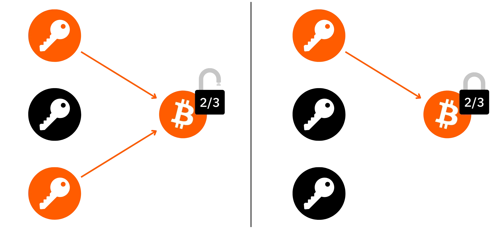

อย่างไรก็ตาม ความปลอดภัยที่มากขึ้นนี้มาพร้อมความซับซ้อนที่มากขึ้น การตั้งค่า Multisig wallet ต้องรักษาความปลอดภัยของวลีช่วยจำหลายชุด (หนึ่งชุดต่อปัจจัยลายเซ็น) และกุญแจสาธารณะแบบขยาย ("*xpub*") อันที่จริง หากคุณใช้ Multisig wallet แบบ 2-of-3 ในการกู้คืน wallet คุณต้องมีวลีช่วยจำทั้งสามชุด หรืออย่างน้อยต้องมีสองชุดจากสามชุด แต่ถ้าคุณมีเพียงสองชุดจากสามชุด คุณยังต้องเข้าถึง *xpubs* ทั้งสามด้วย หากไม่มี จะไม่สามารถกู้คืนกุญแจสาธารณะที่จำเป็นต่อการเข้าถึงบิตคอยน์ที่กุญแจเหล่านั้นปกป้องอยู่ได้

สรุปคือ ในการกู้คืน Multisig wallet คุณต้อง :

- หรือเข้าถึงวลีช่วยจำทั้งหมดที่เชื่อมกับปัจจัยลายเซ็นแต่ละปัจจัย;
- หรือมีวลีช่วยจำจำนวนขั้นต่ำที่ threshold กำหนดเพื่อให้สามารถลงนามได้ และยังต้องเข้าถึง xpubs ของทุกปัจจัยเพื่อกู้คืนกุญแจสาธารณะที่จำเป็น

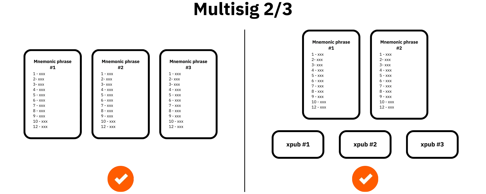

การจัดการข้อมูลสำรองของ Multisig wallet นี้ทำได้ง่ายขึ้นด้วย *Output Script Descriptors* ซึ่งรวมข้อมูลสาธารณะทั้งหมดที่จำเป็นต่อการเข้าถึงเงินไว้ด้วยกัน อย่างไรก็ตาม ฟังก์ชันนี้ยังไม่ได้ถูกนำไปใช้ในซอฟต์แวร์จัดการ wallet ทั้งหมด

Multisig เหมาะเป็นพิเศษกับ bitcoiner ที่ต้องการความปลอดภัยที่สูงขึ้น หรือการจัดการเงินร่วมกัน: บริษัท สมาคม ครอบครัว หรือผู้ใช้รายบุคคลที่ถือบิตคอยน์จำนวนมาก สามารถใช้สร้างรูปแบบการกำกับดูแลแบบกระจายศูนย์ได้ เช่น กระจายอำนาจลงนามให้ผู้จัดการหรือสมาชิกทีมหลายคน

ในบทแนะนำนี้ เราจะเรียนรู้วิธีสร้างและใช้ wallet แบบหลายลายเซ็นคลาสสิกด้วย **Sparrow Wallet** หากคุณต้องการสร้าง wallet แบบหลายลายเซ็นที่ปรับแต่งเองพร้อม timelocks ฉันแนะนำให้ใช้ Liana แทน:

https://planb.academy/tutorials/wallet/desktop/liana-306ef457-700c-4fdd-b07a-8fb7a8a29f04

## ข้อกำหนดเบื้องต้น

สำหรับบทแนะนำนี้ ฉันจะแสดงวิธีสร้าง Multisig ด้วย [ซอฟต์แวร์จัดการ wallet Sparrow Wallet](https://sparrowwallet.com/download/) หากคุณยังไม่ได้ติดตั้งซอฟต์แวร์นี้ กรุณาติดตั้งตอนนี้ หากคุณต้องการความช่วยเหลือ เรามีบทแนะนำโดยละเอียดเกี่ยวกับการกำหนดค่า Sparrow Wallet :

https://planb.academy/tutorials/wallet/desktop/sparrow-c674e2ac-d46f-4c82-92a7-7d1b0e262f5d)

ในการตั้งค่า wallet แบบหลายลายเซ็น คุณต้องใช้ Hardware Wallet หลายเครื่อง ตัวอย่างเช่น สำหรับ Multisig แบบ 2-of-3 คุณสามารถใช้ :

- Trezor Model One;
- Ledger Flex;
- Passport Core.

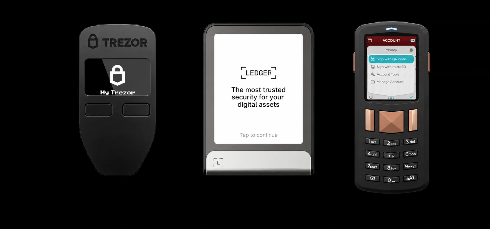

ควรใช้ Hardware Wallet หลายยี่ห้อในการตั้งค่า Multisig ของคุณ วิธีนี้ช่วยให้มั่นใจได้ว่า หากรุ่นใดรุ่นหนึ่งพบปัญหาร้ายแรง จะไม่กระทบความปลอดภัยโดยรวมของ Multisig ของคุณ นอกจากนี้ ยังทำให้คุณได้รับประโยชน์จากข้อดีเฉพาะของแต่ละอุปกรณ์ ตัวอย่างเช่น ในการตั้งค่าของฉัน :

- Trezor Model One เป็นโอเพ่นซอร์สทั้งหมด ซึ่งทำให้สามารถตรวจสอบการสร้าง seed ได้ อย่างไรก็ตาม เนื่องจากไม่ได้ติดตั้ง Secure Element จึงยังคงเปราะบางต่อการโจมตีทางกายภาพ;

- ในทางกลับกัน Ledger Flex ใช้เฟิร์มแวร์กรรมสิทธิ์ที่ตรวจสอบไม่ได้ แต่มี Secure Element ซึ่งให้การป้องกันทางกายภาพที่ยอดเยี่ยม;

- Passport Core รวมเฟิร์มแวร์โอเพ่นซอร์สทั้งหมด Secure Element และการแลกเปลี่ยน QR code แบบ air-gapped ไว้ด้วยกัน เป็นผู้ลงนามอิสระตัวที่สามที่สามารถตรวจสอบที่อยู่และลงนาม PSBTs ได้โดยไม่ต้องเชื่อมต่อข้อมูลผ่าน USB

ก่อนกำหนดค่า Multisig wallet ของคุณ ตรวจสอบให้แน่ใจว่า Hardware Wallet แต่ละเครื่องถูกกำหนดค่าอย่างถูกต้องแล้ว (การสร้างและบันทึกวลีช่วยจำ การตั้งค่า PIN) สำหรับคำแนะนำโดยละเอียด คุณสามารถดูบทแนะนำของเราสำหรับ Hardware Wallet แต่ละเครื่องได้ เช่น :

https://planb.academy/tutorials/wallet/hardware/trezor-model-one-5c250c49-ce3b-4c63-bd05-4600d7c11a02

https://planb.academy/tutorials/wallet/hardware/ledger-flex-3728773e-74d4-4177-b39f-bd923700c76a

https://planb.academy/tutorials/wallet/hardware/passport-74e53858-3fa2-43f9-b866-573297546236

ดังที่เราจะเห็นต่อไปในบทแนะนำนี้ คุณยังสามารถรวมปัจจัยที่ไม่ได้เชื่อมกับ Hardware Wallet เข้ากับการตั้งค่า Multisig ของคุณได้ด้วย โดยกุญแจส่วนตัวของปัจจัยนั้นถูกเก็บไว้บน PC ของคุณ วิธีนี้ปลอดภัยน้อยกว่าการใช้ hardware wallets อย่างเดียวอย่างชัดเจน แต่อาจเหมาะสมในบางกรณี ตัวอย่างเช่น สำหรับ Multisig แบบ 2-of-3 คุณอาจเลือกใช้ hardware wallets สองเครื่องและ Software Wallet หนึ่งตัว

> ⚠️ **ประกาศด้านความปลอดภัยของ Coldcard MK3:** อย่าสร้าง seed ใหม่บน MK3 ที่ใช้เฟิร์มแวร์เก่ากว่า 4.2.0 seed ที่สร้างบนเฟิร์มแวร์เก่ากว่านั้นต้องถูกแทนที่และย้ายเงินออก ดังนั้นบทแนะนำนี้จึงใช้ Passport Core เป็นตัวลงนามอ้างอิงแบบ air-gapped

## การสร้าง Multisig wallet

เปิด Sparrow Wallet คลิกแท็บ "*File*" จากนั้นเลือก "*New Wallet*"

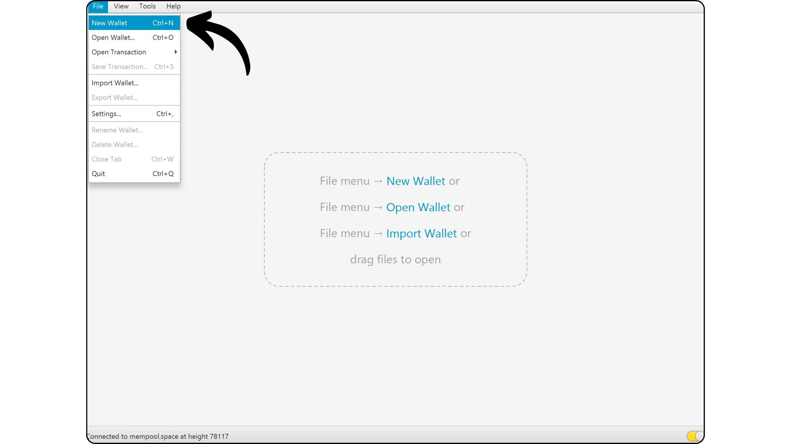

ตั้งชื่อ wallet แบบหลายลายเซ็นของคุณ จากนั้นคลิก "*Create Wallet*" เพื่อยืนยัน

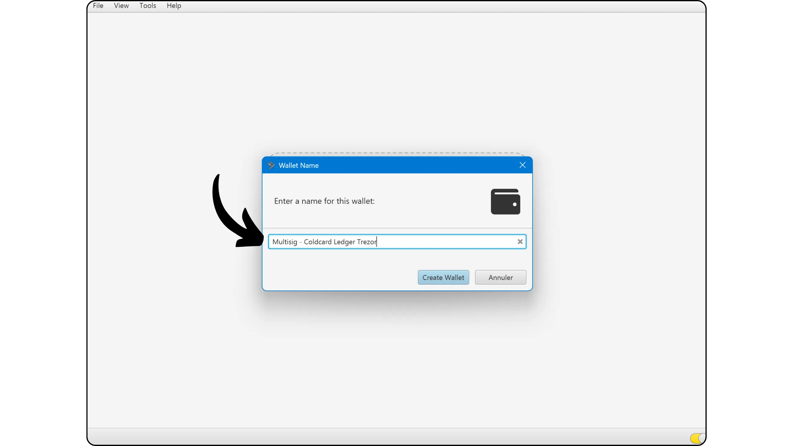

ในเมนูแบบเลื่อนลง "*Policy Type*" ให้เลือกตัวเลือก "*Multi Signature*"

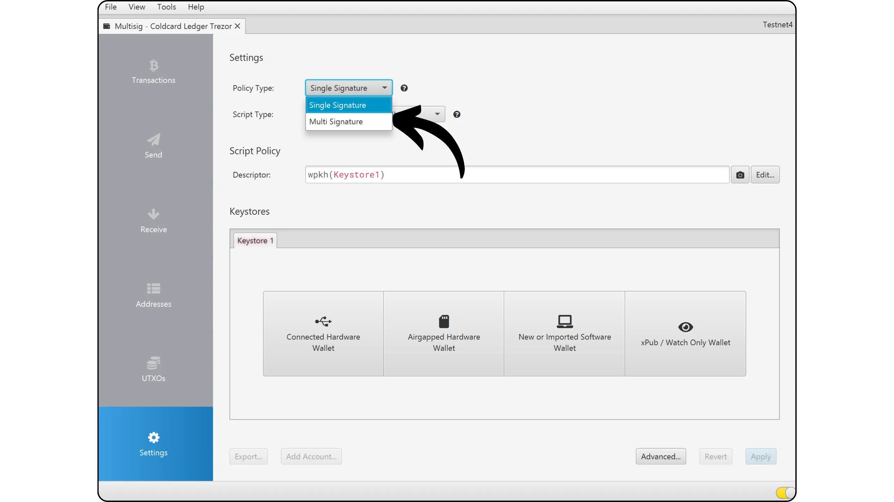

ที่มุมขวาบน ตอนนี้คุณสามารถกำหนดจำนวนกุญแจทั้งหมดใน Multisig ของคุณ รวมถึงจำนวนผู้ร่วมลงนามที่ต้องใช้เพื่ออนุมัติการใช้จ่ายได้ ในตัวอย่างของฉัน นี่คือรูปแบบ 2-of-3

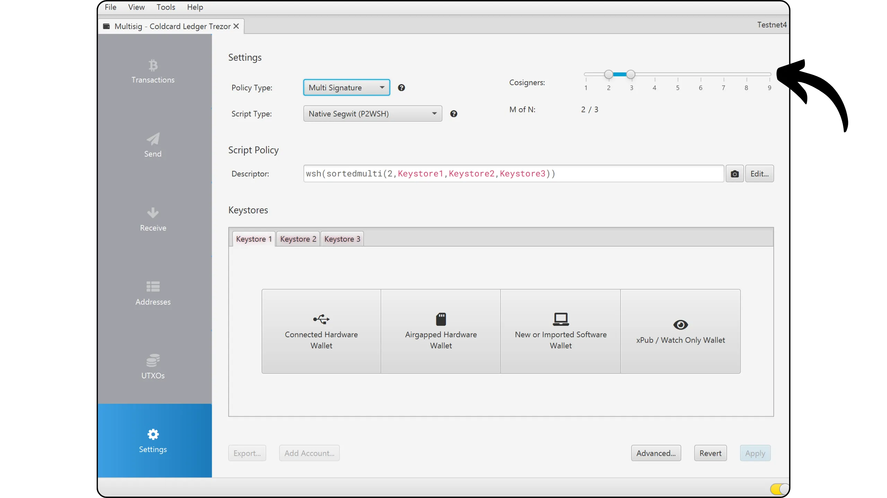

ที่ด้านล่างของหน้าต่าง Sparrow Wallet จะแสดง "*Keystore*" สามรายการ แต่ละรายการแทนชุดกุญแจหนึ่งชุด ที่นี่ ฉันใช้ hardware wallets สามเครื่อง ดังนั้น "*Keystore*" แต่ละรายการจึงสอดคล้องกับเครื่องหนึ่ง เราจะกำหนดค่ารายการเหล่านี้ตอนนี้

ฉันเริ่มด้วย Passport Core ในแท็บ "*Keystore 1*" ฉันเลือกตัวเลือก "*Airgapped Hardware Wallet*"

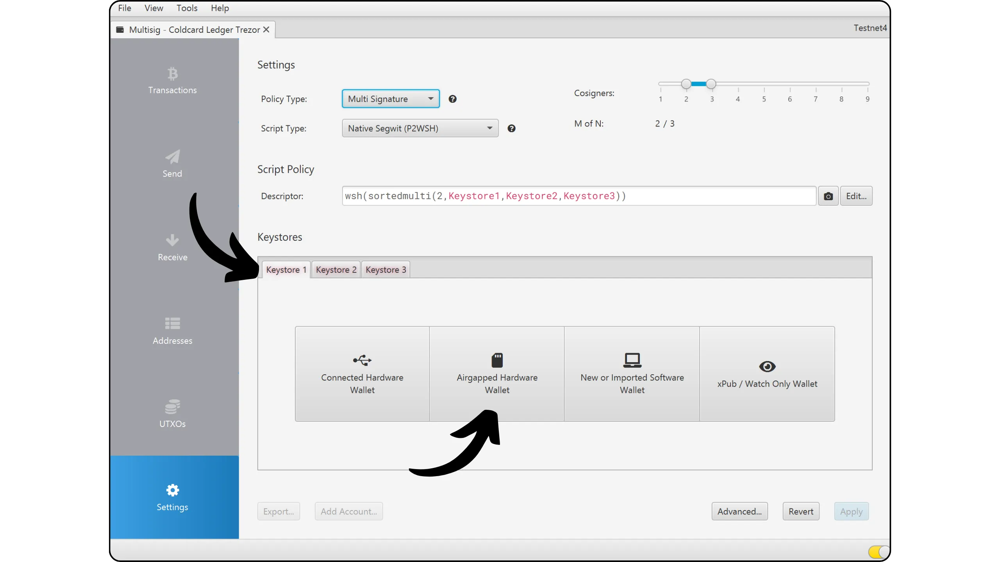

บน Passport ให้เปิดบัญชีที่คุณต้องการใช้ จากนั้นเลือก "*Connect Wallet*" > "*Sparrow*" > "*Connect as Multisig*" Passport จะแสดง QR code แบบเคลื่อนไหวที่มีข้อมูลกุญแจสาธารณะของมัน

ใน Sparrow เลือก "*Scan...*" ข้าง "*Passport*" แล้วสแกน QR code แบบเคลื่อนไหวนั้นด้วยเว็บแคมของคอมพิวเตอร์ ตรวจสอบ fingerprint ของ master-key ที่ Sparrow แสดงกับค่าที่ Passport แสดง จากนั้นนำเข้า keystore

ตอนนี้ Passport xpub ของคุณถูกนำเข้าแล้ว ทำขั้นตอนที่เหมาะสมซ้ำสำหรับ Ledger Flex และ Trezor Model One

สำหรับ Ledger Flex ฉันเลือก "*Keystore 2*" จากนั้นคลิก "*Connected Hardware Wallet*" ตรวจสอบให้แน่ใจว่า Ledger เชื่อมต่อกับคอมพิวเตอร์ ปลดล็อกแล้ว และเปิดแอปพลิเคชัน Bitcoin อยู่

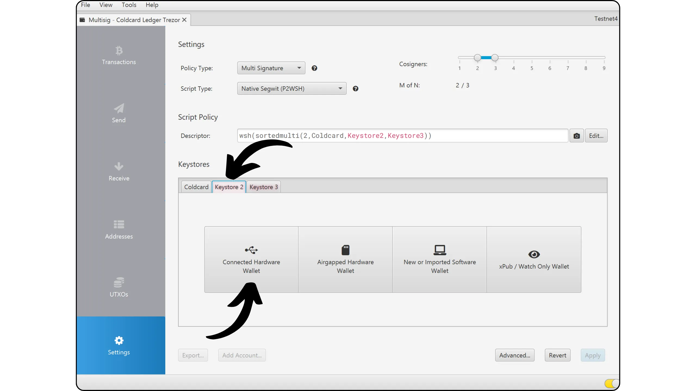

จากนั้นคลิกปุ่ม "*Scan...*"

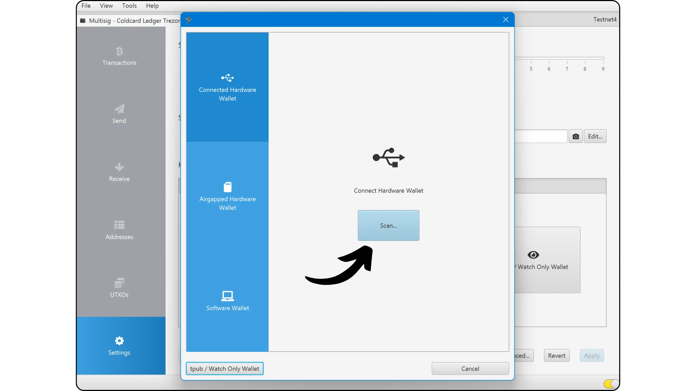

ถัดจากชื่อ hardware wallet ของคุณ ให้คลิก "*Import Keystore*"

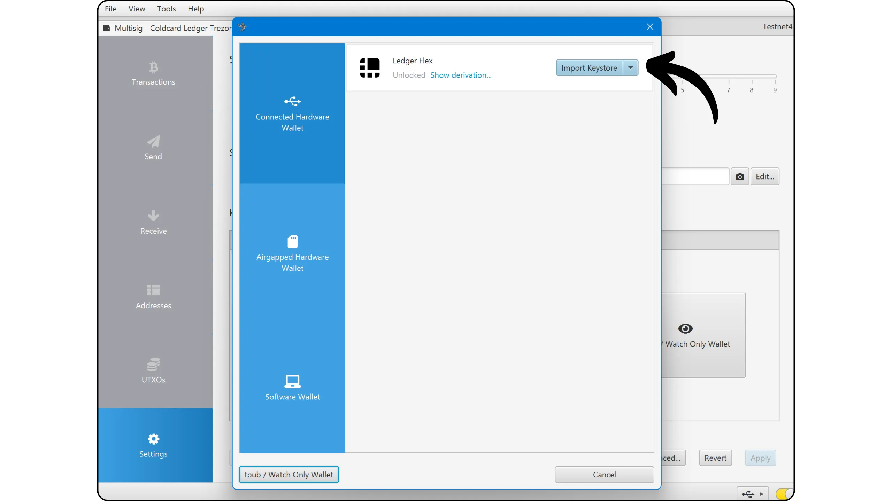

ตอนนี้ผู้ลงนามคนที่สองถูกลงทะเบียนใน Sparrow Wallet อย่างถูกต้องแล้ว

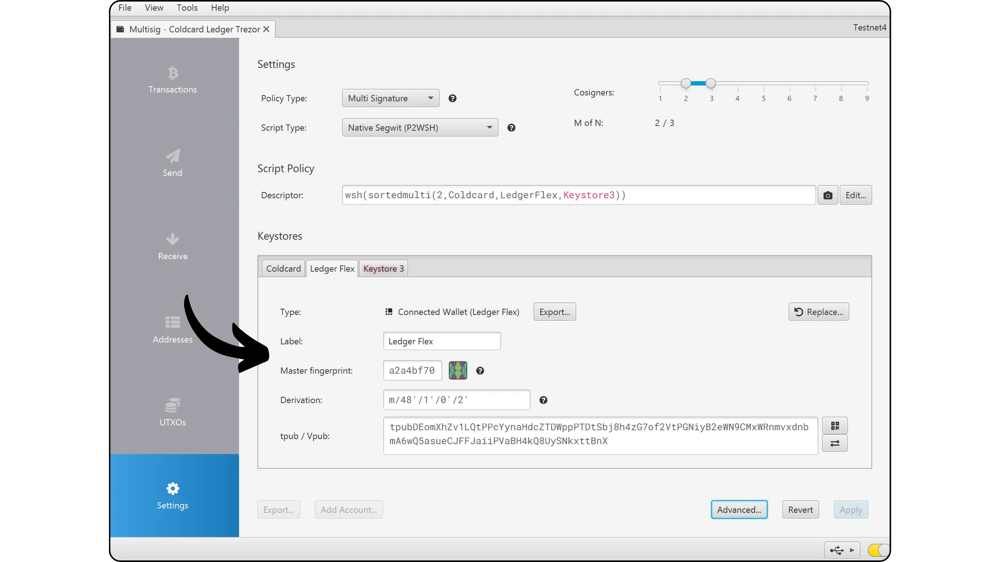

ฉันทำขั้นตอนเดียวกันซ้ำกับ Trezor One เพื่อทำให้การตั้งค่า Multisig เสร็จสมบูรณ์

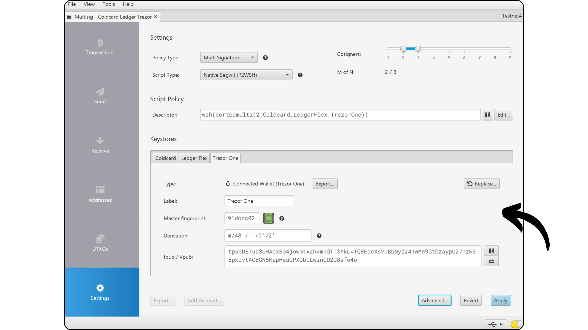

ในการตั้งค่าของฉัน เราไม่ครอบคลุมกรณีนี้ แต่ถ้าคุณต้องการรวมลายเซ็นผ่าน software wallet ใน Sparrow (hot wallet) ไว้ใน Multisig ของคุณ เพียงคลิกปุ่ม "*New or Imported Software Wallet*"

เมื่ออุปกรณ์ลงนามทั้งหมดของคุณถูกนำเข้าใน Sparrow Wallet แล้ว คุณสามารถสร้าง Multisig ให้เสร็จได้โดยคลิก "*Apply*"

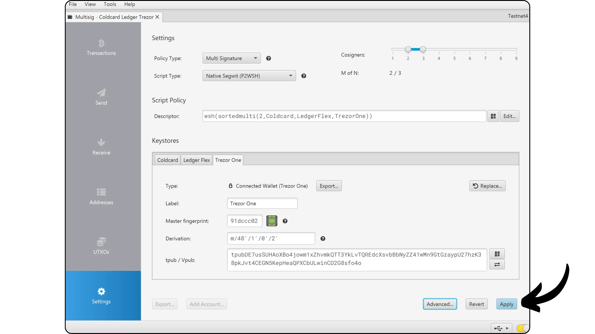

เลือกรหัสผ่านที่แข็งแรงเพื่อรักษาความปลอดภัยการเข้าถึง Sparrow Wallet wallet ของคุณ รหัสผ่านนี้ปกป้องกุญแจสาธารณะ ที่อยู่ ป้ายกำกับ และประวัติธุรกรรมของคุณจากการเข้าถึงโดยไม่ได้รับอนุญาต

อย่าลืมบันทึกรหัสผ่านนี้ไว้ในที่ปลอดภัย เช่น password manager เพื่อหลีกเลี่ยงการสูญหาย

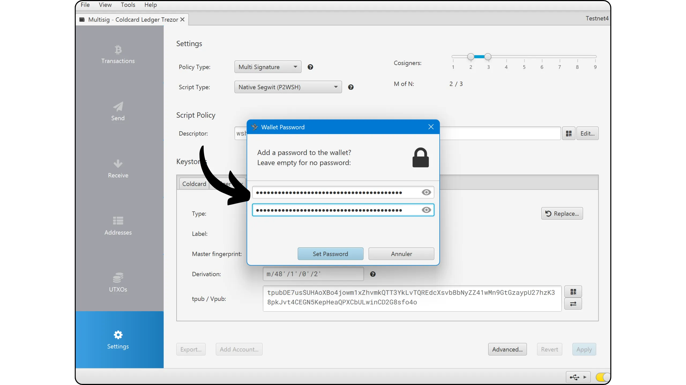

## การสำรองข้อมูล Multisig wallet

ตอนนี้เราจะบันทึก *Output Script Descriptor* ไว้บนสื่ออิสระและเก็บไว้หลายสำเนา

*Descriptor* มี xpubs ทั้งหมดใน Multisig wallet ของคุณ รวมถึง derivation paths ที่ใช้สร้างกุญแจ จำสิ่งที่เราเห็นในส่วนที่ 1: ในการกู้คืน Multisig wallet คุณต้องมีวลีช่วยจำ **ทั้งหมด** หรือมีเพียงจำนวนขั้นต่ำที่จำเป็นเพื่อให้ถึง threshold ของลายเซ็น อย่างไรก็ตาม ในกรณีหลัง การมี **xpubs** ของผู้ลงนามที่ขาดหายไปก็จำเป็นเช่นกัน *Descriptor* มี xpubs ทั้งหมดของ Multisig ของคุณ

หากยังไม่ชัดเจน ให้จำไว้แค่นี้: ในการกู้คืน Multisig คุณต้องมีวลีช่วยจำจำนวนขั้นต่ำสำหรับ Hardware Wallet แต่ละเครื่องที่ใช้ ตาม threshold (ในกรณีของฉัน: 2 วลี) รวมถึง *Descriptor*

*Descriptor* นี้ไม่มี private keys มีเพียง public keys เท่านั้น ซึ่งหมายความว่ามันไม่ได้ให้สิทธิ์เข้าถึงเงิน ดังนั้นจึงไม่สำคัญเท่าวลีช่วยจำ ซึ่งให้สิทธิ์เข้าถึงบิตคอยน์ของคุณทั้งหมด ความเสี่ยงของ *Descriptor* เกี่ยวข้องกับความเป็นส่วนตัวเท่านั้น: หากถูกเปิดเผยต่อบุคคลอื่น บุคคลที่สามอาจสังเกตธุรกรรมทั้งหมดของคุณได้ แต่ไม่สามารถใช้เงินของคุณได้

ฉันแนะนำอย่างยิ่งให้คุณสร้าง *Descriptor* นี้หลายสำเนา และเก็บไว้กับอุปกรณ์ลงนามแต่ละเครื่องใน Multisig ของคุณ ตัวอย่างเช่น ในกรณีของฉัน ฉันพิมพ์ *Descriptor* ลงบนกระดาษและเก็บสำเนาหนึ่งไว้กับ Passport อีกสำเนาหนึ่งกับ Trezor และอีกสำเนาหนึ่งกับ Ledger ฉันยังบันทึก *Descriptor* นี้เป็นไฟล์ PDF บน USB sticks สามตัว โดยแต่ละตัวเก็บไว้กับ hardware wallet หนึ่งเครื่อง วิธีนี้ฉันเพิ่มโอกาสสูงสุดที่จะไม่ทำ *Descriptor* นี้หาย และมั่นใจว่ามีสำเนาสองชุด (หนึ่งชุดทางกายภาพและหนึ่งชุดดิจิทัล) กับแต่ละอุปกรณ์

เมื่อ Multisig wallet ของคุณถูกสร้างแล้ว Sparrow จะให้ *Descriptor* นี้แก่คุณโดยอัตโนมัติ คลิกปุ่ม "*Save PDF...*" เพื่อบันทึกทั้งเป็นข้อความและเป็น QR code

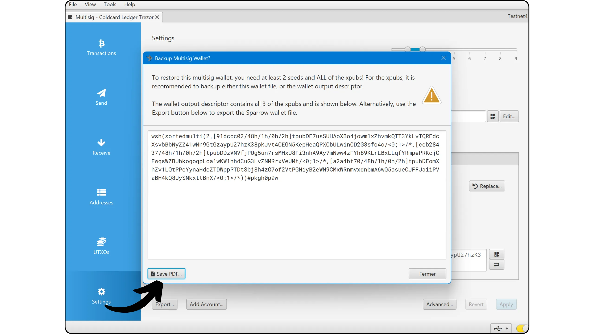

จากนั้นคุณสามารถพิมพ์ PDF นี้และคัดลอกไปยัง USB sticks ของคุณได้

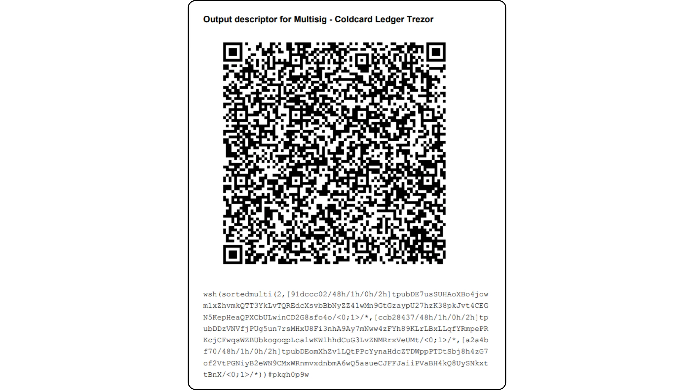

Passport ใช้การตั้งค่า multisig ที่นำเข้าโดย Sparrow เพื่อแสดงและตรวจสอบข้อมูลกุญแจที่เกี่ยวข้องระหว่างขั้นตอนการจับคู่ QR และการลงนาม เก็บ *Descriptor* แยกต่างหากไว้ด้วย: มันยังจำเป็นต่อการกู้คืน wallet หากผู้ลงนามคนหนึ่งไม่พร้อมใช้งาน

นอกจากการบันทึก *Descriptor* แล้ว อย่าลืมให้ความสำคัญเป็นพิเศษกับการบันทึกวลีช่วยจำสำหรับอุปกรณ์ลงนามแต่ละเครื่องของคุณ หากคุณเพิ่งเริ่มต้น ฉันแนะนำอย่างยิ่งให้คุณดูบทแนะนำอื่นนี้เพื่อเรียนรู้วิธีบันทึกและจัดการวลีเหล่านั้นอย่างถูกต้อง:

https://planb.academy/tutorials/wallet/backup/backup-mnemonic-22c0ddfa-fb9f-4e3a-96f9-46e2a7954270

ก่อนรับบิตคอยน์แรกบน Multisig ของคุณ **ฉันขอแนะนำอย่างยิ่งให้คุณทำการทดสอบการกู้คืนแบบว่าง** จดข้อมูลอ้างอิงบางอย่างไว้ เช่น ที่อยู่รับแรก จากนั้นรีเซ็ต hardware wallets ของคุณในขณะที่ wallet ยังว่างอยู่ ต่อไป ลองกู้คืน Multisig wallet ของคุณบน Hardware Wallets โดยใช้ข้อมูลสำรองวลีช่วยจำบนกระดาษของคุณ จากนั้นบน Sparrow โดยใช้ *Descriptor* ตรวจสอบว่าที่อยู่แรกที่สร้างขึ้นหลังการกู้คืนตรงกับที่อยู่ที่คุณจดไว้เดิม หากตรงกัน คุณมั่นใจได้ว่าข้อมูลสำรองบนกระดาษของคุณเชื่อถือได้

หากต้องการเรียนรู้เพิ่มเติมเกี่ยวกับวิธีทำการทดสอบการกู้คืน ฉันแนะนำให้คุณดูบทแนะนำอื่นนี้:

https://planb.academy/tutorials/wallet/backup/recovery-test-5a75db51-a6a1-4338-a02a-164a8d91b895

## รับบิตคอยน์บน Multisig ของคุณ

ตอนนี้ wallet ของคุณพร้อมรับบิตคอยน์แล้ว ใน Sparrow ให้คลิกแท็บ "*Receive*"

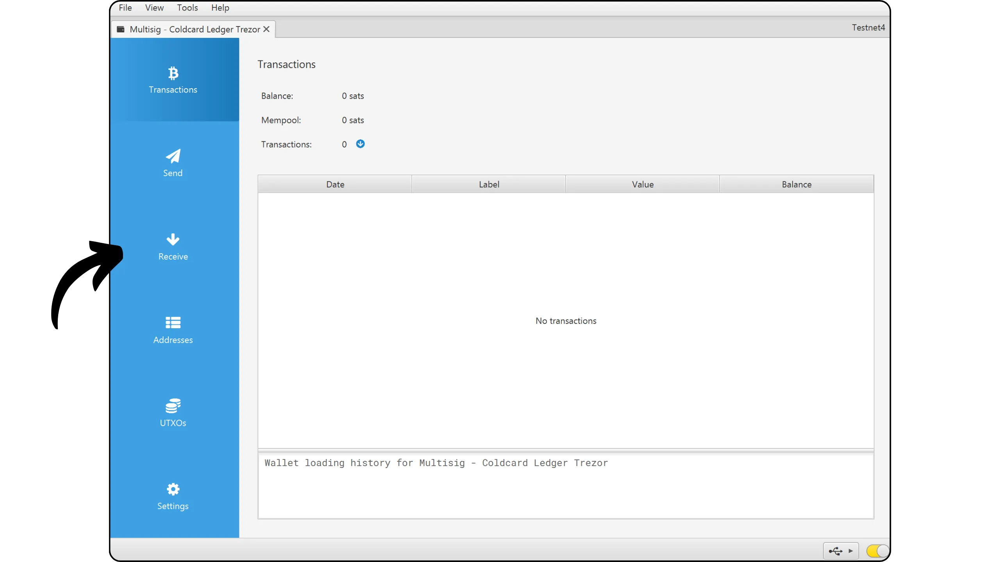

ก่อนใช้ที่อยู่ที่ Sparrow Wallet สร้างขึ้น ให้ใช้เวลาตรวจสอบที่อยู่นั้นโดยตรงบนหน้าจอของ hardware wallets ของคุณ สิ่งนี้จะทำให้มั่นใจได้ว่าที่อยู่ไม่ได้ถูกเปลี่ยนแปลง และอุปกรณ์ของคุณถือกุญแจส่วนตัวที่จำเป็นต่อการใช้เงินที่เกี่ยวข้อง วิธีนี้ช่วยปกป้องคุณจากเวกเตอร์การโจมตีหลายรูปแบบ

ในการทำเช่นนี้ ให้คลิก "*Display Address*" เพื่อแสดงที่อยู่บน Trezor หรือ Ledger เมื่อเชื่อมต่อด้วยสายเคเบิล

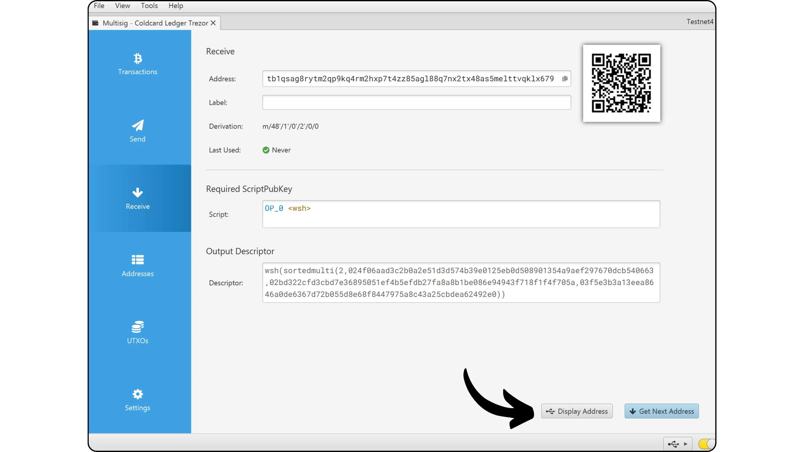

สำหรับ Passport ให้เลือกบัญชี multisig แล้วเลือก "*Verify Address*" สแกน QR code ของที่อยู่รับที่ Sparrow แสดง Passport จะยืนยันบนหน้าจอว่าที่อยู่นั้นเป็นของ multisig wallet หรือไม่

ตรวจสอบว่าที่อยู่ที่แสดงบน hardware wallet แต่ละเครื่องตรงกับที่อยู่ใน Sparrow Wallet ทุกตัวอักษร แนะนำให้ทำสิ่งนี้ก่อนแชร์ที่อยู่กับผู้ชำระเงิน เพื่อให้มั่นใจในความสมบูรณ์ของที่อยู่

จากนั้นคุณสามารถกำหนด "*Label*" ให้ที่อยู่นี้ เพื่อระบุที่มาของบิตคอยน์ที่ได้รับ นี่เป็นวิธีที่ดีในการจัดระเบียบการจัดการ UTXOs ของคุณ

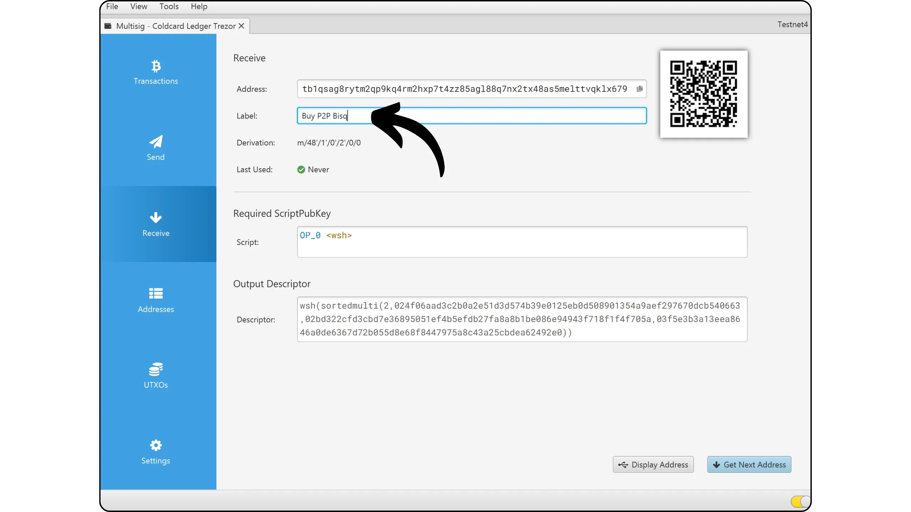

เมื่อยืนยันแล้ว คุณสามารถใช้ที่อยู่นี้เพื่อรับบิตคอยน์ได้

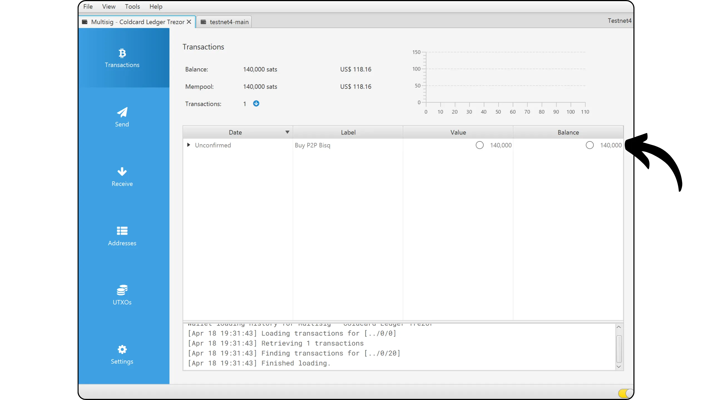

## ส่งบิตคอยน์ด้วย Multisig ของคุณ

ตอนนี้คุณได้รับ Sats แรกบน Multisig wallet ของคุณแล้ว คุณก็สามารถใช้จ่ายได้เช่นกัน! ใน Sparrow ไปที่แท็บ "*Send*" เพื่อสร้างธุรกรรมใหม่

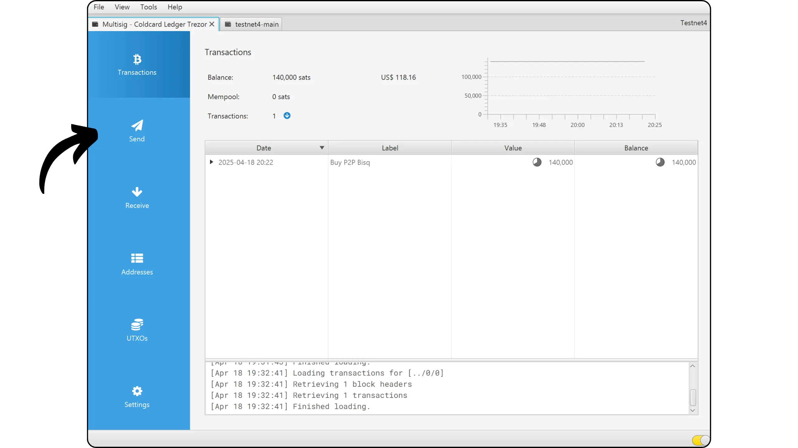

หากคุณต้องการใช้ *Coin Control* กล่าวคือ เลือก UTXOs ที่ต้องการใช้จ่ายด้วยตนเอง ให้ไปที่แท็บ "*UTXOs*" เลือก UTXOs ที่คุณต้องการใช้จ่าย จากนั้นคลิก "*Send Selected*" คุณจะถูกเปลี่ยนเส้นทางไปยังแท็บ "*Send*" โดยอัตโนมัติ พร้อม UTXOs ที่กรอกไว้ล่วงหน้าแล้ว

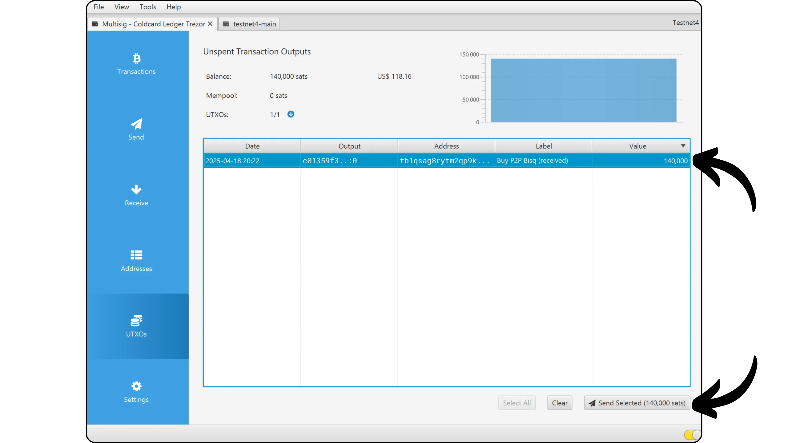

ป้อนที่อยู่ปลายทาง สามารถเพิ่มหลายที่อยู่ได้โดยคลิก "*+ Add*"

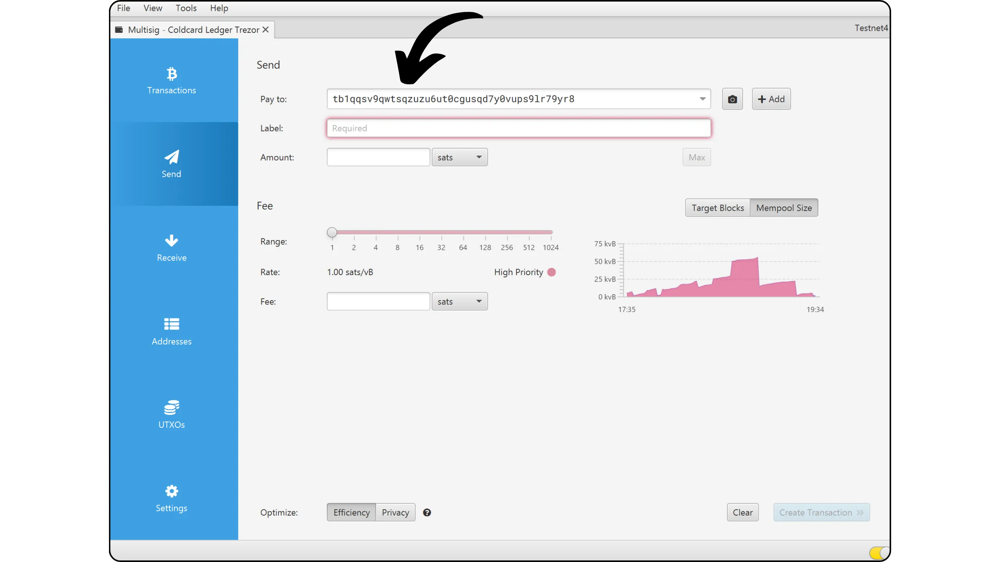

เพิ่ม "*Label*" เพื่ออธิบายวัตถุประสงค์ของการใช้จ่ายนี้ เพื่อให้ติดตามธุรกรรมของคุณได้ง่ายขึ้น

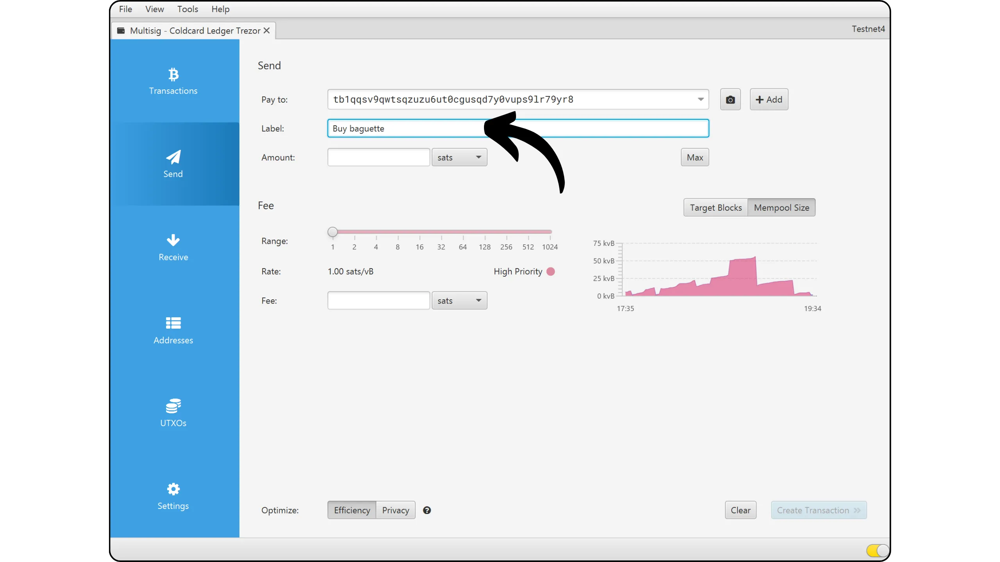

ป้อนจำนวนที่จะส่งไปยังที่อยู่ที่เลือก

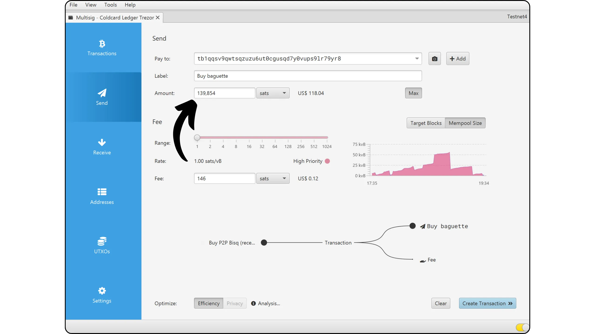

ปรับอัตราค่าธรรมเนียมตามสภาพเครือข่ายปัจจุบัน ตัวอย่างเช่น ดู [Mempool.space](https://Mempool.space/) เพื่อเลือกระดับค่าธรรมเนียมที่เหมาะสม

หลังตรวจสอบพารามิเตอร์ธุรกรรมทั้งหมดแล้ว ให้คลิก "*Create Transaction*"

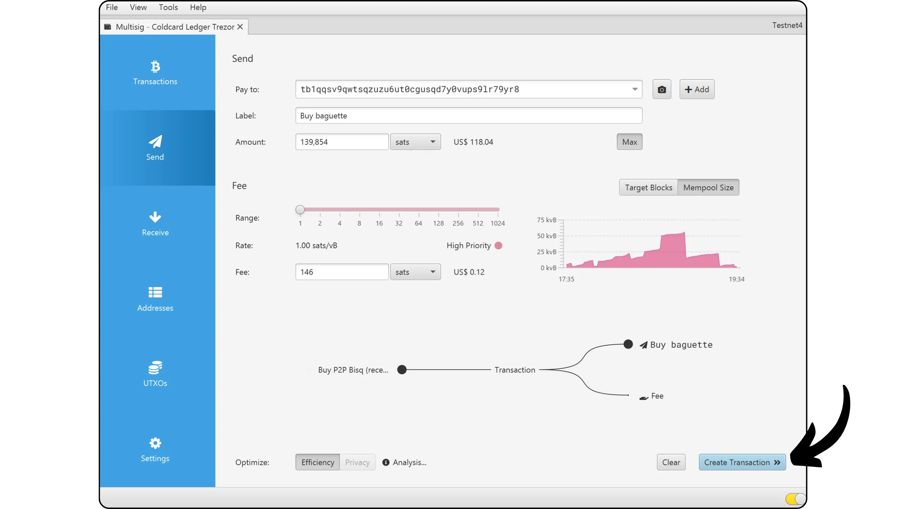

หากคุณพอใจกับทุกอย่าง ให้คลิก "*Finalize Transaction for Signing*"

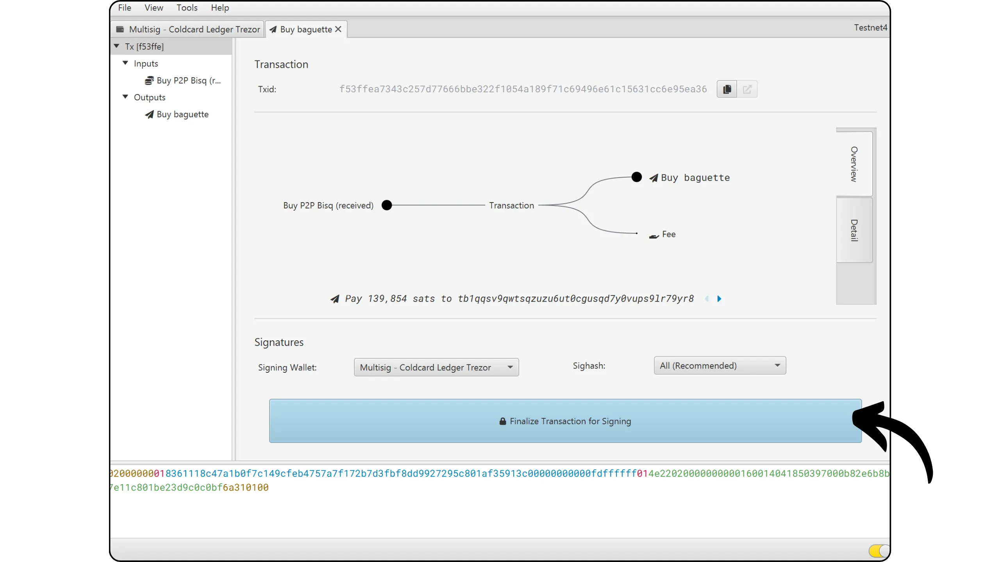

ที่ด้านล่างของหน้าจอ คุณจะเห็นว่า Sparrow กำลังรอลายเซ็น 2 รายการ นี่เป็นเรื่องปกติ: wallet ที่ใช้ที่นี่คือ Multisig แบบ 2-of-3

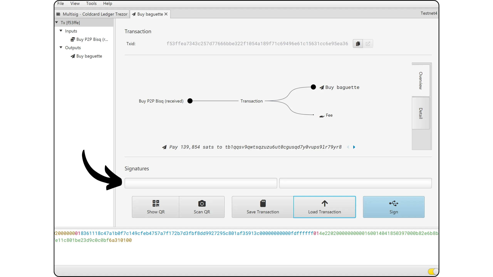

ฉันเริ่มลงนามด้วย Passport ใน Sparrow คลิก "*Show QR*" เพื่อแสดง PSBT (*Partially Signed Bitcoin Transaction*) เป็น QR codes แบบเคลื่อนไหว บน Passport ให้เลือกบัญชี multisig และเลือก "*Sign with QR Code*" จากนั้นสแกน QR code ที่ Sparrow แสดง

บนหน้าจอ Hardware Wallet ของคุณ ตรวจสอบพารามิเตอร์ธุรกรรมอย่างรอบคอบ: ที่อยู่ผู้รับ จำนวนที่ส่ง และค่าธรรมเนียม เมื่อยืนยันธุรกรรมแล้ว ให้ยืนยันเพื่อดำเนินการลงนามต่อ

หลังจากคุณอนุมัติธุรกรรม Passport จะแสดง PSBT ที่ลงนามแล้วเป็น QR codes แบบเคลื่อนไหว ใน Sparrow คลิก "*Scan QR*" แล้วสแกนโค้ดเหล่านั้นด้วยเว็บแคมของคุณ จากนั้นลายเซ็นของ Passport จะถูกเพิ่ม ฉันใช้ Ledger สำหรับลายเซ็นที่สองที่จำเป็นต่อไป: ฉันเชื่อมต่อและปลดล็อกมัน จากนั้นคลิก "*Sign*" ใน Sparrow

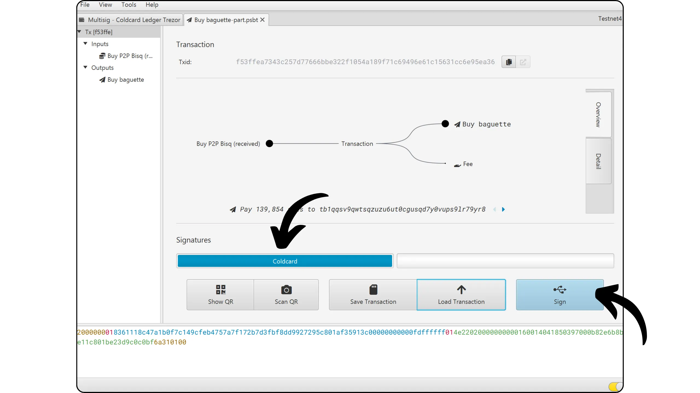

คลิก "*Sign*" ข้างชื่อ Hardware Wallet ของคุณ

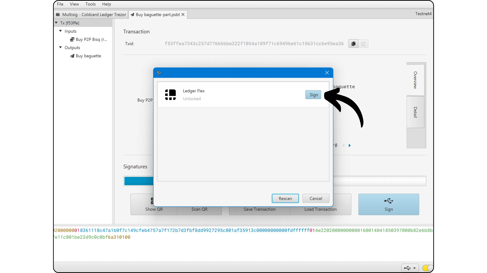

ครั้งแรกที่คุณใช้ Ledger กับ Multisig นี้ Sparrow จะขอให้คุณตรวจสอบกุญแจสาธารณะแบบขยาย (xpubs) ของผู้ร่วมลงนาม เช่นเดียวกับ Passport ขั้นตอนนี้ป้องกันไม่ให้คุณลงนามแบบไม่รู้ข้อมูลในภายหลัง เพื่อยืนยันข้อมูลนี้ ให้เปรียบเทียบ xpub ที่แสดงบนหน้าจอ Ledger กับ xpub ที่ hardware wallets เครื่องอื่นของคุณให้มาโดยตรง

ตรวจสอบที่อยู่ผู้รับ จำนวนที่โอน และค่าธรรมเนียมธุรกรรม จากนั้นลงนามธุรกรรม

กดหน้าจอเพื่อลงนาม

ตอนนี้ Sparrow มีลายเซ็นสองรายการที่จำเป็นในการปล่อยเงินจาก Multisig wallet แล้ว ตรวจสอบธุรกรรมครั้งสุดท้าย และถ้าทุกอย่างเรียบร้อย ให้คลิก "*Broadcast Transaction*" เพื่อประกาศธุรกรรมไปยังเครือข่าย

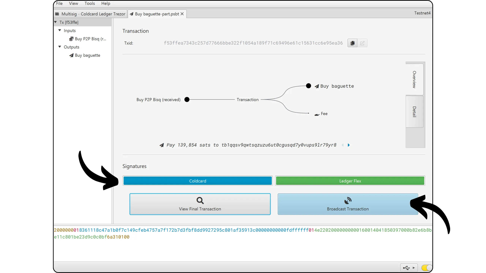

คุณจะพบธุรกรรมนี้ในแท็บ "*Transactions*" ของ Sparrow Wallet

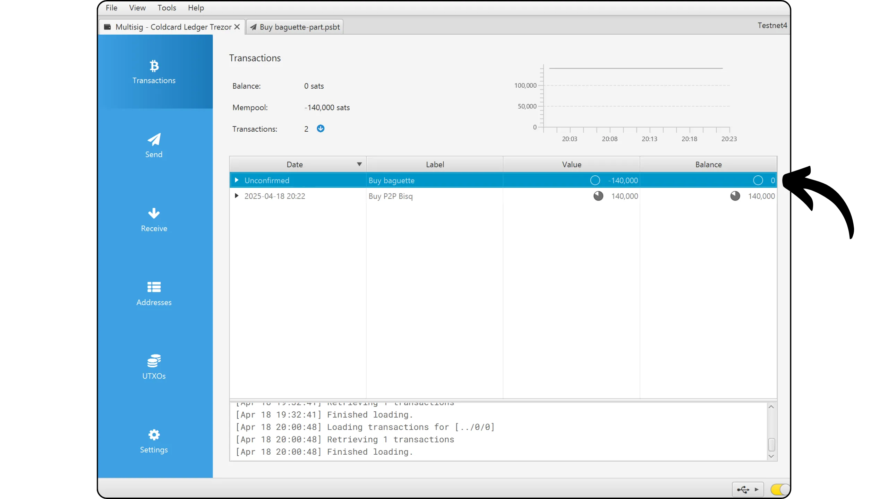

ยินดีด้วย ตอนนี้คุณรู้วิธีตั้งค่าและใช้ wallet แบบหลายลายเซ็นบน Sparrow แล้ว หากคุณคิดว่าบทแนะนำนี้มีประโยชน์ ฉันจะขอบคุณมากหากคุณกดนิ้วโป้งสีเขียวด้านล่าง โปรดอย่าลังเลที่จะแชร์บทความนี้บนเครือข่ายสังคมของคุณ ขอบคุณที่แชร์!

หากต้องการไปต่อ ฉันแนะนำให้คุณดูบทแนะนำนี้เกี่ยวกับวิธีอื่นในการเพิ่มความปลอดภัยให้ Bitcoin wallet ของคุณ นั่นคือ passphrase BIP39 :

https://planb.academy/tutorials/wallet/backup/passphrase-a26a0220-806c-44b4-af14-bafdeb1adce7
