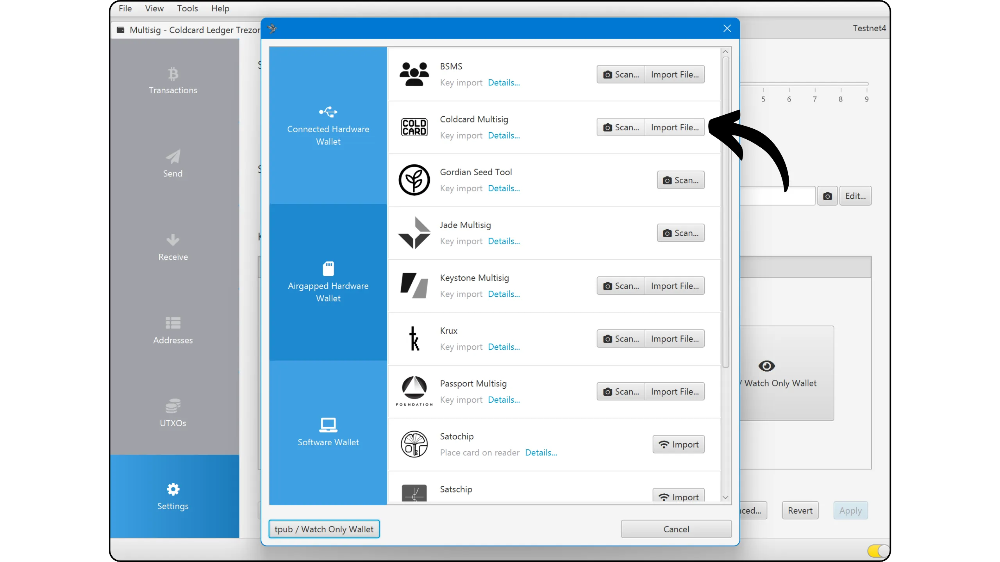
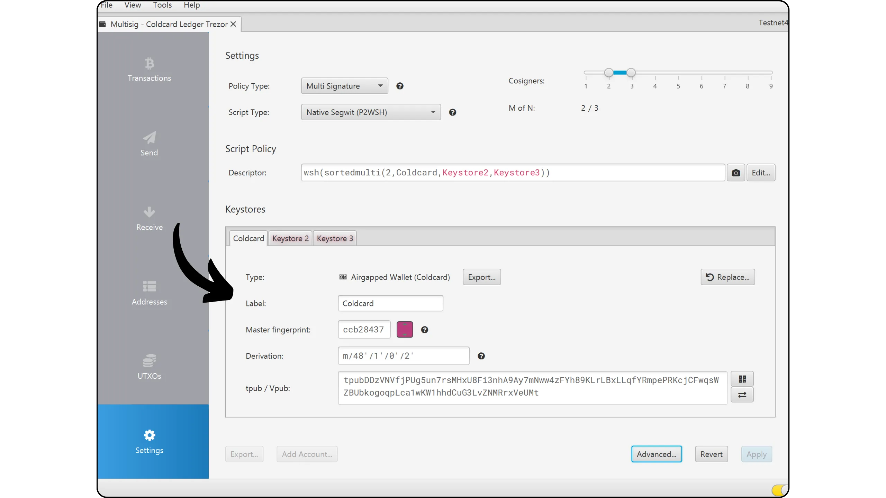
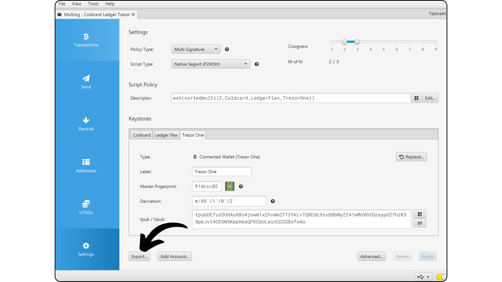
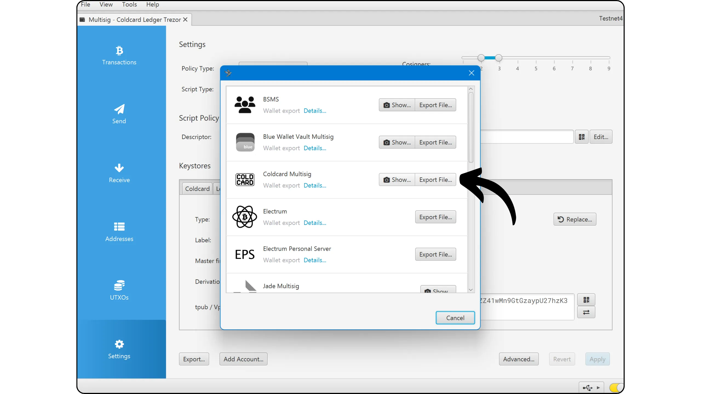
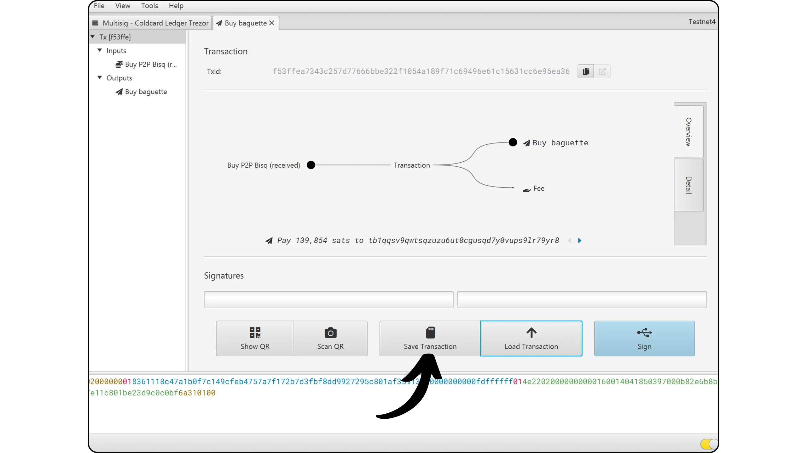
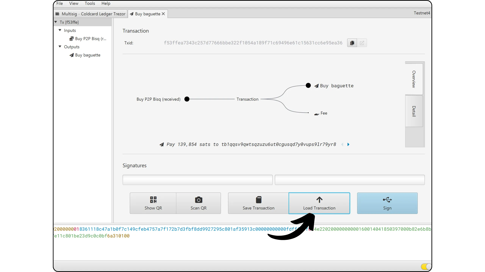

多签名钱包（通常称为 "*Multisig*"）是一种比特币钱包结构，它需要不同密钥的多个加密签名才能授权支出。与传统的单签名（"*singlesig*"）钱包不同，多签名钱包基于 **m-of-n** 模式：在与钱包关联的 _n_ 个密钥中，_m_ 必须强制共同签名每笔交易。

这种机制使得钱包的控制能够在多个实体或设备之间共享。例如，在 2-of-3 配置中，会生成三组独立的密钥，但只需要两组密钥即可释放资金。这种架构极大地降低了与密钥泄露或丢失相关的风险：仅拥有一个密钥的小偷无法清空钱包，而丢失一个密钥的用户仍然可以使用剩余的两个密钥访问他的资金。

然而，更高的安全性也带来了更大的复杂性。设置多签名钱包需要确保多个助记词（每个签名因子一个）和扩展公钥（"*xpub*"）的安全。事实上，如果您使用多重签名 2-of-3 钱包，要检索钱包，您必须拥有全部三个助记词，或者至少拥有三个助记词中的两个。但是，如果您只有这三个助记词中的两个，则还需要访问三个 *xpubs*，否则将无法检索访问它们所保护的比特币所需的公钥。

总而言之，为了恢复多重签名钱包，您必须：

- 或访问与每个签名因素相关的所有助记词；
- 要么具有能够签名的阈值所需的最小助记词短语数量，并且还可以访问所有因素的 xpub 以检索必要的公钥。

“输出脚本描述符”促进了多签名钱包备份的管理，它将访问资金所需的所有公共数据组合在一起。然而，该功能尚未在所有钱包管理软件中实现。

多签名钱包特别适合那些希望加强安全性或对资金进行集体管理的比特币用户：公司、协会、家庭或持有大量比特币的个人用户。它可用于创建去中心化管理方案，例如，在多个管理者或团队成员之间分配签名权。

在本教程中，我们将学习如何通过 **Sparrow Wallet** 创建和使用传统多签名钱包。如果您想创建带有时间锁的自定义多签名钱包，我建议使用 Liana：

https://planb.academy/tutorials/wallet/desktop/liana-306ef457-700c-4fdd-b07a-8fb7a8a29f04

## 先决条件

在本教程中，我将向您展示如何使用 [Sparrow Wallet 钱包管理软件](https://sparrowwallet.com/download/) 制作多重签名。如果您尚未安装此软件，请立即安装。如果您需要帮助，我们还有有关配置 Sparrow Wallet 的详细教程：

https://planb.academy/tutorials/wallet/desktop/sparrow-c674e2ac-d46f-4c82-92a7-7d1b0e262f5d)

为了设置多重签名钱包，您需要不同的硬件钱包。例如，对于 2-of-3 多签名钱包，您可以使用：

- Trezor Model One；
- Ledger Flex；
- Coldcard MK3。

在多重签名配置中使用不同品牌的硬件钱包是个好主意。这确保了如果特定模型遇到严重问题，不会影响多签名的整体安全性。此外，它还可以让您受益于每种设备的特定优势。例如，在我的配置中：

- Trezor Model One 完全开源，这使得验证种子生成成为可能。然而，由于它没有配备安全元件，因此仍然容易受到物理攻击；

- 另一方面，Ledger Flex 受益于无法验证的专有固件，但采用了安全元件，可提供出色的物理保护；

- Coldcard 配备安全元件，其代码可搜索。对于我们的配置来说，这是一个有趣的选择，因为它提供了其他型号所不具备的验证功能。

配置多签名钱包之前，请确保每个硬件钱包均已正确配置（助记词生成和保存、PIN 码等）。关于详细说明，您可以查阅我们每个硬件钱包的教程，例如：

https://planb.academy/tutorials/wallet/hardware/trezor-model-one-5c250c49-ce3b-4c63-bd05-4600d7c11a02

https://planb.academy/tutorials/wallet/hardware/ledger-flex-3728773e-74d4-4177-b39f-bd923700c76a

https://planb.academy/tutorials/wallet/hardware/coldcard-q-73e86d1a-6fe6-4d8b-bb15-8690298020e3

正如我们将在本教程后面看到的，还可以将一个与硬件钱包无关但其私钥存储在您的 PC 上的因素集成到您的多重签名配置中。这种方法显然不如单独使用硬件钱包安全，但在某些情况下可能是相关的。例如，对于 Multisig 2-of-3，您可以选择两个硬件钱包和一个软件钱包。

## 创建多签名钱包

打开 Sparrow Wallet，点击 "*File*" 选项卡，然后选择 "*New Wallet*"。

为您的多重签名组合指定一个名称，然后点击 "*Create Wallet*"确认。

在 "*Policy Type*" 下拉选单中，选择 "*Multi Signature*" 选项。

现在，您可以在右上角定义多重签名中的密钥总数，以及授权费用所需的共同签名者数量。在我的示例中，这是一个 2-of-3 方案。

在窗口底部，Sparrow Wallet 显示三个“*Keystore*”。每个代表一组密语。在这里，我使用三个硬件钱包，因此每个 “*Keystore*” 对应于其中一个。我们现在将配置它们。

我从 Coldcard 开始。在 “*Keystore 1*” 选项卡中，我选择 “*Airgapped Hardware Wallet*” 选项。

在 Coldcard 上，一旦设备解锁，我就会进入 "*Settings*" 选单，然后进入 "*Multisig Wallet*"。

此选单可让您管理 Coldcard 参与的多重签名钱包。我想要创建一个新的，因此我选择“*Export XPUB*”。

对于 "*Account*" 字段，如果您只管理一个账号，您可以选择不填，直接按确认按钮进行验证。

然后，Coldcard 会生成一个包含 xpub 的文件并将其保存在 Micro SD 卡中。

将 Micro SD 插入电脑。在 Sparrow Wallet 中，点击 "*Coldcard Multisig*" 旁边的 "*Import File...*" 按钮，然后选择卡上由 Coldcard 创建的文件。

您的 xpub 已成功导入。现在，我们将对另外两个硬件钱包重复上述步骤。

对于 Ledger Flex，我选择 "*Keystore 2*"，然后点击 "*Connected Hardware Wallet*"。确保 Ledger 已连接到电脑，已解锁，并且比特币应用程序已打开。

然后点击 "*Scan...*" 按钮。

在硬件钱包名称旁边，点击 "*Import Keystore*"。

现在，第二个签名者已在 Sparrow Wallet 中正确注册。

我用 Trezor One 重复进行完全相同的步骤，最终完成了多签名的配置。

在我的配置中，我们不涵盖这种情况，但如果您想在多签名中通过 Sparrow（热钱包）中的软件钱包包含签名，只需单击 “*New or Imported Software Wallet*” 按钮即可。

现在所有签名设备都已导入 Sparrow Wallet，点击 "*Apply*" 即可完成多签名钱包的创建。

选择一个强大的密码，以保护 Sparrow Wallet 上的钱包安全。该密码可保护您的公用密钥、地址、标签和交易历史记录免遭未经授权的访问。

记住将密码保存在安全的地方，如密码管理器，以免丢失。

## 备份您的多签名钱包

现在，我们要将 *Output Script Descriptor（输出脚本描述符）* 保存在 Coldcard 中（这只适用于在多签名中安装了 Coldcard 的用户），最重要的是，我们要将其备份在一个独立的介质上。

描述符包含多签名钱包中的所有 xpub，以及用于生成密钥的派生路径。请记住我们在第 1 部分中看到的内容：为了恢复多签名钱包，您必须拥有**所有**助记词，或者仅拥有达到签名阈值所需的最小数量。然而，在后一种情况下，拥有失踪签名者的 **xpub** 也很重要。*描述符*包含您所有多签名钱包的 xpub。

如果这还不清楚，请记住这一点：要检索多重签名，您需要为所使用的每个硬件钱包提供最少数量的助记词，具体取决于阈值（在我的例子中：阈值为 2 个助记词）以及其*描述符*。

该*描述符*不包含私钥，仅包含公钥。这意味着它无法获得资金。因此，它不像助记词那么重要，助记词可以让您完全访问您的比特币。*描述符*的风险仅与保密性相关：如果发生泄露，第三方可以观察您的所有交易，但无法花费您的资金。

我强烈建议您创建此*描述符*的多个副本，并将它们与多重签名上的每个签名设备一起保存。例如，就我而言，我将 *Descriptor* 打印在纸上，并在 Coldcard 中保留一份，在 Trezor 中保留一份，在 Ledger 中保留一份。我还将这个 *Descriptor* 作为 PDF 文件保存在三个 USB 记忆棒上，每个 USB 记忆棒都存储在一个硬件钱包中。通过这种方式，我最大限度地避免丢失这个*描述符*，并且我确信每个设备都有两份副本（一份物理副本和一份数字副本）。

创建多重签名钱包后，Sparrow 会自动为您提供此*描述符*。单击 “*Save PDF...*” 按钮将其保存为文本和二维码。

然后，您就可以打印这份 PDF 文件，并将其复制到 U 盘中。

我们还将在 Coldcard 中注册此*描述符*（如果您在配置中使用一个描述符）。这将允许 Coldcard 验证后来签署的每笔交易是否对应于原始钱包：正确的xpub、正确的地址格式、正确的派生路径。如果没有这个导入的*描述符*，Coldcard 无法确认交易所地址没有被劫持或者 PSBT 没有被篡改。

这就是 Coldcard 在多重签名中如此有趣的原因：它提供针对某些复杂攻击的额外检查，而其他硬件钱包不允许（当然，前提是您使用它来签名）

在 Sparrow 中进入 "*Settings" 选单，然后点击 "*Export...*"。

在 "*Coldcard Multisig*" 选项，点击 "*Export File...*"，将文本文件保存到 Micro SD 卡中。

然后将卡插入 Coldcard。进入 "*Settings*" 选单，然后前往 "*Multisig Wallet*"，选择 "*Import from SD*"。

选择适当的文件并确认导入。

点击新导入的多签名钱包名称。

检查多签名配置参数，然后确认注册。

您的多签名钱包现已正确保存在您的 Coldcard 中。如果同一个多签名钱包中有多个 Coldcard，请为每个 Coldcard 重复此过程。

除了保存 *Descriptor* 之外，不要忘记特别注意保存每个签名设备的助记词。如果您刚开始使用，我强烈建议您参考其他教程，学习如何正确保存和管理这些助记词：

https://planb.academy/tutorials/wallet/backup/backup-mnemonic-22c0ddfa-fb9f-4e3a-96f9-46e2a7954270

使用多签名钱包接收第一个比特币之前，**我强烈建议您执行空钱包的恢复测试**。记下一些参考信息，例如第一个接收地址，然后在钱包仍为空时重置您的硬件钱包。接下来，尝试使用助记词纸备份在硬件钱包上恢复多签名钱包，然后使用*描述符*在 Sparrow 上恢复。检查恢复后生成的第一个地址是否与您最初记录的地址相符。如果是这样，您可以放心，您的纸质备份正确无误。

要了解有关如何执行恢复测试的更多信息，我建议您参考其他教程：

https://planb.academy/tutorials/wallet/backup/recovery-test-5a75db51-a6a1-4338-a02a-164a8d91b895

## 使用多签名钱包接收比特币

您的钱包现在可以接收比特币了。在 Sparrow 中，点击 "*Receive*" 选项卡。

在使用 Sparrow Wallet 生成的地址之前，请花点时间直接在硬件钱包的屏幕上检查它。这将确保地址未被更改，并且您的设备持有花费相关资金所需的私钥。这有助于保护您免受多种攻击媒介的侵害。

通过电缆连接时，点击 "*Display Address*" 可在 Trezor 或 Ledger 上显示地址。

使用 Coldcard，无需与 Sparrow 进行任何交互即可执行此验证。只需打开“*Address Explorer*” 选单，然后在最底部选择您的多重签名。

然后您将看到多签名钱包生成的接收地址。

检查每个硬件钱包上显示的地址是否与 Sparrow Wallet 中的地址完全一致。建议在与付款人共享地址之前执行此操作，以确保其真实性。

然后，您就可以为这个地址分配一个 "*Label（标签）*"，以标明收到的比特币的来源。这是一种组织管理 UTXO 的好方法。

验证通过后，您就可以使用地址接收比特币了。

## 使用多签名钱包发送比特币

现在，您已经在多签名钱包上收到了第一个萨特，您也可以消费它！在 Sparrow 中，前往 "*Send*" 选项卡，建立新的交易。

如果您希望使用 "*Coin Control（币控制）*"，即手动选择要使用的 UTXO（未花费交易输出），请前往 "*UTXOs*" 选项卡。选择您希望使用的 UTXO，然后点击 "*发送所选*"。您将自动跳转到 "*Send*" 选项卡，UTXO 已预先填好。

输入目的地地址。点击 "*+Add*" 以添加多个地址。

添加 "*Label*" 来描述这笔费用的用途，以便于跟踪交易。

输入要发送到所选地址的金额。

根据当前网络条件调整充电速率。例如，请参考 [Mempool.space](https://Mempool.space/)，选择合适的充电级别。

检查所有交易参数后，点击 "*Create Transaction*"。

如果一切正确无误，请点击 "*Finalize Transaction for Signing*"。

在屏幕下方，您会看到 Sparrow Wallet 需要 2 个签名。这是正常现象：这里使用的钱包是 2-on-3 多签名钱包。

我开始使用 Coldcard 签名。为此，我将 Micro SD 卡插入电脑，然后点击 "*Save Transaction*"。

有三种方法可以将要签名的交易传输到硬件钱包上，然后再从 Sparrow 中提取。第一种是使用 Micro SD 卡，我们将在这里使用 Coldcard。第二种是通过电缆连接，我们将在第二次签名时使用（Ledger 和 Trezor）。最后，对于 Coldcard Q、Jade Plus 或 Passport V2 等配备摄像头的设备，还可以使用二维码通信。

将 PSBT (*Partially Signed Bitcoin Transaction*，即部分签名比特币交易) 保存在 Micro SD 上后，我将其插入 Coldcard MK3，然后选择 "*Ready to Sign*" 选单。

在硬件钱包屏幕上，仔细检查交易参数：接收者的地址、发送金额和费用。确认交易后，验证以进行签名。

然后将 Micro SD 放回电脑，在 Sparrow 中点击 "*Load Transaction*"。从文件中选择由 Coldcard 签名的 PSBT。

可以看到 Coldcard 签名已经添加。我现在要使用第二个设备（这里是 Ledger）来执行第二个签名要求。我连接它，解锁，然后点击 Sparrow 上的 "*Sign*"。

点击硬件钱包名称旁边的 "*Sign*" 按钮。

第一次使用 Ledger 和 Multisig 时，Sparrow 会要求您验证共同签名人的扩展公钥 (xpub)。与 Coldcard 一样，这一步骤可防止您以后盲目签名。为了验证此信息，请将 Ledger 屏幕上显示的 xpub 与其他硬件钱包直接提供的 xpub 进行比较。

核对接收者的地址、转账金额和交易费，然后签名交易。

按屏幕以签名交易。

Sparrow 现在有了从 Multisig 钱包中发送资金所需的两个签名。请最后检查一次交易，如果一切顺利，点击 "*Broadcast Transaction*" 将其在网络上广播。

您可以在 Sparrow Wallet 的 "*Transaction*" 选项卡中找到该交易。

恭喜，您现在知道如何在 Sparrow 上设置和使用多重签名钱包。如果您发现本教程有用，请给我点赞，我将不胜感激。请随时在您的社交网络上分享这篇文章。感谢分享！

如果您想要进一步学习，我建议您查阅本教程，了解提高比特币钱包安全性的另一种方法，即 BIP39 Passphrase（密语）：

https://planb.academy/tutorials/wallet/backup/passphrase-a26a0220-806c-44b4-af14-bafdeb1adce7
