Sparrow Wallet 是 Craig Raw 开发的一款自我保管比特币钱包管理软件。这款开源软件因其众多功能和直观的界面而受到比特币用户的青睐。

使用 Sparrow 有两种方法：


- 作为热钱包，您的私钥将被存储在个人电脑中。
- 作为冷钱包管理器，私钥被保存在硬件钱包上。在这种模式下，Sparrow仅操纵公共钱包信息、跟踪资金、生成地址和构建交易，但需要硬件钱包签名才能使这些交易有效。因此，它可以取代 Ledger Live 或 Trezor Suite 等应用程序。

Sparrow 支持单签名和多签名钱包，可以流畅地管理多个钱包。例如，您可以同时控制一个连接到 Ledger 的钱包，另一个连接到 Trezor，还有一个热钱包。

该软件还提供先进的硬币控制功能，让您可以精确选择在交易中使用哪些 UTXO（未花费交易输出），从而优化保密性。

在连接方面，Sparrow 让您可以通过 Electrum 服务器或 Bitcoin Core 远程连接到自己的比特币节点。如果您还没有自己的节点，也可以使用公共节点。远程连接通过 Tor 进行。

## 安装 Sparrow Wallet

访问 [Sparrow Wallet 官方下载页面](https://sparrowwallet.com/download/)，选择与您的操作系统相对应的软件版本。

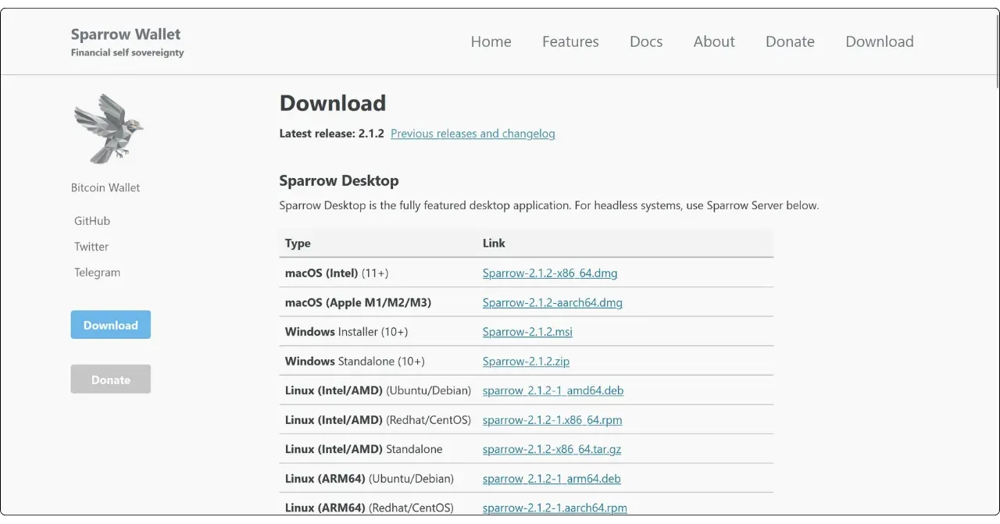

在安装软件之前，检查软件的完整性和真实性非常重要。如果您不知道如何操作，请点击此处查看完整教程：

https://planb.academy/tutorials/computer-security/data/integrity-authenticity-21d0420a-be02-4663-94a3-8d487f23becc

Sparrow 安装完成后，您可以跳过初始说明页面，直接进入连接管理页面。

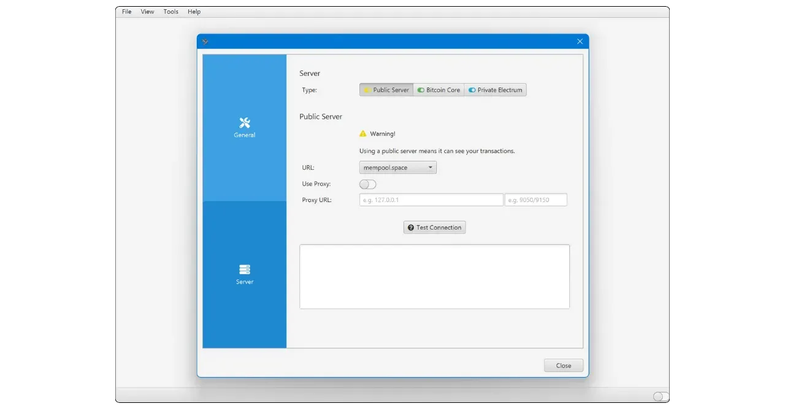

## 连接到比特币网络

为了与比特币网络互动并广播您的交易，Sparrow 必须连接到比特币节点。建立这种连接有三种主要方式：


- 🟡 使用公共节点，即连接到允许此类连接的第三方节点。如果您没有自己的比特币节点，此选项可让您快速开始使用 Sparrow。不过，您连接的节点会看到您的所有交易，这可能会危及您的机密性。控制自己的密钥至关重要，但拥有自己的节点更好。因此，只有当您刚刚开始使用 Sparrow 时才会使用这个选项，同时也要注意隐私泄露的风险。
- 🟢 连接到 Bitcoin Core 节点。如果您有自己的 Bitcoin Core 节点，您可以将其连接到 Sparrow Wallet，如果 Bitcoin Core 安装在同一台机器上，可本地连接，也可以远程连接。
- 🔵 通过 Electrum 服务器连接。如果您的比特币节点配备了 Electrs（如 Umbrel 或 Start9 等节点一体机解决方案），您可以从 Sparrow 远程连接到它。

**最好在自己的节点上通过 Electrs 或 Bitcoin Core 进行连接，以减少对第三方的信任并提高保密性**。

### 连接到公共节点 🟡

连接到公共节点非常简单。点击 "*Public Server*" 选项卡。

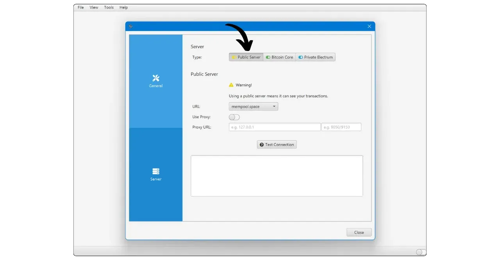

从下拉列表中选择一个节点。

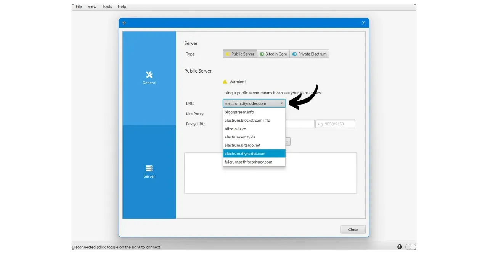

然后点击 "*Test Connection*"。

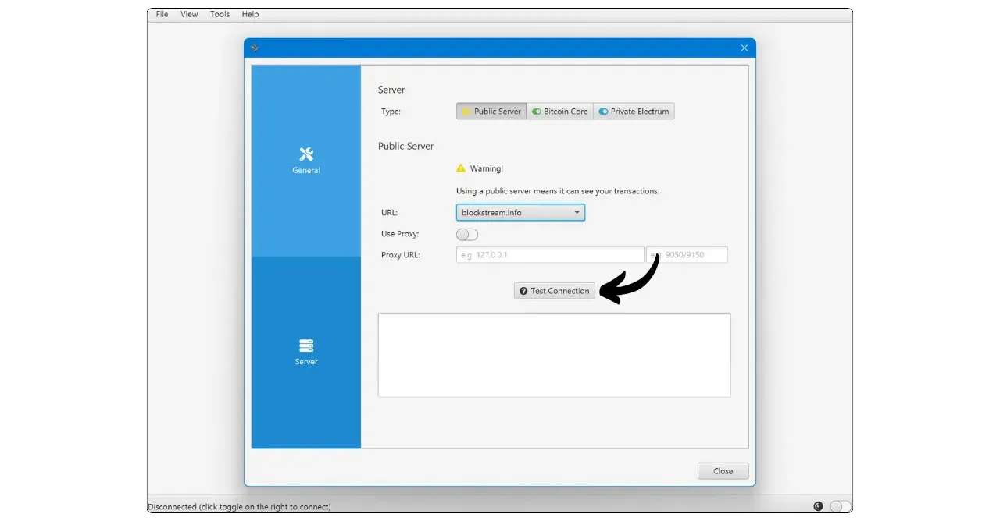

连接完成后，Sparrow Wallet 将在界面的右下角显示一个黄色的 "√"，表示您已连接到公共节点。


### 连接到 Bitcoin Core 🟢

连接比特币节点的第二种方法是将 Sparrow 与 Bitcoin Core 相连。如果已在同一台机器上安装 Bitcoin Core，则通过 cookie 文件进行身份验证。如果 Bitcoin Core 安装在远程机器上，则需要使用 `Bitcoin.conf` 文件中定义的密码。

请注意，如果使用被修剪的 Bitcoin Core 节点，就无法还原包含本地存储区块之前的交易的钱包。不过，对于在 Sparrow 上创建的新钱包来说，这不是一个问题：即使节点被修剪，新经验也是可见的。

为了配置 Bitcoin Core 节点，您可根据操作系统参考以下教程之一：

https://planb.academy/tutorials/node/bitcoin/bitcoin-core-mac-windows-9684ab02-e0af-41c9-8102-86ac7c7727f3

https://planb.academy/tutorials/node/bitcoin/bitcoin-core-linux-568c13a6-8746-4d63-8e95-f4a61c5ae0ed

在 Sparrow 上，前往 "*Bitcoin Core*" 选项卡。

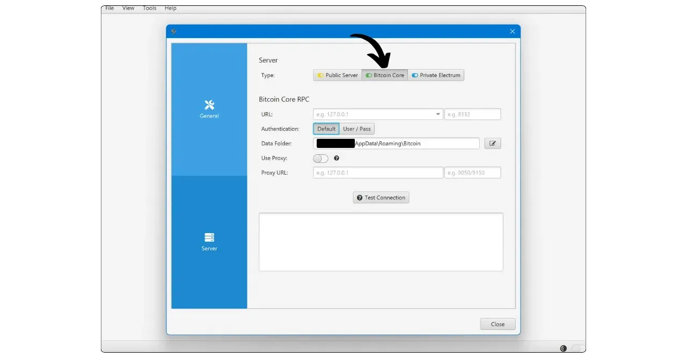

**使用本地 Bitcoin Core：**

如果计算机上安装了 Bitcoin Core，请在软件文件中找到 `Bitcoin.conf` 文件。如果该文件不存在，您可以创建它。用文本编辑器打开该文件并插入以下一行：

```ini
server=1
```

然后保存更改。

您也可以通过 Bitcoin-QT 的界面图形进行此操作，方法是前往 "*Settings*" > "*Options...*" 并选择 "*Enable RPC server*"。

做完这些更改后，不要忘记重新启动软件。

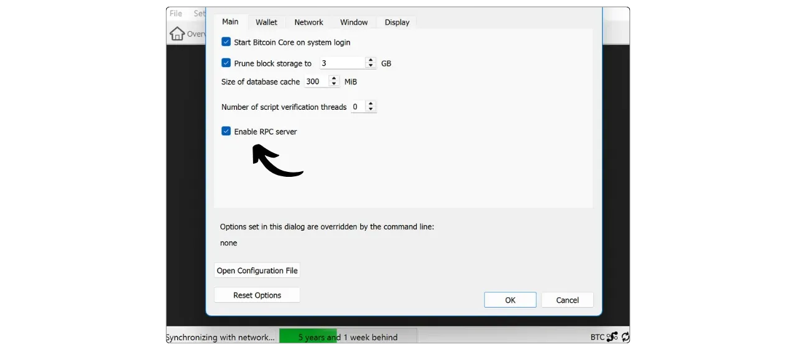

然后返回 Sparrow Wallet，输入 cookie 文件的路径，通常与 `Bitcoin.conf` 位于同一文件夹，具体取决于操作系统：

| **macOS**   | ~/Library/Application Support/Bitcoin |
| ----------- | ------------------------------------- |
| **Windows** | %APPDATA%\Bitcoin                     |
| **Linux**   | ~/.bitcoin                            |

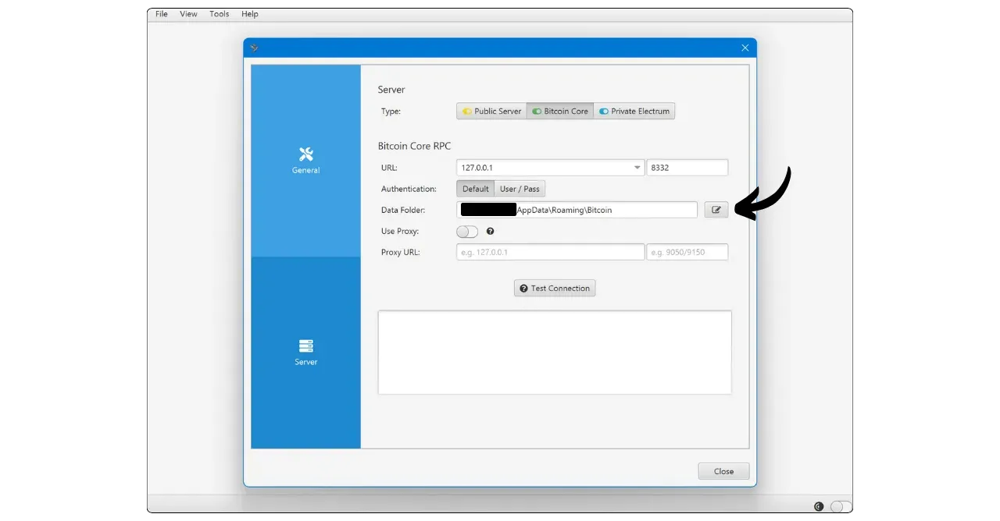

其他参数保持默认，URL `127.0.0.1` 和端口 `8332`，然后点击 "*Test Connection*"。

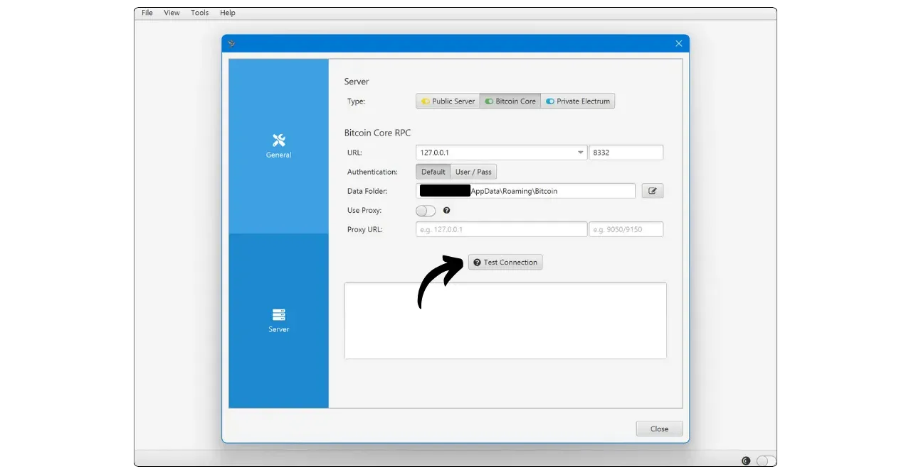

连接已建立。右下角会出现一个绿色标记，表示您已连接到 Bitcoin Core 节点。

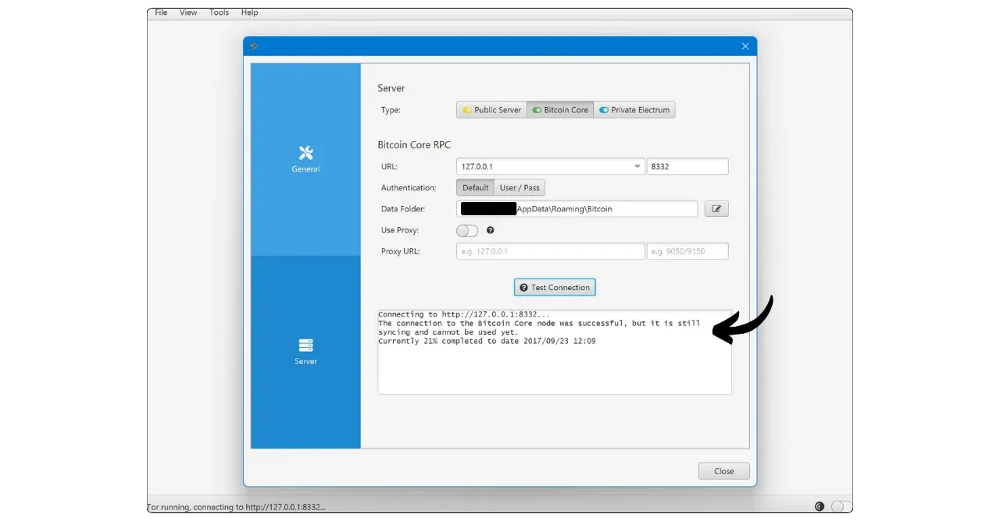

**使用 Bitcoin Core 建立远程连接：**

如果 Bitcoin Core 安装在连接到同一网络的另一台机器上，请首先在软件文件中查找 "Bitcoin.conf" 文件。如果该文件不存在，您可以创建它。用文本编辑器打开该文件并添加以下一行：

```ini
server=1
```

编辑文件后，确保将其保存在操作系统的相应文件夹中：


| **macOS**   | ~/Library/Application Support/Bitcoin |
| ----------- | ------------------------------------- |
| **Windows** | %APPDATA%\Bitcoin                     |
| **Linux**   | ~/.bitcoin                            |

该操作也可以通过 Bitcoin-QT Interface 图形界面执行。前往 “Settings” 选单，然后选择 “Options...”，然后通过选中相应的框来激活 “Enable RPC Server” 选项。如果 Bitcoin.conf 文件不存在，您可以通过单击 “Open Configuration File” 直接从此界面创建它。

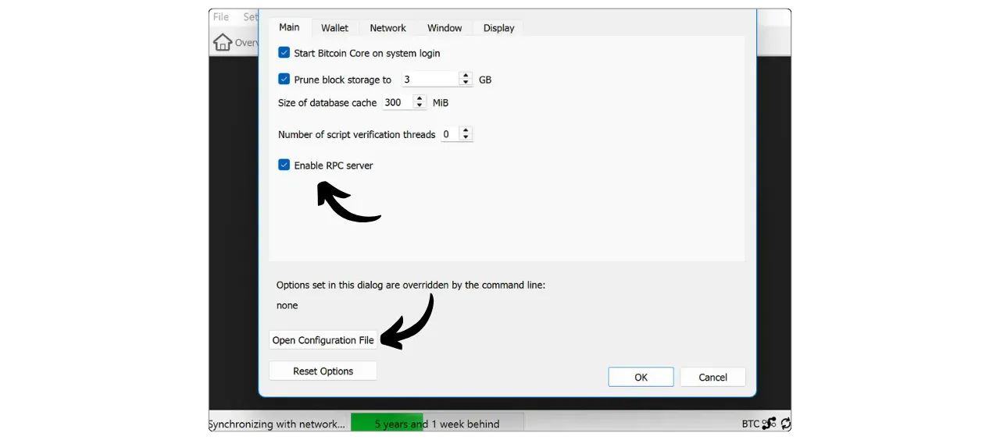

查找本地网络中托管 Bitcoin Core 的机器的 IP 地址。为此，您可以使用 [Angry IP Scanner](https://angryip.org/) 等工具。为方便起见，我们假设您的节点的 IP 地址为 `192.168.1.18`。

在 `Bitcoin.conf` 文件中添加以下几行，设置 `rpcbind=192.168.1.18` 以匹配节点的 IP 地址。

```ini
[main]
rpcbind=127.0.0.1
rpcbind=192.168.1.18
rpcallowip=127.0.0.1
rpcallowip=192.168.1.0/24
```

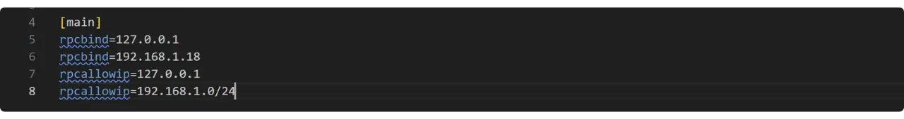

在 `Bitcoin.conf` 文件中，为远程连接添加用户名和密码。确保将 `loic` 替换为用户名，将 `my_password` 替换为高强度密码：

```ini
rpcuser=loic
rpcpassword=my_password
```

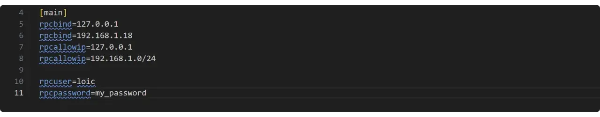

修改并保存文件后，重新启动 Bitcoin-QT 软件。

现在您可以返回 Sparrow Wallet。前往 "*User / Pass*" 选项卡。输入您在 `Bitcoin.conf` 文件中配置的用户名和密码。其他参数保持默认，即 URL `127.0.0.1` 和端口 `8332`。然后点击 "*Test Connection*"。

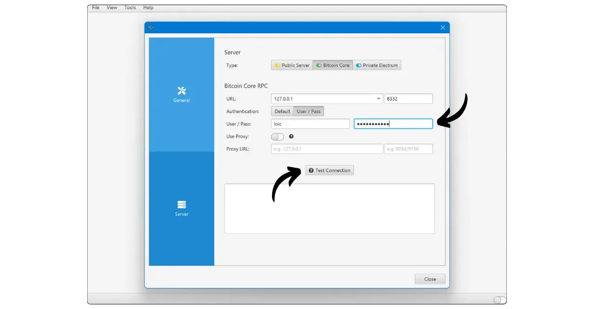

连接已建立。右下角会出现绿色标记，表示您已连接到 Bitcoin Core 节点。

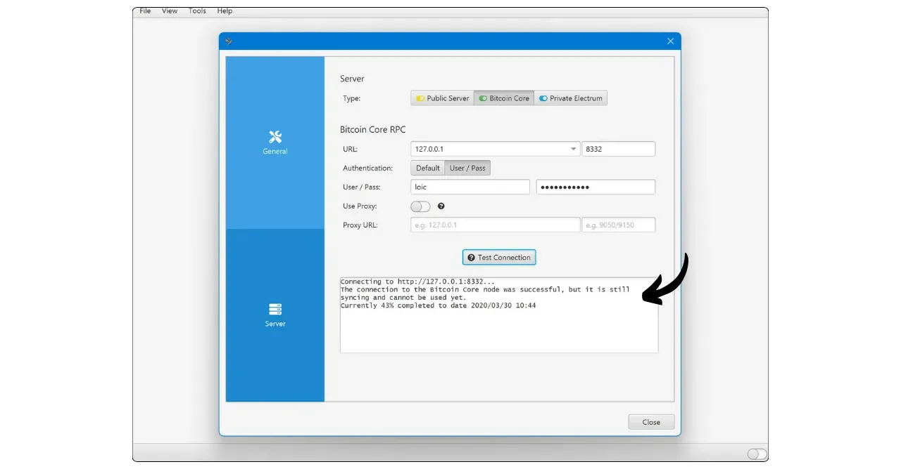

### 连接到 Electrum 服务器 🔵

最后一种连接方式是使用远程 Electrum 服务器。这种方法可以让您从其他设备通过 Tor 连接到您的节点，并利用索引器在 Sparrow 上更快地浏览您的钱包。如果您有像 Umbrel 或 Start9 这样的 "盒装节点" 解决方案，就特别适合使用这种方法。

为此，请获取 Electrum 服务器的 Tor `.onion` 地址。以 Umbrel 为例，您可以在 Electrs 应用程序中找到它。

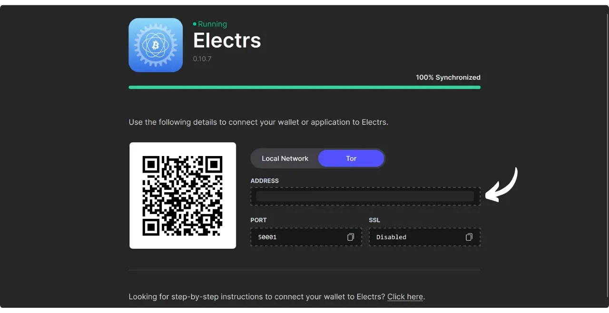

在 Sparrow Wallet 上，访问 "*Private Electrum*" 选项卡。

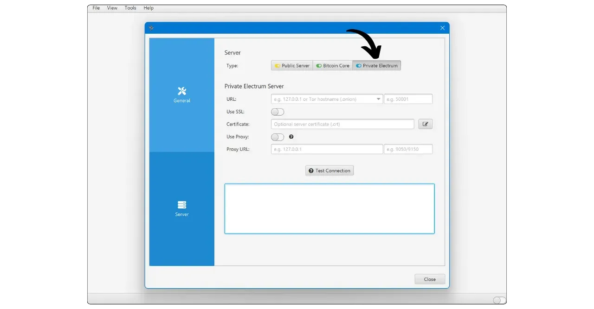

在空白处输入您的 Tor 地址。其他设置可以保持默认。然后点击 "*Test Connection*"。

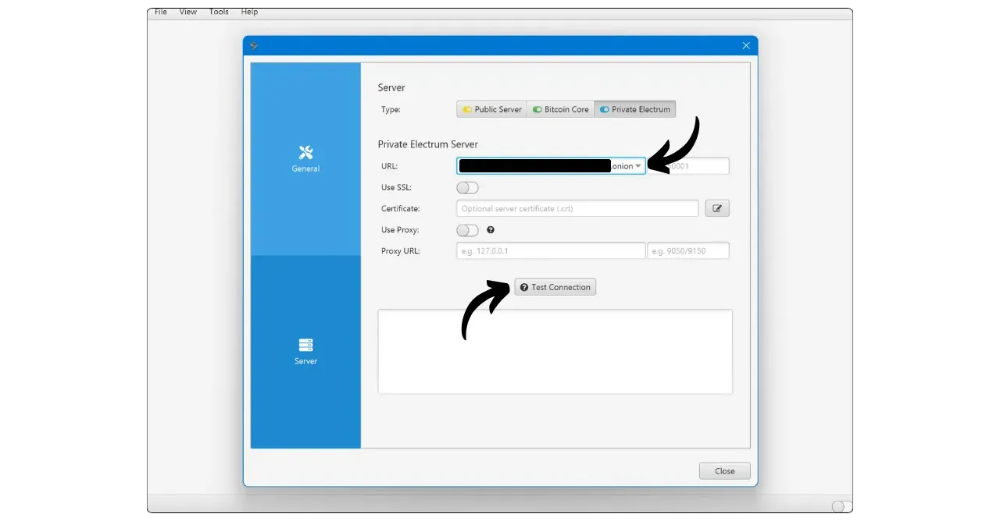

连接已确认。如果关闭此窗口，右下角会出现一个蓝色的 "√"，表明您已连接到 Electrum 服务器。

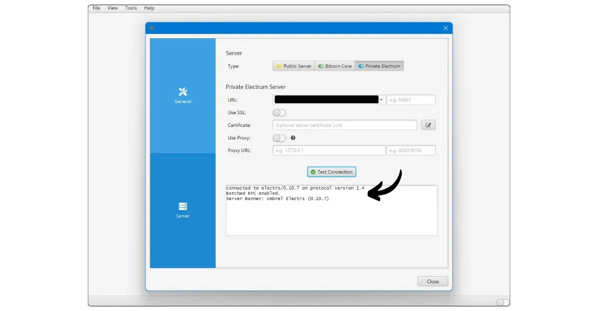

## 创建热钱包

现在 Sparrow Wallet 已配置为与比特币网络通信，您已准备好创建您的第一个钱包。本节将指导您创建热钱包，即私钥存储在您的计算机上的钱包。由于您的计算机是连接到互联网的复杂机器，因此它呈现出非常大的攻击面。因此，热钱包只能用于有限数量的比特币。为了存储较大金额，请选择带有硬件钱包的安全钱包。如果这就是您正在寻找的内容，您可以跳到下一部分。

为了创建热钱包，请在 Sparrow Wallet 主页屏幕上点击 "*File*" 选项卡，然后点击 "*New Wallet*"。

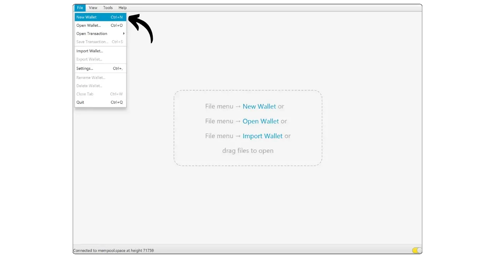

输入钱包的名称，然后点击 "*Create Wallet*"。

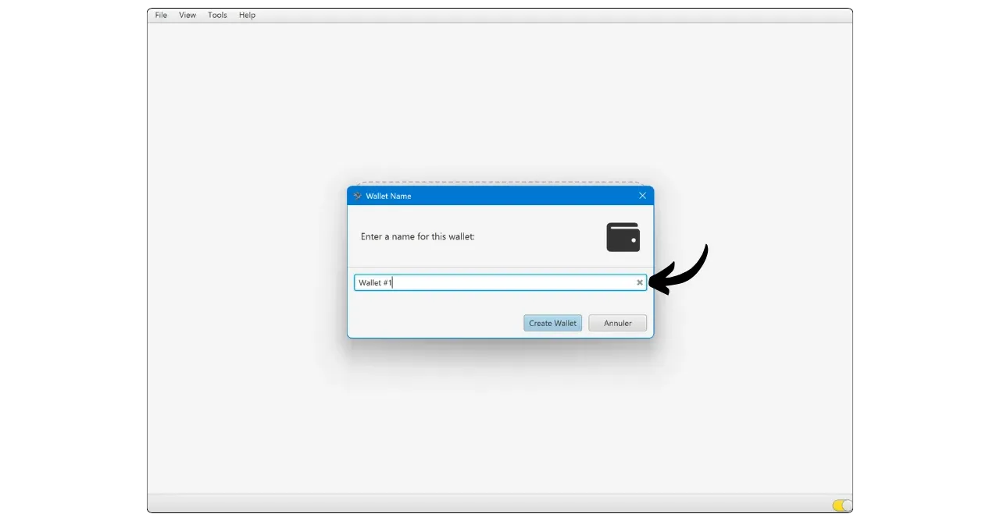

在界面的顶部，您可以选择创建 "*Single Signature*" 或 "*Multi Signature*" 钱包。在下方，选择锁定 UTXO 的脚本类型。我建议您使用最新的标准："*Taproot (P2TR)*"。


然后点击 "*New or Imported Software Wallet*"。

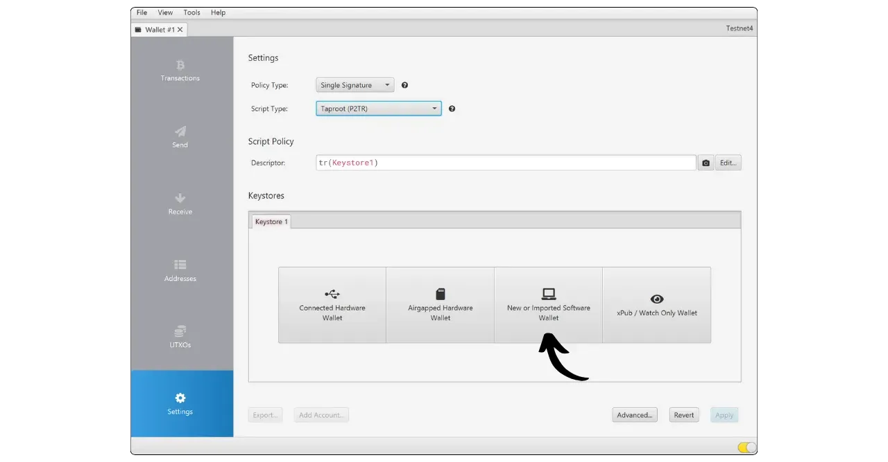

选择 BIP39 标准，因为几乎所有比特币钱包软件都支持该标准。然后，选择恢复短语的长度。目前，12 个字的短语就足够了，因为两者的安全性相似，但 12 个字的短语更容易保存。

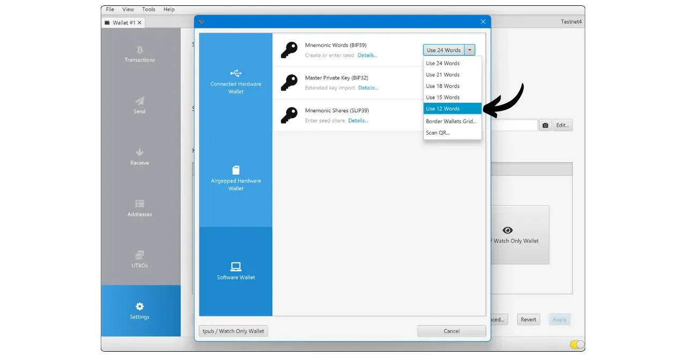

点击 "*Generate New*" 按钮以生成您的钱包的助记词。这个助记词可以完全无限制地访问您的所有比特币。任何拥有该助记词的人都可以盗取您的资金，即使无法实际访问您的电脑。

这 12 个单词的助记词可以在电脑丢失、被盗或损坏的情况下恢复对比特币的访问。因此，仔细保存并将其存放在安全的地方非常重要。

您可以将其刻在纸上，或者为了提高安全性，将其刻在不锈钢上，以防火灾、水灾或倒塌。助记词的介质选择取决于您的安全策略，但如果您使用 Sparrow 作为含有适量钱包的 “温性” 消费介质，纸张就足够了。

关于保存和管理助记词的正确方法的更多信息，我强烈推荐您阅读本教程，尤其是初学者：

https://planb.academy/tutorials/钱包/backup/backup-mnemonic-22c0ddfa-fb9f-4e3a-96f9-46e2a7954270

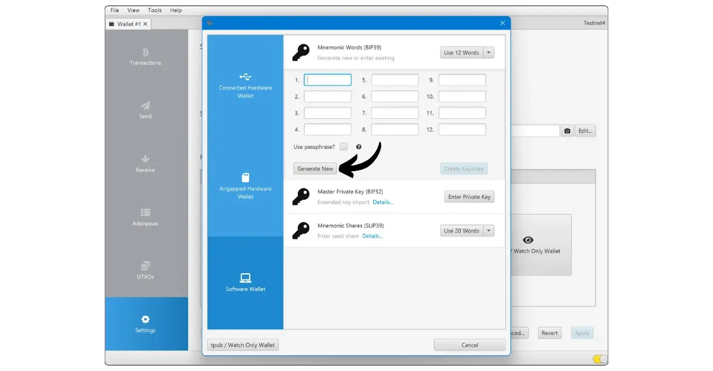

**显然，您绝不能像我在本教程中所做的那样，在互联网上分享这些单词。本例钱包将仅用于 Testnet，并将在教程结束时删除。**

您也可以点击 "*Use passphrase*" 方框，选择添加 BIP39 passphrase（密语）。警告：使用密语可能非常有用，但如果您不了解其工作原理，则可能会非常危险。这就是为什么我强烈建议您阅读这篇关于该主题的简短理论文章：

https://planb.academy/tutorials/钱包/backup/passphrase-a26a0220-806c-44b4-af14-bafdeb1adce7

将助记词和任何密语保存到物理介质后，单击 "*Confirm Backup*"。


重新输入 12 个单词，确认已正确保存，然后点击 "*Create Keystore*"。

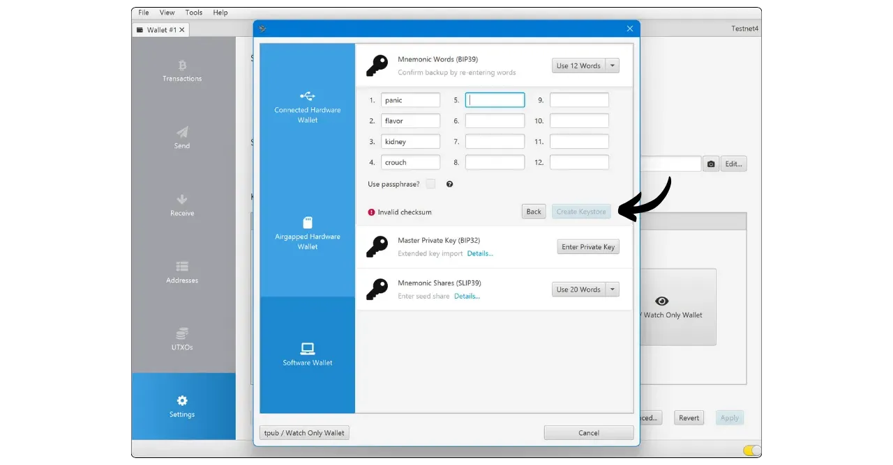

然后点击 "**Import Keystore**（导入密钥库）"，以使用助记词中导入钱包密钥。

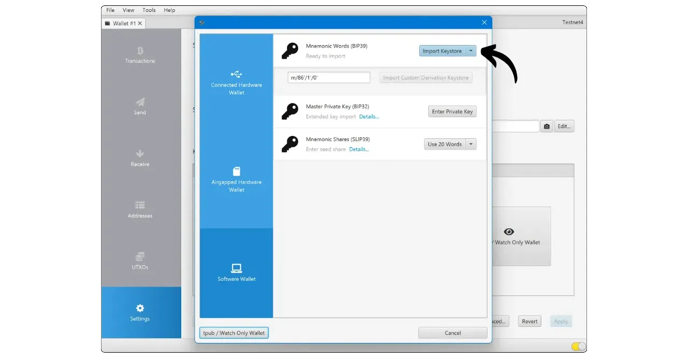

点击 "*Apply*"，完成创建钱包。


设置一个强大的密码，以保护您的 Sparrow Wallet 上的钱包。最好将密码保存在密码管理器中，以免忘记。请注意，该密码不参与密钥的生成。它只用于通过 Sparrow 钱包访问您的钱包。因此，即使没有这个密码，您的助记词也足以从任何兼容 BIP39 的应用程序访问您的比特币。

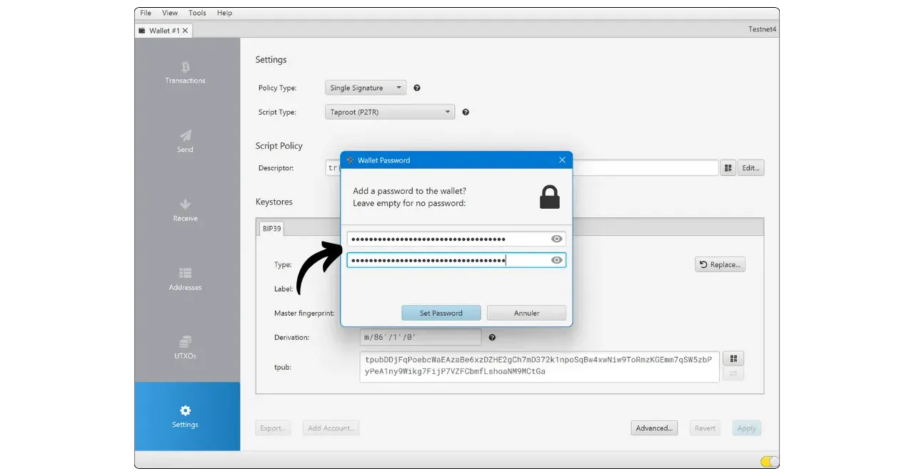

您的热钱包已创建。如果您不打算将硬件钱包与 Sparrow 一起使用，可以跳到本教程的*接收比特币*部分。

## 管理冷钱包

使用 Sparrow Wallet 的第二种方法是将其设置为硬件钱包的钱包管理器。在这种配置下，Bitcoin Wallet 的私钥只保留在硬件钱包上，而 Sparrow 只能访问公共信息。这种方法比上面讨论的热钱包具有更高的安全性，因为私钥保存在专门的设备上，通常带有安全芯片，不与互联网连接，因此攻击面比传统计算机小得多。

将硬件钱包与 Sparrow 连接有两种主要方式：

- 通过电缆，通常与 Trezor Safe 3 或 Ledger Nano S Plus 等入门级型号一起使用；
- 在空气隔离（Air-Gap）模式下，即没有直接有线连接，通过 MicroSD 卡或二维码交换。

Sparrow 支持这些通信方式，并与市场上大多数硬件钱包兼容。

在本教程中，我将使用带电缆的 Ledger Nano S，但在气隙模式下操作步骤类似。关于硬件钱包的具体细节，请参阅 Plan ₿ Academy 的专门教程。

开始之前，请确保硬件钱包上已经配置了钱包。如果使用有线连接，请通过电缆将其连接到电脑。

要将所谓的 "*Keystore*"（管理钱包所需的公共信息）导入 Sparrow Wallet，请点击 "*File*" 标签，然后点击 "*New Wallet*"。

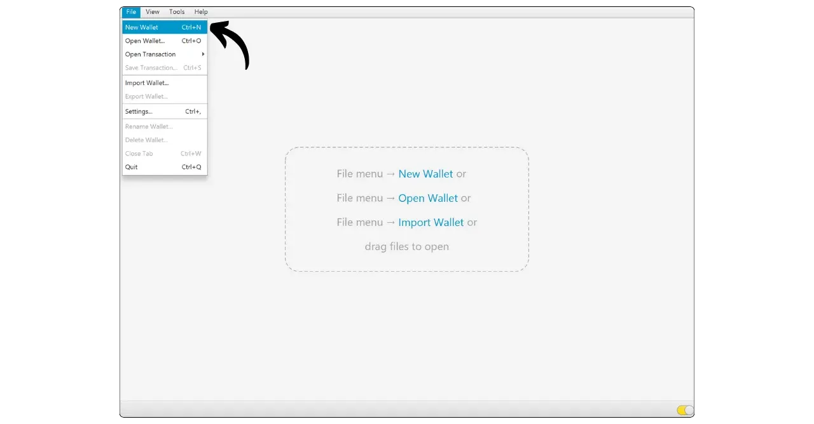

为您的钱包命名，然后点击 "*Create Wallet*"。我建议您输入硬件钱包的名称，以方便日后识别。

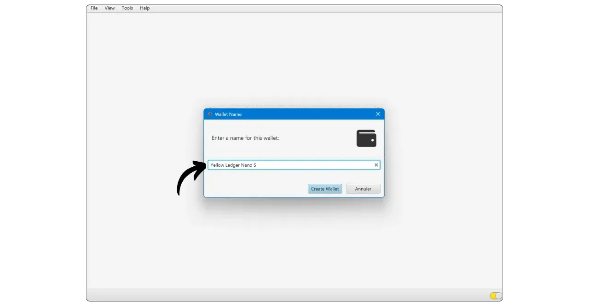

在界面顶部，选择 "*Single Signature*"或 "*Multi Signature*" 钱包。在我们的示例中，我们将配置单签名（Single Signature）钱包。

请在下面选择锁定 UTXO 的脚本类型。如果您的硬件钱包支持，我建议您选择 "*Taproot (P2TR)*"。

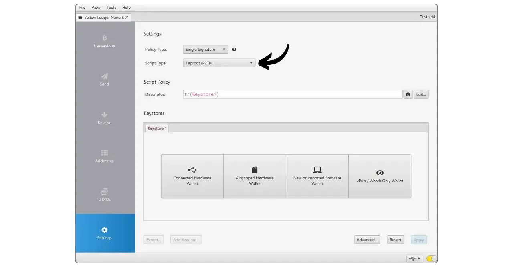

接下来，连接方法不同，步骤也不同。如果使用空气隔离方法，请选择 "*Airgapped Hardware Wallet*"。然后按照设备的具体说明进行操作。

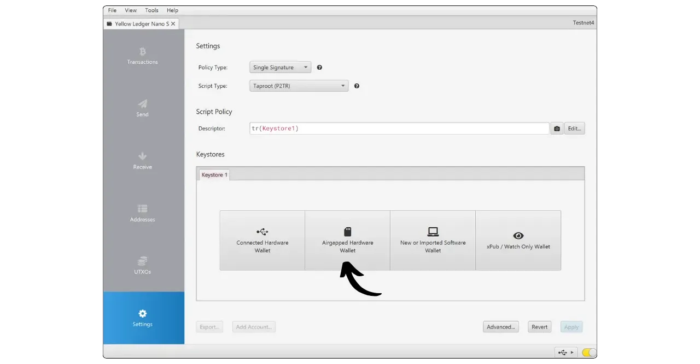

如果像我一样使用电缆连接，请选择 "*Connect Hardware Wallet*"。

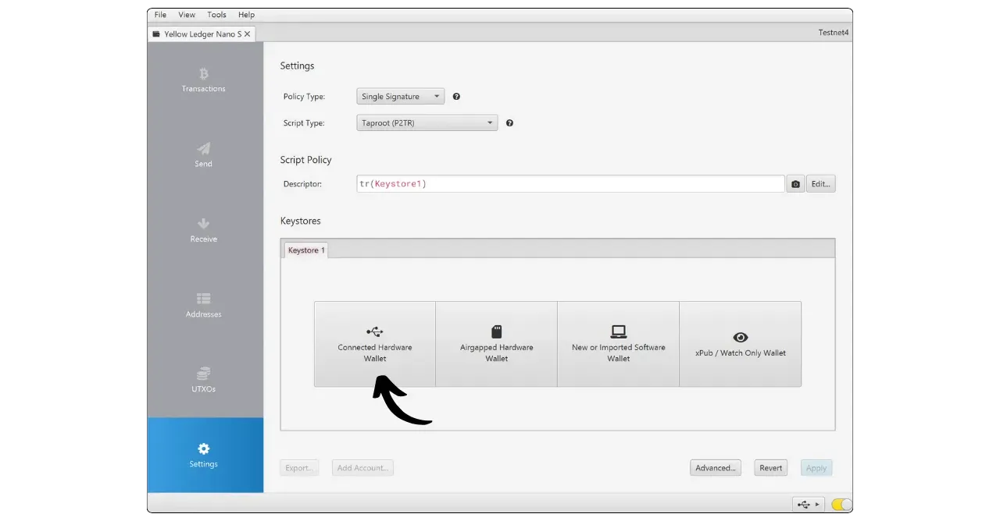

点击 "*Scan*"，让 Sparrow 检测您的设备。确保设备已插入并解锁。对于某些型号的设备，如 Ledger，您需要打开 "*Bitcoin*" 应用程序以启用检测。

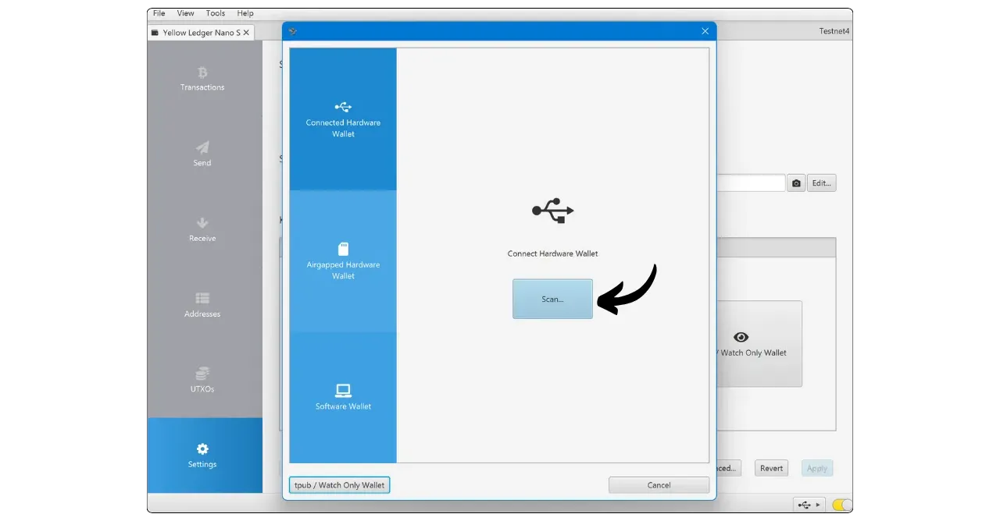

选择 "*Import Keystore*"。

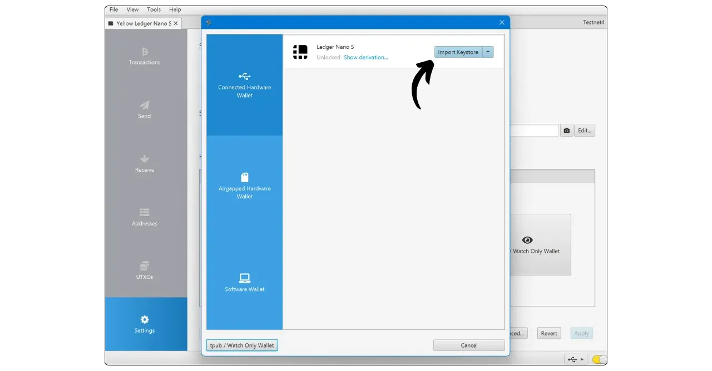

点击 "*Apply*"，完成钱包创建。

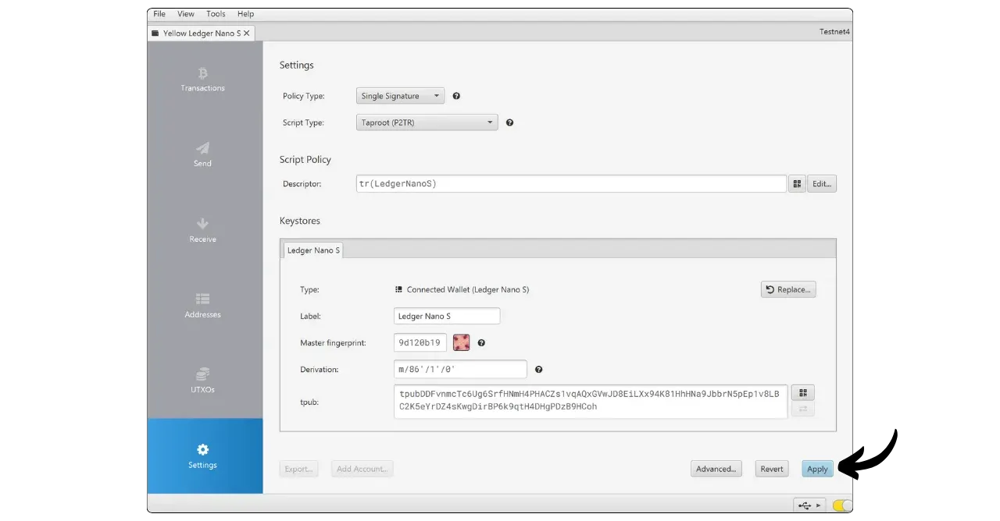

设置一个强大的密码，以保护 Sparrow Wallet 的安全。该密码将保护您的公钥、地址和交易历史。我们建议您将其保存在密码管理器中。请注意，该密码与密钥的生成无关。即使没有该密码，您也可以通过任何兼容 BIP39 的软件恢复对助记词的访问。

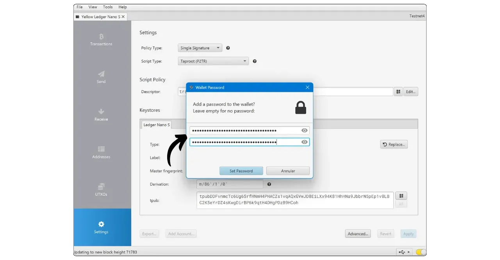

您的管理组合已在 Sparrow 上配置完毕。

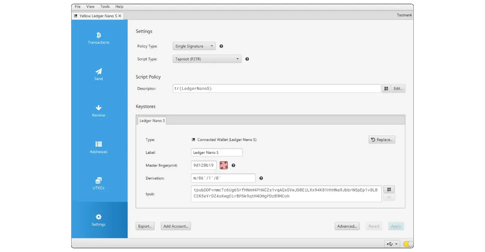

## 接收比特币

现在您的钱包已经在 Sparrow 上设置好了，您可以接收比特币了。只需进入 "*Receive*" 选单即可。

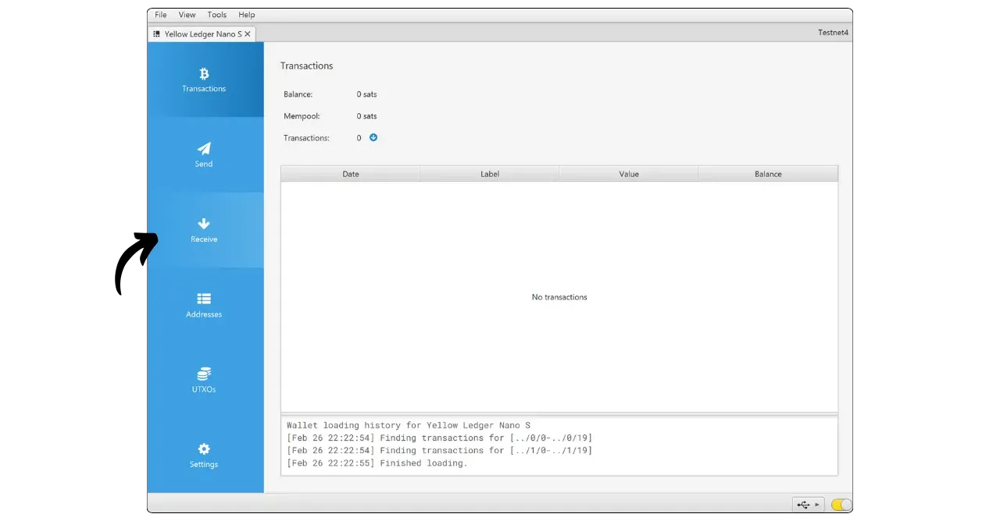

Sparrow 将在您的钱包中显示第一个未使用的地址。您可以为这个地址添加一个 "*Label（标签）*"，以便将来提醒您这些比特币的来源。

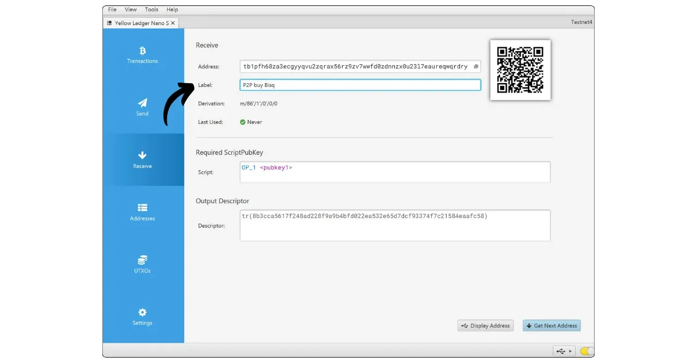

如果您使用热钱包，则可以通过复制或扫描相关二维码立即使用显示的地址。

如果您使用硬件钱包，请务必在使用前检查设备屏幕上的地址。对于有线设备，连接并解锁硬件钱包，然后在 Sparrow 中点击 "*Display Address*"。确保硬件钱包上显示的地址与 Sparrow 上显示的一致。

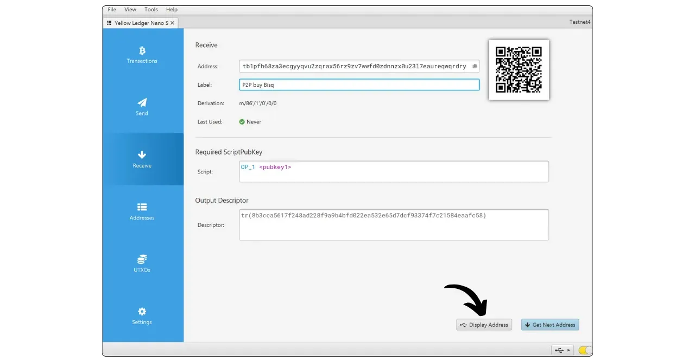

对于空气隔离硬件钱包用户，地址验证因设备型号而异。为了了解精确的说明，请参阅专门的 Plan ₿ Academy 教程。

一旦付款人广播了交易，您就会看到它出现在 "*Transactions*" 选项卡中。您可以点击查看更多详细信息，如其 txid。

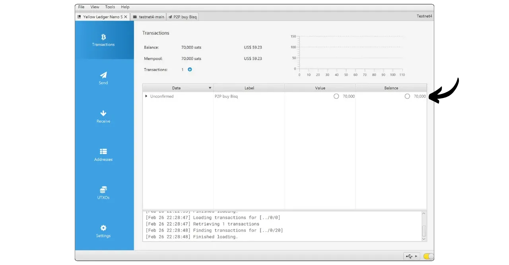

在 "*Addresses*" 选项卡中，您将找到所有收件箱地址的列表。您可以查看它们是否已被使用以及是否已添加标签。"*Receive*" 地址是 Sparrow 在您点击 "*Receive*" 时显示的地址，用于接收付款。"*Change*"（找零）地址用于交易中的找零，即收回输入中未花费的 UTXO 部分。

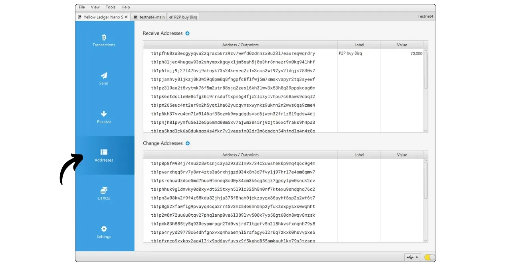

在 **UTXOs**（UTXOs）选项卡中，您可以看到所有的UTXOs，即您持有的Bitcoin碎片。您可以看到每个 UTXO 的数量和相关标签。

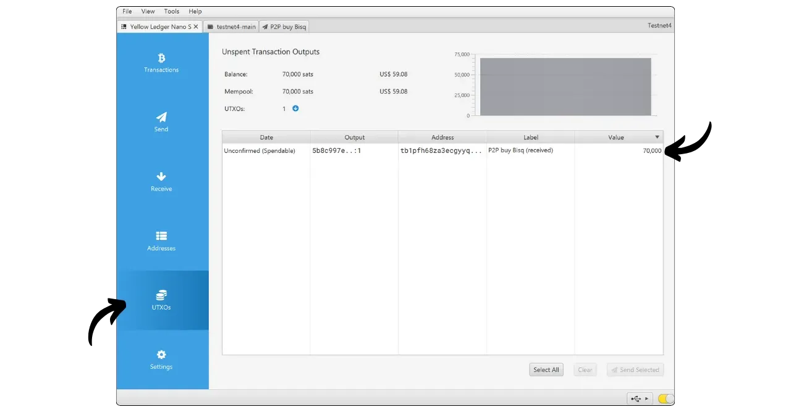

## 发送比特币

现在您的钱包中已经有了一些比特币，您也可以尝试发送它。尽管有多种方法可以做到这一点，但我建议您使用 “*UTXOs*” 选单来更精确地控制您花费的比特币（*币控制*），而不是直接进入 “*Send*” 选单（尽管如果您是初学者，后者可能就足够了）。

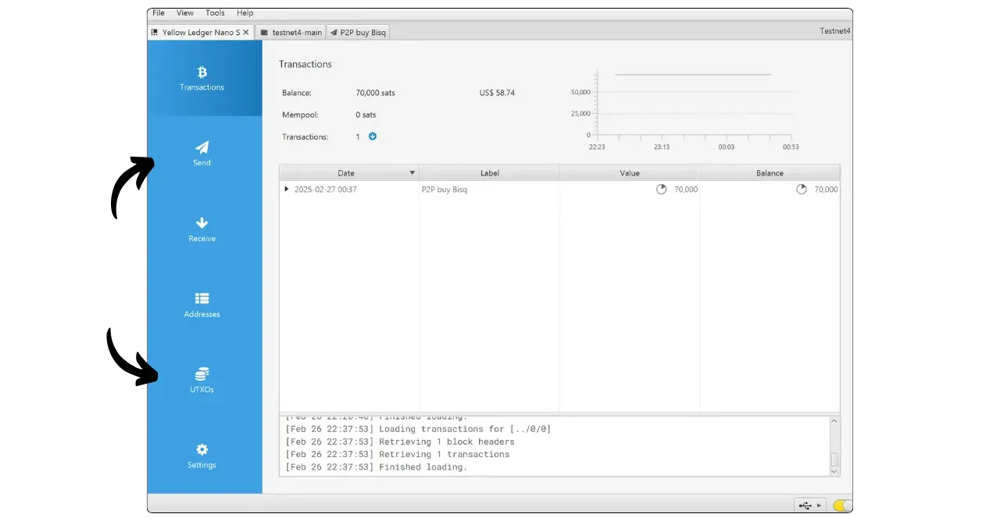

选择您希望作为该交易输入的 UTXOs，然后点击 "*Send Selected*"。这种方法允许您根据您的费用和收到时应用的标签，在您的 UTXO 中选择最合适的来源，以优化您的付款的保密性。确保所选 UTXO 的总和大于您想要发送的金额。

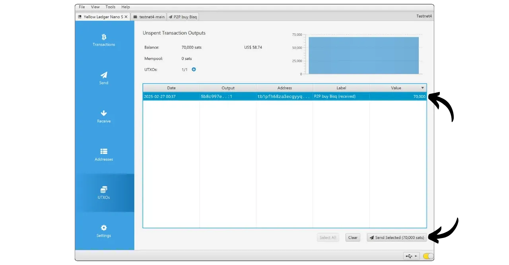

在 "*Pay to*" 字段中输入接收者的地址。您也可以点击摄像头图标，用网络摄像头扫描地址。通过 "*+Add*" 按钮，您可以在一次交易中支付多个地址。

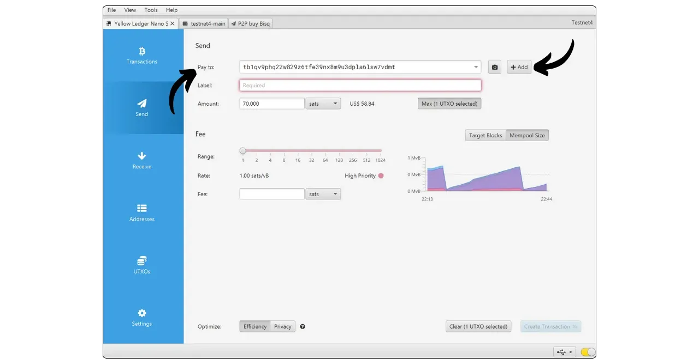

为您的交易添加一个标签，以提醒您交易的目的。该标签也将与您最终的交换相关联。

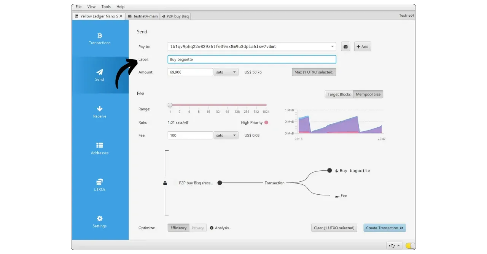

输入要发送到此地址的金额。

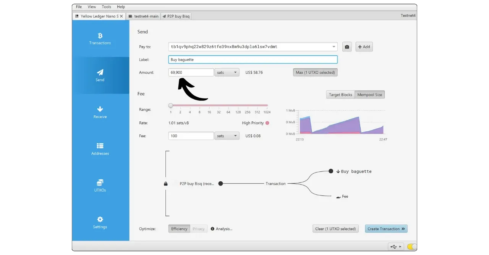

根据当前市场条件调整费用。您可以通过输入绝对费用值或使用滑块调整费率来完成此操作。

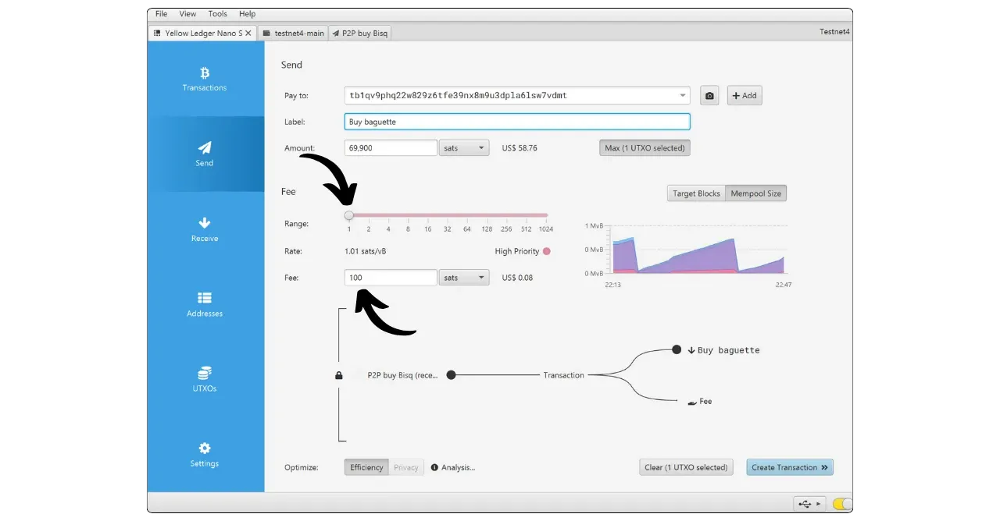

在界面的底部，您可以选择 "*Efficiency*" 和 "*Privacy*"。就我而言，"*Privacy*" 选项不可用，因为我的钱包中只有一个 UTXO。"*Efficiency*" 相当于传统交易，而 "*Privacy*" 则是Stonewall 类的交易，这种交易结构通过模拟小型混币来加强保密性，从而使链式分析更加复杂。

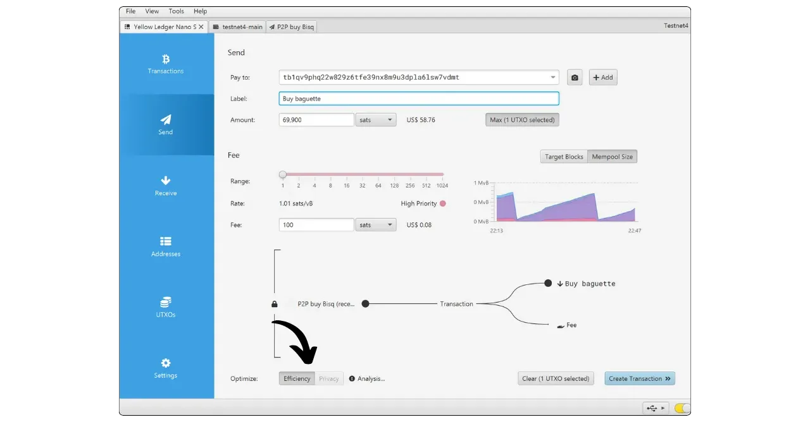

Sparrow 会显示一个摘要图，显示您的输入、输出和交易费用（注意，费用实际上不是输出，这与此图所示相反）。如果您对一切都满意，请点击 "*Create Transaction*"。

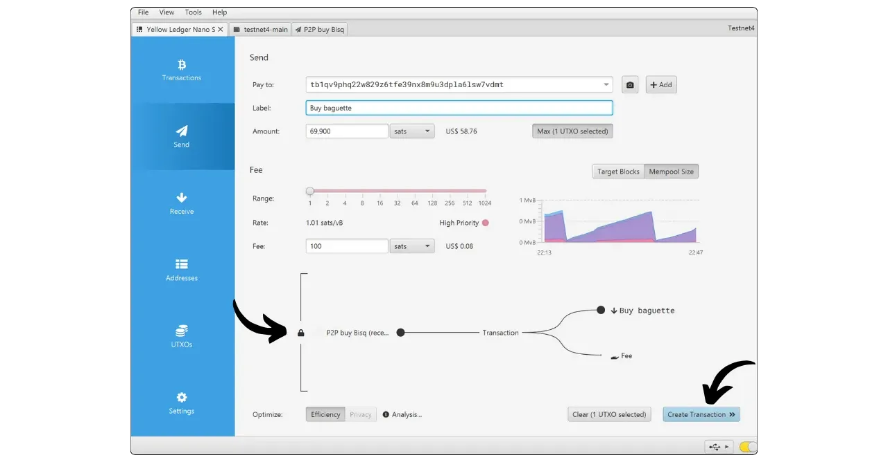

这将带您进入一个页面，详细介绍交易的 Elements 信息。检查所有信息是否正确，然后点击 "*Finalize Transaction for Signing*"。

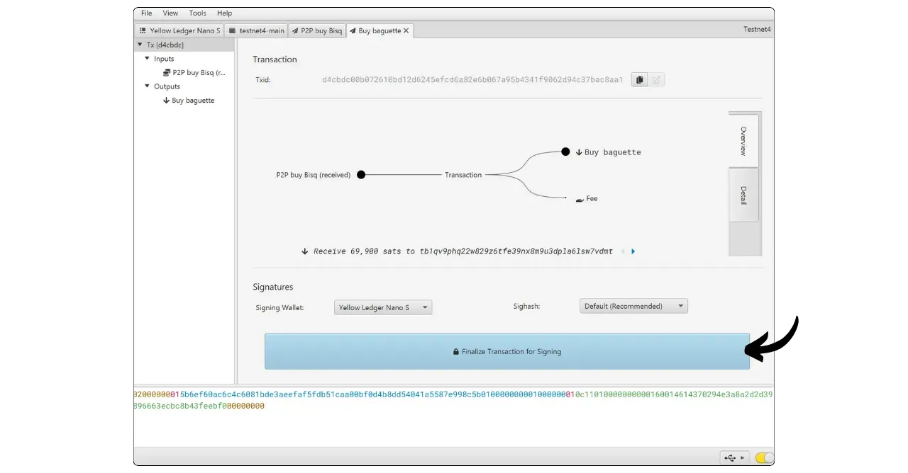

保持 Sighash 的默认状态非常重要。为了了解其原因，请参阅本培训课程，我将在课程中为您讲解有关 Sighash 的所有知识：

https://planb.academy/courses/46b0ced2-9028-4a61-8fbc-3b005ee8d70f

在下一个页面中，选项会根据您使用的钱包类型而有所不同：


- 对于空气隔离的硬件钱包，点击 "*Show QR*" 以显示 PSBT，您可以用设备签名，然后使用 "*Scan QR*" 将已签名的 PSBT 加载到 Sparrow 中。"*Save Transaction*" 选项的工作方式与此类似，但使用 microSD 完成；
- 对于热钱包，只需点击 "*Sign*" 并输入钱包密码即可签名；
- 对于有线的硬件钱包，也可点击 "*Sign*" 将未签名的交易发送到您的设备上。

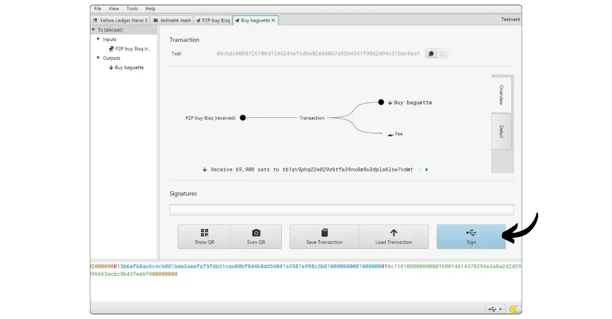

在您的硬件钱包上检查接收者的地址、发送金额和费用。如果一切无误，请继续签名。

交易签名完成后，将重新出现在 Sparrow 中，准备在比特币网络上广播，以便随后纳入区块。如果一切正常，请点击 "*Broadcast Transaction*"。

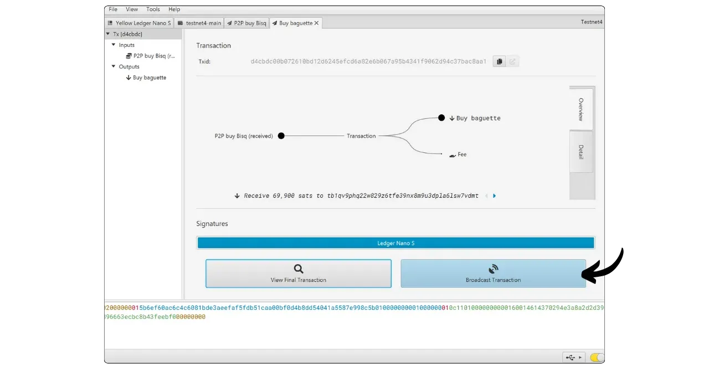

您的交易正在广播，等待确认。

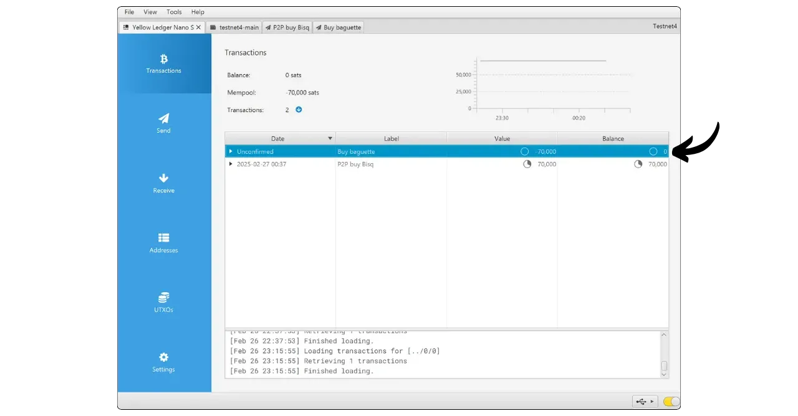

## 在 Sparrow 上管理和配置钱包

在 "*Settings*" 选项卡中，您可以找到关于钱包的详细信息，例如 ：


- 钱包类型（单签名或多签名） ；
- 使用的脚本类型 ；
- 您为钱包指定的名称 ；
- 主密语指纹；
- 派生路径；
- 账户的扩展公钥。

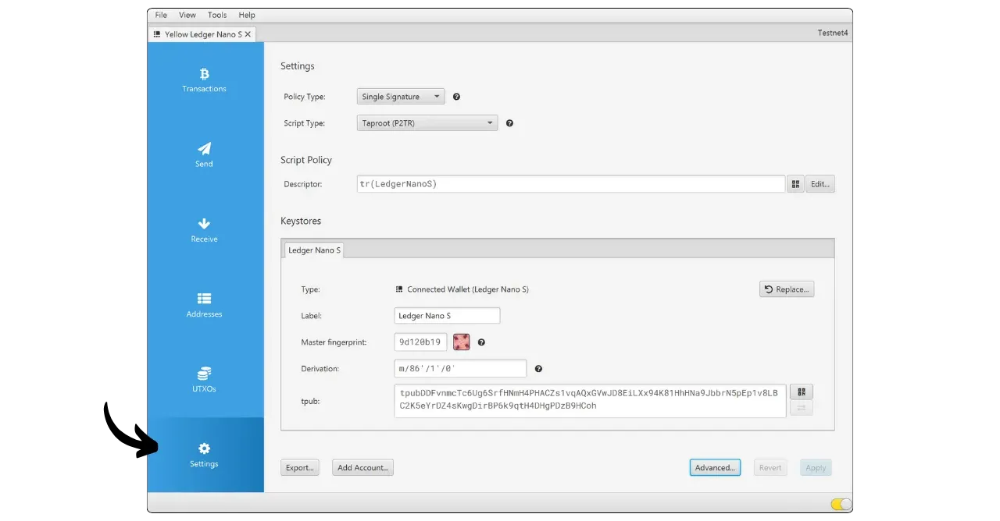

通过 "*Export*"按钮，您可以导出钱包信息，以便在其他软件中使用，同时保留在 Sparrow 中设置的信息。

通过 "*Add Account*" 按钮可让您向钱包添加其他账户。一个账户对应于一组单独的接收地址。例如，如果您希望使用单个助记词分隔个人账户和企业账户，则此功能非常有用。

通过 "*Advanced*" 按钮可进入高级设置，如自定义 Sparrow 的地址搜索和更改钱包密码。

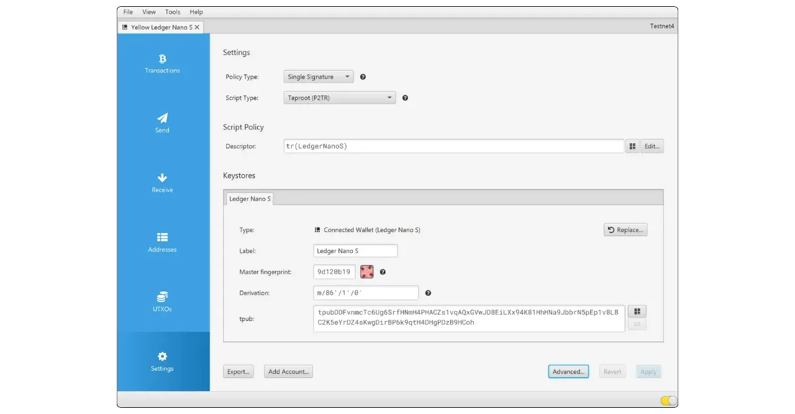

关闭 Sparrow Wallet 时，钱包会自动锁定。下次打开软件时，窗口会提示您使用密码解锁钱包。

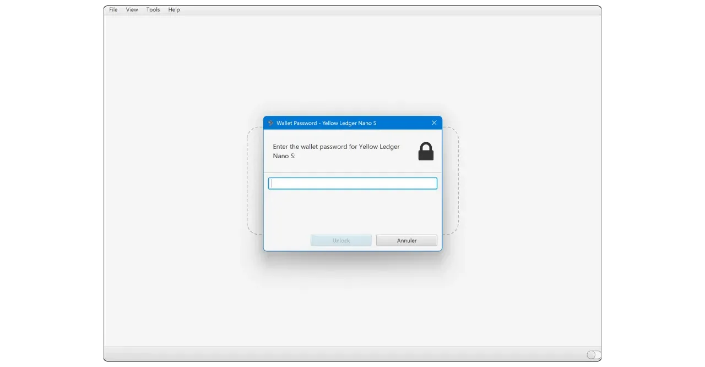

如果该窗口没打开，或者您希望在 Sparrow 上打开另一个钱包，请单击 "*文件*" 选项卡并选择 "*Open Wallet*"。

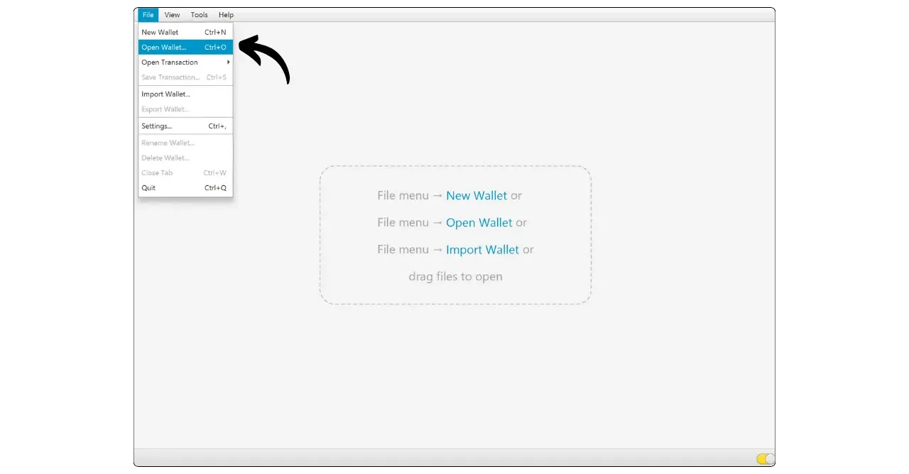

这将打开文件管理器，进入 Sparrow 存储钱包的文件夹。只需选择要打开的 钱包，输入密码即可解锁。

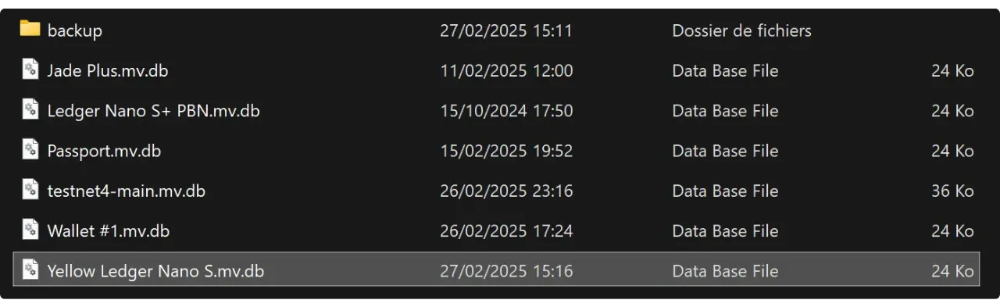

在 "*Settings*" 下的 "*File*" 选单中，您可以看到前几节已经介绍过的比特币网络连接参数。您还可以调整各种参数，例如使用的单位、用于转换的法定货币和信息源。

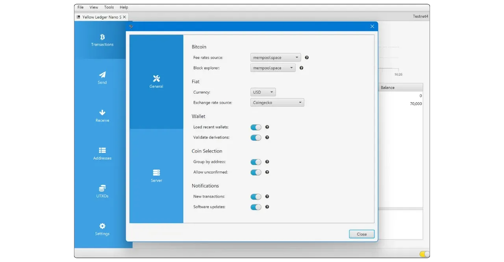

"*View*" 选项卡提供自定义选项和一些有用的命令，如 "*Refresh Wallet*"，可刷新您钱包的交易搜索。

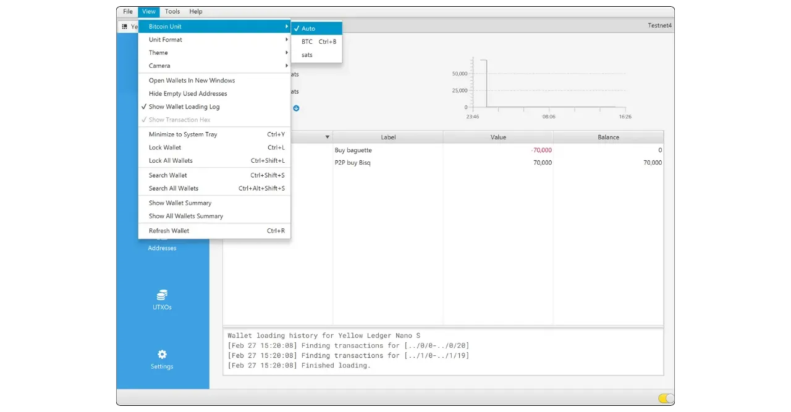

"*Tools*" 选项卡将几个高级工具组合在一起，包括：


-  "*Sign/Verify Message*" 允许您证明拥有接收地址或验证签名。
- "*Send To Many*" 提供了一种简化的界面方式，可同时向多个接收地址进行交易，方便批量消费。
- "*Sweep Private Key*"，允许您检索由简单私钥保护的比特币并将其转移到您的 Sparrow Wallet。这对于那些拥有 2010 年代初期、HD 钱包时代之前的比特币的人来说特别有用。
- "Verify Download" 可验证下载软件的完整性和真实性，然后再将其安装到设备上。
- “*Restart In*” 允许您切换到 Testnet 或 Signet 网络上的钱包。如果您想使用没有实际价值的模拟比特币访问 testnet，这将非常有用。

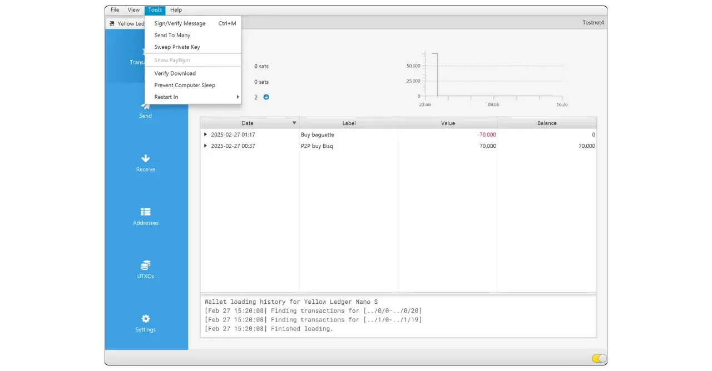

您现在已经了解了 Sparrow Wallet 软件，这是一款用于日常管理比特币钱包的出色工具。

如果您发现本教程有用，如果您能在下面留下一个园艺拇指，我将非常感激。请随意在您的社交网络上分享。非常感谢！

我还推荐另一个教程，其中解释了如何使用 Sparrow Wallet 配置硬件钱包 COLDCARD Q：

https://planb.academy/tutorials/wallet/hardware/coldcard-q-73e86d1a-6fe6-4d8b-bb15-8690298020e3
