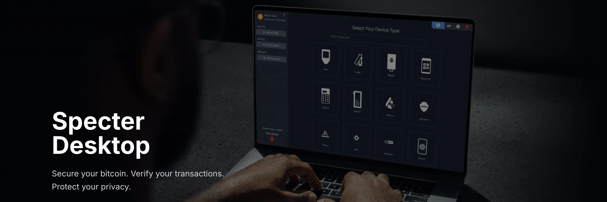

Specter Desktop 是一款开源应用程序（MIT 许可证），由 Cryptoadvance 自 2019 年起开发，旨在简化您使用硬件钱包（例如 Ledger、Trezor、Coldcard、BitBox02、Passport 等）和您自己的比特币基础设施（例如 Bitcoin Core 节点或 Electrum 服务器）管理比特币钱包的过程。该应用程序尤其擅长多重签名配置，允许您通过在多个独立的硬件钱包之间分配签名权来保护大额资金。

**在本教程中，您将学习如何：**

- 在您的电脑（Windows、macOS 或 Linux）上安装和配置 Specter Desktop
- 将 Specter 连接到 Electrum 服务器（本示例使用 Umbrel）
- 使用硬件钱包（Coldcard）创建一个简单的钱包
- 完全自主地接收和发送比特币
- 设置一个包含多个硬件钱包的 2-of-3 多签名钱包
- 在 Umbrel 服务器上安装 Specter（进阶技巧）

您的所有交易都将通过您自己的基础设施在本地进行验证，无需将任何信息传输到外部服务器，从而确保您的隐私和财务自主权。签名前，请务必在您的硬件钱包屏幕上检查交易。

## 下载和安装

访问 Specter Desktop 官方网站下载应用程序。

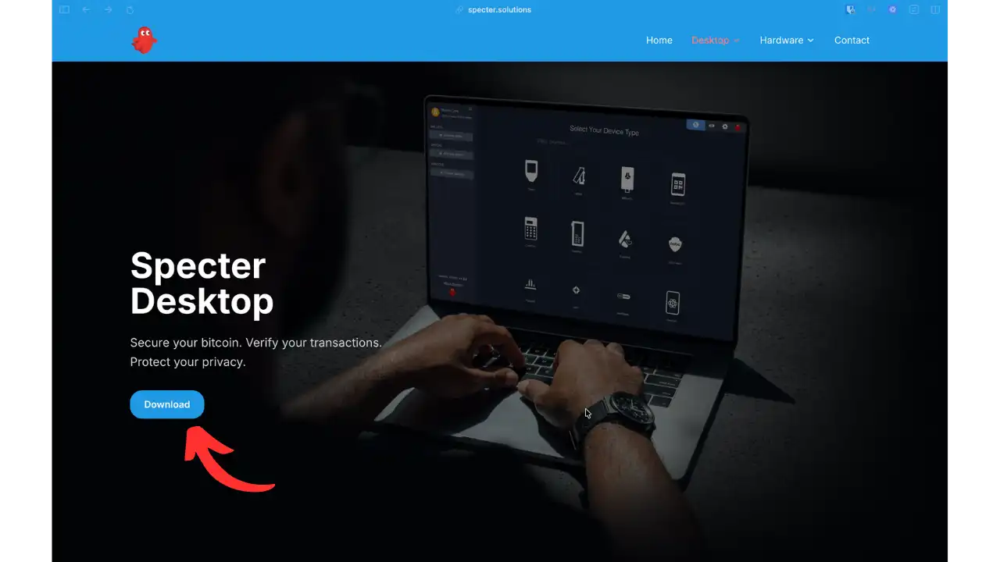

在下载页面，选择与您的操作系统对应的版本：macOS、Windows 或 Linux。

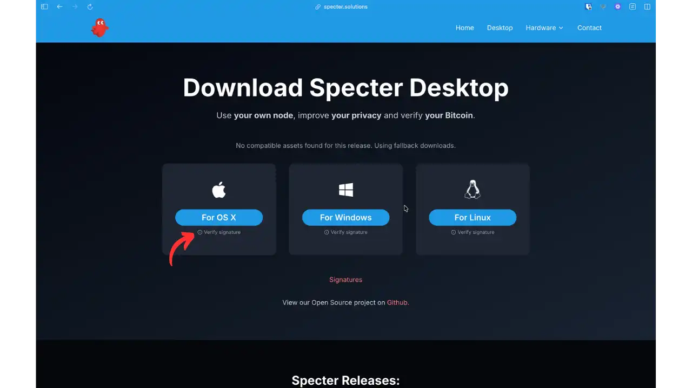

下载完成后，请按照操作系统的常规说明安装应用程序。macOS 用户请将图标拖入“应用程序”文件夹。Windows 用户请运行安装程序。Linux 用户请按照软件包说明进行操作。

## 初始配置

首次启动时，Specter Desktop 会提示您选择连接类型。您可以连接到 Electrum 服务器或您自己的 Bitcoin Core 节点。

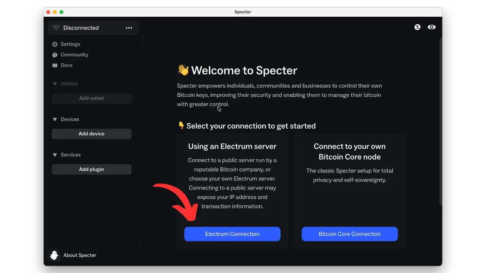

在本示例中，我们将使用连接到运行在 Umbrel 上的 Electrum 服务器的连接。

更多信息，请参阅我们的 Umbrel 教程：

https://planb.academy/tutorials/node/bitcoin/umbrel-8b0e3b5b-d3cf-4a1e-8bb8-1ad2db4dd848

此选项的同步速度比 Bitcoin Core 更快。如果您愿意，可以选择“Bitcoin Core”并配置与本地节点的连接。无论您选择哪种方式，以下步骤都相同。

选择 “Electrum Connection”，然后选择 “Enter my own” 来配置您自己的 Electrum 服务器。

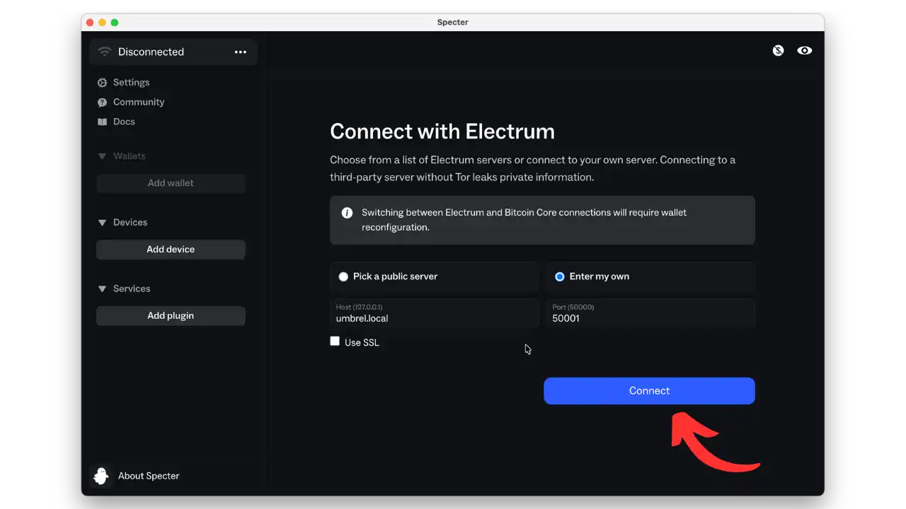

输入 Electrum 服务器的地址。以 Umbrel 为例，地址为 `umbrel.local`，端口为 `50001`。点击 "Connect" 建立连接。

连接完成后，欢迎界面就会出现，并附有一份清单供您开始使用。现在您需要添加硬件钱包。

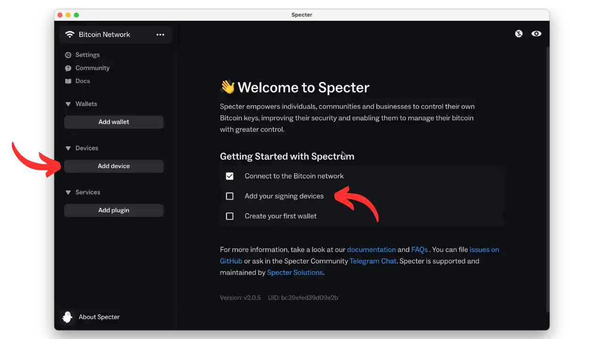

## 添加钱包硬件

在左侧选单中，点击 “Add device” 以添加您的钱包硬件。

Specter Desktop 支持多种硬件钱包：Trezor、Ledger、BitBox02、Coldcard、KeepKey、Keystone、Cobo Vault 等等。

如果您想了解更多信息，请查看我们的硬件钱包教程。

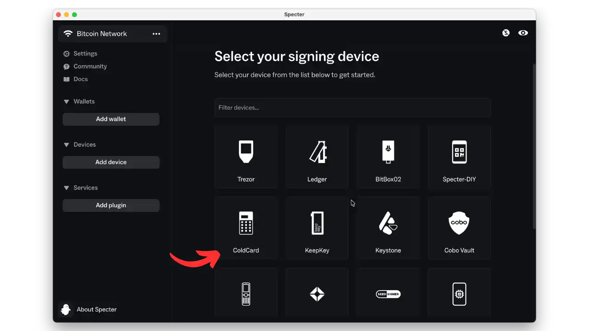

选择您的硬件钱包。在本例中，我们使用的是 Coldcard MK4。

以下是这款硬件钱包的教程：

https://planb.academy/tutorials/wallet/hardware/coldcard-mk4-5d44dd94-423d-4e37-9a8c-3fc38b45ce59

对于 Coldcard 钱包，您需要通过 USB 连接或 microSD 卡导出硬件钱包中的公钥。

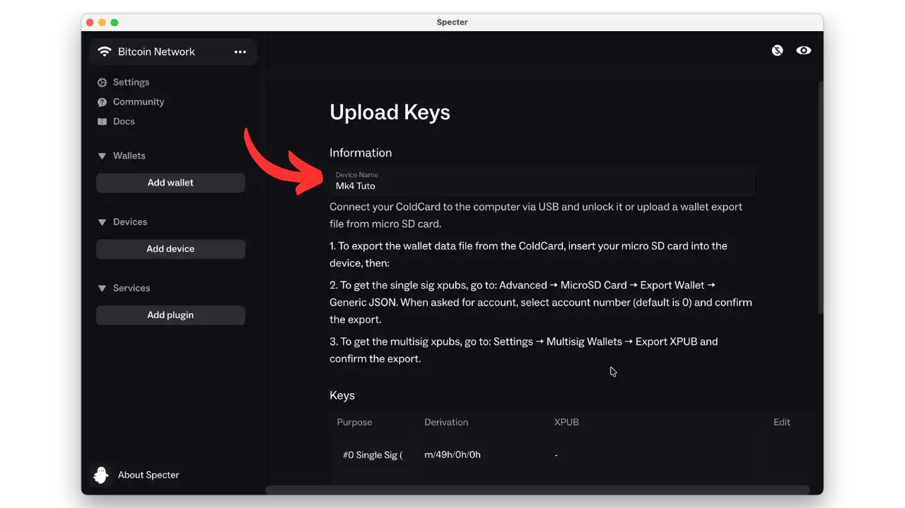

按照屏幕上的说明导出 Coldcard 钱包中的公钥。给您的钱包硬件命名（此处为“MK4 Tuto”）。公钥导入后，您可以创建一个单密钥钱包，或者添加其他硬件钱包以创建多签名钱包。

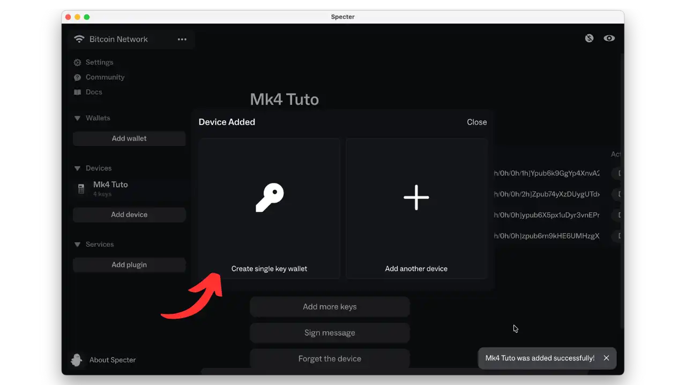

## 创建钱包

添加钱包硬件后，点击 "Create single key wallet" 以创建单签名钱包。

为您的钱包命名（例如“教程钱包”），并选择地址类型。选择 “Segwit” 以使用原生 bech32 地址，从而优化交易成本。

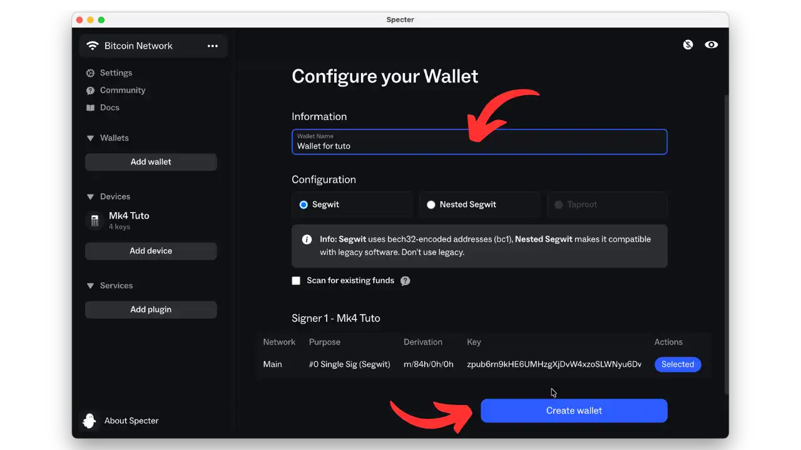

钱包创建完成后，Specter 会提示您保存一个备份 PDF 文件，其中包含恢复钱包所需的所有公共信息（描述符、扩展公钥）。此文件不包含您的私钥。

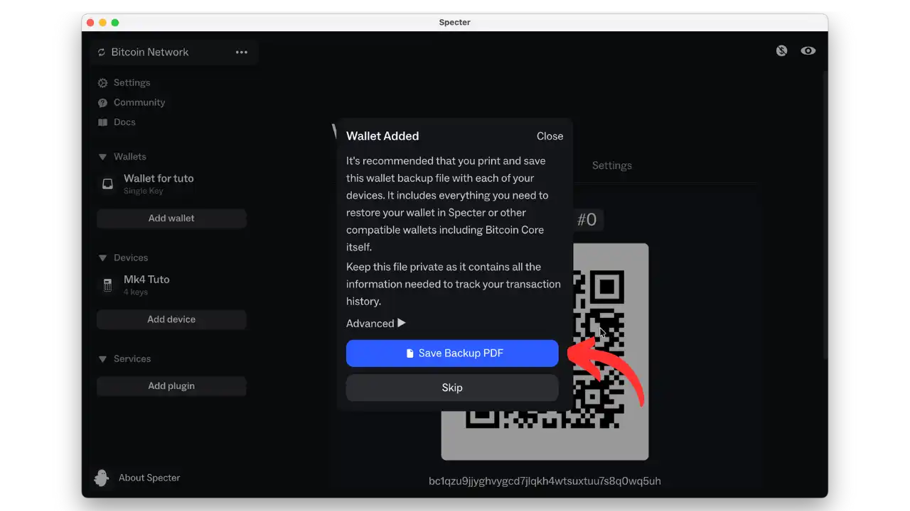

## 接收比特币

为了接收比特币，请在左侧选单中选择您的钱包，然后点击 “Receive” 选项卡。

Specter 会自动生成一个带有二维码的新接收地址。

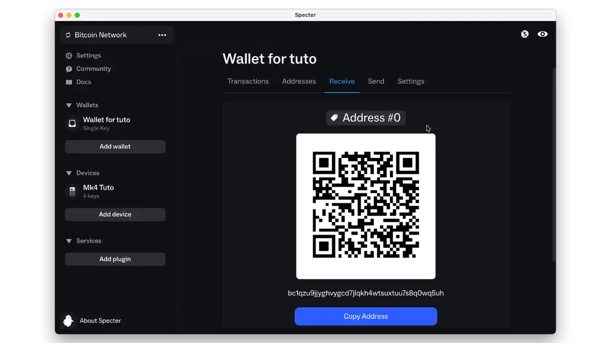

您可以复制地址或扫描二维码。在将地址发送给任何人之前，请务必检查硬件钱包屏幕上的地址。

## 查看交易历史记录和地址

收到比特币后，您可以在 “Transactions” 选项卡中查看您的交易记录

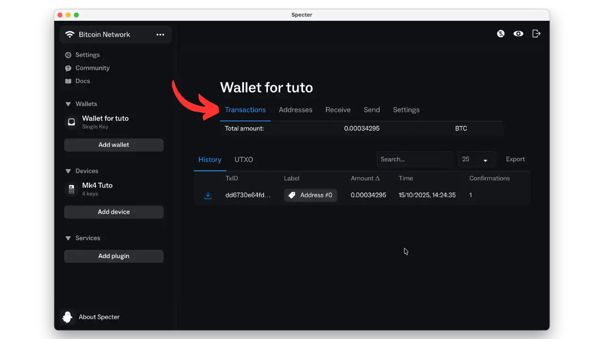

通过 "Addresses" 选项卡，您可以查看钱包生成的所有地址，以及它们的使用状态和关联金额。

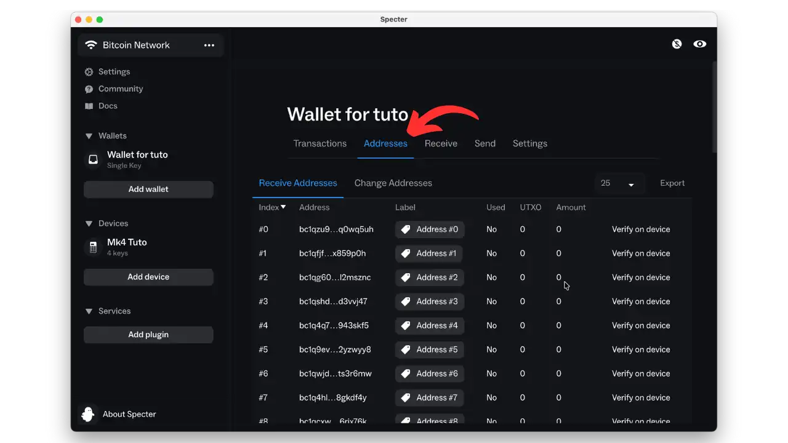

## 发送比特币

为了发送比特币，请点击 "Send" 选项卡。输入接收者的地址、要发送的金额，如果希望手动选择 UTXOs（币控制），请勾选高级选项。

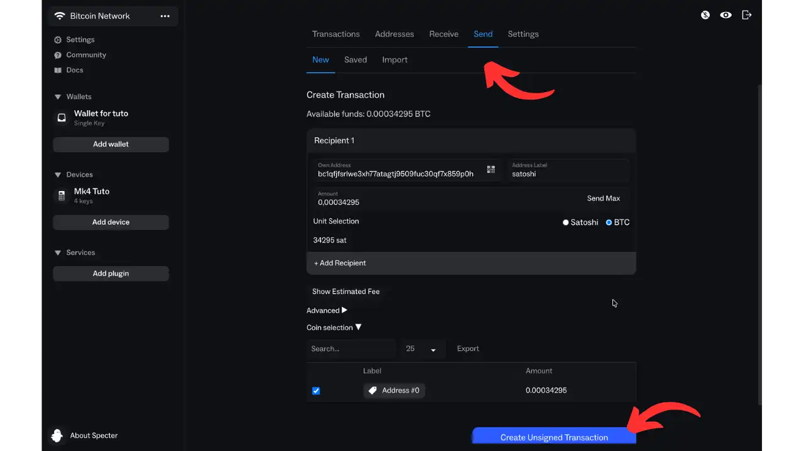

点击 "Create Unsigned Transaction"（创建未签名交易）以创建交易。然后，Specter 会要求您用硬件钱包签名交易。

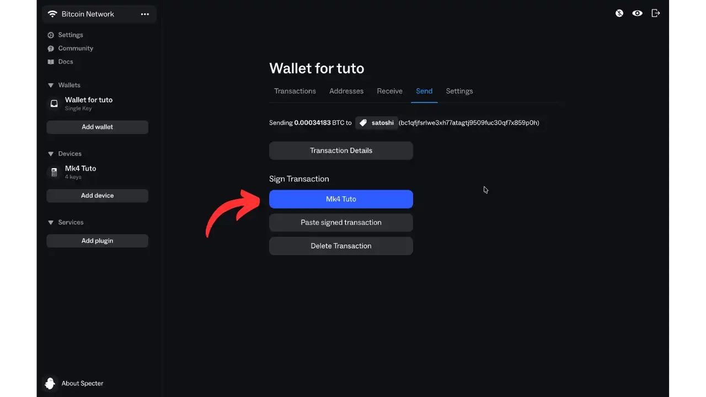

如果您使用 Coldcard，您可以选择通过 USB 或使用 microSD 卡（空气隔离）签名。在硬件钱包屏幕上确认交易，仔细检查目标地址和金额。

签名交易后，您就可以在比特币网络上进行广播。

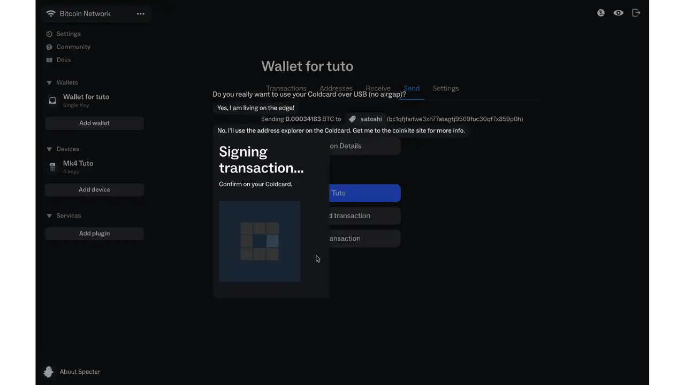

点击 "Send transaction" 发送交易。Specter 会确认您的交易已发送，您可以在 "Transactions" 选项卡中跟踪交易状态。

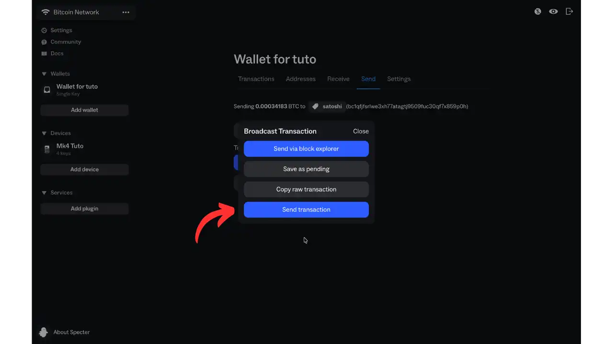

## 创建和使用多签名钱包

Specter Desktop 的主要优势之一是能够简化多签名钱包的管理。多签名钱包需要多个签名才能授权交易，从而消除单点故障。例如，2-of-3 配置需要来自三个不同硬件钱包的两个签名才能验证任何支出。

为了创建多签名钱包，首先通过 “Add device” 添加所有签名硬件钱包。在本例中，我们将使用三个不同的硬件钱包：Coldcard MK4（之前已添加）、Passport 和 Ledger。这种制造商多元化的做法可以避免依赖单一供应链或固件，从而增强安全性。

以下是 Ledger 和 Passport 的教程链接：

https://planb.academy/tutorials/wallet/hardware/ledger-nano-s-plus-75043cb3-2e8e-43e8-862d-ca243b8215a4

https://planb.academy/tutorials/wallet/hardware/passport-74e53858-3fa2-43f9-b866-573297546236

添加 Passport 时，请为硬件钱包命名（例如 “Passport multi”），并通过 microSD 卡或二维码导入其密钥。然后点击 “Continue” 按钮。

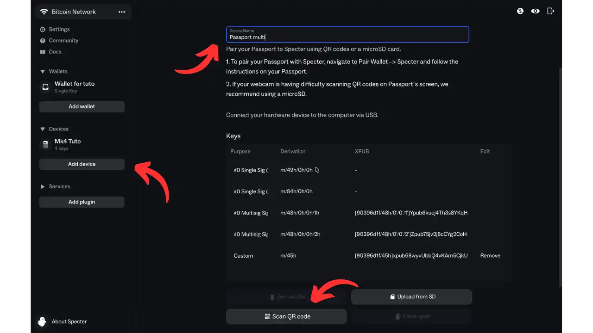

然后，通过 USB 连接 Ledger 并打开钱包硬件上的比特币应用程序来添加 Ledger。给它命名（例如 “ledger multi”），然后点击 "Get via USB"，再点击 “Continue” 导入其公钥。

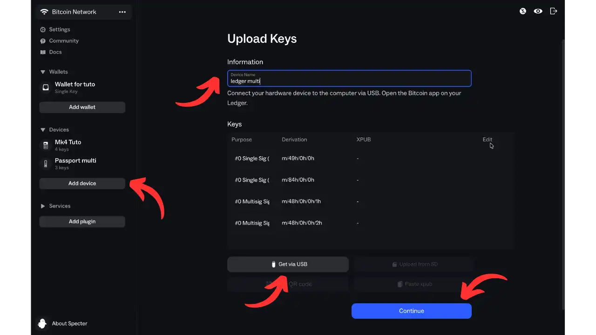

在 Specter 中注册三个硬件钱包后，点击 “Add wallet”，然后选择 “Multiple Signature” 选项创建多签名钱包。

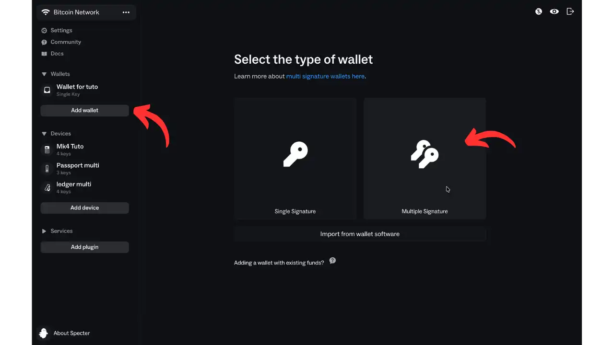

选择您希望包含在多签名法定人数中的三个硬件钱包：MK4 Tuto、Passport multi 和 ledger multi。点击 "Continue" 进入下一步。

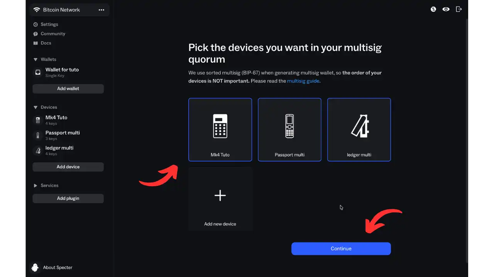

选择您的多签名配置。选择 “Segwit” 作为地址类型，即可享受优化的手续费。“Required Signatures to Authorize Transactions (m of 3)（授权交易所需的签名数（3 个中的 3 个））” 参数允许您定义阈值：对于 2-of-3 的配置，需要 2 个签名。每个硬件钱包都会显示其对应的多签名密钥。点击 “Save Backup PDF” 以完成创建。

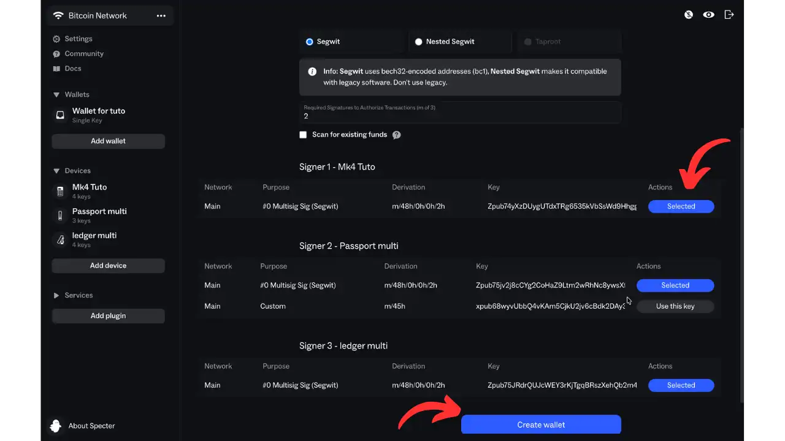

您的 “Multi tuto” 多签名钱包现已创建完成。Specter 会立即建议您保存包含钱包描述符的备份 PDF 文件。点击 “Save Backup PDF” 以下载此重要文件。

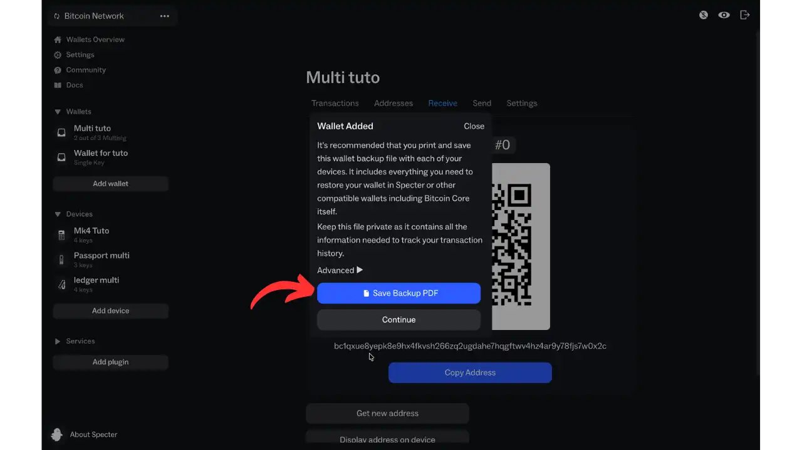

Specter 还允许您通过二维码或文件将钱包信息导出到您的每个硬件钱包。这使得某些硬件钱包（例如 Coldcard 或 Passport）能够将多签名配置直接存储在其内存中。

对于 Passport，请解锁设备，然后依次进入 "Manage Account" > "Connect Wallet" > "Specter" > "Multisig" > "QR Code"，扫描 Specter 生成的二维码。Passport 会提示您扫描钱包中的接收地址以验证多签名配置。

对于 MK4，请将其连接到电脑并解锁。然后点击 “Save MK4 Tuto file” 并将文件保存到 MK4。下次您为硬件钱包签名时，MK4 将使用此文件完成多重签名配置。

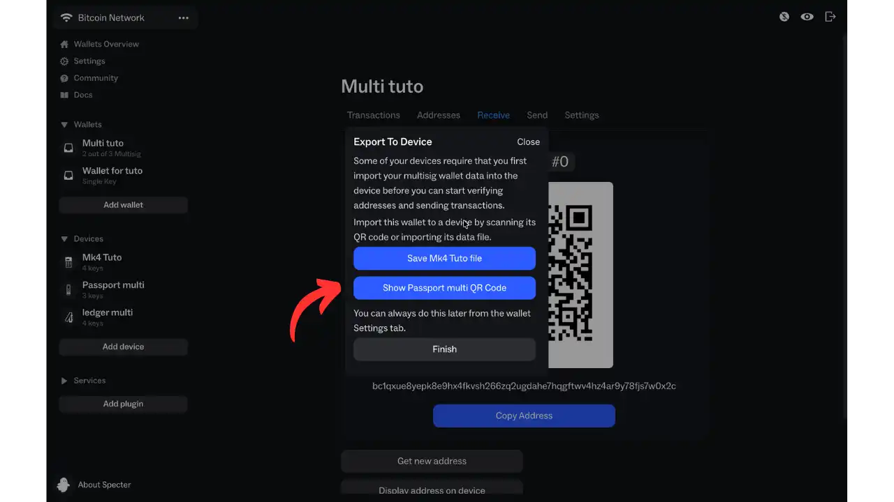

供您参考，您可以随时通过钱包的 “Settings” 选项卡，然后点击 “Export” 来访问备份：

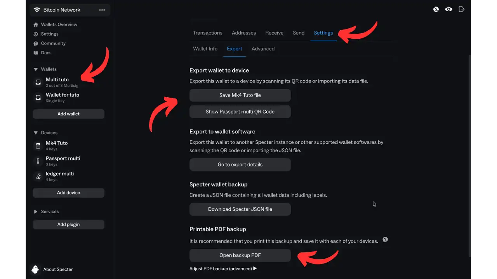

日常使用与普通钱包类似：您可以像往常一样生成接收地址。为了发送比特币，请前往 “Send” 选项卡，输入接收者的地址和金额，然后点击 “Create Unsigned Transaction”。

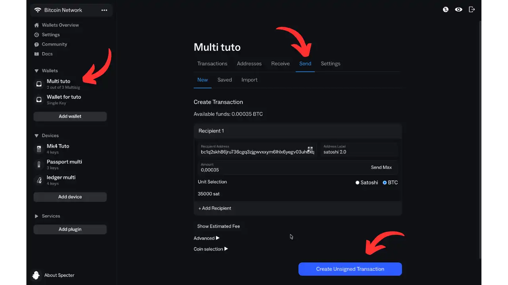

Specter 会创建一个 PSBT（部分签名比特币交易），并显示 "Acquired 0 of 2 signatures"（已获得 0 个签名（共 2 个））。您现在必须使用三个硬件钱包中的至少两个进行签名。点击第一个硬件钱包（例如 “MK4 Tuto”），使用您的 Coldcard 进行签名，然后点击第二个硬件钱包（例如 “Passport multi”）以获取所需的第二个签名。

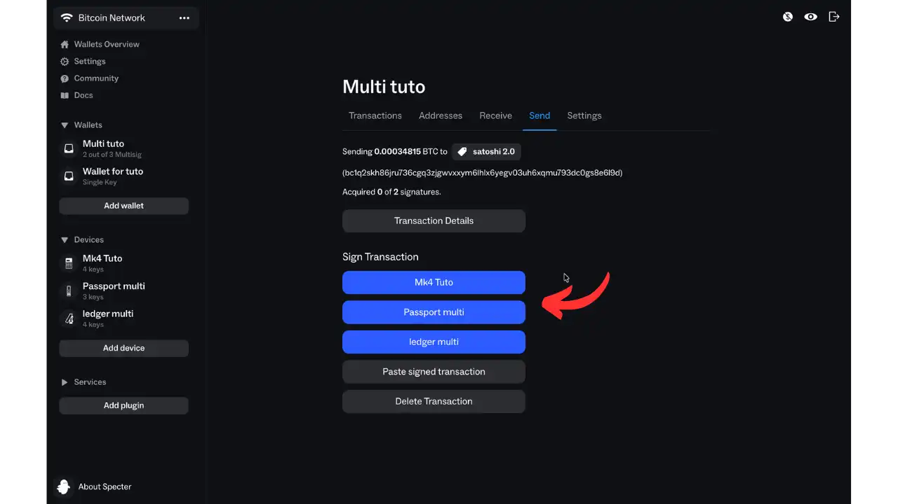

获得所需的 2 个签名后（界面显示 "Acquired 2 of 2 signatures" 和 "Transaction is ready to send"），点击 "Send Transaction"，即可在比特币网络上广播交易。

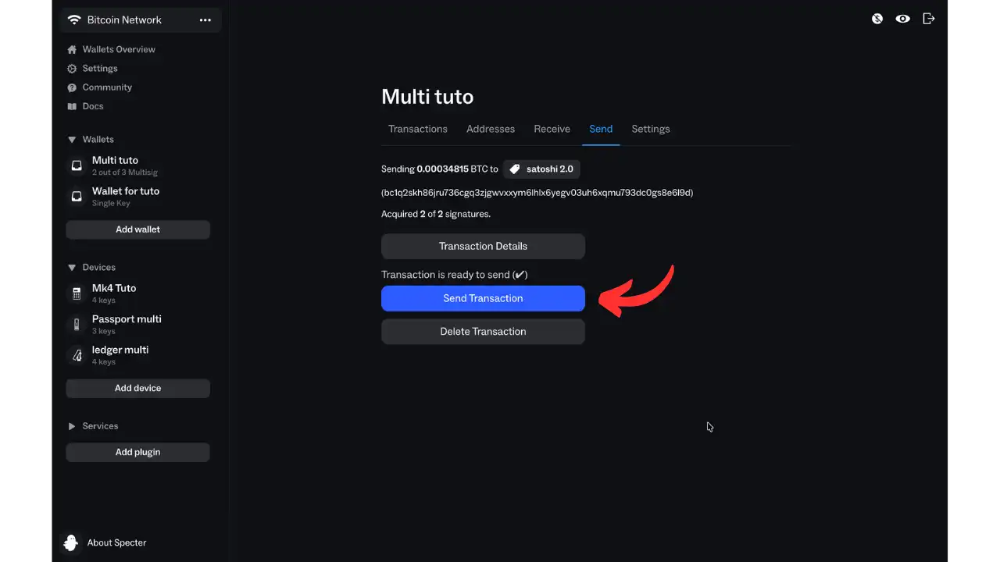

这种多重签名方法特别适合公司（需要多位经理审批支出）、家庭（保护多代遗产）或管理大笔资金的个人（硬件钱包的地理分布可以抵御局部灾难）。

### 多签名备份的极端重要性

**请注意**：备份多签名钱包与备份单个钱包有着本质区别。仅凭助记词（用来恢复钱包）不足以恢复多签名钱包。您还必须备份**输出描述符**，其中包含多签名钱包的配置信息。

输出描述符包含关键数据：每个共同签名者的扩展公钥 (xpubs)、签名阈值（本例中为 2 对 3）、使用的脚本类型（原生、嵌套或传统隔离见证）以及每个钱包硬件的旁路路径。如果没有此描述符，即使您拥有三个助记词中的两个，也无法重建钱包或访问您的比特币。该描述符让您的软件知道如何组合公钥以生成与您的资金对应的比特币地址。

Specter Desktop 会在您创建多签名钱包时自动生成备份 PDF 文件。此 PDF 文件包含完整的描述符、每个硬件钱包的指纹以及恢复所需的所有公开信息。**此文件不包含您的私钥**，因此它本身不允许您花费比特币，但任何访问它的人都可以查看您的完整交易历史记录和余额。

为了正确备份您的多签名配置，请按以下步骤操作：创建钱包后，点击 “Settings” 选项卡，然后点击 “Export”，并选择 “Save Backup PDF”。创建此 PDF 的多个副本：至少打印两份纸质副本，并保留一份加密的数字副本。将每个恢复助记词的 PDF 副本分别存储在地理位置不同的位置。

将您的助记词刻在防火防水的金属板上，以确保其长期有效。切勿低估这些备份的重要性：如果您丢失了计算机上的 `~/.specter` 文件夹，并且丢失了其中一个没有描述符备份的硬件钱包，即使您使用的是 2-on-3 配置，您的所有资金也将永久丢失。多重签名冗余机制可以防止硬件钱包丢失，但前提是您已正确备份钱包描述符。

## Specter Desktop 的优势和局限性

**优势**：无需第三方服务器即可实现最佳的本地验证，确保最佳的机密性。多重签名机制灵活，适用于高级配置（企业、家庭、个人）。广泛支持各种硬件钱包，并具备完全的互操作性（USB 和物理隔离）。

**局限性**：学习比特币高级概念（UTXO、描述符、派生路径）需要一定的时间。

## 最佳实践

验证前，务必检查硬件钱包屏幕上的地址和金额，以防范恶意软件。

将 PDF 备份与助记词分开保存。这些公共描述符可以存储在银行金库或加密云端，方便在不泄露私钥的情况下进行恢复。

在用大额资金使用钱包之前，先用少量代币进行恢复测试。创建、测试、删除和恢复钱包，以验证您的操作流程。

保持 Specter 和固件更新。将多重签名共同签署人分散在不同的地理位置（家中/办公室/附近），以应对局部灾害。使用描述性标签，方便会计核算和税务申报。

## 额外功能：在比特币服务器（Umbrel、RaspiBlitz、Start9）上安装

如果您已经拥有 Umbrel、RaspiBlitz、MyNode 或 Start9 等比特币服务器，可以直接从其应用商店安装 Specter Desktop。这种方法具有以下几个显著优势：该应用程序会自动配置到您的本地 Bitcoin Core 节点，您可以通过网络上的任何设备通过 Web 界面全天候访问它，甚至可以通过 Tor 安全地远程访问它。您的整个比特币基础设施都集中在一个专用服务器上，从而简化管理并增强您的主权。

### 从 Umbrel 应用商店安装

在 Umbrel 界面中，前往应用商店并搜索 Specter Desktop。点击 “Install” 启动安装。

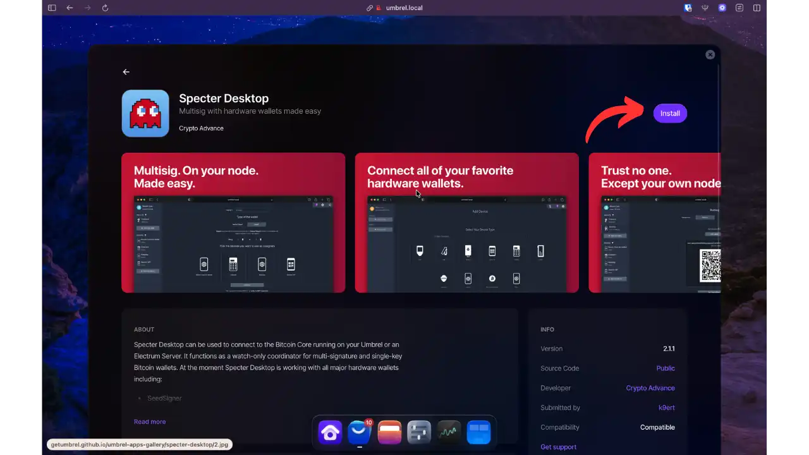

安装完成后，在您的 Umbrel 服务器上打开 Specter Desktop。欢迎界面会要求您选择连接类型。如果您在 Umbrel 服务器上使用 Specter，请点击 “Update settings” 来配置连接。

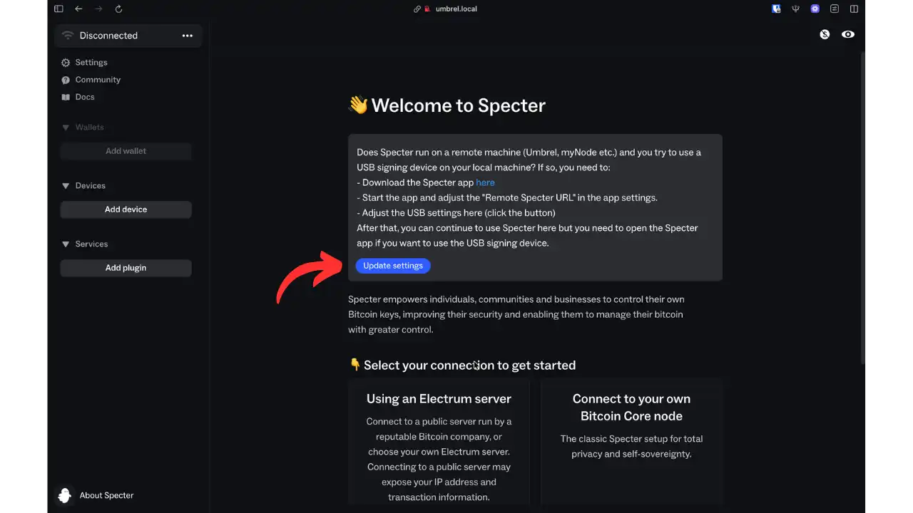

选择 “Remote Specter USB connection” 即可在远程 Umbrel 服务器上使用 Specter 时，使用连接到本地计算机的 USB 硬件钱包。

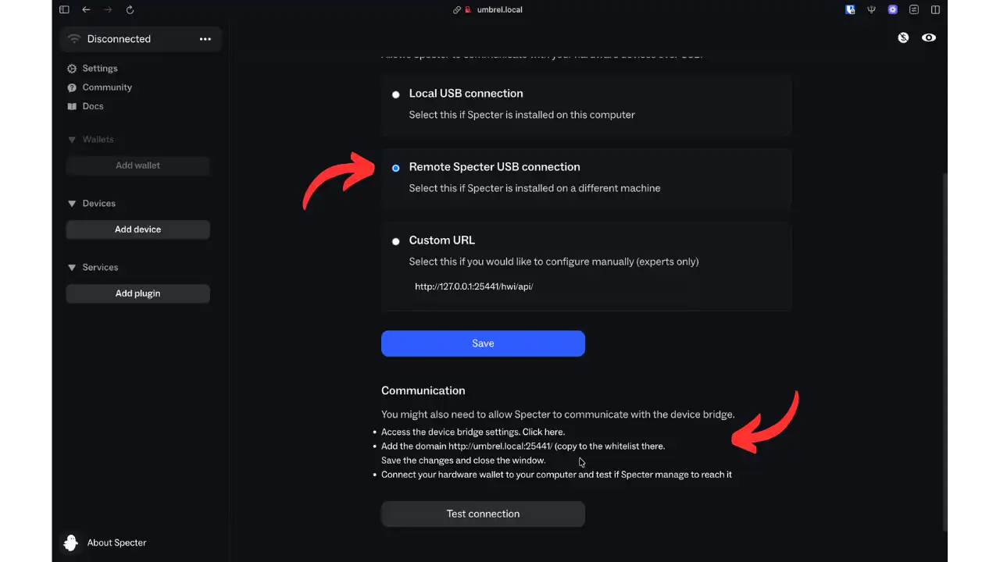

按照屏幕上的说明配置 HWI Bridge。您需要访问设备桥接设置，并将域名 `http://umbrel.local:25441` 添加到白名单。点击 “Update” 以保存配置。

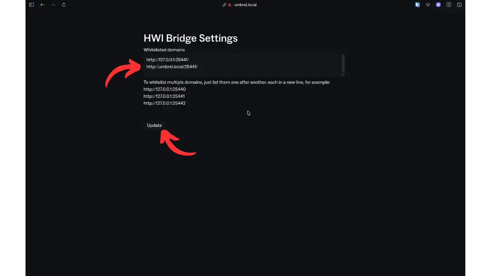

如果您还想从本地计算机使用 USB 硬件钱包，请将 Specter Desktop 应用程序下载到您的计算机，并将其设置为 “Yes, I run Specter remotely”。点击 “Save” 以完成配置。

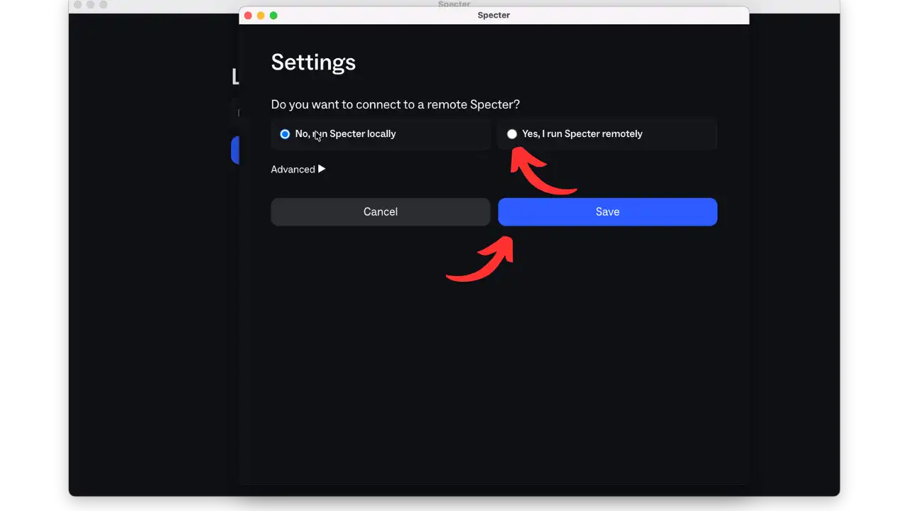

## 结论

Specter Desktop 让高级比特币配置变得大众化，使多签名触手可及，同时又不牺牲您的主权或隐私。对于管理大量资金的用户而言，它将机构级的操作流程转化为个人用户也能轻松部署的解决方案。

虽然该应用程序需要对基础设施和学习进行一些初始投入，但它提供了完全的主权：对验证基础设施的控制、对密钥的物理所有权以及不受第三方监控的交易。无论您是保护个人储蓄的个人、创建代代相传的保险箱的家庭，还是管理现金流的公司，Specter Desktop 都是兼顾最高安全性和绝对主权的理想工具。

## 资源

### 官方文档

- [Specter Desktop 官方网站](https://specter.solutions/desktop/)
- [GitHub 源代码](https://github.com/cryptoadvance/specter-desktop)
- [完整文档](https://docs.specter.solutions/)

### 社区和支持

- [Specter Desktop Telegram 社区群组](https://t.me/spectersupport)
- [Reddit 讨论区](https://reddit.com/r/specterdesktop/)
- [GitHub 问题报告](https://github.com/cryptoadvance/specter-desktop/issues)
