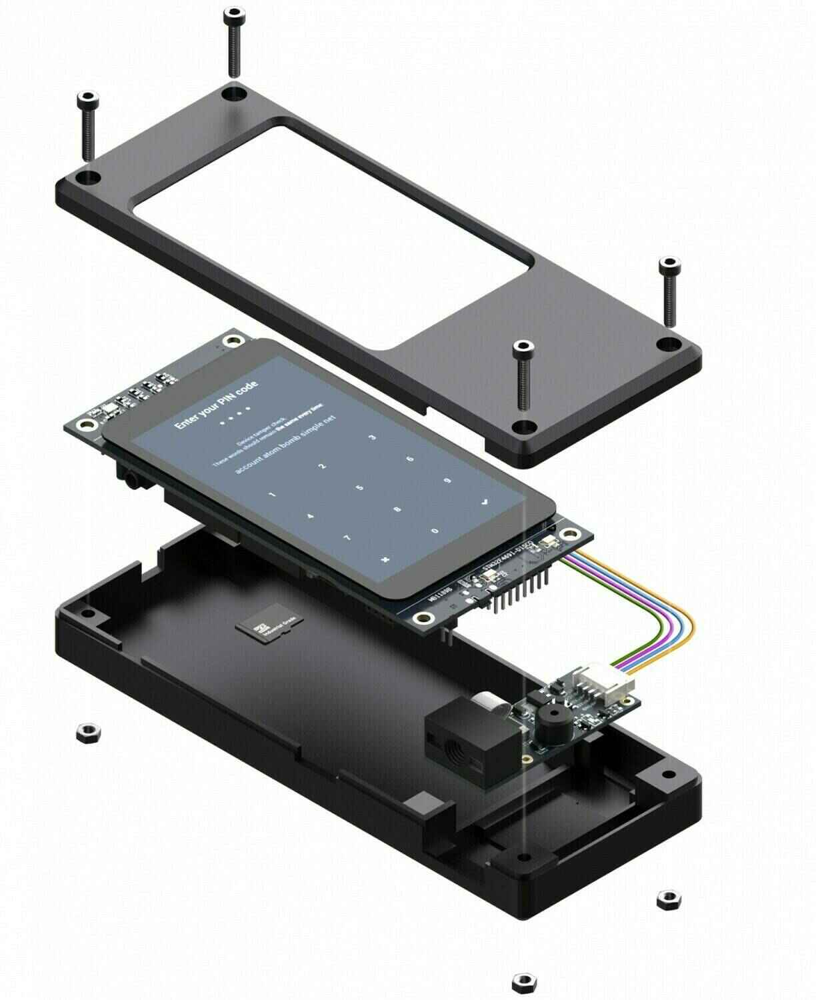

Spécifications :

- Carte de développement
- Carte STM Discovery (STM32F469I)
- Scanner de codes QR
- Scanner de codes-barres Waveshare
- Boîtier imprimable en 3D
- Boîtier minimaliste conçu par Seedsigner

## Guide

https://specter.solutions/hardware/

https://docs.specter.solutions/diy/

Vidéo d'assemblage : https://youtu.be/1H7FqG_FmCw

guide : fork the ?md https://github.com/cryptoadvance/specter-diy
