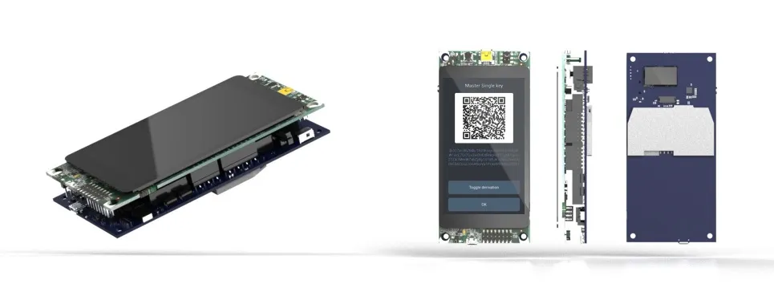

Spesifikasi:

- Papan Pengembang
- STM Discovery board (STM32F469I)
- Pemindai Kode QR
- Pemindai Barcode Waveshare
- Casing yang Dapat Dicetak 3D
- Casing minimalis yang dirancang oleh Seedsigner

## Panduan

https://specter.solutions/hardware/

https://docs.specter.solutions/diy/

Video perakitan: https://youtu.be/1H7FqG_FmCw

panduan: fork the ?md https://github.com/cryptoadvance/specter-diy