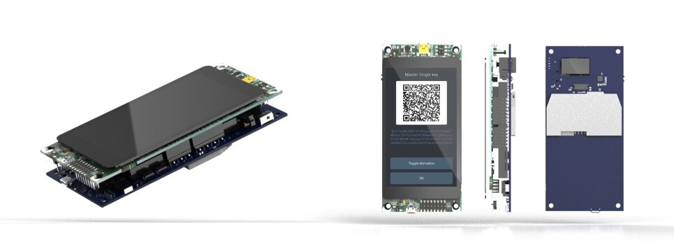
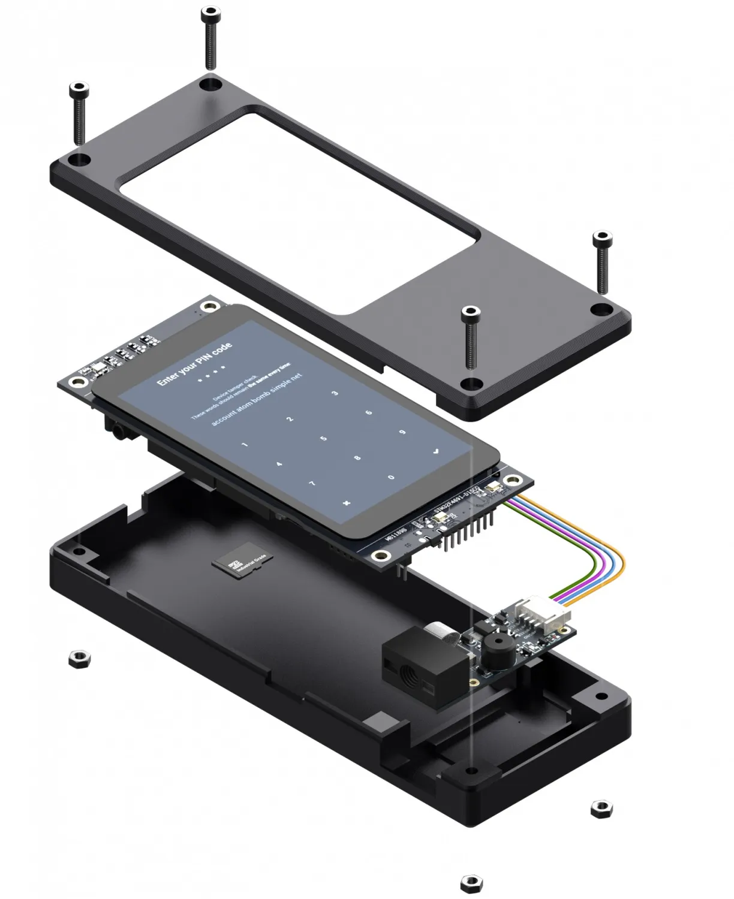

仕様:

- 開発ボード
- STM Discovery board (STM32F469I)
- QRコードスキャナー
- Waveshare バーコードスキャナー
- 3Dプリント可能なケース
- Seedsignerによってデザインされたベアボーンケース

## ガイド

https://specter.solutions/hardware/

https://docs.specter.solutions/diy/

組み立てビデオ: https://youtu.be/1H7FqG_FmCw

ガイド: ?md https://github.com/cryptoadvance/specter-diy をフォークしてください