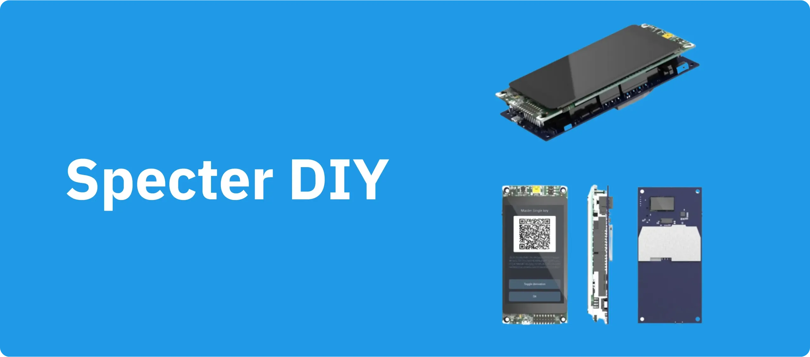
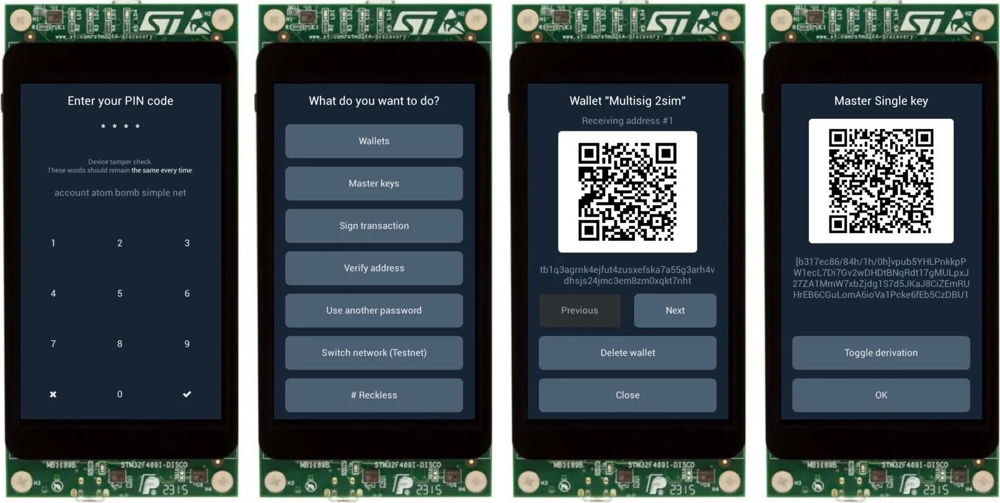
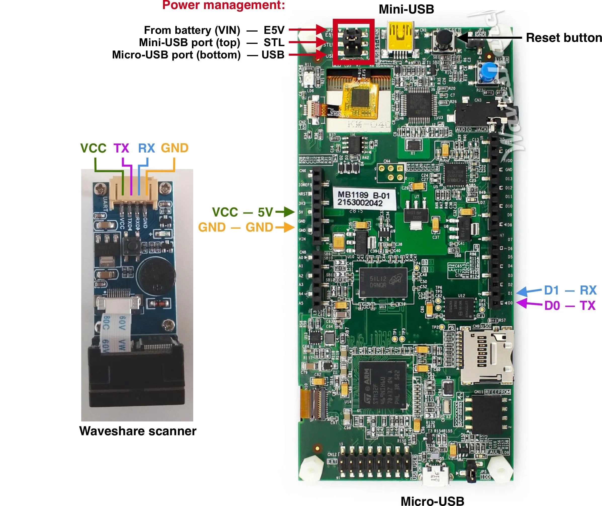

## Specter（DIY，自我动手）

> 密码学朋克也会写代码。我们知道，有些人不得不编写软件来保护隐私权；因为非此不足以捍卫隐私权，所以我们要写代码。

*密码朋克宣言 - Eric Hughes - 1993 年 3 月 9 日*。

该项目的想法是用现成的组件构建一个硬件钱包。

尽管我们有一个扩展板，可以将所有东西都放在一个漂亮的外形尺寸中，并帮助您避免任何焊接，但我们将继续支持和保持与标准组件的兼容性。



我们还希望保持项目的灵活性，以便它可以在任何其他组件上进行最小的更改。也许您想在不同的架构（RISC-V？）上制作一个硬件钱包，并使用音频调制解调器作为通信通道 - 您应该能够做到。添加或更改 Specter 的功能应该很容易，我们尝试尽可能多地抽象逻辑模块。

二维码是 Specter 与主机通信的默认方式。二维码非常方便，允许用户控制数据传输 - 每个二维码的容量非常有限，并且通信是单向发生的。而且它是空气隔离的 - 您无需随时将钱包连接到计算机。

在秘密存储方面，我们支持不可知模式（钱包在关闭时会忘记所有秘密）、鲁莽模式（将秘密存储在应用微控制器的闪存中），安全元件集成即将推出。

我们主要关注与其他硬件钱包的多签名设置，但钱包也可以作为单签名器使用。我们尽可能使其与 Bitcoin Core 兼容--PSBT 用于无签名交易，钱包描述符用于导入/导出多签名钱包。为了更方便地与 Bitcoin Core 通信，我们还在开发 [Specter Desktop app](https://github.com/cryptoadvance/specter-desktop) - 一个与 Bitcoin Core 节点通信的小型 python flask 服务器。

大部分固件都是用 MicroPython 编写的，这使得代码易于审核和更改。我们使用 Bitcoin Core 的 [secp256k1](https://github.com/bitcoin-core/secp256k1) 库进行椭圆曲线计算，并使用 [LittlevGL](https://lvgl.io/) 库进行图形用户界面。

## 免责声明

该项目已经非常成熟，Specter-DIY 的安全级别已经可以与市场上的商业硬件钱包相媲美。我们实施了一个安全引导加载器，可以验证固件升级，因此可以确保只有经过签名的固件才能在初始设置后上传到设备上。不过，与商业签名设备不同的是，引导加载器必须由用户手动安装，而不是在设备供应商的工厂中设置。因此，在初始固件安装时要格外注意，确保验证了 PGP 签名，并在安全的电脑上闪存固件。

如果有问题，请在这里提出，或在我们的 [Telegram 群组](https://t.me/+VEinVSYkW5TUl5Ai) 中提问。

## Specter-DIY 购物清单

在这里，我们描述了要购买的东西，在组装的下一部分中，我们解释了如何将它们组合在一起，以及有关电路板的一些注意事项 - 电源跳线、USB 端口等。

### 探索板

该设备的主要部分是开发板：

- STM32F469I-DISCO 开发板（即来自 [Mouser](https://eu.mouser.com/ProductDetail/STMicroelectronics/STM32F469I-DISCO?qs=kWQV1gtkNndotCjy2DKZ4w==) 或 [Digikey](https://www.digikey.com/product-detail/en/stmicroelectronics/STM32F469I-DISCO/497-15990-ND/5428811) 购买）
- Mini USB 电缆
- 通过 USB 进行通信的标准 MicroUSB 电缆

可选但推荐：

- [Waveshare 二维码扫描仪](https://www.waveshare.com/barcode-scanner-module.htm) 带有[这些](https://eu.mouser.com/ProductDetail/Samtec/DW-02-10-T-S-571?qs=sGAEpiMZZMvlX3nhDDO4AE5PKXAQeC6NPk%2FcLBS9yKI%3D) 或[这些](https://www.amazon.com/gp/product/B015KA0RRU/) 这样的长排针，用于连接扫描仪和电路板（需要 4 个排针）。

我们目前正在开发一款扩展板，其中包括智能卡插槽、二维码扫描仪、电池和 3D 打印外壳，但它不包括主要部分 - 您需要单独订购的发现板。这样，供应链攻击仍然不是问题，因为安全关键组件是从随机电子商店购买的。

即使没有任何额外组件，您也可以开始使用 Specter，但您将能够通过 USB 或内置 SD 卡插槽与其进行通信。通过 USB 使用 Specter 意味着它不是以空气隔离的方式使用的，因此您会失去重要的安全属性。

### 二维码扫描仪

对于二维码扫描仪，您有多种选择。

**选项 1。推荐。** 来自 Waveshare 的相当不错的扫描仪（40 美元）

[Waveshare 扫描仪](https://www.waveshare.com/barcode-scanner-module.htm) - 您需要找到一种正确安装它的方法，也许使用某种 Arduino Prototype 防护罩和一些胶带。

无需焊接，但如果您具备焊接技能，就能让钱包变得更漂亮)

**选项 2.** Mikroe 公司生产的扫描仪非常不错，但价格相当昂贵（150 美元）：

[Barcode Click](https://www.mikroe.com/barcode-click) + [适配器](https://www.mikroe.com/arduino-uno-click-shield)

**选项 3.** 任何其他二维码扫描仪

在中国可以找到一些价格低廉的扫描器。它们的质量通常不太好，但您可以试试。或许 ESPcamera 也能胜任。您只需要连接电源、UART（D0 和 D1 引脚）以及触发信号（D5 引脚）。

**选项 4.** 不使用扫描仪

这样，您就只能通过 USB 或 SD 卡使用 Specter。

除非您建立自己的通信模块，使用其他东西来代替二维码--音频调制解调器、蓝牙或其他任何东西。只要它能被触发并通过串口发送数据，您就可以做任何您想做的事。

### 可选组件

如果您添加一个小型移动电源或电池/充电器/升压器，您的钱包就完全可以独立运行了

## Specter - 自我手动的组装


### 连接 Waveshare 条形码扫描器

wallet 固件会在第一次运行时为您配置扫描仪，因此无需手动预配置。

下面是将扫描仪连接到电路板的方法：



为了方便起见，您可以购买一个 Arduino Protype 屏蔽板，然后将所有部件焊接并安装在上面（例如 [这个](https://www.digikey.com/catalog/en/partgroup/proto-shield-rev3-uno-size/79347)）。

### 电源管理

在电路板的顶端有一个跳线，用于定义电源的位置。您可以改变跳线的位置，将电源选择为其中一个 USB 端口或 VIN 引脚，并在此处连接外部电池（电压应为 5V）。

### 供自我动手使用的外壳

查看[附文](https://github.com/cryptoadvance/specter-diy/tree/master/docs/enclosures) 文件夹。

### 发挥创意！

组装自己的 Specter-自我动手，并将图片发送给我们（提出拉取请求或联系我们）。

查看[图片](https://github.com/cryptoadvance/specter-diy/blob/master/docs/pictures/gallery/README.md)，了解社区组装的 Specter！

## 安装已编译的代码

由于采用了安全引导加载程序，固件的初始安装略有不同。升级更加便捷，无需将硬件钱包连接到计算机。


### 烧录初始固件

**注意**：如果您不想使用发行版中的二进制文件，请查看[引导加载程序文档](https://github.com/cryptoadvance/specter-bootloader/blob/master/doc/selfsigned.md)，其中解释了如何编译和配置它以使用您的公钥而不是我们的公钥。

- 如果您是从低于 `1.4.0` 的版本升级，或者首次上传固件，请使用[发布版本](https://github.com/cryptoadvance/specter-diy/releases)页面中的 `initial_firmware_<version>.bin` 文件。
 - 根据[Stepan 的 PGP 密钥]验证 `sha256.signed.txt` 文件的签名(https://stepansnigirev.com/ss-specter-release.asc)
 - 将 `initial_firmware_<version>.bin` 的哈希值与存储在 `sha256.signed.txt` 中的哈希值进行校验
- 如果您是从空引导加载器升级，或看到引导加载器错误信息提示固件无效，请查看下一节--烧录已签名的 Specter 固件。
- 确保发现板的电源跳线位于 STLK 位置
- 通过板顶部的**微型 USB**电缆将探索板连接到电脑。
    - 电路板应显示为名为 "DIS_F469NI "的可移动磁盘。
- 将 `initial_firmware_<version>.bin` 文件复制到 `DIS_F469NI` 文件系统的根目录。
- 闪存固件完成后，电路板将重置并重启至引导加载程序。引导加载程序将检查固件并启动进入主固件。如果看到未找到固件的错误信息，请按照更新说明通过 SD 卡上传固件。
- 现在，您可以随心所欲地切换电源跳线，用电源箱或电池为电路板供电。

通过复制粘贴 `.bin` 文件来刷写初始固件有时会失败——通常是由于连接线的问题，或者您通过 USB 集线器连接设备。在这种情况下，您可以尝试几次（通常 2-3 次即可成功）。

如果始终失败，您可以使用开源工具 [stlink](https://github.com/stlink-org/stlink/releases/latest)。安装该工具后，在终端中输入：`st-flash write <初始固件文件路径> 0x8000000`。它通常更加可靠。

### 升级固件

- 从[发布页面](https://github.com/cryptoadvance/specter-diy/releases) 下载 `specter_upgrade_<version>.bin`。
- 将此二进制文件复制到 SD 卡根目录（FAT 格式，最大 32 GB）
 - 确保根目录中只有一个 `specter_upgrade***.bin` 文件
- 将 SD 卡插入探索板的 SD 插槽，然后打开探索板电源
- 引导加载程序会闪存固件，并在完成后通知您。
- 重新启动电路板 - 此时您将看到 Specter-DIY 界面，它会建议您选择 PIN 码

每当有新版本发布时，只需从发布页面下载 `specter_upgrade_<version>.bin` 文件，将其放入 SD 卡，然后像上一步一样升级设备即可。引导加载程序会确保只有经过签名的固件才能加载到开发板上。

### 如何查找固件版本

进入 `Device settings` 选单 - 屏幕标题下方会显示版本号。

## 使用 Specter-DIY 钱包


## Specter-DIY 的安全性

### 硬件安全

显示屏由应用 MCU 控制。

目前尚未集成安全元件——密钥也存储在主 MCU 上。即使不存储密钥，您也可以使用钱包——每次都需要输入助记词。既然能记住完整的助记词，何必记住冗长的密码呢？

设备使用外部闪存（QSPI）存储一些文件，但所有用户文件在加载时都会由钱包签名并进行验证。

二维码扫描功能由独立的微控制器 (MCU) 实现，因此所有图像处理都在安全关键的 MCU 之外进行。目前，USB 和 SD 卡仍然由主 MCU 管理，因此如果您想减少攻击面，请不要使用 SD 卡和 USB。

### 密码保护（用户身份验证）

首次启动时，主 MCU 会生成一个唯一的密钥。该密钥可用于验证设备是否已被恶意设备替换——输入 PIN 码后，您会看到一个单词列表，只要密钥存在，该列表的内容就保持不变。

您的 PIN 码和此唯一密钥将用于生成比特币密钥的解密密钥（如果您已存储密钥）。因此，即使攻击者能够绕过 PIN 码屏幕，解密仍然会失败。

如果您已锁定固件（待办事项：在此处添加说明链接），则密钥也会被锁定。因此，如果攻击者向开发板烧录不同的固件，密钥将被擦除，当您开始输入 PIN 码时，您将能够识别出这一点——单词序列会不同。

### 生成助记词

这是钱包最重要的部分之一——安全地生成密钥。为了确保这一点，我们使用了多种熵源：

- 微控制器的真随机数生成器 (TRNG)。专有、经过认证且可能不错，但我们并不完全信任它。
- 触摸屏。每次您触摸屏幕时，我们都会测量触摸的位置和时间（微控制器以 180MHz 的频率进行计时）。
- 内置麦克风 - 尚未启用。开发板有两个麦克风，因此硬件钱包可以监听您的操作并将这些数据添加到熵池中。

所有这些熵都会通过哈希处理并转换为您的助记词。最终得到的熵始终优于任何单个来源的熵。

### 高级逻辑 - 钱包

Specter 作为密钥存储运行。它保存可用于分层确定性钱包的私钥。钱包由其描述符定义。我们也支持 miniscript。

每个钱包都属于特定的网络。这意味着，如果您在 `testnet` 上导入了一个钱包，它将无法在 `mainnet` 或 `regtest` 上使用——您需要切换到该网络并单独导入钱包。

### 交易验证

以下规则适用于钱包将要签名的交易：

- 如果发现来自不同钱包的混合输入，系统会发出警告 ([攻击](https://blog.trezor.io/details-of-the-multisig-change-address-issue-and-its-mitigation-6370ad73ed2a))
- 找零输出会显示接收钱包的名称
- 为了使用多签名或迷您脚本，您需要先通过添加钱包描述符（通过二维码、USB 或 SD 卡）导入钱包

## 描述符支持

所有正常的比特币描述符都能正常工作。除此之外，我们还有一些扩展功能：

### 描述符中的多个分支

为了节省二维码的空间，我们允许一次性添加多个分支的描述符。如果您想将 `wpkh(xpub/0/*)` 用于接收地址，将 `wpkh(xpub/1/*)` 用于更改地址，您可以将它们合并为一个描述符： `wpkh(xpub/{0,1}/*)` - 钱包将把 `{}` 集合部分的第一个索引作为接收地址分支，第二个索引作为更改地址分支。

您还可以指定两个以上的分支，而且不同的签名者可以指定不同的分支索引，因此这种描述符非常奇怪，但完全有效：

```
wsh(sortedmulti(2,xpubA/{22,33,44}/*,xpubB/34/*/{1,8,6},pubkey3))
```

在此，钱包将使用 `wsh(sortedmulti(2,xpubA/22/17,xpubB/34/17/1,pubkey3))` 中的脚本第 17 个接收地址。

唯一的要求是所有集合中的索引数量相同（上述情况中为 3 个）。

### 默认派生

如果描述符包含主公钥，但不包含通配符派生，则会在描述符中的所有扩展密钥中添加默认派生 `/{0,1}/*`。如果至少有一个 xpub 具有通配符派生，描述符将不会更改。

描述符 `wpkh(xpub)` 将转换为 `wpkh(xpub/{0,1}/*)`。

### Miniscript

Specter 支持 Miniscript，但不支持策略到 Miniscript 的编译（因为编译成本太高）。我们会对 Miniscript 进行一些检查，因此顶层只允许使用 `B` 脚本，子 Miniscript 中的所有参数都必须符合 [spec](http://bitcoin.sipa.be/miniscript/) 中的属性要求。

您可以使用 [bitcoin.sipa.be](http://bitcoin.sipa.be/miniscript/) 从策略生成描述符，然后将其导入钱包。

例如，策略 “我现在可以花，或者100天后我妻子可以花” 可以这样转换成钱包：

政策：或 `（9@pk(xpubA),and(older(14400),pk(B))）`（我的密钥的可能性高 9 倍）

Miniscript：`or_d(pk(xpubA),and_v(v:pkh(xpubB),older(14400)))`

描述符：`wsh(or_d(pk(xpubA),and_v(v:pkh(xpubB),alier(14400))))`)

由于这里没有任何通配符派生词，默认派生词 `/{0,1}/*` 将被附加到 xpub 中。

---

MIT 许可证

版权所有 (c) 2019 cryptoadvance

---
