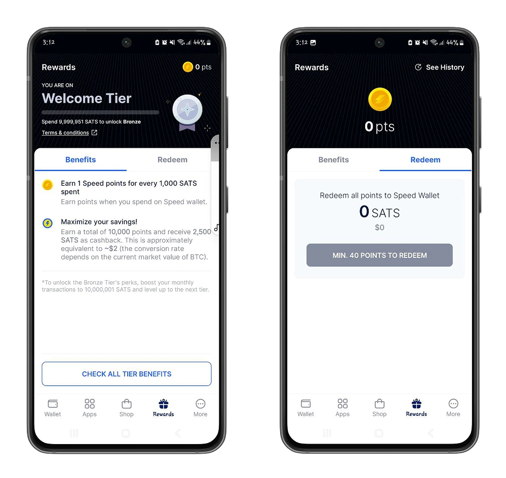
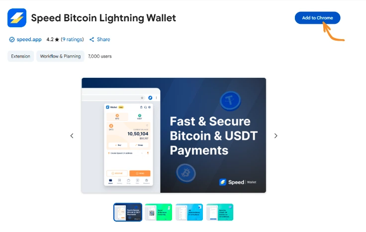

Saat ini sudah banyak solusi yang membantu para bitcoiner untuk mendapatkan, menyimpan, dan menukar bitcoin mereka. Hari ini, kita akan melihat Speed Wallet, dompet Bitcoin dan Lightning yang memungkinkan kamu bertransaksi dengan mudah.

## Apa yang dimaksud dengan Speed Wallet?
Bagi para pengguna baru, memilih wallet untuk menyimpan dan menukar bitcoin sangat penting karena dapat memengaruhi keamanan aset kamu.

Dengan mempertimbangkan hal itu, Speed Wallet merupakan ekosistem yang intuitif dan aman, yang memungkinkan kamu melakukan keduanya:

- Simpan dan Exchange bitcoin kamu.
- Beli layanan digital melalui integrasi Bitrefill.
- Terima Bitcoin dalam bisnismu melalui aplikasi point-of-sale.

Dalam tutorial ini, kami akan memandu kamu melalui setiap aspek tersebut agar pengalamanmu dengan Speed Wallet semudah mungkin.

https://planb.network/tutorials/exchange/centralized/bitrefill-8c588412-1bfc-465b-9bca-e647a647fbc1

## Memulai dengan Speed Wallet
Speed Wallet adalah dompet kustodian multi-mata uang yang mendukung transaksi di jaringan utama Bitcoin, transaksi Lightning Network, serta transaksi dengan stablecoin USDT (Tether USD). Dalam tutorial ini, kita akan fokus sepenuhnya pada penggunaan Speed Wallet di jaringan Bitcoin.

Speed Wallet tersedia sebagai aplikasi seluler di platform Android (Google Play Store) dan iOS (App Store), serta sebagai ekstensi Chrome yang memungkinkan kamu bertransaksi langsung dari komputer.

Kamu bisa menemukan tautan untuk mengunduh platform di situs web resmi [Speed Wallet] (https://speed.app).

⚠️ **PENTING**: Sangat penting untuk mengunduh dompet kamu dari platform unduhan resmi untuk menjamin keaslian aplikasi.

Dalam tutorial ini, kita akan berfokus pada platform Android, namun semua proses yang dijelaskan di sini juga berlaku untuk iOS.

Speed Wallet memerlukan pembuatan akun pengguna. kamu bisa membuatnya dari akun Google, atau menentukan email dan kata sandi yang kuat.

https://planb.network/tutorials/computer-security/authentication/bitwarden-0532f569-fb00-4fad-acba-2fcb1bf05de9

Setelah akun kamu dibuat, disarankan untuk menyiapkan sistem autentikasi ganda atau verifikasi PIN/sidik jari biometrik. Pengaturan ini menambah lapisan keamanan ekstra, memungkinkan kamu melakukan autentikasi sebelum mengakses wallet dan saat melakukan transaksi Bitcoin di Speed Wallet.

https://planb.network/tutorials/computer-security/authentication/authy-a76ab26b-71b0-473c-aa7c-c49153705eb7

Untuk melakukannya, buka pengaturan aplikasi, lalu aktifkan autentikasi ganda dan verifikasi biometrik.

Dari Pengaturan, kamu juga bisa menyesuaikan tampilan saldo dengan memilih mata uang lokal dalam opsi

### Melakukan transaksi pertama Anda dengan Speed Wallet
Kalau kamu sudah punya pengalaman dengan dompet Bitcoin, kamu nggak akan kesulitan. Speed Wallet menawarkan antarmuka yang intuitif untuk membantu kamu memulai.

Pada halaman beranda **Wallet**, kamu akan menemukan :
- Bagian untuk mata uang yang ingin kamu gunakan.
- Saldo dalam mata uang yang dipilih.
- Opsi untuk membuat dan mempersonalisasi Lightning Address kamu untuk menerima pembayaran Lightning.

⚠️ **CATATAN**: Lightning Address adalah alias unik mirip alamat email yang mempermudah pembacaan URL Lightning kamu. Pastikan kamu memberikan Lightning Address yang benar saat ingin menerima pembayaran melalui Lightning.

- **Menerima pembayaran pada Speed Wallet** :

Klik tombol **Terima**, lalu pilih Layer yang ingin kamu terima dan jumlah transaksi untuk membagikan Invoice milikmu dengan pengirim.

Kamu juga bisa menggunakan Lightning Address ketika kamu ingin memberikan fleksibilitas kepada pengirim untuk menentukan jumlah transaksi.

- **Kirim bitcoin dengan Speed Wallet** :
Dari tombol **Kirim**, kamu bisa mengirim bitcoin menggunakan Lightning Address, Lightning Invoice, atau Lightning Bitcoin (Mainnet) milik penerima.

Speed Wallet akan mendeteksi jaringan yang sesuai berdasarkan format alamat kamu, sehingga memberikan pengalaman penggunaan yang lebih lancar.

### Jelajahi lebih lanjut Speed Wallet
Salah satu fitur utama Speed Wallet adalah kemampuannya untuk membeli dan menukar mata uang tanpa harus keluar dari aplikasi. Dengan cara ini, kamu bisa mendapatkan bitcoin dari saldo mata uang lain di wallet kamu. Misalnya, kamu bisa membeli Bitcoin menggunakan USDT yang sudah kamu miliki di wallet, dengan biaya penukaran yang lebih rendah.

Opsi **Buy** dan **Swap** memungkinkanmu menukarkan bitcoin Exchange dengan mata uang lain yang tersedia di Speed.

- Beli Bitcoin dengan kartu kredit milikmu**: Speed Wallet memudahkan kamu memperoleh Bitcoin dari mata uang fiat yang kamu gunakan setiap hari. Fitur ini juga terhubung dengan agregator pembayaran yang memungkinkan kamu membeli bitcoin menggunakan kartu kredit.
- 

- Beli Bitcoin dari mata uang kripto lainnya**: Kamu bisa menukarkan USDT, USDC kamu dengan bitcoin di Wallet dan sebaliknya. Melalui opsi ini, Speed Wallet menyederhanakan proses pembelian dan penjualan Bitcoin tanpa mengacu pada platform Exchange eksternal. Jadi, kamu dapat melakukan jual beli hanya dengan 20.000 satoshi, sekitar $20 dengan kurs saat ini, tanpa harus meninggalkan Speed Wallet milikmu.

https://planb.network/tutorials/exchange/centralized/bitfinex-dc306d39-bd96-4ab9-a278-a322316716db

https://planb.network/tutorials/exchange/centralized/relai-v2-30a9671d-e407-459d-9203-4c3eae15b30e

## Beli barang dan jasa di Speed Wallet

Selain transaksi dan penukaran, Speed Wallet juga merupakan ekosistem inovatif yang memberi kamu akses ke berbagai platform barang dan jasa yang menerima Bitcoin sebagai alat pembayaran.

Di menu **Apps**, kamu bisa menemukan banyak platform, permainan, penawaran diskon, layanan, dan juga platform untuk mendapatkan bitcoin dengan melakukan tugas.

Jadi, dari Speed Wallet, kamu bisa mencari akomodasi di mana saja di seluruh dunia dengan membayar melalui Bitcoin dengan AirBtc, misalnya.

Di sub-bagian **Penawaran**, cari tahu tentang diskon setoran pertama yang ditawarkan oleh platform game.

Di bagian **Earn**, kamui akan menemukan platform yang dapat kamu gunakan untuk mendapatkan satoshi dengan melakukan tugas-tugas.

Di menu **Shop**, kamu akan menemukan Bitrefill, yang membawa kamu lebih dekat lagi ke layanan digital (kartu hadiah, isi ulang pulsa, dll.) yang tersedia di wilayah kamu dan di tempat lain.

Lihat tutorial kami tentang cara memulai Bitrefill di bawah ini.

https://planb.network/tutorials/exchange/centralized/bitrefill-8c588412-1bfc-465b-9bca-e647a647fbc1

## Dapatkan hadiah

Selain aplikasi utamanya, Speed Wallet menerapkan sistem perkembangan yang menyesuaikan dengan penggunaan wallet kamu. Semakin sering kamu bertransaksi, kamu akan mendapatkan token Speed yang membuatmu memenuhi syarat untuk menerima hadiah dalam bentuk bitcoin. Speed Wallet juga memiliki sistem undangan yang memungkinkan kamu mendapatkan bitcoin setiap kali seseorang membuat akun Speed Wallet melalui tautan undanganmu.

Untuk memenuhi syarat, kamu harus memenuhi kriteria berikut:
- Program sponsor tersedia di negara Anda.
- Akun kamu minimal berusia 24 jam.
- Anda memiliki setidaknya **1000 Satoshi atau 1 USDT** dalam portofolio milikmu.
- Undangan dan hadiah tidak terbatas pada akun milikmu.

## Melangkah lebih jauh dengan Speed Wallet
Seperti yang sudah kamu lihat, Speed Wallet mengintegrasikan banyak platform yang memungkinkan kamu menggunakan Bitcoin dalam berbagai situasi nyata sehari-hari. Kamu juga diberi fleksibilitas untuk menambahkan platform lokal favoritmu..

Pada opsi **Settings** pada halaman **Wallet**, bagian **Mini Apps** memungkinkanmu menyesuaikan dan mengelola semua aplikasi yang sudah kamu tambahkan.

https://planb.network/tutorials/exchange/centralized/flash-fd4308b0-7afd-450f-90e9-d37ad90ae770

## Speed Wallet tidak hanya untuk Ponsel!
Selain aplikasi seluler, Speed Wallet juga menawarkan [ekstensi Web Chrome] (https://chromewebstore.google.com/detail/speed-Bitcoin-lightning-w/miccfnlbijkmbckaagllchcfknjhgfnk) yang dapat kamu tambahkan ke browser Google Chrome komputer milikmu untuk transaksi yang aman.

Buka ekstensi di browser kamu, lalu masuk.

Autentikasi komputermu untuk mengesahkan akses ke portofolio milikmu.

## Kecepatan Wallet untuk ritel

Speed Wallet memberikan penekanan khusus pada integrasi dan penggunaan Bitcoin dan stablecoin dalam bisnis di seluruh dunia.

Dari [Speed Business] (https://www.tryspeed.com/), kamu memiliki agregator pembayaran terpadu untuk menerima Bitcoin, yang didukung oleh Lightning Network yang bisa kamu gunakan di toko milikmu, baik secara online maupun fisik.

Pada dasarnya berfokus pada pembayaran, kamu akan menemukan opsi-opsi berikut ini:

- Pembayaran online**: Dengan opsi ini, kamu bisa menerima Bitcoin sebagai alat pembayaran untuk produk digitalmu, baik melalui tautan pembayaran, faktur, maupun langganan.
- Pembayaran di tempat**: Untuk mengumpulkan pembayaran di toko milikmu.
- Pembayaran instan**: Opsi ini memungkinkan kamu mengelola penggantian biaya, penarikan, pengeluaran, serta slip gaji karyawan langsung dari antarmuka Speed Business.
- Pembayaran platform**: Hubungkan akun Speed Business kamu ke alat eksternal yang kamu gunakan untuk melakukan transfer dan pembayaran di platform ini.

Kamu sudah sampai di akhir tutorial Speed Wallet. Jika kamu merasa tutorial ini bermanfaat, jangan lupa beri jempol di Green. Kami juga menyarankan kamu untuk melihat tutorial kami tentang cara menyimpan dan menyiapkan rencana warisan menggunakan dompet Liana.

https://planb.network/tutorials/wallet/desktop/liana-306ef457-700c-4fdd-b07a-8fb7a8a29f04
