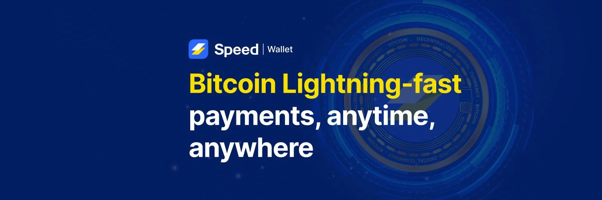

如今，市面上有很多解决方案可以帮助比特币用户获取、存储和兑换比特币。今天，我们将介绍 Speed Wallet，这是一款比特币和闪电网络钱包，让您轻松完成交易。

## 何为 Speed Wallet？

对于比特币新手来说，选择一款合适的钱包来存储和兑换比特币至关重要，它会影响您资产的安全。

考虑到这一点，Speed Wallet 提供了一个直观且安全的生态系统，让您可以：

- 存储和兑换您的比特币。
- 通过 Bitrefill 集成购买数字服务。
- 通过销售点应用程序在您的企业中接受比特币付款。

在本教程中，我们将带您了解 Speed Wallet 的各个方面，让您尽可能轻松地使用 Speed Wallet。

https://planb.academy/tutorials/exchange/centralized/bitrefill-8c588412-1bfc-465b-9bca-e647a647fbc1

## Speed Wallet 入门指南

Speed Wallet 是一款多币种托管钱包，支持比特币主网、闪电网络以及 USDT（Tether）稳定币的交易。本教程将重点介绍如何在比特币网络上使用 Speed Wallet。

Speed Wallet 提供 Android（Google Play 商店）和 iOS（Apple Store）移动应用版本，以及 Chrome 浏览器扩展程序版本，方便您在电脑上进行交易。

您可以在 [Speed Wallet 官方网站](https://speed.app) 上找到下载链接。

⚠️ **重要提示**：务必从官方下载平台下载钱包，以确保应用的真实性。

本教程将以 Android 平台为例进行讲解，但所有步骤同样适用于 iOS 系统。

Speed Wallet 需要您创建一个用户账户。您可以使用 Google 账户创建帐户，也可以设置一个强密码和邮箱地址。

https://planb.academy/tutorials/computer-security/authentication/bitwarden-0532f569-fb00-4fad-acba-2fcb1bf05de9

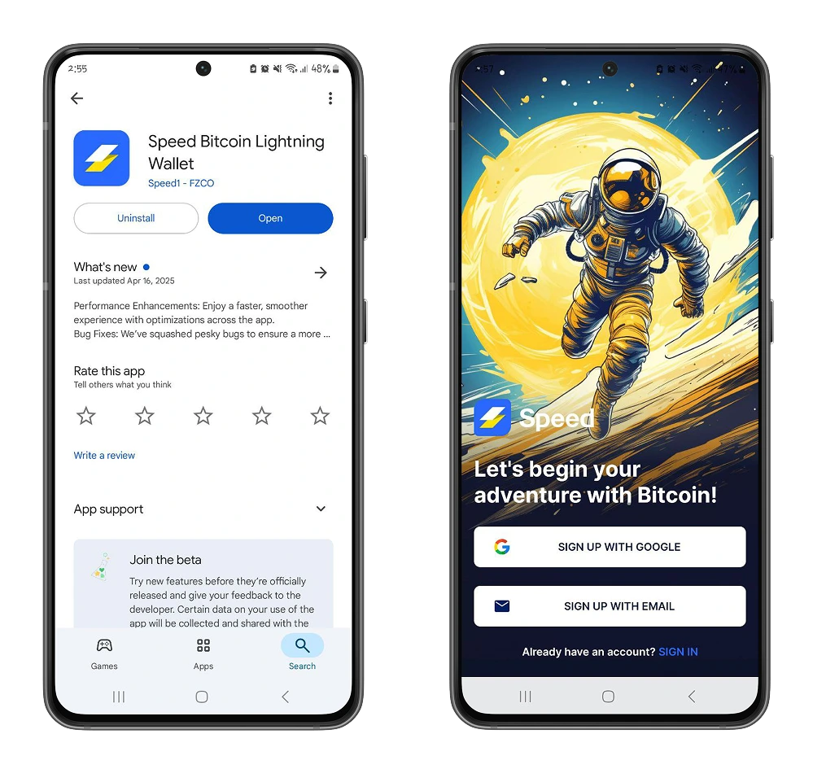

账户创建完成后，我们建议您设置双重身份验证系统或 PIN 码/生物识别指纹验证。这些配置可以增加额外的安全保障，让您在访问钱包之前以及通过 Speed Wallet 进行比特币交易时进行身份验证。

https://planb.academy/tutorials/computer-security/authentication/authy-a76ab26b-71b0-473c-aa7c-c49153705eb7

为此，请前往应用程序设置，然后激活双重认证和生物识别验证。

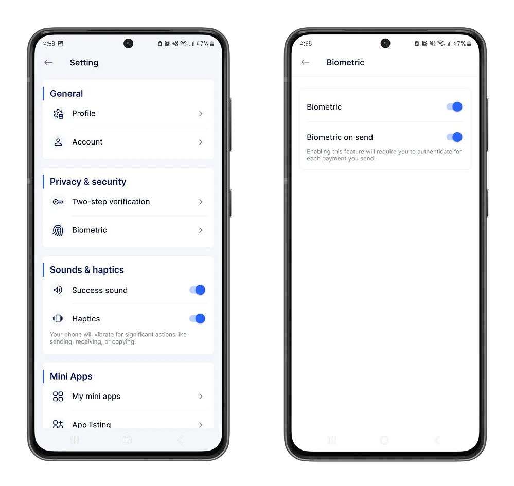

您还可以在 "Settings" 选项中选择当地货币，自定义余额的显示方式。

### 使用 Speed Wallet 进行首次交易

如果您已有比特币钱包的使用经验，那么 Speed Wallet 将是您的理想之选。它提供直观易用的界面，助您轻松上手。

在 **Wallet** 主页上，您可以找到 ：

- 您想要使用的比特币 UTXO。
- 您所选货币的余额。
- 创建和个性化您的闪电地址以接收闪电付款的选项。

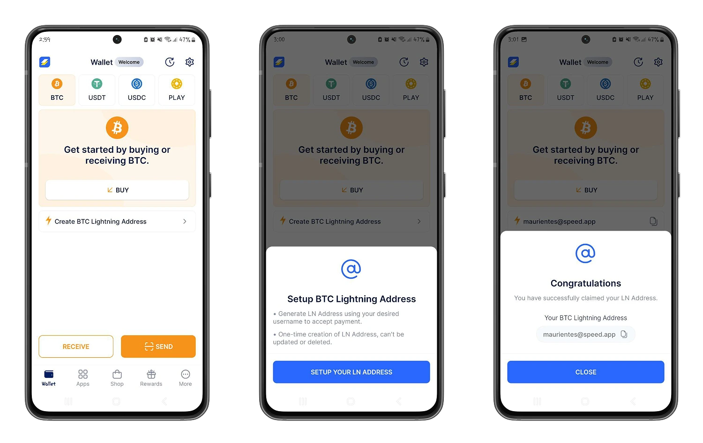

⚠️ **注意**：闪电地址是一个唯一的电子邮件别名，方便您读取闪电 URL。请务必在接收闪电付款时提供正确的闪电地址。

- 在 Speed Wallet 上接收付款：

点击 **Receive** 按钮，然后选择您要接收付款的层级和交易金额，即可将您的发票发送给发送者。

当您希望让发送者灵活地定义交易金额时，也可以直接使用您的闪电网络地址。

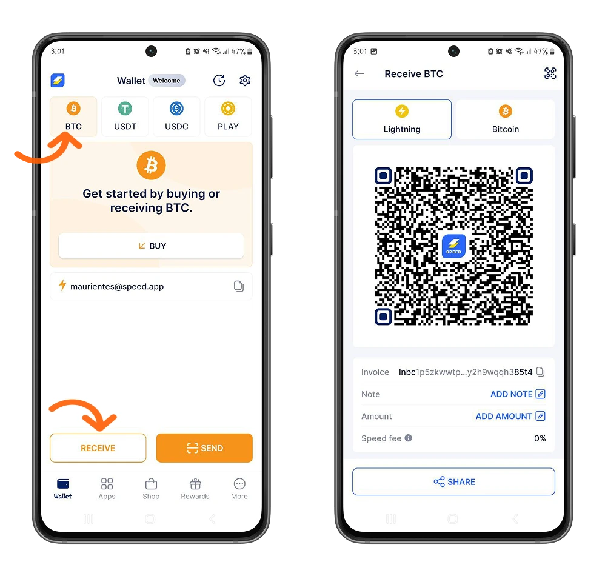

- 使用 **Speed Wallet** 发送比特币：

点击 **Send** 按钮，您可以使用接收方的闪电网络地址、闪电网络发票或比特币（主网）地址发送比特币。

Speed Wallet 会根据您的地址格式自动检测其运行的网络，从而为您提供更流畅的使用体验。

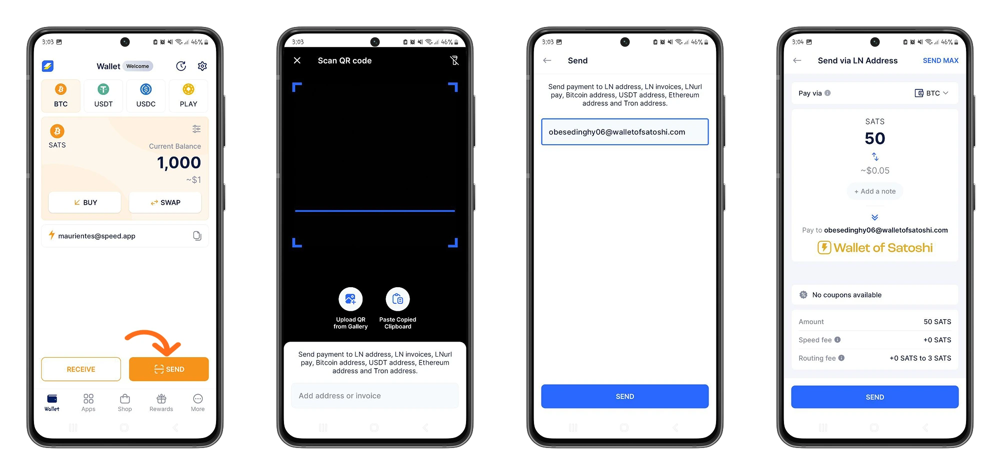

### 探索更多 Speed Wallet 功能

Speed Wallet 的首要功能之一是允许您在不离开应用程序的情况下购买和兑换货币。这样，您就可以使用钱包中其他货币的余额购买比特币。例如，您可以使用钱包中已有的 USDT 购买比特币，并享受更低的兑换手续费。

**Buy** 和 **Swap** 选项允许您将比特币兑换成 Speed Wallet 中提供的其他货币。

- **用信用卡购买比特币**：通过 Speed Wallet，您可以轻松地用日常使用的法定货币购买比特币。它包含一个支付聚合器，允许您用信用卡支付比特币。

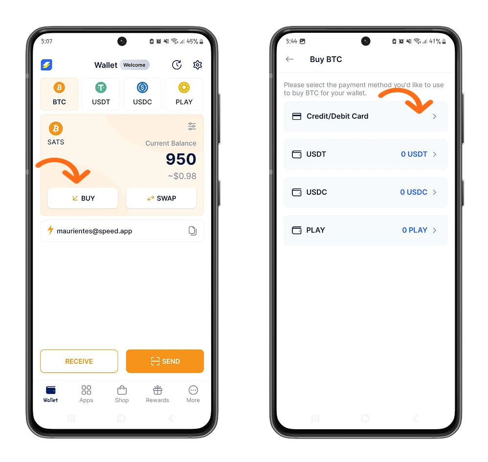

- **使用其他加密货币购买比特币**：您可以在钱包中将 USDT 或 USDC 兑换为比特币，反之亦然。通过此选项，Speed Wallet 简化了比特币的买卖流程，无需访问外部交易平台。因此，您无需离开 Speed 钱包即可交易低至 20,000 聪（按当前汇率约 20 美元）的比特币。

https://planb.academy/tutorials/exchange/centralized/bitfinex-dc306d39-bd96-4ab9-a278-a322316716db

https://planb.academy/tutorials/exchange/centralized/relai-v2-30a9671d-e407-459d-9203-4c3eae15b30e

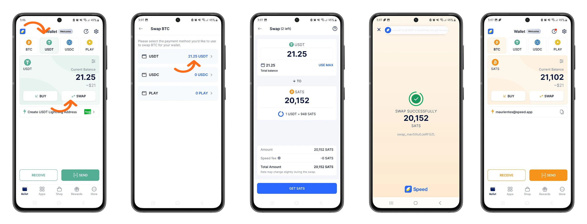

## 在 Speed Wallet 中购买商品和服务

除了交易和兑换功能外，Speed Wallet 还是一个创新的生态系统，让您可以访问接受比特币支付的商品和服务平台。

在 “Apps” 选单中，您可以找到众多平台、游戏、折扣优惠、服务，以及通过完成任务赚取比特币的平台。

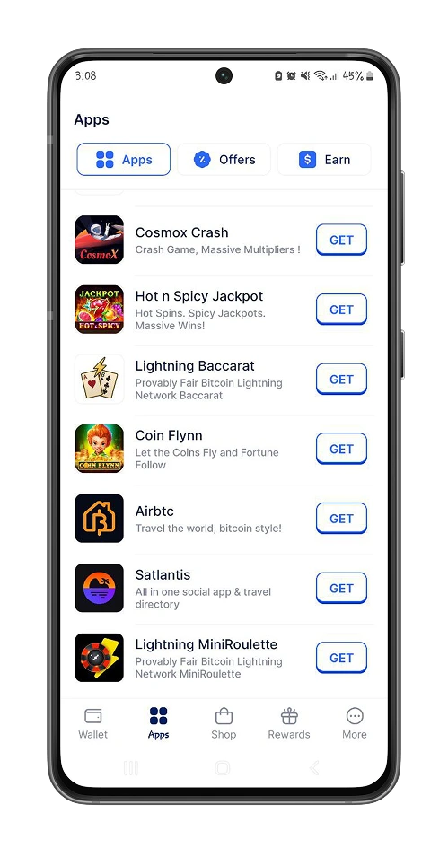

例如，您可以使用 Speed Wallet 通过 AirBtc 等平台，使用比特币支付，搜索世界各地的住宿。

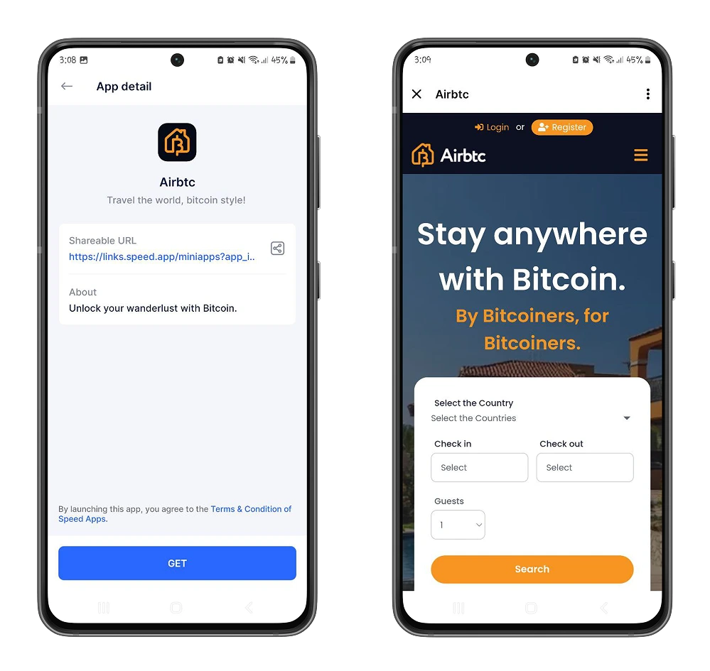

在 **Offers** 子版块，您可以找到游戏平台提供的首存折扣。

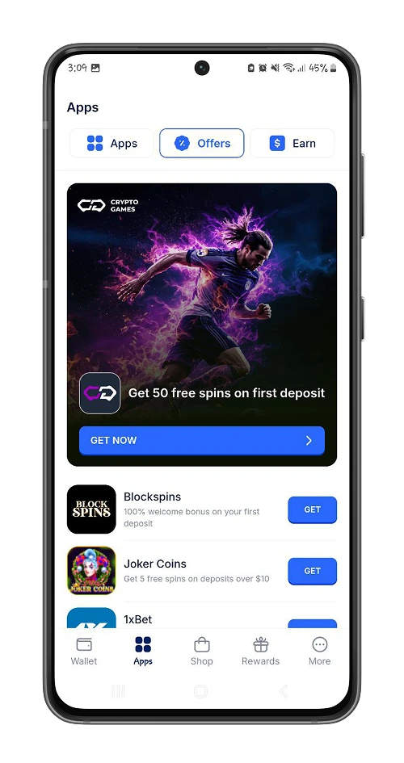

在 **Earn** 版块中，您可以找到可以通过完成任务赚取比特币的平台。

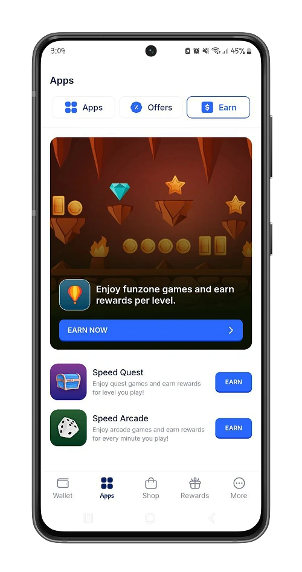

在 **Shop** 选单中，您可以找到 Bitrefill，它可以让您更近距离地使用您所在地区和其他地区提供的数字服务（礼品卡、电话充值等）。

请参阅下面的教程，了解如何开始使用 Bitrefill。

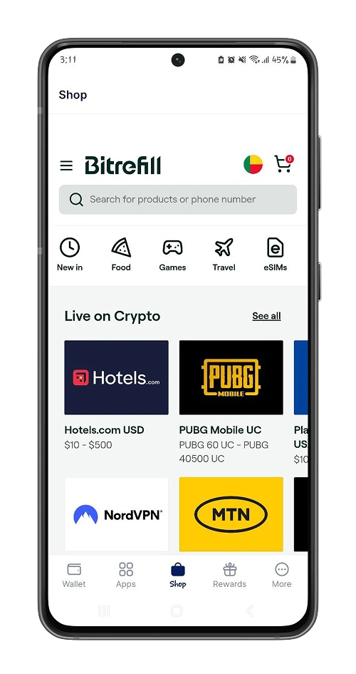

https://planb.academy/tutorials/exchange/centralized/bitrefill-8c588412-1bfc-465b-9bca-e647a647fbc1

## 获得奖励

除了内置应用外，Speed Wallet 还根据您对钱包的使用情况实施了一套循序渐进的奖励机制。根据您的交易频率，您将获得 Speed 代币，并有资格兑换比特币奖励。

Speed Wallet 还提供邀请系统，每当有人使用您的链接创建 Speed Wallet 钱包时，您都可以获得比特币奖励。

要获得资格，您必须满足以下条件：

- 您的国家/地区提供此邀请计划。
- 您的账户已注册至少 24 小时。
- 您的钱包中至少有 **1000 聪或 1 USDT**。
- 邀请和奖励不限于您的账户。

## 进一步使用 Speed Wallet

正如您所见，Speed Wallet 集成了众多平台，让您能够在日常生活中轻松使用比特币。它还允许您灵活地添加您喜爱的本地平台。

在 **Wallet** 页面的 “Settings” 选项中，“Mini Apps” 部分允许您自定义和管理所有已添加的应用程序。

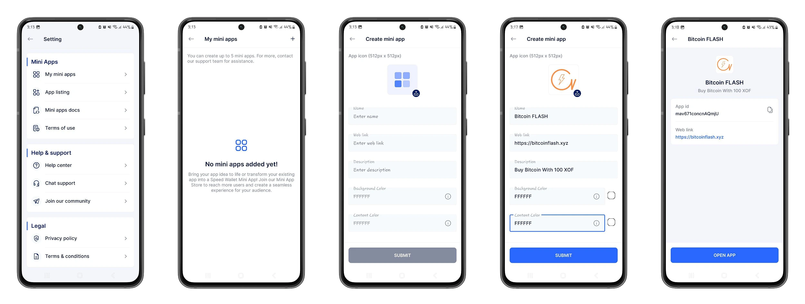

https://planb.academy/tutorials/exchange/centralized/flash-fd4308b0-7afd-450f-90e9-d37ad90ae770

## Speed Wallet 不仅限于移动设备！

除移动应用程序外，Speed Wallet 还提供一个[Chrome Web 扩展](https://chromewebstore.google.com/detail/speed-Bitcoin-lightning-w/miccfnlbijkmbckaagllchcfknjhgfnk)，您可以将其添加到电脑上的 Google Chrome 浏览器，以进行安全交易。

，您可以获得一个统一的支付聚合器，用于接受比特币付款。该聚合器基于闪电网络，可在您的线上或线下商店中使用。

Speed Wallet 主要专注于支付功能，提供以下选项：

- **在线支付**：通过此选项，您可以接受比特币作为数字产品的支付方式，包括支付链接、发票和订阅。

- **店内支付**：用于在您的商店收取款项。

- **即时支付**：此选项允许您直接通过 Speed Business 界面管理报销、提款、费用和员工工资单。

- **平台支付**：将您的 Speed Business 账户连接到您用于向这些平台进行转账和付款的外部工具。

Speed Wallet 教程到此结束。如果您觉得本教程有用，请给我们点个赞。我们也建议您看看我们关于使用 Liana 钱包保存和设置遗产规划的教程。

https://planb.academy/tutorials/wallet/desktop/liana-306ef457-700c-4fdd-b07a-8fb7a8a29f04
