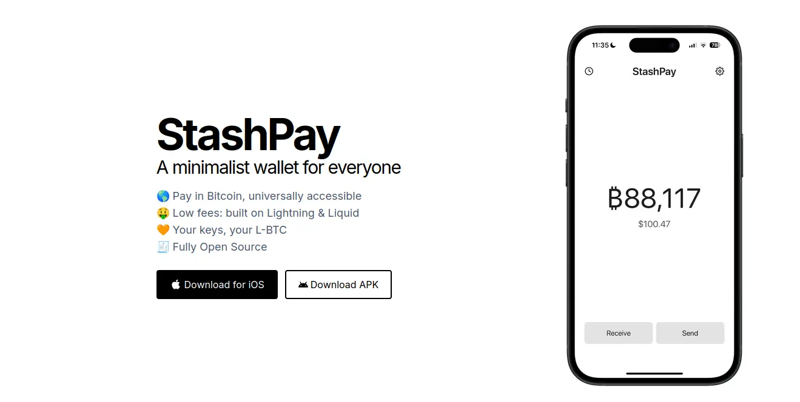
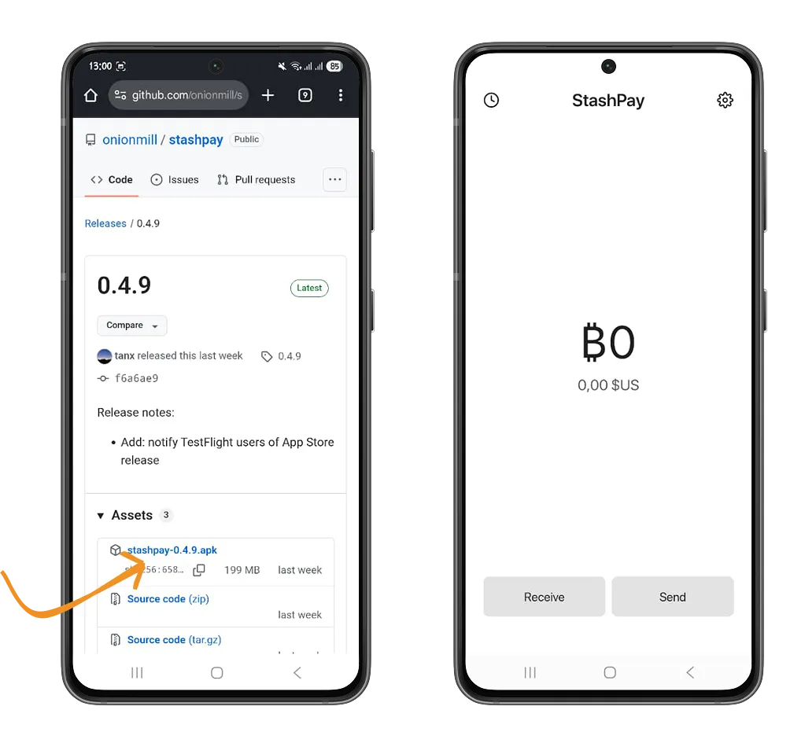
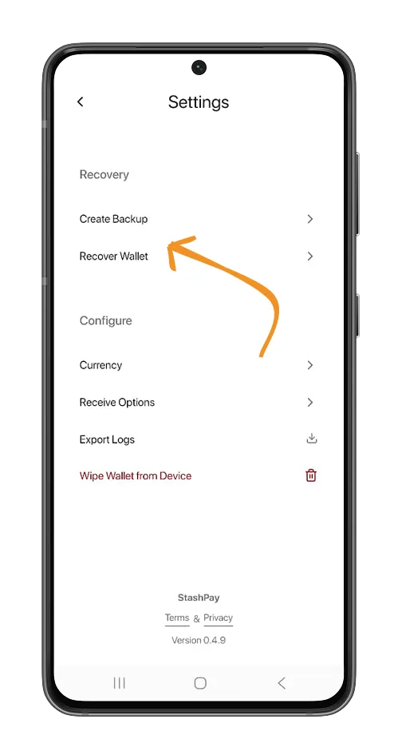
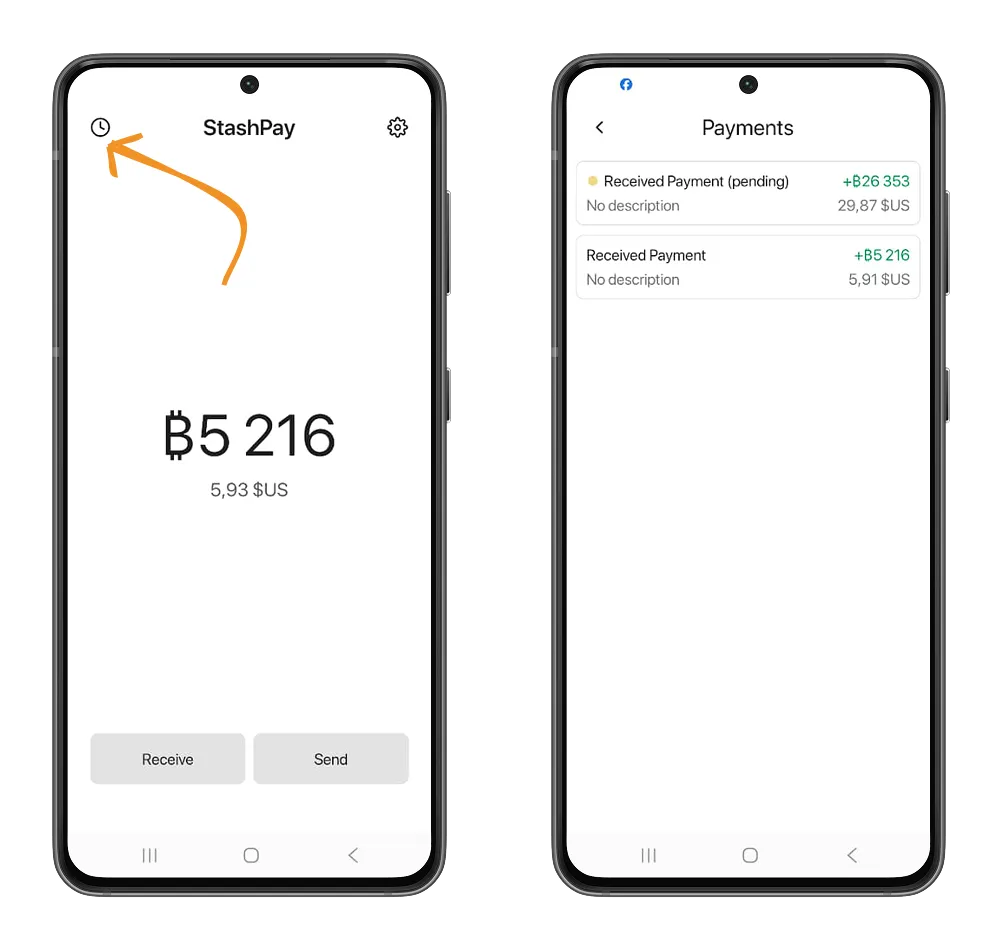
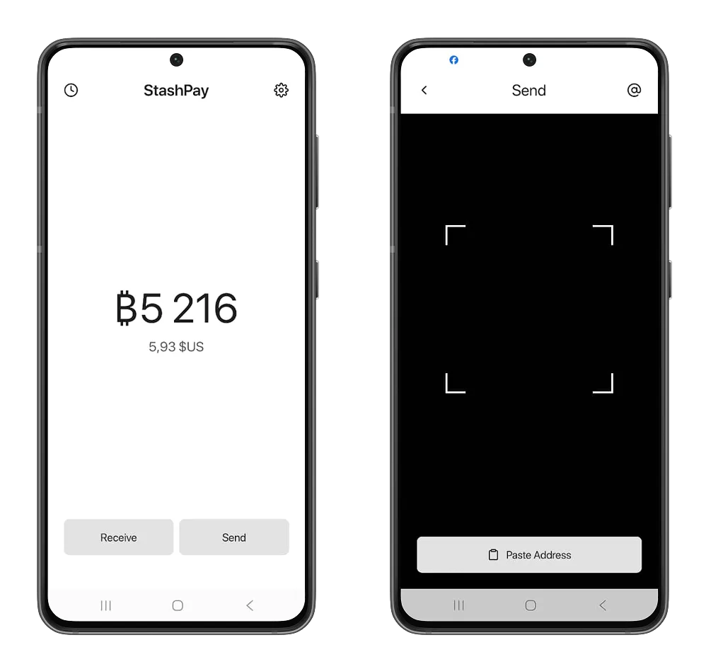
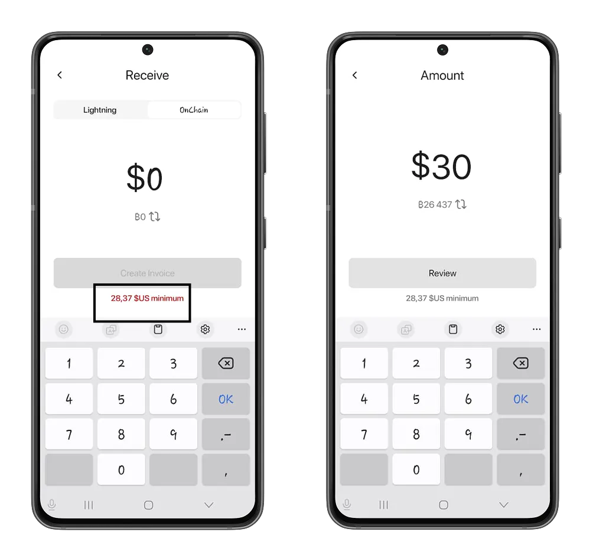
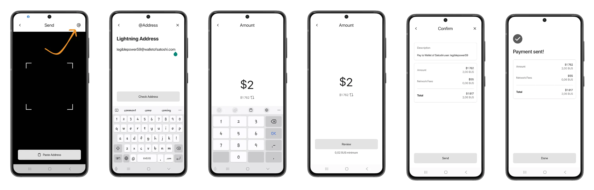
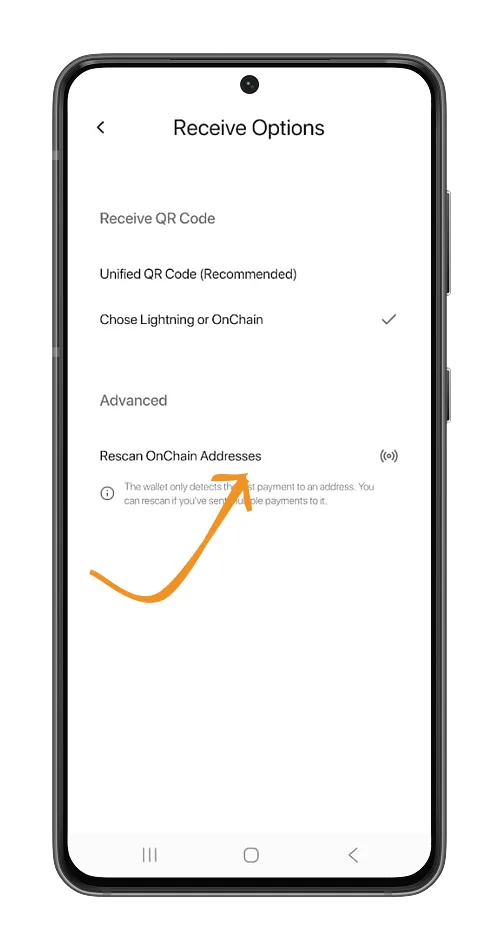

用户体验是比特币解决方案在全球范围内普及的关键因素。提供流畅、简洁且技术上无负担的用户体验是许多钱包和交易平台的首要任务。在这方面，StashPay 以其极简的设计脱颖而出，同时展现了闪电网络的强大功能。

在本教程中，我们将深入了解这款钱包，看看它是如何运作的，以及它为何非常适合小型企业或个体经营者。

## StashPay 入门

StashPay 是一款闪电网络自托管钱包，其主要特点是极简且以用户为中心的用户体验。使用这款钱包，您无需任何技术知识即可收发您的第一个聪（比特币最小单位）。

StashPay 是一个使用 React Native 开发的开源项目，旨在解决即使在比特币主链上进行交易也存在高额交易费用的问题。StashPay 是一款适用于 Android 和 iOS 平台的移动应用，您可以通过[网站](https://stashpay.me/)上的下载链接进行下载。

请务必从网站下载 Android 应用，因为该应用未在 Google Play 商店上架。

下载完成后，请授予必要的权限，以便在您的 Android 手机上安装该应用。

应用安装完成后，首次打开 StashPay 时，系统会自动为您创建一个初始比特币钱包。我们建议您在进行任何交易之前备份此钱包。以下是确保您的助记词得到正确备份的所有指南。

https://planb.academy/tutorials/wallet/backup/backup-mnemonic-22c0ddfa-fb9f-4e3a-96f9-46e2a7954270

点击 “Settings” 图标进入 StashPay 设置，然后点击 **Create backup**  选项。之后，授权显示助记词。请勿将助记词复制到手机剪贴板，因为其他安装在您手机上的欺诈应用程序可能会访问这些助记词。

您也可以通过点击 **Recover Wallet** 选项并插入 12 或 24 个单词来恢复您已在使用的比特币钱包。

### 在 StashPay 上接收您的第一个比特币

在主屏幕上点击 **Receive** 按钮，然后设置一个大于红色指定金额的金额。在我们的例子中，使用 StashPay Wallet 收到的金额不能少于 0.11 美元。

设置好金额后，您可以点击 **Create invoice** 按钮，然后扫描或复制发票，将其发送给您的聪（satoshis）发送者。

您可以点击主页上的 “时钟” 图标查看交易记录。

您可能已经注意到，接收聪需要支付网络费用。这些费用将从您即将收到的聪中扣除。这是因为 StashPay 钱包基于 Breez 开发工具包。要使用 Kit 的 Lightning 无节点实现接收聪（比特币），Breez 将向客户（在本例中为 StashPay）收取 0.25% + 40 聪的费用。请参阅我们的 Misty Breez 教程了解更多信息。

https://planb.academy/tutorials/wallet/mobile/misty-breez-738ced2a-0764-4d7f-a150-ec0ce84a9d25

### 使用 StashPay 发送比特币

由于界面简洁，使用 StashPay 发送比特币非常直观。在主屏幕上，点击 “Send” 按钮。扫描二维码或粘贴您要发送比特币的地址。StashPay 将自动检测您要发送比特币的比特币协议链。

由于 StashPay 是基于 Breez 开发套件的钱包，因此它具有一个有趣的优势：以低成本在主链上发送比特币。Breez 使用 Boltz 服务在 Bitcoin 协议的不同链之间进行交易，使实施开发套件的客户能够在其应用程序中直接受益于这项服务。

https://planb.academy/tutorials/exchange/centralized/boltz-34ad778e-6dc7-41c2-8219-e11e3361a43d

但是，Breez SDK 对发送到主链地址的比特币数量设置了最低限额。

您也可以使用接收者的闪电地址发送比特币。请检查您的交易详情，然后点击 “Send” 按钮进行确认。

## 更多配置

在 StashPay 设置中，您可以调整配置以个性化您的钱包使用体验。

StashPay 允许您根据您选择的本地货币兑换聪。点击 **Currencies** 选项，然后在 StashPay 提供的 113 种以上货币列表中查找您的货币。

在 **Receive options** 选单中，您可以找到使用 StashPay 接收比特币的所有设置。例如，选择 "**Choose Lightning or Onchain**"，就可以让您的钱包通过链上接收比特币。

通过 **Scan OnChain addresses** 选项，您可以检查链接到您不同地址的所有 UTXO（您尚未花费的比特币输出），从而刷新钱包的余额。

**Export log** 选单会列出 Breez 和 Boltz 基础设施的所有操作，这些操作涉及您的交易以及比特币协议链之间的原子交换。

您刚刚掌握了 StashPay 的极简比特币钱包。如果您觉得本教程有用，我们推荐您阅读我们的比特币入门教程，了解如何开始使用比特币并赚取您的第一个比特币。

https://planb.academy/courses/f3e3843d-1a1d-450c-96d6-d7232158b81f
