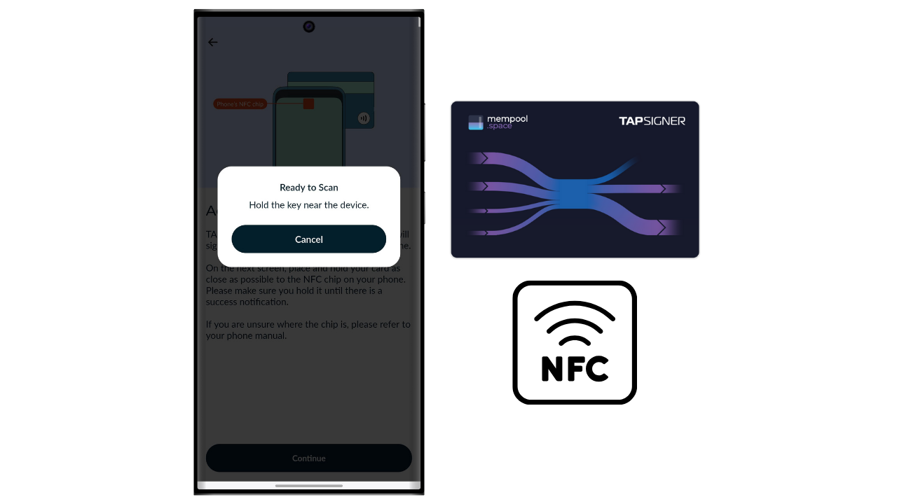
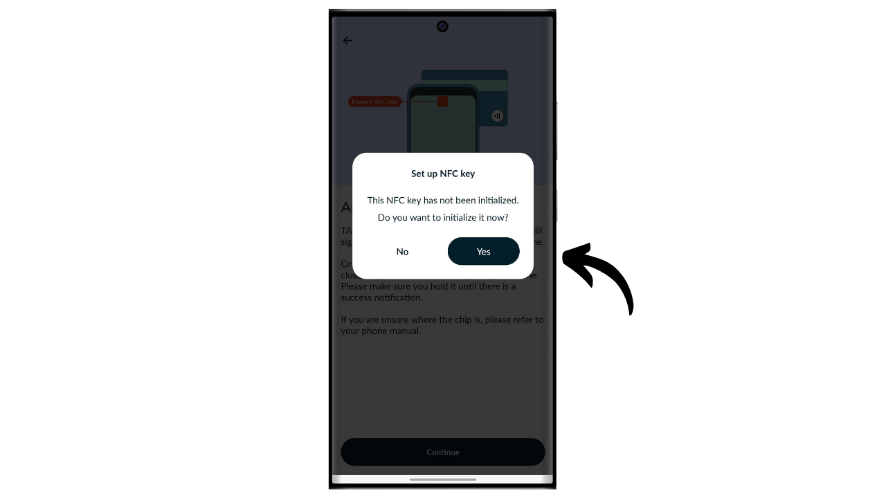
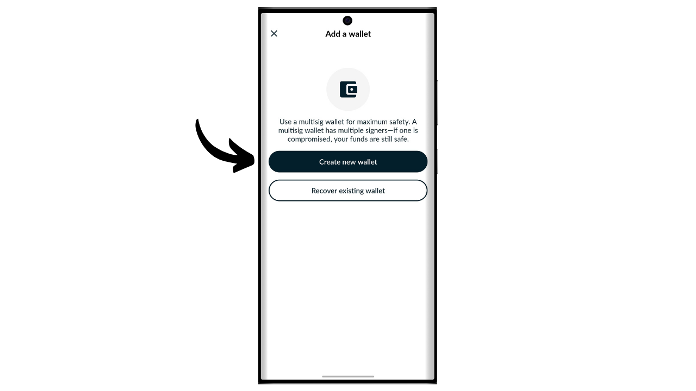
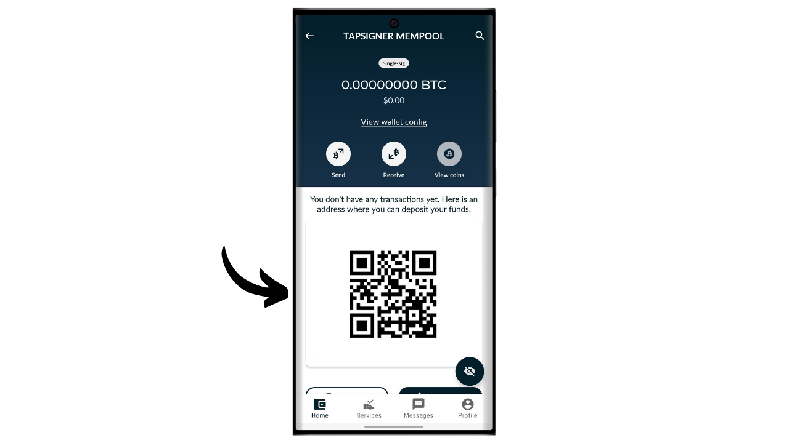
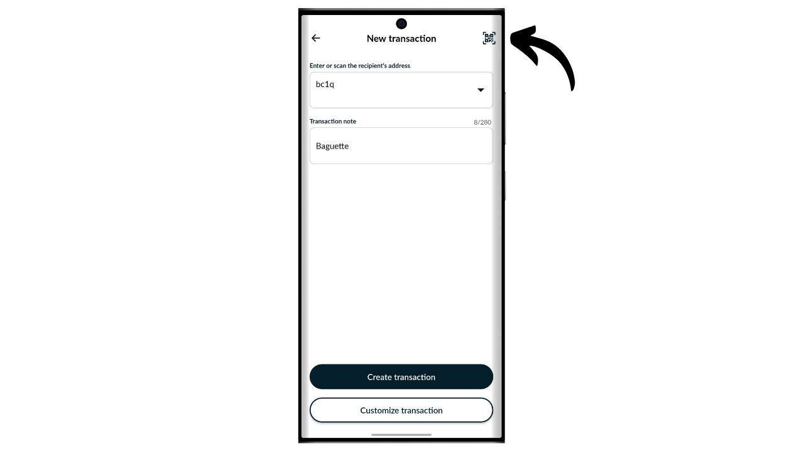
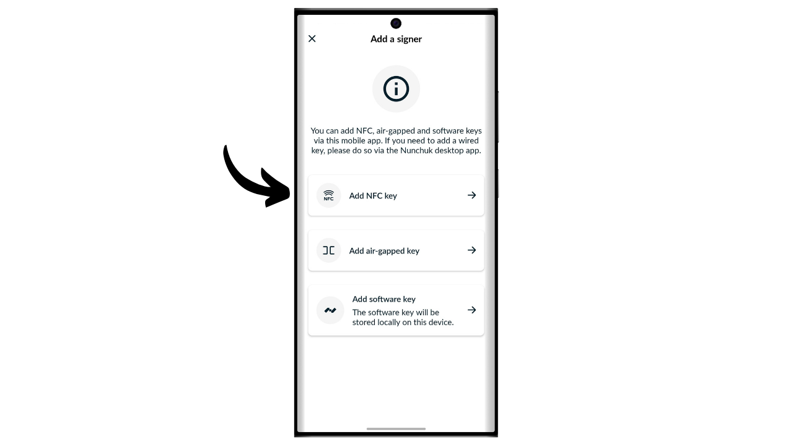

Hardwarová peněženka je elektronické zařízení určené pro správu a zabezpečení privátních klíčů Bitcoin peněženky. Na rozdíl od softwarových peněženek (neboli hot wallets) instalovaných na všeobecně používaných zařízeních často připojených k internetu, hardwarové peněženky umožňují fyzickou izolaci privátních klíčů, čímž snižují rizika hackování a krádeže.

Hlavním cílem hardwarové peněženky je minimalizovat funkce zařízení, aby se snížila jeho útočná plocha. Menší útočná plocha také znamená méně potenciálních vektorů útoku, tj. méně slabých míst v systému, které by útočníci mohli využít k přístupu k bitcoinům.

Je doporučeno používat hardwarovou peněženku k zabezpečení vašich bitcoinů, zejména pokud držíte významné množství, ať už v absolutní hodnotě nebo jako procento vašeho celkového majetku.

Hardwarové peněženky se používají ve spojení s softvarem pro správu peněženky na počítači nebo smartphonu. Tento software spravuje vytváření transakcí, ale kryptografický podpis nezbytný pro ověření těchto transakcí se provádí výhradně v rámci hardwarové peněženky. To znamená, že privátní klíče nejsou nikdy vystaveny potenciálně zranitelnému prostředí.

Hardwarové peněženky nabízejí dvojí ochranu uživatele: na jedné straně zabezpečují vaše bitcoiny proti vzdáleným útokům tím, že udržují privátní klíče offline, a na druhé straně obvykle nabízejí lepší fyzickou odolnost proti pokusům o extrakci klíčů. A právě na těchto 2 bezpečnostních kritériích lze posuzovat a řadit různé dostupné modely na trhu.

V tomto tutoriálu navrhuji objevit jedno z těchto řešení: Tapsigner od společnosti Coinkite.

## Úvod do Tapsigneru

Tapsigner je hardwarová peněženka navržená ve formě NFC karty společností Coinkite, která je také známá výrobou Coldcards.

Tapsigner umožňuje ukládání páru skládajícího se z hlavního privátního klíče a řetězového kódu v souladu s BIP32, pro odvození stromu kryptografických klíčů. Tyto klíče lze použít k podepisování transakcí umístěním Tapsigneru proti telefonu nebo čtečce NFC karet.
Tato NFC karta se prodává za 19,99 $, což je velmi dostupná cena ve srovnání s jinými hardwarovými peněženkami dostupnými na trhu. Kvůli svému formátu však Tapsigner nenabízí tolik možností jako jiná zařízení. Zřejmě největší nevýhodou je absence obrazovky na hardwarové peněžence, což ji činí více zranitelnou vůči určitým typům vzdálených útoků. To skutečně nutí uživatele k "slepému" podepisování a důvěře v to, co vidí na obrazovce svého počítače.

Přes svá omezení může být Tapsigner zajímavý kvůli své snížené ceně. Tato peněženka může být zejména použita k zvýšení bezpečnosti výdajové peněženky v doplnění k úsporové peněžence chráněné hardwarovou peněženkou vybavenou obrazovkou. Také představuje dobré řešení pro ty, kteří drží malé množství bitcoinů a nechtějí investovat stovky eur do sofistikovanějšího zařízení. Navíc použití Tapsigneru v multisig konfiguracích, nebo potenciálně v systémech peněženek s časovým zámkem v budoucnu, může nabídnout zajímavé výhody.

## Jak koupit Tapsigner?

Tapsigner je k dispozici k nákupu [na oficiálních stránkách Coinkite](https://store.coinkite.com/store/category/tapsigner). Pro koupi v kamenném obchodě můžete také najít [seznam certifikovaných prodejců](https://coinkite.com/resellers) na stránkách.
Také budete potřebovat telefon kompatibilní s NFC komunikací, nebo USB zařízení pro čtení NFC karet na standardní frekvenci 13,56 MHz.
## Jak inicializovat Tapsigner s Nunchuk?

Jakmile obdržíte svůj Tapsigner, prvním krokem je prohlédnout balení, abyste se ujistili, že nebylo otevřeno. Pokud je balení poškozené, může to naznačovat, že karta byla kompromitována a nemusí být autentická. CoinKite vám dodá Tapsigner v pouzdře, které blokuje rádiové vlny. Ujistěte se, že je součástí vašeho balení.

Pro správu peněženky použijeme mobilní aplikaci **Nunchuk Wallet**. Ujistěte se, že váš smartphone je kompatibilní s NFC, poté si stáhněte Nunchuk z [Google Play Store](https://play.google.com/store/apps/details?id=io.nunchuk.android), [App Store](https://apps.apple.com/us/app/nunchuk-bitcoin-wallet/id1563190073) nebo přímo přes jeho [`.apk` soubor](https://github.com/nunchuk-io/nunchuk-android/releases).

Pokud používáte Nunchuk poprvé, aplikace vás vyzve k vytvoření účtu. Pro účely tohoto návodu není nutné vytvářet účet. Takže vyberte "*Pokračovat jako host*", abyste pokračovali bez účtu.

Poté klikněte na "*Neasistovaná peněženka*".

Dále klikněte na tlačítko "*Prozkoumám na vlastní pěst*".

Až budete v Nunchuku, klikněte na tlačítko "*+*" vedle záložky "*Klíče*".

Vyberte "*Přidat NFC klíč*".

Poté klikněte na "*Přidat TAPSIGNER*".

Klikněte na "*Pokračovat*" a poté přiložte vaši Tapsigner NFC kartu k vašemu smartphonu.

Pokud je váš Tapsigner nový, Nunchuk nabídne jeho inicializaci. Klikněte na "*Ano*".

Nyní budete muset vybrat, jak vygenerujete váš hlavní řetězový kód.

Tapsigner používá standard BIP32. To znamená, že odvození vašich kryptografických klíčů, které zabezpečují vaše bitcoiny, nezávisí na mnemonické frázi jako peněženky BIP39, ale přímo na hlavním soukromém klíči a hlavním řetězovém kódu. Tyto 2 prvky jsou předány funkcí HMAC pro deterministické a hierarchické odvození zbytku vaší peněženky.

Hlavní soukromý klíč je generován přímo TRNG (*True Random Number Generator*) integrovaným ve vašem Tapsigneru. Hlavní řetězový kód, na druhou stranu, musí být poskytnut zvenčí. V tomto kroku máte na výběr: nechat Nunchuk generovat jej automaticky kliknutím na "*Automatické*", nebo jej vygenerovat sami výběrem "*Pokročilé*" a zadáním do poskytnutého pole.

Dále si musíte vybrat PIN kód. V oblasti "*Počáteční PIN*" zadejte PIN kód, který je napsaný na zadní straně vašeho Tapsigneru.

Vyberte si PIN kód pro zabezpečení fyzického přístupu k vašemu Tapsigneru. Tento PIN kód nehraje žádnou roli v procesu obnovy peněženky. Jeho jedinou funkcí je odemknout váš Tapsigner pro podepisování transakcí. Ujistěte se, že si tento PIN kód uložíte, abyste ho nezapomněli. Klikněte na "*Pokračovat*" a pokračujte.

Nyní položte vaši kartu Tapsigner na zadní stranu vašeho telefonu, aby se inicializovala.

Nunchuk poté vygeneruje soubor pro obnovu vaší peněženky, který vám umožní znovu získat přístup k vašim bitcoinům v případě, že ztratíte svou NFC kartu. Tento soubor je šifrován záložním kódem napsaným na zadní straně vašeho Tapsigneru. Pro obnovu vašich bitcoinů budete absolutně potřebovat tento soubor i kód k jeho dešifrování. Je proto důležité udělat papírovou kopii tohoto kódu, protože pokud ztratíte svou NFC kartu, přístup k tomuto kódu bude také ztracen, jelikož je zatím napsán pouze na kartě. Ujistěte se, že vytvoříte také několik záloh vašeho šifrovaného souboru pro obnovu.

Vyberte název pro vaši peněženku.

Základ vaší peněženky je nyní nastaven. Pro ověření pravosti vašeho Tapsigneru můžete kdykoliv kliknout na tlačítko "*Spustit kontrolu zdraví*".

Zadejte svůj PIN.

Poté položte svou kartu na zadní stranu telefonu.

## Jak vytvořit peněženku na Tapsigneru?

Zpět na domovské stránce Nunchuku můžete vidět, že váš Tapsigner je zaregistrován mezi dostupnými zařízeními pro podepisování.

Nyní budete potřebovat generovat klíče pro vaši Bitcoin peněženku. K tomu klikněte na tlačítko "*+*" vpravo od záložky "*Peněženky*".

Klikněte na "*Vytvořit novou peněženku*".

Poté vyberte možnost "*Vytvořit novou peněženku pomocí existujících klíčů*".

Vyberte název pro vaši peněženku a poté klikněte na "*Pokračovat*".

Vyberte svůj Tapsigner jako zařízení pro podepisování této nové sady klíčů, poté klikněte na "*Pokračovat*".

Pokud je vše podle vašich představ, potvrďte vytvoření.

Poté si můžete uložit konfigurační soubor vaší peněženky. Tento soubor obsahuje výhradně vaše veřejné klíče, což znamená, že i když k němu někdo získá přístup, nemůže ukrást vaše bitcoiny. Nicméně mohou sledovat všechny vaše transakce. Tento soubor tedy představuje riziko pouze pro vaše soukromí. V některých případech může být nezbytný pro obnovu vaší peněženky. 

A máte to, vaše peněženka byla úspěšně vytvořena!

Když nepoužíváte svůj Tapsigner, nezapomeňte ho uložit do přiloženého pouzdra od Coinkite, které blokuje rádiové vlny a chrání tak před neautorizovaným čtením.

## Jak přijímat bitcoiny na Tapsigneru?

Pro přijetí bitcoinů klikněte na svou peněženku.

Poté použijte generovanou adresu pro přijetí bitcoinů. Pokud jste na této peněžence již dříve přijímali bitcoiny, budete muset kliknout na tlačítko "*Přijmout*" pro generování nové prázdné přijímací adresy.

Jakmile odesílatel vysílá transakci, uvidíte ji objevit se ve vaší peněžence.

Klikněte na "*Zobrazit mince*".

Vyberte svůj nový UTXO.

Klikněte na "*+*" vedle "*Štítky*" pro přidání popisku k vašemu UTXO. To je dobrá praxe, protože vám pomáhá pamatovat si původ vašich mincí a optimalizovat vaše soukromí pro budoucí výdaje.

Vyberte existující štítek nebo vytvořte nový, poté klikněte na "*Uložit*". Máte také možnost vytvořit "*kolekce*" pro organizaci vašich mincí strukturovanějším způsobem.

## Jak posílat bitcoiny s Tapsignerem?

Nyní, když máte bitcoiny ve své peněžence, můžete je také posílat. Pro toto klikněte na peněženku dle vašeho výběru.

Klikněte na tlačítko "*Poslat*".

Vyberte částku k odeslání, poté klikněte na "*Pokračovat*".

Přidejte "*poznámku*" k vaší budoucí transakci, abyste si pamatovali její účel.

Dále ručně zadejte adresu příjemce do určeného pole.

Můžete také naskenovat adresu zakódovanou v QR kódu kliknutím na ikonu v pravém horním rohu obrazovky.

Klikněte na tlačítko "*Vytvořit transakci*".

Ověřte detaily vaší transakce, poté klikněte na tlačítko "*Podepsat*" vedle vašeho Tapsignera.

Zadejte svůj PIN pro jeho odemčení.

Poté přiložte Tapsigner na zadní stranu vašeho smartphonu.

Vaše transakce je nyní podepsána. Zkontrolujte ještě jednou, že je vše správně, a poté klikněte na "*Broadcast Transaction*" pro odeslání do Bitcoinové sítě.

Vaše transakce nyní čeká na potvrzení.

## Jak obnovit peněženku v případě ztráty Tapsigneru?

Pokud jste ztratili svůj Tapsigner, můžete svou peněženku obnovit pomocí kódu, který je zapsán na zadní straně karty. Je proto důležité tento kód uložit odděleně od Tapsigneru, protože pokud je karta ztracena, přístup k tomuto kódu bude také ztracen. Budete také potřebovat šifrovanou zálohu peněženky.

Pro obnovu použijeme aplikaci Nunchuk, ale mějte na paměti, že to znamená dočasné zabezpečení vašich prostředků v hot peněžence. Pokud váš Tapsigner zabezpečoval významné částky, zvažte následování stejného procesu obnovy s novým Coldcardem.

Otevřete aplikaci Nunchuk a klikněte na tlačítko "*+*" vedle záložky "*Keys*".

Vyberte "*Add NFC key*".

Vyberte možnost "*Recover TAPSIGNER key from backup*".

Poté budete přesměrováni do průzkumníka souborů vašeho zařízení. Najděte a vyberte šifrovaný záložní soubor vaší peněženky. Obvykle název tohoto souboru začíná `backup...`.

Zadejte heslo, které dešifruje záložní soubor. Toto heslo odpovídá tomu, které bylo původně zapsáno na zadní straně vašeho Tapsigneru.

Poté si vyberte název pro vaši obnovenou peněženku.

Nyní jste znovu získali přístup ke svým bitcoinům. Vaše peněženka je nyní spravována jako hot peněženka viditelná v záložce "*Keys*" aplikace Nunchuk. Dále potřebujete vytvořit novou sadu kryptografických klíčů v sekci "*Wallets*" tím, že tento klíč s ní spojíte. K tomu můžete znovu postupovat podle kroků v části "*How to create a wallet on a Tapsigner?*" tohoto návodu.

Pokud jste ztratili svůj Tapsigner, důrazně vám doporučuji okamžitě převést vaše bitcoiny do jiné vaší peněženky, ideálně chráněné hardware peněženkou. Ztracený Tapsigner by totiž mohl být v nesprávných rukou. Je proto důležité právě obnovenou peněženku vyprázdnit a přestat ji používat.

Gratuluji, nyní jste plně obeznámeni s používáním Tapsigneru! Pokud se vám tento návod zdál užitečný, ocenil bych, kdybyste níže zanechali palce nahoru. Neváhejte tento článek sdílet na svých sociálních sítích. Velmi vám děkuji!