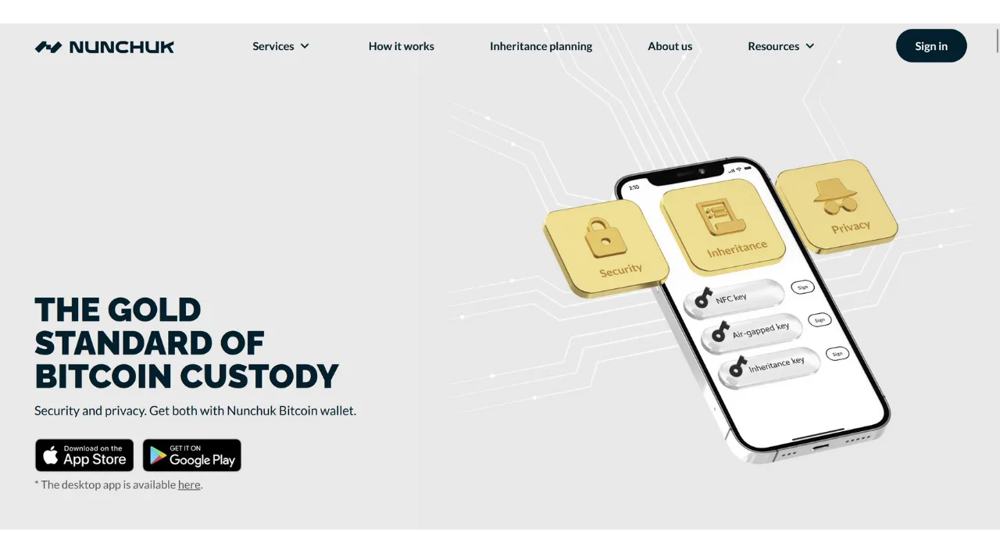
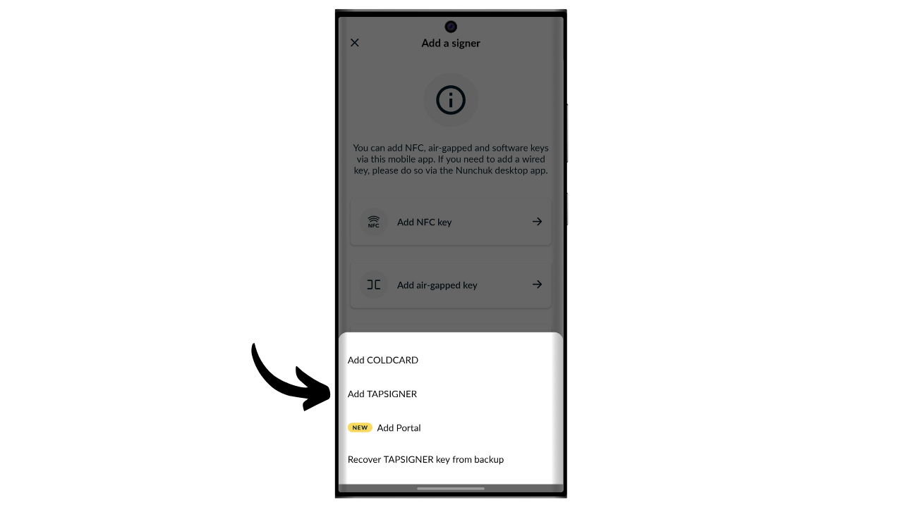
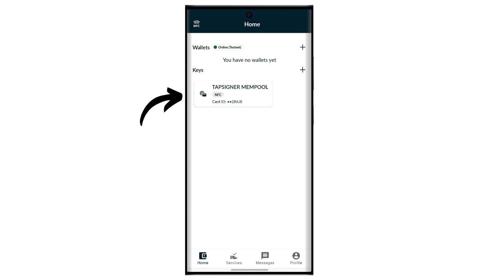
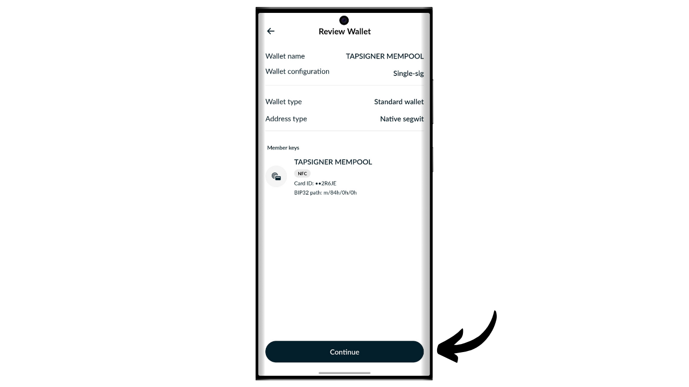
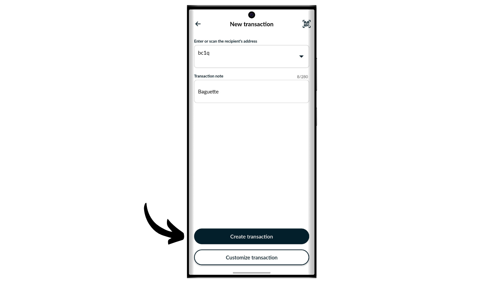
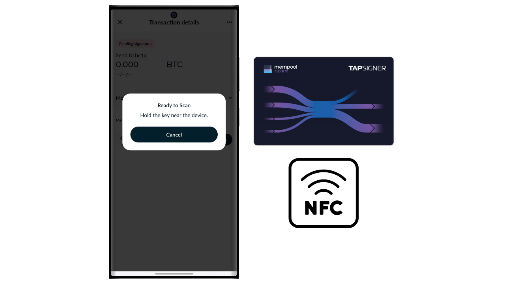
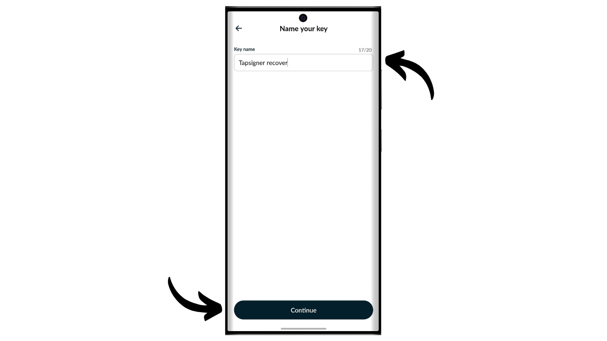

Eine Hardware-Wallet ist ein elektronisches Gerät, das speziell für die Verwaltung und Sicherheit der privaten Schlüssel einer Bitcoin-Wallet entwickelt wurde. Im Gegensatz zu Software-Wallets (oder Hot Wallets), die auf allgemeinen Maschinen installiert sind, die oft mit dem Internet verbunden sind, ermöglichen Hardware-Wallets die physische Isolierung privater Schlüssel, wodurch die Risiken von Hacking und Diebstahl verringert werden.

Das Hauptziel einer Hardware-Wallet ist es, die Funktionalitäten des Geräts zu minimieren, um seine Angriffsfläche zu reduzieren. Eine kleinere Angriffsfläche bedeutet auch weniger potenzielle Angriffsvektoren, d.h. weniger Schwachstellen im System, die Angreifer ausnutzen könnten, um auf die Bitcoins zuzugreifen.

Es wird empfohlen, eine Hardware-Wallet zu verwenden, um Ihre Bitcoins zu sichern, insbesondere wenn Sie bedeutende Mengen halten, sei es im absoluten Wert oder als Anteil an Ihren Gesamtvermögen.

Hardware-Wallets werden in Kombination mit einer Wallet-Verwaltungssoftware auf einem Computer oder Smartphone verwendet. Diese Software verwaltet die Erstellung von Transaktionen, aber die kryptografische Signatur, die notwendig ist, um diese Transaktionen zu validieren, erfolgt ausschließlich innerhalb der Hardware-Wallet. Das bedeutet, dass die privaten Schlüssel nie einer potenziell gefährdeten Umgebung ausgesetzt sind.

Hardware-Wallets bieten dem Benutzer einen doppelten Schutz: einerseits sichern sie Ihre Bitcoins gegen Fernangriffe, indem sie die privaten Schlüssel offline halten, und andererseits bieten sie in der Regel eine bessere physische Widerstandsfähigkeit gegen Versuche, die Schlüssel zu extrahieren. Und genau anhand dieser 2 Sicherheitskriterien kann man die verschiedenen auf dem Markt erhältlichen Modelle beurteilen und einordnen.

In diesem Tutorial schlage ich vor, eine dieser Lösungen zu entdecken: den Tapsigner von Coinkite.

## Einführung in den Tapsigner

Der Tapsigner ist eine Hardware-Wallet in Form einer NFC-Karte, die von der Firma Coinkite entwickelt wurde, die auch für die Produktion von Coldcards bekannt ist.

Der Tapsigner ermöglicht die Speicherung eines Paares, bestehend aus einem Master-Privatschlüssel und einem Ketten-Code gemäß BIP32, um einen Baum kryptografischer Schlüssel abzuleiten. Diese Schlüssel können verwendet werden, um Transaktionen zu signieren, indem der Tapsigner gegen ein Telefon oder einen NFC-Kartenleser positioniert wird.
Diese NFC-Karte wird für $19,99 verkauft, was im Vergleich zu anderen auf dem Markt erhältlichen Hardware-Wallets sehr erschwinglich ist. Aufgrund seines Formats bietet der Tapsigner jedoch nicht so viele Optionen wie andere Geräte. Es gibt offensichtlich keine Batterie, keine Kamera und keinen Micro-SD-Kartenleser, da es sich um eine Karte handelt. Meiner Meinung nach ist sein größter Nachteil das Fehlen eines Bildschirms auf der Hardware-Wallet, was sie anfälliger für bestimmte Arten von Fernangriffen macht. Tatsächlich zwingt dies den Benutzer, blind zu signieren und dem zu vertrauen, was er auf seinem Computerbildschirm sieht.

Trotz seiner Einschränkungen kann der Tapsigner aufgrund seines reduzierten Preises interessant sein. Diese Wallet kann insbesondere dazu verwendet werden, die Sicherheit einer Ausgaben-Wallet zusätzlich zu einer Spar-Wallet zu erhöhen, die durch eine Hardware-Wallet mit Bildschirm geschützt ist. Es stellt auch eine gute Lösung für diejenigen dar, die kleine Mengen an Bitcoins halten und nicht hundert Euro in ein ausgefeilteres Gerät investieren möchten. Darüber hinaus kann die Verwendung von Tapsigner in Multisig-Konfigurationen oder potenziell in Wallet-Systemen mit Timelock in der Zukunft interessante Vorteile bieten.

## Wie kauft man einen Tapsigner?

Der Tapsigner ist zum Kauf [auf der offiziellen Coinkite-Website](https://store.coinkite.com/store/category/tapsigner) verfügbar. Um ihn in einem physischen Geschäft zu kaufen, können Sie auch [die Liste der zertifizierten Wiederverkäufer](https://coinkite.com/resellers) auf der Website finden.
Sie benötigen auch ein Telefon, das mit NFC-Kommunikation kompatibel ist, oder ein USB-Gerät, um NFC-Karten mit der Standardfrequenz von 13,56 MHz zu lesen.
## Wie initialisiert man einen Tapsigner mit Nunchuk?

Sobald Sie Ihren Tapsigner erhalten haben, besteht der erste Schritt darin, die Verpackung zu überprüfen, um sicherzustellen, dass sie nicht geöffnet wurde. Wenn die Verpackung beschädigt ist, könnte dies darauf hinweisen, dass die Karte kompromittiert wurde und möglicherweise nicht authentisch ist. CoinKite wird Ihren Tapsigner mit einem Gehäuse liefern, das Funkwellen blockiert. Stellen Sie sicher, dass es in Ihrem Paket enthalten ist.

Um die Wallet zu verwalten, werden wir die **Nunchuk Wallet** Mobile-App verwenden. Stellen Sie sicher, dass Ihr Smartphone NFC-kompatibel ist, und laden Sie dann Nunchuk aus dem [Google Play Store](https://play.google.com/store/apps/details?id=io.nunchuk.android), dem [App Store](https://apps.apple.com/us/app/nunchuk-bitcoin-wallet/id1563190073) oder direkt über seine [`.apk`-Datei](https://github.com/nunchuk-io/nunchuk-android/releases) herunter.

Wenn Sie Nunchuk zum ersten Mal verwenden, wird die App Sie auffordern, ein Konto zu erstellen. Für die Zwecke dieses Tutorials ist es nicht notwendig, eines zu erstellen. Wählen Sie also "*Weiter als Gast*", um ohne Konto fortzufahren.

Klicken Sie dann auf "*Unbetreute Wallet*".

Klicken Sie als Nächstes auf den Button "*Ich erkunde selbst*".

Einmal in Nunchuk, klicken Sie auf den "*+*" Button neben dem Tab "*Schlüssel*".

Wählen Sie "*NFC-Schlüssel hinzufügen*".

Klicken Sie dann auf "*TAPSIGNER hinzufügen*".

Klicken Sie auf "*Weiter*" und platzieren Sie dann Ihre Tapsigner NFC-Karte an Ihr Smartphone.

Wenn Ihr Tapsigner neu ist, wird Nunchuk anbieten, ihn zu initialisieren. Klicken Sie auf "*Ja*".

Jetzt müssen Sie wählen, wie Sie Ihren Master-Chain-Code generieren.

Der Tapsigner verwendet den BIP32-Standard. Das bedeutet, dass die Ableitung Ihrer kryptografischen Schlüssel, die Ihre Bitcoins sichern, nicht auf einer mnemonischen Phrase wie bei BIP39-Wallets basiert, sondern direkt auf dem Master-Privatschlüssel und dem Master-Chain-Code. Diese 2 Elemente werden durch die HMAC-Funktion geleitet, um den Rest Ihrer Wallet deterministisch und hierarchisch abzuleiten.

Der Master-Privatschlüssel wird direkt vom TRNG (*True Random Number Generator*) in Ihrem Tapsigner generiert. Der Master-Chain-Code hingegen muss von außen bereitgestellt werden. In diesem Schritt haben Sie die Wahl: Lassen Sie Nunchuk ihn automatisch generieren, indem Sie auf "*Automatisch*" klicken, oder generieren Sie ihn selbst, indem Sie "*Erweitert*" auswählen und ihn in das vorgesehene Feld eingeben.

Als Nächstes müssen Sie einen PIN-Code wählen. Geben Sie im Bereich "*Start-PIN*" den auf der Rückseite Ihres Tapsigners geschriebenen PIN-Code ein.

Wählen Sie einen PIN-Code, um den physischen Zugang zu Ihrem Tapsigner zu sichern. Dieser PIN-Code spielt keine Rolle im Wiederherstellungsprozess der Wallet. Seine einzige Funktion ist es, Ihren Tapsigner zum Signieren von Transaktionen zu entsperren. Stellen Sie sicher, dass Sie diesen PIN-Code speichern, um ihn nicht zu vergessen. Klicken Sie auf "*Weiter*", um fortzufahren.

Platzieren Sie jetzt Ihre Tapsigner-Karte auf der Rückseite Ihres Telefons, um sie zu initialisieren.

Nunchuk wird dann die Wiederherstellungsdatei für Ihre Wallet generieren, die es Ihnen ermöglicht, im Falle eines Verlustes Ihrer NFC-Karte wieder Zugang zu Ihren Bitcoins zu erhalten. Diese Datei ist mit dem Backup-Code verschlüsselt, der auf der Rückseite Ihres Tapsigners geschrieben steht. Um Ihre Bitcoins wiederherzustellen, benötigen Sie unbedingt diese Datei sowie den Code, um sie zu entschlüsseln. Es ist daher wichtig, eine Papierkopie dieses Codes zu machen, denn wenn Sie Ihre NFC-Karte verlieren, geht auch der Zugang zu diesem Code verloren, da er bis jetzt nur auf der Karte geschrieben steht. Stellen Sie sicher, dass Sie auch mehrere Backups Ihrer verschlüsselten Wiederherstellungsdatei erstellen.

Wählen Sie einen Namen für Ihre Wallet.

Die Grundlage Ihrer Wallet ist nun eingerichtet. Um die Authentizität Ihres Tapsigners jederzeit zu überprüfen, können Sie auf den Button "*Gesundheitsprüfung durchführen*" klicken.

Geben Sie Ihren PIN ein.

Platzieren Sie dann Ihre Karte auf der Rückseite Ihres Telefons.

## Wie erstellt man eine Wallet auf einem Tapsigner?

Zurück auf der Startseite von Nunchuk können Sie sehen, dass Ihr Tapsigner bei den verfügbaren Signiergeräten registriert ist.

Jetzt müssen Sie die Schlüssel für Ihre Bitcoin-Wallet generieren. Klicken Sie dazu auf den "*+*" Button rechts neben dem Tab "*Wallets*".

Klicken Sie auf "*Neue Wallet erstellen*".

Wählen Sie dann die Option "*Neue Wallet mit bestehenden Schlüsseln erstellen*".

Wählen Sie einen Namen für Ihre Wallet und klicken Sie dann auf "*Weiter*".

Wählen Sie Ihren Tapsigner als das Signiergerät für diesen neuen Schlüsselsatz und klicken Sie dann auf "*Weiter*".

Wenn alles zu Ihrer Zufriedenheit ist, bestätigen Sie die Erstellung.

Sie können dann die Konfigurationsdatei Ihres Wallets speichern. Diese Datei enthält ausschließlich Ihre öffentlichen Schlüssel, was bedeutet, dass selbst wenn jemand darauf zugreift, er Ihre Bitcoins nicht stehlen kann. Allerdings können sie all Ihre Transaktionen verfolgen. Daher stellt diese Datei nur ein Risiko für Ihre Privatsphäre dar. In einigen Fällen kann sie wesentlich für die Wiederherstellung Ihres Wallets sein.

Und voilà, Ihr Wallet wurde erfolgreich erstellt!

Wenn Sie Ihren Tapsigner nicht verwenden, denken Sie daran, ihn in das von Coinkite bereitgestellte Etui zu legen, das Radiowellen blockiert, um vor unbefugten Lesungen zu schützen.

## Wie empfange ich Bitcoins auf dem Tapsigner?

Um Bitcoins zu empfangen, klicken Sie auf Ihr Wallet.

Verwenden Sie dann die generierte Adresse, um Bitcoins zu empfangen. Wenn Sie zuvor bereits Bitcoins auf diesem Wallet erhalten haben, müssen Sie auf den "*Empfangen*" Knopf klicken, um eine neue leere Empfangsadresse zu generieren.

Sobald die Transaktion des Senders übertragen wird, sehen Sie sie in Ihrem Wallet erscheinen.

Klicken Sie auf "*Münzen anzeigen*".

Wählen Sie Ihr neues UTXO aus.

Klicken Sie auf das "*+*" neben "*Tags*", um Ihrem UTXO ein Label hinzuzufügen. Dies ist eine gute Praxis, da es Ihnen hilft, sich an den Ursprung Ihrer Münzen zu erinnern und Ihre Privatsphäre für zukünftige Ausgaben zu optimieren.

Wählen Sie ein vorhandenes Tag aus oder erstellen Sie ein neues und klicken Sie dann auf "*Speichern*". Sie haben auch die Möglichkeit, "*Sammlungen*" zu erstellen, um Ihre Münzen auf eine strukturiertere Weise zu organisieren.

## Wie sende ich Bitcoins mit dem Tapsigner?

Jetzt, da Sie Bitcoins in Ihrem Wallet haben, können Sie sie auch senden. Dazu klicken Sie auf das Wallet Ihrer Wahl.

Klicken Sie auf den "*Senden*" Knopf.

Wählen Sie den zu sendenden Betrag und klicken Sie dann auf "*Weiter*".

Fügen Sie eine "*Notiz*" zu Ihrer zukünftigen Transaktion hinzu, um sich an ihren Zweck zu erinnern.

Geben Sie anschließend manuell die Adresse des Empfängers in das vorgesehene Feld ein.

Sie können auch eine mit einem QR-Code codierte Adresse scannen, indem Sie auf das Symbol oben rechts auf dem Bildschirm klicken.

Klicken Sie auf den "*Transaktion erstellen*" Knopf.

Überprüfen Sie die Details Ihrer Transaktion und klicken Sie dann auf den "*Signieren*" Knopf neben Ihrem Tapsigner.

Geben Sie Ihren PIN ein, um ihn zu entsperren.

Platzieren Sie dann den Tapsigner auf der Rückseite Ihres Smartphones.

Ihre Transaktion ist jetzt signiert. Überprüfen Sie ein letztes Mal, ob alles korrekt ist, und klicken Sie dann auf "*Broadcast Transaction*", um sie im Bitcoin-Netzwerk zu verbreiten.

Ihre Transaktion wartet nun auf Bestätigung.

## Wie man das Wallet im Falle eines Verlusts des Tapsigners wiederherstellt?

Wenn Sie Ihren Tapsigner verloren haben, können Sie Ihr Wallet mit dem Code, der auf der Rückseite der Karte notiert ist, wiederherstellen. Es ist daher wichtig, diesen Code getrennt vom Tapsigner aufzubewahren, denn wenn die Karte verloren geht, geht auch der Zugang zu diesem Code verloren. Sie benötigen auch das verschlüsselte Backup des Wallets.

Für die Wiederherstellung werden wir die Nunchuk-App verwenden, aber bedenken Sie, dass dies bedeutet, Ihre Gelder vorübergehend in einem Hot Wallet zu sichern. Wenn Ihr Tapsigner bedeutende Beträge gesichert hat, erwägen Sie, denselben Wiederherstellungsprozess mit einer neuen Coldcard durchzuführen.

Öffnen Sie die Nunchuk-App und klicken Sie auf den "*+*" Button neben dem Reiter "*Keys*".

Wählen Sie "*Add NFC key*".

Wählen Sie die Option "*Recover TAPSIGNER key from backup*".

Sie werden dann zum Datei-Explorer Ihres Geräts weitergeleitet. Suchen und wählen Sie die verschlüsselte Backup-Datei Ihres Wallets aus. Normalerweise beginnt der Name dieser Datei mit `backup...`.

Geben Sie das Passwort ein, das die Backup-Datei entschlüsselt. Dieses Passwort entspricht dem, das ursprünglich auf der Rückseite Ihres Tapsigners notiert wurde.

Wählen Sie dann einen Namen für Ihr Wiederherstellungswallet.

Sie haben nun wieder Zugang zu Ihren Bitcoins. Ihr Wallet wird jetzt als Hot Wallet im Reiter "*Keys*" der Nunchuk-App verwaltet. Als Nächstes müssen Sie im Abschnitt "*Wallets*" einen neuen Satz kryptografischer Schlüssel erstellen, indem Sie diesen Schlüssel damit verknüpfen. Dazu können Sie die Schritte im Abschnitt "*Wie erstellt man ein Wallet auf einem Tapsigner?*" dieses Tutorials erneut durchführen.

Wenn Sie Ihren Tapsigner verloren haben, rate ich Ihnen dringend, Ihre Bitcoins sofort auf ein anderes Wallet, das Ihnen gehört, zu übertragen, idealerweise geschützt durch ein Hardware-Wallet. Tatsächlich könnte der verlorene Tapsigner potenziell in falschen Händen sein. Es ist daher wichtig, das gerade wiederhergestellte Wallet zu leeren und es nicht weiter zu verwenden.

Herzlichen Glückwunsch, Sie sind jetzt auf dem neuesten Stand, was die Verwendung des Tapsigners betrifft! Wenn Sie dieses Tutorial hilfreich fanden, würde ich mich freuen, wenn Sie unten einen Daumen hoch hinterlassen könnten. Fühlen Sie sich frei, diesen Artikel in Ihren sozialen Netzwerken zu teilen. Vielen Dank!