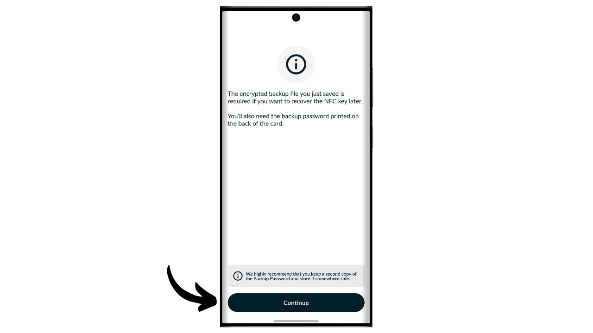
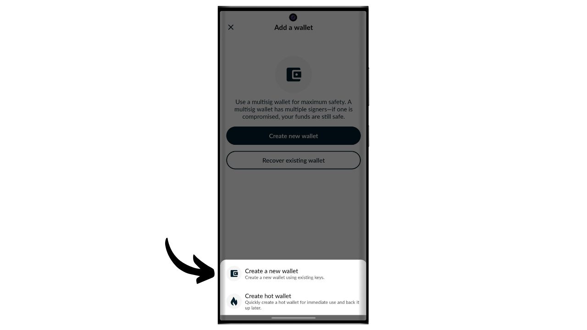
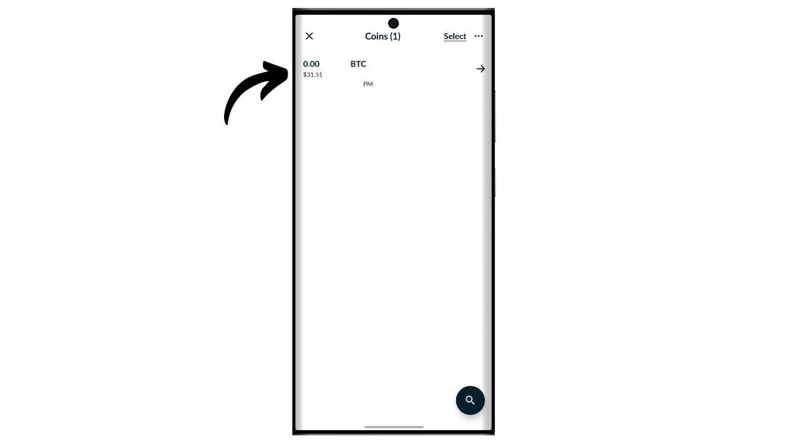
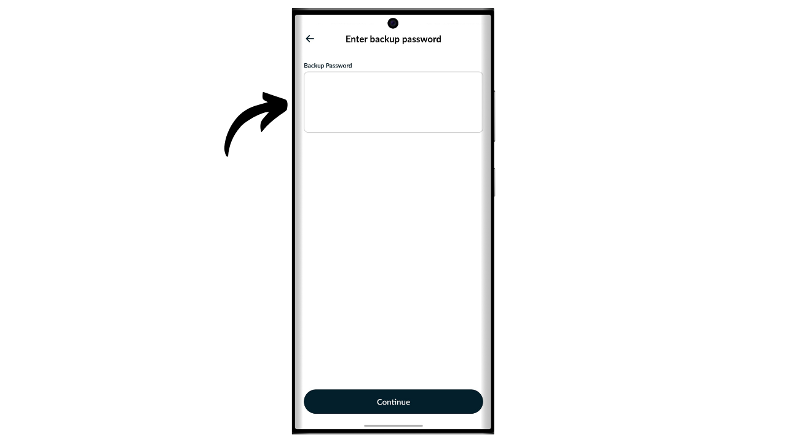

A hardware wallet is an electronic device dedicated to the management and security of a Bitcoin wallet's private keys. Unlike software wallets (or hot wallets) installed on general-purpose machines often connected to the Internet, hardware wallets allow for the physical isolation of private keys, reducing the risks of hacking and theft.

The main goal of a hardware wallet is to minimize the device's functionalities to reduce its attack surface. A smaller attack surface also means fewer potential attack vectors, i.e., fewer weak points in the system that attackers could exploit to access the bitcoins.

It is recommended to use a hardware wallet to secure your bitcoins, especially if you hold significant amounts, whether in absolute value or as a proportion of your total assets.

Hardware wallets are used in combination with a wallet management software on a computer or smartphone. This software manages the creation of transactions, but the cryptographic signature necessary to validate these transactions is done solely within the hardware wallet. This means that the private keys are never exposed to a potentially vulnerable environment.

Hardware wallets offer dual protection for the user: on one hand, they secure your bitcoins against remote attacks by keeping the private keys offline, and on the other hand, they generally offer better physical resistance against attempts to extract the keys. And it is precisely on these 2 security criteria that one can judge and rank the different models available on the market.

In this tutorial, I propose to discover one of these solutions: the Tapsigner by Coinkite.

## Introduction to the Tapsigner

The Tapsigner is a hardware wallet designed in the form of an NFC card by the company Coinkite, also known for producing Coldcards.

The Tapsigner allows for the storage of a pair consisting of a master private key and a chain code in accordance with BIP32, to derive a tree of cryptographic keys. These keys can be used to sign transactions by positioning the Tapsigner against a phone or an NFC card reader.
This NFC card is sold for $19.99, which is very affordable compared to other hardware wallets available on the market. However, due to its format, the Tapsigner does not offer as many options as other devices. There is obviously no battery, no camera, nor a micro SD card reader, as it is a card. In my opinion, its biggest drawback is the lack of a screen on the hardware wallet, which makes it more vulnerable to certain types of remote attacks. Indeed, this forces the user to sign blindly and to trust what they see on their computer screen.

Despite its limitations, the Tapsigner can be interesting because of its reduced price. This wallet can notably be used to enhance the security of a spending wallet in addition to a savings wallet protected by a hardware wallet equipped with a screen. It also represents a good solution for those who hold small amounts of bitcoins and do not wish to invest a hundred euros in a more sophisticated device. Moreover, the use of Tapsigner in multisig configurations, or potentially in wallet systems with timelock in the future, can offer interesting benefits.

## How to buy a Tapsigner?

The Tapsigner is available for purchase [on the official Coinkite website](https://store.coinkite.com/store/category/tapsigner). To buy it in a physical store, you can also find [the list of certified resellers](https://coinkite.com/resellers) on the site.

You will also need a phone compatible with NFC communications, or a USB device to read NFC cards at the standard frequency of 13.56 MHz.

## How to initialize a Tapsigner with Nunchuk?

Once you have received your Tapsigner, the first step is to examine the packaging to ensure it has not been opened. If the package is damaged, it could indicate that the card has been compromised and might not be authentic. CoinKite will deliver your Tapsigner with a case that blocks radio waves. Make sure it is present in your package.

To manage the wallet, we will use the **Nunchuk Wallet** mobile app. Ensure your smartphone is NFC compatible, then download Nunchuk from the [Google Play Store](https://play.google.com/store/apps/details?id=io.nunchuk.android), the [App Store](https://apps.apple.com/us/app/nunchuk-bitcoin-wallet/id1563190073) or directly via its [`.apk` file](https://github.com/nunchuk-io/nunchuk-android/releases).

If you're using Nunchuk for the first time, the app will prompt you to create an account. For the purposes of this tutorial, it's not necessary to create one. So, select "*Continue as guest*" to proceed without an account.

Then click on "*Unassisted wallet*".

Next, click on the "*I'll explore on my own*" button.

Once in Nunchuk, click on the "*+*" button next to the "*Keys*" tab.

Choose "*Add NFC key*".

Then click on "*Add TAPSIGNER*".

Click on "*Continue*" and then place your Tapsigner NFC card against your smartphone.

If your Tapsigner is new, Nunchuk will offer to initialize it. Click on "*Yes*".

You will now need to choose how you generate your master chain code.

The Tapsigner uses the BIP32 standard. This means that the derivation of your cryptographic keys that secure your bitcoins does not rely on a mnemonic phrase like BIP39 wallets, but directly on the master private key and the master chain code. These 2 elements are passed through the HMAC function to deterministically and hierarchically derive the rest of your wallet.

The master private key is generated directly by the TRNG (*True Random Number Generator*) integrated into your Tapsigner. The master chain code, on the other hand, must be provided from the outside. At this step, you have a choice: let Nunchuk generate it automatically by clicking on "*Automatic*", or generate it yourself by selecting "*Advanced*" and entering it in the provided field.

Next, you need to choose a PIN code. In the "*Starting PIN*" area, enter the PIN code written on the back of your Tapsigner.

Choose a PIN code to secure physical access to your Tapsigner. This PIN code plays no role in the wallet recovery process. Its sole function is to unlock your Tapsigner to sign transactions. Make sure to save this PIN code to avoid forgetting it. Click on "*Continue*" to proceed.

Place your Tapsigner card at the back of your phone now to initialize it.

Nunchuk will then generate the recovery file for your wallet, which allows you to regain access to your bitcoins in case you lose your NFC card. This file is encrypted with the backup code written on the back of your Tapsigner. To recover your bitcoins, you will absolutely need this file as well as the code to decrypt it. It is therefore important to make a paper copy of this code, because if you lose your NFC card, access to this code will also be lost, since it is only written on the card for now. Make sure to also create several backups of your encrypted recovery file.

Choose a name for your wallet.

The foundation of your wallet is now set up. To verify the authenticity of your Tapsigner, at any time, you can click on the "*Run health check*" button.

Enter your PIN.

Then place your card at the back of your phone.

## How to create a wallet on a Tapsigner?

Back on the Nunchuk homepage, you can see that your Tapsigner is registered in the available signing devices.

You will now need to generate the keys for your Bitcoin wallet. To do this, click on the "*+*" button to the right of the "*Wallets*" tab.

Click on "*Create new wallet*".

Then choose the option "*Create a new wallet using existing keys*".

Choose a name for your wallet and then click on "*Continue*".

Select your Tapsigner as the signing device for this new set of keys, then click on "*Continue*".

If everything is to your satisfaction, confirm the creation.

You can then save the configuration file of your wallet. This file contains exclusively your public keys, which means that even if someone accesses it, they cannot steal your bitcoins. However, they can follow all your transactions. Therefore, this file only presents a risk to your privacy. In some cases, it may be essential for recovering your wallet.

And there you have it, your wallet is successfully created!

When you are not using your Tapsigner, remember to store it in the case provided by Coinkite, which blocks radio waves to protect against unauthorized readings.

## How to receive bitcoins on the Tapsigner?

To receive bitcoins, click on your wallet.

Then use the generated address to receive bitcoins. If you have previously received bitcoins on this wallet, you will need to click on the "*Receive*" button to generate a new blank receiving address.

Once the sender's transaction is broadcast, you will see it appear on your wallet.

Click on "*View coins*".

Select your new UTXO.

Click on the "*+*" next to "*Tags*" to add a label to your UTXO. This is a good practice, as it helps you remember the origin of your coins and optimize your privacy for future spending.

Select an existing tag or create a new one, then click on "*Save*". You also have the option to create "*collections*" to organize your coins in a more structured manner.

## How to send bitcoins with the Tapsigner?

Now that you have bitcoins in your wallet, you can also send them. To do this, click on the wallet of your choice.

Click on the "*Send*" button.

Select the amount to send, then click on "*Continue*".

Add a "*note*" to your future transaction to remember its purpose.

Next, manually enter the recipient's address in the designated field.

You can also scan a QR code encoded address by clicking on the icon located at the top right of the screen.

Click on the "*Create Transaction*" button.

Verify the details of your transaction, then click on the "*Sign*" button next to your Tapsigner.

Enter your PIN to unlock it.

Then place the Tapsigner at the back of your smartphone.

Your transaction is now signed. Check one last time that everything is correct, then click on "*Broadcast Transaction*" to broadcast it on the Bitcoin network.

Your transaction is now awaiting confirmation.

## How to recover the wallet in case of loss of the Tapsigner?

If you have lost your Tapsigner, you can recover your wallet using the code noted on the back of the card. It is therefore important to save this code separately from the Tapsigner, because if the card is lost, access to this code will also be lost. You will also need the encrypted backup of the wallet.

For recovery, we will use the Nunchuk app, but keep in mind that this means temporarily securing your funds in a hot wallet. If your Tapsigner was securing significant amounts, consider following the same recovery process with a new Coldcard instead.

Open the Nunchuk app and click on the "*+*" button next to the "*Keys*" tab.

Choose "*Add NFC key*".

Choose the option "*Recover TAPSIGNER key from backup*".

You are then redirected to your device's file explorer. Locate and select the encrypted backup file of your wallet. Normally, the name of this file starts with `backup...`.

Enter the password that decrypts the backup file. This password corresponds to the one initially noted on the back of your Tapsigner.

Then choose a name for your recovery wallet.

You have now regained access to your bitcoins. Your wallet is now managed as a hot wallet visible in the "*Keys*" tab of the Nunchuk app. Next, you need to create a new set of cryptographic keys in the "*Wallets*" section by associating this key with it. To do this, you can follow the steps again in the "*How to create a wallet on a Tapsigner?*" part of this tutorial.

If you have lost your Tapsigner, I strongly advise you to immediately transfer your bitcoins to another wallet you own, ideally protected by a hardware wallet. Indeed, the Tapsigner you lost could potentially be in the wrong hands. It is therefore important to empty the wallet you have just recovered and to stop using it.

Congratulations, you are now up to speed on using the Tapsigner! If you found this tutorial helpful, I would appreciate it if you could leave a thumbs up below. Feel free to share this article on your social networks. Thank you very much!