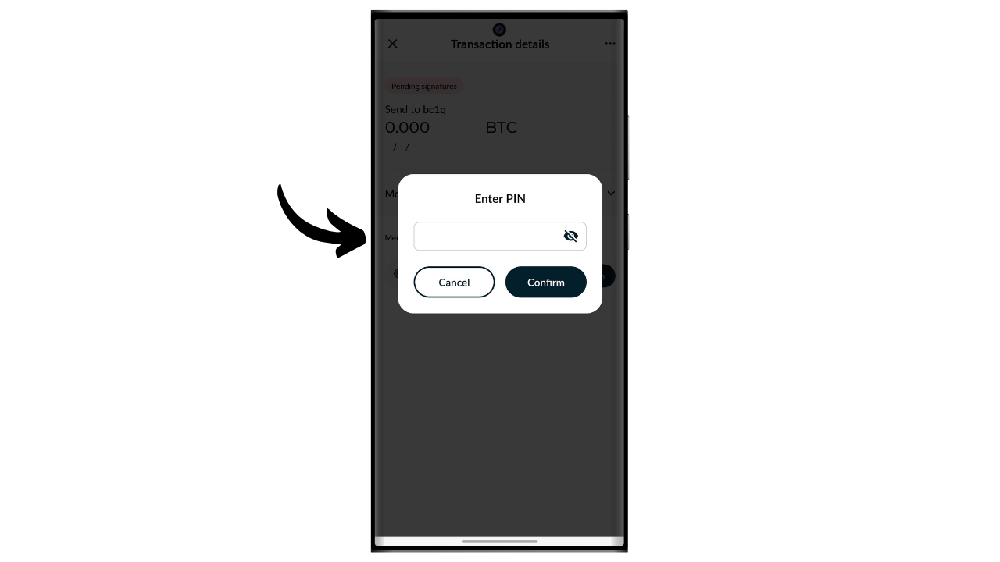

Una cartera de hardware es un dispositivo electrónico dedicado a la gestión y seguridad de las claves privadas de una cartera de Bitcoin. A diferencia de las carteras de software (o carteras calientes) instaladas en máquinas de propósito general a menudo conectadas a Internet, las carteras de hardware permiten el aislamiento físico de las claves privadas, reduciendo los riesgos de hackeo y robo.

El objetivo principal de una cartera de hardware es minimizar las funcionalidades del dispositivo para reducir su superficie de ataque. Una superficie de ataque más pequeña también significa menos vectores de ataque potenciales, es decir, menos puntos débiles en el sistema que los atacantes podrían explotar para acceder a los bitcoins.

Se recomienda usar una cartera de hardware para asegurar tus bitcoins, especialmente si posees cantidades significativas, ya sea en valor absoluto o como proporción de tus activos totales.

Las carteras de hardware se utilizan en combinación con un software de gestión de carteras en una computadora o smartphone. Este software gestiona la creación de transacciones, pero la firma criptográfica necesaria para validar estas transacciones se realiza únicamente dentro de la cartera de hardware. Esto significa que las claves privadas nunca están expuestas a un entorno potencialmente vulnerable.

Las carteras de hardware ofrecen una doble protección para el usuario: por un lado, aseguran tus bitcoins contra ataques remotos manteniendo las claves privadas fuera de línea, y por otro lado, generalmente ofrecen una mejor resistencia física contra intentos de extraer las claves. Y es precisamente en estos 2 criterios de seguridad en los que se puede juzgar y clasificar los diferentes modelos disponibles en el mercado.

En este tutorial, propongo descubrir una de estas soluciones: el Tapsigner de Coinkite.

## Introducción al Tapsigner

El Tapsigner es una cartera de hardware diseñada en forma de tarjeta NFC por la compañía Coinkite, también conocida por producir Coldcards.

El Tapsigner permite el almacenamiento de un par que consiste en una clave privada maestra y un código de cadena de acuerdo con BIP32, para derivar un árbol de claves criptográficas. Estas claves se pueden utilizar para firmar transacciones posicionando el Tapsigner contra un teléfono o un lector de tarjetas NFC.
Esta tarjeta NFC se vende por $19.99, lo cual es muy asequible en comparación con otras carteras de hardware disponibles en el mercado. Sin embargo, debido a su formato, el Tapsigner no ofrece tantas opciones como otros dispositivos. Obviamente, no hay batería, ni cámara, ni lector de tarjetas micro SD, ya que es una tarjeta. En mi opinión, su mayor desventaja es la falta de una pantalla en la cartera de hardware, lo que la hace más vulnerable a ciertos tipos de ataques remotos. De hecho, esto obliga al usuario a firmar a ciegas y a confiar en lo que ve en la pantalla de su computadora.

A pesar de sus limitaciones, el Tapsigner puede ser interesante debido a su precio reducido. Esta cartera puede ser usada notablemente para mejorar la seguridad de una cartera de gastos además de una cartera de ahorros protegida por una cartera de hardware equipada con pantalla. También representa una buena solución para aquellos que poseen pequeñas cantidades de bitcoins y no desean invertir cien euros en un dispositivo más sofisticado. Además, el uso de Tapsigner en configuraciones multisig, o potencialmente en sistemas de carteras con timelock en el futuro, puede ofrecer beneficios interesantes.

## ¿Cómo comprar un Tapsigner?

El Tapsigner está disponible para su compra [en el sitio oficial de Coinkite](https://store.coinkite.com/store/category/tapsigner). Para comprarlo en una tienda física, también puedes encontrar [la lista de revendedores certificados](https://coinkite.com/resellers) en el sitio.
También necesitarás un teléfono compatible con comunicaciones NFC, o un dispositivo USB para leer tarjetas NFC a la frecuencia estándar de 13.56 MHz.
## ¿Cómo inicializar un Tapsigner con Nunchuk?

Una vez que hayas recibido tu Tapsigner, el primer paso es examinar el empaque para asegurarte de que no haya sido abierto. Si el paquete está dañado, podría indicar que la tarjeta ha sido comprometida y podría no ser auténtica. CoinKite entregará tu Tapsigner con una funda que bloquea las ondas de radio. Asegúrate de que esté presente en tu paquete.

Para gestionar la billetera, utilizaremos la aplicación móvil **Nunchuk Wallet**. Asegúrate de que tu smartphone sea compatible con NFC, luego descarga Nunchuk desde [Google Play Store](https://play.google.com/store/apps/details?id=io.nunchuk.android), la [App Store](https://apps.apple.com/us/app/nunchuk-bitcoin-wallet/id1563190073) o directamente a través de su archivo [`.apk`](https://github.com/nunchuk-io/nunchuk-android/releases).

Si estás usando Nunchuk por primera vez, la aplicación te pedirá que crees una cuenta. Para los propósitos de este tutorial, no es necesario crear una. Por lo tanto, selecciona "*Continuar como invitado*" para proceder sin una cuenta.

Luego haz clic en "*Billetera sin asistencia*".

A continuación, haz clic en el botón "*Exploraré por mi cuenta*".

Una vez en Nunchuk, haz clic en el botón "*+*" junto a la pestaña "*Claves*".

Elige "*Agregar clave NFC*".

Luego haz clic en "*Agregar TAPSIGNER*".

Haz clic en "*Continuar*" y luego coloca tu tarjeta NFC Tapsigner contra tu smartphone.

Si tu Tapsigner es nuevo, Nunchuk ofrecerá inicializarlo. Haz clic en "*Sí*".

Ahora necesitarás elegir cómo generas tu código de cadena maestro.

El Tapsigner utiliza el estándar BIP32. Esto significa que la derivación de tus claves criptográficas que aseguran tus bitcoins no depende de una frase mnemotécnica como las billeteras BIP39, sino directamente de la clave privada maestra y el código de cadena maestro. Estos 2 elementos se pasan a través de la función HMAC para derivar de manera determinista y jerárquica el resto de tu billetera.

La clave privada maestra es generada directamente por el TRNG (*Generador de Números Aleatorios Verdaderos*) integrado en tu Tapsigner. El código de cadena maestro, por otro lado, debe ser proporcionado desde el exterior. En este paso, tienes una elección: dejar que Nunchuk lo genere automáticamente haciendo clic en "*Automático*", o generarlo tú mismo seleccionando "*Avanzado*" e ingresándolo en el campo proporcionado.

A continuación, necesitas elegir un código PIN. En el área de "*PIN de inicio*", introduce el código PIN escrito en la parte trasera de tu Tapsigner.

Elige un código PIN para asegurar el acceso físico a tu Tapsigner. Este código PIN no juega ningún papel en el proceso de recuperación de la cartera. Su única función es desbloquear tu Tapsigner para firmar transacciones. Asegúrate de guardar este código PIN para evitar olvidarlo. Haz clic en "*Continuar*" para proceder.

Coloca tu tarjeta Tapsigner en la parte trasera de tu teléfono ahora para inicializarla.

Nunchuk generará entonces el archivo de recuperación para tu cartera, lo que te permite recuperar el acceso a tus bitcoins en caso de que pierdas tu tarjeta NFC. Este archivo está cifrado con el código de respaldo escrito en la parte trasera de tu Tapsigner. Para recuperar tus bitcoins, necesitarás absolutamente este archivo así como el código para descifrarlo. Por lo tanto, es importante hacer una copia en papel de este código, porque si pierdes tu tarjeta NFC, el acceso a este código también se perderá, ya que por ahora solo está escrito en la tarjeta. Asegúrate de también crear varias copias de seguridad de tu archivo de recuperación cifrado.

Elige un nombre para tu cartera.

La base de tu cartera ahora está configurada. Para verificar la autenticidad de tu Tapsigner, en cualquier momento, puedes hacer clic en el botón "*Ejecutar chequeo de salud*".

Introduce tu PIN.

Luego coloca tu tarjeta en la parte trasera de tu teléfono.

## ¿Cómo crear una cartera en un Tapsigner?

De vuelta en la página de inicio de Nunchuk, puedes ver que tu Tapsigner está registrado en los dispositivos de firma disponibles.

Ahora necesitarás generar las claves para tu cartera de Bitcoin. Para hacer esto, haz clic en el botón "*+*" a la derecha de la pestaña "*Carteras*".

Haz clic en "*Crear nueva cartera*".

Luego elige la opción "*Crear una nueva cartera usando claves existentes*".

Elige un nombre para tu cartera y luego haz clic en "*Continuar*".

Selecciona tu Tapsigner como el dispositivo de firma para este nuevo conjunto de claves, luego haz clic en "*Continuar*".

Si todo es de tu satisfacción, confirma la creación.

Luego puedes guardar el archivo de configuración de tu billetera. Este archivo contiene exclusivamente tus claves públicas, lo que significa que incluso si alguien accede a él, no pueden robar tus bitcoins. Sin embargo, pueden seguir todas tus transacciones. Por lo tanto, este archivo solo presenta un riesgo para tu privacidad. En algunos casos, puede ser esencial para recuperar tu billetera.

¡Y ahí lo tienes, tu billetera ha sido creada con éxito!

Cuando no estés usando tu Tapsigner, recuerda guardarlo en la funda proporcionada por Coinkite, que bloquea las ondas de radio para proteger contra lecturas no autorizadas.

## ¿Cómo recibir bitcoins en el Tapsigner?

Para recibir bitcoins, haz clic en tu billetera.

Luego usa la dirección generada para recibir bitcoins. Si ya has recibido bitcoins en esta billetera, necesitarás hacer clic en el botón "*Recibir*" para generar una nueva dirección de recepción en blanco.

Una vez que la transacción del remitente se haya transmitido, la verás aparecer en tu billetera.

Haz clic en "*Ver monedas*".

Selecciona tu nuevo UTXO.

Haz clic en el "*+*" junto a "*Etiquetas*" para agregar una etiqueta a tu UTXO. Esta es una buena práctica, ya que te ayuda a recordar el origen de tus monedas y optimizar tu privacidad para futuros gastos.

Selecciona una etiqueta existente o crea una nueva, luego haz clic en "*Guardar*". También tienes la opción de crear "*colecciones*" para organizar tus monedas de manera más estructurada.

## ¿Cómo enviar bitcoins con el Tapsigner?

Ahora que tienes bitcoins en tu billetera, también puedes enviarlos. Para hacerlo, haz clic en la billetera de tu elección.

Haz clic en el botón "*Enviar*".

Selecciona la cantidad a enviar, luego haz clic en "*Continuar*".

Agrega una "*nota*" a tu futura transacción para recordar su propósito.

A continuación, ingresa manualmente la dirección del destinatario en el campo designado.

También puedes escanear una dirección codificada en un código QR haciendo clic en el icono ubicado en la parte superior derecha de la pantalla.

Haz clic en el botón "*Crear Transacción*".

Verifica los detalles de tu transacción, luego haz clic en el botón "*Firmar*" junto a tu Tapsigner.

Ingresa tu PIN para desbloquearlo.

Luego coloca el Tapsigner en la parte trasera de tu smartphone.

Tu transacción ahora está firmada. Revisa una última vez que todo esté correcto, luego haz clic en "*Broadcast Transaction*" para transmitirla en la red de Bitcoin.

Tu transacción ahora está esperando confirmación.

## Cómo recuperar la billetera en caso de pérdida del Tapsigner?

Si has perdido tu Tapsigner, puedes recuperar tu billetera utilizando el código anotado en la parte trasera de la tarjeta. Por lo tanto, es importante guardar este código por separado del Tapsigner, porque si se pierde la tarjeta, también se perderá el acceso a este código. También necesitarás la copia de seguridad cifrada de la billetera.

Para la recuperación, utilizaremos la aplicación Nunchuk, pero ten en cuenta que esto significa asegurar temporalmente tus fondos en una billetera caliente (hot wallet). Si tu Tapsigner estaba asegurando cantidades significativas, considera seguir el mismo proceso de recuperación con una nueva Coldcard en su lugar.

Abre la aplicación Nunchuk y haz clic en el botón "*+*" al lado de la pestaña "*Keys*".

Elige "*Add NFC key*".

Elige la opción "*Recover TAPSIGNER key from backup*".

Luego serás redirigido al explorador de archivos de tu dispositivo. Localiza y selecciona el archivo de copia de seguridad cifrado de tu billetera. Normalmente, el nombre de este archivo comienza con `backup...`.

Ingresa la contraseña que descifra el archivo de copia de seguridad. Esta contraseña corresponde a la que inicialmente se anotó en la parte trasera de tu Tapsigner.

Luego elige un nombre para tu billetera de recuperación.

Ahora has recuperado el acceso a tus bitcoins. Tu billetera ahora se gestiona como una billetera caliente visible en la pestaña "*Keys*" de la aplicación Nunchuk. A continuación, necesitas crear un nuevo conjunto de claves criptográficas en la sección "*Wallets*" asociando esta clave con ella. Para hacer esto, puedes seguir los pasos nuevamente en la parte "*How to create a wallet on a Tapsigner?*" de este tutorial.

Si has perdido tu Tapsigner, te aconsejo encarecidamente que transfieras inmediatamente tus bitcoins a otra billetera que poseas, idealmente protegida por un monedero hardware. De hecho, el Tapsigner que perdiste podría potencialmente estar en manos equivocadas. Por lo tanto, es importante vaciar la billetera que acabas de recuperar y dejar de usarla.

¡Felicidades, ahora estás al día sobre cómo usar el Tapsigner! Si encontraste útil este tutorial, te agradecería si pudieras dejar un pulgar hacia arriba abajo. No dudes en compartir este artículo en tus redes sociales. ¡Muchas gracias!