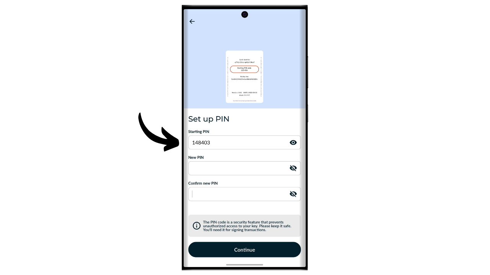
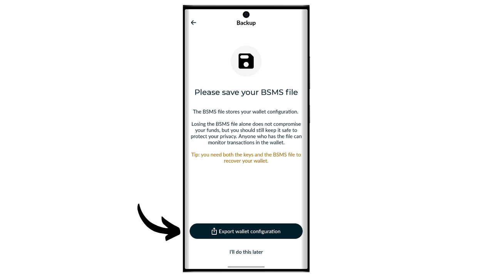
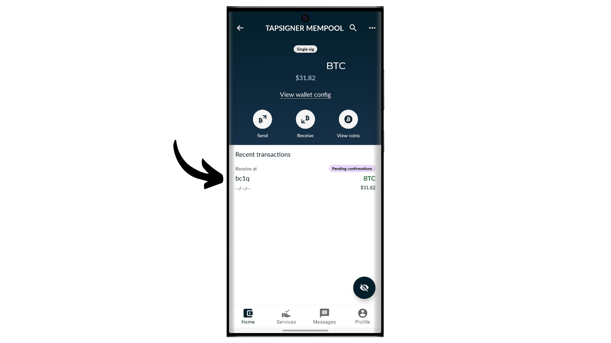
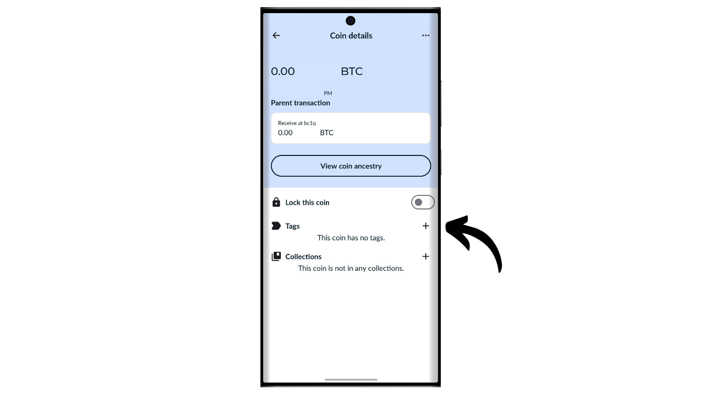
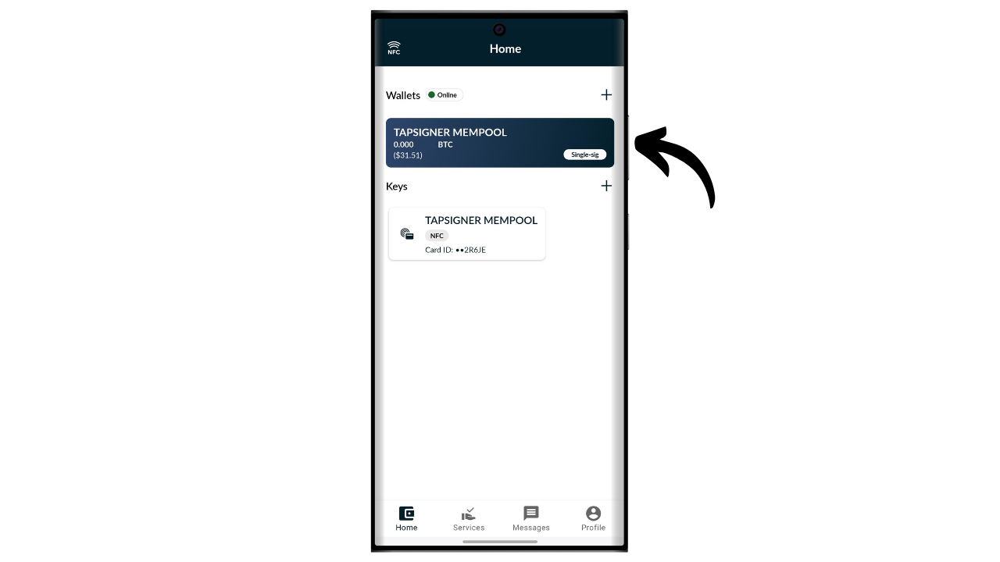
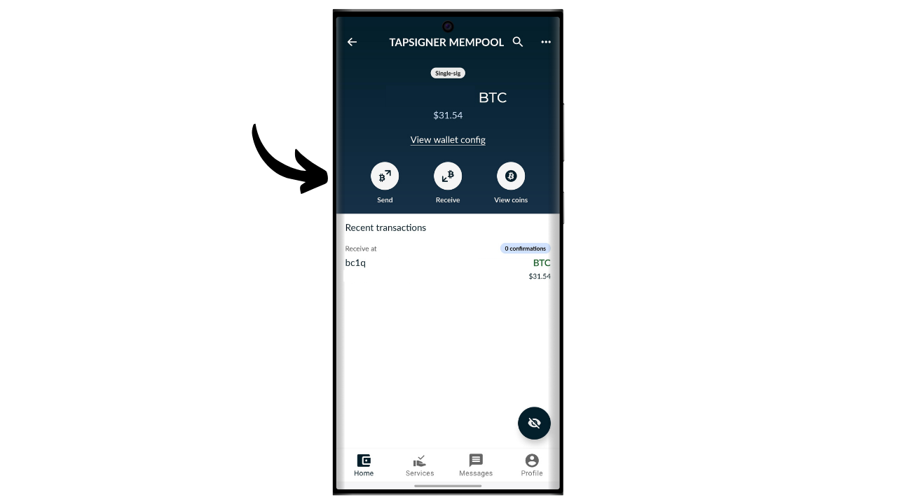
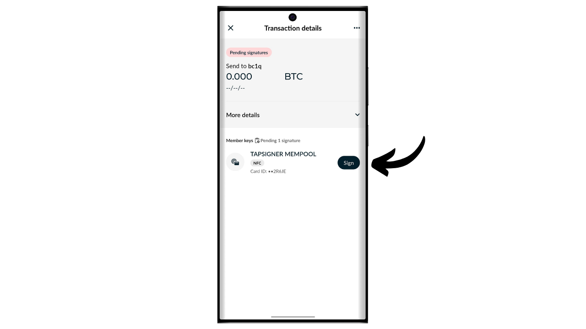
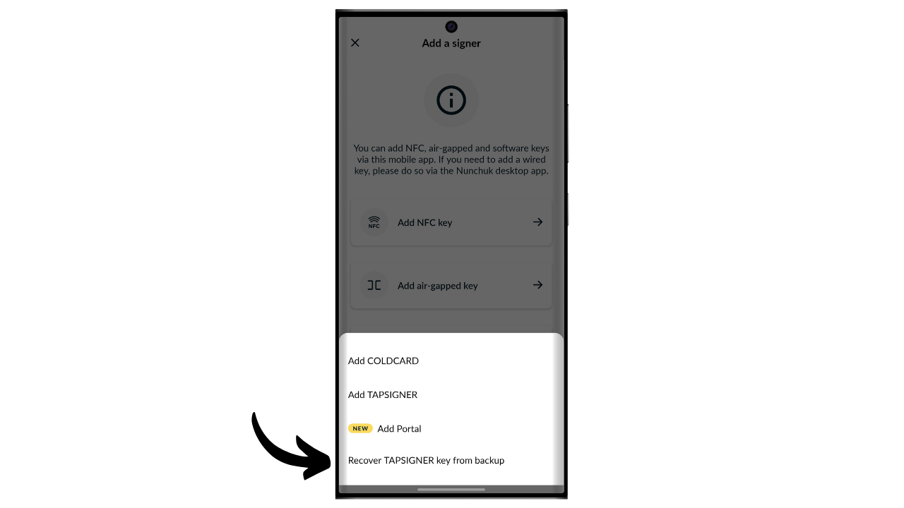

Riistvara rahakott on elektrooniline seade, mis on pühendatud Bitcoin'i rahakoti privaatvõtmete haldamisele ja turvalisusele. Erinevalt tarkvaralistest rahakottidest (või kuumadest rahakottidest), mis on paigaldatud üldotstarbelistele masinatele, mis on sageli ühendatud Internetiga, võimaldavad riistvara rahakotid privaatvõtmete füüsilist isoleerimist, vähendades häkkimise ja varguse riske.

Riistvara rahakoti peamine eesmärk on vähendada seadme funktsionaalsusi, et vähendada selle rünnakupinda. Väiksem rünnakupind tähendab ka vähem potentsiaalseid rünnakute vektoreid, st vähem süsteemi nõrku kohti, mida ründajad võiksid ära kasutada bitcoini juurdepääsuks.

On soovitatav kasutada riistvara rahakotti oma bitcoinide turvamiseks, eriti kui omate olulisi summasid, kas absoluutväärtuses või kui osa teie koguvarast.

Riistvara rahakotte kasutatakse koos rahakoti haldamise tarkvaraga arvutis või nutitelefonis. See tarkvara haldab tehingute loomist, kuid tehingute valideerimiseks vajalik krüptograafiline allkiri tehakse ainult riistvara rahakotis. See tähendab, et privaatvõtmed ei ole kunagi potentsiaalselt haavatavas keskkonnas paljastatud.

Riistvara rahakotid pakuvad kasutajale kahekordset kaitset: ühelt poolt kaitsevad nad teie bitcoine kaugrünnakute eest, hoides privaatvõtmeid võrguühenduseta, ja teiselt poolt pakuvad nad üldiselt paremat füüsilist vastupanu võtmete kättesaamise katsetele. Ja just nendel 2 turvakriteeriumil saab hinnata ja järjestada turul saadaolevaid erinevaid mudeleid.

Selles õpetuses pakun avastada ühte neist lahendustest: Tapsigner Coinkitelt.

## Tapsigneri tutvustus

Tapsigner on riistvara rahakott, mis on kujundatud NFC-kaardi vormis ettevõtte Coinkite poolt, mis on tuntud ka Coldcardide tootmise poolest.

Tapsigner võimaldab salvestada paari, mis koosneb peamisest privaatvõtmest ja ahelakoodist vastavalt BIP32-le, et tuletada krüptograafiliste võtmete puu. Neid võtmeid saab kasutada tehingute allkirjastamiseks, asetades Tapsigneri telefoni või NFC-kaardilugeja vastu.
See NFC-kaart müüakse hinnaga $19.99, mis on väga soodne võrreldes teiste turul saadaolevate riistvara rahakottidega. Siiski, oma formaadi tõttu ei paku Tapsigner nii palju võimalusi kui teised seadmed. Ilmselgelt ei ole sel akut, kaamerat ega mikro SD-kaardilugejat, kuna see on kaart. Minu arvates on selle suurim puudus riistvara rahakotil ekraani puudumine, mis muudab selle teatud tüüpi kaugrünnakute suhtes haavatavamaks. Tõepoolest, see sunnib kasutajat pimesi allkirjastama ja usaldama seda, mida nad oma arvutiekraanil näevad.

Hoolimata oma piirangutest võib Tapsigner olla huvitav oma madala hinna tõttu. See rahakott võib eriti olla kasulik kulutamise rahakoti turvalisuse suurendamiseks lisaks säästmise rahakotile, mida kaitseb ekraaniga varustatud riistvara rahakott. See esindab ka head lahendust neile, kes hoiavad väikeseid bitcoini summasid ja ei soovi investeerida sadu eurosid keerukamasse seadmesse. Lisaks võib Tapsigneri kasutamine multisig konfiguratsioonides või potentsiaalselt tulevikus ajalukuga rahakottide süsteemides pakkuda huvitavaid eeliseid.

## Kuidas osta Tapsignerit?

Tapsigneri saab osta [ametlikul Coinkite veebisaidil](https://store.coinkite.com/store/category/tapsigner). Selle füüsilises poes ostmiseks leiate [sertifitseeritud edasimüüjate loendi](https://coinkite.com/resellers) samuti saidilt.
Teil on samuti vaja telefoni, mis ühildub NFC suhtlusega, või USB seadet NFC kaartide lugemiseks standardse sagedusega 13,56 MHz juures.
## Kuidas seadistada Tapsignerit Nunchukiga?

Kui olete oma Tapsigneri kätte saanud, on esimene samm pakendi üle vaatamine, et veenduda, et seda ei ole avatud. Kui pakend on kahjustatud, võib see viidata, et kaart on kompromiteeritud ja ei pruugi olla autentne. CoinKite toimetab teie Tapsigneri kohale raadiolainete eest kaitsevas ümbrises. Veenduge, et see on teie pakendis olemas.

Rahakoti haldamiseks kasutame **Nunchuk Wallet** mobiilirakendust. Veenduge, et teie nutitelefon ühildub NFC-ga, seejärel laadige Nunchuk alla [Google Play poest](https://play.google.com/store/apps/details?id=io.nunchuk.android), [App Store'ist](https://apps.apple.com/us/app/nunchuk-bitcoin-wallet/id1563190073) või otse selle [`.apk` failist](https://github.com/nunchuk-io/nunchuk-android/releases).

Kui kasutate Nunchukit esimest korda, palub rakendus teil luua konto. Selle juhendi eesmärgil pole konto loomine vajalik. Seega valige "*Jätka külalisena*", et jätkata ilma kontota.

Seejärel klõpsake "*Abistamata rahakott*".

Järgmisena klõpsake nuppu "*Uurin ise*".

Nunchukis olles klõpsake "*+*" nuppu kõrval vahekaardil "*Võtmed*".

Valige "*Lisa NFC võti*".

Seejärel klõpsake "*Lisa TAPSIGNER*".

Klõpsake "*Jätka*" ja seejärel asetage oma Tapsigneri NFC kaart oma nutitelefoni vastu.

Kui teie Tapsigner on uus, pakub Nunchuk seda seadistada. Klõpsake "*Jah*".

Nüüd peate valima, kuidas genereerite oma peamise ahelakoodi.

Tapsigner kasutab BIP32 standardit. See tähendab, et teie krüptograafiliste võtmete tuletamine, mis kaitsevad teie bitcoine, ei sõltu mnemoonilisest fraasist nagu BIP39 rahakotid, vaid otse peamisest privaatvõtmest ja peamisest ahelakoodist. Need 2 elementi läbivad HMAC funktsiooni, et deterministlikult ja hierarhiliselt tuletada ülejäänud rahakott.

Peamine privaatvõti genereeritakse otse teie Tapsigneri integreeritud TRNG (*True Random Number Generator*) poolt. Peamine ahelakood seevastu tuleb väljastpoolt pakkuda. Selles etapis on teil valik: lasta Nunchukil see automaatselt genereerida, klõpsates "*Automaatne*", või genereerida see ise, valides "*Täpsem*" ja sisestades selle ettenähtud väljale.

Järgmisena peate valima PIN-koodi. Alas "*Starting PIN*" sisestage PIN-kood, mis on kirjutatud teie Tapsigneri tagaküljele.

Valige PIN-kood, et tagada füüsiline juurdepääs teie Tapsignerile. See PIN-kood ei mängi rolli rahakoti taastamise protsessis. Selle ainus funktsioon on lubada teie Tapsigneril tehinguid allkirjastada. Veenduge, et salvestate selle PIN-koodi, et vältida selle unustamist. Jätkamiseks klõpsake nupul "*Continue*".

Asetage oma Tapsigneri kaart nüüd telefoni tagaküljele, et see initsialiseerida.

Seejärel genereerib Nunchuk teie rahakoti taastefaili, mis võimaldab teil oma bitcoine taastada, kui kaotate oma NFC-kaardi. See fail on krüpteeritud varukoodiga, mis on kirjutatud teie Tapsigneri tagaküljele. Oma bitcoinide taastamiseks on teil hädavajalik see fail ning kood selle dekrüpteerimiseks. Seetõttu on oluline teha sellest koodist paberkoopia, sest kui kaotate oma NFC-kaardi, kaotate ka juurdepääsu sellele koodile, kuna praegu on see kirjutatud ainult kaardile. Veenduge, et loote ka mitu varukoopiat oma krüpteeritud taastefailist.

Valige oma rahakotile nimi.

Teie rahakoti alus on nüüd seadistatud. Tapsigneri autentsuse kontrollimiseks võite igal ajal klõpsata nupul "*Run health check*".

Sisestage oma PIN.

Seejärel asetage oma kaart telefoni tagaküljele.

## Kuidas luua rahakotti Tapsigneril?

Tagasi Nunchuki avalehel näete, et teie Tapsigner on registreeritud saadaolevate allkirjastamisseadmete hulgas.

Nüüd peate genereerima võtmed oma Bitcoin rahakotile. Selleks klõpsake nupul "*+*", mis asub vahekaardi "*Wallets*" paremal pool.

Klõpsake nupul "*Create new wallet*".

Seejärel valige võimalus "*Create a new wallet using existing keys*".

Valige oma rahakotile nimi ja seejärel klõpsake nupul "*Continue*".

Valige oma Tapsigner selle uue võtmekomplekti allkirjastamisseadmeks, seejärel klõpsake nupul "*Continue*".

Kui kõik on teie rahuloluks, kinnitage loomine.

Siis saate oma rahakoti konfiguratsioonifaili salvestada. See fail sisaldab ainult teie avalikke võtmeid, mis tähendab, et isegi kui keegi sellele juurde pääseb, ei saa nad teie bitcoine varastada. Siiski, nad saavad jälgida kõiki teie tehinguid. Seetõttu kujutab see fail endast ohtu ainult teie privaatsusele. Mõnel juhul võib see olla oluline teie rahakoti taastamiseks.

Ja ongi kõik, teie rahakott on edukalt loodud!

Kui te ei kasuta oma Tapsignerit, pidage meeles seda hoida Coinkite'i poolt pakutavas ümbrises, mis blokeerib raadiolaineid, et kaitsta volitamata lugemiste eest.

## Kuidas vastu võtta bitcoine Tapsigneriga?

Bitcoinide vastuvõtmiseks klõpsake oma rahakotil.

Seejärel kasutage genereeritud aadressi bitcoinide vastuvõtmiseks. Kui olete varem sellel rahakotil bitcoine vastu võtnud, peate klõpsama nupul "*Receive*" uue tühja vastuvõtu aadressi genereerimiseks.

Kui saatja tehing on edastatud, näete seda ilmumas oma rahakotis.

Klõpsake nupul "*View coins*".

Valige oma uus UTXO.

Klõpsake nupul "*+*" kõrval "*Tags*", et lisada oma UTXO-le silt. See on hea tava, kuna see aitab teil mäletada oma müntide päritolu ja optimeerida oma privaatsust tulevaste kulutuste jaoks.

Valige olemasolev silt või looge uus, seejärel klõpsake nupul "*Save*". Teil on ka võimalus luua "*collections*" oma müntide korraldamiseks struktureeritumal viisil.

## Kuidas saata bitcoine Tapsigneriga?

Nüüd, kui teil on oma rahakotis bitcoine, saate neid ka saata. Selleks klõpsake valitud rahakotil.

Klõpsake nupul "*Send*".

Valige saatmise summa, seejärel klõpsake nupul "*Continue*".

Lisage oma tulevasele tehingule "*note*", et mäletada selle eesmärki.

Seejärel sisestage käsitsi saaja aadress ettenähtud väljale.

Saate skannida ka QR-koodiga kodeeritud aadressi, klõpsates ekraani paremas ülanurgas asuval ikoonil.

Klõpsake nupul "*Create Transaction*".

Kontrollige oma tehingu detaile, seejärel klõpsake oma Tapsigneri kõrval nupul "*Sign*".

Sisestage oma PIN-kood selle avamiseks.

Seejärel asetage Tapsigner oma nutitelefoni tagaküljele.

Teie tehing on nüüd allkirjastatud. Kontrollige veel kord, et kõik on õige, seejärel klõpsake nupul "*Broadcast Transaction*", et edastada see Bitcoin'i võrku.

Teie tehing ootab nüüd kinnitust.

## Kuidas taastada rahakotti, kui Tapsigner kaob?

Kui olete oma Tapsigneri kaotanud, saate oma rahakotti taastada kaardi tagaküljele märgitud koodi abil. Seetõttu on oluline see kood salvestada eraldi Tapsignerist, sest kui kaart kaob, kaob ka juurdepääs sellele koodile. Teil on vaja ka rahakoti krüpteeritud varukoopiat.

Taastamiseks kasutame Nunchuk rakendust, kuid pidage meeles, et see tähendab teie vahendite ajutist turvamist kuumas rahakotis. Kui teie Tapsigner turvas olulisi summasid, kaaluge sama taastamisprotsessi järgimist uue Coldcardiga.

Avage Nunchuk rakendus ja klõpsake nupul "*+*" kõrval vahekaardil "*Keys*".

Valige "*Add NFC key*".

Valige võimalus "*Recover TAPSIGNER key from backup*".

Seejärel suunatakse teid teie seadme failihaldurile. Leidke ja valige oma rahakoti krüpteeritud varukoopia fail. Tavaliselt algab selle faili nimi `backup...`.

Sisestage parool, mis dekrüpteerib varukoopia faili. See parool vastab algselt teie Tapsigneri tagaküljele märgitud paroolile.

Seejärel valige nimi oma taastatud rahakotile.

Nüüd olete taas saanud juurdepääsu oma bitcoinidele. Teie rahakott hallatakse nüüd kui kuum rahakott vahekaardil "*Keys*" Nunchuk rakenduses. Järgmiseks peate looma uue krüptograafiliste võtmete komplekti jaotises "*Wallets*", seostades selle võtmega. Selleks võite järgida samme osas "*How to create a wallet on a Tapsigner?*" selles õpetuses.

Kui olete oma Tapsigneri kaotanud, soovitan tungivalt viivitamatult kanda oma bitcoinid mõnda teise enda rahakotti, ideaalis riistvaralise rahakoti poolt kaitstud. Tõepoolest, kaotatud Tapsigner võib potentsiaalselt sattuda valedesse kätesse. Seetõttu on oluline just taastatud rahakott tühjendada ja selle kasutamine lõpetada.

Palju õnne, nüüd olete kursis Tapsigneri kasutamisega! Kui leidsite selle õpetuse kasuliku, oleksin tänulik, kui jätaksite allpool pöidla üles. Julgelt jagage seda artiklit oma sotsiaalvõrgustikes. Suur tänu!