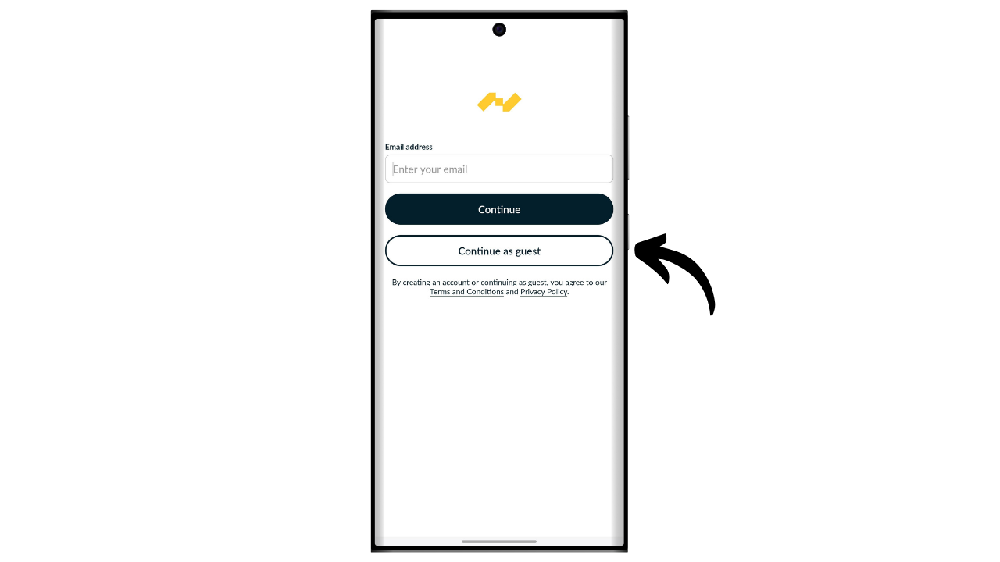
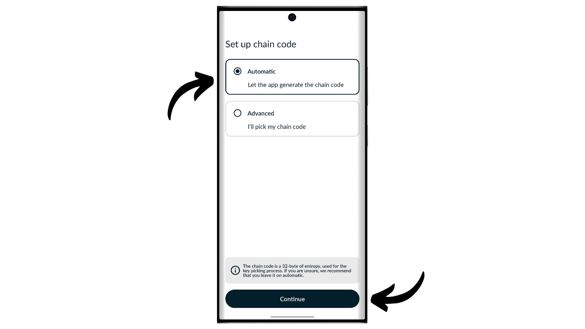
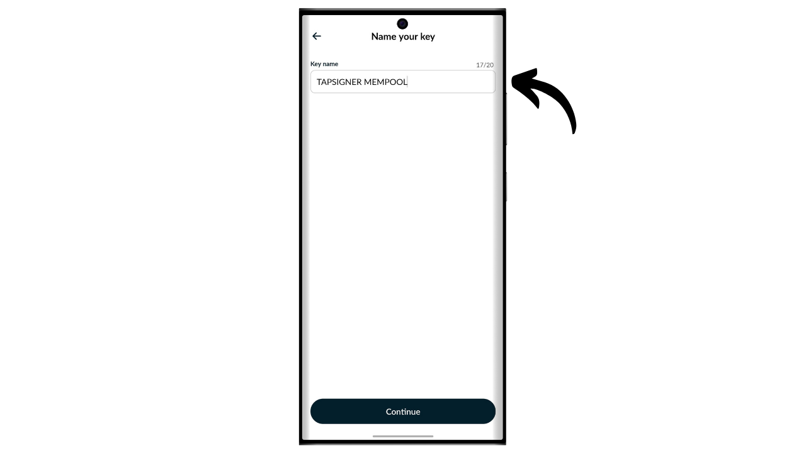
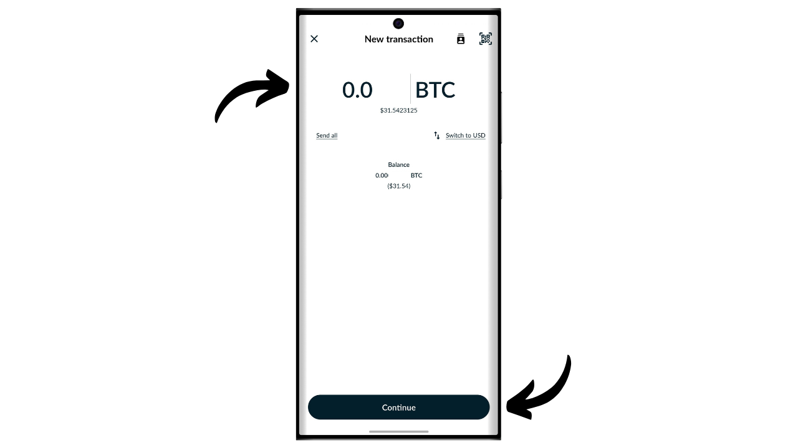
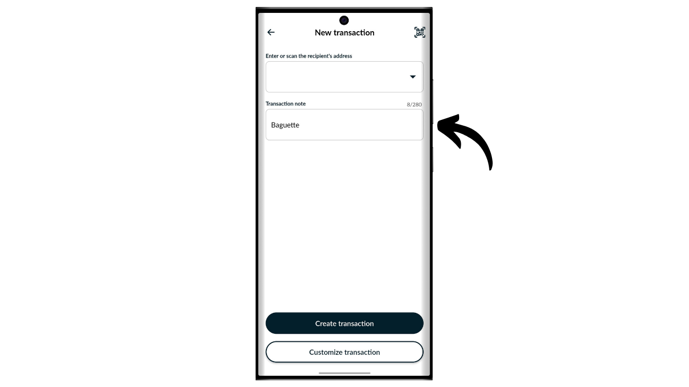

Laitteistolompakko on elektroninen laite, joka on omistettu Bitcoin-lompakon yksityisavainten hallinnalle ja turvallisuudelle. Toisin kuin ohjelmistolompakot (tai hot wallets), jotka on asennettu yleiskäyttöisiin laitteisiin, jotka ovat usein yhdistettyjä internetiin, laitteistolompakot mahdollistavat yksityisavainten fyysisen eristämisen, vähentäen hakkeroinnin ja varkauden riskejä.

Laitteistolompakon päätavoite on minimoida laitteen toiminnallisuudet vähentääkseen sen hyökkäyspintaa. Pienempi hyökkäyspinta tarkoittaa myös vähemmän potentiaalisia hyökkäysvektoreita, eli vähemmän järjestelmän heikkoja kohtia, joita hyökkääjät voisivat käyttää hyväkseen päästäkseen käsiksi bitcoineihin.

On suositeltavaa käyttää laitteistolompakkoa bitcoiniesi turvaamiseen, erityisesti jos omistat merkittäviä määriä, oli se sitten absoluuttisessa arvossa tai osuutena kokonaisvarallisuudestasi.

Laitteistolompakoita käytetään yhdessä lompakonhallintaohjelmiston kanssa tietokoneella tai älypuhelimella. Tämä ohjelmisto hallinnoi transaktioiden luomista, mutta tarvittava kryptografinen allekirjoitus näiden transaktioiden vahvistamiseksi tehdään ainoastaan laitteistolompakossa. Tämä tarkoittaa, että yksityisavaimet eivät koskaan altistu mahdollisesti haavoittuvalle ympäristölle.

Laitteistolompakot tarjoavat kaksinkertaisen suojan käyttäjälle: toisaalta ne suojaavat bitcoinejasi etähyökkäyksiltä pitämällä yksityisavaimet offline-tilassa, ja toisaalta ne tarjoavat yleensä paremman fyysisen vastustuskyvyn avainten uuttamisyrityksiä vastaan. Ja juuri näiden 2 turvakriteerin perusteella voi arvioida ja vertailla markkinoilla saatavilla olevia eri malleja.

Tässä oppaassa ehdotan yhden näistä ratkaisuista tutkimista: Tapsignerin Coinkiteltä.

## Tapsignerin esittely

Tapsigner on Coinkiten, joka on tunnettu myös Coldcardien valmistuksesta, suunnittelema laitteistolompakko NFC-kortin muodossa.

Tapsigner mahdollistaa parin, joka koostuu pääyksityisavaimesta ja ketjukoodista BIP32:n mukaisesti, tallentamisen kryptografisten avainten puun johdattamiseksi. Näitä avaimia voidaan käyttää transaktioiden allekirjoittamiseen asettamalla Tapsigner puhelinta tai NFC-kortinlukijaa vasten.
Tämä NFC-kortti myydään $19.99 hintaan, mikä on erittäin edullista verrattuna muihin markkinoilla saatavilla oleviin laitteistolompakkoihin. Sen formaatin vuoksi Tapsigner ei kuitenkaan tarjoa yhtä monta vaihtoehtoa kuin muut laitteet. Siinä ei ole ilmeisesti akkua, kameraa eikä mikro SD -kortinlukijaa, koska se on kortti. Mielestäni sen suurin haittapuoli on laitteistolompakon näytön puuttuminen, mikä tekee siitä haavoittuvamman tietyntyyppisille etähyökkäyksille. Tämä pakottaa käyttäjän allekirjoittamaan sokeasti ja luottamaan siihen, mitä he näkevät tietokoneen näytöllä.

Huolimatta sen rajoituksista, Tapsigner voi olla mielenkiintoinen sen alhaisen hinnan vuoksi. Tätä lompakkoa voidaan erityisesti käyttää parantamaan kulutuslompakon turvallisuutta lisäksi säästölompakkoon, joka on suojattu näytöllä varustetulla laitteistolompakolla. Se edustaa myös hyvää ratkaisua niille, jotka omistavat pieniä määriä bitcoineja eivätkä halua investoida sataa euroa monimutkaisempaan laitteeseen. Lisäksi Tapsignerin käyttö multisig-kokoonpanoissa tai mahdollisesti tulevaisuudessa aikalukollisissa lompakkojärjestelmissä voi tarjota mielenkiintoisia etuja.

## Kuinka ostaa Tapsigner?

Tapsigner on ostettavissa [viralliselta Coinkiten verkkosivustolta](https://store.coinkite.com/store/category/tapsigner). Jos haluat ostaa sen fyysisestä kaupasta, voit myös löytää [sertifioitujen jälleenmyyjien listan](https://coinkite.com/resellers) sivustolta.
Tarvitset myös puhelimen, joka on yhteensopiva NFC-viestinnän kanssa, tai USB-laitteen NFC-korttien lukemiseen standarditaajuudella 13,56 MHz.
## Kuinka alustaa Tapsigner Nunchukin kanssa?

Kun olet saanut Tapsignerisi, ensimmäinen askel on tarkastaa pakkaus varmistaaksesi, ettei sitä ole avattu. Jos pakkaus on vahingoittunut, se voi viitata siihen, että kortti on saattanut joutua kompromissin kohteeksi ja se ei ehkä ole aito. CoinKite toimittaa Tapsignerisi radiotaajuuksia estävässä kotelossa. Varmista, että se on mukana paketissasi.

Lompakon hallintaan käytämme **Nunchuk Wallet** mobiilisovellusta. Varmista, että älypuhelimesi on NFC-yhteensopiva, ja lataa sitten Nunchuk [Google Play Kaupasta](https://play.google.com/store/apps/details?id=io.nunchuk.android), [App Storesta](https://apps.apple.com/us/app/nunchuk-bitcoin-wallet/id1563190073) tai suoraan sen [`.apk` tiedostosta](https://github.com/nunchuk-io/nunchuk-android/releases).

Jos käytät Nunchukia ensimmäistä kertaa, sovellus kehottaa sinua luomaan tilin. Tämän oppaan tarkoituksiin tilin luominen ei ole tarpeellista. Valitse siis "*Jatka vieraana*" jatkaaksesi ilman tiliä.

Valitse sitten "*Avustamaton lompakko*".

Seuraavaksi klikkaa "*Tutkin itse*" -painiketta.

Kun olet Nunchukissa, klikkaa "*+*" -painiketta "*Avaimet*" -välilehden vieressä.

Valitse "*Lisää NFC-avain*".

Klikkaa sitten "*Lisää TAPSIGNER*".

Klikkaa "*Jatka*" ja aseta sitten Tapsigner NFC-korttisi älypuhelimesi vasten.

Jos Tapsignerisi on uusi, Nunchuk tarjoaa sen alustamista. Klikkaa "*Kyllä*".

Nyt sinun täytyy valita, miten generoit pääketjukoodisi.

Tapsigner käyttää BIP32-standardia. Tämä tarkoittaa, että kryptografisten avaintesi, jotka turvaavat bitcoinsisi, johdannaiset eivät perustu mnemoniseen fraasiin kuten BIP39-lompakot, vaan suoraan pääyksityisavaimen ja pääketjukoodin kautta. Nämä 2 elementtiä syötetään HMAC-funktioon deterministisesti ja hierarkisesti johdannaisten lompakon loppuosan generoimiseksi.

Pääyksityisavain generoidaan suoraan Tapsignerisi sisäänrakennetulla TRNG:llä (*True Random Number Generator*). Pääketjukoodi sen sijaan on annettava ulkopuolelta. Tässä vaiheessa sinulla on valinta: anna Nunchukin generoida se automaattisesti klikkaamalla "*Automaattinen*", tai generoi se itse valitsemalla "*Edistynyt*" ja syöttämällä sen tarjottuun kenttään.

Seuraavaksi sinun tulee valita PIN-koodi. "*Aloitus-PIN*" -alueelle, syötä PIN-koodi, joka on kirjoitettu Tapsignerisi takapuolelle.

Valitse PIN-koodi fyysisen pääsyn turvaamiseksi Tapsigner-laitteeseesi. Tällä PIN-koodilla ei ole roolia lompakon palautusprosessissa. Sen ainoa tehtävä on avata Tapsignerisi allekirjoitusten tekemistä varten. Varmista, että tallennat tämän PIN-koodin unohtamisen välttämiseksi. Klikkaa "*Jatka*" jatkaaksesi.

Aseta Tapsigner-korttisi nyt puhelimesi taakse sen alustamiseksi.

Nunchuk luo sitten lompakollesi palautustiedoston, jonka avulla voit saada pääsyn bitcoineihisi uudelleen, jos menetät NFC-korttisi. Tämä tiedosto on salattu varmuuskoodilla, joka on kirjoitettu Tapsignerisi takapuolelle. Bitcoiniesi palauttamiseksi tarvitset ehdottomasti tämän tiedoston sekä koodin sen purkamiseen. Siksi on tärkeää tehdä tästä koodista paperikopio, koska jos menetät NFC-korttisi, pääsy tähän koodiin menetetään myös, koska se on toistaiseksi kirjoitettu vain kortille. Varmista, että luot myös useita varmuuskopioita salatusta palautustiedostostasi.

Valitse nimi lompakollesi.

Lompakkosi perusta on nyt asetettu. Tapsignerisi aitouden tarkistamiseksi voit milloin tahansa klikata "*Suorita terveystarkastus*" -painiketta.

Syötä PIN-koodisi.

Aseta sitten korttisi puhelimesi taakse.

## Kuinka luoda lompakko Tapsignerilla?

Palatessasi Nunchukin kotisivulle, näet että Tapsignerisi on rekisteröity saatavilla oleviin allekirjoituslaitteisiin.

Sinun tulee nyt luoda avaimet Bitcoin-lompakollesi. Tehdäksesi tämän, klikkaa "*+*" -painiketta "*Lompakot*" -välilehden oikealla puolella.

Klikkaa "*Luo uusi lompakko*".

Valitse sitten vaihtoehto "*Luo uusi lompakko käyttäen olemassa olevia avaimia*".

Valitse nimi lompakollesi ja klikkaa sitten "*Jatka*".

Valitse Tapsignerisi allekirjoituslaitteeksi tälle uudelle avainsetille ja klikkaa sitten "*Jatka*".

Jos kaikki on mielestäsi kunnossa, vahvista luominen.

Voit sen jälkeen tallentaa lompakkosi konfiguraatiotiedoston. Tämä tiedosto sisältää yksinomaan julkiset avaimet, mikä tarkoittaa, että vaikka joku pääsisi käsiksi siihen, he eivät voi varastaa bitcoinejasi. He voivat kuitenkin seurata kaikkia transaktioitasi. Siksi tämä tiedosto aiheuttaa riskin vain yksityisyydellesi. Joissakin tapauksissa se voi olla olennainen lompakkosi palauttamiseksi.

Ja siinä se on, lompakkosi on onnistuneesti luotu!

Kun et käytä Tapsigneriasi, muista säilyttää se Coinkiten toimittamassa kotelossa, joka estää radiotaajuuksien pääsyn suojatakseen luvattomilta lukemisilta.

## Kuinka vastaanottaa bitcoineja Tapsignerilla?

Vastaanottaaksesi bitcoineja, klikkaa lompakkoasi.

Käytä sitten generoitua osoitetta bitcoinejen vastaanottamiseen. Jos olet aiemmin vastaanottanut bitcoineja tällä lompakolla, sinun täytyy klikata "*Vastaanota*" -painiketta generoidaksesi uuden tyhjän vastaanotto-osoitteen.

Kun lähettäjän transaktio on lähetetty, näet sen ilmestyvän lompakkoosi.

Klikkaa "*Näytä kolikot*".

Valitse uusi UTXO.

Klikkaa "*+*" vieressä olevaa "*Tags*" lisätäksesi etiketin UTXO:lle. Tämä on hyvä käytäntö, sillä se auttaa muistamaan kolikoidesi alkuperän ja optimoimaan yksityisyytesi tulevia menoja varten.

Valitse olemassa oleva tagi tai luo uusi, sitten klikkaa "*Tallenna*". Sinulla on myös mahdollisuus luoda "*kokoelmia*" järjestääksesi kolikkosi rakenteellisemmin.

## Kuinka lähettää bitcoineja Tapsignerilla?

Nyt kun sinulla on bitcoineja lompakossasi, voit myös lähettää niitä. Tee tämä klikkaamalla valitsemaasi lompakkoa.

Klikkaa "*Lähetä*" -painiketta.

Valitse lähetettävä summa, sitten klikkaa "*Jatka*".

Lisää "*muistiinpano*" tulevaan transaktioosi muistaaksesi sen tarkoituksen.

Seuraavaksi, syötä manuaalisesti vastaanottajan osoite määrättyyn kenttään.

Voit myös skannata QR-koodilla koodatun osoitteen klikkaamalla näytön oikeassa yläkulmassa sijaitsevaa ikonia.

Klikkaa "*Luo Transaktio*" -painiketta.

Vahvista transaktiosi tiedot, sitten klikkaa "*Allekirjoita*" -painiketta vieressäsi olevalla Tapsignerilla.

Syötä PIN-koodisi avataksesi sen.

Aseta sitten Tapsigner älypuhelimesi taakse.

Transaktiosi on nyt allekirjoitettu. Tarkista vielä kerran, että kaikki on oikein, ja klikkaa sitten "*Lähetä transaktio*" lähettääksesi sen Bitcoin-verkkoon.

Transaktiosi odottaa nyt vahvistusta.

## Kuinka palauttaa lompakko, jos Tapsigner katoaa?

Jos olet kadottanut Tapsignerisi, voit palauttaa lompakkosi käyttäen kortin takana olevaa koodia. On siis tärkeää tallentaa tämä koodi erillään Tapsignerista, sillä jos kortti katoaa, pääsy tähän koodiin menetetään myös. Tarvitset myös lompakon salatun varmuuskopion.

Palautusta varten käytämme Nunchuk-sovellusta, mutta pidä mielessä, että tämä tarkoittaa varojesi tilapäistä turvaamista kuumassa lompakossa. Jos Tapsignerisi suojasi merkittäviä summia, harkitse saman palautusprosessin noudattamista uudella Coldcardilla sen sijaan.

Avaa Nunchuk-sovellus ja klikkaa "*+*" -painiketta "*Avaimet*" -välilehden vieressä.

Valitse "*Lisää NFC-avain*".

Valitse vaihtoehto "*Palauta TAPSIGNER-avain varmuuskopiosta*".

Sinut ohjataan sitten laitteesi tiedostonhallintaan. Etsi ja valitse lompakkosi salattu varmuuskopiotiedosto. Normaalisti tämän tiedoston nimi alkaa `backup...`.

Syötä salasana, joka purkaa varmuuskopiotiedoston salauksen. Tämä salasana vastaa alkuperäisesti Tapsignerisi takana merkittyä salasanaa.

Valitse sitten nimi palautetulle lompakollesi.

Olet nyt saanut uudelleen pääsyn bitcoineihisi. Lompakkosi hallitaan nyt kuumana lompakkona Nunchuk-sovelluksen "*Avaimet*" -välilehdessä. Seuraavaksi sinun tulee luoda uusi sarja kryptografisia avaimia "*Lompakot*" -osiossa yhdistämällä tämä avain siihen. Voit tehdä tämän noudattamalla uudelleen ohjeita kohdassa "*Kuinka luoda lompakko Tapsignerilla?*" tässä oppaassa.

Jos olet kadottanut Tapsignerisi, suosittelen vahvasti, että siirrät bitcoinit välittömästi toiseen omistamaasi lompakkoon, ihanteellisesti laitteistolompakkoon suojattuna. Kadonneessa Tapsignerissasi voi nimittäin olla väärissä käsissä. On siis tärkeää tyhjentää juuri palautettu lompakko ja lopettaa sen käyttö.

Onnittelut, olet nyt ajan tasalla Tapsignerin käytöstä! Jos pidit tätä opasta hyödyllisenä, arvostaisin, jos voisit jättää peukun ylös alla. Voit vapaasti jakaa tämän artikkelin sosiaalisissa verkostoissasi. Kiitos paljon!