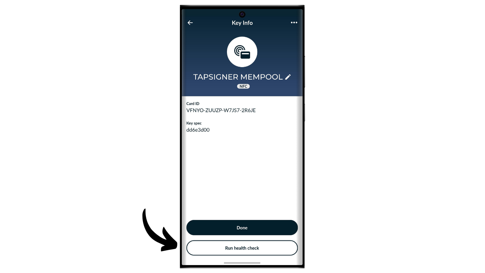
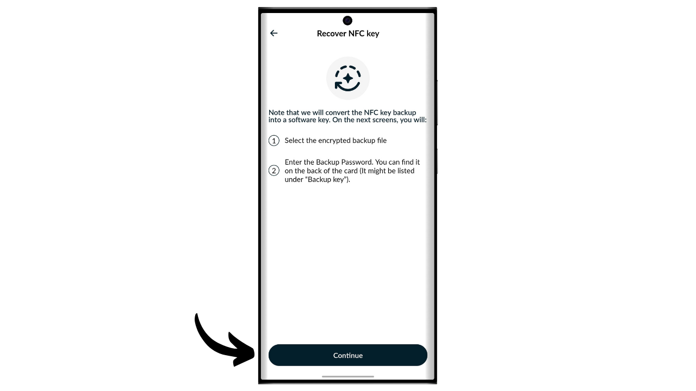
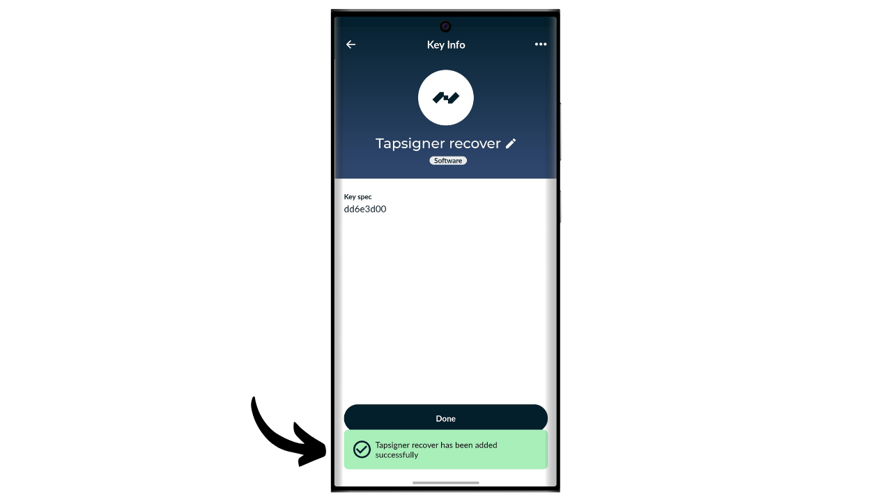

Un hardware wallet est un dispositif électronique dédié à la gestion et à la sécurisation des clés privées d'un portefeuille Bitcoin. Contrairement aux portefeuilles logiciels (ou portefeuilles chauds) installés sur des machines généralistes souvent connectées à Internet, les hardware wallets permettent d'isoler physiquement les clés privées, ce qui réduit les risques de piratage et de vol.

Le principal objectif d'un hardware wallet est de réduire au maximum les fonctionnalités de l'appareil afin de minimiser sa surface d'attaque. Moins de surface d'attaque, ça veut également dire moins de potentiels vecteurs d'attaque, c'est-à-dire moins de points faibles dans le système que les attaquants pourraient exploiter pour accéder aux bitcoins. 

Il est recommandé d'utiliser un hardware wallet pour sécuriser vos bitcoins, surtout si vous en détenez des quantités importantes, que ce soit en valeur absolue ou en proportion de votre patrimoine total.

Les hardware wallets s’utilisent en combinaison avec un logiciel de gestion de portefeuille sur un ordinateur ou un smartphone. Ce dernier permet de gérer la création des transactions, mais la signature cryptographique nécessaire pour rendre valide ces transactions se fait uniquement au sein du hardware wallet. Cela signifie que les clés privées ne sont jamais exposées à un environnement potentiellement vulnérable.

Les hardware wallets offrent une double protection pour l'utilisateur : d'une part, ils sécurisent vos bitcoins contre les attaques à distance en gardant les clés privées hors ligne, et d'autre part, ils offrent généralement une meilleure résistance physique face aux tentatives d'extraction des clés. Et c'est justement sur ces 2 critères de sécurité que l'on peut juger et classer les différents modèles existants sur le marché.

Dans ce tutoriel, je vous propose de découvrir une de ces solutions : le Tapsigner de Coinkite.

## Présentation du Tapsigner

Le Tapsigner est un hardware wallet conçu sous la forme d’une carte NFC par la société Coinkite, également connue pour produire les Coldcard. 

Le Tapsigner permet de stocker un couple composé d'une clé privée maîtresse et d'un code de chaîne conformément au BIP32, afin de dériver un arbre de clés cryptographiques. Ces clés peuvent être utilisées pour signer des transactions en positionnant le Tapsigner contre un téléphone ou un lecteur de carte NFC.

Cette carte NFC est vendue 19,99 $, ce qui est très abordable par rapport aux autres hardware wallets disponibles sur le marché. Cependant, de par son format, le Tapsigner ne propose pas autant d'options que les autres matériels. Il n'y a évidemment pas de batterie, pas de caméra, ni de lecteur de micro SD, car c'est une carte. Son plus gros inconvénient selon moi est l'absence d'écran sur le hardware wallet, ce qui le rend plus vulnérable à certains types d'attaques à distance. En effet, cela force l'utilisateur à signer à l'aveugle et à faire confiance à ce qu'il voit sur l'écran de son ordinateur.

Malgré ses limitations, le Tapsigner peut être intéressant en raison de son prix réduit. Ce wallet peut notamment servir à renforcer la sécurité d'un portefeuille de dépenses en complément d'un portefeuille d'épargne protégé par un hardware wallet équipé d'un écran. Il constitue également une bonne solution pour ceux qui détiennent de faibles montants de bitcoins et ne souhaitent pas investir une centaine d'euros dans un dispositif plus sophistiqué. De plus, l'utilisation de Tapsigner dans des configurations multisig, ou potentiellement dans des systèmes de portefeuille avec timelock à l'avenir, peut offrir des avantages intéressants.

## Comment acheter un Tapsigner ?

Le Tapsigner est disponible à la vente [sur le site officiel de Coinkite](https://store.coinkite.com/store/category/tapsigner). Pour l'acheter dans une boutique physique, vous pouvez également retrouver [la liste des revendeurs certifiés](https://coinkite.com/resellers) sur le site.

Vous aurez également besoin d'un téléphone compatible avec les communications NFC, ou d'un périphérique USB pour lire les cartes NFC à la fréquence standard de 13,56 MHz.

## Comment initialiser un Tapsigner avec Nunchuk ?

Une fois votre Tapsigner reçu, la première étape consiste à examiner l'emballage pour s'assurer qu'il n'a pas été ouvert. Si le colis est endommagé, cela pourrait indiquer que la carte a été compromise et qu'elle pourrait ne pas être authentique. CoinKite vous livrera votre Tapsigner avec un étui qui bloque les ondes radios. Vérifiez que celui-ci est bien présent dans votre colis.

Pour gérer le portefeuille, nous allons utiliser l'application mobile **Nunchuk Wallet**. Vérifiez que votre smartphone est compatible NFC, puis téléchargez Nunchuk à partir du [Google Play Store](https://play.google.com/store/apps/details?id=io.nunchuk.android), de l'[App Store](https://apps.apple.com/us/app/nunchuk-bitcoin-wallet/id1563190073) ou directement via son [fichier `.apk`](https://github.com/nunchuk-io/nunchuk-android/releases).

Si vous utilisez Nunchuk pour la première fois, l'application vous proposera de créer un compte. Pour les besoins de ce tutoriel, il n'est pas nécessaire d'en créer un. Sélectionnez donc "*Continue as guest*" pour continuer sans compte.

Cliquez ensuite sur "*Unassisted wallet*".

Puis cliquez sur le bouton "*I'll explore on my own*".

Une fois sur Nunchuk, cliquez sur le bouton "*+*" à côté de l'onglet "*Keys*".

Choisissez "*Add NFC key*".

Puis cliquez sur "*Add TAPSIGNER*".

Cliquez sur "*Continue*" puis placez votre carte NFC Tapsigner contre votre smartphone.

Si votre Tapsigner est neuf, Nunchuk vous proposera de l'initialiser. Cliquez sur "*Yes*".

Vous devrez maintenant choisir la manière dont vous générez votre code de chaîne maître. 

Le Tapsigner utilise le standard BIP32. Cela signifie que la dérivation de vos clés cryptographiques qui sécurisent vos bitcoins ne s'appuie pas sur une phrase mnémonique comme pour les portefeuilles BIP39, mais directement sur la clé privée maîtresse et le code de chaîne maître. Ces 2 éléments sont passés dans la fonction HMAC pour dériver le reste de votre portefeuille de manière déterministe et hiérarchique.

La clé privée maîtresse est générée directement par le TRNG (*True Random Number Generator*) intégré à votre Tapsigner. Le code de chaîne maître, quant à lui, doit être fourni de l'extérieur. À cette étape, vous avez le choix : laissez Nunchuk le générer automatiquement en cliquant sur "*Automatic*", ou générez-le vous-même en sélectionnant "*Advanced*" et en l'inscrivant dans la case prévue à cet effet.

Vous devez ensuite choisir un code PIN. Dans la zone "*Starting PIN*", saisissez le code PIN inscrit au dos de votre Tapsigner.

Choisissez un code PIN pour sécuriser l'accès physique à votre Tapsigner. Ce code PIN ne joue aucun rôle dans le processus de récupération de votre portefeuille. Son unique fonction est de déverrouiller votre Tapsigner afin de signer des transactions. Assurez-vous de sauvegarder ce code PIN pour éviter de l'oublier. Cliquez sur "*Continue*" pour poursuivre.

Placez maintenant votre carte Tapsigner à l'arrière de votre téléphone pour l'initialiser.

Nunchuk va ensuite vous générer le fichier de récupération de votre portefeuille, qui vous permet de retrouver l'accès à vos bitcoins en cas de perte de votre carte NFC. Ce fichier est chiffré avec le code de sauvegarde inscrit au dos de votre Tapsigner. Pour récupérer vos bitcoins, vous aurez impérativement besoin de ce fichier ainsi que du code pour le déchiffrer. Il est donc important de faire une copie papier de ce code, car si vous perdez votre carte NFC, l'accès à ce code sera également perdu, puisqu'il est uniquement inscrit sur la carte pour le moment. Assurez-vous également de réaliser plusieurs sauvegardes de votre fichier de récupération chiffré.

Choisissez un nom pour votre portefeuille.

La base de votre portefeuille est désormais configurée. Pour vérifier l'authenticité de votre Tapsigner, à tout moment, vous pouvez cliquer sur le bouton "*Run health check*".

Renseignez votre PIN.

Puis placez votre carte à l'arrière de votre téléphone.

## Comment créer un portefeuille sur un Tapsigner ?

De retour sur la page d'accueil de Nunchuk, vous pouvez voir que votre Tapsigner est enregistré dans les périphériques de signature disponibles.

Vous allez maintenant devoir générer les clés de votre portefeuille Bitcoin. Pour ce faire, cliquez sur le bouton "*+*" à droite de l'onglet "*Wallets*".

Cliquez sur "*Create new wallet*".

Puis choisissez l'option "*Create a new wallet using existing keys*".

Choisissez un nom pour votre portefeuille puis cliquez sur "*Continue*".

Sélectionnez votre Tapsigner comme périphérique de signature pour ce nouvel ensemble de clés, puis cliquez sur "*Continue*".

Si tout vous convient, validez la création.

Vous pouvez ensuite sauvegarder le fichier de configuration de votre portefeuille. Ce fichier contient exclusivement vos clés publiques, ce qui signifie que même si quelqu'un y accède, il ne pourra pas dérober vos bitcoins. Cependant, il pourra suivre toutes vos transactions. Ce fichier présente donc uniquement un risque pour votre vie privée. Dans certains cas, il peut être indispensable pour récupérer votre portefeuille.

Et voilà, votre portefeuille est bien créé !

Lorsque vous n'utilisez pas votre Tapsigner, pensez à le ranger dans l'étui fourni par Coinkite qui bloque les ondes radio afin de le protéger contre les lectures non autorisées.

## Comment recevoir des bitcoins sur le Tapsigner ?

Pour recevoir des bitcoins, cliquez sur votre portefeuille.

Puis utilisez l'adresse générée pour recevoir des bitcoins. Si vous avez déjà reçu des bitcoins auparavant sur ce portefeuille, vous devrez cliquer sur le bouton "*Receive*" afin de générer une nouvelle adresse de réception vierge.

Une fois la transaction de l'envoyeur diffusée, vous la verrez apparaitre sur votre portefeuille.

Cliquez sur "*View coins*".

Sélectionnez votre nouvel UTXO.

Cliquez sur le "*+*" à côté de "*Tags*" pour ajouter une étiquette à votre UTXO. C'est une bonne pratique, car cela vous aide à vous rappeler la provenance de vos pièces et à optimiser votre confidentialité lors de futures dépenses.

Sélectionnez un tag existant ou créez-en un nouveau, puis cliquez sur "*Enregistrer*". Vous avez aussi la possibilité de créer des "*collections*" pour organiser vos pièces de manière plus structurée.

## Comment envoyer des bitcoins avec le Tapsigner ?

Maintenant que vous avez des bitcoins sur votre portefeuille, vous pouvez également en envoyer. Pour ce faire, cliquez sur le portefeuille de votre choix.

Cliquez sur le bouton "*Send*".

Sélectionnez le montant à envoyer, puis cliquez sur "*Continue*".

Ajoutez une "*note*" à votre future transaction pour vous souvenir de son objectif.

Ensuite, saisissez manuellement l'adresse du destinataire dans le champ prévu à cet effet.

Vous pouvez également scanner une adresse encodée en QR code en cliquant sur l'icône située en haut à droite de l'écran.

Cliquez sur le bouton "*Create Transaction*".

Vérifiez les détails de votre transaction, puis cliquez sur le bouton "*Sign*" à côté de votre Tapsigner.

Renseignez votre code PIN pour le déverrouiller.

Puis placez le Tapsigner à l'arrière de votre smartphone.

Votre transaction est maintenant signée. Vérifiez une dernière fois que tout est correct, puis cliquez sur "*Broadcast Transaction*" pour la diffuser sur le réseau Bitcoin.

Votre transaction est désormais en attente de confirmation.

## Comment récupérer le portefeuille en cas de perte du Tapsigner ?

Si vous avez perdu votre Tapsigner, vous pouvez récupérer votre portefeuille en utilisant le code noté au dos de la carte. Il est donc important de sauvegarder ce code séparément du Tapsigner, car en cas de perte de la carte, l'accès à ce code sera également perdu. Vous aurez aussi besoin de la sauvegarde chiffrée du portefeuille.

Pour la récupération, nous allons utiliser l'application Nunchuk, mais gardez à l'esprit que cela signifie temporairement sécuriser vos fonds dans un hot wallet. Si votre Tapsigner sécurisait des montants importants, envisagez plutôt de suivre le même processus de récupération avec une Coldcard neuve.

Ouvrez l'application Nunchuk et cliquez sur le bouton "*+*" à côté de l'onglet "*Keys*".

Choisissez "*Add NFC key*".

Choisissez l'option "*Recover TAPSIGNER key from backup*".

Vous êtes ensuite redirigé vers l'explorateur de fichiers de votre appareil. Localisez et sélectionnez le fichier de sauvegarde chiffré de votre portefeuille. Normalement, le nom de ce fichier commence par `backup...`.

Saisissez le mot de passe qui permet de déchiffrer le fichier de sauvegarde. Ce mot de passe correspond à celui initialement noté au dos de votre Tapsigner.

Puis choisissez un nom pour votre portefeuille de récupération.

Vous avez maintenant récupéré l'accès à vos bitcoins. Votre portefeuille est désormais géré comme un portefeuille chaud visible dans l'onglet "*Keys*" de l'application Nunchuk. Il faut ensuite créer de nouveau un ensemble de clés cryptographiques dans la section "*Wallets*" en y associant cette clé. Pour ce faire, vous pouvez suivre de nouveau les étapes dans la partie "*Comment créer un portefeuille sur un Tapsigner ?*" de ce tutoriel.

Si vous avez perdu votre Tapsigner, je vous conseille vivement de transférer immédiatement vos bitcoins vers un autre portefeuille que vous possédez, idéalement protégé par un hardware wallet. En effet, le Tapsigner que vous avez perdu est potentiellement entre de mauvaises mains. Il est donc important de vider le portefeuille que vous venez de récupérer et de cesser de l'utiliser.

Félicitations, vous êtes maintenant au point sur l'utilisation du Tapsigner ! Si vous avez trouvé ce tutoriel utile, je vous serais reconnaissant de laisser un pouce vert ci-dessous. N'hésitez pas à partager cet article sur vos réseaux sociaux. Merci beaucoup !
