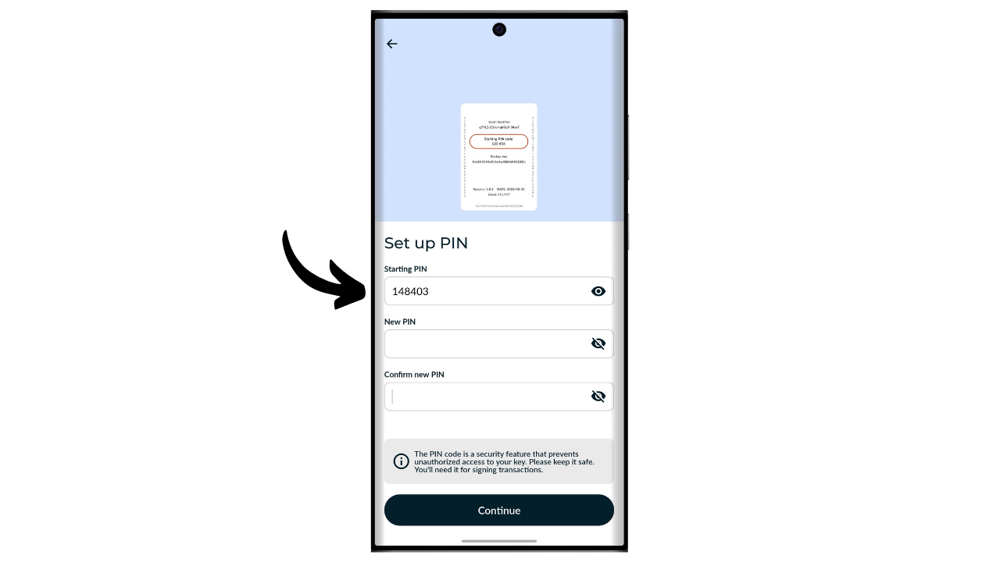

Dompet perangkat keras adalah perangkat elektronik yang didedikasikan untuk pengelolaan dan keamanan kunci privat dari dompet Bitcoin. Berbeda dengan dompet perangkat lunak (atau dompet panas) yang dipasang pada mesin umum yang sering terhubung ke Internet, dompet perangkat keras memungkinkan isolasi fisik dari kunci privat, mengurangi risiko peretasan dan pencurian.

Tujuan utama dari dompet perangkat keras adalah untuk meminimalkan fungsionalitas perangkat untuk mengurangi permukaan serangan. Permukaan serangan yang lebih kecil juga berarti lebih sedikit vektor serangan potensial, yaitu lebih sedikit titik lemah dalam sistem yang bisa dieksploitasi oleh penyerang untuk mengakses bitcoin.

Disarankan untuk menggunakan dompet perangkat keras untuk mengamankan bitcoin kamu, terutama jika kamu memiliki jumlah yang signifikan, baik dalam nilai absolut maupun sebagai proporsi dari total aset kamu.

Dompet perangkat keras digunakan bersama dengan perangkat lunak manajemen dompet pada komputer atau smartphone. Perangkat lunak ini mengelola pembuatan transaksi, tetapi tanda tangan kriptografis yang diperlukan untuk memvalidasi transaksi ini dilakukan sepenuhnya di dalam dompet perangkat keras. Ini berarti kunci privat tidak pernah terpapar ke lingkungan yang berpotensi rentan.

Dompet perangkat keras menawarkan perlindungan ganda bagi pengguna. Di satu sisi, mereka mengamankan bitcoin kamu dari serangan jarak jauh dengan menjaga kunci privat tetap offline, dan di sisi lain, mereka umumnya menawarkan resistensi fisik yang lebih baik terhadap upaya untuk mengekstrak kunci. Pada dua kriteria keamanan inilah seseorang dapat menilai dan meranking berbagai model yang tersedia di pasar.

Dalam tutorial ini, aku mengusulkan untuk menemukan salah satu solusi ini: Tapsigner oleh Coinkite.

## Pengenalan ke Tapsigner

Tapsigner adalah dompet perangkat keras yang dirancang dalam bentuk kartu NFC oleh perusahaan Coinkite, yang juga dikenal karena memproduksi Coldcard.

Tapsigner memungkinkan penyimpanan pasangan yang terdiri dari kunci privat induk dan kode rantai sesuai dengan BIP32, untuk menurunkan pohon kunci kriptografis. Kunci-kunci ini bisa digunakan untuk menandatangani transaksi dengan meletakkan Tapsigner di dekat ponsel atau pembaca kartu NFC.

Kartu NFC ini dijual seharga $19.99, yang sangat terjangkau dibandingkan dengan dompet perangkat keras lain yang tersedia di pasar. Namun, karena formatnya, Tapsigner tidak menawarkan sebanyak opsi seperti perangkat lain. Jelas tidak ada baterai, tidak ada kamera, dan tidak ada pembaca kartu microSD, karena ini adalah kartu. Menurutku, kekurangan terbesar adalah tidak adanya layar pada dompet perangkat keras, yang membuatnya lebih rentan terhadap beberapa jenis serangan jarak jauh. Memang, hal ini memaksa pengguna untuk menandatangani secara buta dan mempercayai apa yang mereka lihat di layar komputer mereka.

Meskipun memiliki keterbatasan, Tapsigner bisa menarik karena harganya yang murah. Dompet ini bisa digunakan khususnya untuk meningkatkan keamanan dompet pengeluaran selain dompet tabungan yang dilindungi oleh dompet perangkat keras yang dilengkapi dengan layar. Ini juga menjadi solusi yang baik bagi mereka yang memiliki jumlah bitcoin yang kecil dan tidak ingin menginvestasikan seratus euro dalam perangkat yang lebih canggih. Selain itu, penggunaan Tapsigner dalam konfigurasi multisig, atau potensial dalam sistem dompet dengan timelock di masa depan, bisa menawarkan manfaat yang menarik.

## Bagaimana cara membeli Tapsigner?

Tapsigner tersedia untuk dibeli [di situs resmi Coinkite](https://store.coinkite.com/store/category/tapsigner). Untuk membelinya di toko fisik, kamu juga dapat menemukan [daftar reseller bersertifikat](https://coinkite.com/resellers) di situs tersebut.
Kamu juga akan memerlukan telepon yang kompatibel dengan komunikasi NFC, atau perangkat USB untuk membaca kartu NFC pada frekuensi standar 13,56 MHz.
## Bagaimana cara menginisialisasi Tapsigner dengan Nunchuk?

Setelah kamu menerima Tapsigner, langkah pertama adalah memeriksa kemasannya untuk memastikan belum pernah dibuka. Kalau paketnya rusak, itu bisa menjadi tanda bahwa kartu telah dikompromikan dan mungkin tidak asli. Coinkite akan mengirim Tapsigner kamu dengan sebuah kotak yang memblokir gelombang radio. Pastikan kotak itu ada di dalam paket yang kamu terima.

Untuk mengelola dompet, kita akan menggunakan aplikasi seluler **Nunchuk Wallet**. Pastikan smartphone kamu kompatibel dengan NFC, kemudian unduh Nunchuk dari [Google Play Store](https://play.google.com/store/apps/details?id=io.nunchuk.android), [App Store](https://apps.apple.com/us/app/nunchuk-bitcoin-wallet/id1563190073) atau langsung melalui file [`.apk`](https://github.com/nunchuk-io/nunchuk-android/releases) nya.

Jika kamu menggunakan Nunchuk untuk pertama kalinya, aplikasi akan meminta kamu untuk membuat akun. Untuk tujuan tutorial ini, tidak perlu membuat satu. Jadi, pilih "*Lanjutkan sebagai tamu*" untuk melanjutkan tanpa akun.

Kemudian klik pada "*Dompet tanpa bantuan*".

Selanjutnya, klik pada tombol "*Saya akan menjelajah sendiri*".

Setelah berada di Nunchuk, klik pada tombol "*+*" di sebelah tab "*Kunci*".

Pilih "*Tambahkan kunci NFC*".

Kemudian klik pada "*Tambahkan TAPSIGNER*".

Klik pada "*Lanjutkan*" dan kemudian tempatkan kartu NFC Tapsigner ke smartphone kamu.

Jika Tapsigner kamu baru, Nunchuk akan menawarkan untuk menginisialisasinya. Klik pada "*Ya*".

Sekarang kamu perlu memilih bagaimana kamu menghasilkan kode rantai induk.

Tapsigner menggunakan standar BIP32. Artinya, derivasi kunci kriptografis yang mengamankan bitcoin kamu tidak bergantung pada frasa mnemonik seperti dompet BIP39, tetapi langsung pada kunci privat induk dan kode rantai induk. Dua elemen ini dilewatkan melalui fungsi HMAC untuk secara deterministik dan hierarkis menurunkan sisa dompet kamu.

Kunci privat induk dihasilkan langsung oleh TRNG (*True Random Number Generator*) yang terintegrasi di dalam Tapsigner kamu. Kode rantai induk, di sisi lain, harus disediakan dari luar. Pada langkah ini, kamu punya pilihan: biarkan Nunchuk menghasilkannya secara otomatis dengan mengklik "*Otomatis*", atau kamu bisa menghasilkannya sendiri dengan memilih "*Lanjutan*" dan memasukkannya ke kolom yang tersedia.

Selanjutnya, kamu perlu memilih kode PIN. Di area "*Starting PIN*", masukkan kode PIN yang tertulis di bagian belakang Tapsigner kamu.

Pilih kode PIN untuk mengamankan akses fisik ke Tapsigner kamu. Kode PIN ini tidak berperan dalam proses pemulihan dompet. Fungsinya hanya untuk membuka kunci Tapsigner kamu untuk menandatangani transaksi. Pastikan kamu menyimpan kode PIN ini supaya tidak lupa. Klik "*Continue*" untuk melanjutkan.

Letakkan kartu Tapsigner di belakang ponsel kamu sekarang untuk menginisialisasinya.

Nunchuk kemudian akan menghasilkan file pemulihan untuk dompet kamu, yang memungkinkan kamu mendapatkan kembali akses ke bitcoin kamu kalau kartu NFC kamu hilang. File ini dienkripsi dengan kode cadangan yang tertulis di bagian belakang Tapsigner kamu. Untuk memulihkan bitcoin kamu, kamu akan sangat membutuhkan file ini serta kode untuk mendekripsinya. Karena itu, penting untuk membuat salinan kode tersebut di kertas, sebab kalau kamu kehilangan kartu NFC kamu, akses ke kode itu juga ikut hilang karena saat ini hanya tertulis di kartu. Pastikan juga kamu membuat beberapa cadangan dari file pemulihan terenkripsi kamu.

Pilih nama untuk dompet.

Dasar dompet kamu sekarang telah disiapkan. Untuk memverifikasi keaslian Tapsigner, kapan saja, kamu dapat mengklik tombol "*Run health check*".

Masukkan PIN kamu.

Kemudian letakkan kartu di belakang ponsel kamu.

## Bagaimana cara membuat dompet di Tapsigner?

Kembali ke beranda Nunchuk, kamu dapat melihat bahwa Tapsigner Anda terdaftar dalam perangkat penandatangan yang tersedia.

Sekarang kamu perlu menghasilkan kunci untuk dompet Bitcoin. Untuk melakukan ini, klik pada tombol "*+*" di sebelah kanan tab "*Wallets*".

Klik pada "*Create new wallet*".

Kemudian pilih opsi "*Create a new wallet using existing keys*".

Pilih nama untuk dompet kamu kemudian klik pada "*Continue*".

Pilih Tapsigner kamu sebagai perangkat penandatangan untuk set kunci baru ini, kemudian klik pada "*Continue*".

Jika semuanya sesuai dengan keinginan kamu, konfirmasi pembuatan.

Setelah itu kamu bisa menyimpan file konfigurasi dompet kamu. File ini hanya berisi kunci publik kamu, artinya meskipun seseorang mengaksesnya, mereka tidak bisa mencuri bitcoin kamu. Namun, mereka tetap bisa melihat dan mengikuti semua transaksi kamu. Jadi file ini hanya menimbulkan risiko terhadap privasi kamu.

Dalam beberapa kasus, file ini justru sangat penting untuk memulihkan dompet kamu.

Dan begitulah, dompet berhasil dibuat!

Kalau kamu tidak menggunakan Tapsigner, ingat untuk menyimpannya di dalam kotak yang disediakan oleh Coinkite, yang memblokir gelombang radio untuk melindungi dari pembacaan yang tidak sah.

## Bagaimana cara menerima bitcoin di Tapsigner?

Untuk menerima bitcoin, klik pada dompet kamu.

Kemudian gunakan alamat yang dihasilkan untuk menerima bitcoin. Jika kamu sebelumnya telah menerima bitcoin di dompet ini, kamu perlu mengklik tombol "*Receive*" untuk menghasilkan alamat penerimaan kosong baru.

Setelah transaksi pengirim disiarkan, kamu akan melihatnya muncul di dompet.

Klik pada "*View coins*".

Pilih UTXO baru.

Klik pada "*+*" di sebelah "*Tags*" untuk menambahkan label pada UTXO kamu. Ini adalah praktik yang baik, karena membantumu mengingat asal usul koin kamu dan mengoptimalkan privasi Anda untuk pengeluaran di masa depan.

Pilih tag yang ada atau buat yang baru, kemudian klik pada "*Save*". kamu juga memiliki opsi untuk membuat "*collections*" untuk mengorganisir koin kamu secara lebih terstruktur.

## Bagaimana cara mengirim bitcoin dengan Tapsigner?

Sekarang setelah kamu memiliki bitcoin di dompet, kamu juga dapat mengirimkannya. Untuk melakukan ini, klik pada dompet pilihan kamu.

Klik pada tombol "*Send*".

Pilih jumlah yang akan dikirim, kemudian klik pada "*Continue*".

Tambahkan "*note*" pada transaksi kamu di masa depan untuk mengingat tujuannya.

Selanjutnya, masukkan secara manual alamat penerima di bidang yang ditentukan.

Kamu juga dapat memindai alamat yang dikodekan QR code dengan mengklik ikon yang terletak di pojok kanan atas layar.

Klik pada tombol "*Create Transaction*".

Verifikasi detail transaksi kamu, kemudian klik pada tombol "*Sign*" di sebelah Tapsigner kamu.

Masukkan PIN kamu untuk membukanya.

Kemudian letakkan Tapsigner di belakang smartphone Anda.

Transaksi kamu sekarang telah ditandatangani. Periksa sekali lagi bahwa semuanya sudah benar, kemudian klik pada "*Broadcast Transaction*" untuk menyiarkan transaksi tersebut di jaringan Bitcoin.

Transaksi kamu sekarang sedang menunggu konfirmasi.

## Bagaimana cara memulihkan dompet kalau Tapsigner kamu hilang?

Kalau kamu kehilangan Tapsigner, kamu bisa memulihkan dompet kamu menggunakan kode yang tercatat di bagian belakang kartu. Karena itu, penting untuk menyimpan kode tersebut secara terpisah dari Tapsigner, sebab kalau kartu hilang, akses ke kode itu juga ikut hilang. Kamu juga akan membutuhkan cadangan terenkripsi dari dompet kamu.

Untuk proses pemulihan, kita akan menggunakan aplikasi Nunchuk, tetapi ingat bahwa ini berarti sementara dana kamu akan diamankan di dompet panas (hot wallet). Kalau Tapsigner kamu mengamankan jumlah yang cukup besar, pertimbangkan untuk melakukan proses pemulihan yang sama dengan Coldcard baru.

Buka aplikasi Nunchuk dan klik tombol "*+*" di sebelah tab "*Keys*".

Pilih "*Add NFC key*".

Pilih opsi "*Recover TAPSIGNER key from backup*".

Kemudian kamu akan diarahkan ke penjelajah file perangkat. Temukan dan pilih file cadangan terenkripsi dari dompet kamu. Biasanya, nama file ini dimulai dengan `backup...`.

Masukkan kata sandi yang mendekripsi file cadangan. Kata sandi ini sesuai dengan yang awalnya dicatat di bagian belakang Tapsigner kamu.

Kemudian pilih nama untuk dompet pemulihan Anda.

Sekarang kamu sudah mendapatkan kembali akses ke bitcoin kamu. Dompet kamu sekarang dikelola sebagai dompet panas yang terlihat di tab "*Keys*" di aplikasi Nunchuk. Selanjutnya, kamu perlu membuat set kunci kriptografi baru di bagian "*Wallets*" dengan mengaitkan kunci tersebut dengannya. Untuk melakukannya, kamu bisa mengikuti lagi langkah-langkah di bagian "*How to create a wallet on a Tapsigner?*" dari tutorial ini.

Kalau kamu kehilangan Tapsigner, aku sangat menyarankan kamu untuk segera mentransfer bitcoin kamu ke dompet lain yang kamu miliki, idealnya yang dilindungi oleh dompet perangkat keras (hardware wallet). Soalnya, Tapsigner yang hilang berpotensi sudah berada di tangan orang lain. Karena itu, penting untuk mengosongkan dompet yang baru saja kamu pulihkan dan berhenti menggunakannya.

Selamat, kamu sekarang sudah menguasai penggunaan Tapsigner! Kalau kamu merasa tutorial ini bermanfaat, aku akan sangat menghargai kalau kamu bisa memberikan jempol ke atas di bawah ini. Jangan ragu untuk membagikan artikel ini di jaringan sosial kamu. Terima kasih banyak!
