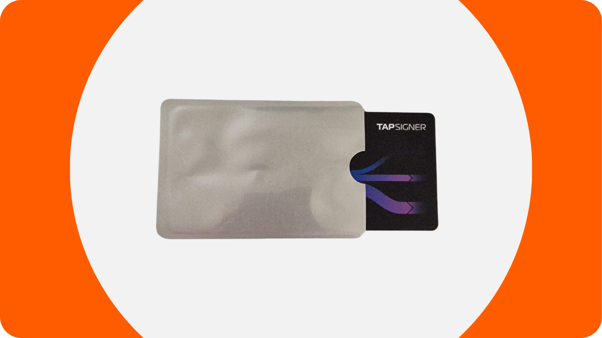
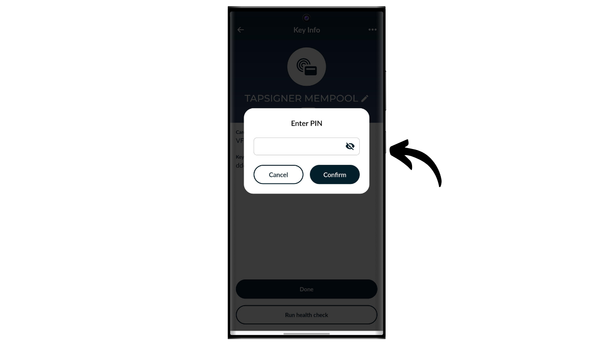

Un portafoglio hardware è un dispositivo elettronico dedicato alla gestione e alla sicurezza delle chiavi private di un portafoglio Bitcoin. A differenza dei portafogli software (o hot wallet) installati su macchine di uso generale spesso connesse a Internet, i portafogli hardware permettono l'isolamento fisico delle chiavi private, riducendo i rischi di hacking e furto.

L'obiettivo principale di un portafoglio hardware è minimizzare le funzionalità del dispositivo per ridurre la sua superficie di attacco. Una superficie di attacco più piccola significa anche meno vettori di attacco potenziali, ovvero meno punti deboli nel sistema che gli aggressori potrebbero sfruttare per accedere ai bitcoin.

Si raccomanda l'uso di un portafoglio hardware per proteggere i propri bitcoin, specialmente se si detengono quantità significative, sia in valore assoluto sia come proporzione dei propri asset totali.

I portafogli hardware sono utilizzati in combinazione con un software di gestione del portafoglio su un computer o smartphone. Questo software gestisce la creazione delle transazioni, ma la firma crittografica necessaria per convalidare queste transazioni viene eseguita esclusivamente all'interno del portafoglio hardware. Ciò significa che le chiavi private non sono mai esposte a un ambiente potenzialmente vulnerabile.

I portafogli hardware offrono una doppia protezione per l'utente: da un lato, proteggono i bitcoin da attacchi remoti mantenendo le chiavi private offline, e dall'altro, offrono generalmente una migliore resistenza fisica contro i tentativi di estrazione delle chiavi. Ed è proprio su questi 2 criteri di sicurezza che si può giudicare e classificare i diversi modelli disponibili sul mercato.

In questo tutorial, propongo di scoprire una di queste soluzioni: il Tapsigner di Coinkite.

## Introduzione al Tapsigner

Il Tapsigner è un portafoglio hardware progettato sotto forma di carta NFC dall'azienda Coinkite, nota anche per la produzione di Coldcards.

Il Tapsigner permette di memorizzare una coppia costituita da una chiave privata master e un codice catena in conformità con il BIP32, per derivare un albero di chiavi crittografiche. Queste chiavi possono essere utilizzate per firmare transazioni posizionando il Tapsigner contro un telefono o un lettore di carte NFC.
Questa carta NFC è venduta a $19.99, che è molto conveniente rispetto ad altri portafogli hardware disponibili sul mercato. Tuttavia, a causa del suo formato, il Tapsigner non offre tante opzioni quanto altri dispositivi. Ovviamente non c'è batteria, né fotocamera, né lettore di schede micro SD, essendo una carta. A mio avviso, il suo più grande svantaggio è la mancanza di uno schermo sul portafoglio hardware, il che lo rende più vulnerabile a certi tipi di attacchi remoti. Infatti, ciò costringe l'utente a firmare alla cieca e a fidarsi di ciò che vede sullo schermo del computer.

Nonostante i suoi limiti, il Tapsigner può essere interessante a causa del suo prezzo ridotto. Questo portafoglio può in particolare essere utilizzato per aumentare la sicurezza di un portafoglio di spesa in aggiunta a un portafoglio di risparmio protetto da un portafoglio hardware dotato di schermo. Rappresenta anche una buona soluzione per coloro che detengono piccole quantità di bitcoin e non desiderano investire un centinaio di euro in un dispositivo più sofisticato. Inoltre, l'uso del Tapsigner in configurazioni multisig, o potenzialmente in sistemi di portafoglio con timelock in futuro, può offrire benefici interessanti.

## Come acquistare un Tapsigner?

Il Tapsigner è disponibile per l'acquisto [sul sito ufficiale di Coinkite](https://store.coinkite.com/store/category/tapsigner). Per acquistarlo in un negozio fisico, è possibile trovare anche [l'elenco dei rivenditori certificati](https://coinkite.com/resellers) sul sito.
Avrai anche bisogno di un telefono compatibile con le comunicazioni NFC, o di un dispositivo USB per leggere le carte NFC alla frequenza standard di 13,56 MHz.
## Come inizializzare un Tapsigner con Nunchuk?

Una volta ricevuto il tuo Tapsigner, il primo passo è esaminare l'imballaggio per assicurarti che non sia stato aperto. Se il pacchetto è danneggiato, potrebbe indicare che la carta è stata compromessa e potrebbe non essere autentica. CoinKite consegnerà il tuo Tapsigner con una custodia che blocca le onde radio. Assicurati che sia presente nel tuo pacchetto.

Per gestire il portafoglio, useremo l'app mobile **Nunchuk Wallet**. Assicurati che il tuo smartphone sia compatibile NFC, poi scarica Nunchuk dal [Google Play Store](https://play.google.com/store/apps/details?id=io.nunchuk.android), dall'[App Store](https://apps.apple.com/us/app/nunchuk-bitcoin-wallet/id1563190073) o direttamente tramite il suo file [`.apk`](https://github.com/nunchuk-io/nunchuk-android/releases).

Se stai usando Nunchuk per la prima volta, l'app ti chiederà di creare un account. Ai fini di questo tutorial, non è necessario crearne uno. Quindi, seleziona "*Continua come ospite*" per procedere senza un account.

Poi clicca su "*Portafoglio non assistito*".

Successivamente, clicca sul pulsante "*Esplorerò da solo*".

Una volta in Nunchuk, clicca sul pulsante "*+*" accanto alla scheda "*Chiavi*".

Scegli "*Aggiungi chiave NFC*".

Poi clicca su "*Aggiungi TAPSIGNER*".

Clicca su "*Continua*" e poi avvicina la tua carta Tapsigner NFC al tuo smartphone.

Se il tuo Tapsigner è nuovo, Nunchuk offrirà di inizializzarlo. Clicca su "*Sì*".

Ora dovrai scegliere come generare il tuo codice catena principale.

Il Tapsigner utilizza lo standard BIP32. Questo significa che la derivazione delle tue chiavi crittografiche che proteggono i tuoi bitcoin non si basa su una frase mnemonica come i portafogli BIP39, ma direttamente sulla chiave privata principale e sul codice catena principale. Questi 2 elementi sono passati attraverso la funzione HMAC per derivare deterministicamente e gerarchicamente il resto del tuo portafoglio.

La chiave privata principale è generata direttamente dal TRNG (*True Random Number Generator*) integrato nel tuo Tapsigner. Il codice catena principale, d'altra parte, deve essere fornito dall'esterno. A questo passo, hai una scelta: lasciare che Nunchuk lo generi automaticamente cliccando su "*Automatico*", o generarla tu stesso selezionando "*Avanzato*" e inserendolo nel campo fornito.

Successivamente, devi scegliere un codice PIN. Nell'area "*Starting PIN*", inserisci il codice PIN scritto sul retro del tuo Tapsigner.

Scegli un codice PIN per proteggere l'accesso fisico al tuo Tapsigner. Questo codice PIN non gioca alcun ruolo nel processo di recupero del portafoglio. La sua unica funzione è sbloccare il tuo Tapsigner per firmare le transazioni. Assicurati di salvare questo codice PIN per evitare di dimenticarlo. Clicca su "*Continua*" per procedere.

Posiziona ora la tua carta Tapsigner sul retro del tuo telefono per inizializzarla.

Nunchuk genererà quindi il file di recupero per il tuo portafoglio, che ti permette di riaccedere ai tuoi bitcoin in caso di perdita della tua carta NFC. Questo file è criptato con il codice di backup scritto sul retro del tuo Tapsigner. Per recuperare i tuoi bitcoin, avrai assolutamente bisogno di questo file così come del codice per decifrarlo. È quindi importante fare una copia cartacea di questo codice, perché se perdi la tua carta NFC, l'accesso a questo codice sarà anch'esso perso, dato che per ora è scritto solo sulla carta. Assicurati anche di creare diversi backup del tuo file di recupero criptato.

Scegli un nome per il tuo portafoglio.

La base del tuo portafoglio è ora impostata. Per verificare l'autenticità del tuo Tapsigner, in qualsiasi momento, puoi cliccare sul pulsante "*Esegui controllo di salute*".

Inserisci il tuo PIN.

Poi posiziona la tua carta sul retro del tuo telefono.

## Come creare un portafoglio su un Tapsigner?

Tornando alla homepage di Nunchuk, puoi vedere che il tuo Tapsigner è registrato tra i dispositivi di firma disponibili.

Ora dovrai generare le chiavi per il tuo portafoglio Bitcoin. Per farlo, clicca sul pulsante "*+*" a destra della scheda "*Portafogli*".

Clicca su "*Crea nuovo portafoglio*".

Poi scegli l'opzione "*Crea un nuovo portafoglio usando chiavi esistenti*".

Scegli un nome per il tuo portafoglio e poi clicca su "*Continua*".

Seleziona il tuo Tapsigner come dispositivo di firma per questo nuovo set di chiavi, poi clicca su "*Continua*".

Se tutto è di tuo gradimento, conferma la creazione.

Puoi quindi salvare il file di configurazione del tuo portafoglio. Questo file contiene esclusivamente le tue chiavi pubbliche, il che significa che anche se qualcuno vi accede, non può rubare i tuoi bitcoin. Tuttavia, possono seguire tutte le tue transazioni. Pertanto, questo file rappresenta un rischio solo per la tua privacy. In alcuni casi, può essere essenziale per recuperare il tuo portafoglio.

Ecco fatto, il tuo portafoglio è stato creato con successo!

Quando non utilizzi il tuo Tapsigner, ricordati di conservarlo nella custodia fornita da Coinkite, che blocca le onde radio per proteggere da letture non autorizzate.

## Come ricevere bitcoin sul Tapsigner?

Per ricevere bitcoin, clicca sul tuo portafoglio.

Poi usa l'indirizzo generato per ricevere bitcoin. Se hai precedentemente ricevuto bitcoin su questo portafoglio, dovrai cliccare sul pulsante "*Ricevi*" per generare un nuovo indirizzo di ricezione vuoto.

Una volta che la transazione del mittente è stata trasmessa, la vedrai apparire sul tuo portafoglio.

Clicca su "*Visualizza monete*".

Seleziona il tuo nuovo UTXO.

Clicca sul simbolo "*+*" accanto a "*Tag*" per aggiungere un'etichetta al tuo UTXO. Questa è una buona pratica, poiché ti aiuta a ricordare l'origine delle tue monete e ottimizzare la tua privacy per le spese future.

Seleziona un tag esistente o creane uno nuovo, poi clicca su "*Salva*". Hai anche l'opzione di creare delle "*collezioni*" per organizzare le tue monete in modo più strutturato.

## Come inviare bitcoin con il Tapsigner?

Ora che hai dei bitcoin nel tuo portafoglio, puoi anche inviarli. Per fare ciò, clicca sul portafoglio di tua scelta.

Clicca sul pulsante "*Invia*".

Seleziona l'importo da inviare, poi clicca su "*Continua*".

Aggiungi una "*nota*" alla tua futura transazione per ricordarne lo scopo.

Successivamente, inserisci manualmente l'indirizzo del destinatario nel campo designato.

Puoi anche scansionare un indirizzo codificato in un codice QR cliccando sull'icona situata in alto a destra dello schermo.

Clicca sul pulsante "*Crea Transazione*".

Verifica i dettagli della tua transazione, poi clicca sul pulsante "*Firma*" accanto al tuo Tapsigner.

Inserisci il tuo PIN per sbloccarlo.

Poi posiziona il Tapsigner sul retro del tuo smartphone.
La tua transazione è ora firmata. Controlla un'ultima volta che tutto sia corretto, poi clicca su "*Trasmetti Transazione*" per diffonderla sulla rete Bitcoin.

La tua transazione è ora in attesa di conferma.

## Come recuperare il portafoglio in caso di perdita del Tapsigner?

Se hai perso il tuo Tapsigner, puoi recuperare il tuo portafoglio utilizzando il codice annotato sul retro della carta. È quindi importante salvare questo codice separatamente dal Tapsigner, perché se la carta viene persa, si perderà anche l'accesso a questo codice. Avrai anche bisogno del backup crittografato del portafoglio.

Per il recupero, useremo l'app Nunchuk, ma tieni presente che ciò significa proteggere temporaneamente i tuoi fondi in un portafoglio hot. Se il tuo Tapsigner proteggeva importi significativi, considera di seguire lo stesso processo di recupero con una nuova Coldcard.

Apri l'app Nunchuk e clicca sul pulsante "*+*" accanto alla scheda "*Chiavi*".

Scegli "*Aggiungi chiave NFC*".

Scegli l'opzione "*Recupera chiave TAPSIGNER dal backup*".

Verrai quindi reindirizzato all'esploratore file del tuo dispositivo. Individua e seleziona il file di backup crittografato del tuo portafoglio. Normalmente, il nome di questo file inizia con `backup...`.

Inserisci la password che decifra il file di backup. Questa password corrisponde a quella inizialmente annotata sul retro del tuo Tapsigner.

Poi scegli un nome per il tuo portafoglio di recupero.

Hai ora riguadagnato l'accesso ai tuoi bitcoin. Il tuo portafoglio è ora gestito come un portafoglio hot visibile nella scheda "*Chiavi*" dell'app Nunchuk. Successivamente, devi creare un nuovo set di chiavi crittografiche nella sezione "*Portafogli*" associando questa chiave ad esso. Per fare ciò, puoi seguire nuovamente i passaggi nella parte "*Come creare un portafoglio su un Tapsigner?*" di questo tutorial.

Se hai perso il tuo Tapsigner, ti consiglio vivamente di trasferire immediatamente i tuoi bitcoin in un altro portafoglio di tua proprietà, idealmente protetto da un portafoglio hardware. Infatti, il Tapsigner che hai perso potrebbe potenzialmente essere finito in mani sbagliate. È quindi importante svuotare il portafoglio che hai appena recuperato e smettere di usarlo.

Congratulazioni, ora sei aggiornato sull'uso del Tapsigner! Se hai trovato utile questo tutorial, apprezzerei se potessi lasciare un pollice in su qui sotto. Sentiti libero di condividere questo articolo sui tuoi social network. Grazie mille!